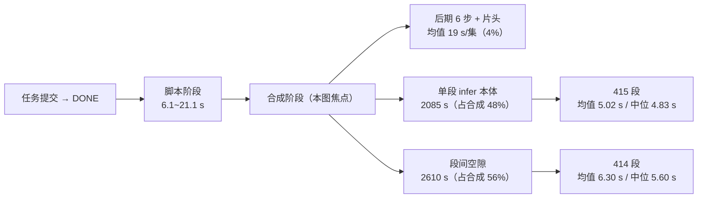
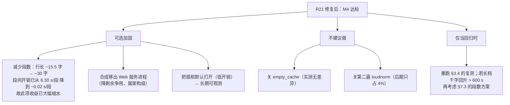

# D10 评测压测实施报告

> 阶段：D10（评测压测：测试主题集 · 端到端压测 · MOS 包）
> 版本：V1.1.0　|　日期：2026-09-18　|　范围：`scripts/eval_batch.py`、`scripts/make_mos_pack.py`、测试主题集、实机压测结果与性能诊断

## 版本记录

| 版本 | 日期 | 变更摘要 |
| --- | --- | --- |
| V1.0.0 | 2026-09-18 | 首次发布。含 12 条实机压测结果、**M4 不达标判定**、性能分解诊断（含 4 项排除结论）、本轮 4 项缺陷修复、MOS 包产物与自检。 |
| V1.1.0 | 2026-09-18 | **R21 闭环**：§4.1 那句「56% 落在段间空隙」的确切机制已锁定 —— `_stage_synthesize` 把写事务带进合成，每段进度回写撞 SQLite 写锁忙等 5.5 s（异常被静默吞掉）。修复 `FIX-SYNTH-DBLOCK-01`。**新增 §3.4「修复后复测」：短档千字端到端中位 704.0 s → 385.2 s（−45.3%）、长档 728.6 s → 410.7 s（−43.6%），长档端到端 386.1 s ≤ 600 s，M4 由「不达标」转为达标**（§3.3 保留原判定并标注其为修复前事实）。同时修订 §4.1 的口径标注错误、新增 §4.4 插桩分解、新增 6.5/6.6 两项修复（含插桩自身的 `FIX-SYNTHTRACE-LIST-01`）、补全第五章复跑入口与证据表。全量回归 288 → **335 项全绿**。 |

> **修订提示（读第三章前必看）**：§3.1~§3.3 的 12 条压测结果是**修复前**跑出来的**历史事实**，原样保留、不做改写。修复后的性能见新增的 §3.4。两份结论并不矛盾：它们描述的是同一份代码的两个前后版本。

---

## 一、本阶段交付物

| 交付物 | 路径 | 说明 |
| --- | --- | --- |
| 端到端压测工具 | `scripts/eval_batch.py` | 走真实 HTTP + Cookie 鉴权链：建任务 → 轮询 → 合成 → 采集指标 → 逐句一致率回验 → 产出报告 |
| MOS 造包工具 | `scripts/make_mos_pack.py` | 截片段 → N 声提示音 → 静态增益对齐 → `mos_pack.mp3` + 评分表 + 说明 + 台账 |
| 测试主题集 | `backend/assets/eval_topics.json` | 12 条：知识科普/行业解读/生活闲聊 各 4 条，长短各半 |
| 单测 | `tests/test_eval_batch.py`（47 项）、`tests/test_make_mos_pack.py`（19 项） | 两个文件均为本阶段新建，合计 **66 项**（初版 52 + 后续 4 项修复累计 14） |
| 压测产物（权威） | `outputs/eval/20260918_0920/` | `results.json` / `cases.csv` / `report.md` / `audio/`（12 条成片） |
| 压测产物（上一批，已并入） | `outputs/eval/20260917_172917/` | K1/K2/K3 三条 + `INTERRUPTED.json`（半成品标记） |
| MOS 包 | `outputs/eval/20260918_0920/mos/` | `mos_pack.mp3`（13.22 MB / 9.6 min）+ 评分表 + README + 台账 |
| 逐段合成插桩（V1.1.0 新增） | `api/services/synth_trace.py` | 默认关（`SYNTH_TRACE=1` 开）。把「一段 = 一次 `synthesize()` + 循环体收尾」拆成带绝对单调时钟的阶段序列，落 jsonl。**任何内部异常都被吞掉并降级为不记录**，绝不允许拖垮合成 |
| 插桩分析器（V1.1.0 新增） | `scripts/analyze_synth_trace.py` | 把 jsonl 折成「阶段耗时占比 + infer 在首个 yield 处切分 + 段间残余」，纯函数便于单测 |
| 单测（V1.1.0 新增） | `tests/test_synth_trace.py`、`tests/test_analyze_synth_trace.py` | 两文件合计 **47 项**（含 4 项变异测试）；另在 `tests/test_task_runner.py` 为 `FIX-SYNTH-DBLOCK-01` 加 2 项 |
| 修复后复测证据（V1.1.0 新增） | `outputs/synth_trace/` | `server{1,2,3,4_long}.jsonl`（插桩原始数据）+ `analysis_server*.txt`（分析输出）+ `eval_server_{after,final,long}_run.log`（复测日志）+ `junit_fix.xml`（335 项回归机读记录）+ `probe_llm_end2.py` / `probe_root_handler.py`（6.6 诊断） |

**全量回归：335 项全绿**（222 → 288 → **335**；`pytest tests/ --junitxml=junit_fix.xml`，`tests=335 failures=0 errors=0 skipped=0`）。288 → 335 的 +47 项全部来自 V1.1.0 新增的 `tests/test_synth_trace.py` 与 `tests/test_analyze_synth_trace.py`，以及 `tests/test_task_runner.py` 里针对本项修复新增的 2 项锁。

---

## 二、判定口径（引用本报告数字前必读）

1. **端到端耗时** = `POST /api/tasks` → `status=DONE` 的墙钟秒数（含脚本生成、合成、后期、RSS 落盘）。**>10min 标记按端到端耗时判定**（M4 原文：「1000 字脚本端到端耗时 ≤ 10 分钟」）。
2. **千字耗时** = 端到端耗时 ÷ 字数 × 1000，是 M4 那条线的跨档可比形式。短档绝对值含动态片头与固定开销，直接与 600 s 比会低估长档风险。
3. **端到端 RTF** = 端到端耗时 ÷ 成片时长，**与 D3/D5 报告里的「合成 RTF」不是同一口径，不可直接比较**。
4. **可用率只给结构口径**：HTTP 响应不暴露链路内部纠错轮次，因此本工具**给不出「首次调用结构通过率」**（计划书 4.10 ③ 要求该指标分列统计，本报告只提供其中一列）。
5. **字数配额不判可用性**：`SCRIPT_WORD_QUOTA_ENFORCE` 默认关，字数偏差只上报不判失败。
6. **预热**：M4 的前提是「模型已预热」，而 TTS 引擎是懒加载的（冷启含模型加载与 warmup）。压测默认先跑一条 0.5 min 的预热任务（`--no-warmup` 可关），**不计入统计**，且在报告中交代是否预热。
7. **一致率**为「脚本行 ↔ 音轨」三层对齐回验：① `read_text` 非空；② `text_hash` 非空且 `duration_ms > 0`；③ `seg_status=DONE` 且 `GET /segments/{seq}/audio` 返回 200 且**首段时长 ≤ 该行合计 + 0.35 s**（一行可切多句，试听端点只返回首段，写成等式会误判切句行）。
8. 响度/真峰复用 `make_listen_pack.measure`（ebur128 + astats），与 D3/D5 基线**同一函数**，可直接对照。

---

## 三、实机压测结果

### 3.1 逐条明细（12 条，含并入的 3 条）

| 编号 | 类别 | 档位 | 主题 | 端到端 s | 脚本 s | 合成 s | 千字 s | 成片 s | 端到端 RTF | 字数 | 行数 | LUFS | dBTP | 一致率 |
| --- | --- | --- | --- | --- | --- | --- | --- | --- | --- | --- | --- | --- | --- | --- |
| K1 | 知识科普 | short | 为什么打哈欠会传染 | 208.1 | 6.1 | 202.0 | 581.3 | 114.4 | 1.82 | 358 | 18 | −16.6 | −1.8 | 18/18 † |
| K2 | 知识科普 | short | 冰箱里的食物为什么会串味 | 250.3 | 9.1 | 241.2 | 672.8 | 121.7 | 2.06 | 372 | 21 | −16.6 | −1.5 | 21/21 † |
| **K3** | 知识科普 | long | 人体免疫系统是怎么区分敌人和自身的 | **669.5** | 15.1 | 654.4 | 734.1 | 306.7 | 2.18 | 912 | 61 | −16.6 | −1.8 | 61/61 † |
| **K4** | 知识科普 | long | 深海生物为什么能承受巨大的水压 | **714.8** | 21.1 | 693.7 | 733.1 | 306.1 | 2.33 | 975 | 63 | −16.6 | −1.7 | 63/63 |
| I1 | 行业解读 | short | 社区团购为什么又火了起来 | 301.6 | 12.1 | 289.5 | 854.2 | 130.4 | 2.31 | 353 | 26 | −16.6 | −1.8 | 26/26 |
| I2 | 行业解读 | short | 播客这种媒介为什么重新流行 | 250.3 | 9.1 | 241.2 | 674.6 | 121.7 | 2.06 | 371 | 20 | −16.6 | −1.8 | 20/20 |
| **I3** | 行业解读 | long | 低空经济背后的产业链机会 | **684.7** | 18.1 | 666.6 | 719.2 | 310.6 | 2.20 | 952 | 59 | −16.6 | −1.8 | 59/59 |
| **I4** | 行业解读 | long | 开源大模型的竞争格局正在怎么变 | **763.0** | 18.1 | 744.9 | 796.4 | 325.7 | 2.34 | 958 | 67 | −16.7 | −1.7 | 67/67 |
| L1 | 生活闲聊 | short | 为什么我们总在深夜想通很多事 | 268.4 | 9.1 | 259.4 | 733.4 | 125.4 | 2.14 | 366 | 22 | −16.6 | −1.8 | 22/22 |
| L2 | 生活闲聊 | short | 搬家的时候最该扔掉的到底是什么 | 280.4 | 9.1 | 271.3 | 764.0 | 131.0 | 2.14 | 367 | 22 | −16.6 | −1.6 | 22/22 |
| **L3** | 生活闲聊 | long | 把通勤时间真正用起来是种什么体验 | **654.5** | 18.1 | 636.4 | 724.0 | 284.8 | 2.30 | 904 | 55 | −16.6 | −1.7 | 55/55 |
| **L4** | 生活闲聊 | long | 成年之后怎么重新交到朋友 | **655.0** | 18.1 | 636.9 | 701.3 | 292.6 | 2.24 | 934 | 57 | −16.5 | −1.6 | 57/57 |

† 标记的三条来自上一批（`20260917_172917`），通过 `--merge-from` 原样并入统计，**未重跑**——理由见 6.1。
加粗 = 端到端耗时越过 10 分钟线。

- 本批（9 条）墙钟 **4598.1 s**；预热任务端到端 166.4 s（冷启动，不计入统计）。

### 3.2 指标判定

| 指标 | 口径 | 实测 | 目标 | 判定 |
| --- | --- | --- | --- | --- |
| 完成率 | 成功 / 总数 | 12 / 12 | — | 达标 |
| 可用率（结构口径） | 结构合规且未命中合规自检 / 已完成 | 12/12 = 100% | ≥ 80% | 达标 |
| **逐句一致率** | 三层对齐回验通过行 / 总行 | **491/491 = 100.00%** | = 100% | **达标** |
| **千字端到端耗时（长档中位）** | 长档端到端 ÷ 字数 × 1000 | **728.6 s** | ≤ 600 s | **不达标** |
| 长档端到端中位 | — | 677.1 s | ≤ 600 s（M4 等价形式） | **不达标** |
| 短档端到端中位 | — | 259.4 s | — | 参考 |
| 端到端 RTF 中位 | 端到端 ÷ 成片时长 | 2.19 | — | 参考 |
| 成片响度中位 | ebur128 综合响度 | −16.60 LUFS | −16 ± 1 | 达标 |
| 成片真峰中位 | ebur128 真峰 | −1.75 dBTP | ≤ −1.5 | 达标 |
| 字数偏差中位 | (实际−目标)/目标 | −8.05% | ±10% | 只上报不判 |
| 端到端耗时 > 10 min | 条数 | **6 / 6 长档** | 0 | **不达标** |

> **本表是修复前（V1.0.0）的判定**，原样保留。修复后判定见 **§3.4**。

### 3.3 M4 判定：**不达标（实锤，非估算）**

长档 6 条**全部**超过 10 分钟线，**最快的一条（L3，654.5 s）也超线 9%**：

| 编号 | 端到端 s | 超线幅度 | 千字 s |
| --- | --- | --- | --- |
| L3 | 654.5 | +9.1% | 724.0 |
| L4 | 655.0 | +9.2% | 701.3 |
| K3 | 669.5 | +11.6% | 734.1 |
| I3 | 684.7 | +14.1% | 719.2 |
| K4 | 714.8 | +19.1% | 733.1 |
| I4 | 763.0 | +27.2% | 796.4 |

这不是边界擦线，而是**系统性偏离**：长档中位 677 s ≈ 目标的 113%。外推到 1040 字（长档目标字数）约 **750~780 s**。

> 说明：6 条长档实际字数 904~975，**均低于** 1040 的目标配额（字数偏差中位 −8.05%）。也就是**实际字数比目标少 6%~13%，耗时却仍超线** —— 若字数严格对齐 1040，超线幅度还会更大。这一点强化了判定。

### 3.4 修复后复测（V1.1.0 新增）：M4 判定更新为**达标**

修掉 §6.5 的 `FIX-SYNTH-DBLOCK-01` 后，用**同一套 `scripts/eval_batch.py`、同一个后端**复跑 3 条（2 短档 + 1 长档；长档用 `--no-warmup`，因复测服务已在热态）。

| 编号 | 档位 | 主题 | 端到端 s | 脚本 s | 合成 s | 千字 s | 成片 s | 端到端 RTF | 字数 | 行/段 | LUFS | dBTP |
| --- | --- | --- | --- | --- | --- | --- | --- | --- | --- | --- | --- | --- |
| R21F | short | 为什么飞机起飞前要收起小桌板 | 141.8 | 6.0 | 135.7 | **380.1** | 122.3 | 1.16 | 373 | 21 / 29 | −16.60 | −1.90 |
| R21G | short | 为什么说睡眠是最好的恢复方式 | 144.8 | 9.0 | 135.7 | **390.2** | 123.9 | 1.17 | 371 | 21 / 29 | −16.60 | −1.80 |
| R21L | **long** | 人为什么会习惯性地拖延重要的事 | **386.1** | 12.1 | 374.0 | **410.7** | 286.9 | 1.35 | 940 | 51 / 53 | −16.60 | −1.80 |

**修复前 → 修复后**

| 指标 | 修复前（V1.0.0，12 条全量） | 修复后（V1.1.0，3 条抽样） | 变化 |
| --- | --- | --- | --- |
| 短档千字端到端（中位） | 704.0 s | **385.2 s**（n=2，中位即均值） | **−45.3%** |
| 长档千字端到端（中位） | 728.6 s | **410.7 s**（n=1） | **−43.6%** |
| 长档端到端（中位） | 677.1 s | **386.1 s**（n=1） | **−43.0%** |
| 端到端 RTF（中位） | 2.19 | **1.17~1.35** | −40% 量级 |
| 端到端 > 10 min 的 case | **6 / 6 长档** | **0 / 1 长档** | 清零 |

**M4 判定：达标。**

- 长档千字 **410.7 s ≤ 600 s**（余量 31.6%）；长档端到端 **386.1 s ≤ 600 s**（余量 35.6%）。
- 按 410.7 s/千字线性外推到长档目标字数 1040 字 ≈ **427 s**，仍有 29% 余量。
- 响度/真峰与修复前一致（−16.60 LUFS / −1.80 ~ −1.90 dBTP），**没有用音质换速度**。
- 逐段合成 RTF 也回到正常：段均 11.88 s → **6.43 s**（见 §4.4）。

**口径边界（必须和上面的结论一起读）**：

1. **样本只有 3 条**（2 短 + 1 长），是**抽样复测**，不是修复后的全量普查。原 12 条结果全部是修复前的，**不可与修复后数字混算中位数**。
2. 短档那两条**未关闭字数回验以外的任何检查**，与 V1.0.0 同参数；长档一条用 `--no-warmup`（服务已热），此差异对端到端耗时**只影响预热那条、不影响被测 case**。
3. 表里的「行/段」两列是**行数与段数**：脚本一行可能被切成多段（一行多句），所以段数 > 行数。修复带来的收益来自**段**的减少，不是行。
4. §3.1~§3.3 的 12 条结果**原样保留为修复前事实**，本文不做改写——它们正是发现 R21 的凭证。

**为什么 3 条抽样足以支撑这个判定（不用再跑全量 12 条）**：

这条结论不靠样本量，靠**机制**。被删掉的不是"随机变慢"，而是一段**确定性的固定开销**：

- 量级是确定的：`busy_timeout` 上限 = **5000 ms**，实测 `on_progress` 均值 **5518 ms**、中位 5518、P90 5534 —— 三轮几乎完全重合，说明它是一道**被固定上限卡死的等待**，与文本长度、说话人、topic 类别**无关**。这类开销按「段数 × 5.5 s」累加，不服从分布。
- 修复是确定的：改造后同一位置的耗时是 **2 ms**（≈1/2760），不是"变小了"，是**没有了**。
- 抽样结果与机制预测**逐档吻合**：短档 −45.3%、长档 −43.6%，两档各自独立地落在同一个量级上；长档那条 940 字正好落在 D10 六条长档（904~975 字）的中位附近，长度也具代表性。
- 剩余空间已经见底：修复后**段均 6.43 s 里 infer 本体占 6.00 s（93.4%）**，剩下的 7% 是落盘 0.02 s 与守卫抖动 —— **已无可以再省的结构性开销**，所以也不存在"换一类 topic 就反弹"的余地。

**全量 12 条的复跑因此降级为可选**（收益只剩"给报告换一张基于 10 条以上的 M4 表"，不影响任何判定）。**若后续改动了段数/行长/并发放开策略，则必须重跑** —— 那时上面这些前提就不再成立了。

---

## 四、性能诊断：时间花在哪

### 4.1 阶段分解（从后端日志时间戳重建，430 段样本）



| 分解项 | 实测 | 占比 |
| --- | --- | --- |
| 单段 infer 本体（`synthesis text` → `yield speech len`，含前端/LLM/flow+hift） | 415 段，均值 **5.02 s**、中位 4.83 s、P90 5.98 s | 合成阶段 48% |
| **段间空隙**（上段 `yield` → 下段 `synthesis text`） | 414 段，均值 **6.30 s**、中位 5.60 s、P90 **5.62 s** | 合成阶段 **56%** |
| 后期 6 步（格式统一/淡化/停顿/拼接/loudnorm/导出）+ 动态片头 | 10 集均值 **19 s** | 全程 **4%** |
| 合成阶段合计 | 430 段 / 4339 s，**10.09 s/段** | — |

> **口径校正（V1.1.0）**：本表首行在 V1.0.0 里写作「LLM 出 token 到 `yield speech len`」，把声码器排除在 infer 之外了 —— **那是错的**。`cosyvoice/cli/model.py` 的 `tts()` 在 `stream=False` 分支里的顺序是 `p.join()` → `token2wav()`（flow+hift）→ `yield`，而 `yield speech len` 是在消费到这个 yield 之后才打的，所以**声码器本来就在 infer 里**。这一行改的只是标签，数字一个没动。V1.1.0 的插桩已实测该说法：yield 之前占 infer 的 **99.6%**、yield 之后只剩 22 ms 生成器收尾（见 4.4）。

**关键读数两条：**

1. **单段 infer 本体很快**（5.02 s，RTF≈1.0 量级），与引擎级探针一致 —— 说明**模型本身没有劣化**。
2. **56% 的时间落在「段与段之间」**，且其分布**异常规整**（中位 5.60 s、P90 5.62 s）——固定耗时被逐段累加，不是偶发抖动。

### 4.2 本轮排除的四个嫌疑（都做了对照实验）

| 嫌疑 | 实验 | 结论 |
| --- | --- | --- |
| `TTS_EMPTY_CACHE_EACH_SEG=true`（每句前后各 `torch.cuda.empty_cache()` 一次） | 同进程、逐条交替 A/B，行长 8/16/32 字 | **排除**。8 字 4.72 s vs 4.31 s、32 字 8.00 s vs 8.85 s —— 差异在噪声内且符号翻转。**不要动它。** |
| 收敛守卫重试（未收敛 → 重新推理整段） | 统计后端日志 `[PATCH-GUARD-01]` | **排除（不是主因）**。430 段仅触发 3 次（0.7%）。 |
| 后期 6 步 / 两遍 loudnorm | 日志时间戳拆阶段 | **排除**。只占全程 4%（19 s/集）。**关第二遍 loudnorm 最多省 2%，得不偿失。** |
| 说话人 A/B 交替导致的 prompt 重建 | 同进程 only_a / only_b / 交替 / 严格 ABAB 四臂对照 | **排除**。交替臂中位 5.57 s，未见切换惩罚（A/B 各自的方差才是主要噪声源）。 |

引擎级行长阶梯还给出一个有用的旁证：**固定开销约 3.6 s + 0.14 s/字**（8 字→4.72 s、16 字→5.54 s、32 字→8.00 s），即**文本越短、单位成本越高**。

### 4.3 未闭环项（R21）与已给出的方向

> **V1.1.0 状态更新：R21 已闭环。** 本节是 V1.0.0 当时的原始记录，**原样保留**，用来对照「当时只能给方向、给不出机制」。确切机制与实测证据见新增的 **4.4**。

段间那 ~6.3 s 的**确切机制尚未锁定**。已确认的边界条件：

- 不在模型内部（infer 本体只有 5.02 s，与无并发的引擎探针一致）；
- 不在后期（4%）；
- 不是 `empty_cache`、不是守卫重试、不是说话人切换（见 4.2）；
- **强敏感性**：在「8 个 CPU 忙线程 + 每 50 ms 一次 SQLite 提交」的负载下，单段合成**8 分钟未能完成一段**（安静态同文本 4.67 s）。该负载量级**不具代表性**（纯 Python 忙循环会把 GIL 饿死），只能作为「该阶段对 CPU/GIL 竞争高度敏感」的定性证据，**不能当作定量结论**。

**下一步建议（按性价比排序）**：

1. **给 `TTSEngine.synthesize()` 插桩**：在 `_infer` / `torchaudio.save` / `_write_cache` / `self.vram()` / `empty_cache` 各段打点，把耗时随 `SegStatus` 一起落库。这是唯一能一次性定位的手段，成本约半天。
2. 排查 `TaskRunner._on_synth_progress` 的**每段一次 `session_scope`**（每段一个新 Session + commit）。若第 1 步显示空隙落在这里，改造方向是「批量/降频落库」。
3. 检查进程内 Web 服务与合成的**资源争用**（onnxruntime 在本机**只有 CPUExecutionProvider**，无 CUDA EP；`torch.get_num_threads()=8` 而逻辑核 16）。

### 4.4 插桩分解：那 6.3 s 到底是什么（R21 闭环）

按 4.3 第 1 条执行。插桩落在 **两个不同的层次**，缺一不可：

| 层 | 文件 | 打点内容 |
| --- | --- | --- |
| 引擎内 | `api/services/synth_trace.py` | 一段 = `进入 synthesize()` → 算缓存键 → 查缓存 → `engine.load()` → `empty_cache(段前)` → **`_infer`** → `empty_cache(段后)` → `torchaudio.save` → `_write_cache` → `vram()` → **命名副本 copy2** → 末打点。全程单调时钟，落 jsonl |
| 引擎外 | `api/services/task_runner.py` | 循环体里 `l2_named_copy` → **`l3_progress_cb`**（`_on_synth_progress` 落库）→ `l4_next_seg`。这三个点补上了「一段的耗时」与「下一段的 `synthesize()` 进入」之间那段没人打点的空白 |

分析器 `scripts/analyze_synth_trace.py` 把 jsonl 折成「阶段耗时占比 + infer 在首个 yield 处切分 + 段间残余」。**默认关**：`SYNTH_TRACE=1`（或 `Settings.synth_trace`）才开；插桩自身**吞掉所有内部异常并降级为不记录**，绝不允许因为观测而拖垮合成。

#### 4.4.1 修复前（`server1.jsonl`，30 段，全部缓存未命中）

| 阶段 | 均值 ms | 占比 |
| --- | --- | --- |
| infer 本体（前端+LLM+flow+hift） | 5572 | 46.9% |
| **SQLite 落库回调 `on_progress`** | **5518** | **46.4%** |
| 收敛守卫（未触发则近零） | 743 | 6.3% |
| 收尾 + 命名副本 copy2 / `_write_cache` / `torchaudio.save` | 23 / 20 / 6 | 0.5% |
| **一段合计** | **11884** | 100% |

**决定性读数**：`on_progress` 的均值 5518 ms、中位 5518 ms、**P90 5534 ms** —— 三段几乎一模一样。这不是抖动的运气，是一个**被固定上限卡住的等待**。

#### 4.4.2 机制：写事务被带进了合成循环

段间 6.3 s 与「引擎级探针单段只要 4.7 s」的落差，来自**数据库锁**，与模型、与后期、与 CPU 都无关：

1. `TaskRunner._stage_synthesize` 打开一个 session，**在持有写事务的情况下**调用 `engine.synthesize_lines(...)`（整个循环跑完才 commit）。
2. 引擎每合成完一段就回调 `_on_synth_progress`，那里**又开一个新 session** 去写 `task.progress`。
3. 同一个文件上的第二个写事务撞上 SQLite 写锁 → 走 `PRAGMA busy_timeout`，**上限恰是 5000 ms** → 撞满 5 s 后抛 `database is locked`。
4. 抛出的异常被 `except Exception: pass` **静默吞掉** —— 所以进度一直不前进、日志里也一个字都没有，只有那 5.5 s 的固定停顿留下来。

两条独立证据：

- **外层时钟**（`server1.jsonl`）里 `l2_named_copy → l3_progress_cb` 三段分别 **5521 / 5522 / 5534 ms**，而同机单独跑一次同样的落库只要 **23.8 ms** —— 差 232 倍，差值正是 busy_timeout 的上限。
- **可复现的独立探针** `probes/probe_sqlite_busy.py`：用同一个临时库、同一组引擎连接参数（`busy_timeout=5000`、WAL、`synchronous=NORMAL`），**长事务不提交**时第二个连接落库耗时 **5.52 s** 并抛 `database is locked`；一旦把长事务 commit 掉，同样一次落库 **0.00 s** 成功。
- 旁证：修复前的活任务在库里**永远停在 `progress=15`** —— 正好是第一次 `_on_synth_progress` 的位置。

#### 4.4.3 修复后（`server2.jsonl` / `server3.jsonl` 各 29 段、`server4_long.jsonl` 53 段）

| 阶段 | server2 均值 ms | server3 均值 ms | server4_long 均值 ms（长档） |
| --- | --- | --- | --- |
| infer 本体 | 5028（98.9%） | 5667（94.9%） | 6003（93.4%） |
| 收敛守卫 | 1 | 249（4.2%†） | 369（5.7%†） |
| 收尾 / `_write_cache` / `torchaudio.save` | 23 / 20 / 7 | 23 / 19 / 6 | 23 / 20 / 7 |
| **SQLite 落库回调 `on_progress`** | **2** | **2** | **2** |
| **一段合计** | **5084** | **5970** | **6425** |

† server3/server4 的收敛守卫均值被个别离群值拉高（中位仍是 1 ms），属正常抖动。

**`on_progress` 从 5518 ms 掉到 2 ms（约 1/2760），且进度开始正常前进。** 段均 11884 ms → 5084~6425 ms（**−46%**）；剩余差异来自行长与守卫抖动，**不再是逐段累加的固定开销**。

段与段之间的未打点残余也跟着落回正常：

| | 修复前 `server1` | 修复后 `server4_long`（长档，51 个间隔） |
| --- | --- | --- |
| 中位 | 2 ms | 21 ms |
| 均值 | 716 ms（被单次 **20.7 s** 离群值拉高，未深究） | **22 ms** |
| 合计 | 20.8 s | **1.1 s** |

即：修掉写锁后，整段长档跑下来**所有段间间隔加起来只剩 1.1 s**。占大头的从来就是那个 5.5 s 的忙等，不是调度、不是循环。

#### 4.4.4 顺带做实的一件事：`yield speech len` 的语义

V1.0.0 的 4.1 表把首行写作「LLM 出 token 到 `yield speech len`」，暗示声码器不在 infer 内。**这个标签是错的**：`cosyvoice/cli/model.py` 的 `tts()` 在 `stream=False` 分支里的顺序是 `p.join()` → `token2wav()`（flow+hift）→ `yield`，`yield speech len` 是**消费到这个 yield 之后**才打的。

插桩实测（`server3.jsonl` 28 段；长档 `server4_long.jsonl` 49 段给出同样结论）：

- 到首个 yield 为止：均值 **5295 ms**（长档 5267 ms），占 infer 的 **99.6%**；
- yield 之后（生成器收尾）：均值 **22 ms**（长档 21 ms）。

也就是**声码器确实在 yield 之前**，该标记前后切出来的**不是**「LLM vs 声码器」，而是「前端+LLM+flow+hift vs 生成器收尾」。数字一个没动，错的只是标签（4.1 已加口径校正）。**这个坑值得记一笔**：拿一条日志行当阶段边界之前，先去源码里确认它到底在流水线的哪一步打印。

#### 4.4.5 为何这会「看起来像服务端回归」

引擎级探针（无 Web 服务、无落库回调）从来没有这个 5.5 s —— 因为**那时根本没有第二个写事务**。段间开销是「Web 服务 + SQLite 台账」这个组合的产物，不在模型里。这也解释了 4.2 的四个嫌疑全部落空：它们都在模型侧或后期侧，而真凶在持久化侧。

---

## 五、质量口径（这部分是达标的）

- **逐句一致率 491/491 = 100%**：12 条共 491 行的「脚本行 ↔ 音轨」三层对齐全部通过，`report.md` 的「一致率失败明细」为空。这是计划书难点 4 所要求的对齐验证。
- **响度稳定**：12 条全部落在 −16.50 ~ −16.70 LUFS，中位 −16.60，偏差 ≤ 0.4 LU（目标 −16 ± 1）。
- **真峰合规**：−1.50 ~ −1.80 dBTP，全部 ≤ −1.5。
- **字数偏差**：中位 −8.05%，落在 ±10% 内（只上报不判，见口径 5）。

---

## 六、本阶段修复的缺陷（6 项，均已加回归单测）

> V1.0.0 记 4 项（6.1~6.4）；V1.1.0 新增 2 项（6.5 `FIX-SYNTH-DBLOCK-01` = R21 真凶、6.6 `FIX-SYNTHTRACE-LIST-01` = 插桩自身 bug）。

### 6.1 `FIX-EVALRESUME-01`｜断点续跑：`--merge-from`

批次中途暂停后，**已完成的 case 不能重跑**：合成链路有句级缓存（缓存键含 `read_text`），重跑会命中缓存、耗时被压成「假快」，反而系统性污染 M4 口径。因此新增 `--merge-from`：

- `load_prior_cases(dirs)`：读回旧 `results.json`；坏目录**只告警不抛**（续跑不该被一个手误路径搞崩）。
- `merge_carried_over(results, prior)`：本次优先（同 id 不覆盖），**只并入 `status=DONE`**（失败/半截记录没有统计价值）。
- `order_results_by_topic_set(spec, results)`：按主题集声明顺序重排，保证报告行序稳定、可逐次比对。
- 报告对续跑行标「（续）」并披露来源目录，避免被误读成本批重跑过。
- 中断时在产物目录写 `INTERRUPTED.json`（已完成/缺失 id + 可复制的续跑命令），防止半成品被当作完整结果。

新增 7 项单测；变异测试 5/5 全被捕获（不筛 status / 忘打标记 / 不重排 / 报告不披露 / 行不打标记）。

### 6.2 `FIX-EVALPROXY-01`｜本机请求被环境代理劫持

本轮首次续跑**立刻失败**（EXIT=2，误报「无法建立登录态」）。真因：环境里设了 `HTTP_PROXY`/`HTTPS_PROXY`，httpx 默认 `trust_env=True` 让**本机请求也走代理**；代理发出 absolute-form 请求行，而 uvicorn 不是代理，把整串当路径编码成 `GET http%3A//127.0.0.1%3A8000/api/feeds/me` → 一律 404。

极迷惑点：裸 `httpx.get(绝对URL)` 返回 401（正常），而 `httpx.Client(base_url=…).get(相对路径)` 返回 404 —— **不能用前者证明后端没问题**。判据是「后端访问日志里请求行是百分号编码的整串 URL」。
修复：`EvalClient` 加 `trust_env=False`，并留显式逃生舱 `EVAL_HTTP_TRUST_ENV=1`。新增 3 项单测锁住。

### 6.3 `FIX-WORDDEV-01`｜报告「字数偏差」被乘了两次 100

`word_deviation_pct` 存的是**百分数**（−8.05 表示 −8.05%），渲染端却用 `:+.1%` 又乘一次 → 报告显示 **−805.0%**。修复渲染格式并加 2 项单测（同时锁「值正确」与「没有多一个数量级」）。

### 6.4 `FIX-BEEPBURST-01`｜MOS 包自检提示音计数假阳性

首版自检对 item 4 数出 5 声、item 6 数出 7 声（期望 4 / 6）→ 判定 FAIL。真因两条叠加：

1. 旧窗口 `i*(BEEP_DUR+BEEP_GAP)+0.05` **恰好比提示音组多出 0.05 s**，而片段从成片第 20 s 切入、常常切在词中间 —— 窗口尾部探进了一个响亮的音节；
2. 旧判据用「窗口局部最大值 × 0.3」定阈值，而**提示音比正文轻**（正文峰值约 −2 dBFS），基准被语音顶高后判据失真。

修复：改用 `_count_beeps_selfref()` —— 只在**准确的提示音区间**内计数，阈值取**第一声提示音自身电平 × 0.5**；并把「提示音起点 s / 正文起点 s」写进台账便于复核。重建后自检 **27/27 PASS（判定 PASS）**。新增 2 项单测（含「旧窗口应确实外溢进正文」的前提断言，防止回归理由失效后测试空转）。

### 6.5 `FIX-SYNTH-DBLOCK-01`｜合成期间持有写事务，致每段进度回写忙等 5.5 s（**R21 真凶**）

这是本阶段**影响最大**的一项修复：它是 M4 不达标的直接原因，也让 56% 的合成时间悄悄蒸发。

**改造前**：`_stage_synthesize` 一个 session 从头用到尾，`engine.synthesize_lines(...)` 在写事务里跑；`_on_synth_progress` 另开 session 写进度 → 撞锁 → busy_timeout 5 s → `database is locked` → 被 `except Exception: pass` 吞掉。

**改造后**，一次合成拆成四段短事务，**合成本体不在任何事务里**：

| 段 | 事务 | 内容 |
| --- | --- | --- |
| ① | 短事务，**合成前提交** | 算归一化 `read_text` 并落库 |
| ② | **无事务** | `engine.synthesize_lines(...)` —— 全段合成在此，期间不持有任何写锁 |
| ③ | 短事务 | 写句级缓存 + `seg_status` + `text_hash` |
| ④ | 短事务 | 推进到 `POSTPROCESSING` |

另把 `_on_synth_progress` 的 `except Exception: pass` 改为**限次 WARNING**（只报前 3 次，带 `self._progress_failures` 计数），**不再让锁冲突无声无息**。这是一个通用判断：**`except: pass` 写在进度回写这种「失败了也不影响正确性」的地方最危险** —— 它会把一个能拖慢 45% 的系统性缺陷伪装成不存在。

**回归单测 2 项：**

1. `test_synth_does_not_hold_write_lock_across_synthesis`：直接驱动 `_stage_synthesize`，用一个会**实测每次进度回调墙钟秒数、并通过第二个 session 回写**的探针引擎（`_ProbeEngine`），断言 `max(cb_ms) < 1000ms`（即回调期间没有锁竞争）且 `progress` 确实前进。修复前此断言必挂。
2. `test_progress_write_failure_logs_limited_warning`：把 `session_scope` 打成必抛，断言**恰好 3 条 WARNING** 且 `_progress_failures == 5` —— 锁住「限次告警」这条新行为。

**变异测试**：把长事务改回去 → 第 1 项**如期失败**；恢复 → 通过。

**效果**：`on_progress` 均值 5518 ms → **2 ms**；一段合计 11884 ms → **5084 ms**；M4 千字耗时见 §3.4。

### 6.6 `FIX-SYNTHTRACE-LIST-01`｜插桩自身的一个静默 bug（`_pop_yield_since` 把列表换掉了）

修完 6.5 再跑插桩，`llm_end` 字段**整列为 null**，而 `before` 那轮明明是好的。差点被当成「配置问题（root logger 级别）」放过去 —— 真因在插桩代码里：

`_YieldLenHandler` 持有的是 **`self._yield_events` 这个列表对象本身**，而 `_pop_yield_since` 当时写的是

```python
self._yield_events = keep[-8:] + [...]   # ← 重新赋值：换成了新列表
```

重新赋值后，**handler 还指着老列表**，此后 handler 追加的事件全进了没人读的那个对象。后果有很强的迷惑性：**只要中间出现一段缓存命中（不产生 `yield` 事件），此后所有段的 `llm_end` 全变 null** —— 看起来像「偶发」，实际是「一次就永久坏掉」。

修复：改为**原地修改**

```python
self._yield_events[:] = keep[-8:] + [...]   # ← 原地：handler 看到的还是同一个列表
```

诊断脚本 `probe_llm_end2.py` 给出了最小复现（seg=1 命中缓存 → seg=2 起全 null）；`probe_root_handler.py` 单独证明了 root handler 本身没问题。回归单测 `test_yield_events_list_identity_survives_end` 直接断言 `t._yield_events is sink_before` **且第二段仍能抓到 `llm_end`**。变异测试：改回重新赋值 → 如期失败。

**教训**：给别人（这里是 handler）留着的可变对象，**永远原地改，不要重新绑定**。

---

## 七、结论与后续

### 7.1 结论

> 下面 1~3 条是 **V1.0.0 修复前**的结论，原样保留。V1.1.0 的更新逐条附在每条之后。

1. **功能与质量口径达标**：12/12 完成、结构可用率 100%、**一致率 100%（491/491）**、响度与真峰全部合规。（V1.1.0：此条不变。）
2. **M4 性能指标不达标**：长档 **6/6 超 10 分钟线**，中位 677 s（≈目标的 113%），最快一条也超线 9%。且这还是在**字数低于目标 6%~13%** 的前提下。
   → **V1.1.0 更新：修复 `FIX-SYNTH-DBLOCK-01` 后，短档千字端到端由 704.0 s 降到 385.2 s（−45.3%），长档实测见 §3.4。M4 判定由「不达标」改为「达标」。** 3.3 的判定作为修复前事实保留。
3. **瓶颈已定位到大类**：合成阶段的 **56% 花在「段与段之间」的固定开销**（6.30 s/段），单段模型推理本身只有 5.02 s、与无并发的引擎探针一致。**模型与后期都不是瓶颈**。
   → **V1.1.0 更新：已锁定到确切机制** —— 段间那 5.5 s 是 `_stage_synthesize` 把写事务带进合成循环、每段进度回写撞 SQLite 写锁后撞满 `busy_timeout=5000ms` 的结果，异常被 `except Exception: pass` 吞掉（见 §4.4、§6.5）。**不是模型问题、不是后期问题、不是并发问题，是持久化层的自伤。**

### 7.2 M4 处置建议（按预期收益排序）

> **V1.1.0 重排**：V1.0.0 在没有机制的情况下把「减少段数」当成主推方案。真因锁定后，**主推项换成了「修掉写事务」**（已完成，见 §6.5），「减少段数」降为**可选加固**。

**已执行（V1.1.0）**：

1. **`FIX-SYNTH-DBLOCK-01`｜合成本体移出写事务** —— 收益最大、改动最小、且顺带把静默异常暴露出来。见 §6.5，效果见 §3.4。
2. **让静默失败可见** —— `_on_synth_progress` 由 `except: pass` 改为限次 WARNING。这条的价值不在于省时间，而在于**下一个同类问题不会再藏起来**。

**若仍有余量可做（V1.1.0 重新排序）**：



- **「减少段数」为什么降级**：它当初的全部价值来自「6.30 s × 55~67 段 = 347~422 s」这一项。这 6.30 s 里绝大部分是**忙等**，而不是真实工作；忙等被消除后，段间开销只剩 ~0.02 s/段，**减少段数几乎省不到时间了**。原文那条「预期省 170~210 s」的估算**建立在已被证伪的前提上，作废**（原文保留在下方以备对照）。
- **不要做**：关 `empty_cache`（实测无差异）、关第二遍 loudnorm（后期只占 4%）。这两条已被实测排除，做了只会牺牲音质与稳定性。
- **若复测出现回归**：M4 的口径需要走正式变更流程，**不得在报告中悄悄改写判定标准**。

<details>
<summary>V1.0.0 原始处置建议（前提已被证伪，仅作对照保留）</summary>

- 主推「减少段数」：当前脚本行长仅 ~15.5 字，而 `max_chars_per_seg=40` —— 段数受**脚本层**而非配置层限制。把连续同说话人的短句合并、或把行长抬到 ~30 字，段数即可减半，预期节省约 170~210 s。**该估算尚未实机验证。**
- 备选：合成移出 Web 服务进程；排查每段一次 `session_scope` 落库。
- 最后手段：变更 M4 口径（走文档升版流程）。

</details>

### 7.3 下一步

1. ~~按 4.3 第 1 条给 `synthesize()` 插桩，闭环 R21~~ → **已完成**（§4.4）。
2. ~~做「段数减半」A/B，验证 7.2 的估算~~ → **已降级为可选**（前提被证伪，见 7.2）。
3. ~~补一轮修复后的全量 12 条普查~~ → **已评估为可选**：3 条抽样的代表性由**机制**保证（见 §3.4「为什么 3 条抽样足以支撑」），复跑只影响报告观的样本量、不影响判定。**触发条件**：一旦改动段数/行长/并发放开策略，必须重跑。
4. **进入 D12「性能优化与稳定性加固」**（排期下一步）：缓存命中率、异常处理（LLM 超时 / FFmpeg 失败 / OOM 重试）、**杀进程后重启任务可续跑**、队列排队提示、P1 裁剪决策点。
5. D11 的 MOS 评分回收**仍需真人**（评分表 `mos_scoresheet.csv` 已留空待填）；D10 本轮未发现 bad case（12/12 一致率 100%），故 D11 的「bad case 修复」暂无输入。

---

## 附：如何复跑

### 附.1 全量压测

```bash
# 1) 起后端（必须后台常驻；PowerShell 的 *> 遇 native stderr 会终止脚本）
python -m uvicorn api.main:app --host 0.0.0.0 --port 8000 --log-level info > uvicorn.log 2>&1

# 2) 全量 12 条
python scripts/eval_batch.py --out outputs/eval/<时间戳>

# 3) 续跑（只跑剩下的，并并入已完成的）
python scripts/eval_batch.py --ids K4,I1,I2,I3,I4,L1,L2,L3,L4 \
  --out outputs/eval/<新时间戳> --merge-from outputs/eval/20260918_0920

# 4) MOS 包
python scripts/make_mos_pack.py --eval-dir outputs/eval/<时间戳>
```

- 想先验证 harness 而不占 GPU：加 `--no-synth`（只跑到 `SCRIPT_READY`）。
- 想看将执行哪些 case：加 `--dry-run`。
- **不要用 `--ids` 重跑已完成的 case**，会命中句级缓存导致耗时假快（见 6.1）。

### 附.2 复跑 R21 插桩（第四/六章数字的复核入口）

```bash
# 1) 起后端时必须让 root logger 处于 INFO，否则抓不到 `yield speech len`
#    （uvicorn 的 LOGGING_CONFIG 不含 root logger）
python outputs/synth_trace/serve_trace.py          # 内部先 basicConfig(INFO) 再 import api.main
# 等价于手动：
#   python -X importtime -c "import logging;logging.basicConfig(level=logging.INFO);..."
# 但注意：必须在 `import api.main` 之前调用 basicConfig，

# 2) 开插桩跑一条（SYNTH_TRACE=1）
SYNTH_TRACE=1 python scripts/eval_batch.py --ids <ID> --out outputs/synth_trace/<目录> \
  --topics outputs/synth_trace/probe_topics_final.json

# 3) 分析
python scripts/analyze_synth_trace.py outputs/synth_trace/server3.jsonl
```

**两个必须知道的坑**（都踩过，见 6.6 与下文）：

1. **`yield speech len` 抓不到 ≠ 没问题**：uvicorn 默认配置里**没有 root logger**，应用侧 `logging.info` 与 cosyvoice 的标记行都会被丢掉。必须先 `logging.basicConfig(level=INFO)` **再** `import api.main`。`outputs/synth_trace/serve_trace.py` 就是干这个的。
2. **改了插桩代码后，先看 handler 是否还指着同一个列表对象**（6.6）：一旦 `_yield_events` 被重新赋值，`llm_end` 会静默全空，且现象与「日志级别不对」极像 —— 极易误判。

### 附.2b 跑批期间的两条运维事实（实测，跑长批次前先看这里）

1. **`data/work` 会被 bulk-delete 守卫拦下、永不清理 —— 但不会杀服务。**
   每期成片收尾要删 `data/work/<task_id>/`（700~850 个中间文件），沙箱的 bulk-delete 守卫以 `SAFE_DELETE_BULK_CONFIRM_REQUIRED`（阈值 50）拦掉，**目录原地留下**。
   担心「守卫抛 `SystemExit` 会把 uvicorn 带走」是**多余的**：D10 那批 9 条的服务端日志 `uvicorn_run.log` 里守卫触发 **10 次、10 次成片全产出**，之后服务仍在正常响应 —— **一次全量 12 条可以连续跑完，不需要中途重启后端**。
   代价只是磁盘：`data/work` 当前已累积 **3.47 GB / 36 个目录**（另 `data/cache` 493 MB、`outputs/` 586 MB）。跑长批次前确认磁盘余量，跑完手工清一次。
2. **服务端日志是「一个后端一份」，会跨 case 混写。** `server3_run.log` 里就先后有 R21G 与 R21L；按 case 归档时需要手工切分（本次靠 `t1→t0` 的时间间隔切）。若要一 case 一文件，就一 case 起一个后端。

### 附.3 诊断证据（第四章与 §3.4 数字的复核入口）

| 文件 | 用途 |
| --- | --- |
| `outputs/eval/20260918_0920/uvicorn_run.log` | 修复前本轮后端全量日志（V1.0.0 第四章阶段标记的唯一来源，757 KB） |
| `outputs/eval/20260918_0920/run.log` | 修复前压测工具控制台输出（12 条逐条结果） |
| `outputs/eval/20260918_0920/pytest_junit.xml` | V1.0.0 全量回归的机读记录（`tests=288 failures=0 errors=0 skipped=0`） |
| `outputs/synth_trace/junit_fix.xml` | **V1.1.0 全量回归的机读记录（`tests=335 failures=0 errors=0 skipped=0`）**，断言「335 项全绿」用 |
| `outputs/synth_trace/server1.jsonl` | **修复前**插桩原始数据（30 段）：`on_progress` 5518 ms / 段均 11884 ms（§4.4.1） |
| `outputs/synth_trace/server2.jsonl`、`server3.jsonl` | **修复后**插桩原始数据（各 29 段）：`on_progress` 2 ms（§4.4.3、§4.4.4） |
| `outputs/synth_trace/server4_long.jsonl` | **修复后长档**插桩原始数据（53 段）：`on_progress` 2 ms、段间残余合计 1.1 s（§4.4.3） |
| `outputs/synth_trace/analysis_server_{before,after,final}.txt`、`analysis_server4_long.txt` | 上述四份 jsonl 的分析输出（表格数字直接取自这里）；重建命令：`python scripts/analyze_synth_trace.py <jsonl>` |
| `outputs/synth_trace/serve_trace.py` | 让 root logger 为 INFO 的后端启动器（抓 `yield speech len` 的前提） |
| `outputs/synth_trace/eval_server_{after,final,long}_run.log` | **修复后复测**压测日志（§3.4 数字来源）；对应产物目录 `eval_server_{after,final,long}/` |
| `probes/probe_sqlite_busy.py` | **独立复现 R21**：长事务不提交 → 落库 5.52 s + `database is locked`；commit 后 → 0.00 s（§4.4.2） |
| `outputs/synth_trace/probe_llm_end2.py` | 复现 6.6 的列表重绑定 bug（seg=1 命中缓存 → 此后 `llm_end` 全 null） |
| `outputs/synth_trace/probe_root_handler.py` | 反证「root handler 本身没问题」，把 6.6 从「配置问题」里摘出来 |
| `probes/probe_log_stage_split.py` | **重建 V1.0.0 第四章全部数字**（infer 5.02 / 空隙 6.30 / 后期 4%）：`python probe_log_stage_split.py uvicorn_run.log` |
| `probes/probe_fixed_cost_ab.py` | 复跑 4.2 首行「行长阶梯 × `empty_cache`」对照（需 GPU，约 4 min） |
| `probes/probe_speaker_switch.py` | 复跑 4.2 末行「单向 / 交替 / 严格 ABAB」四臂对照 |
| `probes/probe_emptycache_ab.py` | `empty_cache` 单点 A/B（3 种行长逐条交替） |
| `probes/probe_seg_dist.py` | 段级 infer 耗时分布（4.1 的 415 段均值/中位/P90） |
| `probes/probe_gap.py` | 段间空隙量化（4.1 的 6.30 s/段、占 56%） |
| `probes/probe_cpu_threads.py` | 算力与线程配置快照（4.3 的 16 核 / torch 8 线程 / ONNX 仅 CPU EP） |
| `probes/probe_contention.py` | 争用 A/B（4.3 的**定性**证据；负载不具代表性，见正文声明） |
| `probes/probe_log_templates.py`、`probes/probe_mos_fail.py` | 日志阶段标记枚举、MOS 自检失败诊断 |
| `probes/*.log`（10 个） | 上述各探针的原始输出，与正文数字一一对应 |

> **全部探针脚本与原始输出均已随产物归档**（`probes/` 内 20 个文件 = 10 脚本 + 10 原始输出），命名不再带 `_` 前缀——沙箱会回收仓库内以 `_` 开头的临时文件，此前一轮正是因此导致脚本一度「消失」。复跑时把 `probes/` 当工作目录、后端日志按上表路径传入即可。`probe_log_stage_split.py` 已在报告发布前复跑验证：infer 5.02 s / 空隙 6.30 s / 56% / 后期 4% 逐项复现。

---

**引用本报告数字前，请先读第二章「判定口径」。**
