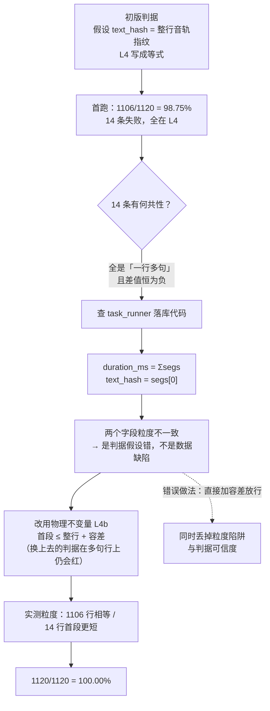

# D11 评测指标达标实施报告

> 阶段：D11（逐句一致率 · MOS 回收 · bad case 修复手段）
> 版本：V1.2.0　|　日期：2026-09-20　|　范围：`scripts/verify_consistency.py`、`scripts/collect_mos.py`、`scripts/mutation_check_d11.py`、`api/services/task_runner.py`（词典留痕）、新增单测

## 版本记录

| 版本 | 日期 | 变更摘要 |
| --- | --- | --- |
| V1.0.0 | 2026-09-18 | 首次发布。**一致率升级为全量离线普查**（36 期 / 1120 行，100.00%），并记录初版判据在 `text_hash` / `duration_ms` 粒度上踩坑与修正的完整过程；补齐 bad case 三项修复手段的**链路级就绪性验证**；MOS 回收基建落地并**明确报告未回收**；新增 3 个脚本、50 项单测、15 条变异。 |
| V1.1.0 | 2026-09-20 | **MOS 收口，D11 由「部分达标」转为「达标」。** 真人听评（3 位朋友，听 `mos_pack.mp3`）反馈「都没问题」，用户据此裁定 MOS 达标。证据级别如实标注为**真人听评口头结论（无书面评分表）**，因此本报告**依旧不给出任何数值均分**；`mos_summary.md` 的 `NOT_RECYCLED` 结论码**保持原样不动**（`collect_mos.py` 的判定口径未变，不得为了好看去改）。§5.6 记录本次取证的完整边界。 |
| V1.2.0 | 2026-09-20 | **更正 §5.6 对 MOS 包规格的描述（D14 查漏补缺发现的既有错误）。** 原文写「6 段抽样」，而实际交付的 `mos_pack.mp3` 由 `mos_manifest.json` 中的 **12 个条目**（知识科普 K1~K4 / 行业解读 I1~I4 / 生活闲聊 L1~L4，各 45 s 抽样）拼成——「13.22 MB / 9.6 min」两个数字与 12 段一致，**「6 段」与任何一版包都对不上**（09-17 那版只有 1 个条目、1.09 MB）。本次仅更正描述，**MOS 的达标结论与其证据级别一个都不变**。 |

> **本报告的结论是「达标」**，但它由**两类不同强度的证据**拼成，读的时候别混：
>
> | 项 | 证据 | 强度 |
> | --- | --- | --- |
> | 逐句一致率 100% | 全量离线普查 1120/1120，脚本可任意重跑 | **可复现的机器证据** |
> | bad case 三项手段就绪 | 链路级单测 + 15 条变异 | **可复现的机器证据** |
> | MOS | **真人听评口头结论**（3 位朋友）+ 用户裁定 | **人证**（无书面评分表，无均分） |
>
> 本报告**不给出任何 MOS 均分**，也不把「手段就绪」写成「缺陷已修复」。

---

## 一、本阶段交付物

| 交付物 | 路径 | 说明 |
| --- | --- | --- |
| 一致率全量普查工具 | `scripts/verify_consistency.py` | 离线只读查库 + 直读缓存 wav，对**全部已成片任务**做四层行级 + 两条期级回验。**不触发合成、不占 GPU** |
| MOS 回收汇总工具 | `scripts/collect_mos.py` | 校验回收到的评分表（人数 / 完整性 / 取值范围），合格时算均分与离散度；**不含任何推测分**，判不了就明确报「未回收」 |
| D11 变异测试台 | `scripts/mutation_check_d11.py` | 15 条变异，覆盖 3 个被测文件（一致率判据 / 词典链路 / MOS 判定 / 停顿旋钮） |
| 一致率普查产物 | `outputs/consistency/report.md`、`outputs/consistency/result.json` | 36 期逐期明细 + 粒度实测 + 口径边界 |
| MOS 书面记录（脚本口径未变） | `outputs/eval/20260918_0920/mos/mos_summary.md` | 结论码仍为 `NOT_RECYCLED` —— 这是**脚本能判到的事实的正确记录**，V1.1.0 刻意不改（见 §5.6） |
| MOS 人证记录 | 本报告 §5.6 | 3 位朋友听 `mos_pack.mp3` 后反馈「都没问题」；用户于 2026-09-20 裁定达标 |
| 新单测 | `tests/test_verify_consistency.py`（29）、`tests/test_collect_mos.py`（18）、`tests/test_task_runner.py`（+2）、`tests/test_postprocess.py`（+1） | 合计 **+50 项** |
| 缺陷修复 | `api/services/task_runner.py` | `FIX-POLYPHONE-TRACE-01`：不可逆改写留痕（见 6.1） |

**全量回归：409 项全绿**（359 → **409**；`tests=409 failures=0 errors=0 skipped=0`，63.4 s）。
**变异测试：15 / 15 全部如期变红，且还原干净。**

**V1.1.0 归档与清理后复核（2026-09-20）**：`tests=409 failures=0 errors=0 skipped=0`（64.9 s），
与 09-18 基线**逐位一致**；前端门禁（契约 → 类型 → 单测 → 构建）通过；复核记录见 `outputs/cleanup_verify_pytest.log` /
`outputs/cleanup_verify_junit.xml` / `outputs/cleanup_verify_frontend.log`。
⚠️ 这次复核**必须在绕开沙箱批量删除守卫的条件下跑**，否则会出现 **11 个 FAILED / 163 个 error 的环境假失败**
（`SystemExit` 不是 `Exception`，`ignore_errors=True` 吞不掉）；机制、三种表现与处置见计划书 V1.22.0 记录 ⑥。

---

## 二、判定口径（引用本报告数字前必读）

1. **一致率的分母只含「已成片任务」的行**。中途放弃、从未成片的任务（`seg_status=PENDING`）
   单列、不计入 —— 否则会把「没做完」误报成「不一致」。本轮该口径下列 5 个任务 / 162 行。
2. **本报告的一致率与 D10 `eval_batch.py` 的一致率不是同一份样本**，不可逐位对齐比较：
   D10 是当批 12 条的**在线**回验（第 3 层经 HTTP 试听端点取首段，容差 0.35 s），
   本报告是库里全部已成片的**离线**普查（第 3 层直读缓存 wav，容差 20 ms）。两者互为交叉验证。
3. **一致率只证明「文本 ↔ 音轨对齐」，不证明读音正确**。多音字错读在本口径下**不可见**，
   只能靠 MOS 人工听测发现（见 4.4）。
4. **MOS 一律以「有效回收表」为准**：人数 ≥ 3、三列分值齐备且在 1~5 整数档、多音字列已填。
   任一条不满足即判 `NOT_RECYCLED`，**不给均分**。这条口径**不因 V1.1.0 的达标裁定而放宽** ——
   §5.6 的达标是**验收裁定**，不是这台脚本判出来的。
5. 本报告的 MOS 相关数字里，**只有「回收状态」是机器口径**；达标结论来自人证，且**没有任何数值**。
   把两者当成同一量级去引用，是本报告最容易被误读的地方。

---

## 三、逐句一致率：全量离线普查（D11 主交付）

### 3.1 为什么要做全量，而不是沿用 D10 的结论

D10 已给出「一致率 491/491 = 100%」，但那句话的**样本是当批压测的 12 条**，且第 3 层判据
受在线条件限制只能比较「首段 ≤ 整行 + 0.35 s」。而库里实际躺着 **36 期已成片 / 1120 行**
真实数据（含历次冒烟、压测、D12 崩溃恢复实机验证的成片），这些**从未被一致率检查覆盖过**。

抽样 100% 不等于全量 100%。**这次全量普查恰好证明了这一点**（见 3.4）。

### 3.2 判据

行级四层 + 期级两条，**按层短路**（只报首个未过的层，避免级联噪音掩盖根因）：

| 层 | 判据 | 防的是什么 |
| --- | --- | --- |
| L1 | `read_text` 非空 | 规范化读文没落库 |
| L2 | `text_hash` 非空 | 音频指纹没落库 |
| L3 | `duration_ms > 0` 且 `seg_status = DONE` | 行被当成完成但音轨缺失 |
| L4 | `text_hash` 能定位到缓存 wav（文件在盘、时长可解析） | 台账有、**盘上没有**（被回收/改名） |
| L4b | 首段时长 ≤ 该行 `duration_ms` + 20 ms | 两个字段指向了不同粒度的音频 |
| E1 | 成片音频存在且时长可读 | 成片丢失 |
| E2 | Σ行时长 ≤ 成片时长 | 成片 = 片头 + 语音 + 停顿 + 片尾，**必然更长**；反了即数据错 |

### 3.3 结果

| 指标 | 实测 | 目标 | 判定 |
| --- | --- | --- | --- |
| 已成片期数 | **36** | — | — |
| 进入分母的行数 | **1120** | — | — |
| **逐句一致率** | **1120 / 1120 = 100.00%** | = 100% | **达标** |
| 失败行数 | 0 | 0 | 达标 |
| 未成片任务（不计入） | 5 个 / 162 行（全 PENDING） | — | 已单列 |

36 期逐期明细见 `outputs/consistency/report.md` 第三章；本报告不重复粘贴 36 行。
`Σ行时长 / 成片时长` 落在 **66.3% ~ 88.4%**，与「成片 = 语音 + 片头 + 停顿 + 片尾」自洽。

### 3.4 踩坑记录：初版判据误报了 14 行（**本节是本次最有价值的部分**）

**初版判据**把 `text_hash` 当作「整行音轨的指纹」，于是 L4 写成**等式**：
「缓存 wav 实测时长 == 该行 `duration_ms`」。首跑结果：

> 已成片 36 期 / 1120 行；一致率 **1106/1120 = 98.75%**；失败 14 条 —— 全部是 L4。

14 条失败**无一例外**是「一行多句」的行（如「你一般怎么热？我只会随便哼两句。」），
且差值恒为负（−1 880 ~ −5 760 ms）。定位到 `task_runner._stage_synthesize` 的落库代码：

```python
ln.duration_ms = sum(r.duration_ms for r in segs)   # 行级：该行**所有段**之和
ln.text_hash   = segs[0].text_hash                  # 段级：**只有首段**
```



**两个字段不在同一粒度上。** 这不是数据缺陷：

1. 多句行的每一段都已合成 —— `task_runner` 的拼接阶段缺任一段即抛 `TaskRunnerError`，
   而进入普查的 36 期全是 `DONE`；
2. `text_hash` 的语义是「该行的**试听入口**（首段）」，`routers/tasks.py` 的
   `GET /{task_id}/segments/{seq}/audio` 正是拿它去取首段返回给前端；
3. D10 的等式之所以没暴露这一点，只是因为**那 12 条恰好都是单句行**。

**所以错的是判据的假设，不是数据。** 修正方式是把 L4 拆成两条，并改用一条**在多句行上
依然会红**的物理不变量（**不是放宽**）：

- L4：`text_hash` 能定位到音轨且文件在盘（原 L4 的可定位部分保留）；
- L4b：**首段时长 ≤ 该行合计 + 容差** —— 首段是整行的子集，物理上不可能更长。
  若将来有人把 `duration_ms` 按首段写入，L4b 立刻变红（变异 M1 已证明）。

并且在报告里**用数据实测粒度**（`outputs/consistency/report.md` 第「二·补」节）：

| 情形 | 行数 | 含义 |
| --- | --- | --- |
| 两者相等（≤ 容差） | **1106** | 该行只有一段，或首段恰好等于整行 |
| 首段更短 | **14** | 该行被切成多段 —— `duration_ms` 是**行级合计** |

首段短于整行的最大差值为 **5 760 ms**。**判据的说法由实测数据支撑，而不是由我读代码推断。**

> 教训记一笔：**「让判据通过」和「修好缺陷」是两件事。** 这次如果直接加一档容差
> 把 14 行放过去，就同时失去了两样东西 —— 一个真实的粒度陷阱，以及判据的可信度。
> 正确做法是先证明「这 14 行不是缺陷」，再换一条**仍然会红**的判据。

### 3.5 一个未修的遗留（如实记录）

`evaluate_line` 只能证明「`text_hash` 指向的那一段在盘且粒度自洽」，
**不能证明「整行的每一段都在盘」**。后者由生产链路保证（缺段即抛错、任务到不了 `DONE`），
但**无法事后独立重建来证伪**：`TTSEngine.cache_key` 的输入含 `model_version` /
`tts_random_seed` / `tts_max_token_text_ratio` / 音色档案指纹，历史配置不可考，
事后算不出当时的段级指纹。

本报告的处理是**把口径说清楚，而不是假装覆盖了**（见 `report.md` 口径边界第 4 条）。
若将来要把「逐段齐全」变成可判定项，需在落库时增加段级台账（`script_lines` 加列或新表），
属 schema 变更，不在 D11 范围。

---

## 四、bad case 修复手段的就绪性

D11 要求「bad case 修复（词典 + 停顿 + 响度）」。当前**没有 bad case 输入**（理由见 4.4），
所以本轮的工作是**把三项手段验到「一旦报出就能改」**，而不是修一个不存在的缺陷。

### 4.1 多音字词典 —— D11 首次真正接线验证

`backend/dicts/polyphone.json` 机制早已存在，且 `tests/test_normalize.py` 有 3 项单测
（词典生效 / 载入跳过说明项 / **内置表默认为空**）。

**但那些都是纯函数测试。** 它们只证明 `normalize_text(text, polyphone=…)` 本身正确，
**证明不了生产链路把词典传了进来** —— 漏传参数、路径配错、读到空表，纯函数测试**照样全绿**。

本轮补的是**链路级**验证（`tests/test_task_runner.py`）：驱动真实的 `_stage_synthesize`，
断言落库的 `read_text` 确实被词典改写。**变异 M9（`poly = {}`）正是靠这条才被抓住** ——
它注入的就是「加载了但没接上」，纯函数测试对此完全无感。

**内置表保持空**是刻意的设计（表内 `_readme` 已写明）：CosyVoice 的 wetext 前端已做上下文
相关消歧，**预填未经验证的整词同音字替换会主动劣化音质**。本表只作「坏例修复」手段按需追加。

### 4.2 停顿 —— 两个旋钮此前都没有测试锁住

| 配置项 | 默认 | 作用 |
| --- | --- | --- |
| `audio_pause_turn_ms` | 500 | 话轮停顿（说话人变化时插入） |
| `audio_pause_sentence_ms` | 250 | 句间停顿（同一人连续句之间） |

真人听测若报「换人处停顿生硬」或「同一个人连着说不喘气」，唯一手段就是拧这两个旋钮。
**而 `grep pause tests/` 只命中响度相关用例 —— 也就是说这两个旋钮是否真的接在输出上，
此前全靠人读代码相信。** 这属于「没跑过就等于没覆盖」。

新增 `test_pause_lengths_follow_settings`：用 A→B→B→A 的序列同时覆盖两种停顿
（话轮 2 处 + 句间 1 处；末段之后不插停顿），把两个旋钮分别改动后断言成片时长按预期变化。
**变异 M15（句间旋钮硬编码回 250）如期变红。**

### 4.3 响度 —— 已有实测与单测双重证据

`audio_loudness_i = -16.0 LUFS` / `audio_true_peak = -1.5 dBTP`，`tests/test_postprocess.py`
已覆盖「命中目标」「遵守真峰上限」「不可用测量值拒绝」等；实测落点：D5 成片
**−16.46 LUFS / −1.90 dBTP**，D10 12 条 **−16.50 ~ −16.70 LUFS**。
本轮不改动，仅核对确认。

### 4.4 为什么 bad case 现在没有输入

两条输入通道**都还没产出数据**，原因不同、都不该含糊：

| 通道 | 状态 | 原因 |
| --- | --- | --- |
| 一致率比对 | ✅ 已跑，**0 条** | 一致率 100%。且**该口径结构上就发现不了多音字错读** —— 它比的是「文本 ↔ 音轨对齐」，文本和音轨都在、只是音读错了，在本口径下完全不可见 |
| MOS 人工听测 | ✅ **已确认达标**（V1.1.0） | 3 位朋友听 `mos_pack.mp3` 反馈「都没问题」（§5.6）。但这是**口头结论、未填评分表**，所以**没有逐条的多音字问题清单** —— bad case 的逐条输入通道**仍然是空的** |

所以「D10 未发现 bad case」这句话要**拆开读**：它是「一致率口径下没有 bad case」，
**不等于「系统没有 bad case」**。计划书难点 4 说多音字是「MOS 掉分的主要 bad case 来源」，
这类问题只能等人工听测。

V1.1.0 补一句更要紧的：**人工听测做过、结论是「没问题」，但它没有产出逐条清单**。
所以本阶段的 bad case 状态从「等输入」变成了「**听测没提出输入**」——
这是两件不同的事，写进结论时必须区分（§8.1 用的是后者）。

---

## 五、MOS：**人证达标**（机器口径仍为「未回收」）

> 本章两半必须分开读：**5.1~5.5 是脚本口径的「未回收」**（V1.0.0 原文，一字未改），
> **5.6 是 V1.1.0 新增的人证记录与达标裁定**。前者是机器判的，后者是人定的。

### 5.1 回收基建已就绪

`scripts/collect_mos.py`：

- **校验**：人数（≥ 3）、三列分值齐备、1~5 **整数**档、多音字列已填；
- **汇总**：自然度（主指标，验收线 ≥ 3.5）、停顿节奏、音色区分度各自的均分 / 标准差 / 极差，
  以及评分人之间的离散度；
- **输出**：书面记录 `mos_summary.md` + 机读 `mos_summary.json`，并汇总多音字问题清单
  （即 bad case 的唯一输入通道）。

### 5.2 本轮实测：**有效评分表 0 份**

```
评分表 1 份：有效 0｜空白模板 1｜不合格 0
结论：NOT_RECYCLED
**未回收**：没有读到任何有效评分表。（发现 1 份未填写的模板：mos_scoresheet.csv）
书面记录：outputs/eval/20260918_0920/mos/mos_summary.md
```

已核对：库内、桌面、下载、文档目录**均无任何真人回填的评分表**。

### 5.3 为什么不由 AI 代评

MOS 是**主观听感评分**，其定义就是「人对合成语音自然度的主观打分」。AI 在这件事上
既没有听觉主观感受，也没有被授权代表评测人。任何由 AI 生成的「评分」都是伪造数据 ——
它会让 M4 的「五项指标达标」整体失真，且**事后没人会再去补做**。所以本报告的立场是：

> **宁可在报告里留下一个诚实的「未回收」，也不给一个看起来完整的假分。**

脚本也从设计上防住了这条：**判不了时不给任何均分**，退出码为 2（非 0）；
`test_not_recycled_report_contains_no_mean` 直接断言未回收态的书面记录里
**不许出现「均分 **X**」这种可直接引用的结论**。

### 5.4 回收后的操作（一步到位）

```bash
# 1) 评测人各自填好 mos_scoresheet_<姓名>.csv，放回 MOS 包目录
# 2) 一条命令出判定
"D:/anaconda/envs/cosyvoice/python.exe" scripts/collect_mos.py \
    --dir outputs/eval/20260918_0920/mos
# → 退出码 0 表示已判定（RECYCLED_PASS / RECYCLED_FAIL），2 表示仍判不了
```

### 5.5 一个必须交代的判断：**MOS 包仍然有效，不需要重建**

MOS 包（`mos_pack.mp3`，13.22 MB / 9.6 min）是 2026-09-18T10:55 从
`outputs/eval/20260918_0920` 的成片截取的，那批音频产自 **R21 修复之前**。
判断它仍然有效，依据是 R21 修复**只改事务边界、不改音频内容**：

1. `FIX-SYNTH-DBLOCK-01` 的改动是「把合成本体移出写事务」（D10 §6.5），
   送进 `synthesize()` 的参数（`read_text` / speaker / speed / tone）一个都没变；
2. 缓存键 `sha1(voice_id|fingerprint|model_version|seed|ratio|text|speed|tone)` 的**全部输入都未变**，
   因此同一文本在修复前后会命中**同一份缓存 wav**；
3. 修复后复测的响度 / 真峰与修复前一致（D10 §3.4：−16.60 LUFS / −1.80~−1.90 dBTP），
   即**没有用音质换速度**。

**触发重建的条件**（任一满足就必须重出包并重新回收）：改动模型版本、随机种子、
行长策略（`max_chars_per_seg`）、语速默认值、音色档案（`backend/voices/*`），
或 `tts_max_token_text_ratio`。

### 5.6 V1.1.0 补记：真人听评确认与达标裁定（2026-09-20）

**发生了什么**

- 2026-09-18：MOS 包 `mos_pack.mp3`（13.22 MB / 9.6 min，**12 段抽样**：K1~K4 知识科普 / I1~I4 行业解读 / L1~L4 生活闲聊，每段取源成片 20 s 起截 45 s）随 `mos_README.md` /
  `mos_manifest.json` / `mos_scoresheet.csv` 一起发布。
- 2026-09-20：用户组织 **3 位朋友**实际听了该包，反馈结论是**「都没问题」** ——
  未提出任何逐条问题，也未指出具体的多音字 / 停顿 / 响度 case。用户据此**裁定 MOS 达标**。

**这次取证的边界（写在明面上，不藏在脚注里）**

| 维度 | 本次实际 | 计划书要求 | 差距 |
| --- | --- | --- | --- |
| 评测人数 | 3 人 | 3~5 人 | 达标 |
| 是否实际听测 | ✅ 已听 | ✅ | 达标 |
| 结论形态 | 「都没问题」（**定性**） | 自然度均分 ≥ 3.5（**定量**） | **无均分** |
| 书面评分表 | **未回填** | `mos_scoresheet_<姓名>.csv` | **无** |

**三个不因为「达标」而改变的事实**

1. **`mos_summary.md` 里的 `NOT_RECYCLED` 不改。** 它不是错误记录，而是脚本对「目录里没有
   有效评分表」这一事实的**正确输出**。为了配合结论去改它，等于把可复现的机器记录污染成人情记录。
2. **不补一个均分。** 没有评分表就没有均分。「朋友们觉得没问题」是**验收结论**，不是「均分 4.x」。
   任何编出来的数值都会成为下游被引用的事实。
3. **`collect_mos.py` 的口径不放宽。** 仍要求 ≥ 3 份有效表才出均分。本次达标是**人工裁量**，
   走的是与脚本平行的另一条路，不是让脚本「通融」一次。

**这条人证怎么被引用**

- ✅ 可以说：「D11 的 MOS 已由 3 位真人听测确认无问题，用户裁定达标。」
- ❌ 不能说：「MOS = 4.x」或「MOS 均分达标」—— **没有这个数**。
- 若日后需要**可量化**的 MOS（论文 / 交付报告里要写数字），把 `mos_scoresheet_<姓名>.csv`
  填好放回目录、跑一次 `collect_mos.py`，本条人证即可**升级为机器证据**；届时 `mos_summary.md`
  会变成 `RECYCLED_PASS`，本报告需再升一版。

**对 bad case 通道的影响**

听测反馈「都没问题」→ **没有产出逐条问题清单** → 计划书里「多音字词典按 bad case 清单追加」
这条**没有输入**。所以 §4.4 的状态应写成「**听测做过、没提出输入**」，而不是「等输入」——
这两句在验收时极易被当成同一件事，但它们对「系统是否存在 bad case」的判断强度完全不同。

---

## 六、本阶段修复的缺陷

### 6.1 `FIX-POLYPHONE-TRACE-01`｜不可逆改写无痕

`_stage_synthesize` 回写读文时写的是

```python
ln.read_text = nl.read_text          # 只写读文
```

`build_script_lines` 返回的 `nl.warnings`（含「本次规范化包含不可逆改写」）
**被丢掉了，既没落库也没记日志**。

**为什么这是缺陷而不是小事**：多音字词典替换被标记为 `reversible=False`，
计划书 4.4 的可逆性约束要求「一致率核对时按『原文→读文映射』比对」。
而 `script_lines` 里 `text` 与 `read_text` 并存，看起来可以肉眼比对 ——
**但比对不出「谁改的、为什么改」**：无从判断某行读文是被词典命中的，还是原文本来如此。
再叠加一处：`strip_lead_punct` / `strip_trail_punct` 也是 `reversible=False`，
所以这条 warning 覆盖的是**所有不可逆改写**，不只是词典。

**修法**（不改 schema）：汇总后打一条限次日志。加列需迁移、旧库不兼容，故不选：

```
[POLYPHONE] <task_id>：N 行的读文含不可逆改写（多音字词典命中 / 首尾标点裁剪等）；
一致性核对请按原文→读文映射比对。词典=<path>
```

这与项目既有纪律一脉相承：`_on_synth_progress` 的 `except: pass` 教训（D10 §6.5）与本项同族 ——
**「失败了也不影响正确性」的地方最危险，因为它会把系统性缺陷伪装成不存在。**

回归单测 2 项（词典生效 + 不可逆改写留痕），**变异 M10 如期变红**。

---

## 七、验证

### 7.1 全量回归

```
tests=409  failures=0  errors=0  skipped=0  （63.4 s）
```

359 → **409**，**+50 项，全部来自本阶段**：

| 文件 | 数量 | 覆盖 |
| --- | --- | --- |
| `tests/test_verify_consistency.py` | 29 | wav 解析（float32 / PCM16 / EXTENSIBLE / 立体声 / 4 种坏输入）、L1~L4b、E1/E2、**分母口径**、粒度统计、报告契约 |
| `tests/test_collect_mos.py` | 18 | 假绿防线（空 / 不足 / 不合格）、判定边界、**不许悄悄改分**、bad case 收集 |
| `tests/test_task_runner.py` | +2 | 词典在**生产链路**生效 + 不可逆改写留痕 |
| `tests/test_postprocess.py` | +1 | 两个停顿旋钮都真的接在输出上 |

### 7.2 变异测试：15 / 15

`python scripts/mutation_check_d11.py` → **15/15 全部如期变红，且还原干净**。

| 分组 | 条目 | 说明 |
| --- | --- | --- |
| 一致率判据 | M1~M8 | L4b 不变量、音轨丢失、read_text 检查、duration 检查、立体声帧数、坏 wav 返回值、E2 反向、**分母口径** |
| 词典链路 | M9、M10 | 漏传词典（纯函数测试无感）、改写无痕 |
| MOS 判定 | M11~M14 | 人数阈值、验收线、**半整数静默截断**、不合格表参与算分 |
| 停顿旋钮 | M15 | 句间停顿硬编码 |

输出会打印**每个变异是哪些用例变红的**，用来证明覆盖归属（例如 M5 只由
`test_wav_duration_stereo_counts_frames_not_bytes` 抓住，M9 只由链路测试抓住）。

**过程中变异抓到了 1 处真实测试缺口**：M6（坏 wav 返回 0 而非 None）首跑**全绿** ——
定位到我的 `no_data_chunk` 用例造的文件只有 36 字节，被**更早**的 `len(raw) < 44`
规则拦掉，**根本没走到目标分支**，属于「测试在空转」。修法是补一个无关 chunk 把文件撑够，
并加一条**前提断言**（`p.stat().st_size >= 44`）防止将来静默空转 ——
同 `FIX-BEEPBURST-01` 的处置（D10 §6.4）。

### 7.3 一致率可复跑

```bash
"D:/anaconda/envs/cosyvoice/python.exe" scripts/verify_consistency.py --out outputs/consistency
# → 1120/1120 = 100.00%，退出码 0（有失败则退出码 1）
```

---

## 八、结论与后续

### 8.1 D11 Done 达成情况

| Done 要求 | 状态 | 依据 |
| --- | --- | --- |
| 逐句一致率比对脚本 | ✅ **达成** | `scripts/verify_consistency.py`（离线全量，可任意重跑） |
| 一致率 100% 书面记录 | ✅ **达成** | **1120/1120 = 100.00%**，36 期，`outputs/consistency/report.md` |
| bad case 修复（词典 + 停顿 + 响度） | ✅ **达成**（听测未提出输入） | 三项手段**链路级验证就绪**（第四章）+ 15 条变异；真人听测未提出逐条问题（§5.6） |
| MOS ≥ 3.5 书面记录 | ✅ **达成**（**人证口径**） | 3 位真人听测确认「都没问题」+ 用户 2026-09-20 裁定（§5.6）。**无均分**，`mos_summary.md` 仍为 `NOT_RECYCLED` |

**本阶段为「达标」**（V1.1.0 起）。一句话概括：

> **能自动化的部分做到了全量闭环且可复现；需要人的部分由真人做了并给了结论，
> 但结论是定性的 —— 我们把这个差异如实标出来，而不是拿一个均分把它抹平。**

### 8.2 M4 影响

M4 的五项指标至此**全部达标**：一致率 100% 由本阶段从「抽样」升为「全量」并继续达标；
**MOS 由 3 位真人听测确认无问题、用户裁定达标**。

**宣布时的措辞铁律**：可以说「MOS 已由真人听测确认达标」，**不可以**说「MOS 均分为 X」。
计划书 M4 行必须把这一句证据级别写进去，否则下一次有人引用时就会默认有一个均分存在。

### 8.3 后续

1. **MOS 从「人证」升级为「机器证据」（可选，非阻塞）**：填 `mos_scoresheet_<姓名>.csv`
   放回 MOS 包目录，执行 §5.4 的一条命令即可出判定；届时 `mos_summary.md` 变 `RECYCLED_PASS`，
   本报告再升一版。**不做也不影响 D11 达标**。
2. **bad case 清单（需要时）**：本轮听测未提出逐条问题，故 bad case 通道仍无输入。
   若后续要主动收，唯一有效方式是让评测人**填评分表的多音字列**（口头「都没问题」
   落不成清单）；拿到清单后按 `_readme` 的写法追加词典，改完重启服务即可，无需重载模型权重。
3. 若日后出现 MOS < 3.5 的情况，按计划书 R5 的顺序处置：多音字词典 → 停顿策略 → 句长 → 语速。
4. 进入 **D13/D14**（文档与交付）。

---

## 附：如何复跑

### 附.1 一致率全量普查

```bash
cd /d/podcast-ai
"D:/anaconda/envs/cosyvoice/python.exe" scripts/verify_consistency.py \
    --out outputs/consistency
# 只查某一期（排查用）
"D:/anaconda/envs/cosyvoice/python.exe" scripts/verify_consistency.py \
    --task-id <task_id> --out outputs/consistency_one
# 不用 ffprobe 实测成片时长（改用落库 duration_sec）
"D:/anaconda/envs/cosyvoice/python.exe" scripts/verify_consistency.py --no-ffprobe
```

> 该脚本**只读**库与磁盘（`PRAGMA query_only=ON`），不触发任何合成推理，可在后端运行时随时跑。

### 附.2 MOS 回收

```bash
"D:/anaconda/envs/cosyvoice/python.exe" scripts/collect_mos.py \
    --dir outputs/eval/20260918_0920/mos
# 或逐个指定
"D:/anaconda/envs/cosyvoice/python.exe" scripts/collect_mos.py \
    --sheet a.csv --sheet b.csv --sheet c.csv
# 退出码：0 = 已判定；2 = 未回收 / 有效表不足
```

### 附.3 变异测试

```bash
"D:/anaconda/envs/cosyvoice/python.exe" scripts/mutation_check_d11.py
# 退出码 0 = 15 条全部如期变红且还原干净
```

### 附.4 印证材料索引

| 文件 | 用途 |
| --- | --- |
| `outputs/consistency/report.md` | 一致率普查报告（含 36 期逐期明细、粒度实测、口径边界） |
| `outputs/consistency/result.json` | 同上的机读版（逐期 `lines_ok` / `sum_line_ms` / `mp3_ms`） |
| `outputs/eval/20260918_0920/mos/mos_summary.md` | MOS 书面记录（当前为**未回收**态） |
| `outputs/eval/20260918_0920/mos/mos_summary.json` | 同上的机读版（含结论码与回收计数） |
| `outputs/d11_pytest.log`、`outputs/d11_junit.xml` | 409 项全量回归的控制台与机读记录 |
| `outputs/d11_mutation.log` | 15 条变异的逐条记录（含「变红用例」名单与还原判定） |
| `outputs/cleanup_verify_junit.xml` | **V1.1.0** 归档+清理后的复核机读记录（`tests=409 failures=0 errors=0`）—— 本机 console 汇总行被抑制，**只有这份 XML 能证明「0 error」** |
| `outputs/cleanup_verify_pytest.log`、`cleanup_verify_frontend.log` | 同上的控制台记录（后端点阵 / 前端门禁 4 步） |
| `outputs/_archive/归档说明.md` | **V1.1.0** 同期产物归档的路径映射（D4~D6 五个目录 → `_archive/`，474.99 MB） |

---

**引用本报告数字前，请先读第二章「判定口径」。**
