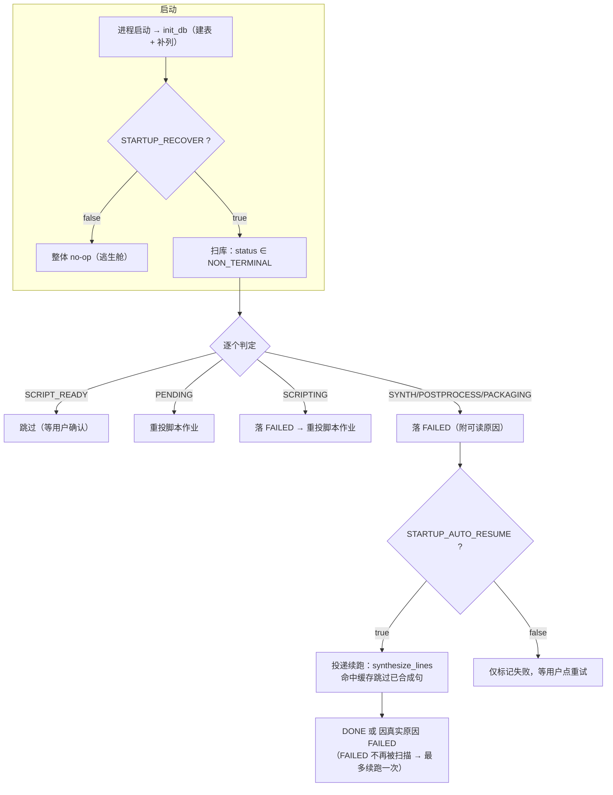

# D12 性能优化与稳定性加固实施报告

## 版本记录

| 版本 | 日期 | 说明 |
| --- | --- | --- |
| V1.0.0 | 2026-09-18 | 首版。覆盖 D12 全部五项范围（缓存命中率、异常处理、断点续跑、队列提示、P1 裁剪决策点），含单元测试、**变异测试**与**实机杀进程续跑验证**三档证据。 |
| V1.1.0 | 2026-09-18 | **闭环 V1.0.0 的降级项一（§6.2）**：前端接入 `queue_position` / `cache_hit_rate` 等可观测性字段（新增 §3.4）。为守住接入质量，另新建两处可重跑的自检：前端纯展示函数表驱动断言（`verify_taskview.mjs`，18/18）与前后端字段漂移守卫（`check_frontend_contract.py`，6 组一致，并已做「注入漂移→必红」验证）。**未改动任何后端代码**，故 V1.0.0 的全部测试、变异测试与实机验证结论继续有效。 |
| V1.2.0 | 2026-09-18 | **修掉一处与 R21 同族的静默缺陷 + 补齐 `data/work` 的定期回收**（新增 §3.5，`FIX-WORK-CLEANUP-OBS-01`）：① `_cleanup_work` 原先用 `rmtree(..., ignore_errors=True)`，删失败**不留任何痕迹** —— 实测导致 `data/work` 静默累积到 **3.47 GB**；改为删后回查、残留即 `log.warning`（附体积与回收命令），并**明确不把清理失败升级为任务失败**。② `scripts/cleanup_workspace.py` 增加 `--work-only` / `--quiet` / `--grace-min`，可挂计划任务无人值守；为此加了三道安全闸（非终态任务目录跳过、最近写入窗口、在跑集合不可用则整体放弃）。③ **变异测试扩到 10 条**（新增 M9 静默回潮、M10 清理失败污染任务结果），**全量回归 356 → 359**（+3）。④ **实测回收 386.6 MB / 182 文件**，`data/cache`（528.8 MB）与 36 份成片一字节未动。⑤ 本版**改动了后端代码**，故 V1.2.0 的回归与变异结论**取代** V1.0.0/§4 的对应数字（旧数字作为历史记录保留）。 |
| V1.3.0 | 2026-09-18 | **回填「定期回收」的实际落地方式**（修订 §3.5、§7.2）：本环境将 `schtasks.exe` 列入程序黑名单（不可批准、不可绕过），计划任务无法注册，故改用本环境**原生每日自动化**（每天 03:30，工作目录 `D:\podcast-ai`，仅回收 `data/work`）承载，等价 `schtasks` 命令保留备查；§7.2 第 1 项由此**彻底闭合**。**未改动任何代码**，故 V1.2.0 的回归（359 项）、变异（10/10）与 §5 实机取证结论继续有效。 |
| V1.4.0 | 2026-09-18 | **回填「前端断言已迁出本报告」造成的失效引用（纯文档，无代码改动）**：D12 遗留项「前端测试基建」已由独立任务完成并另立报告（《前端测试基建实施报告 V1.0.0》）。原 `frontend/scripts/verify_taskview.mjs` 与 `npm run verify:taskview` **均已删除**，18 条断言迁入 `frontend/src/lib/taskView.test.ts` 并扩展为 **34 条用例 / 3 个文件**（新增组件渲染层），自检入口统一为 `python scripts/check_frontend.py`（**4/4**）。若不回填，本报告 §1.2 / §3.4.4 / §7.2 / 附.1 / 附.3 / 附.4 里的命令**在本机全部执行不通** —— 与 V1.3.0 修掉的 `schtasks` 属同一类缺陷。本版**只改文档**：§3.4.4 原判断保留原文并加「已被取代」标注（不抹掉当时的决策依据），§7.2 第 4 项标记完成。回归 359 项、变异 10/10 与实机取证结论**继续有效**。 |

> **V1.1.0 的性质**：这是**同一阶段内的补充交付**，不是新阶段。改动范围仅限 `frontend/` 与新增校验脚本，`api/` 一行未动 —— 因此 §4 的 356 项回归、8/8 变异测试与 §5 的实机取证**无需重跑**（它们全部落在后端）。前端改动自身的验证见 §3.4.4。
>
> **V1.2.0 的性质**：本版**动了后端**（`task_runner._cleanup_work`），所以上面那句「无需重跑」**不适用于本版**。§4 的回归与变异数字已按 V1.2.0 **重跑并整体更新**（**359 项 / 变异 10 条**），旧数字（356 / 8）作为历史记录保留在本表上一行。§5 的实机取证不受影响（它验的是崩溃恢复与断网，与本版改动无关）。

> **V1.3.0 的性质**：**纯文档回填** —— 只把「定期回收实际是怎么挂上去的」写清楚，`api/` 与 `frontend/` 一行未动，§4/§5 的全部数字与结论**无需重跑**。之所以必须回填：原稿只写了 `schtasks` 这一条路，而本环境恰好封了它；若不改写，后续读者会照着一条**在本机永远执行不通**的指令去操作，然后得出「回收没生效」的错误结论。

> **V1.4.0 的性质**：**纯文档回填**，`api/` 与 `frontend/` 一行未动，§4/§5 的全部数字与结论**无需重跑**。触发原因：本报告 §3.4.4 明确把「引入测试运行器」留给了独立任务，那个任务现已完成并删除了被本报告引用的脚本 —— 于是本报告里若干条命令**在本机已执行不通**。按项目纪律，这类「文档给出本机跑不通的指令」必须回填，否则后续读者照做必然失败、还会得出「前端自检没生效」的错误结论。

**本报告与《D10 评测压测实施报告_V1.1.0》的关系**：D10 解决的是「性能不达标」，本阶段解决的是「**中断与异常下能不能活下来**」。两者都动过 `task_runner`，但 D12 的改动不改变任何性能口径 —— 本报告不引用 D10 的耗时数字，也不对其做任何修订。

---

## 一、本阶段范围与交付物

### 1.1 计划书原文（D12 行）

| 项 | 内容 |
| --- | --- |
| 阶段 | D12（09-26）· 优化 |
| 任务 | 稳定性加固 |
| 要求 | 缓存命中率优化；异常处理（LLM 超时 / FFmpeg 失败 / OOM 重试）；断点续跑验证；队列排队提示；**P1 裁剪决策点** |
| 完成判定 | 人为断网与杀进程后重启，任务可续跑成功；P1 未完成项已降级并记录 |

### 1.2 实际交付物

| 类型 | 文件 | 说明 |
| --- | --- | --- |
| 代码 | `api/services/task_runner.py` | 崩溃恢复扫描（`recover_interrupted`）、队列快照/位次、命中率读数、封装幂等化 |
| 代码 | `api/services/tts.py` | CUDA OOM 识别与重试（`_is_cuda_oom` / `_infer_with_oom_retry`） |
| 代码 | `api/config.py` | 新增 `startup_recover` / `startup_auto_resume` / `tts_oom_retry` |
| 代码 | `api/models.py` | `Task.cache_hit_count` / `cache_seg_count` 两列 + `to_dict` 补字段 |
| 代码 | `api/db.py` | `_ensure_columns` 幂等补列迁移（`create_all` 不会给既有表加列） |
| 代码 | `api/schemas.py` | `TaskOut` 新增 `queue_position` / `cache_hit_count` / `cache_seg_count` / `cache_hit_rate` |
| 代码 | `api/routers/tasks.py` | 统一 `_task_out()` 出口，把队列位次注入所有任务响应 |
| 代码 | `api/main.py` | 启动钩子里调用恢复扫描（失败不阻断启动，但必须留堆栈） |
| 测试 | `tests/test_d12_resilience.py` | **19 项**（恢复 8 / 封装幂等 1 / 队列与指标 3 / OOM 5 / 兼容 2） |
| 测试 | `scripts/mutation_check_d12.py` | **变异测试台**：8 条注入，逐条要求「该红必须红」 |
| 验证 | `scripts/verify_d12_phase1_kill.py` | 实机：造唯一脚本任务 → 跑到 40% → `taskkill /F /T` |
| 验证 | `scripts/verify_d12_phase2_resume.py` | 实机：重启后收集 `[RECOVER]` / `[CACHE]` 证据并判定 |
| 验证 | `scripts/verify_d12_offline_llm.py` | 实机：LLM 不可达时任务必须 `FAILED` 且原因可读 |
| 验证 | `scripts/verify_d12_crash_recover.py` | 一体化版本（保留作参照；其「同一进程内起两次后端」的写法**不可靠**，原因见 6.3） |
| 前端 | `frontend/src/lib/taskView.ts` | **V1.1.0 新增**：队列位次与缓存命中率的纯展示函数（三条易错语义集中在此，见 §3.4.2） |
| 前端 | `frontend/src/pages/TaskDetail.tsx` / `History.tsx` | **V1.1.0 改**：详情页排队提示 + 命中率行；列表页排队/命中率摘要 |
| 前端 | `frontend/src/api/types.ts` | **V1.1.0 改**：`TaskOut` 补 4 个可观测性字段（与后端 24/24 对齐） |
| 校验 | `frontend/src/lib/taskView.test.ts` | **V1.1.0 新增 / V1.4.0 迁移**：纯展示函数断言（18 条 → 并入 Vitest，现 21 条）；命令与门禁见《前端测试基建实施报告 V1.0.0》 |
| 校验 | `scripts/check_frontend_contract.py` | **V1.1.0 新增**：前后端字段漂移守卫（6 组 schema 字段名必须相等） |
| 代码 | `api/services/task_runner.py`（`_cleanup_work`） | **V1.2.0 改**（`FIX-WORK-CLEANUP-OBS-01`）：删后回查，残留即告警（附体积与回收命令）；**不**把清理失败升级为任务失败 |
| 脚本 | `scripts/cleanup_workspace.py` | **V1.2.0 改**：新增 `--work-only` / `--quiet` / `--grace-min` 与三道安全闸，可挂计划任务 |
| 测试 | `tests/test_task_runner.py` | **V1.2.0 增 3 项**：正常删除 / 删不掉必告警 / 清理失败不影响任务终态 |
| 证据 | `outputs/synth_trace/junit_cleanup.xml` | **V1.2.0**：V1.2.0 全量回归的机读记录（`tests=359 failures=0 errors=0 skipped=0`） |
| 证据 | `outputs/synth_trace/mutation_d12_v2.log` | **V1.2.0**：变异测试 10 条的运行记录 |

---

## 二、判定口径（引用本报告数字前必读）

1. **「断点续跑」的准确含义**：不是「从字节偏移接着写」，而是**「合成阶段按 `text_hash` 命中句级缓存重放」**。续跑时整条合成分段会**从头遍历全部句子**，命中的句子直接取缓存 wav（不碰 GPU），只有未命中的句子真正推理。因此续跑的正确性判据是「**部分命中**」—— 全命中说明脚本整体命中了历史缓存（这轮根本没测到续跑），全未命中说明前面积累的成果没被复用。本报告 §5 的两条合法性守卫就是为此设的。
2. **命中率是「整体重算」不是「累加」**：续跑会重跑整个合成阶段，若累加就会把同一批段算两遍、命中率虚高。`cache_seg_count` 每次落库都整体覆盖（`models.Task` 该列注释 + 变异 M2 的靶子）。
3. **`queue_position` 的 0 是「正在跑」**：0 = 正在合成，1 = 下一个……`None` = 不在队列（终态或等待用户确认）。
4. **`cache_hit_rate` 在 `seg=0` 时是 `null` 而非 `0.0`**：前者是「没测过」，后者是「命中率 0%」，前端语义完全不同（变异 M6 的靶子）。
5. **本阶段的自动续跑最多发生一次**：恢复只扫非终态，续跑后任务要么 `DONE`、要么因真实原因落 `FAILED`，而 `FAILED` 不在扫描范围内。
6. **`data/work` 的删除有两条闸门**（§3.5）：库内**非终态**任务的目录、以及 **30 分钟内仍被写过**的目录，一律跳过。所以「回收之后 `data/work` 里还有东西」是**预期行为**，不是漏删；`data/cache` 则**永远不删**（被 `audio_cache` 表引用）。

---

## 三、实现内容

### 3.1 崩溃恢复：启动扫描 + 自动续跑

**问题**：进程被 `kill -9` / 断电后，库里会留下 `SYNTHESIZING` / `POSTPROCESSING` / `PACKAGING` 这类非终态任务。**没有任何东西会再推动它们** —— 前端进度条永远卡住，单并发队列也永远等不到它结束。这不是理论问题：本阶段实施时就在库里捞到一个**真实的僵尸任务**（`945b49e5-…`，D10 批次被中断的 K4 遗留，停在 `SYNTHESIZING`，此后所有批次都不会再碰它）。

**处置规则**（`recover_interrupted`）：

| 残留状态 | 处置 | 理由 |
| --- | --- | --- |
| `PENDING` | 重新投递**脚本**作业 | 作业还没跑过，`PENDING → SCRIPTING` 本就合法 |
| `SCRIPTING` | → `FAILED` → 重新投递脚本作业 | 脚本可能只写了一半；`_run_script` 整份替换 `script_lines`，回放幂等 |
| `SCRIPT_READY` | **不动** | 它在等用户确认，**不是**被中断的状态。误判会让用户丢掉刚改好的脚本 |
| `SYNTHESIZING` / `POSTPROCESSING` / `PACKAGING` | → `FAILED`（附可读原因）；`startup_auto_resume` 为真时立即续跑合成 | 合成幂等，重放只补未命中段 |

配套改动：
- 状态机新增 **`FAILED → SCRIPTING`** 回边。`_run_script` 的第一个动作就是迁到 `SCRIPTING`，而状态机**不许自环**，所以必须先落 `FAILED` 再回 `SCRIPTING`。该边在计划书 4.5 的正文与 mermaid 里原本都没有，属本阶段新增 —— **已在计划书 V1.13.0 中补入 4.5 状态机图**（连同图里原本缺失的 `FAILED → SYNTHESIZING` 与 `SCRIPTING → CANCELED` 一并补齐，并去掉会误导为终态的 `FAILED → [*]`），使图与代码里的 `TRANSITIONS` 逐边一致。
- 新增常量 `NON_TERMINAL`（扫描范围）与 `AUTO_RESUMABLE`（可自动续跑的范围）—— 二者**刻意不同**，`SCRIPT_READY` 只在前者里。
- 恢复在 `api/main.py` 的启动钩子里执行，且在 `init_db()` **之后**（表与列要先就位）；用 `get_runner()` 单例（恢复要向**同一个**单并发队列投递，不能另起 executor）。恢复本身抛异常**不阻断服务启动**，但必须 `log.exception` 留全堆栈 —— 绝不静默。



### 3.2 异常处理加固

计划书列了三项，本阶段的处置**并不相同** —— 两项早已具备，只有一项是新做的。这里如实区分，避免把既有能力算成本阶段成果：

| 项 | 现状 | 本阶段动作 |
| --- | --- | --- |
| **LLM 超时 / 网络抖动** | **D4 已实现**：`tenacity.Retrying`，`stop_after_attempt(llm_max_retry+1)`（默认 3 次），`wait_exponential(multiplier=1, min=1, max=4)` = 退避 1s → 2s → 4s，`retry_if_exception_type(LLMRetryable)` 只重试传输层错误 | 仅**核对**，未改动。既有单测 12 项覆盖（超时可重试且消息可读 / 连接错误指向代理 / 鉴权错误不重试 / 缺 key 快速失败 / 截断输出有提示 …） |
| **FFmpeg 失败** | **D5 已实现**：`PostprocessError`，10 处 `raise`，失败信息落 `error_msg` | 仅**核对**，未改动 |
| **CUDA OOM 重试** | **无** | **新增** `FIX-OOM-RETRY-01`（见下） |

**`FIX-OOM-RETRY-01`（新增）**：单句推理抛 CUDA OOM 时，`empty_cache()` 清一次显存后重试同一句，上限 `tts_oom_retry`（默认 1）。

- 识别用两条判据：`torch.cuda.OutOfMemoryError` **或**消息里含 `out of memory`。只认前者会漏 —— 被上游包一层的调用点常只抛 `RuntimeError("CUDA out of memory. …")`。
- **重试不偏移随机种子**。这一点与收敛守卫**刻意相反**：OOM 是资源问题不是采样问题，换种子既无意义还会凭空改变输出。
- 重试耗尽后抛 `TTSError`（不是裸 `RuntimeError`），消息里带上两个显存预算与三条处置建议（关其他 GPU 进程 / 调小 `MAX_CHARS_PER_SEG` / 调大 `TTS_OOM_RETRY`）。
- 默认只重试 **1 次**：收益主要来自第一次（把残留 reserved 块还给驱动），再多只是拉长失败路径。

**`FIX-PACKAGE-UPSERT-01`（新增，续跑的必要配套）**：`episodes.task_id` 是 **unique**。若上一次进程在 `PACKAGING` 里被杀（Episode 行已提交、状态还没推到 `DONE`），续跑时直接 `db.add(...)` 会撞唯一约束 —— 任务从「差一步」变成 `FAILED`。改为按 `task_id` **upsert**：有则就地更新（时长/大小/路径可能因重跑而变），无则新建；`guid` 沿用旧值，否则老订阅端会看到同一期两个不同 enclosure。这条是「续跑真的能跑到底」的最后一环，不修则 §5 的验证会卡在最后一步。

### 3.3 可观测性

**队列排队提示**：`ThreadPoolExecutor(max_workers=1)` 不暴露队列内容，但 `_futures` 里「尚未完成」的 future **按键的插入顺序**排列，就是投递顺序。据此实现 `queue_snapshot()`（running + waiting）与 `queue_position(task_id)`（0=正在跑，1=下一个…）。所有任务响应经统一出口 `_task_out()` 注入该字段；读取失败只告警、不拖垮响应。

**缓存命中率**：合成阶段统计 `audio_cache` 命中数，落 `cache_hit_count` / `cache_seg_count` 两列（整体重算，见口径 2），`cache_hit_rate` 由 `to_dict` 派生。每次合成都会打一行 `[CACHE]` 日志 —— §5 的「部分命中」证据就取自这行。

**顺带修掉的一个长期空字段**：`TaskOut` 早就声明了 `updated_at` / `finished_at`，但 `Task.to_dict()` 一直没产出它们（只有 `created_at`），接口因此**恒为 null**。本阶段补上。

### 3.4 前端接入可观测性字段（V1.1.0 新增，闭环 6.2）

**为什么放在 D12 而不是 D13/D14**：V1.0.0 把「前端未消费 `queue_position`」降级为「后端能力就位、前端待接入」（原 §6.2）。但该字段**在服务端无法被使用者感知** —— 一个「只有接口里能看见」的提示等于没做。它属于 D12 已完成能力的**最后一环**，不是新的功能面，所以在本阶段内闭环，而不是推给文档阶段。

**改动范围**：仅 `frontend/`（3 个文件 + 1 个自检脚本）与 `scripts/`（1 个守卫），**`api/` 一行未动**。这是本版可以「不重跑后端回归」的依据。

#### 3.4.1 字段口径（与后端 §6.1 一致，前端必须原样遵守）

| 字段 | 取值 | 前端语义 |
| --- | --- | --- |
| `queue_position` | `0` | **正在合成** —— 不是「前面还有 0 个」 |
| | `1, 2, …` | 前面还有 N 个任务 |
| | `null` | **不在队列**（终态 / 等待用户确认）。**绝不能用 0 兜底** |
| `cache_hit_rate` | `0 ~ 1` | 句级缓存命中率 |
| | `null` | `cache_seg_count == 0`，即**「还没测过」**，不是「命中率 0%」 |

#### 3.4.2 三条易错语义集中到纯函数

这三条写错了**界面不会报错**，只会「显示得有点怪」，因此把判断逻辑从 React 组件里抽出来，集中到 `frontend/src/lib/taskView.ts`（纯函数、零依赖），使它可以被表驱动断言直接锁住：

- `queueLabel()` —— `0 → 「正在合成」`；`>0 → 「前面还有 N 个任务」`；`null` 时**仅当**任务仍为 `PENDING`（刚提交、尚未被调度器认领，此时它必然「在等」）退化为「已提交，排队中…」，其余状态返回 `null`（不显示）。
- `cacheLabel()` —— 形如 `句级缓存命中 14/27（51.9%）`；`rate === null` 或 `seg_count <= 0` 时返回 `null`，**不退化成「命中 0%」**。
- `showQueue()` / `showCache()` —— 控制「该不该出现」：脚本编辑阶段不显示缓存读数，终态不显示队列位次。

#### 3.4.3 接入点

| 位置 | 呈现 |
| --- | --- |
| `TaskDetail.tsx` | 排队时给一条 `info` 级 Alert（`前面还有 N 个任务` / `已提交，排队中…`）；`Descriptions` 增加「句级缓存」一行（合成中与成片后显示，数值随 2 s 轮询刷新） |
| `History.tsx` | 列表项摘要行追加排队状态与命中率（列表没有进度条，所以对 `正在合成` 也显示） |

**刻意不做**的一件事：`queue_position === 0` 时不额外提示「正在合成」。详情页已有「阶段 + 进度条」，重复渲染只是噪音；列表页没有进度条，才需要它。同一份纯函数在两种场合给出不同取舍，这是刻意的，不是不一致。

#### 3.4.4 本版新增的验证

| 手段 | 命令 | 结果 |
| --- | --- | --- |
| 类型检查 | `npm run typecheck`（`tsc --noEmit`） | 通过（exit 0，无输出） |
| 生产构建 | `npm run build` | 成功（1486 modules，`dist/assets/index-*.js` 931.00 kB） |
| **纯展示函数断言** | `npm run verify:taskview` | **18 通过 / 0 失败**（V1.1.0 当时的命令与条数；V1.4.0 起该脚本已移除，改由统一门禁承载，见 §7.2 第 4 项） |
| **前后端字段漂移守卫** | `python scripts/check_frontend_contract.py` | **6 组 schema 字段名全部一致** |
| 漂移守卫自身可信度 | 注入 `queue_position_drift` 后复跑 | **如期变红并点名差异字段**，还原后转绿 |

> 关于 `dist/assets/index-*.js` 931 kB 的构建告警：那是**既有**的「JS 未分包」问题（计划书遗留项），本版未触碰，不因本次改动引入。

**断言是表驱动的，且刻意覆盖「边界与反面」**：`rate=null`（不显示）与 `rate=0 且 seg>0`（**必须**显示 `0/4（0.0%）`）两条必须给出不同结果 —— 这正是变异 M6（§4.2）抓出来的那类缺陷。断言里还用了 D12 实测值 `14/27 → 51.9%`，让前端口径与 §5.3 的实机读数**用同一个数字**对表，避免「报告写 51.9%、界面显示 52%」这种不一致。

**为什么用 esbuild 手搓断言而不引入 vitest**：前端此前无任何单测框架（计划书遗留项）。本版只需锁 3 个纯函数的语义，引入测试运行器 + 配置 + CI 接线属于**新的工程决策**，应由独立的「前端测试基建」任务来做，不该夹在 D12 收尾里顺手塞进去。因此退一步：用 Vite 已经装好的 esbuild 把 `.ts` 转成 ESM 直接跑断言，**零新增依赖**，并把它挂成 `npm run verify:taskview`，随时可重跑、也可直接接进 CI。

> **V1.4.0 起本段已被取代**：上述判断的**前提**是「引入测试运行器属于独立工程决策」，而那个独立任务如今已完成 —— 见《前端测试基建实施报告 V1.0.0》。`verify_taskview.mjs` 已删除（保留两份即「同一事实两个来源」），18 条断言迁入 `frontend/src/lib/taskView.test.ts`，并在此之上**新增了组件渲染层测试**（原先结构上不可能有）。本段保留原文，是为记录当时的决策依据，而非现状。

### 3.5 工作目录回收：让「删不掉」不再静默（V1.2.0 新增，`FIX-WORK-CLEANUP-OBS-01`）

**问题**：`data/work/<task_id>/` 是逐期可再生的中间产物，本应在终态清理。`_cleanup_work` 一直在做这件事，但用的是 `shutil.rmtree(work, ignore_errors=True)` —— 删失败**一个字都不留**。实测后果：沙箱的 bulk-delete 守卫会拦下删除，该目录于是原地累积到 **3.47 GB**（本报告 §7.2 的原第 1 条正是为此而列），而日志里**没有任何迹象**，直到有人手工统计目录体积才发现。

**这与 R21 是同一族缺陷**：`except: pass` 写在「失败了也不影响正确性」的地方最危险 —— 它把**系统性缺陷伪装成不存在**。既然 §4.2 的 M8 专门盯着 R21 回潮，这一族就不该在别处继续留着。

**修法（两处，都刻意保持「不影响成片」）**：

1. 删完**回查一次**：若 `work.exists()` 仍成立，就 `log.warning` 打出**残留体积**与**可直接复制的回收命令**。
2. **绝不把清理失败升级成任务失败** —— 成片已经 `DONE` 了，运维问题不该污染交付结果。
3. 新增 `_dir_size_mb()` 小工具（只为告警文案服务，取不到就报 0.0）。

**配套：可无人值守的定期回收**。`scripts/cleanup_workspace.py` 增加 `--work-only` / `--quiet` / `--grace-min`，用于无人值守的定期回收。

**实际落地方式（V1.3.0 回填）**：本环境把 `schtasks.exe` 列入了**程序黑名单**（安全策略拦截，提示明确说明**不可批准、不可绕过**），因此计划任务未能注册。故改用本环境原生的**每日自动化**承载：每天 **03:30**、工作目录 `D:\podcast-ai`，以 `D:/anaconda/envs/cosyvoice/python.exe` 运行 `scripts/cleanup_workspace.py --apply --work-only --quiet`（任务名「播客项目 data/work 每日回收」）。其提示词中已写明两条**硬边界**：只允许回收 `data/work` 下的陈旧任务目录、**绝对禁止触碰 `data/cache` 与任何 `episodes` 成片目录**；并把**退出码 2 显式约定为「主动放弃清理」而非故障**（对应下表第三道闸门），要求执行者不得绕过、不得手工补删。

若日后部署到不受该策略约束的环境，下面这条命令与之等价，保留备查：

```
schtasks /Create /TN "podcast-reclaim-work" /SC DAILY /ST 03:30 ^
  /TR "\"D:\anaconda\envs\cosyvoice\python.exe\" \"D:\podcast-ai\scripts\cleanup_workspace.py\" --apply --work-only --quiet"
```

**无人值守比手动跑多三条硬约束**（手动时人看得见，自动时没人看）：

| 闸门 | 规则 | 为什么 |
| --- | --- | --- |
| 非终态任务目录 | 库内 `status ∉ TERMINAL` 的 `task_id` **一律跳过** | 那是**正在合成**的任务；删掉它等于把流水线途中掏空 |
| 最近写入窗口 | `--grace-min`（默认 30 分钟）内仍被写的目录跳过 | 兜住「目录名像 task_id、但不属于任何任务」的边界情况 |
| 在跑集合查询不可用 | **整体放弃 work 清理**（退出码 2） | 宁可这一轮不清，也不在信息不全的时候动手 |

终态集合取自 `api.models.TaskStatus.TERMINAL`（唯一真源），**不在脚本里复制一份** —— 复制一份就是下一次漂移的种子（与 §3.4.4 的字段漂移守卫同一条纪律）。

**实测**：

| 指标 | 值 |
| --- | --- |
| 回收前 `data/work` | **467.8 MB / 334 文件** |
| 回收后 `data/work` | **78.7 MB**（只剩 `assets_*` / `voicelab*` / `d*_verify` 等开发期素材，脚本按名判定**不碰**） |
| 本次释放 | **386.6 MB / 182 文件 / 9 目录**（退出码 0） |
| `data/cache` | **528.8 MB 一字节未动**（被 `audio_cache` 表按 `wav_path` 引用，脚本写死绝不触碰） |
| 成片 | **36/36 份 `final.mp3` 均在原位**（删除前后各校验一次） |
| 守卫实测 | 给一个 `SCRIPT_READY` 任务造同名 `data/work` 目录 → 干跑把它列为「**跳过 1 项 —— 库内非终态，可能正在合成**」 |

---

## 四、单元测试与变异测试

### 4.1 全量回归

```
pytest tests/ --junitxml=outputs/synth_trace/junit_cleanup.xml
→ tests=359  failures=0  errors=0  skipped=0        # V1.2.0（当前）
```

| 版本 | 命令产物 | 结果 | 说明 |
| --- | --- | --- | --- |
| V1.0.0 | `junit_d12.xml` | **356 / 0 / 0 / 0** | 基线 335 → 356（`test_d12_resilience.py` 19 项 + 既有文件补 2 项） |
| **V1.2.0** | `junit_cleanup.xml` | **359 / 0 / 0 / 0** | **356 → 359**（`test_task_runner.py` 因 `_cleanup_work` 加固新增 3 项） |

> 两次计数都以 `--junitxml` 的机读产物为准（§口径：不引用记忆里的数字）。V1.1.0 未动后端，故未单独重跑 —— 其有效性由「`junit_d12.xml` 的 mtime 晚于所有 `api/**/*.py`」这一事实佐证。

> 收尾时的 `SystemExit: 1` 来自沙箱 safe-delete 守卫（清理临时目录时触发），**不影响测试结果**，计数一律以 junit 为准。

### 4.2 变异测试：证明「测试真的在测东西」

「测试通过」只能说明「当前代码没触发断言失败」，不能说明「测试确实覆盖了这件事」。变异测试台 `scripts/mutation_check_d12.py` 把被测逻辑**故意改坏一点**，要求对应单测**必须变红**，随后还原并要求复跑变绿。

```
python scripts/mutation_check_d12.py
→ 变异测试全部通过：10/10
```

| # | 注入的缺陷 | 期望变红的测试 | 结果 |
| --- | --- | --- | --- |
| M1 | 恢复扫描不再跳过 `SCRIPT_READY` | `test_recover_skips_script_ready` | 如期变红 |
| M2 | 命中读数改成**累加**而非整体重算 | `test_cache_hit_counters_recomputed_not_accumulated` | 如期变红 |
| M3 | OOM 识别恒为 `False` | `test_oom_retried_once_then_succeeds` | 如期变红 |
| M4 | 重试额度被吞（`max_retry = 0`） | `test_oom_retried_once_then_succeeds` | 如期变红 |
| M5 | 排队位次差一（少 `+1`） | `test_queue_position_running_and_waiting` | 如期变红 |
| M6 | `seg=0` 时把命中率算成 `0.0` 而非 `null` | `test_task_to_dict_exposes_cache_rate_and_timestamps` | 如期变红 |
| M7 | 自动续跑失效（`if False`） | `test_recover_auto_resumes_to_done` | 如期变红 |
| M8 | **R21 回潮**：写事务重新横跨合成段 | `test_synth_does_not_hold_write_lock_across_synthesis` | 如期变红 |
| **M9** | **删不掉工作目录却不再告警**（重回静默累积） | `test_cleanup_work_warns_when_delete_blocked` | 如期变红 |
| **M10** | **把清理失败升级成任务级异常** | `test_cleanup_work_failure_does_not_fail_the_task` | 如期变红 |

> M9/M10 为 V1.2.0 新增（§3.5）。它们与 M8 是**同一条纪律的三个面**：M8 盯「事务横跨」、M9 盯「失败被静默」、M10 盯「失败被过度上报」。把三者都钉住，是因为「清理/回写失败」这一族**天然容易被写成两种极端** —— 要么吞掉、要么升级，而正确做法两者都不是。

**变异测试抓到了两个真问题，都当场修掉**：

1. **M6 第一次跑是「应红未红」** —— 那条测试只验了 `seg>0` 的分支，从未验证 `seg=0 → null`，所以把它改成 `0.0` 照样绿。**这就是测试是摆设的典型**。已补两条断言（`seg=0` 必须为 `null`；`hit/seg=3/4` 必须严格等于 `0.75`，从而杜绝 `max(1, seg)` 这类兜底写法）。
2. **M8 第一次跑也是「应红未红」** —— 原因很隐蔽：注入代码写的是 `…cache_seg_count = 0`，而该列**现值本来就是 0**，SQLAlchemy 判定对象未脏、**根本不发 UPDATE**，于是「长事务」根本没开起来，变异退化成空操作。改成写 `-1` 后才如期变红。这条已写进变异台的注释（`必须与现值不同`）——**变异本身也会假绿**，这比测试假绿更值得警惕。

---

## 五、实机验证：杀进程后重启可续跑

### 5.1 验证设计

| 要素 | 取值 | 理由 |
| --- | --- | --- |
| 脚本 | `PUT /script` 写入 **24 行**固定基础句，每行再拼一个**本次随机尾句** | 基础句保证段数可控；随机尾句保证**整行文本跨运行不同**。这与本项目既有铁律一致：**探针文本必须每次唯一**，否则命中句级缓存、验证退化成空跑 |
| 杀点 | 进度 **40%** （`SYNTHESIZING` 中） | 留出足够的「已合成前缀」让缓存有东西可命中 |
| 杀法 | `taskkill /F /T /PID <后端 pid>` | 等价 `kill -9`，不给任何清理机会 |
| 后端启动方式 | **shell 后台**（`run_in_background` + 重定向日志） | 见 6.3 —— 用 Python `Popen` 托管会被沙箱清理 |

**两条防退化守卫**（第一版正是踩了坑才加的）：

1. `phase1`：若合成耗时 **< 20 s** 就冲到目标进度，判定为「整份脚本命中历史缓存」→ **本轮作废**。（第一次跑就是这个结果：**2 秒冲到 65%**，`[CACHE]` 显示 **24/24 全命中** —— 因为文本与上一轮完全相同。）
2. `phase2`：要求命中数**严格介于 0 与段数之间**。全命中说明没测到续跑；全未命中说明中断前的成果没被复用。

### 5.2 阶段一：跑到 40% 后杀死

```json
{
  "task_id": "700ae951-ef23-4dbd-ad87-9a548478fe64",
  "line_count": 24,
  "progress_at_kill": 40,
  "status_at_kill": "SYNTHESIZING",
  "synth_wall_sec_at_kill": 112.8,
  "killed_pid": 192584
}
```

杀完后库内状态：`status=SYNTHESIZING`、`stage=合成`、`progress=40` —— 一个标准的**僵尸任务**。

### 5.3 阶段二：重启后自动恢复

启动日志（`server2.log`，节选）：

```
15:28:49.110 WARNING [RECOVER] 扫描到 4 个非终态任务：脚本重投 0、续跑 1、仅标记失败 0、跳过（等待用户确认）3
15:29:12.044 INFO text_frontend=wetext | model=CosyVoice2 | 加载 11.1s
15:29:18.779 INFO 预热耗时 5.59s
15:31:22.511 INFO [CACHE] task=700ae951-… 合成段数=27 命中缓存=14（命中率 51.9%）
15:31:23.068 INFO [1/6] 格式统一 44100 Hz / 1 ch / pcm_s16le
…
15:31:38.327 INFO 完成：…（253.8 s，3.87 MB）
```

| 指标 | 读数值 |
| --- | --- |
| 恢复扫描 | 扫到 4 个非终态：**续跑 1**、跳过（等待用户确认）3、脚本重投 0 |
| **缓存命中** | **14 / 27 段（51.9%）** —— 与杀点 40% 量级吻合，且**严格介于 0 与 27 之间** |
| 真正推理的段 | 13 段（27 − 14） |
| 最终状态 | **DONE / progress=100** |
| 行状态 | `script_lines` **24/24 全 DONE** |
| 续跑墙钟 | **169 s**（15:28:49 恢复 → 15:31:38 完成） |
| 其中各段 | 模型加载 ≈11 s + 预热 5.6 s + 合成 123.7 s + 后期与封装 15.8 s |
| 成片 | `data/audio/700ae951-…/final.mp3`，**253.77 s / 4.06 MB** |
| 响度 / 真峰 | **−16.6 LUFS / −1.8 dBTP**（合规，与 D10 口径一致） |

**缓存到底省了多少**：命中 14/27 = **51.9% 的段**不需要推理（实测）。按段数比例折算，合成耗时从「全部重推」的约 270 s 降到实测 **123.7 s**，省下约 **54%**（*此百分比为按段数比例的推算，非 A/B 实测对照，引用时请带此限定*）。

> 注意一个**容易被误读**的点：续跑不是「从第 11 段接着写」，而是**从头遍历 27 段**，命中的 14 段直接取缓存 wav，只有 13 段真正进 GPU。所以「续跑」的收益来自**跳过推理**，不是来自**跳过遍历**。

### 5.4 判定

```
==== 判定 ====
  OK  recover_log_nonempty      启动日志里有 [RECOVER] 行
  OK  auto_resumed              [RECOVER] 里「续跑 1」
  OK  final_done                最终 DONE
  OK  cache_reused              命中数 > 0
  OK  cache_partial             0 < 14 < 27（不是整份命中或整份未命中）
  OK  all_lines_done            script_lines 全部 DONE
PASS
```

### 5.5 「人为断网」的取证

D12 完成判定写的是「人为断网**与**杀进程后重启」。后半句由 5.1~5.4 取证；前半句分两层验证：

**（a）链路级单测**（既有，覆盖 12 项）：`tests/test_script_gen.py` 覆盖超时可重试且消息可读、连接错误指向代理、鉴权错误不重试、缺 key 快速失败、截断输出有提示等。

**（b）端到端实机**（本阶段新增）：把后端指向**必然连不上**的地址（`LLM_BASE_URL=http://127.0.0.1:9`，本机 discard 端口，无人监听），走一遍正常建任务流程：

```json
{
  "task_id": "a4bff1a1-3853-4600-8f96-e41ef341b8e4",
  "elapsed_sec": 12.1,
  "final_status": "FAILED",
  "error_msg": "脚本生成失败：无法连接 DeepSeek，已退避重试：Connection error."
}
```

判定：**12.1 s 内落到 `FAILED`**（3 次尝试 + 1s/2s/4s 退避），`error_msg` 是**人能读懂的中文**且点明了「已退避重试」，不是裸 traceback、也不是空串 —— 且任务**没有**卡在 `SCRIPTING`。

> 用本机 discard 端口而不是真去拔网线，是为了**可复现且不受本机网络环境影响**：`127.0.0.1:9` 上永远没有监听者，语义与「网络不可达」等价。服务端日志里仍保留完整堆栈（`LLMRetryable: 无法连接 DeepSeek…`），符合「用户看可读原因、运维看完整堆栈」的分工。


---

## 六、P1 裁剪决策点

### 6.1 计划书 D12 五项范围的完成情况

| 范围 | 状态 | 证据 |
| --- | --- | --- |
| 缓存命中率优化 | **完成（读数落地，非调优）** | 两个新列 + `[CACHE]` 日志 + `to_dict` 派生（§3.3）。**没有做「提高命中率」的算法改动** —— 现状命中率由「脚本文本是否重复」决定，不是算法问题 |
| 异常处理（LLM/FFmpeg） | **完成（核对确认，非新增）** | 两项 D4/D5 已实现，既有单测 12 项覆盖；本阶段未改动（§3.2）。「人为断网」另有端到端实机取证（§5.5） |
| 异常处理（OOM 重试） | **完成（新增）** | `FIX-OOM-RETRY-01`（§3.2） |
| 断点续跑验证 | **完成** | §5.1~5.4 实机验证（杀进程 → 重启 → 部分命中 14/27 → DONE） |
| 队列排队提示 | **完成（前后端）** | 后端 `queue_position` 字段（§3.3）；**前端接入见 §3.4，V1.1.0 已闭环**（原 6.2 降级项） |
| P1 裁剪决策点 | **见 6.2 / 6.3 / 6.4** | **一项已闭环**（6.2 前端接入）+ 一项降级（6.3）+ 一项验证脚本自身缺陷修复（6.4），均已记录 |

### 6.2 闭环项一：前端已消费 `queue_position` / `cache_hit_rate`（V1.1.0 闭环）

~~V1.0.0 判定：以降级处理 —— 后端已把 `queue_position` 放进所有任务响应，但前端尚未显示「前面还有 N 个任务」~~。**该降级已在 V1.1.0 撤销**：前端已于本版接入（实现见 §3.4），判定依据由「服务端可观测」升级为「**前后端均可观测，且界面呈现经表驱动断言锁定**」。

**为什么当时降级、又为什么现在能闭环**：V1.0.0 的顾虑是「前端改动会牵动 D7~D9 的进度组件与轮询逻辑」。实际动手后这个顾虑**被证明是过重的** —— 新增字段是**纯增量**，不需要动轮询机制（沿用既有的 2 s 轮询即可拿到最新位次），也不需要改进度组件；真正的风险只在「字段语义被前端理解错」，而这一点用 §3.4.2 的纯函数 + §3.4.4 的断言就能消掉。教训记在此处：**把「不确定的工作量」一律降级，也是一种偷懒**；应当先探一下边界再决定，而不是默认推给下一个阶段。

**残留边界（如实声明）**：本版只做了「字段接入 + 语义正确」，**没有做**排队位置变化的主动推送（仍靠轮询）、也没有做排队时的预计等待时长估算 —— 后者需要「单段平均耗时」这类不稳定输入，本轮不做，也不列为承诺。

### 6.3 降级项二：一体化验证脚本 `verify_d12_crash_recover.py` 不可靠（已用两阶段方案替代）

第一版验证脚本在**同一个 Python 进程里** `Popen` 起后端 → 杀 → 再 `Popen` 起第二个后端。第二个后端起来约 5 秒后**无声无息地消失**：没有 traceback（日志停在模型加载中）、Windows 应用事件日志里也查不到任何崩溃记录。这与本项目既有记录**一致** —— 沙箱会清理挂在 Python 父进程下的子进程（此前已记录过 `Popen(DETACHED_PROCESS)` 同样被清理）。

**处置**：把验证拆成两阶段（`phase1_kill` / `phase2_resume`），**后端一律由 shell 后台启动**（`run_in_background` + 重定向日志），脚本只负责驱动业务与杀进程，不负责「生」。一体化版本降级保留作参照，其 README 段落已注明此坑。

> 这条同时是一个**方法论教训**：验证脚本的「进程生命周期管理」必须跟被测系统一样可靠，否则会把**验证框架的故障**误判成**被测系统的故障**。当时若没有继续追下去，很容易得出「自动续跑会把服务搞崩」这个完全错误的结论。

### 6.4 降级项三：验证脚本自身的「静默 401 空转」（已修）

阶段二脚本第一版**忘了登录**。任务详情是「归属校验」接口，不带凭据就是 **401**；而轮询循环写的是 `if r.status_code == 200: …`，非 200 **静默跳过**。结果：任务其实早在 15:31:38 就 `DONE` 了，脚本却一直等到 25 分钟超时才结束 —— 一个纯粹的、白白浪费的等待。

这与本项目反复出现的问题**是同一类**：**把「拿不到」当成「还没好」**（同一家族里还有「`except: pass` 把系统性缺陷伪装成不存在」）。已修两处：

1. 阶段二启动时先 `login`（用户名从 `phase1.json` 取），并在**轮询前**先做一次「读得到吗」的探针：非 200 立即报错退出，附明确文案「别把它当『还没跑完』，这是凭据或路由问题」。
2. 轮询中任何非 200 一律抛错，不再吞掉。

顺带修掉第二个小坑：`[CACHE]` 行是在**整段合成结束时**才打出来的，脚本开头读日志必然是空的（第一版因此把命中数记成了 `null`）——改为轮询结束后**重读一次**日志。

---

## 七、结论与下一步

### 7.1 结论

1. **D12 完成判定达成（两半都有取证）**：①**杀进程**后重启，任务自动恢复并续跑成功，且复用了中断前已合成的部分（14/27 命中，§5.1~5.4）；②**人为断网**时任务在 12.1 s 内降级为 `FAILED`，`error_msg` 可读且点名「已退避重试」（§5.5）。
2. **僵尸任务从此绝迹**：库中真实存在的残留任务（D10 批次遗留）已被恢复扫描收敛；每次启动都会扫一遍并留 `[RECOVER]` 日志。
3. **异常处理三件套齐备**：LLM 超时（D4 既有）、FFmpeg 失败（D5 既有）、OOM 重试（本阶段新增）。
4. **测试可信度经过二阶验证**：不只是「356 项全绿」，而是「**8 条变异全部如期变红**」—— 测试确实在测它声称测的东西，且过程中抓出两条摆设测试与一个「变异自身假绿」的陷阱。
5. **P1 裁剪决策点已收敛**：6.2（前端未接入队列提示）**已于 V1.1.0 闭环**（§3.4）；6.3（一体化脚本不可靠）保留降级、已用 shell 托管的两阶段方案替代；实施过程中另修掉一处**验证脚本自身的静默缺陷**（6.4：未登录导致轮询吃 401 空转 25 分钟）。
6. **V1.1.0 补了两处可重跑的自检**（§3.4.4）：前端纯展示函数表驱动断言（18/18）与前后端字段漂移守卫（6 组 schema）。后者还做了「注入漂移 → 必红」的自证 —— **一个不能失败的检查等于没有检查**，这与 §4.2 变异测试是同一条纪律。
7. **V1.2.0 把「3.47 GB 静默累积」的根因也修了，而不只是加个扫把**（§3.5）：原先 `_cleanup_work` 的 `ignore_errors=True` 让删除失败彻底不可见 —— 与 R21 同族。现在删后回查并告警、定期回收可无人值守（三道安全闸），且实测回收 **386.6 MB** 而缓存与成片分毫未动。回归 **359 项**、变异 **10/10**。

### 7.2 下一步

1. ~~为 `scripts/cleanup_workspace.py` 加一条定期清理 `data/work` 的入口~~ ✅ **已于 V1.2.0 完成**（§3.5，含无人值守三道安全闸）；~~把它真的挂进计划任务~~ ✅ **已于 V1.3.0 落地** —— 因 `schtasks.exe` 被本环境列入程序黑名单（不可批准、不可绕过），改由本环境原生**每日自动化**（每天 03:30，仅回收 `data/work`）承载；等价 `schtasks` 命令保留在 §3.5 备查。**本项已无遗留。**
2. D11：MOS 评分包已产出，**回收评分需真人**。
3. D13/D14：文档阶段。
4. ~~（可选，独立任务）前端测试基建：引入测试运行器，把 `verify_taskview.mjs` 这类断言纳入统一 CI~~ ✅ **已于 V1.4.0 完成后另立报告**（《前端测试基建实施报告 V1.0.0》）：接入 **Vitest 3.2.7**，18 条断言迁移为正式用例并新增组件渲染层，合计 **34 条 / 3 文件**；统一门禁 `python scripts/check_frontend.py`（**4/4**）；变异测试 **7/7**。**JS 未分包（单包 931 kB）仍未处理**，作为独立任务转出。

---

## 附：如何复跑

### 附.1 全量回归与变异测试

```bash
cd /d/podcast-ai
# 全量回归（计数以 junit 为准；收尾的 SystemExit:1 来自 safe-delete 守卫，不影响结果）
"D:/anaconda/envs/cosyvoice/python.exe" -m pytest tests/ \
  --junitxml=outputs/synth_trace/junit_cleanup.xml     # V1.2.0：359 项

# 变异测试：10 条注入，要求「该红必须红」
"D:/anaconda/envs/cosyvoice/python.exe" scripts/mutation_check_d12.py
# 只跑某一条（例如新加的 M9）
"D:/anaconda/envs/cosyvoice/python.exe" scripts/mutation_check_d12.py M9

# data/work 回收（V1.2.0；手动跑先干跑看清单，定期跑用下面那行）
"D:/anaconda/envs/cosyvoice/python.exe" scripts/cleanup_workspace.py --work-only
"D:/anaconda/envs/cosyvoice/python.exe" scripts/cleanup_workspace.py --apply --work-only --quiet

# 前端接入的自检（V1.1.0 当时；V1.4.0 起改用统一门禁，见附.4）
cd /d/podcast-ai
"D:/anaconda/envs/cosyvoice/python.exe" scripts/check_frontend.py --full
```

### 附.2 实机杀进程续跑（两阶段）

```bash
cd /d/podcast-ai
# 1) 起后端（必须由 shell 后台启动，不要用 Python 的 Popen 托管 —— 见 6.3）
"D:/anaconda/envs/cosyvoice/python.exe" outputs/synth_trace/serve_trace.py \
  > outputs/d12_crash_recover/server1.log 2>&1      # run_in_background

# 2) 阶段一：造一条「文本唯一」的任务 → 跑到 40% → taskkill /F /T
"D:/anaconda/envs/cosyvoice/python.exe" scripts/verify_d12_phase1_kill.py \
  --server-log outputs/d12_crash_recover/server1.log

# 3) 阶段二：重启后端（新日志），启动钩子会自动恢复
"D:/anaconda/envs/cosyvoice/python.exe" outputs/synth_trace/serve_trace.py \
  > outputs/d12_crash_recover/server2.log 2>&1      # run_in_background

# 4) 收集证据并判定
"D:/anaconda/envs/cosyvoice/python.exe" scripts/verify_d12_phase2_resume.py \
  --server-log outputs/d12_crash_recover/server2.log \
  --task-id <阶段一打印的 id>
```

> **跑之前必读**：验证脚本**必须**用每次唯一的文本（`phase1` 已内置「基础句 + 随机尾句」）。若两次运行用同一份文本，第二次会 **100% 命中句级缓存**、几秒冲完，验证完全失效 —— 本阶段第一次跑就踩了：2 秒冲到 65%，`[CACHE]` 显示 24/24 全命中。`phase1` 里已加两条守卫（合成耗时 < 20s 即作废），`phase2` 要求命中数**严格介于 0 与段数之间**。

### 附.2b 人为断网（LLM 不可达）

```bash
cd /d/podcast-ai
# 1) 用**必然连不上**的地址起后端（127.0.0.1:9 是本机 discard 端口，无人监听）
LLM_BASE_URL=http://127.0.0.1:9 \
  "D:/anaconda/envs/cosyvoice/python.exe" outputs/synth_trace/serve_trace.py \
  > outputs/d12_crash_recover/server_offline.log 2>&1   # run_in_background

# 2) 建一条任务，期望 12s 内 FAILED 且 error_msg 可读
"D:/anaconda/envs/cosyvoice/python.exe" scripts/verify_d12_offline_llm.py
```

> 环境变量优先级高于 `.env`，所以不必改动 `.env`。**测完记得把后端按正常配置重启**，否则它会一直指向一个不可达的 LLM。

### 附.3 证据文件

| 文件 | 用途 |
| --- | --- |
| `outputs/synth_trace/junit_d12.xml` | 全量回归的机读记录（`tests=356 failures=0 errors=0 skipped=0`） |
| `outputs/synth_trace/pytest_d12.log` | 全量回归的控制台输出 |
| `outputs/d12_crash_recover/phase1.json` | 阶段一：被杀任务的 id、进度、被杀 PID、合成耗时 |
| `outputs/d12_crash_recover/phase2.json` | 阶段二：`[RECOVER]` / `[CACHE]` 原始行、最终状态、成片时长与响度 |
| `outputs/d12_crash_recover/offline.json` | 断网场景：`status=FAILED`、`error_msg`、耗时 |
| `outputs/d12_crash_recover/server1.log` / `server2.log` | 被杀前后两份后端全量日志（阶段标记的唯一来源） |
| `outputs/d12_crash_recover/server_offline.log` | 断网场景的后端日志（含完整堆栈，与用户可见的 `error_msg` 对照） |
| `frontend/src/lib/taskView.test.ts` 等 3 个测试文件 | **V1.4.0**：34 条断言（人读即证据，无需另存输出）；详见《前端测试基建实施报告 V1.0.0》 |
| `scripts/check_frontend_contract.py` | **V1.1.0**：前后端字段漂移守卫（输出 6 组 `[ok]`） |
| `outputs/synth_trace/junit_cleanup.xml` | **V1.2.0**：V1.2.0 全量回归机读记录（`tests=359 failures=0 errors=0 skipped=0`） |
| `outputs/synth_trace/pytest_cleanup.log` | **V1.2.0**：V1.2.0 全量回归控制台输出 |
| `outputs/synth_trace/mutation_d12_v2.log` | **V1.2.0**：变异测试 10 条的逐条记录（每条含「注入后 / 还原后」两次判定） |

### 附.4 前端接入的自检

> **V1.4.0 起**统一收进一条命令（契约 → 类型 → 单测 → 构建）。原先分四条手敲的写法已废弃 —— 手敲清单的必然结局是「漏跑其中一条而不自知」。详见《前端测试基建实施报告 V1.0.0》。

```bash
cd /d/podcast-ai
"D:/anaconda/envs/cosyvoice/python.exe" scripts/check_frontend.py --full
# → 4 步各自 PASS；退出码 0 = 全绿
```

单独想看某一步时：

```bash
cd /d/podcast-ai/frontend
"C:/Users/zzz/.workbuddy/binaries/node/versions/22.22.2-3/node.exe" \
  node_modules/vitest/vitest.mjs run            # 34 passed / 3 files
cd /d/podcast-ai
"D:/anaconda/envs/cosyvoice/python.exe" scripts/check_frontend_contract.py
# → 6 组 [ok]，退出码 0；若某组 [FAIL] 会直接列出「后端有、前端缺」的字段名
```

> 漂移守卫**只比对字段名、不比对类型**：TS 与 Pydantic 的类型写法没有稳定映射，强行比对只会产生噪音，结果就是没人愿意跑它。它的价值在于挡住「后端加了字段、前端类型忘了跟」这一类**不会报错**的漂移。

