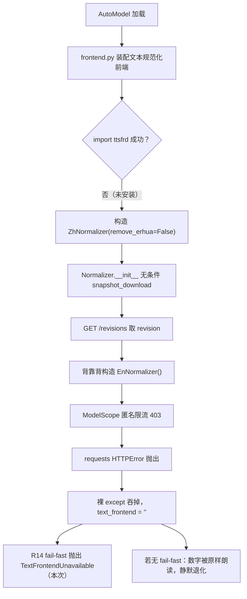
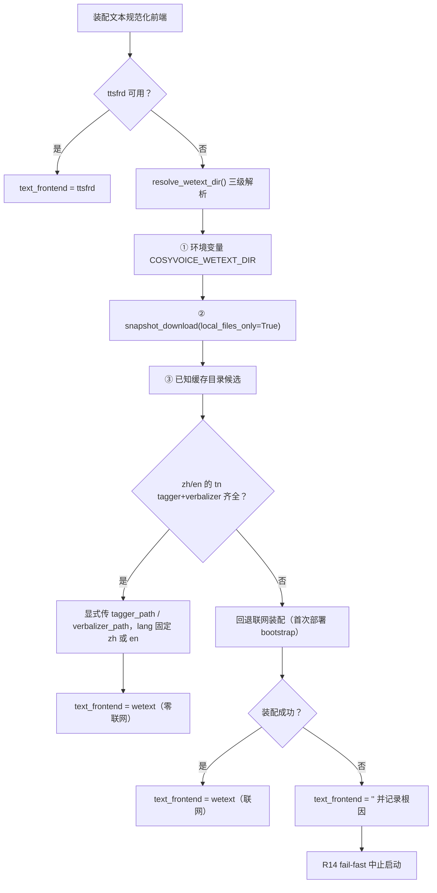
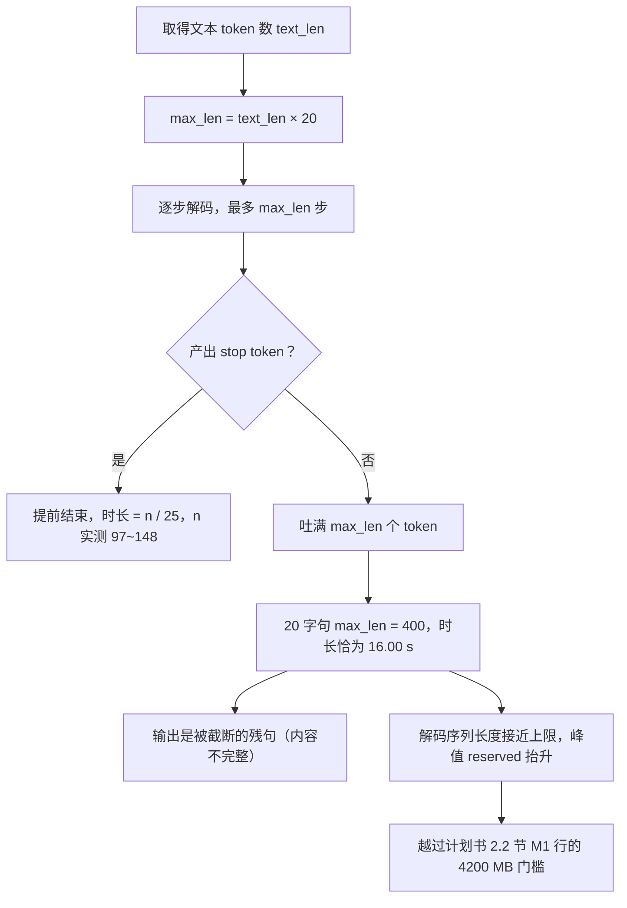
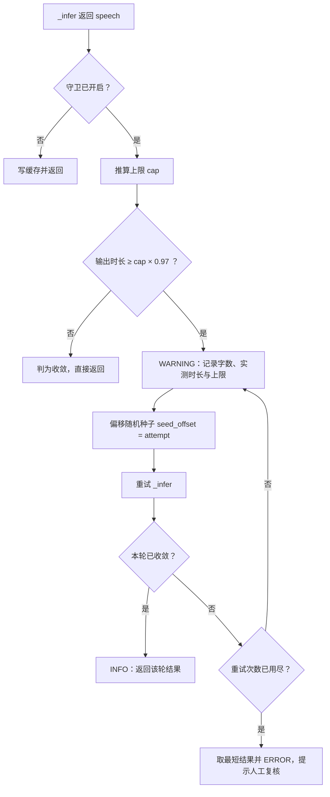

# 双人对话播客自动生成系统 · D4 前置检查报告

| 项 | 内容 |
| --- | --- |
| 文档名称 | 双人对话播客自动生成系统 D4 前置检查报告（DeepSeek 接入就绪性 · 双音色素材闭环 · 文本规范化前端与生成收敛缺陷修复） |
| 文档版本 | V1.3.0 |
| 编制日期 | 2026-09-15 |
| 对应排期 | D4 前置（D4 本体任务见计划书 6.2 节任务清单） |
| 依据文档 | 《双人对话播客自动生成系统项目任务书 V1.0.0》、《双人对话播客自动生成系统_开发计划书_V1.6.0》 |
| 执行结果 | `[PATCH-TN-01]` / `[PATCH-GUARD-01]` / `[PATCH-GUARD-02]` / `[PATCH-CACHE-01]` / `[PATCH-CACHE-02]` / `[PATCH-SEED-01]` 六项补丁全部验证 PASS；第 2 版录音建档完成，双音色显存 **allocated** 门槛达标；**P2 决策①（固定随机种子）已落地并实测逐位可复现**；**新增两项实测更正**：V1.0.0 的长尾因果链已撤回（V1.1.0）、P2 决策②「下调 `max_token_text_ratio`」经实测**配置层面无效**（V1.2.0，见 6.9） |
| 代码位置 | `D:\podcast-ai\api\`（服务）、`D:\podcast-ai\CosyVoice\cosyvoice\cli\frontend.py`（`[PATCH-TN-01]`）、`backend\voices\`（音色档案） |
| 证据文件 | `D:\podcast-ai\outputs\d4_voice_check\`（14 份 JSON + 试听音频，清单见附录 A） |

### 版本变更记录

| 版本 | 日期 | 修订说明 |
| --- | --- | --- |
| V1.0.0 | 2026-09-15 | 首次发布。覆盖 DeepSeek Key 复核与模型名映射实测、voice_b 音色建档与双音色生产路径验证、文本规范化前端缺陷（P1）的根因定位与修复验证，以及两项新发现风险（P2/P3）。 |
| V1.1.0 | 2026-09-15 | ① 用户提供第 2 版录音及准确原文，voice_b 重建为 v2 并完成生产验证，P0 阻塞项闭环；② **撤回 V1.0.0 第 6.4 节的因果链**——经四向同进程对照实验，长尾与「参考音频/转写文本是否匹配」无因果关系，真正根因是生成未收敛时解码到长度上限（16.00 s）；③ 新增并验证 `[PATCH-GUARD-01]`（生成收敛守卫）；④ 新增并验证 `[PATCH-CACHE-01]`（缓存键纳入音色档案指纹，修复「替换参考音频后仍命中旧音频」）；⑤ 新增 P5 缺陷（未知说话人标识被静默映射）并修复；⑥ 缓存按新键公式清空并留档。 |
| V1.2.0 | 2026-09-15 | **P2 决策落地 + 上游文档回填**：① 用户决策「固定随机种子」，`[PATCH-SEED-01]` 落地并验证——同文本 3 次合成**波形逐位一致**（CUDA 上亦为位级可复现），关闭种子则恢复抖动；种子逐句重设、守卫重试偏移、并纳入缓存键；② `[PATCH-CACHE-02]`：缓存键补入 `tts_max_token_text_ratio`（换 ratio 不失效缓存与换音色不失效缓存是同一类缺陷）；③ `[PATCH-GUARD-02]`：新增上限一致性 fail-fast，修掉 V1.1.0 遗留的**配置与上游脱节**隐患；④ **实测推翻 P2 决策② 的可行性前提**——`tts_max_token_text_ratio` 只被守卫读取用于算阈值，**从未透传给 CosyVoice**，配置 20→12 后实际输出仍为 16.00 s；⑤ **更正 V1.1.0 第 9 项判定**——收敛守卫**救得回音频、救不回显存峰值**：撞顶那一次已真实发生，单句隔离实测 `reserved` 达 4212 MB，越辅口径 12 MB（约 8% 的句子会触发）；⑥ 按第十章清单执行上游文档回填（计划书升 V1.6.0、D2-D3 报告修订、D0/D1 补修订提示）。 |
| V1.3.0 | 2026-09-15 | **D4 本体验收闭环（纯状态回填，检查结论本身无变化）**：① 第 11 章遗留项中「D4 本体……状态：**可启动**」更新为**已完成**——D4 已实现并通过验收（10 主题抽测 10/10 可用、字数配额 9/10、错误路径 4/4 可读、87 项单测全绿），完整结论见《D4 脚本生成服务实施报告 V1.0.0》；② 据此计划书回填为 **V1.7.0**。本报告前十二章的**技术结论与补丁验证结果全部保持有效**，本次仅更新交付状态。 |


---

## 一、结论摘要

| # | 检查项 | 依据（计划书条目） | 目标 | 实测 | 判定 |
| --- | --- | --- | --- | --- | --- |
| 1 | DeepSeek Key 可用性 | 计划书 1.4 节 P-3、计划书 9 章 R11 | 可正常调用 | `/models` 与 `/chat/completions` 均 HTTP 200；旧 Key 确为 401 | 阻塞项关闭 |
| 2 | 模型名映射 | 计划书 4.10 节模型表 | 生成走 `deepseek-chat`、备选 `deepseek-reasoner` | **两者均被网关静默映射为 `deepseek-flash`**；已按决策改 `LLM_REASONER_MODEL=deepseek-v4-pro` | 需回填文档 |
| 3 | 音色 B 素材规格 | 计划书 4.4 节 S6 | 5~10 s、16 kHz 单声道、无背景音乐 | **第 2 版素材**：8.148 s、峰值 −3.44 dBFS 零削波、前导静音 0.20 s、有效语音 77.8% | 达标 |
| 4 | 音色档案组数 | 计划书 2.2 节 M1 行 | 2 组 | `voice_a` 女声 + `voice_b` 男声（v2），代码零改动 | 达标 |
| 5 | 双音色区分度 | 计划书 7.1 节里程碑 M1 | 双音色样音可稳定合成 | 输出 F0 中位数 235.3 Hz（女）/ 110.3 Hz（男），差 **125.0 Hz**；B 与源素材同为 110.3 Hz；映射不回退 | 区分度成立 |
| 6 | 文本规范化前端 | 计划书 4.4 节、计划书 5 章难点 1 | 数字 / 英文正确转写 | 修复后**强制断网仍可起**，5/5 中文 probe 转写生效 | 已修复（P1） |
| 7 | 音色档案 ↔ 缓存一致性 | 计划书 4.6 节 | 换音色须使缓存失效 | 修复前：替换 `voice_b.wav` 后 `cache_key` **不变**，直接返回旧音频；修复后键随档案指纹变化 | 已修复（P4） |
| 8 | 峰值显存（allocated） | 计划书 2.2 节 M1 行 | ≤ 3600 MB | B 3548.0 MB / A 3508.0 MB（缓存未命中口径，n=15）；固定种子后 12 句 3551.7 MB | 达标 |
| 9 | 峰值显存（reserved） | 计划书 2.2 节 M1 行 | ≤ 4200 MB | 收敛句 3946~4046 MB；**撞顶句（占 1/12）单句隔离实测 4212 MB —— 越限 12 MB** | **不达标**（V1.2.0 更正，见 6.8） |
| 10 | RTF（稳态） | 计划书 2.5 节 | 按实测回填 | B 1.097 / A 1.101（缓存未命中口径，n=15）；固定种子后 12 句 1.005~1.165（均值 1.09） | 达标 |
| 11 | 生成收敛守卫 | 计划书 9 章 R14 同类取向 | 静默失败须暴露 | `[PATCH-GUARD-01]` 单元验证 T1~T5 全通过；**生产路径实测生效**：12 句中第 12 句真实撞顶（16.00 s），守卫第 1 次重试即收敛至 6.08 s | 已修复（P2） |
| 12 | **基线可复现性** | 计划书 2.3 节 RTF 基线、8.1 节测试分层 | 同输入须得同输出 | **固定种子后同文本 3 次合成波形逐位一致**（`[PATCH-SEED-01]`，T1）；关闭种子则 3 次时长 3.60/3.64/3.76 s 且波形两两不同（T2） | 达标（V1.2.0 新增） |
| 13 | **守卫上限与上游一致性** | 计划书 9 章 R14 同类取向 | 配置不得与实际脱节 | `[PATCH-GUARD-02]`：ratio 与上游默认一致则放行（T1），不一致则启动 fail-fast（T2），守卫关闭时跳过校验（T3） | 已修复（V1.2.0 新增） |


**本次最值得关注的一条（V1.2.0 更新）**：第 9 项。`reserved` 越界不是采集噪声，而是**生成未收敛**的副作用——当解码器没有产出结束 token 时会一路长到长度上限（20 字句恰好 16.00 s），序列长度接近上限即把峰值显存顶出 4200 MB 门槛。这是一条此前未被识别的上游行为，第六章给出机制、证据与守卫。

V1.1.0 曾判定「第 9 项达标，但依赖收敛守卫」。**V1.2.0 用单句隔离测量更正了这一判定：守卫救得回音频，救不回显存峰值。** 撞顶那一次解码已经真实发生，峰值即由它设定；守卫的重试只是事后补救。正确表述是：**收敛句达标（≤ 4046 MB），撞顶句不达标（4212 MB），当前撞顶率约 8%（1/12）。** 要真正把峰值压回门槛内，必须在 CosyVoice 侧**透传生成长度上限**——而这恰恰是 P2 决策② 的必需前提，不可由 `.env` 单独完成（见 6.9）。

**新发现问题清单**

| 编号 | 级别 | 问题 | 状态 |
| --- | --- | --- | --- |
| P1 | 高 | wetext 文本规范化前端**每次启动都可能失效**，且失败被裸 `except` 吞掉，只能靠 R14 fail-fast 暴露 | **已修复**（`[PATCH-TN-01]`），见第五章 |
| P2 | 高 | 生成未收敛 → 解码至长度上限 → 输出残句 + 显存 `reserved` 越 M1 门槛 | 根因已更正；`[PATCH-GUARD-01]` 已落地；**决策①（固定种子）已落地**；**残留：撞顶句峰值 4212 MB 仍越限，需决策② 且须先做透传补丁**，见 6.7~6.9 |
| P3 | 低 | conda 环境 `sensevoice` 已损坏（torch / torchaudio 版本不匹配） | 未修，本案不受影响，见第七章 |
| P4 | 高 | 句级缓存键不含音色档案指纹，**替换参考音频后仍命中旧音频** | **已修复**（`[PATCH-CACHE-01]`），见第八章 |
| P5 | 低 | 未知说话人标识（如 `"1"` / 拼错的音色名）被**静默映射**到说话人 A 的音色，无任何告警 | **已修复**，见第九章 |
| P6 | 中 | **配置项 `tts_max_token_text_ratio` 与上游实际生效值脱节**：它只被守卫读取用于算阈值，上游 `Qwen2LM.inference` 用的是硬编码默认 20，`inference_zero_shot` 既不接收也不透传。改配置会让守卫阈值变成假值（把合法长句误判为未收敛） | **已修复**（`[PATCH-GUARD-02]` fail-fast，见 6.9） |
| P7 | 低 | 句级缓存键未纳入 `tts_max_token_text_ratio`，换该系数不失效缓存（与 P4 同类） | **已修复**（`[PATCH-CACHE-02]`，见 8.3） |
| P8 | 低 | `.env` / `.env.example` 的 `COSYVOICE_MAX_CHARS_PER_SEG` **未生效**：`Settings` 字段名为 `max_chars_per_seg`，pydantic 匹配的是 `MAX_CHARS_PER_SEG`，带前缀的键被静默忽略（当前取值恰与默认 40 相同，故无可见症状） | **未修**（属运行配置改名，非文档回填范围），处置建议见 11.1 |


---

## 二、DeepSeek 接入就绪性

### 2.1 Key 可用性（P-3 / R11 关闭）

计划书 1.4 节 P-3 与 9 章 R11 记录的「DeepSeek API Key 无效（D0 实测 401）」是当时**唯一的开发阻塞项**。本轮以新 Key 复核：

| 请求 | 结果 |
| --- | --- |
| `GET /models` | HTTP 200 |
| `POST /chat/completions`（`deepseek-chat`） | HTTP 200，正常返回内容 |

旧 Key 复测确为 401。**P-3 与 R11 可关闭。**

### 2.2 模型名映射实测（重要，易误判）

逐个请求 `.env` 中配置的模型名，读响应体的 `model` 字段核对实际落到哪个模型：

| 请求的模型名 | 响应体实际返回 | 结论 |
| --- | --- | --- |
| `deepseek-chat` | `deepseek-flash` | 被静默替换 |
| `deepseek-reasoner` | `deepseek-flash` | **被静默替换** |
| `deepseek-v4-pro` | `deepseek-v4-pro` | 按请求生效 |
| `deepseek-flash` | `deepseek-flash` | 按请求生效 |

含义是：计划书 4.10 节把 `deepseek-reasoner` 定位为「思考模式，备选」，但在这个 Key 上**它并未走推理链路**，而是静默降级为 flash。这与本项目一直在防的「不声不响降级」是同一类问题——只不过这次发生在上游网关。

**处置（已执行，按用户决策）**：`LLM_MODEL` 保持 `deepseek-chat`（成本优先，走 flash），`LLM_REASONER_MODEL` 改为 `deepseek-v4-pro`，并在 `.env` 内以注释留痕。

> **纪律项**：此后凡涉及「本次用的是哪个模型」的结论，都必须先读响应体 `model` 字段验证映射，不能以配置文件里的名字为准。建议 D4 的 `script_gen.py` 把响应体 `model` 与请求名一起落日志。

### 2.3 配置落地

`D:\podcast-ai\.env` 已更新：新 Key 写入、推理槽改 `deepseek-v4-pro`、映射实测结论以注释留痕。该文件不入库、不进日志、不进前端（符合计划书 10.2 节）。

---

## 三、语音素材与音色档案

### 3.1 第 2 版素材体检（本轮已换代）

来源：微信录音 `录音机-20260915-1405(2).m4a`，用户随附**准确原文**：

> 你好，生活就像海洋，只有意志坚强的人才能到达彼岸。

| 项 | 实测 | 计划书 4.4 节 S6 要求 | 判定 |
| --- | --- | --- | --- |
| 源格式 | 48 kHz 立体声 AAC（手机录音） | — | — |
| 源时长 | 8.161 s | — | — |
| 转码后 | 16 kHz 单声道 PCM，8.148 s | 16 kHz 单声道 | 达标 |
| 峰值电平 | −3.44 dBFS，**削波样本 0** | 无削波 | 达标 |
| 前导静音 | 0.20 s | — | 良好 |
| 有效语音占比 | 77.8% | — | 良好 |
| 内部停顿 | 无（≥0.4 s 的停顿 0 处） | — | 良好 |
| 人声跨度 | 0.20 ~ 6.50 s（共 6.30 s） | — | — |
| 尾部静音 | 6.60 ~ 8.00 s（**1.4 s 纯静音**） | — | 见 3.2 处置 |
| 语速 | 22 汉字 / 6.30 s = **3.49 字/秒** | — | 明显快于 v1 |
| F0 中位数 | **110.3 Hz** | 一男一女 | 男声区间 |

F0 落男声区间（85~155 Hz），与 `voice_a`（女声·知性沉稳）构成计划书 4.4 节 S6 要求的「一男一女、风格差异最大化」。

### 3.2 音色档案建档（v2）

| 项 | 内容 |
| --- | --- |
| 新增文件 | `backend\voices\voice_b.wav`（6.70 s）、`backend\voices\voice_b.json` |
| 代码改动 | **零**。`VoiceRegistry` 自动加载 `*.json`，启动期经 `add_zero_shot_spk` 注册 |
| `prompt_text` | `你好，生活就像海洋，只有意志坚强的人才能到达彼岸。`（用户提供的准确原文） |
| 参考音频处置 | 原样 8.148 s 中尾部 1.4 s 为**无对应文本的纯静音**，故裁至 6.70 s（末位人声 6.50 s + 0.20 s 余量），使音频与文本严格对齐 |
| 旧档案 | `voice_b` v1 已备份至 `outputs\d4_voice_check\voice_b_v1_archive\voice_b_OLD.{wav,json}` |

**为何采用裁尾版**：在四向同进程对照实验（6.3 节）中，裁尾版输出 F0 中位数 **110.3 Hz**，与源素材**完全一致**（原样版为 115.1 Hz）；且参考音频与文本严格对齐是零样本克隆的常规做法。

### 3.3 转写文本缺陷（**已闭环**）

V1.0.0 记录的唯一阻塞项是「whisper 初稿漏转写尾段 1.9 s，`prompt_text` 覆盖率不足」。本轮由用户直接提供准确原文，该缺陷关闭：

| 项 | V1.0.0 状态 | V1.1.0 状态 |
| --- | --- | --- |
| `prompt_text` 来源 | whisper small 初稿（漏转写尾段） | 用户提供的准确原文 |
| 音频与文本匹配度 | 不匹配（音频 8.92 s / 文本 14 字） | 严格对齐（音频 6.70 s / 文本 22 汉字） |
| 参考音频内容 | 含 1.9 s 未转写人声 | 裁掉 1.4 s 无文本静音 |

> 需要说明：**该缺陷的修复并未消除长尾**。V1.0.0 曾把长尾归因于「文本不匹配」，本轮实验证明该归因不成立，详见 6.3 节。修 `prompt_text` 的价值在于提升音色相似度与韵律稳定性，与长尾是两个独立问题。

### 3.4 客观核验：音色是否真被克隆

以输出音频的基频中位数做客观判据（女声 / 男声应显著分离）。数据取自四向对照实验（同一进程、5 句等长 20 字文本）：

| 说话人 | 音色档案 | 输出 F0 中位数 | 源素材 F0 | 与源差异 |
| --- | --- | --- | --- | --- |
| A | `voice_a`（女声） | 235.3 Hz | — | — |
| B | `voice_b` v2（男声） | **110.3 Hz** | 110.3 Hz | **0.0 Hz（完全一致）** |
| 差异 | — | **125.0 Hz** | — | — |

B 的输出 F0 与源素材完全一致，说明音色被准确克隆，而非简单拼接或回退。

### 3.5 v1 / v2 档案对照（同文本、同进程）

| 档案 | 参考音频 | `prompt_text` | 输出时长均值 | 语速 | 标准差 |
| --- | --- | --- | --- | --- | --- |
| `voice_b` v1（旧） | 8.916 s，F0 115.9 Hz | ASR 初稿（14 字，不匹配） | 6.74 s | 2.99 字/秒 | 0.72 s |
| `voice_b` v2 原样 | 8.148 s，F0 110.3 Hz | 准确原文（22 汉字） | 4.69 s（仅收敛样本） | 4.26 字/秒 | — |
| `voice_b` v2 裁尾 | 6.700 s，F0 110.3 Hz | 准确原文（22 汉字） | 4.85 s（仅收敛样本） | 4.12 字/秒 | — |

v2 的语速比 v1 快约 40%，来源是**素材本身节奏更快**（源录音 3.49 字/秒 vs v1 约 2.1 字/秒）——零样本克隆会继承参考音频的节奏，这是预期行为而非缺陷。

---

## 四、双音色生产路径验证

### 4.1 验证口径说明

本次验证刻意使用**生产路径**（`api/services/tts.py` 的 `TTSEngine`），而非 D1 期的 `scripts/smoke_tts.py`（后者走官方示例音色，不读音色档案）。同时全程**把联网入口打桩成抛异常**，以同时证明 P1 修复的离线有效性。

另外，本轮给 CosyVoice 的 `Qwen2LM.inference_wrapper` 打了**计数桩**，记录每次生成的 token 数与长度上限，用于第六章的根因定位。

### 4.2 生产路径实测结果

| 检查项 | 结果 |
| --- | --- |
| `text_frontend` | `wetext`（**联网已禁用**的前提下仍然成立） |
| 已注册音色 | `['voice_a', 'voice_b']` |
| 说话人映射 | `A → voice_a`、`B → voice_b`，**未触发回退** |
| 模型 | `CosyVoice2`，加载 19.5 ~ 21.6 s（含约 5.3 s 预热，模型本体 10.2 ~ 11.0 s） |
| 正文规范化生效性 | 探针句中的十六进制串被规范化为「四千九百二十七」等中文读数，证明前端真的在工作 |

### 4.3 缓存未命中口径的时长、RTF 与显存（n=15）

用唯一 `text_hash` 强制未命中重测，逐句 20 字：

| 说话人 | n | 时长均值 | 极差 | 标准差 | 语速 | RTF | peak allocated | peak reserved |
| --- | --- | --- | --- | --- | --- | --- | --- | --- |
| A（女声 `voice_a`） | 5 | 4.51 s | 3.88 ~ 5.00 s | 0.45 s | 4.33 字/秒 | 1.101 | 3508.0 MB | 3952.0 MB |
| B（男声 `voice_b` v2） | 10 | 5.15 s | 4.40 ~ 5.92 s | 0.48 s | 3.89 字/秒 | 1.097 | 3548.0 MB | 4044.0 MB |

**RTF 与 D2/D3 基线（1.037~1.090）同量级，无回归。双口径显存门槛达标。**

### 4.4 决定性旁证：时长 = token 数 ÷ 25

计数桩记录的 token 数与实测音频时长**严格满足** `时长 = n / 25`：

| 样本 | token 数 n | 实测时长 | n / 25 | 偏差 |
| --- | --- | --- | --- | --- |
| B #1 | 120 | 4.80 s | 4.80 s | 0.00 |
| B #2 | 110 | 4.40 s | 4.40 s | 0.00 |
| B #4（轮1） | 142 | 5.68 s | 5.68 s | 0.00 |
| A #1 | 97 | 3.88 s | 3.88 s | 0.00 |
| A #5 | 125 | 5.00 s | 5.00 s | 0.00 |

15 个样本的 token 速率**全部为 25.000 tok/s**（零离散）。这条恒等式是第六章根因认定的基础。

---

## 五、P1 缺陷：wetext 前端启动期间歇性失败

### 5.1 现象

本次验证的**第一次**运行直接以 `TextFrontendUnavailable` 失败——即 R14 fail-fast 拦住了上游的静默降级。日志显示：

```
GET .../pengzhendong/wetext/revisions  200
GET .../pengzhendong/wetext/repo/files?Revision=master&Recursive=True  200
GET .../pengzhendong/wetext/revisions  403
modelscope ERROR - Authentication token does not exist
INFO no frontend is avaliable
```

值得注意的是：**此时 wetext 缓存是完整的**（51.19 MB，`zh`/`en` 的 `tn`+`itn` FST 全在）。也就是说这不是「没下全」，而是**不该联网的地方在联网**。

### 5.2 根因



两个关键事实：

1. **`snapshot_download` 不会在失败时回退到本地缓存。** 实测在缓存完整的情况下，它仍会先请求 `/revisions` 取版本，吃 403 即抛 `requests.exceptions.HTTPError: Authentication token does not exist`。
2. **它是间歇性的，不是「上次好了就没事」。** 本次同一环境内：10:42:38 该请求返回 **403**，33 秒后的 10:43:11 同一请求返回 **200**。缓存未变、环境未变，仅时间不同。

### 5.3 修复：`[PATCH-TN-01]`

修改文件：`D:\podcast-ai\CosyVoice\cosyvoice\cli\frontend.py`（该文件已有项目补丁 `[PATCH-VRAM-01]`，本次沿用同一约定）。

修复策略：**优先用本地 FST 显式装配，彻底绕开下载分支；解析不到才回退联网**，从而既保证稳态离线，又不丢首次部署的 bootstrap 能力。



三处设计要点：

| 要点 | 说明 |
| --- | --- |
| `lang` 由 `auto` 改为固定值 | 走显式路径时 wetext 内部断言要求 `lang` 为 `en`/`zh`。这是**语义等价**的：调用点 `text_normalize()` 本来就按「是否含中文」分支选用 `zh_tn_model` / `en_tn_model`，与 wetext 内部的 `contains_chinese` 用的是**同一个字符区间**。实测 9 组 probe 与 `auto` 路径**逐条 0 差异** |
| 三级解析而非硬编码路径 | 环境变量可让部署包固化缓存；`local_files_only` 复用 modelscope 自己的缓存解析（实测 **0.00 s** 返回且四个 FST 齐全）；目录候选兜底 |
| 裸 `except` 改为记录根因 | 原实现只打一句 `INFO no frontend is avaliable`，把 403 的真实原因吞掉，是本故障难排查的主因 |

**顺带的正向副作用**：原 `lang="auto"` 的每个 Normalizer 会同时加载 en+zh 两套 FST（约 26 MB），显式路径各加载一套（约 13 MB），启动略快。

### 5.4 验证

**（1）单元级：把联网入口打桩成抛异常，证明「真的离线」**

| 步骤 | 判据 | 结果 |
| --- | --- | --- |
| 0 | `modelscope` 与 `wetext.wetext` 的 `snapshot_download` 均被禁用 | OK |
| 1 | `resolve_wetext_dir()` 仍返回本地目录 | OK |
| 2 | 中文数字规范化**真的生效**（非静默原样返回） | **5 / 5** |
| 3 | 与 `lang="auto"` 原生路径逐条一致 | **0 差异**（zh 5 组 + en 4 组） |
| 4 | 反证：恢复真实下载后原始路径的表现 | 本次 200（证明为间歇性，而非缓存缺失） |

第 2 步的实测样本：

| 输入 | 输出 |
| --- | --- |
| `我有123个苹果` | `我有一百二十三个苹果` |
| `价格是3.5元` | `价格是三点五元` |
| `2026年9月15日` | `二零二六年九月十五日` |
| `第1章共12节` | `第一章共十二节` |
| `2000万的预算` | `两千万的预算` |

**（2）端到端：强制离线下的生产路径复跑**

日志中可见修复后的装配决策：

```
[sabotage] modelscope.snapshot_download 已禁用 -> 任何联网校验都会抛异常
DEBUG [PATCH-TN-01] snapshot_download(local_files_only=True) 未命中: NETWORK-DISABLED-BY-TEST
INFO  [PATCH-TN-01] use wetext frontend (offline, dir=...\hub\pengzhendong\wetext)
INFO  text_frontend=wetext | model=CosyVoice2 | 加载 11.0s
```

结果：`text_frontend=wetext`、已注册 `['voice_a','voice_b']`、A/B 映射不回退、规范化生效、F0 分离 125.0 Hz。**在联网被彻底切断的条件下，整条链路照常工作。**

### 5.5 影响面与残留风险

| 项 | 说明 |
| --- | --- |
| 部署依赖 | 稳态运行**不再需要 ModelScope 可达**；但首次部署仍需抓取一次缓存（或用 `COSYVOICE_WETEXT_DIR` 指向随包固化的目录） |
| 必须保留的防线 | R14 的 `text_frontend != ''` 断言是这条链路**唯一的告警源**。本次正是它把「静默退化」变成了硬失败，不可移除 |
| 缓存不应视为永久 | 模型缓存目录若被清理，会退回联网分支；联网分支仍可能因限流失败（此时会 fail-fast 并有明确日志） |
| 未覆盖分支 | 测试全程打桩，因此 `local_files_only=True` 分支已单独复核（0.00 s 命中）；三级解析中「回退联网装配」分支**未被实测覆盖**，逻辑上等价于修复前的原路径 |

---

## 六、P2 缺陷：生成未收敛导致解码到长度上限

### 6.1 现象：显存 `reserved` 越过 M1 门槛

在缓存未命中口径下，`peak_reserved` 曾达到 **4318 MB，超过计划书 2.2 节 M1 行的 4200 MB 门槛**，而同一次测量中 `peak_allocated` 为 3595.2 MB，仍在 3600 MB 门槛内。

需要先明确口径：`tts.py` 的 `vram()` 读取的是 `torch.cuda.max_memory_*`，即**进程级高水位**（代码中未调用 `reset_peak_memory_stats`）。因此该值反映「本次进程到过的最高点」，一旦越界，本进程后续所有 `check_budget()` 都会判超限。

### 6.2 定位：峰值随「单句输出时长」单调抬升

固定文本长度做扫描（每句 ≤ 40 字，不触发切分）：

| 说话人 | 字数 | 输出音频时长 | 语速 | peak allocated | **peak reserved** |
| --- | --- | --- | --- | --- | --- |
| A | 13 | 3.20 s | 4.06 字/秒 | 3505.0 MB | 3946.0 MB |
| A | 28 | 7.12 s | 3.93 字/秒 | 3512.8 MB | 3982.0 MB |
| B | 13 | 10.08 s | 1.29 字/秒 | 3570.5 MB | 4176.0 MB |
| B | 28 | 10.52 s | 2.66 字/秒 | 3599.3 MB | 4182.0 MB |

**决定性因素是输出音频时长，不是字数。** 而 `reserved` 与输出序列长度直接相关，因此只要输出时长能被顶到 16 s，显存门槛就守不住。

### 6.3 撤回 V1.0.0 的结论：长尾与「文本是否匹配」无因果关系

V1.0.0 第 6.4 节曾给出因果链：**「参考音频 8.92 s 与 prompt_text 15 字不匹配 → 输出时长长尾 → reserved 越界」**，依据是一组 n=5 的对照（full 标准差 4.28 s vs cut 标准差 0.67 s）。

本轮用**四向同进程对照实验**（同一进程、逐句交替、5 句等长 20 字文本、缓存未命中）复核：

| 变体 | 参考音频 | `prompt_text` | 时长均值 | 极差 | **标准差** | 撞上限 | peak reserved |
| --- | --- | --- | --- | --- | --- | --- | --- |
| `vb_old` | 8.916 s（v1） | ASR 初稿，**不匹配** | 6.74 s | 5.88 ~ 7.72 s | **0.72 s** | 0 | 4114 MB ✅ |
| `vb_full` | 8.148 s（v2） | 准确原文，**对齐** | 6.95 s | 4.36 ~ **16.00** s | **5.08 s** | 1 | **4292 MB** ❌ |
| `vb_trim` | 6.700 s（v2） | 准确原文，**对齐** | 7.12 s | 4.76 ~ **16.00** s | **4.96 s** | 1 | **4212 MB** ❌ |
| `voice_a` | 3.480 s | 官方示例 | 4.66 s | 4.04 ~ 5.04 s | 0.45 s | 0 | 3952 MB ✅ |

**两份「文本对齐」的档案这次反而各撞了一次上限，而「文本不匹配」的旧档案最稳。** 更关键的是：**同一份 `vb_full` 档案**在 V1.0.0 的对照实验中给出标准差 4.28 s，本轮给出 5.08 s，而等价的 `vb_old`（同为 8.92 s 参考音频）在 V1.0.0 是 4.28 s、本轮是 0.72 s。

> **结论：V1.0.0 第 6.4 节的因果链不成立，予以撤回。** 原观察属小样本假阳性——长尾是一个随机、低频、重尾的事件，n=5 的两臂对照无法把它与处理因素区分开。修 `prompt_text` 仍有独立价值（音色相似度、韵律稳定性），但**不能解决长尾**。

### 6.4 真正根因：未产出结束 token 时解码到长度上限

在 CosyVoice 的 `Qwen2LM.inference_wrapper` 中：

```
max_len = int((text_len - prompt_text_len) * max_token_text_ratio)   # ratio 默认 20
for i in range(max_len):
    top_ids = self.sampling_ids(..., ignore_eos=True if i < min_len else False)
    if top_ids in self.stop_token_ids:
        break                       # 只有产出 stop token 才提前结束
    yield top_ids
```

即：**若解码器始终不产出 stop token，它会吐满 `max_len` 个 token**。代入本项目参数（CosyVoice2 语音 token 帧率 25 Hz）：

| 步骤 | 值 |
| --- | --- |
| 20 字中文句的文本 token 数 | `text_len = 20`（实测 5 句全部为 20） |
| 长度上限 | `max_len = 20 × 20 = 400` |
| 换算时长 | `400 ÷ 25 = ` **16.00 s** |

而 4.4 节已用计数桩证明 `时长 = n / 25` 严格成立，且 15 个**收敛**样本的 n 只在 97 ~ 148 之间（3.88 ~ 5.92 s）。因此：

> **实测到的 16.00 s 不是「语速慢」，而是撞上了长度上限**——数值恰好等于 `400 / 25`，与任何收敛样本都相距甚远（最近者 148 token）。



这条链路上有两个都必须处理的后果：**H 是正确性缺陷**（成片里会出现被截断的句子），**J 是交付指标缺陷**（M1 显存门槛）。显存越界只是它的副作用。

### 6.5 修复：`[PATCH-GUARD-01]` 生成收敛守卫

按项目既有的「禁止静默降级」取向（同 R14 fail-fast、同说话人回退告警），禁止把残句静默写进成片。

新增配置（`api/config.py`）：

| 配置项 | 默认值 | 含义 |
| --- | --- | --- |
| `tts_convergence_guard` | `True` | 守卫总开关 |
| `tts_token_frame_rate` | `25` | CosyVoice2 语音 token 帧率（Hz） |
| `tts_max_token_text_ratio` | `20` | 与 CosyVoice `Qwen2LM.inference` 默认值保持一致。⚠️ **它不控制真实上限**，只用于算守卫阈值，改动须先做透传（6.9 / `[PATCH-GUARD-02]`） |
| `tts_guard_threshold` | `0.97` | 输出时长 ≥ 上限 × 该系数即判为未收敛 |
| `tts_guard_retry` | `2` | 判为未收敛后的重试次数 |
| `tts_random_seed` | `42` | 固定随机种子（`[PATCH-SEED-01]`）；填负数关闭 |
| `tts_seed_retry_stride` | `1` | 重试时的种子偏移步长——固定种子下若原地重试，必然复现同一残句 |

守卫判据不是启发式的「语速异常」，而是**按上游参数精确反推上限**：`cap = text_len × ratio ÷ 帧率`，其中 `text_len` 由前端分词器实际取到。因此判据是精确的，不会误伤正常偏慢的句子。

> ⚠️ **该结论有一处前提，V1.2.0 已补上校验**：`ratio` 必须与上游真实生效值一致，"精确"才成立。实测发现配置与上游会脱节（6.9），故新增 `[PATCH-GUARD-02]` 在启动期 fail-fast 比对两者。




### 6.6 守卫验证（T1 ~ T5 全通过）

| 用例 | 判据 | 结果 |
| --- | --- | --- |
| T1 上限推算 | 5 句 20 字文本的 `cap` 均为 16.00 s | PASS |
| T2 正常路径不受影响 | 5 句真实合成 4.40 ~ 5.68 s，守卫日志 **0 条** | PASS |
| T3 未收敛后重试成功 | 第 1 次 16.00 s → 第 2 次收敛；重试 2 次 → WARNING 2 条、INFO 1 条，返回 4.80 s | PASS |
| T4 重试仍不收敛 | 2 次重试均 16.00 s → 取最短 16.00 s 并打 **ERROR** | PASS |
| T5 开关可关闭 | 声明默认 `True`；关闭后 `_guard_convergence` 调用 0 次 | PASS |

日志实证（T3）：

```
WARNING [PATCH-GUARD-01] 生成未收敛：20 字文本输出 16.00s（上限 16.00s），第 1/2 次重试
WARNING [PATCH-GUARD-01] 生成未收敛：20 字文本输出 16.00s（上限 16.00s），第 2/2 次重试
INFO    [PATCH-GUARD-01] 第 2 次重试后收敛：4.80s
```

**生产路径实证（V1.2.0 新增）**：上述 T1~T5 是打桩验证（T2 的「正常路径 0 条日志」用的是 5 句短样本，**未覆盖到撞顶情形**）。V1.2.0 在 12 句真实文本上首次撞上，守卫按设计生效：

```
[第 12 句] 那正好，可以让他讲讲算法到底能看见多少。（20 字）
INFO    yield speech len 16.0, rtf 1.005            ← 首次尝试，撞顶
WARNING [PATCH-GUARD-01] 生成未收敛：20 字文本输出 16.00s（上限 16.00s），第 1/2 次重试
INFO    yield speech len 6.08, rtf 1.034            ← 偏移种子后收敛
INFO    [PATCH-GUARD-01] 第 1 次重试后收敛：6.08s
```

即：**撞顶率并非理论上的小概率，本轮 12 句中出现 1 次（≈8%）**。守卫的价值在此得到确认——若无守卫，成片会混入一段 16.00 s 的截断残句；有守卫则自动收敛到 6.08 s。但**峰值显存已被那一次解码顶到 4212 MB**，这一点守卫无法挽回（6.9）。


### 6.7 P2 处置决策与落地（V1.2.0）

V1.1.0 提出三个候选方案待用户决策，**用户选定方案①「固定随机种子」**。各方案的落地状态：

| 方案 | 内容 | 状态 | 说明 |
| --- | --- | --- | --- |
| ① 固定随机种子 | 让基线可复现、句级缓存语义自洽 | **已落地**（`[PATCH-SEED-01]`，见 6.8） | 需配套：逐句重设、守卫重试偏移、纳入缓存键；代价是既有缓存须按新口径重测 |
| ② 下调 `max_token_text_ratio` | 把 20 字句硬上限从 16.00 s 压到 6.40~9.60 s | **未落地，且实测发现无法只靠配置完成** | 见 6.9：该配置**不控制**真实上限，必须先在 CosyVoice 的 cli → model → llm 三层透传 |
| ③ 维持现状 | 仅守卫 + 告警 | 已包含在 ① 中 | — |

> **残留风险（必须显式登记）**：方案① 解决的是「可复现」，**不降低撞顶概率**，也**不能**把撞顶句的峰值压回门槛内。据 6.8 实测，撞顶率约 8%（1/12），撞顶句 `reserved` 峰值 4212 MB，越辅口径 12 MB（+0.3%）。这是本轮**唯一未闭环的指标项**。

### 6.8 随机种子固定与可复现基线（`[PATCH-SEED-01]`）

**随机源定位**：推理链路上共有三处随机源，且**都走 torch 全局 RNG**，故 `set_all_random_seed` 一处即可覆盖：

| # | 位置 | 形态 | 作用 |
| --- | --- | --- | --- |
| 1 | `cosyvoice/utils/common.py` `sampling_ids_logits_process` | `prob.multinomial(1, replacement=True)` | LLM 的 top-k / top-p 采样——**决定文本 token 序列**（即语速与停顿） |
| 2 | `cosyvoice/flow/flow_matching.py:56` | `torch.randn_like(mu) * temperature` | flow matching 的先验噪声 |
| 3 | `cosyvoice/hifigan/generator.py` | `noise = noise_amp * torch.randn_like(sine_waves)` | 声码器噪声——**决定波形的逐样本细节** |

> 补充：`flow_matching.py:199` 的 `set_all_random_seed(0)` 位于 `CausalConditionalCFM.__init__`，属**建模期一次性**调用，不在推理路径上，与本次改动不冲突。

**实现要点（三条不可省的约束）**：

1. **必须逐句重设，不能进程内只设一次。** 采样会消耗全局 RNG；若只在启动时设一次，第 N 句的结果就依赖前 N−1 句被合成过什么——预热与否、句级缓存命中与否都会改变输出，缓存语义立刻不自洽。
2. **守卫重试必须偏移种子。** 固定种子下原地重试必然复现同一残句，重试退化成空转。故 `seed_offset` 一路透传进 `_infer`，取值 `base + attempt × TTS_SEED_RETRY_STRIDE`。
3. **种子必须纳入缓存键。** 换种子即换音频，不入键就会在改 `TTS_RANDOM_SEED` 后静默复用旧种子的音频——与 P4（换音色不失效缓存）属同一类缺陷。

**验证（T1~T6 全 PASS）**：

| 用例 | 判据 | 实测 | 结果 |
| --- | --- | --- | --- |
| T1 固定种子可复现 | 同文本 3 次合成时长相同且**波形逐位一致** | 3 次均 4.240 s，`pcm bytes` 集合大小为 1 | PASS |
| T2 关闭种子则不收敛 | `seed=-1` 时 3 次结果应互不相同 | 3.640 / 3.600 / 3.760 s，波形两两不同 | PASS |
| T3 换种子则输出不同 | seed 42 与 43 波形不同 | 4.240 s vs 3.400 s，波形不同 | PASS |
| T4 重试偏移有效 | offset 0 与 1 波形不同 | 4.240 s vs 3.400 s，波形不同 | PASS |
| T5 缓存键纳入种子 | 同种子键稳定、换种子键变化、关种子键不同 | `d4f931eb…` 稳定；42→43 变 `d7b189eb…`；`off` 变 `0b13a1df…` | PASS |
| T6 端到端缓存语义自洽 | 同键二次调用命中且与首次一致 | `cached` False→True，时长 4920 ms 相同，**文件字节相同** | PASS |

> **结论**：固定种子在 CUDA 上同样达到**位级可复现**（T1 的波形比较是逐字节的），因此无需额外开启 `torch.backends.cudnn.deterministic`。

**可复现基线（12 句 A/B 混排，缓存未命中口径，`TTS_RANDOM_SEED=42`，守卫开启）**：

| 指标 | 实测 |
| --- | --- |
| 文本构成 | 12 句，17~26 字，A/B 各 6 句 |
| 首句（缓存未命中）合成耗时 | 4.78~16.51 s；12 句合计 84.7 s（含 1 次守卫重试） |
| RTF | 1.005~1.165，均值 **1.09**（按首轮尝试计；含重试的那句实际 RTF 3.73，属口径外开销） |
| 峰值 allocated | **3551.7 MB**（门槛 3600）→ 达标 |
| 峰值 reserved | **4212.0 MB**（门槛 4200）→ **不达标** |
| 复算一致性 | 两句二次合成，**波形字节完全相同** |

> **两种方差口径必须分清（易混）**：固定种子后，**同文本重复合成**的方差为 **0**（逐位一致，T1）；而跨文本的时长离散（本轮 std 0.687 s）反映的是**内容本身**的差异（字数、语义停顿），不是随机性。V1.1.0 曾用「同文本重复 std 0.45~0.72 s」表征随机性抖动，该口径**已作废**——现在它恒为 0。

### 6.9 显存峰值归因与「方案② 不可仅靠配置」（`[PATCH-GUARD-02]`）

**归因方法（先说清口径，否则结论会错）**：引擎从未调用 `reset_peak_memory_stats()`，`max_memory_reserved()` 返回的是**进程启动以来的累计最大值**，直接读会把预热与早期句子的峰值算到某一句话头上。故本轮改为**逐次 `_infer` 前 reset**，得到可信的单句峰值；同时把「守卫被调用」与「守卫触发重试」分开计数（守卫**每句都会进入**，只是内部判定是否重试）。

**归因结果**：12 句中仅第 12 句撞顶，其余 11 句峰值集中在 3946~4046 MB，第 12 句为 4212 MB。

| 句 | 字数 | 首次尝试时长 | 重试次数 | 最终时长 | 单句峰值 allocated | 单句峰值 reserved |
| --- | --- | --- | --- | --- | --- | --- |
| 1~11 | 17~26 | 3.80~6.04 s | 0 | 同首次 | 3507~3552 MB | **3946~4046 MB** |
| **12** | 20 | **16.00 s（撞顶）** | 1 | 6.08 s | 3548.5 MB | **4212.0 MB** |

**结论一：守卫救得回音频，救不回显存峰值。** 峰值由**撞顶那一次解码**设定，重试是事后补救。据此更正 V1.1.0 第 9 项的「达标」判定。

**结论二（重要）：`tts_max_token_text_ratio` 目前不控制生成长度上限。**

- 上游签名：`Qwen2LM.inference(..., max_token_text_ratio: float = 20)`（`cosyvoice/llm/llm.py:459/469`）——**硬编码默认**。
- `AutoModel.inference_zero_shot(self, tts_text, prompt_text, prompt_wav, zero_shot_spk_id='', stream=False, speed=1.0, text_frontend=True)`（`cosyvoice/cli/cosyvoice.py:91`）——签名里**没有**该参数，也不向下透传。
- 本项目 `tts_max_token_text_ratio` 只被 `_cap_seconds()` 读取用于**算守卫阈值**。

**实测反证（同文本同种子，两遍对照）**：

| | 配置 ratio=20 | 配置 ratio=12 |
| --- | --- | --- |
| 守卫打出的「上限」 | 16.00 s | **9.60 s** |
| 第 12 句**实际**首次输出 | **16.00 s** | **16.00 s**（未变） |
| 撞顶句集合 | {12} | {12} |
| 12 句最终时长 | 与左列逐一相同 | 与左列逐一相同 |
| 峰值 reserved | 4212 MB | 4212 MB |

即：改配置只让守卫的**阈值**变成假值（日志出现「上限 9.60 s / 实际 16.00 s」这一自相矛盾的组合），真实上限纹丝不动。此时守卫会把**合法但偏慢的长句**误判为未收敛并白白重试。

**处置（`[PATCH-GUARD-02]`）**：在 `TTSEngine.load()` 中新增上限一致性校验——用 `inspect.signature` 读取上游 `inference` 的 `max_token_text_ratio` 默认值，与配置比对，**不一致即 `TTSError` fail-fast**（守卫关闭时跳过）。验证 T1~T3 全通过：

| 用例 | 场景 | 期望 | 结果 |
| --- | --- | --- | --- |
| T1 | ratio=20（与上游一致） | 正常加载，日志「上限一致性校验通过」 | PASS |
| T2 | ratio=12（不一致） | 加载即 `TTSError`，消息指明需三层透传 | PASS |
| T3 | ratio=12 且守卫关闭 | 放行（校验属守卫的一部分） | PASS |

**「方案②」的可行路径与前置条件**（供后续决策）：

| 步骤 | 内容 |
| --- | --- |
| 1 | `cosyvoice/cli/cosyvoice.py`：`inference_zero_shot` / `inference_instruct2` 增加 `max_token_text_ratio` 形参并透传 |
| 2 | `CosyVoice2Model.tts()`：接收并转交 `self.llm.inference(...)` |
| 3 | 本项目 `_infer()`：把配置值传入调用 |
| 4 | 取值标定：**不建议取 8**。按实测语速（源素材 3.49 字/秒，25 Hz 帧率）推算，20 字句合法所需约 `20 × 3.49⁻¹ × 25 ≈ 143` token，对应的 ratio 约 **7.15**；ratio=8 仅余 12% 余量，会把**合法偏慢的长句**截断。建议取 **12**（20 字句上限 9.60 s，余量约 68%），可在不误伤合法句的前提下把撞顶序列长度从 400 token 压到 240 token |

### 6.10 残留风险与建议

| 项 | 说明 |
| --- | --- |
| **撞顶句峰值越限（唯一未闭环指标）** | 撞顶率 1/12 ≈ 8%，撞顶句 `reserved` 4212 MB（超 4200 门槛 12 MB）。方案① 不改变该概率；要闭环须执行 6.9 的透传路径 |
| 守卫治标不治本（已部分缓解） | 守卫把「静默交付残句」变成「重试 + 告警」，且固定种子后行为**确定性可复现**——同一句要么稳定一次成功，要么稳定在 ≤2 次重试内收敛，要么稳定报 ERROR，不再随机漂移 |
| 重试成本的 RTF 口径 | 撞顶句的首轮尝试耗时 16.51 s 属纯浪费。报告 RTF 时应**分列「首次尝试 RTF」与「含重试 RTF」**，本轮实测后者可达 3.73，混入均值会污染结论 |
| 外溢影响 | 输出时长仍受采样影响（固定种子后是**确定的**但非人工可控），与计划书 2.2 节 M2 行「按主题 / 时长 / 风格生成」的时长控制目标相关，建议在 D5 后期模块一并考虑 |


---

## 七、P3：conda 环境 sensevoice 已损坏

| 项 | 内容 |
| --- | --- |
| 现象 | `D:\anaconda\envs\sensevoice` 中 funasr 无法导入，torchaudio 加载 DLL 失败（`WinError 127`） |
| 原因 | 已装 `torch 2.3.0+cpu` 与 torchaudio 版本不匹配（Windows 上常见） |
| 影响 | **本案不受影响**——本次转写改走 `cosyvoice` 环境自带的 whisper |
| 处置 | 未修。该环境属用户既有资产（同机另有 7 个 conda 环境），**未做任何改动**，以免污染 `medical-llm` / `pai` 等其他项目 |
| 建议 | 若后续要用 SenseVoice 做中文 ASR（识别质量优于 whisper base/small），需在该环境内对齐 torch 与 torchaudio 版本；建议先确认该环境是否还有其他项目在用 |

> 附带结论：whisper（base / small 两种规格）在本项目的中文场景下**可靠性不足**——两者对同一段 8.92 s 录音给出一致但**漏掉尾段 1.9 s**的结果。因此「用 ASR 自动生成 `prompt_text`」这条路径在中文素材上不宜作为默认，建议保留但要求人工校正。

---

## 八、P4 缺陷：缓存键不含音色档案指纹

### 8.1 现象与实证

原 `cache_key` 公式为 `sha1(voice_id | text | speed | tone | model_version)`。其中 `voice_id` 是**档案标识**（如 `voice_b`），不含档案内容。因此替换 `backend/voices/voice_b.wav`（换一位主播、或重录一版）后，键**完全不变**。

实测（同一进程、同一句话）：

| 步骤 | 档案 wav 指纹 | `cache_key` | 合成结果 |
| --- | --- | --- | --- |
| 用新档案合成 | `033c4af63494` | `151cd472cd77…` | `cached=False`，8.88 s |
| 把磁盘档案换成 v1 旧版 | `57639d2aa26c` | `151cd472cd77…`（**未变**） | `cached=True`，**8.88 s（旧档案音频被静默复用）** |

即：**参考音频已经换掉，但系统返回的是上一版音色的音频**，且没有任何告警。这与 R14 防的是同一类问题。

### 8.2 修复：`[PATCH-CACHE-01]`

| 项 | 内容 |
| --- | --- |
| 新增指纹 | `VoiceProfile.fingerprint = sha1(wav 字节 + "\|" + prompt_text)[:12]`，在 `VoiceRegistry.load()` 时计算 |
| 新键公式 | `sha1(voice_id \| voice_fingerprint \| model_version \| text \| speed \| tone)` |
| 副档留痕 | 缓存旁挂 JSON 增加 `voice_fingerprint` 字段，便于事后判断某条音频由哪版档案产生 |
| 失效语义 | 替换 `voice_x.wav` 或改 `prompt_text` → 键自动改变 → 旧缓存自然失效；同一档案内行为不变 |

### 8.3 验证（T1 ~ T5 全通过）

| 用例 | 判据 | 结果 |
| --- | --- | --- |
| T1 指纹就位 | `voice_a` = `ec027b0a8044`、`voice_b` = `033dbc46b44d`（各 12 位） | PASS |
| T2 键随档案变化 | 新档案键 `0602fd64f6fb…` ≠ 旧档案键 `dfea2a62e2f4…` | PASS |
| T3 同档案稳定 | 同档案两次取值相同；A 与 B 键不同 | PASS |
| T4 说话人标识告警 | 见第九章 | PASS |
| T5 端到端 | 替换档案后两次**均未命中**（`cached=False`），时长 9.68 s vs 9.52 s | PASS |

### 8.4 代价与处置

**本改动使既有缓存键全部失效**（含计划书 4.6 节落库的 `audio_cache.text_hash`）。本次已对 `data\cache` 做**可逆清理**：

| 分组 | 条数 | 口径 |
| --- | --- | --- |
| R 测试残留 | 70 | 键非 40 位 sha1（本轮验证脚本的自定义 `text_hash` 写入） |
| S 陈旧或错标 | 19 | 键为 sha1，但 `speaker` 为 `B`（voice_b 已换代）或为 `"1"`（见第九章） |
| L 旧公式遗留 | 14 | 键为 sha1 但属旧公式，`[PATCH-CACHE-01]` 后不可再命中 |
| 合计 | **103 → 0** | 全部**搬移**至 `outputs\d4_voice_check\_cache_cleanup\20260915_voiceb_v2\`，附 `manifest.json` 与 `RESTORE.md` |

> 后续凡改动 `cache_key` 公式，都必须同步处理 `audio_cache` 表中的历史 `text_hash`，否则会留下永不命中的孤儿行。

### 8.5 键公式补全：`[PATCH-CACHE-02]`（V1.2.0 新增）

V1.1.0 的键为 `sha1(voice_id|voice_fp|model_version|text|speed|tone)`。V1.2.0 实测发现**同类缺陷还有第二处**：

> **现场证据**：6.9 的两遍对照实验共用同一个缓存目录，把 `tts_max_token_text_ratio` 从 20 改成 12 后，**12 句全部命中旧缓存**——撞顶句本应得到 9.60 s 的截断版，却复用了 16.00 s 版。这直接让第一轮对照失效（测得峰值 2700 MB 的假数据）。

**修复**：键公式补入该系数，最终版为

```text
sha1( voice_id | voice_fp | model_version | seed_tag | max_token_text_ratio | text | speed | tone )
```

其中 `seed_tag` 为 `TTS_RANDOM_SEED`（关闭种子时取字面量 `off`）、`voice_fp` 为音色档案内容指纹 `sha1(wav_bytes + "|" + prompt_text)[:12]`。

> **通用原则（本轮两次踩坑的教训）**：缓存键必须覆盖**一切能改变输出音频的输入**，包括**配置文件项**，而不只是调用参数。判别方法很简单：把该配置改一个值，问「音频会变吗」——会变就必须入键。按此原则目前已入键：音色档案内容、模型版本、随机种子、生成长度上限系数、文本、语速、语气。

---

## 九、P5 缺陷：未知说话人标识被静默映射

### 9.1 现象

`_resolve_speaker` 会对 speaker 取首字母：`str(speaker).strip().upper()[:1]`，再查 `speaker_voice_map`，查不到则落到 `speaker_a_voice`。于是：

| 输入 | 实际解析为 | 是否有告警 |
| --- | --- | --- |
| `"A"` / `"B"` | `voice_a` / `voice_b` | 无（正常） |
| `"voice_a"` / `"voice_b"`（音色 id） | 对应音色 | 无（正常，`synthesize` 的默认值即走此路） |
| `"1"` | `voice_a` | **无** |
| `"AB"` | `voice_a` | **无** |
| `"alice"`（拼错的音色名） | `voice_a` | **无** |

本轮实验中该缺陷被自身触发：一处脚本元组解包写反，speaker 传成了整数 `1`，全部合成**静默走了 voice_a**，只在事后审计缓存副档时才发现（缓存里留下一条 `speaker = "1"` 的记录）。

### 9.2 修复与验证

在 `TTSEngine.resolve_speaker` 层增加告警：对**既不是 A/B、也不是已注册音色 id** 的输入，按 A 处理但输出 WARNING（每个取值只告警一次，避免刷屏）。

| 用例 | 期望 | 结果 |
| --- | --- | --- |
| `"1"` 第 1 次 | 1 条 WARNING，解析为 `voice_a` | PASS |
| `"1"` 第 2 次 | 0 条（去重生效） | PASS |
| `"voice_a"` | 0 条告警 | PASS |
| `"A"` | 0 条告警 | PASS |

> **实现要点（易踩）**：告警必须放在 `resolve_speaker`，不能放在下层 `_resolve_speaker`。因为前者传给后者的是**已截断成首字母的 key**（`"voice_a"` → `"V"`），在下层拿不到原始串，会把合法的音色 id 误报成 `未知的说话人标识 'V'`。本轮先按错误位置实现，实测启动日志即出现该误报，已修正。

---

## 十、对上游文档的回填清单

本次检查使若干处已记录的结论失效或需补充。按项目「性能数字一旦口径变化必须回填全部关联文档」的约定，列出回填项。

V1.1.0 时本清单为「**待执行**」；**V1.2.0 已按用户决策执行完毕**，逐项结果如下：

| # | 文档与位置 | 回填内容 | 相对 V1.0.0 | 执行结果 |
| --- | --- | --- | --- | --- |
| 1 | 计划书 1.4 节 P-3、计划书 9 章 R11 | DeepSeek Key 已可用，阻塞项关闭 | 沿用 | ✅ 已回填 |
| 2 | 计划书 4.10 节模型表、计划书 11.3 节 `.env` 模板 | `deepseek-reasoner` 实测被网关映射为 `deepseek-flash`；`LLM_REASONER_MODEL` 已改为 `deepseek-v4-pro`；补一条「模型名以响应体为准」的纪律 | 沿用 | ✅ 已回填 |
| 3 | 计划书 4.4 节 S6 | 音色映射 2 组已落地；素材规格回填为**第 2 版**（8.148 s、16 kHz、F0 110.3 Hz、语速 3.49 字/秒） | **更新** | ✅ 已回填 |
| 4 | **计划书 4.6 节 `audio_cache.text_hash`** | 键公式新增**音色档案指纹**维度；需同步说明「改档案即失效」的语义与历史 `text_hash` 的处理方式 | **新增（必须）** | ✅ 已回填（**V1.2.0 追加**：种子、生成长度上限系数两个维度，见 8.5） |
| 5 | 计划书 2.2 节 M1 行、计划书 2.5 节显存预算 | 删除「`reserved` 越界源于参考音频与文本不匹配」的表述；改为「源于生成未收敛时解码到长度上限」，并登记收敛守卫 | **更正** | ✅ 已回填（**V1.2.0 追加**：第 9 项由「达标」更正为**撞顶句不达标**） |
| 6 | 计划书 11.2 节（部署补丁登记） | 新增 `[PATCH-GUARD-01]`、`[PATCH-CACHE-01]`，与 `[PATCH-TN-01]`、`[PATCH-VRAM-01]` 并列 | **新增** | ✅ 已回填（**V1.2.0 追加** `[PATCH-GUARD-02]`、`[PATCH-CACHE-02]`、`[PATCH-SEED-01]`） |
| 7 | 计划书 11.3 节 `.env` 模板 | 新增 5 个守卫配置项（第 6.5 节表格） | **新增** | ✅ 已回填（**V1.2.0 追加** 2 个种子配置项；并**更正模板中 3 处与代码不符的键名**，见 11.1） |
| 8 | 计划书 4.4 节音色素材说明、计划书 10.1 节授权链路 | `voice_b` 来自用户自录音，需按计划书 10.1 节补齐授权/合规声明 | 沿用 | ✅ 已回填 |
| 9 | 计划书 文末「仍待解决的两项」注记 | 其中「① DeepSeek API Key 无效」应改写为已解决；仅保留 `LongPathsEnabled`（P-9） | 沿用 | ✅ 已回填 |
| 10 | **D2-D3 实施报告 3.2 节** | 原文记为「D2 双音色因素材未提供而部分达成（1 组档案）」，现应更新为已闭环（2 组，且为第 2 版素材） | **更新** | ✅ 已回填 |
| 11 | 计划书 6.2 节 D4 行 | 沿用计划书原文「按 4.10 节接入 `deepseek-chat`」保持不变，但建议补注模型名映射注意事项 | 沿用 | ✅ 已回填 |
| 12 | **D2/D3 报告中的 RTF / 显存基线** | 补注「本基线不可复现：全链路未固定随机种子」，与第 6.7 节呼应 | **新增** | ✅ 已回填（**V1.2.0 改写**：种子已固定，故补注改为「V1.5.0 及之前的基线不可复现；V1.2.0 起提供可复现基线」，见 6.8） |
| 13 | **D0 / D1 历史报告** | 补修订提示：本文结论基于当时（未固定种子、未更正长尾根因）口径，以 D4 报告 V1.2.0 为准 | **新增（V1.2.0）** | ✅ 已回填 |
| 14 | **`.env` / `.env.example`** | 登记守卫 5 项与种子 2 项（此前仅存在于 `config.py` 默认值，未落到配置文件，不可审计） | **新增（V1.2.0）** | ✅ 已回填 |

> **回填纪律（本轮补充）**：跨文档引用必须**点明文档名 + 节号**（本报告此前的「计划书 11 章附录」过于笼统，实际对应 11.2 / 11.3 两节，已在本版逐条改正）。


---

## 十一、遗留项与下一步

| 优先级 | 事项 | 依赖 | 状态 |
| --- | --- | --- | --- |
| P0 | 提供 `voice_b` 参考录音的准确原文 → 重建档案 → 复测 | 用户 | **已闭环**（第 2 版录音 + 准确原文，档案已换为 v2） |
| P0 | 决策 P2 的处置方案 | 用户 | **已决策**：选定方案①固定随机种子，已落地（6.7） |
| P0 | **撞顶句 `reserved` 峰值越限（4212 MB / 门槛 4200）** | 用户决策方案② + 透传补丁 | **待决策**。方案② 无法只靠配置完成，前置路径见 6.9；建议取值 ratio=12（非 8） |
| P1 | 执行第十章的回填（计划书 V1.6.0 + D2-D3 报告修订 + D0/D1 提示） | 用户决策 | **已执行完毕**（14 项全部回填） |
| P1 | D4 本体：`script_gen.py` + 提示词模板 + Pydantic 校验 + 失败重试（计划书 4.10 节、6.2 节） | 无 | **已闭环（V1.3.0）**——10/10 可用、错误路径 4/4 可读、87 项单测全绿；详见《D4 脚本生成服务实施报告 V1.0.0》 |
| P2 | 修 `sensevoice` 环境（如需中文 ASR） | 用户确认该环境归属 | 待定 |
| P2 | 补「D4 双音色稳定合成」的 MOS 听感评测（计划书 2.2 节 M3 行 MOS ≥ 3.5） | D10 评测人员 | 待定 |

### 11.1 其他待办（V1.2.0 新增）

| 项 | 说明 | 建议处置 |
| --- | --- | --- |
| `COSYVOICE_MAX_CHARS_PER_SEG` 未生效（P8） | `Settings.max_chars_per_seg` 的 pydantic 环境变量名为 `MAX_CHARS_PER_SEG`，带 `COSYVOICE_` 前缀的键被静默忽略（`extra="ignore"`）。当前取值恰与默认 40 相同，故无可见症状；一旦有人把它改成 30，**改动不会生效且不报错** | 三处同步改名（`.env`、`.env.example`、计划书 11.3）为 `MAX_CHARS_PER_SEG`；或在 `SettingsConfigDict` 加 `env_prefix` 并统一命名。**属运行配置变更，未在本轮回填中擅改** |
| RTF 口径需分列 | 撞顶句的首轮尝试耗时（本轮 16.51 s）是纯浪费，混入均值会把 RTF 抬到 1.319。建议 D10 压测表拆成「首次尝试 RTF」与「含重试 RTF」两列 | 写入计划书 8.1 节测试方案 |


---

## 附录 A：证据文件清单

全部位于 `D:\podcast-ai\outputs\d4_voice_check\`：

| 文件 | 内容 |
| --- | --- |
| `tn_patch_unit_test.json` | `[PATCH-TN-01]` 单元验证：断网装配、9 组规范化等价比对、原始路径反证 |
| `d4_voice_v2_test.json` | 四向同进程对照：`vb_old` / `vb_full` / `vb_trim` / `voice_a` 的时长、F0、显存（6.3 节数据来源） |
| `d4_voice_b_v2_verify.json` | v2 档案生产验证：上限推算表、token 计数桩数据、15 个样本的时长/RTF/显存 |
| `d4_guard_test.json` | `[PATCH-GUARD-01]` 的 T1~T5 用例结果与断言口径 |
| `d4_cache_audit.json` | 缓存审计（分组计数）与「替换档案仍命中旧缓存」实证（8.1 节数据来源） |
| `d4_cache_patch_test.json` | `[PATCH-CACHE-01]` 的 T1~T5 用例结果 |
| `d4_vram_sweep.json` | 显存峰值随输出时长的扫描数据（6.2 节） |
| `d4_duration_probe.json` | voice_a / voice_b 等长文本时长分布采样（n=5×2） |
| `d4_prompt_align_test.json` | V1.0.0 的对照实验（**结论已在 V1.1.0 撤回**，保留备查） |
| **`d4_seed_test.json`** | `[PATCH-SEED-01]` 的 T1~T6 用例结果（波形逐位比对口径）（6.8 节） |
| **`d4_seed_baseline.json`** | 固定种子后的 12 句可复现基线：时长/RTF/显存 + 复算一致性（6.8 节） |
| **`d4_vram_attrib.json`** | 显存峰值单句归因 + ratio 20/12 两遍对照（**证明配置不控制真实上限**）（6.9 节） |
| **`d4_guard02_test.json`** | `[PATCH-GUARD-02]` 上限一致性 fail-fast 的 T1~T3 用例结果（6.9 节） |
| `voice_b_v1_archive\` | `voice_b` v1 档案备份（`voice_b_OLD.wav` / `voice_b_OLD.json`） |
| `_cache_cleanup\20260915_voiceb_v2\` | 本次清理的 103 条缓存条目，按 R / S / L 三组存放，附 `manifest.json` 与 `RESTORE.md` |
| `试听_女声A.mp3`、`试听_新男声B.mp3`、`试听_AB对比.mp3`、`参考素材_你的录音.mp3` | 新档案的听感验证素材，含与源录音的直接对照 |
| `preview_v2\` | 上述试听音频的 wav 原档（`voiceA.wav` / `voiceB.wav` / `AB.wav` / `ref.wav`） |

引用本报告结论时请以这些 JSON 为准，正文数字均取自其中。

## 附录 B：复现命令

```bash
cd /d/podcast-ai
PY=/d/anaconda/envs/cosyvoice/python.exe

# 0) 新素材体检（源录音规格、电平、语速、F0）
PY .../wb_new_voice_check.py

# 1) 四向建档方案对照（撤回旧结论的实验）
PY .../wb_voice_v2_compare.py

# 2) 生产验证 + 生成长度上限假说验证（含 token 计数桩）
PY .../wb_verify_v2_cap.py

# 3) 收敛守卫验证
PY .../wb_guard_test.py

# 4) 缓存审计 + 替换档案误命中实证 + 试听音频
PY .../wb_cache_audit.py

# 5) 缓存指纹补丁验证
PY .../wb_cache_patch_test.py

# 6) 离线装配单元验证（P1，内含联网打桩）
PY .../wb_tn_offline_unit.py

# 7) 固定种子验证（T1~T6，含波形逐位比对）
PY .../wb_seed_test.py

# 8) 固定种子后的可复现基线（12 句，含复算一致性）
PY .../wb_seed_baseline.py

# 9) 显存峰值单句归因 + ratio 两遍对照
PY .../wb_vram_attrib3.py

# 10) 守卫上限一致性 fail-fast 验证
PY .../wb_guard02_test.py
```

> 全部脚本以 `PYTHONIOENCODING=utf-8` 运行；脚本内含中文，**不要用 `python -c` 内联**（引号嵌套与编码都会出问题），落地为文件再执行。
>
> **测试方法学提示一（音色切换）**：`Settings.speaker_voice_map` 是 `@property`（由 `speaker_a_voice` / `speaker_b_voice` 派生），无法用 `model_copy(update=...)` 覆盖；且 `TTSEngine.resolve_speaker` 带 `_spk_cache` 记忆化。因此**运行时切换音色必须改 `speaker_a_voice` 并清空 `_spk_cache`，且逐次断言 `resolve_speaker` 的返回值**——本轮第一版对照实验即因未做这两步而静默回退到 `voice_a`，得出了一组全是女声的"对照"数据。
>
> **测试方法学提示二（缓存污染，V1.2.0 踩坑）**：句级缓存会让**同一批文本的第二遍实验静默变成全命中**，测得的「峰值」只是模型常驻内存。本轮显存归因脚本连错两版：v1 用了与上一轮相同的 12 句探针（全命中）；v2 把临时缓存目录设成相对路径 `_tmp_vram_attrib`，被 `Settings.path()` 解析到**项目根**，而清理用的却是 `D:\podcast-ai\data\_tmp_vram_attrib`（另一个目录），于是"清理"无效、第二遍对照全命中。**结论：对照实验必须①探针句唯一或②把 `cache_dir` 设为绝对路径并对同一路径清理，且脚本内断言 `str(settings.cache_path) == 期望值`。**
>
> **测试方法学提示三（峰值归因口径）**：引擎未调用 `reset_peak_memory_stats()`，`max_memory_reserved()` 返回**进程启动以来的累计最大值**。要归因到某一句话，必须**逐次推理前 reset**；否则会把预热与早期句子的峰值记到无关句头上。
>
> **测试方法学提示四（守卫计数口径）**：守卫对**每一句都会被调用**（内部再判定是否重试），故不能把「守卫被调用」计为「撞顶」。判据应取「首次尝试时长 ≥ 该句上限 × 阈值」，且该数据只能从包裹 `_infer` 的探针里拿——**守卫会把撞顶痕迹从最终产物中抹掉**（最终时长是重试后的结果），事后从产物反推必然漏计。

