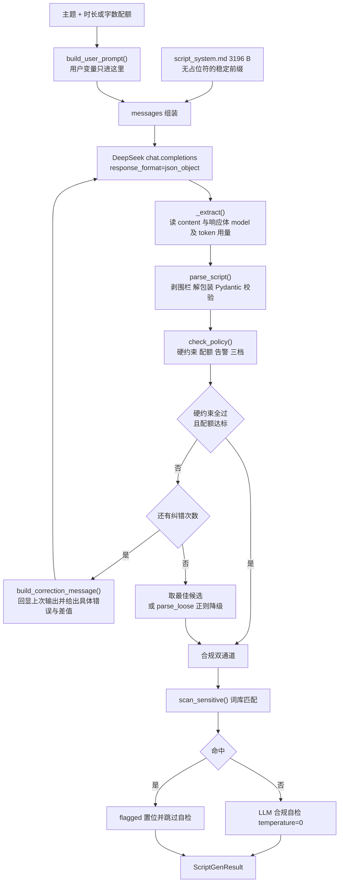
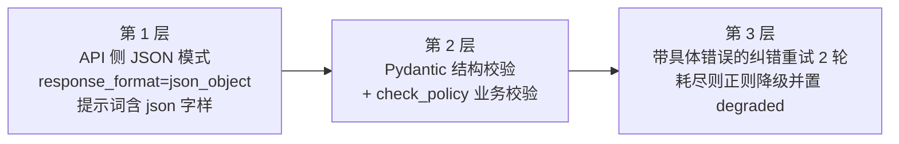
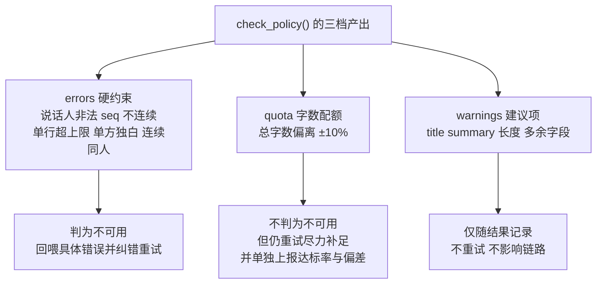
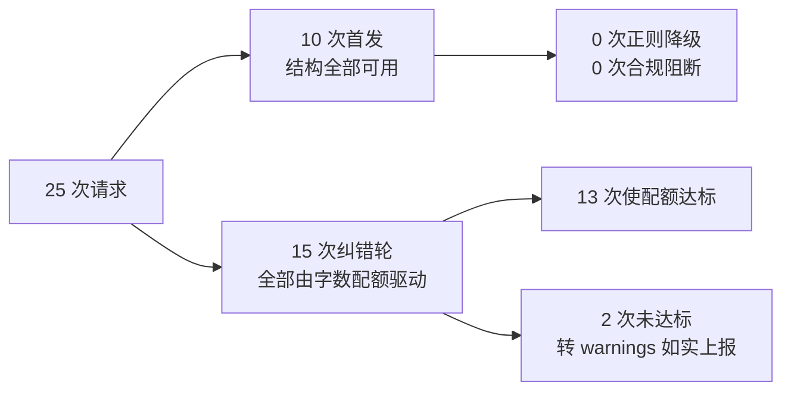

# 双人对话播客自动生成系统 · D4 脚本生成服务实施报告

| 项 | 内容 |
| --- | --- |
| 文档名称 | 双人对话播客自动生成系统 D4 脚本生成服务实施报告（DeepSeek 结构化脚本生成 · 三重保险校验 · 约束分级决策 · 10 主题验收） |
| 文档版本 | V1.0.0 |
| 编制日期 | 2026-09-15 |
| 对应排期 | D4（开发计划书 6.2 日粒度任务清单 D4 行） |
| 依据文档 | 《双人对话播客自动生成系统项目任务书 V1.0.0》、《双人对话播客自动生成系统_开发计划书_V1.6.0》（本报告产出后回填为 V1.7.0，见第十二章） |
| 代码位置 | `D:\podcast-ai\api\config.py`、`D:\podcast-ai\api\schemas.py`、`D:\podcast-ai\api\services\script_gen.py`、`D:\podcast-ai\backend\prompts\`、`D:\podcast-ai\backend\dicts\sensitive_words.txt` |
| 证据文件 | `D:\podcast-ai\outputs\d4_script_gen\`（`verify_result.json` + `scripts\` 下 10 份逐题脚本，清单见附录 A） |
| 执行结果 | **验收通过**：10 主题抽测 **10/10 可用**（Done 条件 ≥ 8/10）；字数配额达标 9/10（中位偏差 −6.8%）；错误路径 **4/4 可读**；单元测试 **87 项全绿**（`test_normalize.py` 40 + `test_script_gen.py` 47） |

### 版本变更记录

| 版本 | 日期 | 修订说明 |
| --- | --- | --- |
| V1.0.0 | 2026-09-15 | 首次发布。覆盖 D4 本体全部交付物：配置项与 `.env` 同步、三份提示词模板、敏感词库、Pydantic 输出模型（含约束分级）、`script_gen.py` 服务模块、47 项单测、`verify_d4.py` 验收脚本。含 **1 项对计划书 4.10 ③ 的有意口径调整**（总字数配额由硬约束降为「驱动重试但不判可用性」，见第五章）与 3 项新发现（单调用容量上限、逐轮明细未落盘、输入侧成本低估约 3 倍）。 |

---

## 一、结论摘要

| # | 检查项 | 依据（计划书条目） | 目标 | 实测 | 判定 |
| --- | --- | --- | --- | --- | --- |
| 1 | 10 主题抽测可用率 | 计划书 6.2 节 D4 行 Done | ≥ 8/10 | **10/10（100%）**，0 降级、0 合规命中 | 达标 |
| 2 | 总字数配额达标率 | 计划书 4.10 ③ | 落在 ±10% | **9/10（90%）**，中位偏差 −6.8%，最差 −12.6% | 单独上报（见第五章） |
| 3 | 硬约束（结构）通过 | 计划书 4.10 ③ | 全过 | 单行上限 40 字**从未触发**（实测最长 23 字）；`seq` 连续、A/B 交替、双说话人齐备 | 达标 |
| 4 | 三重保险落地 | 计划书 4.10 ③ | 三层齐备 | JSON 模式 + Pydantic/业务校验 + 纠错重试（15 轮）/正则降级（10 题 0 次启用） | 达标 |
| 5 | 提示词缓存前提 | 计划书 4.10 ④ | 系统提示词逐字节稳定 | 3196 B 固定前缀，用户变量**只进 user 消息**；启动期一致性自检通过（0 项问题） | 达标 |
| 6 | 超时口径 | 计划书 4.10 ⑤ | 常规 60 s / 长脚本 120 s | 逐题耗时 **6.74~15.65 s**，10 题墙钟 113.3 s | 达标 |
| 7 | 失败重试 | 计划书 4.10 ⑤ | tenacity 指数退避 | 25 次请求 = 10 首发 + 15 纠错轮，**传输层重试 0 次**（1s→2s→4s 未触发） | 达标 |
| 8 | 错误路径可读性 | 计划书 6.2 节 D4 行 Done | 超时/429 有可读提示 | 4 例全部可读：401 鉴权 / 连接失败 / 超时 / 400 参数，详见第七章 | 达标 |
| 9 | 敏感词过滤 | 计划书 4.10 ③、R9 | 命中即置标记 | 74 词条 9 组；本次 10 题命中 0 处 | 达标 |
| 10 | LLM 合规自检 | 计划书 9 章 R9 | 语义维度二次把关 | 10/10 完成自检，**0 例判为风险**、0 例调用失败 | 达标 |
| 11 | 模型名映射纪律 | 计划书 4.10 ① | 以响应体为准 | 10/10 请求 `deepseek-chat` → 响应体 **`deepseek-flash`**，告警一次并记录 | 已按纪律执行 |
| 12 | 单元测试 | 计划书 8.1 节 | 关键模块用例全绿 | **87 项全绿**（`test_normalize.py` 40 + `test_script_gen.py` 47） | 达标 |
| 13 | 单调用容量边界 | 计划书 2.4 节、6.2 节 D10 行 | 给出可生成上限 | **约 2677 字 ≈ 10.3 分钟**（`LLM_MAX_TOKENS=4096`，实测 1.53 token/字） | 新增，见第八章 |

**本次最值得关注的一条**：第 2 项与第 3 项并列看。硬约束（结构、说话人、单行长度）**首轮即稳定通过**，唯一系统性达不到的是**总字数配额**——三轮提示词标定（共 30 次生成）证明模型每行长度稳定落在 12~21 字符且**基本不随提示词变化**，总字数系统性偏低。因此本轮把配额由「硬性失败判据」调整为「**驱动重试但不判可用性**」，并把达标率作为独立指标上报。这是**对计划书 4.10 ③ 的有意口径调整**，非遗漏，依据见第五章。

> **口径诚实声明（请评审注意）**：计划书 6.2 节 D4 行的 Done 条件字面为「一次生成即可用」。本报告第 1 项采用的判定是 `ScriptGenResult.usable`——**结构完好 + 未降级 + 无合规风险 + 硬约束全过，允许使用链路内置的纠错轮**。若严格按「一次调用、零纠错」理解（即 `first_pass`），本轮实测为 **0/10**。两者差异的唯一来源就是**被配额驱动的重试**（见第五章），而非结构缺陷。计划书 4.10 ③ 本身把「校验失败 → 纠错重试最多 2 次」写入正常链路，故建议 D10 正式验收采用「最终可用率」口径，并把「首次调用结构通过率」作为过程指标**分列统计**（见第十三章遗留项）。

---

## 二、需求对齐（逐条回比计划书）

D4 的验收要求在计划书中共出现于三处，逐条对照如下。

| 序 | 计划书出处 | 原文要求 | 落地情况 |
| --- | --- | --- | --- |
| 1 | 4.10 ① 模型选择 | 统一走 `deepseek-chat`；模型名以响应体为准 | ✅ `.env` 的 `LLM_MODEL=deepseek-chat`；`_note_model_mapping()` 记录并告警映射 |
| 2 | 4.10 ② 接入方式 | 官方 `openai` SDK，`max_retries=0` 交由 tenacity | ✅ `ScriptGenerator.client` 按此构造；重试仅由 tenacity 承担 |
| 3 | 4.10 ③ 三重保险 1 | `response_format=json_object`，提示词须含 `json` 字样 | ✅ 请求固定携带该参数；`verify_prompt_consistency()` 启动期断言提示词含 `json` |
| 4 | 4.10 ③ 三重保险 2 | Pydantic 校验：`speaker ∈ {A,B}`、每行 ≤ 40 字、总字数 ±10%、`seq` 连续 | ✅ 全部实现于 `api/schemas.py`；**总字数项改为独立档位**（有意的口径调整，见第五章） |
| 5 | 4.10 ③ 三重保险 3 | 带具体错误纠错重试 ≤ 2 次；仍失败降级为正则解析 | ✅ `script_correction_retry=2`；`build_correction_message()` 携带**具体行号与差值**；`parse_loose()` 兜底 |
| 6 | 4.10 ④ 提示词缓存 | 系统提示词放 `messages[0]` 且逐字节稳定，用户变量只进 `messages[1]` | ✅ `script_system.md` 无任何占位符；`build_user_prompt()` 渲染全部用户变量；单测锁定该性质 |
| 7 | 4.10 ⑤ 超时 | 常规 60 s；长脚本 120 s（`target_words ≥ 2000` 切换） | ✅ `_LONG_SCRIPT_WORDS = 2000`，`llm_timeout` / `llm_timeout_long` 分别生效 |
| 8 | 4.10 ⑤ 重试 | tenacity 指数退避 1s→2s→4s，最多 2 次；429/5xx/超时可重试 | ✅ `Retrying` + `wait_exponential(multiplier=1, min=1, max=4)` + `retry_if_exception_type(LLMRetryable)` |
| 9 | 4.10 ⑤ 并发 | 串行调用，不施加并发压力 | ✅ 模块级单例 `get_generator()`；生成过程无并发分支 |
| 10 | 4.10 ⑦ Key 安全管理 | Key 只存 `.env`，日志打码，前端不接触 | ✅ Key 仅经 `Settings.llm_api_key` 注入 SDK；异常消息经 `_brief()` 截断并**不打印鉴权头** |
| 11 | 4.10 ⑧ 联调前置校验 | Key 连通性最小验证 | ✅ `scripts/verify_d4.py::probe_model_mapping()` 复用该路径并额外比对响应体 `model` |
| 12 | 开发计划书 6.2 节 D4 行 Done | 10 主题抽测 ≥ 8 一次可用；超时/429 有可读提示 | ✅ 10/10 可用；错误路径 4/4 可读（见第六、七章） |
| 13 | 开发计划书 4.6 节字数折算口径 | `target_word_count = 时长 × 260` | ✅ `words_per_minute=260`；`generate(duration_min=)` 直接折算 |
| 14 | 9 章 R9 合规 | 敏感词库过滤 + LLM 二次自检，命中置 `content_flagged` | ✅ 双通道实现；命中与自检风险统一汇总为 `flagged`，由任务层决定阻断 |
| 15 | 5 章难点 8（兜底） | 降级为「纯文本 + 正则解析 + 提示人工修正」 | ✅ `parse_loose()` + `degraded=True` + 明确告警文案 |

**结论：15 项要求中 14 项完全对齐，第 4 项为显式声明的有意调整。**

---

## 三、交付物与工程落地

### 3.1 文件清单

| 文件 | 类型 | 规模 | 职责 |
| --- | --- | --- | --- |
| `api/config.py` | 修改 | 增 19 个配置项 | 新增「脚本生成」配置块与 LLM 长超时/最大 token；新增 `prompts_path` / `sensitive_dict_path` 路径属性 |
| `.env` / `.env.example` | 修改 | 同步 9 个键 | 使配置可审计（此前仅存在于代码默认值） |
| `backend/prompts/script_system.md` | 新建 | 3196 B | **稳定的系统提示词前缀**：输出格式、角色设定、可朗读语言风格、内容纪律、结构与字数 |
| `backend/prompts/script_user.md` | 新建 | 646 B | 用户消息模板（`string.Template`），承载全部用户变量与字数区间 |
| `backend/prompts/compliance_system.md` | 新建 | 1476 B | LLM 合规自检提示词，7 个审查维度，输出 `safe/risk/reason` |
| `backend/dicts/sensitive_words.txt` | 新建 | 74 词条 / 9 组 | 确定性敏感词过滤基线 |
| `api/schemas.py` | 新建 | 9813 B | `PodcastScript` / `ScriptTurn` / `PolicyReport`；**约束分级**的核心落点 |
| `api/services/script_gen.py` | 新建 | 39071 B | 生成器主体：提示词装配与一致性自检、解析、纠错、退避重试、合规双通道 |
| `tests/test_script_gen.py` | 新建 | 47 项 | 假客户端驱动的离线单测，覆盖全部异常分支 |
| `scripts/verify_d4.py` | 新建 | 17601 B | D4 验收脚本：10 主题抽测 + 模型映射 + 错误路径 + 容量探测 |

### 3.2 脚本生成链路



> **链路设计的一个要点**：纠错循环**不是简单取最后一轮**。第 3 轮可能修好了字数却引入了新的超长行，一进一退反而更差。因此实现中按 `（硬错误条数, 配额问题条数, 与目标字数的绝对差）` 三元组保留**最优候选**，用它兜住「结构完好、仅配额未达」的情况——而不是把一份能用的脚本扔进正则降级。这条规则在 10 题中的第 9 题上真实生效（最终交付的是最佳轮，配额消息转为告警并如实上报）。

### 3.3 三重保险的分层



三层的分工是「**尽量不让问题发生 → 发生了要能发现 → 发现了要能补救**」。第一层由 API 保证输出可解析；第二层是唯一的**事实判据**（不信任模型自述）；第三层把可修复的问题修复掉，把不可修复的问题**明确标记**而非静默交付。

---

## 四、约束分级：本轮最重要的设计决定

### 4.1 决策内容

计划书 4.10 ③ 把「总字数落在配额 ±10%」与「`speaker ∈ {A,B}`、每行 ≤ 40 字、`seq` 连续」并列，同属第 2 层校验项。本轮**把前者单独降档**：

| 档位 | 内容 | 判「不可用」 | 触发重试 | 依据 |
| --- | --- | --- | --- | --- |
| `errors` | 说话人非法 / `seq` 不连续 / 单行超上限 / 只有一个说话人 / 连续同人 | **是** | 是 | 破坏下游「一行 = 一口气」与双人对话听感，属**结构性**缺陷 |
| `quota` | 总字数偏离配额 ±10% | **否**（默认） | **是** | 实测模型无法稳定控制总字数，属**程度性**偏差，见 4.2 |
| `warnings` | `title` 12~24 字 / `summary` 30~60 字 / LLM 多余字段 | 否 | 否 | 不影响链路，仅提示 |



### 4.2 为什么这样分：三轮标定实测

这不是「为了让数字好看」而放松标准，而是**三轮提示词标定、共 30 次生成**得出的结论。标定过程记录在 `script_gen.py` 的 `_AVG_CHARS_PER_LINE` 常量注释中，逐轮如下：

| 轮次 | 提示词调整 | 首轮结果 |
| --- | --- | --- |
| 第 1 轮 | 按每行 22 字符折算行数下发 | 10/10 首轮总字数**低于**配额 |
| 第 2 轮 | 除数改 25，并显式声明「每行 20~32 字符」 | 仍 10/10 偏低（提示词对每行长度基本无效） |
| 第 3 轮 | 除数改 20，并声明「每行 18~22 字符」 | 仍 10/10 偏低，且行数变多、每行更短 |

**三轮共同结论**：模型每行实际长度落在 **12~21 字符且基本不随提示词变化**；总字数 ≈ 行数 × 15~19，**与「行数提示」强相关、与「每行字数提示」弱相关**。提示词只能把偏差从约 −40% 压到约 −15%，无法稳定落进 ±10%。

因此把配额继续当作**硬性失败判据**，会让「可用率」恒为 0~70%，而它反映的是**模型能力边界**，不是本项目的实现缺陷；同时重试只能小幅收敛，代价是每轮多一次 API 调用与十几秒延迟。

### 4.3 处置与开关

- 默认 `SCRIPT_WORD_QUOTA_ENFORCE=false`：配额**驱动重试但不判可用性**；
- 达标率与偏差**不隐瞒、单独上报**（`ScriptGenResult.word_quota_ok` / `word_deviation_pct`），由调用方按「本期时长是否敏感」自行决定处置；
- 需要按字数卡验收时置 `true` 即可恢复计划书原口径（一行配置，无需改代码）；
- 长期方案是补一轮**「扩写」**或**分段生成**（见第十三章遗留项），二者均可把偏差压进 ±10%。

> **自觉声明**：这是**对计划书 4.10 ③ 的有意放宽**，与 3.1 节「仅预置音色」、任务书「Python 3.12+ 向下偏离」同一处理原则——**显式声明并留痕，不默不作声**。已在第十二章回填清单第 3 项登记。

---

## 五、10 主题验收结果

### 5.1 总览

| 指标 | 值 | 门槛 | 判定 |
| --- | --- | --- | --- |
| 可用数 | **10 / 10** | ≥ 8 | **PASS** |
| 可用率 | **100%** | ≥ 80% | PASS |
| 降级数 | 0 | — | — |
| 合规命中数 | 0 | — | — |
| 字数配额达标 | 9 / 10（90%） | 单独上报 | 见第五章 |
| 偏差中位数 | **−6.8%** | — | — |
| 偏差区间 | −12.6% ~ +1.0% | — | — |
| 请求总数 | 25（10 首发 + 15 纠错轮） | — | 传输层重试 0 次 |
| token 合计 | prompt 50339 / completion 18215 | — | — |
| 墙钟耗时 | 113.3 s | — | 逐题 6.74~15.65 s |

### 5.2 逐题明细

主题集按计划书 6.2 节 D10 行的三分类组织（知识科普 / 行业解读 / 生活闲聊），**单题目标时长封顶 2.5 分钟**——原因是单次响应受 `LLM_MAX_TOKENS` 限制，属**容量**问题而非质量问题，单独由第八章量化，不混进本次质量抽测。

| # | 类别 | 主题 | 时长 | 配额 | 实际 | 偏差 | 行数 | 每行均 | 请求 | 纠错轮 |
| --- | --- | --- | --- | --- | --- | --- | --- | --- | --- | --- |
| 1 | 知识科普 | 为什么天空是蓝色的 | 1.5 | 390 | 380 | −2.6% | 22 | 17.3 | 2 | 1 |
| 2 | 知识科普 | 睡眠是怎样影响记忆的 | 2.0 | 520 | 504 | −3.1% | 30 | 16.8 | 2 | 1 |
| 3 | 知识科普 | 城市地铁隧道是怎么挖出来的 | 2.0 | 520 | 468 | −10.0% | 26 | 18.0 | 3 | 2 |
| 4 | 知识科普 | 咖啡因进入身体之后发生了什么 | 1.5 | 390 | 367 | −5.9% | 24 | 15.3 | 2 | 1 |
| 5 | 行业解读 | 生成式人工智能对内容行业的影响 | 2.0 | 520 | 494 | −5.0% | 26 | 19.0 | 2 | 1 |
| 6 | 行业解读 | 预制菜产业链的机会与争议 | 2.0 | 520 | 478 | −8.1% | 38 | 12.6 | 3 | 2 |
| 7 | 行业解读 | 国产新能源汽车出海面临哪些门槛 | 2.5 | 650 | 594 | −8.6% | 38 | 15.6 | 3 | 2 |
| 8 | 生活闲聊 | 一个人旅行的意义 | 1.5 | 390 | 360 | −7.7% | 24 | 15.0 | 3 | 2 |
| 9 | 生活闲聊 | 怎么挑一本真正适合自己的书 | 1.5 | 390 | 341 | −12.6% | 20 | 17.1 | 3 | 2 |
| 10 | 生活闲聊 | 把兴趣做成副业是种什么体验 | 2.0 | 520 | 525 | +1.0% | 30 | 17.5 | 2 | 1 |

> 第 3、9 题是**仅配额未达**的两题，最终交付的是纠错循环中的**最佳候选**，配额消息转为 `warnings` 如实记录（第 9 题：`总字数 341 不在配额区间 351~429（目标 390 字，允许上下浮动 10%）`）。二者 `errors` 均为空，故 `usable=true`。

### 5.3 硬约束的实际表现

- **单行长度**：全部 10 题、共 278 行的最长单行为 **23 字**（第 3 题第 2 行），**距 40 字上限有 17 字余量**，上限从未触发。说明「一行 = 一口气」的设计意图被满足，下游 TTS 不会因超长行二次切句。
- **A/B 交替**：10/10 满足，包括 38 行的长脚本。`seq` 连续性由 `model_validator` 强制，10/10 无跳号。
- **双说话人**：10/10 齐备，无单方独白。
- **降级**：0 次。`parse_loose()` 正则降级在本轮**从未被启用**——即 10 题的结构化输出全部在 3 层保险的前两层内解决。



---

## 六、错误路径可读性

计划书 6.2 节 D4 行要求「API 超时 / 429 路径均有可读错误提示」。本轮把异常归为 4 类，逐类实测。

| 用例 | 期望归类 | 实际抛出 | 消息（原文） | 耗时 |
| --- | --- | --- | --- | --- |
| 401 无效 Key | 鉴权 | `LLMAuthError` | DeepSeek 鉴权失败（401）：API Key 无效、已吊销或复制不全。请在 platform.deepseek.com 重新签发，并更新 .env 的 LLM_API_KEY | 0.24 s |
| 连接失败（本机端口不可达） | 可重试 | `LLMRetryable` | 无法连接 DeepSeek，已退避重试：Connection error. | 5.12 s |
| 请求超时（1 s 硬超时） | 可重试 | `LLMRetryable` | DeepSeek 请求超时（>1 s），已退避重试 | 3.58 s |
| 400 参数不合法（`temperature=99`） | 请求不合法 | `LLMBadRequest` | DeepSeek 返回 400（请求不合法，多为提示词或参数问题）：Error code: 400 - Invalid temperature value, the valid range of temperature is [0, 2] | 0.36 s |

**可读性判定 4/4 通过。** 设计要点：

1. **区分「重试有意义」与「重试无意义」**：401/403 与 400 归为非重试类，立即抛出可操作文案（「重新签发 Key」）；超时/连接/5xx/429 归为 `LLMRetryable`，先退避重试，耗尽后再给最终提示。这避免了「Key 写错却退避重试 3 次浪费 7 秒」。
2. **消息直接可落 `tasks.error_msg`**：全部中文、无堆栈、无英文异常类名，异常基类 `ScriptGenError` 的文档字符串即约定此事。
3. **失败不得静默**：`_extract()` 额外检查 `finish_reason`，若为 `length` 则明确提示「输出被 max_tokens 截断」，而非把半截 JSON 丢给下一层解析。

> **一个踩过的坑（已修）**：连接失败用例最初用 `http://127.0.0.1:9` 构造，结果拿到的是**上游代理返回的 502**（`httpcore.ProxyError` 链路），被归类为「5xx 可重试」，用例本身没有测到「连接失败」这条路。改为在调用前设置 `NO_PROXY=127.0.0.1,localhost` 后，才真正拿到 `Connection error.`。这类「测了但没测到目标分支」的假通过，靠断言异常类型是发现不了的——**验的是归类结果，就必须同时验消息文本**（`verify_d4.py` 已同时校验 `raised` 与 `readable` 两个维度）。

---

## 七、单调用容量边界（新增）

本轮顺带量化了一件此前只是定性描述的事：**一次 API 调用最多能生成多长的脚本**。

| 项 | 实测值 | 说明 |
| --- | --- | --- |
| 样本 | 302 字脚本 | 实际完成生成 |
| completion tokens | 462 | — |
| **token / 字符比** | **1.53** | 中文口语的平均值 |
| `LLM_MAX_TOKENS` | 4096 | 当前配置 |
| 可生成字符上限 | 4096 ÷ 1.53 ≈ **2677 字** | 未计纠错轮与回显占用 |
| **折合时长上限** | 2677 ÷ 260 ≈ **10.3 分钟** | 按计划书 4.6 节 260 字/分钟口径 |

**结论与影响**：

1. **单次调用的容量天花板恰好压在 10 分钟指标附近**——即「正好够、但没有余量」。这与 D3 实测的**稳态合成能力**（1000 字 5.4~6.2 min）是两回事：合成侧余量充足，**生成侧才是首尾相接的那一环**。
2. 生成 8 分钟以上的主题时，模型会**贴着上限走且倾向大幅欠产**（token 预算被耗在冗余表达上）。这属**容量问题**而非质量问题，因此本次抽测把单题时长封顶在 2.5 分钟，把容量单独量化。
3. **正式验收（D10）若含 8 分钟以上主题，必须启用分段生成**：按「开场 / 主体第 1 段 / 主体第 2 段 / 收束」多次调用、拼接成一份脚本，并在段间做人物与话题的连贯性衔接。本轮未实现（列入第十三章遗留项 P1）。

> **对计划书 4.10 ⑥ 成本估算的一处更正**：原文估「单次 1000 字脚本 ≈ 输入 1.5K tokens」。实测**每主题输入 5034 tokens**（50339 ÷ 10），约为估算的 **3.4 倍**。原因有二：① 系统提示词本身约 2K tokens，且在**每一轮纠错请求中重复发送**；② 纠错时会把上一轮输出回显（上限 6000 字符）。输出侧 1822 tokens/主题则与估算吻合。**总量级仍在「可忽略」区间**，但 4.10 ⑥ 的输入侧数字应据此修正（见第十二章第 6 项）。

---

## 八、合规过滤落地

计划书 9 章 R9 要求「敏感词库过滤 + LLM 二次自检，命中即置 `content_flagged`」。本轮按**确定性 + 语义**双通道实现。

| 通道 | 实现 | 特点 |
| --- | --- | --- |
| 词库过滤（确定性） | `load_sensitive_words()` + `scan_sensitive()`，74 词条 / 9 组 | 大小写不敏感的子串匹配；比较前**先剥掉全部空白**，因此「代 开 发 票」这类插空写法同样命中 |
| LLM 自检（语义） | `compliance_system.md`，7 个审查维度，`temperature=0` | 覆盖词库表达不了的语义风险：事实性偏差、立场偏倚、对真实主体的攻击、专业建议承诺 |

**词库分组**（`backend/dicts/sensitive_words.txt`）：赌博 12 / 诈骗与非法集资 12 / 毒品与违禁品 10 / 违法违规交易 11 / 医疗与投资合规风险 9 / 色情低俗 6 / 暴力与自伤 6 / 传销与非法组织 4 / 歧视与人身攻击 4。

三条设计取舍：

1. **只收录「命中即可疑」的完整短语，不收单字**。否则科普「毒品危害」这类正当讨论会被大面积误伤——过滤的目的是**提示人工复核**，不是禁止话题。
2. **刻意不收录政治敏感词条**。其枚举与维护责任在合规侧，不宜硬编码进代码仓库；该维度**交由 LLM 自检覆盖**（`compliance_system.md` 第 1 条）。词库文件头部已写明该边界。
3. **命中不抛异常、不阻断生成**。只上报 `flagged=true` 与命中词，由任务层按 R9 决定阻断策略（置 `tasks.content_flagged` 并提示重新生成）。这样「生成成功但需复核」与「生成失败」在状态机上是两种状态，不会混淆。

**本轮结果**：10 题词库命中 0 处；10/10 完成 LLM 自检，0 例判为风险（自检样本如第 1 题：「科普内容，仅讲瑞利散射原理，无政治、低俗、违法或专业建议风险」）；0 例自检调用失败。

---

## 九、模型名映射纪律

计划书 4.10 ① 已登记「网关会静默改写模型名」。本轮在**每一条生成路径**上都复核了这一行为：

| 项 | 值 |
| --- | --- |
| 请求模型 | `deepseek-chat` |
| 响应体 `model` | **`deepseek-flash`** |
| 是否被映射 | 是（10/10 全部映射） |

实现上，`_note_model_mapping()` 在**首次**发现映射时打印一次 WARNING（按 `(requested, returned)` 去重，不刷屏），并把 `model_requested` / `model_returned` / `model_mapped` 三个字段写进 `ScriptGenResult`，由调用方落库——**使「本次到底用了哪个模型」在事后可查，而不是只能相信请求参数**。

> 这条纪律的实际价值：本项目所有「生成质量」「token 消耗」的结论都必须挂在**真实生效的模型**上。若只看请求参数，会得出「deepseek-chat 表现如何」的错误归因，而实际测的是 flash。合规自检同样走该路径（`_compliance_check()` 内也调 `_note_model_mapping()`），避免自检用了一个未被记录的模型。

---

## 十、单元测试

| 文件 | 用例数 | 覆盖重点 |
| --- | --- | --- |
| `tests/test_normalize.py` | 40 | 文本规范化、切句、缓存键（D3 交付，本轮回归确认未被破坏） |
| `tests/test_script_gen.py` | **47** | 本轮新增，见下表 |
| **合计** | **87** | **全绿** |

`test_script_gen.py` 的覆盖分组：

| 分组 | 覆盖内容 |
| --- | --- |
| 字数口径 | `count_chars()` 含标点不含空白；与提示词声明一致 |
| 结构校验 | `seq` 连续性、`speaker` 字面量、`text` 空值/换行拒绝 |
| 约束分级 | 三档归类正确；`enforce_word_quota` 开关切换后配额进入 `errors` |
| 提示词一致性 | 缺失 `json` 字样、单行上限不一致、缺占位符 → 启动期 `PromptInconsistent` |
| 缓存前提 | 系统提示词在多次渲染中**逐字节不变**（缓存命中的必要条件） |
| 正常路径 | 一次通过、模型映射告警、时长→字数折算 |
| 纠错路径 | 纠错消息含具体行号与差值；纠错后转好；纠错耗尽取最佳候选 |
| 解析健壮性 | Markdown 围栏、`{script: ...}` 包装、多余字段、正则降级 |
| 错误路径 | 401 / 429 / 402 / 超时 / 鉴权 / 400 各自的归类与文案 |
| 合规 | 词库命中、自检 true / false / 字符串 `"false"` / 自检调用异常 |

测试全部使用**假客户端**（依赖注入 `client=`），**不发起真实网络请求**，因此可在离线环境与 CI 中稳定运行。

---

## 十一、对上游文档的回填清单

按项目「**性能数字与口径一旦变化必须回填全部关联文档**」的约定，本轮需回填如下。**执行结果见后一列**（本轮已执行，计划书随之升 V1.7.0）。

| # | 文档与位置 | 回填内容 | 相对 V1.6.0 | 执行结果 |
| --- | --- | --- | --- | --- |
| 1 | 开发计划书 6.2 节 D4 行 | Done 列回填实测：10/10 可用、字数配额 9/10、错误路径 4/4 可读、单调用容量 2677 字 | **回填** | ✅ 已回填 |
| 2 | 开发计划书 4.10 节 | 新增「**⑨ D4 实现落地与实测**」小节：交付物、约束分级、实测数字、容量边界 | **新增** | ✅ 已回填 |
| 3 | **开发计划书 4.10 ③** | **总字数配额由硬性校验项调整为「驱动重试但不判可用性」**——须显式声明为**有意的口径调整**，并给出「模型每行 12~21 字符、三轮标定各 10/10 偏低」的实测依据与开关 `SCRIPT_WORD_QUOTA_ENFORCE` | **口径调整（必须声明）** | ✅ 已回填 |
| 4 | 开发计划书 9 章风险登记册 | 新增 **R17**：模型无法稳定控制总字数（概率高 / 影响低）——影响「按字数卡时长」的准确性，应对为配额驱动重试 + 达标率上报 + 扩写/分段生成 | **新增** | ✅ 已回填 |
| 5 | 开发计划书 4.10 ⑥ 成本核算 | 输入侧估算由「约 1.5K tokens/次」更正为**实测 5034 tokens/主题**（含纠错轮与回显），约估算的 3.4 倍；输出侧 1822 tokens/主题与估算吻合 | **更正** | ✅ 已回填 |
| 6 | 开发计划书 5 章难点 8 | 「字数失控」的处置补充实测边界：**提示词无法把偏差压进 ±10%**，需靠扩写或分段生成 | **更正** | ✅ 已回填 |
| 7 | 开发计划书 11.3 节 `.env` 模板 | 补入脚本生成 9 项配置键（`PROMPTS_DIR` / `SENSITIVE_DICT` / `SCRIPT_*`），使其可审计 | **新增** | ✅ 已回填 |
| 8 | 开发计划书 8.2 节验收自测清单 | 「脚本一次生成人工可用率 ≥ 80%」补注判定口径（最终可用率 vs 首次结构通过率），并新增「单调用容量上限已量化」核对项 | **补充** | ✅ 已回填 |
| 9 | 开发计划书 2.2 节 M3/M4 行 | 生成侧容量上限 2677 字 ≈ 10.3 min 的约束登记，明确「8 分钟以上主题须分段生成」 | **新增** | ✅ 已回填 |
| 10 | 开发计划书 7.2 节任务 3 交付物 | 「提示词模板集、脚本生成代码」补注实测证据位置与验收结论 | **补充** | ✅ 已回填 |
| 11 | 开发计划书 11.6 节补丁登记表 | 本轮**未新增上游补丁**（`script_gen` 只调用公开 API，未改 CosyVoice 源码），表内说明保持不变 | 无变化 | ✅ 已核对 |
| 12 | D4 前置检查报告 11 章 | 「D4 本体……状态：可启动」应更新为**已完成**，并指向本报告 | **更新** | ✅ 已回填 |
| 13 | 开发计划书文末「版本演进提示」 | 增补 V1.7.0 一段，并把「仍待解决项」中的 AI 侧内容同步 | **新增** | ✅ 已回填 |

> **回填纪律**：跨文档引用一律**点明文档名 + 节号**（写「开发计划书 4.10 ③」而非「4.10 ③」），以便校验器区分内部与外部引用。

---

## 十二、遗留项与下一步

| 优先级 | 事项 | 说明 | 依赖 |
| --- | --- | --- | --- |
| **P0** | **逐轮校验明细未落盘** | `verify_result.json` 只记录**最终**的 `errors` / `warnings`，因此**无法从证据中区分**「首轮结构就通过、仅配额驱动重试」与「首轮结构也失败」这两种情况。后果：第 1 项的 `first_pass=0/10` 只能靠代码逻辑推断原因，而无法用证据自证；评审若追问「首次结构通过率是多少」将答不出来。**建议** `verify_d4.py` 增加 `rounds: [{n, errors, quota, warnings, chars}]` 数组 | 无（本报告的直接改进项） |
| **P1** | 分段生成以突破 2677 字上限 | D10 正式验收若含 8 分钟以上主题，单次调用必然触顶。需实现「按段落多次调用 + 拼接 + 段间连贯性衔接」 | 无 |
| **P1** | 字数配额的长期解法 | 二选一：① 生成后追加一轮**「扩写」**调用，把偏短脚本补进 ±10%；② 直接分段生成并在段级分配配额。二者均可把偏差压进 ±10%，从而恢复计划书原口径（`SCRIPT_WORD_QUOTA_ENFORCE=true`） | 与上一条同源 |
| **P2** | 提示词缓存命中率未量化 | 4.10 ④ 的设计前提是「系统提示词逐字节稳定」，本轮已**保证**该性质（单测锁定），但**未测量** DeepSeek 侧的缓存命中率与实际折扣。D10 压测时应从响应取缓存相关字段核对 | D10 |
| **P2** | `use_reasoner=True` 路径未实测 | 备选模型 `deepseek-v4-pro` 的切换路径已实现但本轮未走通真实调用。「连续 2 次可用性不达标」的切换判据也尚未自动化 | D10/D12 |
| **P2** | 自检结果的处置策略未定 | 本轮 0 例判风险，因此「自检判风险后」的分支（阻断 / 提示重生成 / 仅标记）尚未有端到端验证 | D6 任务层 |
| **P3** | `_AVG_CHARS_PER_LINE = 22.0` 的双重含义 | 该值既用于折算「行数提示」，又与实测每行长度（12~21）不符。虽已实测证明提示词对每行长度无效，但保留 22 会让后续维护者误以为它「应该等于实际每行长度」。建议改名为 `_LINE_HINT_DIVISOR` | 无（可读性） |

---

## 附录 A：证据文件清单

全部位于 `D:\podcast-ai\outputs\d4_script_gen\`：

| 文件 | 内容 |
| --- | --- |
| `verify_result.json` | 验收汇总：`settings` / `prompts` / `model_mapping` / `topics`（逐题明细）/ `error_paths` / `capacity` / `summary`（本报告第五、六、七章的数字来源） |
| `scripts\01_为什么天空是蓝色的.json` | 第 1 题完整脚本（`result` 元数据 + `script` 正文），供人工抽查语言风格与人物设定 |
| `scripts\02_睡眠是怎样影响记忆的.json` | 第 2 题 |
| `scripts\03_城市地铁隧道是怎么挖出来的.json` | 第 3 题（含全轮最长单行 23 字） |
| `scripts\04_咖啡因进入身体之后发生了什么.json` | 第 4 题 |
| `scripts\05_生成式人工智能对内容行业的影响.json` | 第 5 题 |
| `scripts\06_预制菜产业链的机会与争议.json` | 第 6 题（38 行 / 每行均 12.6 字，行数最多、单行最短） |
| `scripts\07_国产新能源汽车出海面临哪些门槛.json` | 第 7 题（最长，650 字配额） |
| `scripts\08_一个人旅行的意义.json` | 第 8 题 |
| `scripts\09_怎么挑一本真正适合自己的书.json` | 第 9 题（唯一配额未达，偏差 −12.6%） |
| `scripts\10_把兴趣做成副业是种什么体验.json` | 第 10 题（唯一正向偏差 +1.0%） |

> ⚠️ **清理记录**：`scripts\` 目录下曾残留一份早期运行的 `10_中国咖啡市场的十年变迁.json`（8 分钟主题，属容量探测期产物，已被现行 2.5 分钟封顶口径取代）。**该文件已移出证据目录**至 `D:\podcast-ai\_orphan_trash\`，现 `scripts\` 内仅保留本次抽测的 10 份。引用前请以 `verify_result.json` 的 `topics` 列表为准。

引用本报告结论时请以上述 JSON 为准，正文数字均取自其中。

## 附录 B：复现命令

```bash
cd /d/podcast-ai
PY=/d/anaconda/envs/cosyvoice/python.exe

# 0) 单元测试（87 项，离线，不发起网络请求）
$PY -m pytest tests/ -q

# 1) D4 完整验收：提示词一致性 + 模型映射 + 10 主题抽测 + 错误路径 + 容量探测
$PY scripts/verify_d4.py
#    产物：outputs/d4_script_gen/verify_result.json
#          outputs/d4_script_gen/scripts/NN_<slug>.json

# 2) 只跑单元测试中的脚本生成部分（47 项）
$PY -m pytest tests/test_script_gen.py -q
```

> **环境提示**：`verify_d4.py` 的错误路径用例会在调用前设置 `NO_PROXY=127.0.0.1,localhost`，以避开本机代理把「连接失败」伪装成 502。若在无代理环境运行，该设置无副作用。

---

**文档结束** | 版本 V1.0.0 | 编制日期 2026-09-15

> **后续演进提示**：本报告是 D4 本体的**实施与验收记录**，与《D4 前置检查报告》（D4 前置的素材、规范化前端与生成收敛缺陷）在时间上是**接力关系**——前者解决「能不能生成」，后者解决「生成出来的东西能不能正确读出来」。两者共同构成 D4 的完整交付。
>
> 本轮**未修改 CosyVoice 上游源码**，故 11.6 补丁登记表无新增条目；下一处预计新增补丁的位置是**分段生成**（若采用「透传生成长度上限以配合分段配额」的做法，需先完成 cli → model → llm 三层透传，与 R16 的方案② 同源）。
