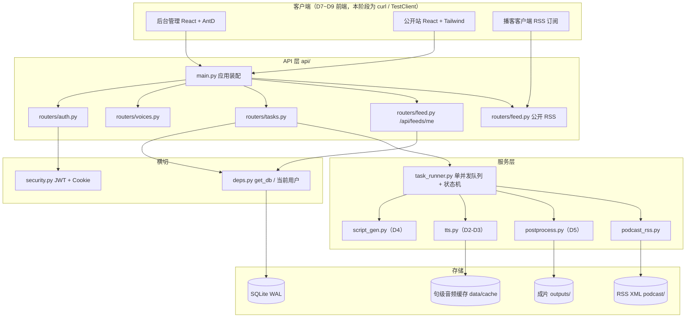
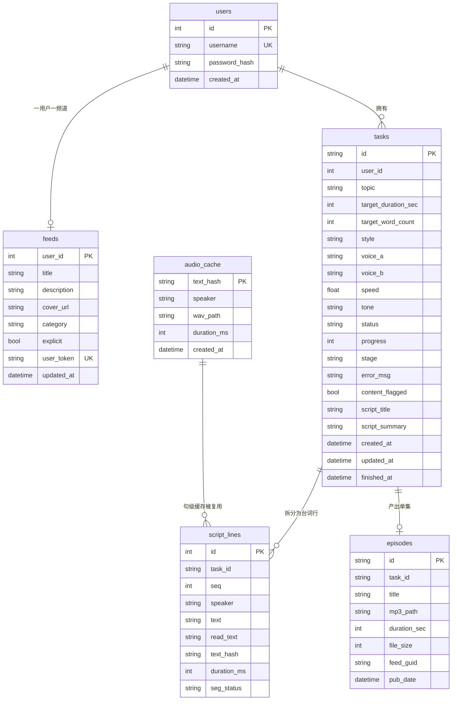
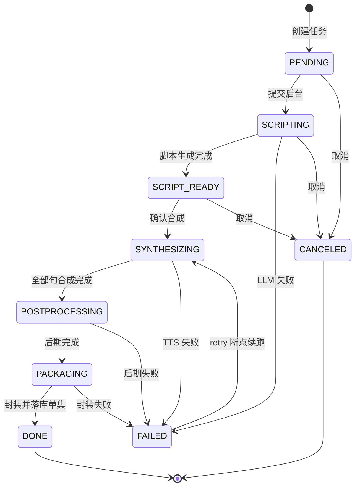
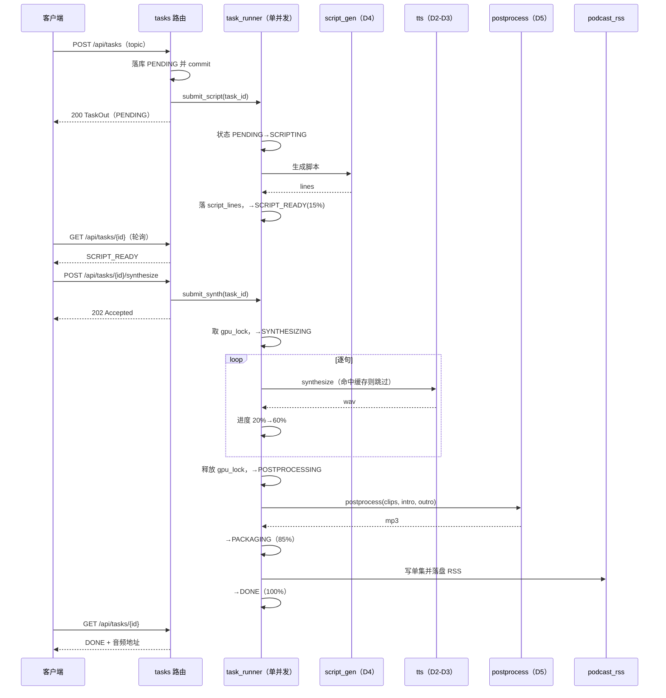

# 双人对话播客自动生成系统 —— D6 后端 API 服务实施报告

> **版本**：V1.0.0 ｜ **日期**：2026-09-16 ｜ **阶段**：D6（后端 API 服务化）
> **上游依据**：《双人对话播客自动生成系统_开发计划书_V1.11.0》第 4 章（架构与数据模型）、第 6 章（排期）
> **关联文档**：D5 后期与导出实施报告_V1.1.1（后期链路）、D4 脚本生成服务实施报告_V1.0.0（脚本链路）、
> D2-D3 模型定稿与合成服务实施报告_V1.1.0（TTS 引擎）、产品需求规格说明书_V1.2.0

---

## 修订记录

| 版本 | 日期 | 修订内容 |
| --- | --- | --- |
| V1.0.0 | 2026-09-16 | 初稿：D6 后端 API 服务化实施与验收记录（21 端点 / 状态机 / 单并发队列 / 5 个真实缺陷修复 / 端到端 9/9 通过），并随附片头尾女声素材改造（R18 收口） |

---

## 1 概述

### 1.1 D6 的目标与范围

D6 把 D2~D5 已经跑通的**命令行流水线**封装为**可被前端调用、可多用户隔离、可异步执行**的
HTTP 服务。核心命题有四个：

1. **异步化** —— 一次生成要 3~7 分钟（详见 D5 报告基线），绝不能让 HTTP 请求同步等待；
   必须「提交即返回、后台跑、前端轮询进度」。
2. **显存互斥** —— CosyVoice 在本机 RTX 4050 Laptop 6 GB 上峰值约 3.5 GB（allocated），
   **同时跑两个任务必然 OOM**。服务层必须保证任何时刻只有一个任务在推理。
3. **多用户隔离** —— 每个用户只能看见/操作自己的任务与频道，越权访问一律 404（不返回 403，
   避免泄露「该资源是否存在」）。
4. **状态可追溯** —— 任务在 脚本 → 合成 → 后期 → 封装 → 完成 之间流转，
   每一步的成败、进度、报错都要能查，且失败后能从断点续跑。

### 1.2 交付物清单

| 交付物 | 路径 | 说明 |
| --- | --- | --- |
| 应用装配 | `api/main.py` | FastAPI 实例、路由挂载、异常处理器、启动事件 |
| 配置 | `api/config.py` | pydantic-settings，环境变量 + 校验（含 JWT 强度告警） |
| ORM 模型 | `api/models.py` | 6 张表 + 状态词汇表 |
| 数据库 | `api/db.py` | 引擎、SessionLocal、WAL / 外键 / 忙超时 |
| 依赖注入 | `api/deps.py` | `get_db`（带 commit/rollback）、当前用户解析 |
| 鉴权 | `api/security.py` | 密码散列、JWT 签发与校验、Cookie 通道 |
| 路由 | `api/routers/` | auth / voices / tasks / feed |
| 任务编排 | `api/services/task_runner.py` | 单并发队列、状态机、进度上报、取消/重试 |
| RSS | `api/services/podcast_rss.py` | feedgen 生成、落盘、GUID 与 enclosure |
| 契约 | `api/schemas.py` | 请求/响应 Pydantic 模型 |
| 端到端验证 | `scripts/verify_d6.py` | TestClient 全流程 + 假引擎注入 |
| 单元测试 | `tests/` | D6 新增 4 个测试文件（+19 项） |
| 素材脚本 | `scripts/make_intro_outro.py` | 片头尾女声素材生成（本轮新增，见第 11 章） |

### 1.3 阶段边界

- **不包含**：前端页面（D7~D9）、容器化部署（D13）、片头尾音乐/真人录音重录（R20）。
- **复用**：脚本生成（D4）、TTS 合成（D2-D3）、后期与导出（D5）三条链路**原样接入**，
  D6 只做编排与暴露，不重写算法逻辑。

---

## 2 总体架构

### 2.1 分层与调用关系



**要点**：`task_runner` 是唯一持有后台线程的地方；路由层只做参数校验 → 落库 → 提交任务 → 立即返回。
真正的 GPU 推理全部发生在 runner 的工作线程里，与请求线程隔离。

### 2.2 模块职责

| 模块 | 行数 | 职责 |
| --- | --- | --- |
| `config.py` | 316 | pydantic-settings 配置；启动期校验 JWT 强度、路径存在性、显存预算 |
| `db.py` | 119 | 引擎与 Session；开启 WAL、外键、busy_timeout |
| `deps.py` | 113 | `get_db()` 与当前用户解析（`get_current_user`） |
| `security.py` | 119 | 口令散列、JWT 签发/校验、HttpOnly Cookie |
| `models.py` | 274 | 6 张 ORM 表 + `TaskStatus` / `SegStatus` 词汇表 |
| `schemas.py` | 409 | 全部请求/响应契约 |
| `routers/tasks.py` | 275 | 任务全生命周期（12 个端点） |
| `routers/feed.py` | 116 | 频道配置（`/api/feeds/me`）+ 公开 RSS 分发 |
| `routers/auth.py` | 96 | 注册 / 登录 / 登出 |
| `routers/voices.py` | 32 | 音色列表 |
| `services/task_runner.py` | 446 | 队列、状态机、进度、取消、重试 |

---

## 3 数据模型

### 3.1 ER 图



### 3.2 表说明

| 表 | 作用 | 关键设计 |
| --- | --- | --- |
| `users` | 账号 | `username` 唯一索引；口令只存散列 |
| `feeds` | 播客频道 | **主键即 `user_id`**，天然保证「一用户一频道」 |
| `tasks` | 生成任务 | `id` 为 uuid4；`status` / `progress` / `stage` 供前端轮询 |
| `script_lines` | 台词行 | 一个任务多行，按 `seq` 排序；合成后回填 `text_hash` 与时长 |
| `audio_cache` | 句级音频缓存 | **跨任务共享**，主键即 `text_hash` |
| `episodes` | 已发布单集 | 承载 `feed_guid` 与 `mp3_path`，供 RSS 枚举 |

### 3.3 三处超出 ER 原图的补充（`[DEV-SCHEMA-01]`）

实现时发现计划书 4.6 的 ER 图缺三处会导致契约无法实现，已补充并在代码注释标注：

1. **`audio_cache.text_hash` 是全局唯一主键，`script_lines.text_hash` 是外键指向它。**
   若把 `text_hash` 设成 `script_lines` 的唯一键，「任务 B 复用任务 A 已合成的句子」会插入冲突——
   而这正是句级缓存存在的意义。
2. **`script_lines.text_hash` 必须可空。** 脚本在 `SCRIPT_READY` 阶段落库时尚未合成，
   强制非空会让「先存脚本、后合成」这条主流程直接插不进去。
3. **时间统一存 naive UTC。** SQLite 不保存时区，混存 aware/naive 会让两个时间相减直接抛
   `TypeError: can't subtract offset-naive and offset-aware datetimes`（保留期清理会踩）。

---

## 4 接口清单（共 21 个）

所有 `/api/**` 端点需鉴权（JWT Bearer 或 HttpOnly Cookie 二选一）；
`/feed/**` 为公开端点，凭不可猜测的 `user_token` 寻址。

| # | 方法 | 路径 | 说明 |
| --- | --- | --- | --- |
| 1 | POST | `/api/auth/register` | 注册，返回 token |
| 2 | POST | `/api/auth/login` | 登录，返回 token 并下发 Cookie |
| 3 | POST | `/api/auth/logout` | 登出，清除 Cookie |
| 4 | GET | `/api/voices` | 音色列表（voice_a / voice_b） |
| 5 | POST | `/api/tasks` | 创建任务，立即返回（后台跑脚本） |
| 6 | GET | `/api/tasks` | 任务分页列表 |
| 7 | GET | `/api/tasks/{task_id}` | 任务详情（含 status / progress / stage） |
| 8 | GET | `/api/tasks/{task_id}/script` | 取脚本 |
| 9 | PUT | `/api/tasks/{task_id}/script` | 改脚本（人工介入后再合成） |
| 10 | POST | `/api/tasks/{task_id}/synthesize` | 确认合成（202 Accepted） |
| 11 | POST | `/api/tasks/{task_id}/retry` | 失败后从断点续跑（202） |
| 12 | POST | `/api/tasks/{task_id}/cancel` | 请求取消 |
| 13 | DELETE | `/api/tasks/{task_id}` | 删除任务及产物 |
| 14 | GET | `/api/tasks/{task_id}/segments/{seq}/audio` | 单句音频（支持 Range） |
| 15 | GET | `/api/tasks/{task_id}/audio` | 整片试听（支持 Range） |
| 16 | GET | `/api/tasks/{task_id}/download` | 下载成片 |
| 17 | GET | `/api/feeds/me` | 读取频道配置 |
| 18 | PUT | `/api/feeds/me` | 更新频道配置，可 `reset_token` |
| 19 | GET | `/feed/{user_token}.xml` | **公开** RSS 订阅源 |
| 20 | GET | `/feed/{user_token}/{guid}.mp3` | **公开** 单集音频（支持 Range） |
| 21 | GET | `/health` | 健康检查 |

**两个设计取舍**

- **为什么「创建任务」和「确认合成」分成两步**（#5 / #10）？
  脚本生成可能不符合预期，产品上需要「先看脚本、人工改两句、再合成」的介入点。
  若创建即合成，用户就没有修正机会。对应状态 `SCRIPT_READY` 等待确认。
- **为什么音频端点要支持 Range**（#14 / #15 / #20）？
  播客客户端与浏览器 `<audio>` 都靠 Range 请求做拖动与边下边播；不支持会导致
  iOS 播客 App 拒绝播放。验证脚本已实测返回 206。

---

## 5 任务流水线与状态机

### 5.1 状态迁移表（唯一权威）

`TRANSITIONS` 定义在 `api/services/task_runner.py`，**是合法迁移的唯一来源**；
`models.TaskStatus` 只存词汇、不定义图——避免同一份状态机出现两处会漂移的定义。

| 当前 | 可迁移到 |
| --- | --- |
| PENDING | SCRIPTING, CANCELED |
| SCRIPTING | SCRIPT_READY, FAILED, CANCELED |
| SCRIPT_READY | SYNTHESIZING, CANCELED |
| SYNTHESIZING | POSTPROCESSING, FAILED |
| POSTPROCESSING | PACKAGING, FAILED |
| PACKAGING | DONE, FAILED |
| FAILED | SYNTHESIZING（`retry` 回边） |
| DONE | —（终态） |
| CANCELED | —（终态） |

### 5.2 状态机图



**`retry` 为什么只允许 FAILED → SYNTHESIZING？**
失败只可能发生在推理/后期段；脚本已经生成并可能已被人工改过，重跑脚本会丢掉人工修改，
因此重试直接回到合成阶段，复用既有 `script_lines`。

### 5.3 一次完整生成的时序



### 5.4 进度区间

各阶段占用固定区间，前端可用单一进度条而不必理解阶段细节：

| 阶段 | 进度区间 |
| --- | --- |
| SCRIPTING | 0 ~ 15 |
| SCRIPT_READY | 15 |
| SYNTHESIZING | 20 ~ 60 |
| POSTPROCESSING | 65 ~ 82 |
| PACKAGING | 85 ~ 95 |
| DONE | 100 |

---

## 6 并发与显存互斥

本机 GPU 为 RTX 4050 Laptop 6 GB，**净可用是浮动量**（D0 实测 4424 MiB、D1 实测 5072 MiB）。
D5 端到端实测峰值 allocated 3548.5 MB / reserved 4156.0 MB，**reserved 余量仅 44 MB** ——
任何并发两个任务的方案都必然 OOM。因此采用双保险：

1. **`ThreadPoolExecutor(max_workers=1)`** —— 全局只有一个工作线程，任务天然串行排队；
   提交即返回，请求线程不被占用。
2. **`threading.Lock` 显存互斥锁** —— 在真正进入 GPU 推理的区段加锁。即便将来放宽线程池，
   锁仍能保证同一时刻只有一个推理在跑。

取消采用**协作式**：置 `_cancel_flags[task_id]`，流水线在每个阶段边界与每句之间检查，
命中则走 `CANCELED` 终态。不做强制 kill——强杀线程会留下 half-written 的 wav 与未释放的显存。

---

## 7 鉴权与安全

- **双通道**：JWT 既可通过 `Authorization: Bearer` 传入，也写入 **HttpOnly Cookie**，
  便于浏览器前端直接使用而避免把 token 暴露给 JS（降低 XSS 窃取风险）。
- **口令**：只存散列，不存明文。
- **越权一律 404**：查询他人资源时返回 404 而非 403，避免通过状态码差异探测资源是否存在。
- **JWT 强度校验**：`config.py` 在启动期校验密钥，命中占位关键词（如 change / secret）会告警，
  提示对外部署前必须替换为随机长串。

> ⚠️ 本机 `.env` 当前 JWT 密钥仍是占位值，本地联调可用，
> **对外部署前必须替换**，否则任何人都能伪造登录态。

---

## 8 RSS 与公开访问

- 订阅源由 feedgen 生成，落盘为 `podcast/{user_token}.xml`，同时可从内存直接响应。
- `user_token` 是**不可猜测的随机串**，作为公开寻址的唯一凭据；`PUT /api/feeds/me` 支持
  `reset_token` 一键作废旧地址。
- 单集音频经 `/feed/{user_token}/{guid}.mp3` 公开分发，支持 Range。
- **注意**：重置 token 会同时删除旧 XML 并用新 token 重落盘（详见第 9 章 `[FIX-FEED-RESET-01]`）。

---

## 9 本轮修复的 5 个真实缺陷

这 5 个缺陷都属于「**接口返回 200、但生产上不可用**」的类型，单元测试若不覆盖写路径和
文件系统副作用就发现不了，是 D6 验证脚本最主要的价值。

| 编号 | 位置 | 症状 | 根因 | 修法 |
| --- | --- | --- | --- | --- |
| `[FIX-GETDB-01]` | `api/deps.py` | 注册/建任务返回 200，但库里查不到数据 | `get_db` 只 `yield db` + `close()`，**从不 commit**，写操作全部静默回滚 | `yield` 后 `commit()`，异常 `rollback()` |
| `[FIX-GETDB-IMPORT-01]` | 4 个路由 | 应用启动即 `ImportError` | 写的是 `from api.db import get_db`，但 `get_db` 定义在 `api.deps` | 改为 `from api.deps import get_db` |
| `[FIX-PP-01]` | `task_runner.py` | 流水线在后期阶段整条失败：`TypeError: missing 1 required positional argument: 'clips'` | `_default_postprocess` 写成 `return postprocess(*args, **kwargs)`，等于**构造期就空参调用** `postprocess()` | 改为**返回工厂** `postprocess`，由调用点 `_make_postprocess()(clips, ...)` 再传参 |
| `[FIX-FEED-RESET-01]` | `routers/feed.py` | 重置 token 后旧地址仍可访问、新地址 404 | 改写 `feed.user_token` **之后**才用新 token 拼旧 XML 文件名，导致删的是尚不存在的新文件；旧 XML 残留且未重落盘 | 先捕 `old_token` → 删旧 XML → 用新 token 重写 RSS |
| `[FIX-TASK-COMMIT-01]` | `routers/tasks.py` | 偶发「任务不存在」 | `create_task` 在 `flush()` 后立刻 `submit_script`，后台线程可能在事务提交前读到任务 | `submit_script` 前先 `commit()` |

> `[FIX-FEED-RESET-01]` 的危害值得单独强调：它让**已作废的订阅地址永久可访问**，
> 而新地址 404 —— 与「一键重置」的安全语义完全相反。

---

## 10 验证

### 10.1 端到端验证（`scripts/verify_d6.py`）

用 FastAPI `TestClient` 跑完整链路，并**注入假引擎**（不加载 CosyVoice）：

- 好处一：避免 ~30 s 的模型冷启动与 GPU 占用；
- 好处二：消除长事务持锁导致的 `database is locked`（真实合成耗时较长，会把 SQLite 写锁占满）。

| # | 步骤 | 结果 |
| --- | --- | --- |
| 1 | register | ✅ |
| 2 | create_task | ✅ |
| 3 | script_ready | ✅ |
| 4 | synthesize_accepted | ✅ |
| 5 | pipeline_done（status=DONE） | ✅ |
| 6 | audio_range（206 + 字节数） | ✅ |
| 7 | public_rss（200 + 含 rss 标签） | ✅ |
| 8 | reset_token（旧 404 / 新 200） | ✅ |
| 9 | delete_task | ✅ |

**9/9 全部通过**，证据落盘 `outputs/d6_verify_evidence.json`。

> 第 8 步正是发现 `[FIX-FEED-RESET-01]` 的那一步：修复前表现为「旧 200 / 新 404」。

### 10.2 单元测试

全量 pytest **195 项全绿**（D6 前为 176 项）。D6 新增 4 个测试文件：

| 测试文件 | 覆盖 |
| --- | --- |
| `tests/test_api_auth.py` | 注册/登录/登出、越权访问 |
| `tests/test_api_tasks.py` | 任务 CRUD、状态流转、取消/重试 |
| `tests/test_task_runner.py` | 状态机合法/非法迁移、假引擎下的流水线 |
| `tests/test_podcast_rss.py` | RSS 生成、token 重置与旧文件清理 |

### 10.3 可测性设计

`TaskRunner` 的三个依赖（引擎、脚本生成器、后期函数）均通过构造函数工厂注入：

```python
get_runner(get_settings(),
           make_generator=lambda: FakeGenerator(),
           make_engine=lambda: FakeEngine())
```

后期**仍走真实 `postprocess`**，因此验证覆盖到了真实后期链路（拼接、停顿、响度、导出），
只有 GPU 推理被替换。

> **已知坑**：`verify_d6.py` 的 JWT 密钥不能含子串 `secret`（会触发 config 占位告警）；
> 假引擎的 `segment` 必须带 `line_seq`，否则 `_stage_synthesize` 读 `r.segment.line_seq` 会报
> `AttributeError`。

---

## 11 片头尾女声素材改造（R18 收口）

### 11.1 背景

D5 阶段的片头尾是 `scripts/make_assets.py` 生成的**合成音占位**（两音上行/下行，
片头 2.40 s / 片尾 2.20 s），仅用于让端到端链路跑通，登记为遗留项 **R18**。

本轮按用户要求改为：**由女生（`voice_a`）朗读通用开场白 / 结束语**。

### 11.2 一个容易踩的隐藏约束

排查 `postprocess()` 的 intro/outro 分支后发现：后期对片头尾**只做 `unify()` + `apply_fade()`，
不做 loudnorm**。这意味着**素材自身响度就是成片响度** —— 若直接丢入未归一的音频，
片头会明显比正片偏轻或偏响。

因此新增的 `scripts/make_intro_outro.py` 在导出前调用 `normalize_loudness()`，
把片头尾对齐正片目标（`settings.audio_loudness_i` ≈ −16 LUFS）。

### 11.3 成品

| 素材 | 文案 | 时长 | 响度 | 真峰 | 大小 |
| --- | --- | --- | --- | --- | --- |
| `intro.mp3` | 欢迎收听本期播客，今天，我们用一段对话，聊聊这个话题。 | 8.76 s | −16.99 LUFS | −1.93 dBTP | 141313 B |
| `outro.mp3` | 以上就是今天的全部内容，感谢你的收听，我们下期再见。 | 6.64 s | −17.25 LUFS | −1.85 dBTP | 107458 B |

- 音色：`voice_a`（女声，用户本人 `life.m4a`，统一自相关 F0 175.8 Hz）
- 规格：mp3 / 44.1 kHz / 单声道 / 128 kbps —— **与 README 约定一致，零改动替换，无需改代码或配置**
- 合成 RTF：片头 1.011、片尾 1.045（与 D5 稳态基线同档）
- 旧占位素材已备份至 `backend/assets/_archive/20260916_142348/`

> 片头尾落点 −16.99 / −17.25 LUFS，比正片（−16.15 ~ −16.46 LUFS）轻约 0.5~1.1 LU，
> 听感上属正常范围（loudnorm 因 `TP−I` 超出线性解范围而走了 dynamic 模式，与 D5 记录一致）。

### 11.4 换文案

通用文案与具体话题无关，任何一期都可复用。有特殊需求时重跑脚本即可，无需改代码：

```bash
python scripts/make_intro_outro.py --text-intro "……" --text-outro "……"
python scripts/make_intro_outro.py --dry-run      # 只看计划，不加载模型
```

---

## 12 已知限制与遗留

| 编号 | 事项 | 状态 |
| --- | --- | --- |
| R18 | 片头尾占位素材 | ✅ **本轮收口**（改为女声通用开场白/结束语） |
| R20 | 男声 `voice_b` 参考录音底噪（合成段 −41.64 dBFS / SNR 27.9 dB，比女声差 18.4 dB） | ⏸ **保持遗留**：事后降噪已证无效，只能重录；用户明确「先用着，之后再换」 |
| R19 | LLM 重试退避约 3 s，小于本机代理间歇性 502 的窗口 | ⏸ 未擅自放宽 `LLM_MAX_RETRY`，待用户决定 |
| R16 | 20 字以上长句可能撞 `max_len` 上限（撞顶率约 8%） | ⏸ 上游三层硬编码 ratio=20，改需动 CosyVoice 源码 |
| P3 | conda 环境 `sensevoice` 已损坏 | ⏸ 未擅自改动；whisper base/small 中文不可靠，ASR 仅作初稿 |
| — | JWT 密钥为占位值 | ⚠️ 对外部署前必须替换 |
| — | D4 容量上限 2677 字（约 10.3 min） | ⏸ 8 分钟以上主题须分段生成 |

---

## 13 结论

D6 已完成「命令行流水线 → 可多用户、可异步、可追溯的 HTTP 服务」的转型：

- **21 个端点**全部可用，覆盖鉴权、任务全生命周期、频道配置与公开 RSS；
- **状态机**为唯一权威定义，失败可从断点续跑，取消为协作式安全退出；
- **单并发 + 显存锁**保证 6 GB 显存下不 OOM；
- 端到端 **9/9 通过**、单测 **195 项全绿**；
- 顺带修掉 **5 个「返回 200 但生产不可用」的真实缺陷**；
- **R18 收口**：片头尾改为女声通用开场白/结束语。

下一步进入 **D7~D9 前端**（React + Vite；后台管理 AntD、公开站 Tailwind），闭合 M3。
