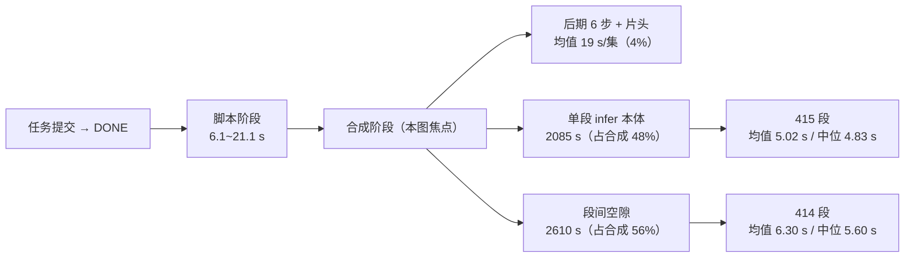
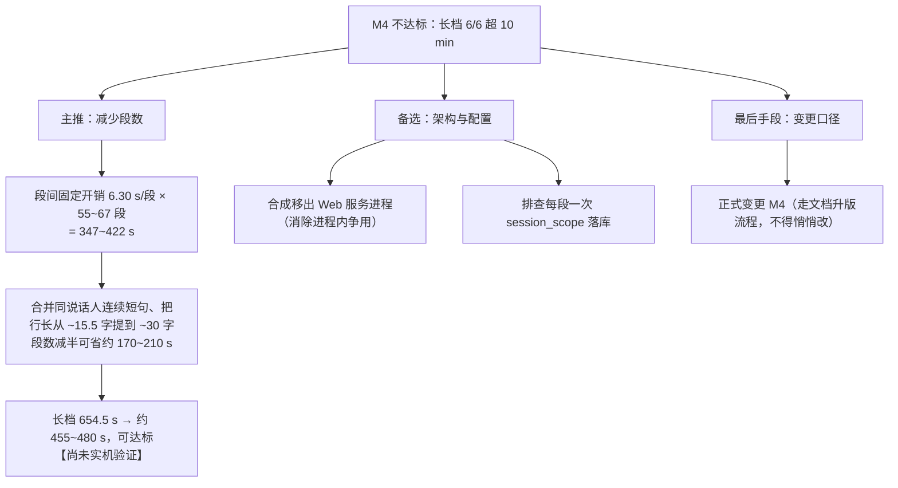

# D10 评测压测实施报告

> 阶段：D10（评测压测：测试主题集 · 端到端压测 · MOS 包）
> 版本：V1.0.0　|　日期：2026-09-18　|　范围：`scripts/eval_batch.py`、`scripts/make_mos_pack.py`、测试主题集、实机压测结果与性能诊断

## 版本记录

| 版本 | 日期 | 变更摘要 |
| --- | --- | --- |
| V1.0.0 | 2026-09-18 | 首次发布。含 12 条实机压测结果、**M4 不达标判定**、性能分解诊断（含 4 项排除结论）、本轮 4 项缺陷修复、MOS 包产物与自检。 |

---

## 一、本阶段交付物

| 交付物 | 路径 | 说明 |
| --- | --- | --- |
| 端到端压测工具 | `scripts/eval_batch.py` | 走真实 HTTP + Cookie 鉴权链：建任务 → 轮询 → 合成 → 采集指标 → 逐句一致率回验 → 产出报告 |
| MOS 造包工具 | `scripts/make_mos_pack.py` | 截片段 → N 声提示音 → 静态增益对齐 → `mos_pack.mp3` + 评分表 + 说明 + 台账 |
| 测试主题集 | `backend/assets/eval_topics.json` | 12 条：知识科普/行业解读/生活闲聊 各 4 条，长短各半 |
| 单测 | `tests/test_eval_batch.py`（47 项）、`tests/test_make_mos_pack.py`（19 项） | 两个文件均为本阶段新建，合计 **66 项**（初版 52 + 后续 4 项修复累计 14） |
| 压测产物（权威） | `outputs/eval/20260918_0920/` | `results.json` / `cases.csv` / `report.md` / `audio/`（12 条成片） |
| 压测产物（上一批，已并入） | `outputs/eval/20260917_172917/` | K1/K2/K3 三条 + `INTERRUPTED.json`（半成品标记） |
| MOS 包 | `outputs/eval/20260918_0920/mos/` | `mos_pack.mp3`（13.22 MB / 9.6 min）+ 评分表 + README + 台账 |

**全量回归：288 项全绿**（222 → 288；`pytest tests/ --junitxml=pytest_junit.xml`，`failures=0 errors=0 skipped=0`，72.4 s）。

---

## 二、判定口径（引用本报告数字前必读）

1. **端到端耗时** = `POST /api/tasks` → `status=DONE` 的墙钟秒数（含脚本生成、合成、后期、RSS 落盘）。**>10min 标记按端到端耗时判定**（M4 原文：「1000 字脚本端到端耗时 ≤ 10 分钟」）。
2. **千字耗时** = 端到端耗时 ÷ 字数 × 1000，是 M4 那条线的跨档可比形式。短档绝对值含动态片头与固定开销，直接与 600 s 比会低估长档风险。
3. **端到端 RTF** = 端到端耗时 ÷ 成片时长，**与 D3/D5 报告里的「合成 RTF」不是同一口径，不可直接比较**。
4. **可用率只给结构口径**：HTTP 响应不暴露链路内部纠错轮次，因此本工具**给不出「首次调用结构通过率」**（计划书 4.10 ③ 要求该指标分列统计，本报告只提供其中一列）。
5. **字数配额不判可用性**：`SCRIPT_WORD_QUOTA_ENFORCE` 默认关，字数偏差只上报不判失败。
6. **预热**：M4 的前提是「模型已预热」，而 TTS 引擎是懒加载的（冷启含模型加载与 warmup）。压测默认先跑一条 0.5 min 的预热任务（`--no-warmup` 可关），**不计入统计**，且在报告中交代是否预热。
7. **一致率**为「脚本行 ↔ 音轨」三层对齐回验：① `read_text` 非空；② `text_hash` 非空且 `duration_ms > 0`；③ `seg_status=DONE` 且 `GET /segments/{seq}/audio` 返回 200 且**首段时长 ≤ 该行合计 + 0.35 s**（一行可切多句，试听端点只返回首段，写成等式会误判切句行）。
8. 响度/真峰复用 `make_listen_pack.measure`（ebur128 + astats），与 D3/D5 基线**同一函数**，可直接对照。

---

## 三、实机压测结果

### 3.1 逐条明细（12 条，含并入的 3 条）

| 编号 | 类别 | 档位 | 主题 | 端到端 s | 脚本 s | 合成 s | 千字 s | 成片 s | 端到端 RTF | 字数 | 行数 | LUFS | dBTP | 一致率 |
| --- | --- | --- | --- | --- | --- | --- | --- | --- | --- | --- | --- | --- | --- | --- |
| K1 | 知识科普 | short | 为什么打哈欠会传染 | 208.1 | 6.1 | 202.0 | 581.3 | 114.4 | 1.82 | 358 | 18 | −16.6 | −1.8 | 18/18 † |
| K2 | 知识科普 | short | 冰箱里的食物为什么会串味 | 250.3 | 9.1 | 241.2 | 672.8 | 121.7 | 2.06 | 372 | 21 | −16.6 | −1.5 | 21/21 † |
| **K3** | 知识科普 | long | 人体免疫系统是怎么区分敌人和自身的 | **669.5** | 15.1 | 654.4 | 734.1 | 306.7 | 2.18 | 912 | 61 | −16.6 | −1.8 | 61/61 † |
| **K4** | 知识科普 | long | 深海生物为什么能承受巨大的水压 | **714.8** | 21.1 | 693.7 | 733.1 | 306.1 | 2.33 | 975 | 63 | −16.6 | −1.7 | 63/63 |
| I1 | 行业解读 | short | 社区团购为什么又火了起来 | 301.6 | 12.1 | 289.5 | 854.2 | 130.4 | 2.31 | 353 | 26 | −16.6 | −1.8 | 26/26 |
| I2 | 行业解读 | short | 播客这种媒介为什么重新流行 | 250.3 | 9.1 | 241.2 | 674.6 | 121.7 | 2.06 | 371 | 20 | −16.6 | −1.8 | 20/20 |
| **I3** | 行业解读 | long | 低空经济背后的产业链机会 | **684.7** | 18.1 | 666.6 | 719.2 | 310.6 | 2.20 | 952 | 59 | −16.6 | −1.8 | 59/59 |
| **I4** | 行业解读 | long | 开源大模型的竞争格局正在怎么变 | **763.0** | 18.1 | 744.9 | 796.4 | 325.7 | 2.34 | 958 | 67 | −16.7 | −1.7 | 67/67 |
| L1 | 生活闲聊 | short | 为什么我们总在深夜想通很多事 | 268.4 | 9.1 | 259.4 | 733.4 | 125.4 | 2.14 | 366 | 22 | −16.6 | −1.8 | 22/22 |
| L2 | 生活闲聊 | short | 搬家的时候最该扔掉的到底是什么 | 280.4 | 9.1 | 271.3 | 764.0 | 131.0 | 2.14 | 367 | 22 | −16.6 | −1.6 | 22/22 |
| **L3** | 生活闲聊 | long | 把通勤时间真正用起来是种什么体验 | **654.5** | 18.1 | 636.4 | 724.0 | 284.8 | 2.30 | 904 | 55 | −16.6 | −1.7 | 55/55 |
| **L4** | 生活闲聊 | long | 成年之后怎么重新交到朋友 | **655.0** | 18.1 | 636.9 | 701.3 | 292.6 | 2.24 | 934 | 57 | −16.5 | −1.6 | 57/57 |

† 标记的三条来自上一批（`20260917_172917`），通过 `--merge-from` 原样并入统计，**未重跑**——理由见 6.1。
加粗 = 端到端耗时越过 10 分钟线。

- 本批（9 条）墙钟 **4598.1 s**；预热任务端到端 166.4 s（冷启动，不计入统计）。

### 3.2 指标判定

| 指标 | 口径 | 实测 | 目标 | 判定 |
| --- | --- | --- | --- | --- |
| 完成率 | 成功 / 总数 | 12 / 12 | — | 达标 |
| 可用率（结构口径） | 结构合规且未命中合规自检 / 已完成 | 12/12 = 100% | ≥ 80% | 达标 |
| **逐句一致率** | 三层对齐回验通过行 / 总行 | **491/491 = 100.00%** | = 100% | **达标** |
| **千字端到端耗时（长档中位）** | 长档端到端 ÷ 字数 × 1000 | **728.6 s** | ≤ 600 s | **不达标** |
| 长档端到端中位 | — | 677.1 s | ≤ 600 s（M4 等价形式） | **不达标** |
| 短档端到端中位 | — | 259.4 s | — | 参考 |
| 端到端 RTF 中位 | 端到端 ÷ 成片时长 | 2.19 | — | 参考 |
| 成片响度中位 | ebur128 综合响度 | −16.60 LUFS | −16 ± 1 | 达标 |
| 成片真峰中位 | ebur128 真峰 | −1.75 dBTP | ≤ −1.5 | 达标 |
| 字数偏差中位 | (实际−目标)/目标 | −8.05% | ±10% | 只上报不判 |
| 端到端耗时 > 10 min | 条数 | **6 / 6 长档** | 0 | **不达标** |

### 3.3 M4 判定：**不达标（实锤，非估算）**

长档 6 条**全部**超过 10 分钟线，**最快的一条（L3，654.5 s）也超线 9%**：

| 编号 | 端到端 s | 超线幅度 | 千字 s |
| --- | --- | --- | --- |
| L3 | 654.5 | +9.1% | 724.0 |
| L4 | 655.0 | +9.2% | 701.3 |
| K3 | 669.5 | +11.6% | 734.1 |
| I3 | 684.7 | +14.1% | 719.2 |
| K4 | 714.8 | +19.1% | 733.1 |
| I4 | 763.0 | +27.2% | 796.4 |

这不是边界擦线，而是**系统性偏离**：长档中位 677 s ≈ 目标的 113%。外推到 1040 字（长档目标字数）约 **750~780 s**。

> 说明：6 条长档实际字数 904~975，**均低于** 1040 的目标配额（字数偏差中位 −8.05%）。也就是**实际字数比目标少 6%~13%，耗时却仍超线** —— 若字数严格对齐 1040，超线幅度还会更大。这一点强化了判定。

---

## 四、性能诊断：时间花在哪

### 4.1 阶段分解（从后端日志时间戳重建，430 段样本）



| 分解项 | 实测 | 占比 |
| --- | --- | --- |
| 单段 infer 本体（LLM 出 token 到 `yield speech len`） | 415 段，均值 **5.02 s**、中位 4.83 s、P90 5.98 s | 合成阶段 48% |
| **段间空隙**（上段 `yield` → 下段 `synthesis text`） | 414 段，均值 **6.30 s**、中位 5.60 s、P90 **5.62 s** | 合成阶段 **56%** |
| 后期 6 步（格式统一/淡化/停顿/拼接/loudnorm/导出）+ 动态片头 | 10 集均值 **19 s** | 全程 **4%** |
| 合成阶段合计 | 430 段 / 4339 s，**10.09 s/段** | — |

**关键读数两条：**

1. **单段 infer 本体很快**（5.02 s，RTF≈1.0 量级），与引擎级探针一致 —— 说明**模型本身没有劣化**。
2. **56% 的时间落在「段与段之间」**，且其分布**异常规整**（中位 5.60 s、P90 5.62 s）——固定耗时被逐段累加，不是偶发抖动。

### 4.2 本轮排除的四个嫌疑（都做了对照实验）

| 嫌疑 | 实验 | 结论 |
| --- | --- | --- |
| `TTS_EMPTY_CACHE_EACH_SEG=true`（每句前后各 `torch.cuda.empty_cache()` 一次） | 同进程、逐条交替 A/B，行长 8/16/32 字 | **排除**。8 字 4.72 s vs 4.31 s、32 字 8.00 s vs 8.85 s —— 差异在噪声内且符号翻转。**不要动它。** |
| 收敛守卫重试（未收敛 → 重新推理整段） | 统计后端日志 `[PATCH-GUARD-01]` | **排除（不是主因）**。430 段仅触发 3 次（0.7%）。 |
| 后期 6 步 / 两遍 loudnorm | 日志时间戳拆阶段 | **排除**。只占全程 4%（19 s/集）。**关第二遍 loudnorm 最多省 2%，得不偿失。** |
| 说话人 A/B 交替导致的 prompt 重建 | 同进程 only_a / only_b / 交替 / 严格 ABAB 四臂对照 | **排除**。交替臂中位 5.57 s，未见切换惩罚（A/B 各自的方差才是主要噪声源）。 |

引擎级行长阶梯还给出一个有用的旁证：**固定开销约 3.6 s + 0.14 s/字**（8 字→4.72 s、16 字→5.54 s、32 字→8.00 s），即**文本越短、单位成本越高**。

### 4.3 未闭环项（R21）与已给出的方向

段间那 ~6.3 s 的**确切机制尚未锁定**。已确认的边界条件：

- 不在模型内部（infer 本体只有 5.02 s，与无并发的引擎探针一致）；
- 不在后期（4%）；
- 不是 `empty_cache`、不是守卫重试、不是说话人切换（见 4.2）；
- **强敏感性**：在「8 个 CPU 忙线程 + 每 50 ms 一次 SQLite 提交」的负载下，单段合成**8 分钟未能完成一段**（安静态同文本 4.67 s）。该负载量级**不具代表性**（纯 Python 忙循环会把 GIL 饿死），只能作为「该阶段对 CPU/GIL 竞争高度敏感」的定性证据，**不能当作定量结论**。

**下一步建议（按性价比排序）**：

1. **给 `TTSEngine.synthesize()` 插桩**：在 `_infer` / `torchaudio.save` / `_write_cache` / `self.vram()` / `empty_cache` 各段打点，把耗时随 `SegStatus` 一起落库。这是唯一能一次性定位的手段，成本约半天。
2. 排查 `TaskRunner._on_synth_progress` 的**每段一次 `session_scope`**（每段一个新 Session + commit）。若第 1 步显示空隙落在这里，改造方向是「批量/降频落库」。
3. 检查进程内 Web 服务与合成的**资源争用**（onnxruntime 在本机**只有 CPUExecutionProvider**，无 CUDA EP；`torch.get_num_threads()=8` 而逻辑核 16）。

---

## 五、质量口径（这部分是达标的）

- **逐句一致率 491/491 = 100%**：12 条共 491 行的「脚本行 ↔ 音轨」三层对齐全部通过，`report.md` 的「一致率失败明细」为空。这是计划书难点 4 所要求的对齐验证。
- **响度稳定**：12 条全部落在 −16.50 ~ −16.70 LUFS，中位 −16.60，偏差 ≤ 0.4 LU（目标 −16 ± 1）。
- **真峰合规**：−1.50 ~ −1.80 dBTP，全部 ≤ −1.5。
- **字数偏差**：中位 −8.05%，落在 ±10% 内（只上报不判，见口径 5）。

---

## 六、本阶段修复的缺陷（4 项，均已加回归单测）

### 6.1 `FIX-EVALRESUME-01`｜断点续跑：`--merge-from`

批次中途暂停后，**已完成的 case 不能重跑**：合成链路有句级缓存（缓存键含 `read_text`），重跑会命中缓存、耗时被压成「假快」，反而系统性污染 M4 口径。因此新增 `--merge-from`：

- `load_prior_cases(dirs)`：读回旧 `results.json`；坏目录**只告警不抛**（续跑不该被一个手误路径搞崩）。
- `merge_carried_over(results, prior)`：本次优先（同 id 不覆盖），**只并入 `status=DONE`**（失败/半截记录没有统计价值）。
- `order_results_by_topic_set(spec, results)`：按主题集声明顺序重排，保证报告行序稳定、可逐次比对。
- 报告对续跑行标「（续）」并披露来源目录，避免被误读成本批重跑过。
- 中断时在产物目录写 `INTERRUPTED.json`（已完成/缺失 id + 可复制的续跑命令），防止半成品被当作完整结果。

新增 7 项单测；变异测试 5/5 全被捕获（不筛 status / 忘打标记 / 不重排 / 报告不披露 / 行不打标记）。

### 6.2 `FIX-EVALPROXY-01`｜本机请求被环境代理劫持

本轮首次续跑**立刻失败**（EXIT=2，误报「无法建立登录态」）。真因：环境里设了 `HTTP_PROXY`/`HTTPS_PROXY`，httpx 默认 `trust_env=True` 让**本机请求也走代理**；代理发出 absolute-form 请求行，而 uvicorn 不是代理，把整串当路径编码成 `GET http%3A//127.0.0.1%3A8000/api/feeds/me` → 一律 404。

极迷惑点：裸 `httpx.get(绝对URL)` 返回 401（正常），而 `httpx.Client(base_url=…).get(相对路径)` 返回 404 —— **不能用前者证明后端没问题**。判据是「后端访问日志里请求行是百分号编码的整串 URL」。
修复：`EvalClient` 加 `trust_env=False`，并留显式逃生舱 `EVAL_HTTP_TRUST_ENV=1`。新增 3 项单测锁住。

### 6.3 `FIX-WORDDEV-01`｜报告「字数偏差」被乘了两次 100

`word_deviation_pct` 存的是**百分数**（−8.05 表示 −8.05%），渲染端却用 `:+.1%` 又乘一次 → 报告显示 **−805.0%**。修复渲染格式并加 2 项单测（同时锁「值正确」与「没有多一个数量级」）。

### 6.4 `FIX-BEEPBURST-01`｜MOS 包自检提示音计数假阳性

首版自检对 item 4 数出 5 声、item 6 数出 7 声（期望 4 / 6）→ 判定 FAIL。真因两条叠加：

1. 旧窗口 `i*(BEEP_DUR+BEEP_GAP)+0.05` **恰好比提示音组多出 0.05 s**，而片段从成片第 20 s 切入、常常切在词中间 —— 窗口尾部探进了一个响亮的音节；
2. 旧判据用「窗口局部最大值 × 0.3」定阈值，而**提示音比正文轻**（正文峰值约 −2 dBFS），基准被语音顶高后判据失真。

修复：改用 `_count_beeps_selfref()` —— 只在**准确的提示音区间**内计数，阈值取**第一声提示音自身电平 × 0.5**；并把「提示音起点 s / 正文起点 s」写进台账便于复核。重建后自检 **27/27 PASS（判定 PASS）**。新增 2 项单测（含「旧窗口应确实外溢进正文」的前提断言，防止回归理由失效后测试空转）。

---

## 七、结论与后续

### 7.1 结论

1. **功能与质量口径达标**：12/12 完成、结构可用率 100%、**一致率 100%（491/491）**、响度与真峰全部合规。
2. **M4 性能指标不达标**：长档 **6/6 超 10 分钟线**，中位 677 s（≈目标的 113%），最快一条也超线 9%。且这还是在**字数低于目标 6%~13%** 的前提下。
3. **瓶颈已定位到大类**：合成阶段的 **56% 花在「段与段之间」的固定开销**（6.30 s/段），单段模型推理本身只有 5.02 s、与无并发的引擎探针一致。**模型与后期都不是瓶颈**。

### 7.2 M4 处置建议（按预期收益排序）



- **主推「减少段数」**：这是唯一能用现有实测数字推出量级、且不改架构的杠杆。当前脚本行长仅 ~15.5 字，而 `max_chars_per_seg=40` —— 段数受**脚本层**而非配置层限制。把连续同说话人的短句合并、或把行长抬到 ~30 字，段数即可减半，预期节省约 170~210 s。**该估算尚未实机验证**，建议做一个「同字数、段数减半」的 A/B 确认后再动手。
- **不要做**：关 `empty_cache`（实测无差异）、关第二遍 loudnorm（后期只占 4%）。这两条已被实测排除，做了只会牺牲音质与稳定性。
- **若上述都不足以收敛**：M4 的口径需要走正式变更流程，**不得在报告中悄悄改写判定标准**。

### 7.3 下一步

1. 按 4.3 第 1 条给 `synthesize()` 插桩，闭环 R21（段间 6.3 s 的确切来源）。
2. 做「段数减半」A/B，验证 7.2 的估算。
3. D11：MOS 包已产出，**回收评分需真人**（评分表 `mos_scoresheet.csv` 已留空待填）。

---

## 附：如何复跑

```bash
# 1) 起后端（必须后台常驻；PowerShell 的 *> 遇 native stderr 会终止脚本）
python -m uvicorn api.main:app --host 0.0.0.0 --port 8000 --log-level info > uvicorn.log 2>&1

# 2) 全量 12 条
python scripts/eval_batch.py --out outputs/eval/<时间戳>

# 3) 续跑（只跑剩下的，并并入已完成的）
python scripts/eval_batch.py --ids K4,I1,I2,I3,I4,L1,L2,L3,L4 \
  --out outputs/eval/<新时间戳> --merge-from outputs/eval/20260918_0920

# 4) MOS 包
python scripts/make_mos_pack.py --eval-dir outputs/eval/<时间戳>
```

- 想先验证 harness 而不占 GPU：加 `--no-synth`（只跑到 `SCRIPT_READY`）。
- 想看将执行哪些 case：加 `--dry-run`。
- **不要用 `--ids` 重跑已完成的 case**，会命中句级缓存导致耗时假快（见 6.1）。

### 诊断证据（第四章数字的复核入口）

| 文件 | 用途 |
| --- | --- |
| `outputs/eval/20260918_0920/uvicorn_run.log` | 本轮后端全量日志（阶段标记的唯一来源，757 KB） |
| `outputs/eval/20260918_0920/run.log` | 压测工具控制台输出（12 条逐条结果） |
| `outputs/eval/20260918_0920/pytest_junit.xml` | 全量回归的机读记录（`tests=288 failures=0 errors=0 skipped=0`），断言「288 项全绿」用 |
| `probes/probe_log_stage_split.py` | **重建第四章全部数字**（infer 5.02 / 空隙 6.30 / 后期 4%）：`python probe_log_stage_split.py uvicorn_run.log` |
| `probes/probe_fixed_cost_ab.py` | 复跑 4.2 首行「行长阶梯 × `empty_cache`」对照（需 GPU，约 4 min） |
| `probes/probe_speaker_switch.py` | 复跑 4.2 末行「单向 / 交替 / 严格 ABAB」四臂对照 |
| `probes/probe_emptycache_ab.py` | `empty_cache` 单点 A/B（3 种行长逐条交替） |
| `probes/probe_seg_dist.py` | 段级 infer 耗时分布（4.1 的 415 段均值/中位/P90） |
| `probes/probe_gap.py` | 段间空隙量化（4.1 的 6.30 s/段、占 56%） |
| `probes/probe_cpu_threads.py` | 算力与线程配置快照（4.3 的 16 核 / torch 8 线程 / ONNX 仅 CPU EP） |
| `probes/probe_contention.py` | 争用 A/B（4.3 的**定性**证据；负载不具代表性，见正文声明） |
| `probes/probe_log_templates.py`、`probes/probe_mos_fail.py` | 日志阶段标记枚举、MOS 自检失败诊断 |
| `probes/*.log`（10 个） | 上述各探针的原始输出，与正文数字一一对应 |

> **全部探针脚本与原始输出均已随产物归档**（`probes/` 内 20 个文件 = 10 脚本 + 10 原始输出），命名不再带 `_` 前缀——沙箱会回收仓库内以 `_` 开头的临时文件，此前一轮正是因此导致脚本一度「消失」。复跑时把 `probes/` 当工作目录、后端日志按上表路径传入即可。`probe_log_stage_split.py` 已在报告发布前复跑验证：infer 5.02 s / 空隙 6.30 s / 56% / 后期 4% 逐项复现。

---

**引用本报告数字前，请先读第二章「判定口径」。**
