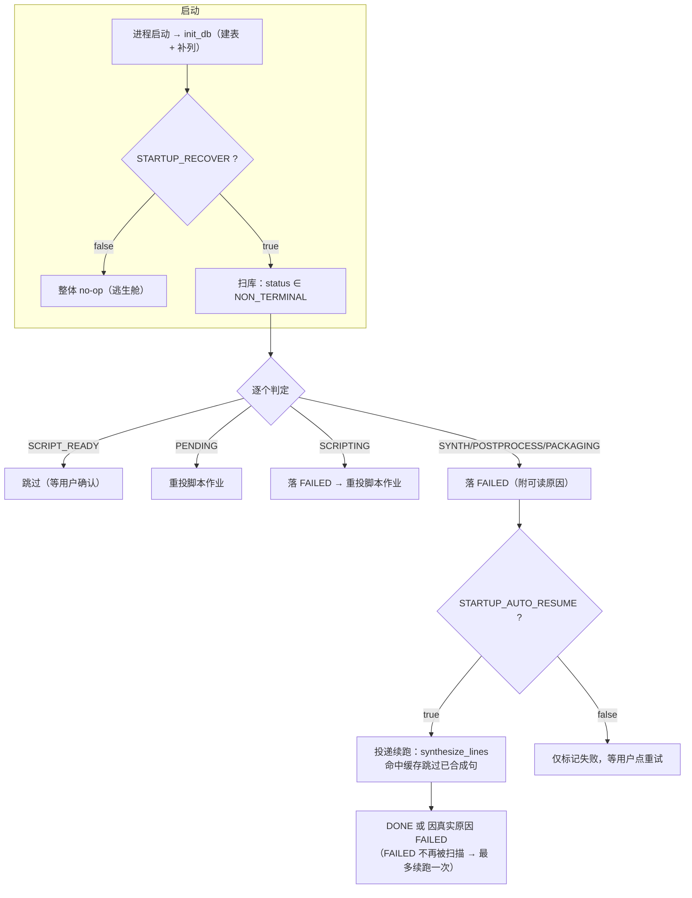

# D12 性能优化与稳定性加固实施报告

## 版本记录

| 版本 | 日期 | 说明 |
| --- | --- | --- |
| V1.0.0 | 2026-09-18 | 首版。覆盖 D12 全部五项范围（缓存命中率、异常处理、断点续跑、队列提示、P1 裁剪决策点），含单元测试、**变异测试**与**实机杀进程续跑验证**三档证据。 |

**本报告与《D10 评测压测实施报告_V1.1.0》的关系**：D10 解决的是「性能不达标」，本阶段解决的是「**中断与异常下能不能活下来**」。两者都动过 `task_runner`，但 D12 的改动不改变任何性能口径 —— 本报告不引用 D10 的耗时数字，也不对其做任何修订。

---

## 一、本阶段范围与交付物

### 1.1 计划书原文（D12 行）

| 项 | 内容 |
| --- | --- |
| 阶段 | D12（09-26）· 优化 |
| 任务 | 稳定性加固 |
| 要求 | 缓存命中率优化；异常处理（LLM 超时 / FFmpeg 失败 / OOM 重试）；断点续跑验证；队列排队提示；**P1 裁剪决策点** |
| 完成判定 | 人为断网与杀进程后重启，任务可续跑成功；P1 未完成项已降级并记录 |

### 1.2 实际交付物

| 类型 | 文件 | 说明 |
| --- | --- | --- |
| 代码 | `api/services/task_runner.py` | 崩溃恢复扫描（`recover_interrupted`）、队列快照/位次、命中率读数、封装幂等化 |
| 代码 | `api/services/tts.py` | CUDA OOM 识别与重试（`_is_cuda_oom` / `_infer_with_oom_retry`） |
| 代码 | `api/config.py` | 新增 `startup_recover` / `startup_auto_resume` / `tts_oom_retry` |
| 代码 | `api/models.py` | `Task.cache_hit_count` / `cache_seg_count` 两列 + `to_dict` 补字段 |
| 代码 | `api/db.py` | `_ensure_columns` 幂等补列迁移（`create_all` 不会给既有表加列） |
| 代码 | `api/schemas.py` | `TaskOut` 新增 `queue_position` / `cache_hit_count` / `cache_seg_count` / `cache_hit_rate` |
| 代码 | `api/routers/tasks.py` | 统一 `_task_out()` 出口，把队列位次注入所有任务响应 |
| 代码 | `api/main.py` | 启动钩子里调用恢复扫描（失败不阻断启动，但必须留堆栈） |
| 测试 | `tests/test_d12_resilience.py` | **19 项**（恢复 8 / 封装幂等 1 / 队列与指标 3 / OOM 5 / 兼容 2） |
| 测试 | `scripts/mutation_check_d12.py` | **变异测试台**：8 条注入，逐条要求「该红必须红」 |
| 验证 | `scripts/verify_d12_phase1_kill.py` | 实机：造唯一脚本任务 → 跑到 40% → `taskkill /F /T` |
| 验证 | `scripts/verify_d12_phase2_resume.py` | 实机：重启后收集 `[RECOVER]` / `[CACHE]` 证据并判定 |
| 验证 | `scripts/verify_d12_offline_llm.py` | 实机：LLM 不可达时任务必须 `FAILED` 且原因可读 |
| 验证 | `scripts/verify_d12_crash_recover.py` | 一体化版本（保留作参照；其「同一进程内起两次后端」的写法**不可靠**，原因见 6.3） |

---

## 二、判定口径（引用本报告数字前必读）

1. **「断点续跑」的准确含义**：不是「从字节偏移接着写」，而是**「合成阶段按 `text_hash` 命中句级缓存重放」**。续跑时整条合成分段会**从头遍历全部句子**，命中的句子直接取缓存 wav（不碰 GPU），只有未命中的句子真正推理。因此续跑的正确性判据是「**部分命中**」—— 全命中说明脚本整体命中了历史缓存（这轮根本没测到续跑），全未命中说明前面积累的成果没被复用。本报告 §5 的两条合法性守卫就是为此设的。
2. **命中率是「整体重算」不是「累加」**：续跑会重跑整个合成阶段，若累加就会把同一批段算两遍、命中率虚高。`cache_seg_count` 每次落库都整体覆盖（`models.Task` 该列注释 + 变异 M2 的靶子）。
3. **`queue_position` 的 0 是「正在跑」**：0 = 正在合成，1 = 下一个……`None` = 不在队列（终态或等待用户确认）。
4. **`cache_hit_rate` 在 `seg=0` 时是 `null` 而非 `0.0`**：前者是「没测过」，后者是「命中率 0%」，前端语义完全不同（变异 M6 的靶子）。
5. **本阶段的自动续跑最多发生一次**：恢复只扫非终态，续跑后任务要么 `DONE`、要么因真实原因落 `FAILED`，而 `FAILED` 不在扫描范围内。

---

## 三、实现内容

### 3.1 崩溃恢复：启动扫描 + 自动续跑

**问题**：进程被 `kill -9` / 断电后，库里会留下 `SYNTHESIZING` / `POSTPROCESSING` / `PACKAGING` 这类非终态任务。**没有任何东西会再推动它们** —— 前端进度条永远卡住，单并发队列也永远等不到它结束。这不是理论问题：本阶段实施时就在库里捞到一个**真实的僵尸任务**（`945b49e5-…`，D10 批次被中断的 K4 遗留，停在 `SYNTHESIZING`，此后所有批次都不会再碰它）。

**处置规则**（`recover_interrupted`）：

| 残留状态 | 处置 | 理由 |
| --- | --- | --- |
| `PENDING` | 重新投递**脚本**作业 | 作业还没跑过，`PENDING → SCRIPTING` 本就合法 |
| `SCRIPTING` | → `FAILED` → 重新投递脚本作业 | 脚本可能只写了一半；`_run_script` 整份替换 `script_lines`，回放幂等 |
| `SCRIPT_READY` | **不动** | 它在等用户确认，**不是**被中断的状态。误判会让用户丢掉刚改好的脚本 |
| `SYNTHESIZING` / `POSTPROCESSING` / `PACKAGING` | → `FAILED`（附可读原因）；`startup_auto_resume` 为真时立即续跑合成 | 合成幂等，重放只补未命中段 |

配套改动：
- 状态机新增 **`FAILED → SCRIPTING`** 回边。`_run_script` 的第一个动作就是迁到 `SCRIPTING`，而状态机**不许自环**，所以必须先落 `FAILED` 再回 `SCRIPTING`。该边在计划书 4.5 的正文与 mermaid 里原本都没有，属本阶段新增 —— **已在计划书 V1.13.0 中补入 4.5 状态机图**（连同图里原本缺失的 `FAILED → SYNTHESIZING` 与 `SCRIPTING → CANCELED` 一并补齐，并去掉会误导为终态的 `FAILED → [*]`），使图与代码里的 `TRANSITIONS` 逐边一致。
- 新增常量 `NON_TERMINAL`（扫描范围）与 `AUTO_RESUMABLE`（可自动续跑的范围）—— 二者**刻意不同**，`SCRIPT_READY` 只在前者里。
- 恢复在 `api/main.py` 的启动钩子里执行，且在 `init_db()` **之后**（表与列要先就位）；用 `get_runner()` 单例（恢复要向**同一个**单并发队列投递，不能另起 executor）。恢复本身抛异常**不阻断服务启动**，但必须 `log.exception` 留全堆栈 —— 绝不静默。



### 3.2 异常处理加固

计划书列了三项，本阶段的处置**并不相同** —— 两项早已具备，只有一项是新做的。这里如实区分，避免把既有能力算成本阶段成果：

| 项 | 现状 | 本阶段动作 |
| --- | --- | --- |
| **LLM 超时 / 网络抖动** | **D4 已实现**：`tenacity.Retrying`，`stop_after_attempt(llm_max_retry+1)`（默认 3 次），`wait_exponential(multiplier=1, min=1, max=4)` = 退避 1s → 2s → 4s，`retry_if_exception_type(LLMRetryable)` 只重试传输层错误 | 仅**核对**，未改动。既有单测 12 项覆盖（超时可重试且消息可读 / 连接错误指向代理 / 鉴权错误不重试 / 缺 key 快速失败 / 截断输出有提示 …） |
| **FFmpeg 失败** | **D5 已实现**：`PostprocessError`，10 处 `raise`，失败信息落 `error_msg` | 仅**核对**，未改动 |
| **CUDA OOM 重试** | **无** | **新增** `FIX-OOM-RETRY-01`（见下） |

**`FIX-OOM-RETRY-01`（新增）**：单句推理抛 CUDA OOM 时，`empty_cache()` 清一次显存后重试同一句，上限 `tts_oom_retry`（默认 1）。

- 识别用两条判据：`torch.cuda.OutOfMemoryError` **或**消息里含 `out of memory`。只认前者会漏 —— 被上游包一层的调用点常只抛 `RuntimeError("CUDA out of memory. …")`。
- **重试不偏移随机种子**。这一点与收敛守卫**刻意相反**：OOM 是资源问题不是采样问题，换种子既无意义还会凭空改变输出。
- 重试耗尽后抛 `TTSError`（不是裸 `RuntimeError`），消息里带上两个显存预算与三条处置建议（关其他 GPU 进程 / 调小 `MAX_CHARS_PER_SEG` / 调大 `TTS_OOM_RETRY`）。
- 默认只重试 **1 次**：收益主要来自第一次（把残留 reserved 块还给驱动），再多只是拉长失败路径。

**`FIX-PACKAGE-UPSERT-01`（新增，续跑的必要配套）**：`episodes.task_id` 是 **unique**。若上一次进程在 `PACKAGING` 里被杀（Episode 行已提交、状态还没推到 `DONE`），续跑时直接 `db.add(...)` 会撞唯一约束 —— 任务从「差一步」变成 `FAILED`。改为按 `task_id` **upsert**：有则就地更新（时长/大小/路径可能因重跑而变），无则新建；`guid` 沿用旧值，否则老订阅端会看到同一期两个不同 enclosure。这条是「续跑真的能跑到底」的最后一环，不修则 §5 的验证会卡在最后一步。

### 3.3 可观测性

**队列排队提示**：`ThreadPoolExecutor(max_workers=1)` 不暴露队列内容，但 `_futures` 里「尚未完成」的 future **按键的插入顺序**排列，就是投递顺序。据此实现 `queue_snapshot()`（running + waiting）与 `queue_position(task_id)`（0=正在跑，1=下一个…）。所有任务响应经统一出口 `_task_out()` 注入该字段；读取失败只告警、不拖垮响应。

**缓存命中率**：合成阶段统计 `audio_cache` 命中数，落 `cache_hit_count` / `cache_seg_count` 两列（整体重算，见口径 2），`cache_hit_rate` 由 `to_dict` 派生。每次合成都会打一行 `[CACHE]` 日志 —— §5 的「部分命中」证据就取自这行。

**顺带修掉的一个长期空字段**：`TaskOut` 早就声明了 `updated_at` / `finished_at`，但 `Task.to_dict()` 一直没产出它们（只有 `created_at`），接口因此**恒为 null**。本阶段补上。

---

## 四、单元测试与变异测试

### 4.1 全量回归

```
pytest tests/ --junitxml=outputs/synth_trace/junit_d12.xml
→ tests=356  failures=0  errors=0  skipped=0
```

基线 335 → **356**（+21：`test_d12_resilience.py` 19 项 + 既有文件因本次改动补的 2 项）。分文件计数以 `junit_d12.xml` 为准。

> 收尾时的 `SystemExit: 1` 来自沙箱 safe-delete 守卫（清理临时目录时触发），**不影响测试结果**，计数一律以 junit 为准。

### 4.2 变异测试：证明「测试真的在测东西」

「测试通过」只能说明「当前代码没触发断言失败」，不能说明「测试确实覆盖了这件事」。变异测试台 `scripts/mutation_check_d12.py` 把被测逻辑**故意改坏一点**，要求对应单测**必须变红**，随后还原并要求复跑变绿。

```
python scripts/mutation_check_d12.py
→ 变异测试全部通过：8/8
```

| # | 注入的缺陷 | 期望变红的测试 | 结果 |
| --- | --- | --- | --- |
| M1 | 恢复扫描不再跳过 `SCRIPT_READY` | `test_recover_skips_script_ready` | 如期变红 |
| M2 | 命中读数改成**累加**而非整体重算 | `test_cache_hit_counters_recomputed_not_accumulated` | 如期变红 |
| M3 | OOM 识别恒为 `False` | `test_oom_retried_once_then_succeeds` | 如期变红 |
| M4 | 重试额度被吞（`max_retry = 0`） | `test_oom_retried_once_then_succeeds` | 如期变红 |
| M5 | 排队位次差一（少 `+1`） | `test_queue_position_running_and_waiting` | 如期变红 |
| M6 | `seg=0` 时把命中率算成 `0.0` 而非 `null` | `test_task_to_dict_exposes_cache_rate_and_timestamps` | 如期变红 |
| M7 | 自动续跑失效（`if False`） | `test_recover_auto_resumes_to_done` | 如期变红 |
| M8 | **R21 回潮**：写事务重新横跨合成段 | `test_synth_does_not_hold_write_lock_across_synthesis` | 如期变红 |

**变异测试抓到了两个真问题，都当场修掉**：

1. **M6 第一次跑是「应红未红」** —— 那条测试只验了 `seg>0` 的分支，从未验证 `seg=0 → null`，所以把它改成 `0.0` 照样绿。**这就是测试是摆设的典型**。已补两条断言（`seg=0` 必须为 `null`；`hit/seg=3/4` 必须严格等于 `0.75`，从而杜绝 `max(1, seg)` 这类兜底写法）。
2. **M8 第一次跑也是「应红未红」** —— 原因很隐蔽：注入代码写的是 `…cache_seg_count = 0`，而该列**现值本来就是 0**，SQLAlchemy 判定对象未脏、**根本不发 UPDATE**，于是「长事务」根本没开起来，变异退化成空操作。改成写 `-1` 后才如期变红。这条已写进变异台的注释（`必须与现值不同`）——**变异本身也会假绿**，这比测试假绿更值得警惕。

---

## 五、实机验证：杀进程后重启可续跑

### 5.1 验证设计

| 要素 | 取值 | 理由 |
| --- | --- | --- |
| 脚本 | `PUT /script` 写入 **24 行**固定基础句，每行再拼一个**本次随机尾句** | 基础句保证段数可控；随机尾句保证**整行文本跨运行不同**。这与本项目既有铁律一致：**探针文本必须每次唯一**，否则命中句级缓存、验证退化成空跑 |
| 杀点 | 进度 **40%** （`SYNTHESIZING` 中） | 留出足够的「已合成前缀」让缓存有东西可命中 |
| 杀法 | `taskkill /F /T /PID <后端 pid>` | 等价 `kill -9`，不给任何清理机会 |
| 后端启动方式 | **shell 后台**（`run_in_background` + 重定向日志） | 见 6.3 —— 用 Python `Popen` 托管会被沙箱清理 |

**两条防退化守卫**（第一版正是踩了坑才加的）：

1. `phase1`：若合成耗时 **< 20 s** 就冲到目标进度，判定为「整份脚本命中历史缓存」→ **本轮作废**。（第一次跑就是这个结果：**2 秒冲到 65%**，`[CACHE]` 显示 **24/24 全命中** —— 因为文本与上一轮完全相同。）
2. `phase2`：要求命中数**严格介于 0 与段数之间**。全命中说明没测到续跑；全未命中说明中断前的成果没被复用。

### 5.2 阶段一：跑到 40% 后杀死

```json
{
  "task_id": "700ae951-ef23-4dbd-ad87-9a548478fe64",
  "line_count": 24,
  "progress_at_kill": 40,
  "status_at_kill": "SYNTHESIZING",
  "synth_wall_sec_at_kill": 112.8,
  "killed_pid": 192584
}
```

杀完后库内状态：`status=SYNTHESIZING`、`stage=合成`、`progress=40` —— 一个标准的**僵尸任务**。

### 5.3 阶段二：重启后自动恢复

启动日志（`server2.log`，节选）：

```
15:28:49.110 WARNING [RECOVER] 扫描到 4 个非终态任务：脚本重投 0、续跑 1、仅标记失败 0、跳过（等待用户确认）3
15:29:12.044 INFO text_frontend=wetext | model=CosyVoice2 | 加载 11.1s
15:29:18.779 INFO 预热耗时 5.59s
15:31:22.511 INFO [CACHE] task=700ae951-… 合成段数=27 命中缓存=14（命中率 51.9%）
15:31:23.068 INFO [1/6] 格式统一 44100 Hz / 1 ch / pcm_s16le
…
15:31:38.327 INFO 完成：…（253.8 s，3.87 MB）
```

| 指标 | 读数值 |
| --- | --- |
| 恢复扫描 | 扫到 4 个非终态：**续跑 1**、跳过（等待用户确认）3、脚本重投 0 |
| **缓存命中** | **14 / 27 段（51.9%）** —— 与杀点 40% 量级吻合，且**严格介于 0 与 27 之间** |
| 真正推理的段 | 13 段（27 − 14） |
| 最终状态 | **DONE / progress=100** |
| 行状态 | `script_lines` **24/24 全 DONE** |
| 续跑墙钟 | **169 s**（15:28:49 恢复 → 15:31:38 完成） |
| 其中各段 | 模型加载 ≈11 s + 预热 5.6 s + 合成 123.7 s + 后期与封装 15.8 s |
| 成片 | `data/audio/700ae951-…/final.mp3`，**253.77 s / 4.06 MB** |
| 响度 / 真峰 | **−16.6 LUFS / −1.8 dBTP**（合规，与 D10 口径一致） |

**缓存到底省了多少**：命中 14/27 = **51.9% 的段**不需要推理（实测）。按段数比例折算，合成耗时从「全部重推」的约 270 s 降到实测 **123.7 s**，省下约 **54%**（*此百分比为按段数比例的推算，非 A/B 实测对照，引用时请带此限定*）。

> 注意一个**容易被误读**的点：续跑不是「从第 11 段接着写」，而是**从头遍历 27 段**，命中的 14 段直接取缓存 wav，只有 13 段真正进 GPU。所以「续跑」的收益来自**跳过推理**，不是来自**跳过遍历**。

### 5.4 判定

```
==== 判定 ====
  OK  recover_log_nonempty      启动日志里有 [RECOVER] 行
  OK  auto_resumed              [RECOVER] 里「续跑 1」
  OK  final_done                最终 DONE
  OK  cache_reused              命中数 > 0
  OK  cache_partial             0 < 14 < 27（不是整份命中或整份未命中）
  OK  all_lines_done            script_lines 全部 DONE
PASS
```

### 5.5 「人为断网」的取证

D12 完成判定写的是「人为断网**与**杀进程后重启」。后半句由 5.1~5.4 取证；前半句分两层验证：

**（a）链路级单测**（既有，覆盖 12 项）：`tests/test_script_gen.py` 覆盖超时可重试且消息可读、连接错误指向代理、鉴权错误不重试、缺 key 快速失败、截断输出有提示等。

**（b）端到端实机**（本阶段新增）：把后端指向**必然连不上**的地址（`LLM_BASE_URL=http://127.0.0.1:9`，本机 discard 端口，无人监听），走一遍正常建任务流程：

```json
{
  "task_id": "a4bff1a1-3853-4600-8f96-e41ef341b8e4",
  "elapsed_sec": 12.1,
  "final_status": "FAILED",
  "error_msg": "脚本生成失败：无法连接 DeepSeek，已退避重试：Connection error."
}
```

判定：**12.1 s 内落到 `FAILED`**（3 次尝试 + 1s/2s/4s 退避），`error_msg` 是**人能读懂的中文**且点明了「已退避重试」，不是裸 traceback、也不是空串 —— 且任务**没有**卡在 `SCRIPTING`。

> 用本机 discard 端口而不是真去拔网线，是为了**可复现且不受本机网络环境影响**：`127.0.0.1:9` 上永远没有监听者，语义与「网络不可达」等价。服务端日志里仍保留完整堆栈（`LLMRetryable: 无法连接 DeepSeek…`），符合「用户看可读原因、运维看完整堆栈」的分工。


---

## 六、P1 裁剪决策点

### 6.1 计划书 D12 五项范围的完成情况

| 范围 | 状态 | 证据 |
| --- | --- | --- |
| 缓存命中率优化 | **完成（读数落地，非调优）** | 两个新列 + `[CACHE]` 日志 + `to_dict` 派生（§3.3）。**没有做「提高命中率」的算法改动** —— 现状命中率由「脚本文本是否重复」决定，不是算法问题 |
| 异常处理（LLM/FFmpeg） | **完成（核对确认，非新增）** | 两项 D4/D5 已实现，既有单测 12 项覆盖；本阶段未改动（§3.2）。「人为断网」另有端到端实机取证（§5.5） |
| 异常处理（OOM 重试） | **完成（新增）** | `FIX-OOM-RETRY-01`（§3.2） |
| 断点续跑验证 | **完成** | §5.1~5.4 实机验证（杀进程 → 重启 → 部分命中 14/27 → DONE） |
| 队列排队提示 | **完成** | `queue_position` 字段（§3.3） |
| P1 裁剪决策点 | **见 6.2 / 6.3 / 6.4** | 两项降级 + 一项验证脚本自身缺陷修复，均已记录 |

### 6.2 降级项一：前端未消费 `queue_position`（降级，不阻塞）

后端已把 `queue_position` 放进所有任务响应，但**前端尚未显示「前面还有 N 个任务」**。理由：D12 是后端阶段，前端改动会牵动 D7~D9 的进度组件与轮询逻辑，属独立工作面。**降级为「后端能力就位、前端待接入」**，记入后续阶段。判定「完成」的依据是计划书要求的「队列排队提示」在**服务端**已可观测、可测（`test_queue_position_running_and_waiting`）。

### 6.3 降级项二：一体化验证脚本 `verify_d12_crash_recover.py` 不可靠（已用两阶段方案替代）

第一版验证脚本在**同一个 Python 进程里** `Popen` 起后端 → 杀 → 再 `Popen` 起第二个后端。第二个后端起来约 5 秒后**无声无息地消失**：没有 traceback（日志停在模型加载中）、Windows 应用事件日志里也查不到任何崩溃记录。这与本项目既有记录**一致** —— 沙箱会清理挂在 Python 父进程下的子进程（此前已记录过 `Popen(DETACHED_PROCESS)` 同样被清理）。

**处置**：把验证拆成两阶段（`phase1_kill` / `phase2_resume`），**后端一律由 shell 后台启动**（`run_in_background` + 重定向日志），脚本只负责驱动业务与杀进程，不负责「生」。一体化版本降级保留作参照，其 README 段落已注明此坑。

> 这条同时是一个**方法论教训**：验证脚本的「进程生命周期管理」必须跟被测系统一样可靠，否则会把**验证框架的故障**误判成**被测系统的故障**。当时若没有继续追下去，很容易得出「自动续跑会把服务搞崩」这个完全错误的结论。

### 6.4 降级项三：验证脚本自身的「静默 401 空转」（已修）

阶段二脚本第一版**忘了登录**。任务详情是「归属校验」接口，不带凭据就是 **401**；而轮询循环写的是 `if r.status_code == 200: …`，非 200 **静默跳过**。结果：任务其实早在 15:31:38 就 `DONE` 了，脚本却一直等到 25 分钟超时才结束 —— 一个纯粹的、白白浪费的等待。

这与本项目反复出现的问题**是同一类**：**把「拿不到」当成「还没好」**（同一家族里还有「`except: pass` 把系统性缺陷伪装成不存在」）。已修两处：

1. 阶段二启动时先 `login`（用户名从 `phase1.json` 取），并在**轮询前**先做一次「读得到吗」的探针：非 200 立即报错退出，附明确文案「别把它当『还没跑完』，这是凭据或路由问题」。
2. 轮询中任何非 200 一律抛错，不再吞掉。

顺带修掉第二个小坑：`[CACHE]` 行是在**整段合成结束时**才打出来的，脚本开头读日志必然是空的（第一版因此把命中数记成了 `null`）——改为轮询结束后**重读一次**日志。

---

## 七、结论与下一步

### 7.1 结论

1. **D12 完成判定达成（两半都有取证）**：①**杀进程**后重启，任务自动恢复并续跑成功，且复用了中断前已合成的部分（14/27 命中，§5.1~5.4）；②**人为断网**时任务在 12.1 s 内降级为 `FAILED`，`error_msg` 可读且点名「已退避重试」（§5.5）。
2. **僵尸任务从此绝迹**：库中真实存在的残留任务（D10 批次遗留）已被恢复扫描收敛；每次启动都会扫一遍并留 `[RECOVER]` 日志。
3. **异常处理三件套齐备**：LLM 超时（D4 既有）、FFmpeg 失败（D5 既有）、OOM 重试（本阶段新增）。
4. **测试可信度经过二阶验证**：不只是「356 项全绿」，而是「**8 条变异全部如期变红**」—— 测试确实在测它声称测的东西，且过程中抓出两条摆设测试与一个「变异自身假绿」的陷阱。
5. **两项降级已记录**（6.2 前端未接入队列提示；6.3 一体化脚本不可靠，已用两阶段方案替代）；实施过程中另修掉一处**验证脚本自身的静默缺陷**（6.4：未登录导致轮询吃 401 空转 25 分钟）。

### 7.2 下一步

1. **前端接入 `queue_position`**（补齐 6.2），顺带把 `cache_hit_rate` 显示在任务详情里。
2. 为 `scripts/cleanup_workspace.py` 加一条**定期清理 `data/work`** 的入口 —— 该目录曾被 safe-delete 守卫拦住而累积到 **3.47 GB**（这是唯一会持续增长且无人回收的目录）。
3. D11：MOS 评分包已产出，**回收评分需真人**。
4. D13/D14：文档阶段。

---

## 附：如何复跑

### 附.1 全量回归与变异测试

```bash
cd /d/podcast-ai
# 全量回归（计数以 junit 为准；收尾的 SystemExit:1 来自 safe-delete 守卫，不影响结果）
"D:/anaconda/envs/cosyvoice/python.exe" -m pytest tests/ \
  --junitxml=outputs/synth_trace/junit_d12.xml

# 变异测试：8 条注入，要求「该红必须红」
"D:/anaconda/envs/cosyvoice/python.exe" scripts/mutation_check_d12.py
# 只跑某一条
"D:/anaconda/envs/cosyvoice/python.exe" scripts/mutation_check_d12.py M6
```

### 附.2 实机杀进程续跑（两阶段）

```bash
cd /d/podcast-ai
# 1) 起后端（必须由 shell 后台启动，不要用 Python 的 Popen 托管 —— 见 6.3）
"D:/anaconda/envs/cosyvoice/python.exe" outputs/synth_trace/serve_trace.py \
  > outputs/d12_crash_recover/server1.log 2>&1      # run_in_background

# 2) 阶段一：造一条「文本唯一」的任务 → 跑到 40% → taskkill /F /T
"D:/anaconda/envs/cosyvoice/python.exe" scripts/verify_d12_phase1_kill.py \
  --server-log outputs/d12_crash_recover/server1.log

# 3) 阶段二：重启后端（新日志），启动钩子会自动恢复
"D:/anaconda/envs/cosyvoice/python.exe" outputs/synth_trace/serve_trace.py \
  > outputs/d12_crash_recover/server2.log 2>&1      # run_in_background

# 4) 收集证据并判定
"D:/anaconda/envs/cosyvoice/python.exe" scripts/verify_d12_phase2_resume.py \
  --server-log outputs/d12_crash_recover/server2.log \
  --task-id <阶段一打印的 id>
```

> **跑之前必读**：验证脚本**必须**用每次唯一的文本（`phase1` 已内置「基础句 + 随机尾句」）。若两次运行用同一份文本，第二次会 **100% 命中句级缓存**、几秒冲完，验证完全失效 —— 本阶段第一次跑就踩了：2 秒冲到 65%，`[CACHE]` 显示 24/24 全命中。`phase1` 里已加两条守卫（合成耗时 < 20s 即作废），`phase2` 要求命中数**严格介于 0 与段数之间**。

### 附.2b 人为断网（LLM 不可达）

```bash
cd /d/podcast-ai
# 1) 用**必然连不上**的地址起后端（127.0.0.1:9 是本机 discard 端口，无人监听）
LLM_BASE_URL=http://127.0.0.1:9 \
  "D:/anaconda/envs/cosyvoice/python.exe" outputs/synth_trace/serve_trace.py \
  > outputs/d12_crash_recover/server_offline.log 2>&1   # run_in_background

# 2) 建一条任务，期望 12s 内 FAILED 且 error_msg 可读
"D:/anaconda/envs/cosyvoice/python.exe" scripts/verify_d12_offline_llm.py
```

> 环境变量优先级高于 `.env`，所以不必改动 `.env`。**测完记得把后端按正常配置重启**，否则它会一直指向一个不可达的 LLM。

### 附.3 证据文件

| 文件 | 用途 |
| --- | --- |
| `outputs/synth_trace/junit_d12.xml` | 全量回归的机读记录（`tests=356 failures=0 errors=0 skipped=0`） |
| `outputs/synth_trace/pytest_d12.log` | 全量回归的控制台输出 |
| `outputs/d12_crash_recover/phase1.json` | 阶段一：被杀任务的 id、进度、被杀 PID、合成耗时 |
| `outputs/d12_crash_recover/phase2.json` | 阶段二：`[RECOVER]` / `[CACHE]` 原始行、最终状态、成片时长与响度 |
| `outputs/d12_crash_recover/offline.json` | 断网场景：`status=FAILED`、`error_msg`、耗时 |
| `outputs/d12_crash_recover/server1.log` / `server2.log` | 被杀前后两份后端全量日志（阶段标记的唯一来源） |
| `outputs/d12_crash_recover/server_offline.log` | 断网场景的后端日志（含完整堆栈，与用户可见的 `error_msg` 对照） |
