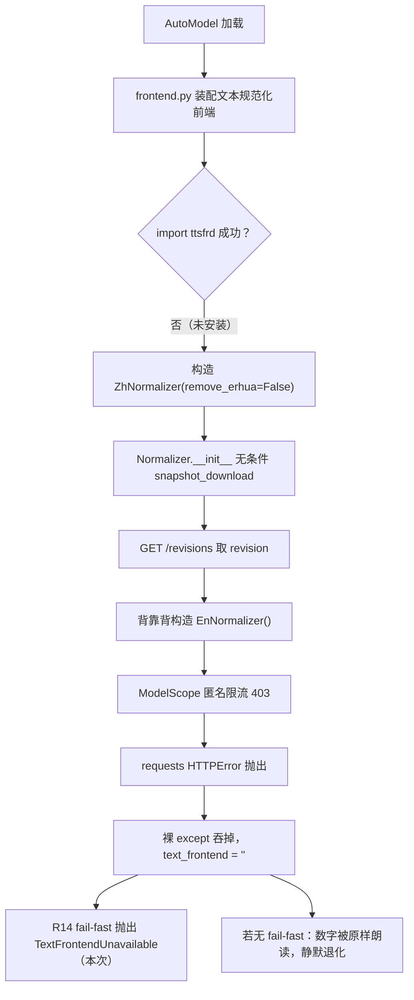
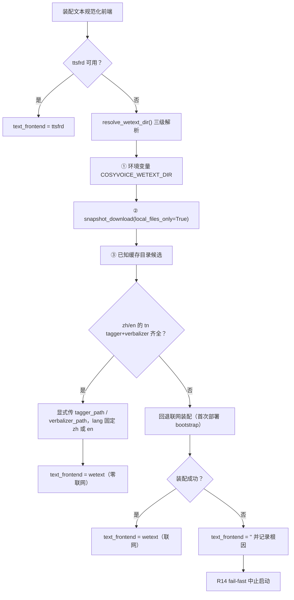
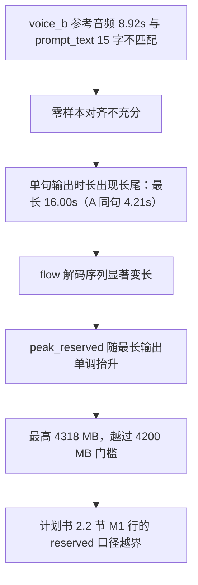

# 双人对话播客自动生成系统 · D4 前置检查报告

| 项 | 内容 |
| --- | --- |
| 文档名称 | 双人对话播客自动生成系统 D4 前置检查报告（DeepSeek 接入就绪性 · 双音色素材闭环 · 文本规范化前端缺陷修复） |
| 文档版本 | V1.0.0 |
| 编制日期 | 2026-09-15 |
| 对应排期 | D4 前置（D4 本体任务见计划书 6.2 节任务清单） |
| 依据文档 | 《双人对话播客自动生成系统项目任务书 V1.0.0》、《双人对话播客自动生成系统_开发计划书_V1.5.0》 |
| 执行结果 | `[PATCH-TN-01]` 单元验证 **PASS**；强制离线端到端回归 **PASS**；双音色区分度成立。另新增 1 项触及验收门槛的风险（见第六章） |
| 代码位置 | `D:\podcast-ai\api\`（服务）、`D:\podcast-ai\CosyVoice\cosyvoice\cli\frontend.py`（`[PATCH-TN-01]`）、`backend\voices\`（音色档案） |
| 证据文件 | `D:\podcast-ai\outputs\d4_voice_check\`（6 份 JSON + 试听音频，清单见附录 A） |

### 版本变更记录

| 版本 | 日期 | 修订说明 |
| --- | --- | --- |
| V1.0.0 | 2026-09-15 | 首次发布。覆盖 DeepSeek Key 复核与模型名映射实测、voice_b 音色建档与双音色生产路径验证、文本规范化前端缺陷（P1）的根因定位与修复验证，以及两项新发现风险（P2/P3）。 |

---

## 一、结论摘要

| # | 检查项 | 依据（计划书条目） | 目标 | 实测 | 判定 |
| --- | --- | --- | --- | --- | --- |
| 1 | DeepSeek Key 可用性 | 计划书 1.4 节 P-3、计划书 9 章 R11 | 可正常调用 | `/models` 与 `/chat/completions` 均 HTTP 200；旧 Key 确为 401 | 阻塞项关闭 |
| 2 | 模型名映射 | 计划书 4.10 节模型表 | 生成走 `deepseek-chat`、备选 `deepseek-reasoner` | **两者均被网关静默映射为 `deepseek-flash`**；已按决策改 `LLM_REASONER_MODEL=deepseek-v4-pro` | 需回填文档 |
| 3 | 音色 B 素材规格 | 计划书 4.4 节 S6 | 5~10 s、16 kHz 单声道、无背景音乐 | 8.92 s、16 kHz 单声道、峰值 −3.35 dBFS 零削波 | 达标 |
| 4 | 音色档案组数 | 计划书 2.2 节 M1 行 | 2 组 | `voice_a` + `voice_b`，代码零改动 | 达标 |
| 5 | 双音色区分度 | 计划书 7.1 节 里程碑 M1 | 双音色样音可稳定合成 | 输出 F0 中位数 242.4 Hz（女）/ 100.0 Hz（男），差 142.4 Hz；说话人映射不回退 | 区分度成立 |
| 6 | 文本规范化前端 | 计划书 4.4 节、计划书 5 章难点 1 | 数字 / 英文正确转写 | 修复后**强制断网仍可起**，5/5 中文 probe 转写生效 | 已修复 |
| 7 | 峰值显存（allocated） | 计划书 2.2 节 M1 行 | ≤ 3600 MB | 3595.2 MB（缓存未命中口径） | 达标 |
| 8 | 峰值显存（reserved） | 计划书 2.2 节 M1 行 | ≤ 4200 MB | **4318 MB**（voice_b 单句输出 16.00 s 时） | **越界 118 MB** |
| 9 | RTF（稳态） | 计划书 2.5 节 | 按实测回填 | 1.03 ~ 1.16（两音色一致量级） | 达标 |

**本次最值得关注的一条**：第 8 项。显存 `reserved` 门槛在**单音色基线**（D3 实测 4000 MB）下余量仅 200 MB，而引入男声 B 后，其单句输出时长可达 A 的 2.4 倍，足以吃掉全部余量并越界。这不是采集噪声，是**慢速音色 + 40 字切句上限**共同决定的系统性结果（第六章）。

**新发现问题清单**

| 编号 | 级别 | 问题 | 状态 |
| --- | --- | --- | --- |
| P1 | 高 | wetext 文本规范化前端**每次启动都可能失效**，且失败被裸 `except` 吞掉，只能靠 R14 fail-fast 暴露 | **已修复**（`[PATCH-TN-01]`），见第五章 |
| P2 | 高 | `voice_b` 输出时长长尾 → 显存 `reserved` 越过 2.2 节 M1 门槛 | 已定位，**处置方案待决策**，见第六章 |
| P3 | 低 | conda 环境 `sensevoice` 已损坏（torch / torchaudio 版本不匹配） | 未修，本案不受影响，见第七章 |

---

## 二、DeepSeek 接入就绪性

### 2.1 Key 可用性（P-3 / R11 关闭）

计划书 1.4 节 P-3 与 9 章 R11 记录的「DeepSeek API Key 无效（D0 实测 401）」是当时**唯一的开发阻塞项**。本轮以新 Key 复核：

| 请求 | 结果 |
| --- | --- |
| `GET /models` | HTTP 200 |
| `POST /chat/completions`（`deepseek-chat`） | HTTP 200，正常返回内容 |

旧 Key 复测确为 401。**P-3 与 R11 可关闭。**

### 2.2 模型名映射实测（重要，易误判）

逐个请求 `.env` 中配置的模型名，读响应体的 `model` 字段核对实际落到哪个模型：

| 请求的模型名 | 响应体实际返回 | 结论 |
| --- | --- | --- |
| `deepseek-chat` | `deepseek-flash` | 被静默替换 |
| `deepseek-reasoner` | `deepseek-flash` | **被静默替换** |
| `deepseek-v4-pro` | `deepseek-v4-pro` | 按请求生效 |
| `deepseek-flash` | `deepseek-flash` | 按请求生效 |

含义是：计划书 4.10 节把 `deepseek-reasoner` 定位为「思考模式，备选」，但在这个 Key 上**它并未走推理链路**，而是静默降级为 flash。这与本项目一直在防的「不声不响降级」是同一类问题——只不过这次发生在上游网关。

**处置（已执行，按用户决策）**：`LLM_MODEL` 保持 `deepseek-chat`（成本优先，走 flash），`LLM_REASONER_MODEL` 改为 `deepseek-v4-pro`，并在 `.env` 内以注释留痕。

> **纪律项**：此后凡涉及「本次用的是哪个模型」的结论，都必须先读响应体 `model` 字段验证映射，不能以配置文件里的名字为准。建议 D4 的 `script_gen.py` 把响应体 `model` 与请求名一起落日志。

### 2.3 配置落地

`D:\podcast-ai\.env` 已更新：新 Key 写入、推理槽改 `deepseek-v4-pro`、映射实测结论以注释留痕。该文件不入库、不进日志、不进前端（符合计划书 10.2 节）。

---

## 三、语音素材与音色档案

### 3.1 素材体检

来源：微信录音 `录音机-20260915-1012.m4a`。

| 项 | 实测 | 计划书 4.4 节 S6 要求 | 判定 |
| --- | --- | --- | --- |
| 源格式 | 48 kHz 立体声 AAC（手机录音） | — | — |
| 转码后 | 16 kHz 单声道 PCM | 16 kHz 单声道 | 达标 |
| 时长 | 8.92 s | 5~10 s | 达标 |
| 峰值电平 | −3.35 dBFS | 无削波 | 达标 |
| 前导静音 | 220 ms | — | 良好 |
| 内部长停顿 | 无 | — | 良好 |
| 有效语音占比 | 96.5% | — | 良好 |
| F0 中位数 | **100 Hz** | 一男一女 | 男声区间 |

F0 落男声区间（85~155 Hz），与 `voice_a`（女声·知性沉稳）构成计划书 4.4 节 S6 要求的「一男一女、风格差异最大化」。

### 3.2 音色档案建档

| 项 | 内容 |
| --- | --- |
| 新增文件 | `backend\voices\voice_b.wav`、`backend\voices\voice_b.json` |
| 代码改动 | **零**。`VoiceRegistry` 自动加载 `*.json`，启动期经 `add_zero_shot_spk` 注册 |
| `prompt_text` | `哈啰你好，请问你是哪个？这里是` |
| 转写来源 | whisper small 初稿（**需人工校正**，见 3.3） |

### 3.3 转写文本的已知缺陷（尚未闭环）

whisper（base 与 small 两种规格结果一致）**只覆盖 0~7.0 s**，而音频实长 8.92 s。对 7.0~8.92 s 段做客观核验：

| 指标 | 尾段（7.0~8.92 s） | 首段（0~7.0 s） | 判断 |
| --- | --- | --- | --- |
| RMS 峰值（7.2 s 处） | 3000 | 同量级 | **确有人声** |
| 过零率 | 829 /s | 628 /s | 浊音特征 |

**结论：尾段确有人声，是 ASR 漏转写，不是静音。** 因此当前 `prompt_text` 的实际覆盖率不足，参考音频与文本**不匹配**——这一点在第六章被证明是输出时长长尾的触发因素。

> **待办（唯一阻塞项）**：请提供该段录音的准确原文。拿到后执行 `make_voice_profile.py --force` 重建档案即可，无需改代码。

### 3.4 客观核验：音色是否真被克隆

以输出音频的基频中位数做客观判据（女声 / 男声应显著分离）：

| 说话人 | 音色档案 | 输出 F0 中位数 | 源素材 F0 |
| --- | --- | --- | --- |
| A | `voice_a`（女声） | 242.4 Hz | — |
| B | `voice_b`（男声） | 100.0 Hz | 100.0 Hz |
| 差异 | — | **142.4 Hz** | 完全一致 |

B 的输出 F0 与源素材**完全一致**，说明音色被准确克隆，而非简单拼接或回退。

---

## 四、双音色生产路径验证

### 4.1 验证口径说明

本次验证刻意使用**生产路径**（`api/services/tts.py` 的 `TTSEngine`），而非 D1 期的 `scripts/smoke_tts.py`（后者走官方示例音色，不读音色档案，无法验证本次改动）。同时全程**把联网入口打桩成抛异常**，以同时证明 P1 修复的离线有效性。

### 4.2 生产路径实测结果

| 检查项 | 结果 |
| --- | --- |
| `text_frontend` | `wetext`（**联网已禁用**的前提下仍然成立） |
| 已注册音色 | `['voice_a', 'voice_b']` |
| 说话人映射 | `A → voice_a`、`B → voice_b`，**未触发回退** |
| 模型 | `CosyVoice2`，加载 20.6 s（含 5.5 s 预热），模型本体 11.0~11.3 s |
| 正文规范化生效性 | `订单编号是 2026，金额 3.5 元，共 12 件。` → `订单编号是两千零二十六，金额三点五元，共十二件。` |

### 4.3 缓存未命中口径的 RTF 与显存

句级缓存会让重复句子的耗时为 0，无法反映真实成本，因此用唯一 `text_hash` 强制未命中重测：

| 口径 | 耗时 | 音频时长 | RTF |
| --- | --- | --- | --- |
| A（33 字） | 7.86 s | 7.60 s | 1.034 |
| B（31 字） | 16.73 s | 15.56 s | 1.075 |
| 均值 | — | — | **1.054** |

**RTF 与 D2/D3 基线（1.037~1.090）同量级，无回归。**

但同一轮的显存结果出现了偏差，成为本次最重要的发现：

| 口径 | peak allocated | peak reserved | 判定 |
| --- | --- | --- | --- |
| 缓存命中（短句为主） | 3448.6 MB | 3946.0 MB | 双口径达标 |
| **缓存未命中（B 输出 15.56 s）** | 3595.2 MB | **4318.0 MB** | **reserved 越界** |

---

## 五、P1 缺陷：wetext 前端启动期间歇性失败

### 5.1 现象

本次验证的**第一次**运行直接以 `TextFrontendUnavailable` 失败——即 R14 fail-fast 拦住了上游的静默降级。日志显示：

```
GET .../pengzhendong/wetext/revisions  200
GET .../pengzhendong/wetext/repo/files?Revision=master&Recursive=True  200
GET .../pengzhendong/wetext/revisions  403
modelscope ERROR - Authentication token does not exist
INFO no frontend is avaliable
```

值得注意的是：**此时 wetext 缓存是完整的**（51.19 MB，`zh`/`en` 的 `tn`+`itn` FST 全在）。也就是说这不是「没下全」，而是**不该联网的地方在联网**。

### 5.2 根因



两个关键事实：

1. **`snapshot_download` 不会在失败时回退到本地缓存。** 实测在缓存完整的情况下，它仍会先请求 `/revisions` 取版本，吃 403 即抛 `requests.exceptions.HTTPError: Authentication token does not exist`。
2. **它是间歇性的，不是「上次好了就没事」。** 本次同一环境内：10:42:38 该请求返回 **403**，33 秒后的 10:43:11 同一请求返回 **200**。缓存未变、环境未变，仅时间不同。

### 5.3 修复：`[PATCH-TN-01]`

修改文件：`D:\podcast-ai\CosyVoice\cosyvoice\cli\frontend.py`（该文件已有项目补丁 `[PATCH-VRAM-01]`，本次沿用同一约定）。

修复策略：**优先用本地 FST 显式装配，彻底绕开下载分支；解析不到才回退联网**，从而既保证稳态离线，又不丢首次部署的 bootstrap 能力。



三处设计要点：

| 要点 | 说明 |
| --- | --- |
| `lang` 由 `auto` 改为固定值 | 走显式路径时 wetext 内部断言要求 `lang` 为 `en`/`zh`。这是**语义等价**的：调用点 `text_normalize()` 本来就按「是否含中文」分支选用 `zh_tn_model` / `en_tn_model`，与 wetext 内部的 `contains_chinese` 用的是**同一个字符区间** `[\u4e00-\u9fff]`。实测 9 组 probe 与 `auto` 路径**逐条 0 差异**（见 5.4） |
| 三级解析而非硬编码路径 | 环境变量可让部署包固化缓存；`local_files_only` 复用 modelscope 自己的缓存解析（实测 **0.00 s** 返回且四个 FST 齐全）；目录候选兜底 |
| 裸 `except` 改为记录根因 | 原实现只打一句 `INFO no frontend is avaliable`，把 403 的真实原因吞掉，是本故障难排查的主因 |

**顺带的正向副作用**：原 `lang="auto"` 的每个 Normalizer 会同时加载 en+zh 两套 FST（约 26 MB），显式路径各加载一套（约 13 MB），启动略快。

### 5.4 验证

**（1）单元级：把联网入口打桩成抛异常，证明「真的离线」**

| 步骤 | 判据 | 结果 |
| --- | --- | --- |
| 0 | `modelscope` 与 `wetext.wetext` 的 `snapshot_download` 均被禁用 | OK |
| 1 | `resolve_wetext_dir()` 仍返回本地目录 | OK |
| 2 | 中文数字规范化**真的生效**（非静默原样返回） | **5 / 5** |
| 3 | 与 `lang="auto"` 原生路径逐条一致 | **0 差异**（zh 5 组 + en 4 组） |
| 4 | 反证：恢复真实下载后原始路径的表现 | 本次 200（证明为间歇性，而非缓存缺失） |

第 2 步的实测样本：

| 输入 | 输出 |
| --- | --- |
| `我有123个苹果` | `我有一百二十三个苹果` |
| `价格是3.5元` | `价格是三点五元` |
| `2026年9月15日` | `二零二六年九月十五日` |
| `第1章共12节` | `第一章共十二节` |
| `2000万的预算` | `两千万的预算` |

**（2）端到端：强制离线下的生产路径复跑**

日志中可见修复后的装配决策：

```
[sabotage] modelscope.snapshot_download 已禁用 -> 任何联网校验都会抛异常
DEBUG [PATCH-TN-01] snapshot_download(local_files_only=True) 未命中: NETWORK-DISABLED-BY-TEST
INFO  [PATCH-TN-01] use wetext frontend (offline, dir=...\hub\pengzhendong\wetext)
INFO  text_frontend=wetext | model=CosyVoice2 | 加载 11.0s
```

结果：`text_frontend=wetext`、已注册 `['voice_a','voice_b']`、A/B 映射不回退、规范化生效、F0 分离 142.4 Hz。**在联网被彻底切断的条件下，整条链路照常工作。**

### 5.5 影响面与残留风险

| 项 | 说明 |
| --- | --- |
| 部署依赖 | 稳态运行**不再需要 ModelScope 可达**；但首次部署仍需抓取一次缓存（或用 `COSYVOICE_WETEXT_DIR` 指向随包固化的目录） |
| 必须保留的防线 | R14 的 `text_frontend != ''` 断言是这条链路**唯一的告警源**。本次正是它把「静默退化」变成了硬失败，不可移除 |
| 缓存不应视为永久 | 模型缓存目录若被清理，会退回联网分支；联网分支仍可能因限流失败（此时会 fail-fast 并有明确日志） |
| 未覆盖分支 | 测试全程打桩，因此 `local_files_only=True` 分支已单独复核（0.00 s 命中）；三级解析中「回退联网装配」分支**未被实测覆盖**，逻辑上等价于修复前的原路径 |

---

## 六、P2 新发现：voice_b 输出时长长尾导致显存越 M1 门槛

### 6.1 现象

在 4.3 的缓存未命中口径下，`peak_reserved` 达到 **4318 MB，超过计划书 2.2 节 M1 行的 4200 MB 门槛**。而同一次测量中 `peak_allocated` 为 3595.2 MB，仍在 3600 MB 门槛内。

需要先明确一点口径：`tts.py` 的 `vram()` 读取的是 `torch.cuda.max_memory_*`，即**进程级高水位**，代码中未调用 `reset_peak_memory_stats`。因此该值反映「本次进程到过的最高点」，一旦越界，本进程后续所有 `check_budget()` 都会判超限。

### 6.2 定位：峰值随「单句输出时长」单调抬升

固定文本长度做扫描（每句 ≤ 40 字，不触发切分）：

| 说话人 | 字数 | 输出音频时长 | 语速 | peak allocated | **peak reserved** |
| --- | --- | --- | --- | --- | --- |
| A | 13 | 3.20 s | 4.06 字/秒 | 3505.0 MB | 3946.0 MB |
| A | 28 | 7.12 s | 3.93 字/秒 | 3512.8 MB | 3982.0 MB |
| B | 13 | **10.08 s** | 1.29 字/秒 | 3570.5 MB | **4176.0 MB** |
| B | 28 | 10.52 s | 2.66 字/秒 | 3599.3 MB | **4182.0 MB** |

**决定性因素是输出音频时长，不是字数。** A 的 13 字只用了 3.20 s，而 B 的同一句用了 10.08 s——**时长差 3.15 倍**，reserved 随之抬高约 230 MB。

### 6.3 关键证据：voice_b 的时长分布极不稳定

用 5 句**等长（20 字）不同文本**分别测 A / B，排除内容长度干扰（缓存未命中口径）：

| 音色 | 主体时长均值 | 极差 | **标准差** | 语速区间 |
| --- | --- | --- | --- | --- |
| A（女声） | 4.03 s | 3.45 ~ 4.44 s | **0.40 s** | 4.5 ~ 5.8 字/秒 |
| B（男声） | 9.64 s | 6.30 ~ **16.00 s** | **3.88 s** | 1.25 ~ 3.17 字/秒 |

- **B 的均值是 A 的 2.39 倍**（同文本）
- **B 的标准差是 A 的 9.7 倍**，存在明显长尾（第 5 句 16.00 s，是 A 同句 4.21 s 的 3.8 倍）
- 该 16.00 s 的长句正是把 `peak_reserved` 推到 **4318 MB** 的那一句

异常时长**不是填充静音**：对 15.56 s 那一段做逐 0.5 s 能量分析，全程连续语音，尾部静音仅 0.57 s。

### 6.4 因果链



### 6.5 对照实验：把参考音频与转写文本对齐

为验证「不匹配」这一环，设计单变量实验：prompt_text 完全相同，仅改变参考音频长度，同一进程内逐句交替合成（n=5）：

| 变体 | 参考音频 | 均值 | 极差 | **标准差** | 语速区间 |
| --- | --- | --- | --- | --- | --- |
| full | 原样 8.92 s（与 15 字文本不匹配） | 8.32 s | 4.44 ~ **15.60 s** | **4.28 s** | 1.28 ~ 4.50 字/秒 |
| cut | 裁到 7.10 s（与 15 字文本对齐） | 6.63 s | 5.76 ~ 7.48 s | **0.67 s** | 2.67 ~ 3.47 字/秒 |

**结论（分两层，均按实测口径）**

1. **已确认**：参考音频与转写文本长度不匹配，是**长尾的触发因素**。对齐后最大值 15.60 s → 7.48 s，标准差收敛 **6.4 倍**，长尾消失。
2. **未确认**：语速本身仍偏慢（cut 版 3.0 字/秒，A 为 5.0 字/秒）。这很可能属于素材固有属性——源录音 8.92 s 对应约 15 字，本身仅约 2.1 字/秒，而零样本克隆会继承参考音频的节奏。**需在拿到准确原文后复测才能定性。**

样本量仅 n=5，上述为**初步结论**，不足以作为最终结论写入验收材料。

### 6.6 处置建议（待决策）

| 方案 | 内容 | 优点 | 代价 |
| --- | --- | --- | --- |
| ① 校正 `prompt_text`（首选） | 用户提供准确原文 → `make_voice_profile.py --force` 重建档案 → 复测时长分布与显存 | 直击根因，同时提升音色相似度 | 依赖原文；需重测并回填基线 |
| ② 收敛切句上限 | 把 `max_chars_per_seg` 由 40 降到约 28，按最慢语速 1.25 字/秒估算，单句上限约 22 s，可显著压低长尾影响 | 纯配置改动，不依赖素材 | 切句变碎，韵律连贯性略降；需重测 RTF 与显存 |
| ③ 固定随机种子 | 在推理前调用 CosyVoice 自带的 `set_all_random_seed`（`cosyvoice/utils/common.py`，当前**全链路从未被调用**） | 让 RTF 与显存基线**可复现**，也使句级缓存语义自洽（同文本应稳定命中同一音频） | 会改变生成结果 → 已落盘的缓存音频失效，D2/D3 基线需重测并回填文档 |

> **补充说明（方案③的动因）**：本次同一句话在不同轮次得到 7.84 s 与 16.00 s 两种结果，说明当前基线**不可复现**。对一份以「RTF / 显存基线」作为交付物的项目而言，这本身构成评审风险——不止是显存问题。

对应到产品侧还有一处外溢影响：`voice_b` 的时长方差会直接放大成片总时长的不确定性，与计划书 2.2 节 M2 行「按主题 / 时长 / 风格生成」中的时长控制目标相关，建议在 D5 后期模块一并考虑。

---

## 七、P3：conda 环境 sensevoice 已损坏

| 项 | 内容 |
| --- | --- |
| 现象 | `D:\anaconda\envs\sensevoice` 中 funasr 无法导入，torchaudio 加载 DLL 失败（`WinError 127`） |
| 原因 | 已装 `torch 2.3.0+cpu` 与 torchaudio 版本不匹配（Windows 上常见） |
| 影响 | **本案不受影响**——本次转写改走 `cosyvoice` 环境自带的 whisper |
| 处置 | 未修。该环境属用户既有资产（同机另有 7 个 conda 环境），**未做任何改动**，以免污染 `medical-llm` / `pai` 等其他项目 |
| 建议 | 若后续要用 SenseVoice 做中文 ASR（识别质量优于 whisper base/small），需在该环境内对齐 torch 与 torchaudio 版本；建议先确认该环境是否还有其他项目在用 |

---

## 八、对上游文档的回填清单

本次检查使若干处已记录的结论失效或需补充。按项目「性能数字一旦口径变化必须回填全部关联文档」的约定，列出待回填项（**本报告未代为修改上游文档**，待确认后统一执行）：

| # | 文档与位置 | 待回填内容 |
| --- | --- | --- |
| 1 | 计划书 1.4 节 P-3、9 章 R11 | DeepSeek Key 已可用，阻塞项关闭 |
| 2 | 计划书 4.10 节模型表、11 章附录 `.env` 模板 | `deepseek-reasoner` 实测被网关映射为 `deepseek-flash`；`LLM_REASONER_MODEL` 已改为 `deepseek-v4-pro`；补一条「模型名以响应体为准」的纪律 |
| 3 | 计划书 4.4 节 S6 | 音色映射 2 组已落地（`voice_a` 女声 / `voice_b` 男声），回填素材实测规格（8.92 s、16 kHz、F0 100 Hz） |
| 4 | 计划书 2.2 节 M1 行、2.5 节显存预算 | 新增「`reserved` 门槛在双音色下存在越界风险」的实测结论与余量分析 |
| 5 | 计划书 11 章附录（部署补丁） | 登记 `[PATCH-TN-01]`，与既有 `[PATCH-VRAM-01]` 并列 |
| 6 | 计划书 1.4 节音色素材说明、计划书 10.1 节授权链路 | `voice_b` 来自用户自录音，需按计划书 10.1 节补齐授权/合规声明 |
| 7 | 计划书 文末「仍待解决的两项」注记 | 其中「① DeepSeek API Key 无效」应改写为已解决；仅保留 `LongPathsEnabled`（P-9） |
| 8 | **D2-D3 实施报告 3.2 节** | 原文记为「D2 双音色因素材未提供而部分达成（1 组档案）」，现应更新为已闭环（2 组） |
| 9 | 计划书 6.2 节 D4 行 | 沿用计划书原文「按 4.10 节接入 `deepseek-chat`」保持不变，但建议补注模型名映射注意事项 |

---

## 九、遗留项与下一步

| 优先级 | 事项 | 依赖 |
| --- | --- | --- |
| P0 | 提供 `voice_b` 参考录音的**准确原文** → 重建档案 → 复测时长分布与显存 | 用户 |
| P0 | 决策 P2 的处置方案（①校正文本 / ②收敛切句 / ③固定种子），并确认是否需重测回填 | 用户 |
| P1 | 执行第八章的回填（计划书 V1.6.0 + D2-D3 报告修订） | 决策后 |
| P1 | D4 本体：`script_gen.py` + 提示词模板 + Pydantic 校验 + 失败重试（计划书 4.10 节、6.2 节） | 可并行启动 |
| P2 | 修 `sensevoice` 环境（如需中文 ASR） | 用户确认该环境归属 |
| P2 | 补「D4 双音色稳定合成」的 MOS 听感评测（计划书 2.2 节 M3 行 MOS ≥ 3.5） | D10 评测人员 |

---

## 附录 A：证据文件清单

全部位于 `D:\podcast-ai\outputs\d4_voice_check\`：

| 文件 | 内容 |
| --- | --- |
| `tn_patch_unit_test.json` | `[PATCH-TN-01]` 单元验证：断网装配、9 组规范化等价比对、原始路径反证 |
| `verify_result_offline_rerun.json` | 强制离线端到端回归：前端状态、注册音色、说话人映射、F0、显存 |
| `d4_fresh_rtf.json` | 缓存未命中口径的真实 RTF / F0 / 显存 |
| `d4_vram_sweep.json` | 显存峰值随输出时长的扫描数据 |
| `d4_duration_probe.json` | voice_a / voice_b 等长文本时长分布采样（n=5×2） |
| `d4_prompt_align_test.json` | 参考音频与转写文本对齐的对照实验（n=5×2） |
| `d4_timing_diag.json` | 输出音频的首尾静音与逐 0.5 s 能量曲线 |
| `_cache_cleanup/` | 本次验证脚本以自定义 `text_hash` 写入生产缓存 `data\cache` 的 52 个测试条目，已**搬移**（非删除）至此并附 `_manifest.json`，可按清单还原。搬移后缓存由 108 个文件恢复为 56 个生产条目 |
| `试听_AB对比.mp3` 等 | A/B 对比与各自单独试听音频 |

引用本报告结论时请以这些 JSON 为准，正文数字均取自其中。

## 附录 B：复现命令

```bash
cd /d/podcast-ai
PY=/d/anaconda/envs/cosyvoice/python.exe

# 1) 离线装配单元验证（内含联网打桩）
PY .../wb_tn_offline_unit.py

# 2) 强制离线端到端回归
PY .../wb_regress_offline.py

# 3) 缓存未命中口径 RTF / 显存
PY .../wb_fresh_rtf.py

# 4) 显存峰值随时间时长扫描
PY .../wb_vram_sweep.py
```

> 全部脚本以 `PYTHONIOENCODING=utf-8` 运行；脚本内含中文，**不要用 `python -c` 内联**（引号嵌套与编码都会出问题），落地为文件再执行。
