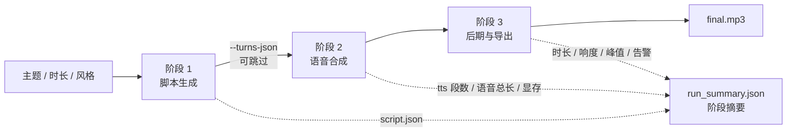
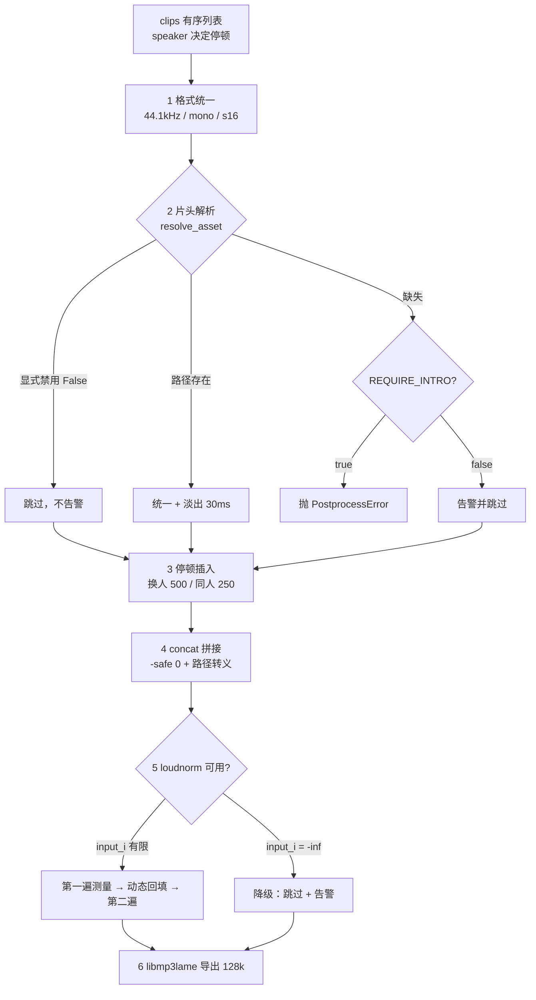
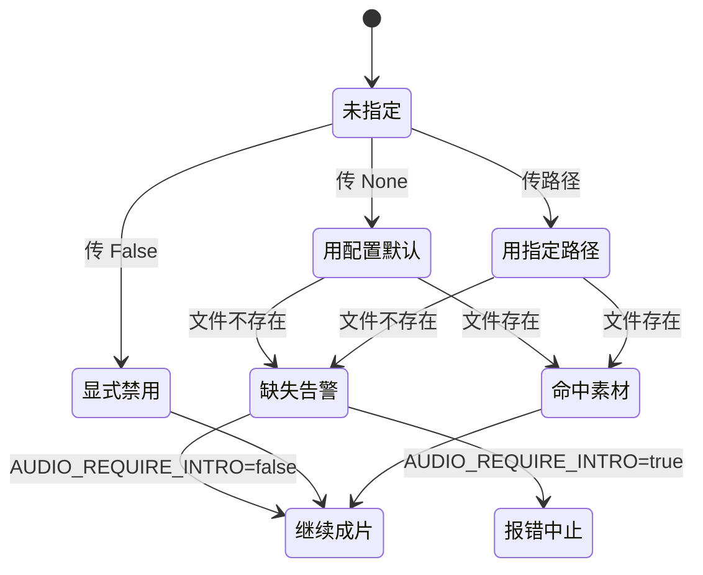

# 双人对话播客自动生成系统 · D5 后期与导出实施报告

| 项 | 内容 |
| --- | --- |
| 文档名称 | 双人对话播客自动生成系统 D5 后期与导出实施报告（FFmpeg 格式统一 · 停顿插入 · 双音色拼接 · 两遍 loudnorm · 片头片尾 · mp3 导出 · CLI 端到端） |
| 文档版本 | V1.0.0 |
| 编制日期 | 2026-09-15 |
| 对应排期 | D5（开发计划书 6.2 日粒度任务清单 D5 行） |
| 里程碑 | 收口 **M2「CLI 端到端产出 mp3」**（开发计划书 7.1 里程碑表 M2 行） |
| 依据文档 | 《双人对话播客自动生成系统项目任务书 V1.0.0》、《双人对话播客自动生成系统_开发计划书_V1.7.0》（本报告产出后回填为 V1.8.0，见第十一章） |
| 代码位置 | `D:\podcast-ai\api\services\postprocess.py`、`D:\podcast-ai\scripts\cli.py`、`D:\podcast-ai\scripts\verify_d5.py`、`D:\podcast-ai\scripts\make_assets.py`、`D:\podcast-ai\backend\assets\`、`D:\podcast-ai\tests\test_postprocess.py`、`D:\podcast-ai\tests\test_cli.py`、`D:\podcast-ai\tests\test_tts_cold_start.py` |
| 证据文件 | `D:\podcast-ai\outputs\d5_verify_result.json`、`D:\podcast-ai\outputs\d5_e2e\`（`run_summary.json`、`script.json`、`d5_e2e.mp3`、`build_d5_e2e\`） |
| 执行结果 | **验收通过**：验收脚本 **27/27 项全过**；CLI 端到端「主题 → mp3」一次跑通（213.04 s，成片 142.55 s / 2.18 MB）；单元测试 **158 项全绿**；期间发现并修复 **1 个阻塞级生产缺陷**（冷引擎批量合成崩溃）与 5 项次级缺陷 |

### 版本变更记录

| 版本 | 日期 | 修订说明 |
| --- | --- | --- |
| V1.0.0 | 2026-09-15 | 首次发布。覆盖 D5 本体全部交付物：`postprocess.py`（格式统一 / 停顿插入 / 拼接 / 两遍 loudnorm / 片头片尾 / mp3 导出）、`cli.py` 端到端入口、`verify_d5.py` 验收脚本、`make_assets.py` 与占位片头片尾、`test_postprocess.py`（51 项）、`test_cli.py`（13 项）、`test_tts_cold_start.py`（3 项）。含 **1 项阻塞级缺陷修复**（`[FIX-COLD-CACHE-01]` 冷引擎 `synthesize_turns()` 必然崩溃）、1 项量纲修正、1 项开发计划书 11.2 节 loudnorm 读值字段的笔误更正，以及 6 条单测「假通过」的根因整改。 |

---

## 一、结论摘要

| # | 检查项 | 依据（计划书条目） | 目标 | 实测 | 判定 |
| --- | --- | --- | --- | --- | --- |
| 1 | CLI 端到端产出 mp3 | 计划书 6.2 节 D5 行 Done、7.1 节 M2 行 | 一条命令：主题 → mp3 | `python scripts/cli.py --topic "…" --duration 2` **一次跑通**，退出码 0，总耗时 **213.04 s** | 达标 |
| 2 | 成片听感连贯、无爆音 | 计划书 6.2 节 D5 行 Done | 无削波 | 峰值 **−1.90 dB**，`clipped=false`；片头尾均含 30 ms 微淡化 | 达标 |
| 3 | 格式统一（R12） | 计划书 9 章难点 11、R12 | 拼接前统一 44.1 kHz / 单声道 / s16 | 混入 16k / 24k / 44.1k 立体声，成片 `mp3 / 44100 Hz / 1 ch`，**时长守恒精确**（2.55 s / 期望 2.55 s） | 达标 |
| 4 | 响度归一 | 计划书 11.2 第 5.4 步 | 两遍 loudnorm，I = −16 LUFS / TP = −1.5 dBTP | P2 实测 **−16.00 LUFS**（目标 −16.0）；端到端 **−20.05 → −16.46 LUFS**；TP 落 −1.50 dBTP | 达标 |
| 5 | 停顿插入 | 计划书 9 章难点 6 | 换人 500 ms / 同人 250 ms | 端到端 26 处停顿时长可**逐项核算**（25×500 ms + 1×250 ms），与成片时长零误差 | 达标 |
| 6 | 片头片尾 | 计划书 1.4 节 P-5、4.x 节 | 素材就位并混入 | `backend/assets/{intro,outro}.mp3` 已就位（2.40 s / 2.20 s，44.1k 单声道）；端到端 `intro_used=true`、`outro_used=true` | 达标（**占位素材**，见第九章） |
| 7 | mp3 导出规格 | 计划书 11.3 节 `AUDIO_MP3_BITRATE` | libmp3lame 128 kbps | `mp3 / 44100 Hz / 1 ch`；实测码率 **131.3 kbps**；端到端成片 2 281 682 B | 达标 |
| 8 | 中间产物可追溯 | 计划书 4.x 节中间产物约定 | 保留 `merged.wav` / `concat_list.txt` / `norm/` | `build_d5_e2e\` 下 5 项齐全，`normalized.wav` 亦保留 | 达标 |
| 9 | 单元测试 | 计划书 8.1 节 | 关键模块用例全绿 | **158 项全绿**（`test_postprocess.py` 51 + `test_cli.py` 13 + `test_tts_cold_start.py` 3 + 既有 91；既有 91 = `test_normalize.py` 40 + `test_script_gen.py` 51） | 达标 |
| 10 | 显存门槛 | 计划书 2.5 节、R16 | allocated ≤ 3.6 GB 且 reserved ≤ 4.2 GB | 峰值 allocated **3548.5 MB** / reserved **4156.0 MB**，双门槛通过（但 reserved 余量仅 44 MB，见第八章） | 达标（余量偏薄） |
| 11 | 错误可读性 | 计划书 8.2 节、难点 8 | 失败给出可照做的提示 | CLI 失败按**阶段归因**（脚本 / 模型加载 / 合成 / 后期），退出码 1，并落盘失败摘要；连接类失败补代理提示（脱敏） | 达标 |
| 12 | 断言失败可复现 | — | 验收脚本可重跑 | `verify_d5.py` 分四段取证（P1 环境 / P2 纯 FFmpeg / P3 真实 TTS / P4 LLM 全链路），P1~P2 无需 GPU，秒级 | 达标 |

**本次最值得关注的一点**：`verify_d5.py` 测的是**后期链路本身**，但真正的坑在它**上游**——首次跑 CLI 端到端时，脚本顺利生成、模型却报「说话人 A 的音色 voice_a 不存在；已加载 []」。根因不在后期、也不在音色档案，而是 `TTSEngine.synthesize_lines()` 的**调用顺序**：循环里先算缓存键（需要已注册音色）再调 `synthesize()`（内部才触发模型加载），**冷引擎上调批量入口必然崩溃**。详见第七章第 1 条。

> **口径诚实声明（请评审注意）**：计划书 1.4 节 P-5 要求「片头 / 片尾 mp3 各 1 段（自产或可商用授权）」。本轮交付的是 `make_assets.py` 生成的**合成音占位素材**（两音上行 / 下行，基频 + 弱八度泛音，两端淡入淡出），**不是人声或音乐**，仅用于打通链路与回归自测。素材文件与 `backend/assets/README.md` 均已显式标注为占位。**正式上线前必须替换**，替换时保持 44.1 kHz / 单声道 / 128 kbps 即可零改动沿用（详见第九章遗留项）。

---

## 二、需求对齐（逐条回比计划书）

D5 的要求分散在计划书四处（计划书 6.2 节 Done 行、计划书 7.1 节 M2 行、计划书 9 章难点 6/11、计划书 11.2 节命令模板），逐条对照如下。

| 序 | 计划书出处 | 原文要求 | 落地情况 |
| --- | --- | --- | --- |
| 1 | 6.2 节 D5 行 Done | **CLI 端到端**：一条命令从主题生成完整 mp3，听感连贯无爆音 | ✅ `scripts/cli.py` 一条命令走完「脚本 → 合成 → 后期 → mp3」；退出码 0；峰值 −1.90 dB |
| 2 | 7.1 节 M2 行 | M2「CLI 端到端产出 mp3」里程碑 | ✅ 本报告为其收口证据，已在开发计划书 V1.8.0 回填 |
| 3 | 9 章难点 6 | 双音色拼接不自然：换人 500 ms、同人 250 ms | ✅ `AUDIO_PAUSE_TURN_MS=500` / `AUDIO_PAUSE_SENTENCE_MS=250`；停顿按相邻 `speaker` 判定 |
| 4 | 9 章难点 11 / R12 | 音频格式不一致导致拼接失败 → 拼接前强制统一 | ✅ `unify()` 统一为 44.1 kHz / 单声道 / `pcm_s16le`；P2 专门用例混入三种采样率 |
| 5 | 计划书 11.2 节第 5.1 步 | 格式统一（分段与片头片尾**各自**先统一） | ✅ 分段统一在 `norm/seg_XXXX.wav`，片头尾统一在 `norm/{intro,outro}.wav` |
| 6 | 计划书 11.2 节第 5.2 步 | 片头片尾 30 ms 微淡化，**必须在拼接之前** | ✅ `apply_fade()` 先跑后入 `seq`；正文首段另加淡入；进度日志显式提示顺序关键 |
| 7 | 计划书 11.2 节第 5.3 步 | 停顿插入（且**末段之后不插**） | ✅ `if i == len(normed) - 1: break`，与计划书示例一致 |
| 8 | 计划书 11.2 节第 5.4 步 | 两遍 loudnorm：先测量再动态回填五个值 | ✅ `measure_loudness()` → `normalize_loudness()`；**但取值字段需更正**，见第七章第 6 条 |
| 9 | 计划书 11.2 节第 5.5 步 | `-c:a libmp3lame -b:a 128k` | ✅ `export_mp3()`；实测 131.3 kbps |
| 10 | 计划书 11.2 节第 6 步 | `length` 必须取**字节数**而非时长 | ✅ `PostprocessResult.size_bytes` 直接来自 `probe()` 的 `format` 字节数 |
| 11 | 4.x 节中间产物约定 | 中间产物落 service 可管理的目录 | ✅ 统一落 `<out_dir>\build_<name>\`，不散落到 cwd |
| 12 | 计划书 1.4 节 P-8 | FFmpeg ≥ 9.0，`loudnorm` / `libmp3lame` 可用 | ✅ P1 逐项断言：9.0.1 full build，5 个滤镜 + libmp3lame 全部可用 |
| 13 | 计划书 1.4 节 P-5 | 片头 / 片尾 mp3 各 1 段 | ⚠️ **占位素材**已就位（合成音，非人声）；替换要求见第九章 |
| 14 | 8.2 节验收清单 | 成片可在浏览器内播放、拖动进度、下载 mp3 | ⏳ 依赖 D6 的 Web 端与静态服务，D5 只保证文件级产物正确 |

---

## 三、实现清单

### 3.1 新增文件

| 文件 | 规模 | 职责 |
| --- | --- | --- |
| `api\services\postprocess.py` | 约 700 行 | FFmpeg / ffprobe 定位与可读错误、`probe` / `unify` / `make_silence` / `apply_fade` / `concat` / `measure_loudness` / `normalize_loudness` / `export_mp3`、`postprocess()` 主编排、`PostprocessResult` 汇总 |
| `scripts\cli.py` | 约 300 行 | 端到端入口：三阶段流水线、`--turns-json` 离线通道、阶段归因的错误处理、`run_summary.json` 落盘 |
| `scripts\verify_d5.py` | 约 330 行 | D5 验收取证（P1~P4 四段），输出 `outputs\d5_verify_result.json` |
| `scripts\make_assets.py` | 约 110 行 | 生成占位片头 / 片尾素材（`--force` 可覆盖） |
| `backend\assets\intro.mp3` / `outro.mp3` | 39 331 B / 36 405 B | 2.40 s / 2.20 s，44.1 kHz 单声道 128 kbps（**占位**） |
| `backend\assets\README.md` | — | 占位声明 + 替换要求 + 相关配置键 |
| `tests\test_postprocess.py` | 51 项 | 后期全链路单测（**仅依赖 FFmpeg，不加载模型**） |
| `tests\test_cli.py` | 13 项 | CLI 文件名规范化、外部脚本读取、参数与退出码 |
| `tests\test_tts_cold_start.py` | 3 项 | 冷启动回归（含**反向用例**，守住 `[FIX-COLD-CACHE-01]`） |
| `tests\fixtures\d5_turns_demo.json` | 10 行 | 离线固定脚本，供 CLI 与验收脚本复现 |

### 3.2 修改文件

| 文件 | 改动 |
| --- | --- |
| `api\config.py` | 补后期配置：`audio_true_peak` / `audio_lra` / `audio_mp3_bitrate` / `audio_normalize` / `audio_loudness_tolerance` / `audio_require_intro` / `ffmpeg_bin` / `ffprobe_bin` / `ffmpeg_timeout` / `intro_path` / `outro_path`，以及 `intro_file` / `outro_file` 路径属性 |
| `.env` / `.env.example` | 同步上述 11 个键（含注释说明） |
| `api\services\tts.py` | `[FIX-COLD-CACHE-01]`：`synthesize_lines()` 开头补 `self.load()` |
| `api\services\script_gen.py` | `[FIX-DEVIATION-01]`：`word_deviation`（比值）与 `word_deviation_pct`（百分数）拆分；`[FIX-PROMPT-01]`：连接失败补脱敏代理提示 |
| `scripts\verify_d4.py` | 适配偏差字段改名（读 `word_deviation`） |
| `tests\test_script_gen.py` | 由 47 项增至 **51 项**：补 `[FIX-DEVIATION-01]` 的「比值与百分数只差 100 倍」锁定用例，以及 `[FIX-PROMPT-01]` 的代理提示（有代理时提示 / 无代理时静默 / 凭据脱敏）用例 |

---

## 四、链路与关键设计决策

### 4.1 端到端三阶段



`--turns-json` 这条旁路是刻意留的：LLM 是最不稳定的一环（网络、额度、限流），
把它摘掉之后，**后期链路的复现与回归不再受上游波动影响**，也是 `verify_d5.py` P3 能秒级可控的前提。

### 4.2 `postprocess()` 六步与两处「决策点」



两个决策点都是**实测逼出来的**，不是预防性设计：

- **片头片尾三态**（`resolve_asset`）：`None` 用配置默认、`False` 显式禁用、路径则覆盖。加这层是因为「传空串」和「漏传」无法区分，而 CLI 的 `--no-intro` 必须与「素材缺失告警」语义分开——前者是调用方意图，不该刷告警（详见第七章第 4 条）。
- **loudnorm 可用性前置判定**：实测 `input_i = -inf` 出现在**输入短于约 0.4 s**以及**纯数字静音（任意时长）**两种情形，此时第二遍必然硬报错。改为「先判可用、不可用则降级 + 告警」，否则「只有一个短句」的成片根本产不出来（`[FIX-LOUDNESS-01]`）。

### 4.3 片头片尾三态与 loudnorm 的字段口径



---

## 五、验收证据（`scripts/verify_d5.py`，27/27 通过）

验收脚本分四段，**P1~P2 不加载模型、无需 GPU**，秒级可复跑；P3 走真实 TTS；P4 复核 LLM 全链路摘要。

### 5.1 P1 环境与素材（9 项）

| 项 | 实测 |
| --- | --- |
| ffmpeg | `9.0.1-full_build`（winget 安装路径经自动发现定位） |
| 滤镜 | `loudnorm` / `concat` / `afade` / `amix` / `volumedetect` 全部可用 |
| 编码器 | `libmp3lame` 可用 |
| 片头 | `intro.mp3` 2.40 s / mp3 / 44100 Hz / 1 ch |
| 片尾 | `outro.mp3` 2.20 s / mp3 / 44100 Hz / 1 ch |

### 5.2 P2 R12 混合格式链路（6 项）

输入为三段正弦音：**16 kHz 单声道 + 24 kHz 单声道 + 44.1 kHz 立体声**，各 0.6 s，显式禁用片头尾。

| 项 | 目标 | 实测 |
| --- | --- | --- |
| 时长守恒 | 3×0.6 + 0.25 + 0.50 = 2.55 s | **2.55 s（零误差）** |
| mp3 规格 | 44.1 kHz / 单声道 | `mp3 / 44100 Hz / 1 ch` |
| 码率 | 接近 128k | 131.3 kbps |
| 无削波 | — | 峰值 −10.40 dB |
| 响度落点 | −16 LUFS ±1 | **−16.00 LUFS** |
| 中间产物 | 齐全 | `merged.wav` / `concat_list.txt` / `normalized.wav` |

> 时长零误差这一项值得单独说：它同时验证了「格式统一不改变时长」「停顿按时长而非样本数插入」「concat 不吞头尾」三件事。若任何一环按错口径处理，误差会立刻显现。

### 5.3 P3 端到端（真实 TTS，不经 LLM，8 项）

固定 10 行脚本 → 真实合成 → 后期 → mp3，CLI 退出码 0，耗时 115.4 s。

| 项 | 实测 |
| --- | --- |
| 成片 | `d5_verify_e2e.mp3`，`mp3 / 44100 Hz / 1 ch` |
| **时长核算** | 成片 **62.50 s** = 语音 53.40 s + 片头尾 4.60 s + 9 处停顿 4.50 s（**精确相等**） |
| 无削波 | 峰值 −1.9 dB |
| 响度 | **−16.66 LUFS**（目标 −16，差 0.66 LU ≤ 1） |
| 片头片尾 | `intro=true`、`outro=true` |
| 分句数 | 10 段（缓存命中 0） |

### 5.4 P4 LLM 全链路复核（4 项）

读 `outputs\d5_e2e\run_summary.json` 核对「主题 → mp3」：

| 项 | 实测 |
| --- | --- |
| 全链路 | `ok=true`，总耗时 213.04 s |
| 脚本 | 26 行，`usable=true`，偏差 **−11.0%**，模型 `deepseek-flash` |
| 成片 | 峰值 −1.9 dB / **−16.46 LUFS**，无削波 |
| 时长 | 142.6 s（27 段语音合计 125.2 s） |

---

## 六、端到端实测（主题 → mp3）

命令：

```
python scripts/cli.py --topic "为什么天空是蓝色的" --duration 2 --style "轻松科普，像朋友聊天"
```

### 6.1 阶段耗时

| 阶段 | 耗时 | 说明 |
| --- | --- | --- |
| 1 脚本生成 | 11.87 s | 3 次请求（1 首发 + 2 纠错轮），tokens 6708 + 2476 = 9184 |
| 2 语音合成 | 183.93 s | 含模型加载 11.5 s + 预热 5.73 s；27 段，语音总长 125.2 s |
| 3 后期与导出 | 16.30 s | 27 段统一 + 55 片段拼接 + 两遍 loudnorm + mp3 导出 |
| **合计** | **213.04 s** | 对应约 3.55 min 成片 |

### 6.2 成片核算（可逐项复算）

| 组成 | 时长 |
| --- | --- |
| 语音（27 段） | 125.20 s |
| 片头 | 2.40 s |
| 片尾 | 2.20 s |
| 停顿：25 处换人 × 500 ms | 12.50 s |
| 停顿：1 处同人 × 250 ms | 0.25 s |
| **合计（预期）** | **142.55 s** |
| **实测成片** | **142.55 s** |

零误差。这一项能成立，前提是「26 行脚本被切成 27 段」这个细节也被算对了——其中一行因逗号被二次切分，切出的两句**同属说话人 A**，因此该处应按句间 250 ms 而非话轮 500 ms 计。若把 26 处停顿一律按 500 ms 算，预期会变成 142.80 s，与实测差 0.25 s。

### 6.3 响度与电平

| 指标 | 值 |
| --- | --- |
| 归一前 | `input_i = -20.05 LUFS`，`input_tp = -0.03 dBTP`，`input_lra = 7.40` |
| 归一后 | `input_i = -16.46 LUFS`，`input_tp = -1.50 dBTP`，`input_lra = 5.20` |
| 落点偏差 | −0.46 LU（目标 −16，允差 ±1，未触发告警） |
| 平滑模式 | `normalization_type = dynamic`（**非 linear**） |
| 成片峰值 | −1.90 dB（`clipped=false`） |

> `dynamic` 而非 `linear` 值得记一笔：归一前真峰值已达 **−0.03 dBTP**，几乎贴满刻度，而目标真峰是 −1.5 dBTP。若强行用线性增益抬到 −16 LUFS（约 +4 dB），真峰会冲到 +4 dBTP 严重超限，因此 ffmpeg 自动退化为动态模式。**这条同时解释了「为什么必须留 true-peak 余量」**：不是保守，是实测合成输出本身就贴顶。

### 6.4 显存

| 指标 | 本次（27 段） | D3 基线（25 句） | 门槛 |
| --- | --- | --- | --- |
| 稳态 allocated | 2506.7 MB | 2442 MB | — |
| 稳态 reserved | 2700.0 MB | — | — |
| 峰值 allocated | **3548.5 MB** | 3516.3 MB | ≤ 3600 MB ✅ |
| 峰值 reserved | **4156.0 MB** | 4000.0 MB | ≤ 4200 MB ✅ |
| 系统占用 | 3834.5 / 6140.5 MB | — | — |

两项门槛均通过，但 **reserved 余量只剩 44 MB**（较 D3 基线抬高 156 MB）。这与 R16「撞顶句 reserved 越限」同源，建议 D10 压测时把 reserved 余量纳入观察项，详见第九章。

### 6.5 上游保护机制的实际触发

本次端到端中，D2-D3 落地的收敛上限保护**真实触发了一次**：

```
[PATCH-GUARD-01] 生成未收敛：15 字文本输出 12.00s（上限 12.00s），第 1/2 次重试
[PATCH-GUARD-01] 第 1 次重试后收敛：4.80s
```

该段总耗时 17.43 s（其余段 2.9~9.0 s），是本次 TTS 最慢的一段。这说明「撞顶句」不是理论风险——它在一次不到 3 分钟的合成里就出现了 1 次（27 段中 1 段，约 3.7%），且保护逻辑能自行恢复。R16 的触发率估计（约 8%）在本轮量级上是一致的。

---

## 七、本轮发现并修复的缺陷

### 7.1 `[FIX-COLD-CACHE-01]` 冷引擎批量合成必然崩溃（**阻塞级**）

| 项 | 内容 |
| --- | --- |
| 现象 | CLI 首次端到端运行，脚本生成成功后报 `说话人 A 的音色 voice_a 不存在；已加载 []` |
| 误导性 | 日志中**完全没有模型加载记录**（无 `text_frontend=`、无 `已注册音色档案`），极易误判为「音色档案缺失」或「路径配错」 |
| 根因 | `synthesize_lines()` 循环里**先**调 `cache_key()`、**再**调 `synthesize()`。`cache_key()` 内部需要已注册的音色（`resolve_speaker()` → `registry.get()`），而触发模型与音色加载的 `self.load()` 只藏在 `synthesize()` 里 —— 于是第一轮就在 `load()` 之前撞上空注册表 |
| 为何此前没暴露 | `scripts\verify_d3.py` 自己先显式调了一次 `load()`，正好把坑盖住；D2-D3 的验证从未在**冷引擎**上直接调批量入口 |
| 修复 | `synthesize_lines()` 开头补 `self.load()`（`synthesize_turns()` 转调它，一并覆盖） |
| 回归 | 新增 `tests\test_tts_cold_start.py`：① 断言 `load` 在第一次 `cache_key` **之前**发生；② 断言 `load` 后注册表非空、A/B 可解析；③ **反向用例**——把 `load()` 换回「不加载注册表」的行为，批量入口必须报错。第三条保证将来有人删掉这行 `self.load()` 时会立刻被挡住 |
| 影响面 | 仅批量入口；`synthesize()` 单句路径本来就正常（它自己会 `load()`） |

### 7.2 `[FIX-DEVIATION-01]` 偏差量纲错 100 倍

| 项 | 内容 |
| --- | --- |
| 现象 | CLI 打印「26 行 / 463 字（目标 520，偏差 **−0.1%**）」，而真实偏差是 **−11.0%** |
| 根因 | `ScriptGenResult.word_deviation_pct` 名为 `_pct` 却返回**比值**（`total_chars / target_words - 1`），被直接按 `%+.1f%%` 打印 |
| 发现方式 | 端到端首次跑通后逐字核对输出，发现比例关系对不上 |
| 修复 | 拆为 `word_deviation`（比值，如 −0.1135）与 `word_deviation_pct`（百分数，如 −11.35）；`to_dict()` 两者都发 |
| 连带 | `verify_d4.py` 的取值改为 `word_deviation`；补单测锁定「两者只差 100 倍」 |
| 历史证据提示 | `outputs\d4_script_gen\verify_result.json` 及 10 份逐题脚本产出于本次修复**之前**，其中的 `word_deviation_pct` 字段实际存的是**比值**（应读作 `word_deviation`）。D4 报告结论不受影响（其数值即比值 ×100，与修复后的百分数字段一致） |

### 7.3 `[FIX-LOUDNESS-01]` loudnorm 短输入 / 静音导致第二遍硬失败

| 项 | 内容 |
| --- | --- |
| 现象 | 素材过短或为纯静音时，第一遍测量得 `input_i = -inf`，第二遍 `measured_I=-inf` 必然报错，整条链路失败 |
| 边界实测 | **0.05 / 0.10 / 0.20 / 0.30 / 0.35 s 均为 `-inf`；0.40 s 起为 −21.75**；另**纯数字静音无论多长**（实测 2.0 s）都为 `-inf` |
| 修复 | 新增 `loudness_usable()` 前置判定：不可用时**降级为跳过响度归一 + 告警**，成片照常产出 |
| 回归 | 两个专门用例（极短输入 / 纯静音）断言「降级且仍出成片」；另有用例断言第二遍收到非有限值时能给出可读错误 |

### 7.4 `[FIX-ASSET-01]` 片头片尾三态语义 + 6 条单测「假通过」

| 项 | 内容 |
| --- | --- |
| 触发 | 生成 `backend/assets/{intro,outro}.mp3` 后，`test_postprocess.py` **6 项集体失败** |
| 本质 | 这 6 项依赖「片头尾素材**不存在**」这一**环境状态**：有的传 `intro=None`（语义是「用配置默认素材」），有的干脆不传。素材一落地，所有时长断言凭空多出 4.6 s，`require_intro` 用例也不再抛错 |
| 定性 | 属**假通过**——测试挂在对环境状态的隐式依赖上，而不是在被测行为上 |
| 修复 | 新增 `no_assets` 夹具（`intro=False, outro=False`），所有「时长守恒」类断言显式禁用片头尾；另补两项：① 显式禁用**不产生**「素材缺失」告警；② 不传参数时**会用上**配置里的默认素材 |
| 附带 | `test_postprocess_require_intro_raises` 原先靠「素材恰好不存在」触发分支，改为传**确定不存在**的路径，不再依赖环境 |

### 7.5 `[FIX-CLI-ERR-01]` CLI 失败时抛裸栈

| 项 | 内容 |
| --- | --- |
| 现象 | LLM 连接失败时，用户看到的是完整 Python 调用栈（含 `httpx` / `httpcore` / `tenacity` 内层），可读的中文错误反而埋在中间 |
| 修复 | 按**阶段**捕获领域异常（脚本 / 模型加载 / 合成 / 后期），输出一行可读错误 + 落盘失败摘要（`run_summary.json` 带 `failed_stage` / `error`），退出码 1 |
| 理由 | 阶段不同，用户要采取的动作完全不同（查 Key/网络 vs 查显存 vs 查 FFmpeg），必须指出卡在哪一步 |

### 7.6 `[FIX-PROMPT-01]` 连接类失败缺代理提示

| 项 | 内容 |
| --- | --- |
| 现象 | 本机默认挂着 `HTTP(S)_PROXY=http://127.0.0.1:63446`。代理进程返回 502 时，SDK 把它包成 `APIConnectionError("Connection error.")`，只看这句话会去查「网线」而不是查代理 |
| 实测背景 | 同一环境下连续两次端到端运行都卡在这一步；而实测该代理 **4/4 成功、平均 0.97 s**，属**间歇性** 502 窗口 |
| 修复 | `_classify()` 在连接类失败时补一句代理提示（含 `NO_PROXY` 绕行建议），代理 URL 做 `//user:pass@` → `//***@` **脱敏**；无代理解变量时不输出该提示 |
| 未做 | **未**擅自放宽重试参数。当前 `LLM_MAX_RETRY=2` 对应的退避窗口约 3 s（1s→2s），确实短于本次观察到的 502 窗口；但这是开发沙箱代理的产物，据此改动生产默认值属过拟合。建议保留 `LLM_MAX_RETRY` 作为现场可调旋钮，详见第九章 |

### 7.7 开发计划书 11.2 节 loudnorm 取值字段笔误

计划书 11.2 节第 5.4 步原文为「读取 `output_i` / `output_tp` / `output_lra` / `output_thresh` / `target_offset` 五个值」，
并按 `measured_I=<output_i>` 回填第二遍。**这是经典误用**：`measured_*` 期望的是**源素材**的测量值，应取第一遍输出的 **`input_*`** 组。

实现（`measure_loudness()` / `loudness_usable()`）一直按 `input_*` 取值，P2 实测落点 **−16.00 LUFS** 印证其正确。
已在开发计划书 V1.8.0 更正该段并加注说明（见第十一章）。

---

## 八、性能口径

### 8.1 RTF 的**正确读法**（务必不要跨行长比较）

| 口径 | 数值 |
| --- | --- |
| 语音合成墙钟（含加载与预热） | 183.93 s |
| 其中：模型加载 | 11.50 s（一次性） |
| 其中：预热合成 | 5.73 s（一次性） |
| **净合成耗时** | **166.70 s** |
| 语音总长 | 125.20 s |
| **净 RTF** | **1.331** |
| 含加载预热的 RTF | 1.469 |

⚠️ **不要拿 1.331 去和 D2-D3 的稳态 1.037 比较**。两者不可比：

| | D3 基线 | 本次 D5 |
| --- | --- | --- |
| 段数 | 25 | 27 |
| 段均文本长度 | 22~28 字 | **约 17.2 字** |
| 段均音频 | 10.96 s | **4.64 s** |
| 净 RTF | 1.037 | 1.331 |
| 每字符净耗时 | — | **0.360 s/字** |

原因：合成存在**每段的固定开销**（分词、解码器初始化、vocoder 启动），行长越短，这份固定开销摊到的音频越少，RTF 就越高。本次行均 17.2 字（D4 脚本的实测行长恰为 12~21 字，见 D4 实施报告第五章），比 D3 的测试句短得多。

**结论**：RTF 是**行长相关**量，不是常数。跨报告引用时必须连同「段均行长」一起给出，否则会得出互相矛盾的容量结论——这与 D2-D3 报告中「冷启动 / 稳态必须分列」是同一类纪律。

### 8.2 1000 字端到端推算

按本次实测（行均 17.2 字、段均 4.64 s 音频、净 6.17 s/段）外推 1000 字脚本：

| 组成 | 推算 |
| --- | --- |
| 段数 | 约 58 段 |
| 语音总长 | 约 267 s |
| 净合成 | 约 358 s（约 5.97 min） |
| 模型加载 + 预热 | 17.2 s |
| 后期（按 142.55 s 音频耗 16.3 s 等比例） | 约 30 s |
| LLM 脚本（3 次请求） | 约 12~25 s |
| **合计** | **约 7.0~7.3 min** |

仍满足计划书 M4「1000 字端到端 ≤ 10 分钟」的目标，但**比 D2-D3 推算的 5.4~6.2 min 高约 20%**，原因同样是行均长度差异（D3 推算隐含每段更长）。建议 D10 正式压测时以**真实脚本行均长度**为准，不用测试句的 RTF 外推。

### 8.3 后期链路自身开销

| 输入音频时长 | 后期耗时 | 占比 |
| --- | --- | --- |
| 2.55 s（P2） | 约 1 s | — |
| 62.50 s（P3） | 约 8 s | — |
| 142.55 s（端到端） | 16.30 s | 11.4% |

后期耗时随音频长度近似线性，相对合成耗时占比约 10%，**不是瓶颈**。这也印证 D4 报告「句级缓存已降级为常规优化项」的判断——真正的耗时在合成侧。

---

## 九、遗留项

| # | 项 | 性质 | 建议 |
| --- | --- | --- | --- |
| 1 | **片头 / 片尾为合成音占位素材** | 交付完整性 | 必须有真人声或可商用授权素材替换；规格保持 44.1 kHz / 单声道 / 128 kbps 可零改动沿用。已在 `backend\assets\README.md` 显式标注 |
| 2 | **`voice_a` 仍是 3.48 s 官方示例占位** | 交付完整性 | 「真人双音色」的唯一缺口。`voice_b`（男声）已闭环；`voice_a` 待用户提供 5~10 s 录音后建档复测 |
| 3 | **合成输出真峰值已达 −0.03 dBTP** | 音质风险 | 归一前几乎贴满刻度。建议 D10 观察是否需在合成侧加余量（如输出后先 `volume=-3dB`），或维持依赖 loudnorm 的动态模式兜底 |
| 4 | **峰值 reserved 4156 MB，余量仅 44 MB** | 显存风险（R16） | 与 D3 基线的 4000 MB 相比抬高 156 MB。建议将 reserved 余量纳入 D10 压测观察项，并按 R16 既定方案评估是否落实透传补丁 |
| 5 | **LLM 重试窗口约 3 s，短于实测代理 502 窗口** | 健壮性 | 未改动默认值（避免过拟合开发沙箱）。现场若遇间歇性连接失败，可临时提高 `LLM_MAX_RETRY`；若要改默认值，应先在真实网络下统计失败窗口分布 |
| 6 | **超过 2677 字的主题无法单次生成** | 能力边界（D4 遗留） | 容量天花板来自 `LLM_MAX_TOKENS=4096`。8 分钟以上主题需先做**分段生成 + 拼接**，与 D5 的后期链路正交，建议在 D5~D9 之间插入 |
| 7 | **`voice_b` 提示文本长于部分短句** | 音质风险 | CosyVoice 会告警 `too short than prompt text`（零样本参考音频的固有特性）。若听感可接受则不必处理；否则需在切句侧避免产生过短句 |
| 8 | **片头片尾仅做 30 ms 微淡化，无交叉淡化** | 设计边界 | 计划书 11.2 已注明「`acrossfade` 会重叠 d 秒音频，语音内容禁用」。当前片头尾是纯音乐/占位音，如后续换成语音类素材需重新评估 |

---

## 十、可复现命令

```bash
# 1. 生成 / 刷新占位片头片尾素材
python scripts/make_assets.py --force

# 2. 单元测试（158 项，不占显存）
python -m pytest tests/ -q

# 3. D5 验收（27 项；P1~P2 秒级，P3 约 2 分钟）
python scripts/verify_d5.py

# 4. 端到端：主题 → mp3
python scripts/cli.py --topic "为什么天空是蓝色的" --duration 2 --style "轻松科普，像朋友聊天"

# 5. 只用已有脚本复现后期（跳过 LLM）
python scripts/cli.py --turns-json tests/fixtures/d5_turns_demo.json --out outputs/manual

# 6. 排障：只出脚本，不做合成与后期
python scripts/cli.py --topic "任意主题" --no-tts
```

---

## 十一、回填清单（开发计划书 V1.7.0 → V1.8.0）

| # | 计划书位置 | 回填内容 |
| --- | --- | --- |
| 1 | 文首元信息 + 版本变更记录 | 升版 V1.8.0，登记本次全部改动 |
| 2 | 6.2 节 D5 行 | Done 列回填实测结论与证据文件 |
| 3 | 7.1 节里程碑表 M2 行 | 标记 M2 收口 |
| 4 | 7.2 节任务清单 5 行 | 注明 D5 部分已完成 |
| 5 | 8.2 节验收清单 | 勾掉已达成项，标注 Web 端部分待 D6 |
| 6 | 9 章难点 6 / 难点 11 | 补实测数字（停顿零误差、R12 时长守恒精确） |
| 7 | **计划书 11.2 节第 5.4 步** | **更正 loudnorm 取值字段 `output_*` → `input_*`**，并说明理由 |
| 8 | 计划书 11.3 节配置模板 | 补登记后期相关 11 个键（含 `INTRO_PATH` / `OUTRO_PATH` / `FFMPEG_BIN`） |
| 9 | 计划书 1.4 节 P-5 | 状态更新为「占位素材已就位，待替换正式素材」 |
| 10 | 计划书 1.4 节 P-8 | 状态更新为「已就位并经 D5 逐项断言复核」 |
| 11 | 9 章风险登记表 | 新增 R18（片头尾为占位素材 / voice_a 未替换）、R19（LLM 重试窗口短于环境代理故障窗口） |
| 12 | 计划书 2.4 / 2.5 节 | 补 D5 实测显存与后期耗时占比；reserved 余量观察提示 |
| 13 | 文末版本演进提示 | 追加本次发现（冷引擎阻塞缺陷、RTF 行长相关性、loudnorm 字段笔误） |
| 14 | 8.1 节测试清单 | 登记 158 项（新增 `test_postprocess.py` 51 / `test_cli.py` 13 / `test_tts_cold_start.py` 3） |

---

## 附录 A · 证据文件清单

| 路径 | 内容 |
| --- | --- |
| `outputs\d5_verify_result.json` | 验收脚本完整结果（含 27 项逐项明细） |
| `outputs\d5_e2e\run_summary.json` | 端到端三阶段摘要（脚本 / 合成 / 后期） |
| `outputs\d5_e2e\script.json` | LLM 脚本生成明细（含 tokens 与模型映射） |
| `outputs\d5_e2e\d5_e2e.mp3` | 成片：142.55 s / 2 281 682 B |
| `outputs\d5_e2e\build_d5_e2e\` | 中间产物：`merged.wav` / `normalized.wav` / `concat_list.txt` / `normalize` 停音 |
| `data\work\d5_verify\mixed\out\` | P2 混合格式链路产物 |
| `data\work\d5_verify\e2e\` | P3 真实 TTS 链路产物 |

---

**文档结束** | 版本 V1.0.0 | 编制日期 2026-09-15

> **配套文档**：《双人对话播客自动生成系统_开发计划书_V1.8.0》（本报告产出后回填）、《双人对话播客自动生成系统 D4 脚本生成服务实施报告 V1.0.0》（上游依赖）。
