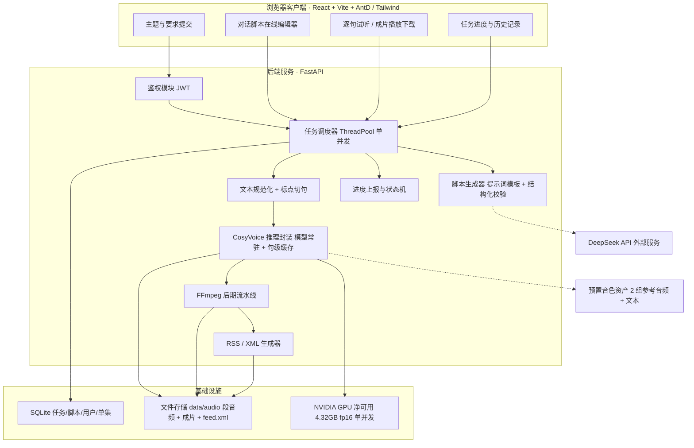
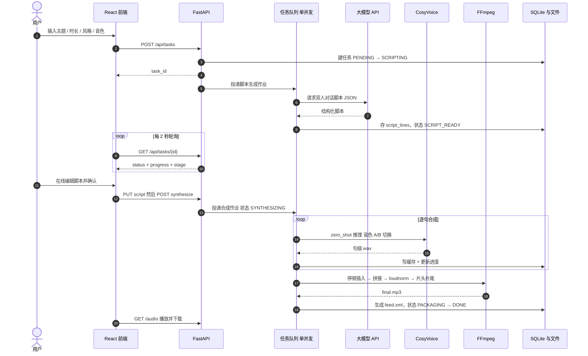
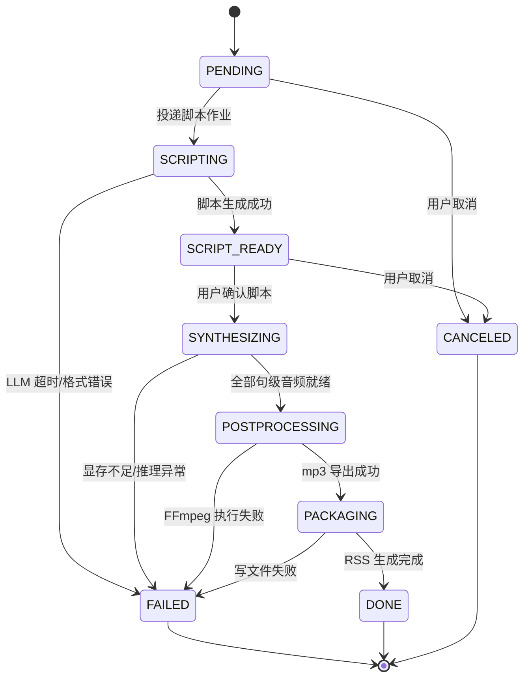
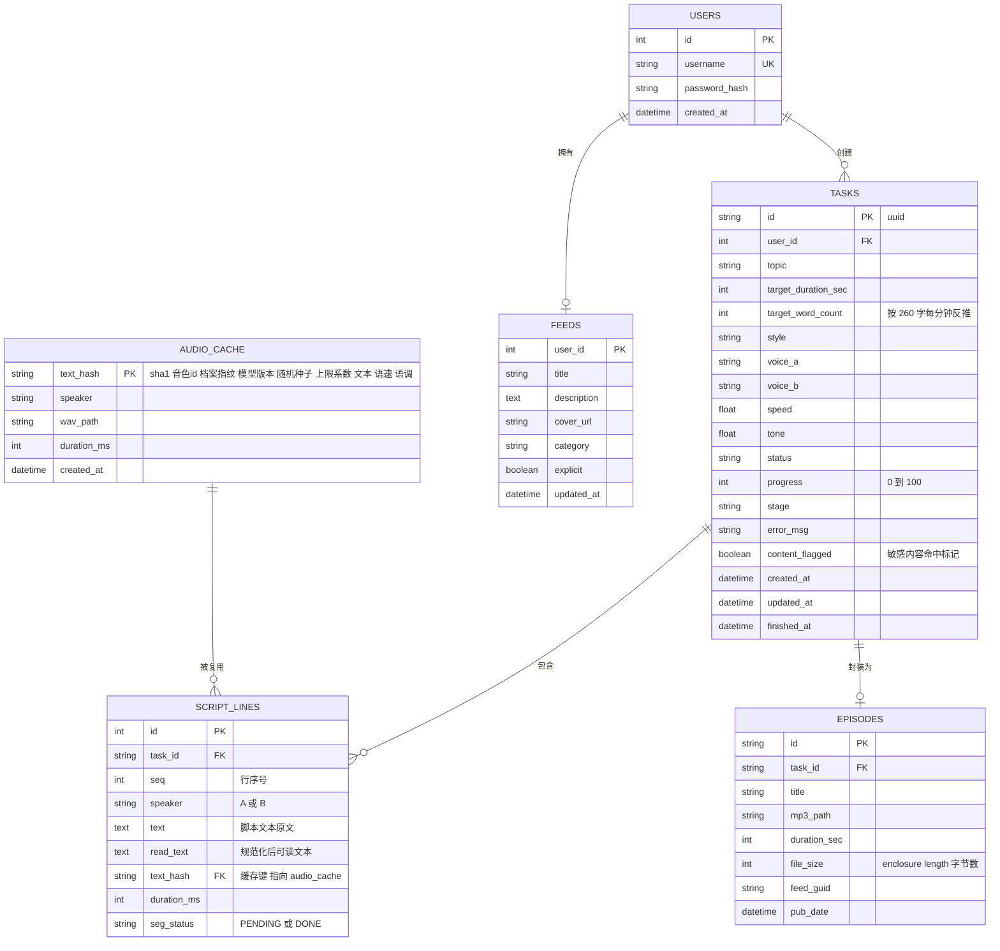
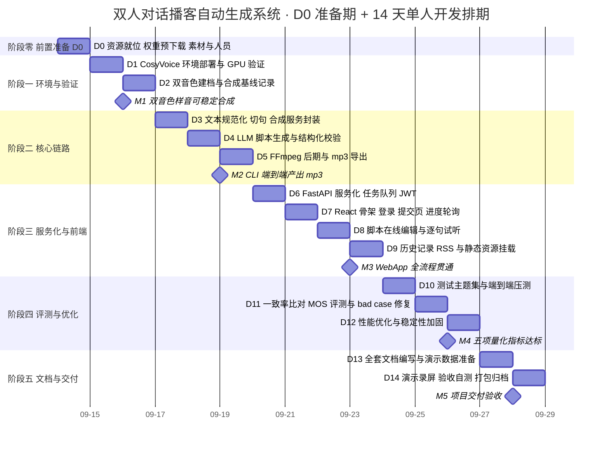

# 双人对话播客自动生成系统 · 开发计划书

| 项 | 内容 |
| --- | --- |
| 文档名称 | 双人对话播客自动生成系统 开发计划书 |
| 文档版本 | V1.9.0 |
| 编制日期 | 2026-09-16 |
| 依据文档 | 《双人对话播客自动生成系统项目任务书 V1.0.0》 |
| 细分技术方向 | 语音合成 + 内容生成 |
| 核心参考 | CosyVoice（FunAudioLLM）https://github.com/FunAudioLLM/CosyVoice |
| 大模型 | DeepSeek API（`deepseek-chat` / OpenAI 兼容协议）。⚠️ **模型名以响应体为准**——实测**该 Key 下 `deepseek-chat` 与 `deepseek-reasoner` 均被网关静默映射为 `deepseek-flash`**（D4 全量复现，见 4.10 节①） |
| **算力约束** | **NVIDIA RTX 4050 Laptop，总显存 6141 MiB；净可用随桌面负载浮动，D0 实测 4424 MiB / D1 实测 5072 MiB，设计口径取保守值 4.32 GB（硬约束，非推荐值）**；**D2 A/B 已定稿主模型 CosyVoice2-0.5B（CosyVoice3 峰值 4338/5306 MB 双口径超限，见 2.5.2）**；**D5 端到端实测峰值 allocated 3548.5 / reserved 4156.0 MB——双口径达标，但 reserved 余量仅 44 MB（见 2.5.4）** |
| 运行环境 | Windows 原生 + conda 独立环境（`cosyvoice`，Python 3.10.21）；项目根 `D:\podcast-ai` |
| 排期口径 | D0 准备期 + D1~D14 开发期（单人全栈，2026-09-14 起） |
| 适用对象 | 项目负责人 / 开发 / 测试 / 评审 |

### 版本变更记录

| 版本 | 日期 | 修订说明 |
| --- | --- | --- |
| V1.0.0 | 2026-09-14 | 首版，依据任务书 V1.0.0 编制 |
| V1.1.0 | 2026-09-14 | 评审修订：修正音频处理命令错误与格式统一缺失、修复 ER 唯一键冲突、补全媒体鉴权方案；新增 D0 准备期与前置资源清单、时长↔字数换算口径、RSS 字段规范；对齐交付物完成日；调整排期与风险评级 |
| V1.2.0 | 2026-09-14 | **约束落地修订**：① 算力基线由「显存 ≥ 8 GB」改为**硬上限 6 GB**，新增 2.5 节显存预算表与第 5 章难点 12（6 GB 专项调优），架构图/流水线/测试/风险同步改写；② 大模型接入由泛化的「OpenAI 兼容端点」明确为 **DeepSeek 官方 API**，新增 4.10 节接入规范（模型选择、JSON 输出、缓存、限流、成本核算、Key 管理），`.env` 与依赖清单同步；③ **因 6 GB 档位算力下降，修正性能结论**：2.4 节耗时改为 RTF 区间估算，R4 由「低」回改为「中高」，新增 R13 端到端超时风险，并把「云端 TTS 兜底通道」由 P2 提升为 P1 |
| V1.2.1 | 2026-09-14 | **启动前终检修正**：① 修复**任务书指定技术栈未覆盖**——任务书 4.1 明确「UI组件库 = TailwindCSS / Ant Design」，而 V1.2.0 的 4.1/R7/6.2 D7 已把「只用 AntD、砍掉 Tailwind」写成既定事实且未声明，现恢复为**双库分工（AntD 承载交互组件 + Tailwind 承载布局样式）为基线**，砍 Tailwind 降级为须显式声明记录的条件性收紧；② 修复 **11.2 音频命令链路断裂**——拼接引用的是未淡化文件，`intro_faded.wav` 从未进入成片（淡化等于白做），且缺 500 ms 话轮静音段，已重排为「统一格式 → 静音段 → 微淡化 → 拼接 → loudnorm → 导出」并补齐两种停顿；③ 修正 2.5 节显存预算**算术不一致**（明细加总 4.4~4.8 GB，原文误写 4.4~5.4 GB）；④ 补齐**中间产物目录约定** `data/work/{task_id}/` 及 `.env` 的 `WORK_DIR` / 云端 TTS 兜底 / `TTS_RTF_WARN_THRESHOLD` 配置项；⑤ 消除 4 处一致性问题：8.2「60 s 生成」与 4.10 超时口径冲突、8.1 回填表名指向错误、第 5 章难点表末尾缺空行（会被渲染成 setext 标题）、任务 1 完成日前移至 D0 |
| V1.3.0 | 2026-09-14 | **D0 实测落地修订**：① 算力口径由「显存总量 6 GB」改为「**净可用 4.32 GB**」——实测总显存 6141 MiB、其他进程已占 1497 MiB，2.3/2.5 节显存预算按此重算，硬门槛由「峰值 ≤ 5.5 GB」下调为 **≤ 3.8 GB**；② 环境选型落地为 **Windows 原生 + conda `cosyvoice` 环境（Python 3.10.21）**，并显式声明「因上游硬约束向下偏离任务书 3.12+」；③ 删除已过时的 `pynini` / `WeTextProcessing` 安装步骤（**已核实当前 main 分支推理链路改用 `wetext`**，pip 直装），并补充 `Matcha-TTS` 为必需依赖；④ 新增 **onnxruntime 走 CPU** 以卸载约 1 GB 显存；⑤ 模型选型改为「**CosyVoice2-0.5B 为主、Fun-CosyVoice3-0.5B 为 D2 A/B 候选**」；⑥ 补入 D0 网络实测结论（HuggingFace 不可达、GitHub 极慢、ModelScope 大文件 20 MB/s）与项目根路径约束 |
| V1.4.0 | 2026-09-14 | **D1 实测回填与论断更正**（冒烟测试通过，`SMOKE_EXIT=0`）：① **2.3/2.5 节回填真实基线**——模型加载 23.0 s、常驻 allocated 2442 MB、**RTF 实测 1.775**、**峰值 allocated 3512 MB / reserved 3978 MB**；② **更正显存门槛口径与取值**——原「峰值 ≤ 3.6 GB（allocated）/ 4.2 GB（reserved）」未区分 allocated/reserved，且实测 reserved 3978 MB 已超出该值。改为**双口径**：主判据 `max_memory_allocated ≤ 3.6 GB`（实测 3512 MB 达标）+ 辅助 `max_memory_reserved ≤ 4.2 GB`（实测 3978 MB 达标）；③ **更正 `expandable_segments` 措施无效**——Windows 上 PyTorch 实测报 `expandable_segments not supported on this platform`，2.5 节「碎片余量由它缓解」不成立，改由 `empty_cache()` + 单并发承担；④ **更正 RTF 预估值**——2.4 节原估「6 GB 档位 RTF 约 2~3」偏高，实测 1.775；⑤ **修正 R13 触发判据**——由「RTF > 1.5 即启云端兜底」改为**按端到端 10 分钟总耗时判据**，实测 1000 字 ≈ 405 s 合成 + 60~90 s 生成 + 20~40 s 后期 = **8.1~8.9 min，达标但余量仅 1.1~1.9 min**；⑥ **更正「音色档案是最大速度杠杆」的判断**——实测 3 句仅省 1.53 s（**4.4%**），主要耗时在 LLM 自回归 + flow 迭代，不在 prompt 特征计算；⑦ **新增 R14：文本规范化链路**——`wetext` 的 FST 模型需从 ModelScope 拉取 `pengzhendong/wetext`，实测**首次被限流（403 / `操作过于频繁`）**；关键在于 CosyVoice 对导入失败**静默降级**（`text_normalize` 原样返回、不报错），直接威胁 M3「逐句一致率 100%」。**当日已用带退避重试解决**（第 7 次成功，规范化验证通过），R14 由「阻塞」降级为「需启动期 fail-fast 防护」；⑧ 依赖清单补齐 **`pyworld==0.3.5` / `lightning==2.2.4` / `setuptools<81`** 三项（旧版误删，详见 11.1 与 11.2） |
| V1.5.0 | 2026-09-15 | **D2/D3 实测回填与两处论断更正**（A/B 与合成服务均跑通，`AB3_EXIT=0` / `D3B_EXIT=0`）：① **2.5 A/B 定稿主模型**——新增 2.5.2，用同文本同音色实测 CosyVoice2 与 CosyVoice3：CV2 峰值 allocated 3513 / reserved 4024 MB（双口径达标，RTF 1.037），CV3 峰值 4338 / 5306 MB（**双口径超限**，常驻即多占 868 MB，系统级只剩 1.47 GB）→ **定稿 CosyVoice2-0.5B**，CV3 降级为 V2.0 候选。② **修正 RTF 口径与结论（V1.5.0 最重要的一处）**——V1.4.0 的 **1.775 是冷启动值**（首次读 1.93 GB `llm.pt` 的磁盘页缓存未命中 + `wetext` 未就绪），**稳态实测 1.037~1.090**（D2 复测两次 1.049/1.037，D3 端到端 25 句 1.090），两者相差约 40%；由此 2.4 节端到端推算由「8.1~8.9 min，余量仅 1.1~1.9 min」更正为「**5.4~6.2 min，余量 3.8~4.6 min**」，R4 由「中」下调为「低」。**并立下口径纪律：报告 RTF 必须标注冷启动/稳态。**③ **D3 合成服务封装完成**——`normalize.py` + `tts.py` 落地：547 字 → 24 行 → 25 分段（最长 40 字、字符守恒），逐句落盘；句级缓存命中 1.0 ms；**连续 25 句稳态显存波动 0.0 MB**；40 项 pytest 全绿。④ **新增 R15：CosyVoice3 显存超限**，与难点 13「模型版本间 `prompt_text` 语义差异」（CV3 必须带 `endofprompt` 专用标记，否则断言失败且错误呈级联假象；精确写法见难点 13 表后代码块）。⑤ **音色 B 缺素材**：零样本合成必须提供「干净人声 + 其转写文本」，本期决定**先用单音色跑通**（`SPEAKER_FALLBACK_ENABLED` 显式回退并告警），M1 的双音色样例相应延后。⑥ 依赖与环境：新增 `SPEAKER_*_VOICE` 说话人映射与 `.gitignore`（`.env` 含真实 Key，此前无忽略规则）。 |
| V1.6.0 | 2026-09-15 | **D4 前置检查回填 + 两处实测更正（依据 `D4前置检查报告_V1.2.0`）**：① **DeepSeek Key 阻塞项关闭**——新 Key 实测 200，1.4 节 P-3 与 R11 同步改写；并补入**模型名映射纪律**（`deepseek-reasoner` 被网关静默映射为 `deepseek-flash`，`LLM_REASONER_MODEL` 改 `deepseek-v4-pro`，模型名一律以响应体为准）。② **双音色闭环**——`voice_b` 已按用户第 2 版录音（8.148 s，裁尾静音后 6.70 s）建档，音色映射恢复 2 组，M1 的「两个音色各 3 条样例」恢复可交付。③ **更正「reserved 越界」的成因与判定**——删除「源于参考音频与文本不匹配」的表述，改为「**源于生成未收敛时解码到长度上限**」（20 字句恰好 16.00 s = 400 token ÷ 25 Hz）；并**进一步更正 V1.1.0 的「依赖守卫即达标」**：单句隔离实测撞顶句 reserved 达 **4212 MB（超 4200 门槛）**，**收敛守卫救得回音频、救不回显存峰值**，该项列为**唯一未闭环指标**。④ **固定随机种子落地（用户决策）**——`[PATCH-SEED-01]`：推理链路三处随机源（LLM 多项式采样 / flow 先验噪声 / 声码器噪声）统一由 `set_all_random_seed` 覆盖，实测**同文本 3 次合成波形逐位一致**；据此 2.3 节补入「基线可复现性」口径，并声明 **V1.5.0 及之前的 RTF/显存基线不可复现**。⑤ **更正「下调 `max_token_text_ratio`」的可行性**——实测 `AutoModel.inference_zero_shot` 签名无该参数、上游 `Qwen2LM.inference` 为硬编码默认 20，改配置只让守卫阈值变成假值；新增 `[PATCH-GUARD-02]` 启动期一致性 fail-fast。⑥ **补丁登记表**——新增 11.6 节，登记 `[PATCH-VRAM-01]`/`[PATCH-TN-01]`/`[PATCH-GUARD-01]`/`[PATCH-GUARD-02]`/`[PATCH-CACHE-01]`/`[PATCH-CACHE-02]`/`[PATCH-SEED-01]` 七项。⑦ **更正 11.3 节 `.env` 模板 3 处与代码不符的键名**（`TTS_VRAM_BUDGET_MB`→双口径、`TTS_ONNX_PROVIDER`→`COSYVOICE_ONNX_DEVICE`、`TTS_RTF_WARN_THRESHOLD`→`TTS_E2E_WARN_MIN`），并补守卫 5 项、种子 2 项、说话人映射 3 项。⑧ **4.6 节 `audio_cache.text_hash` 键公式补全**为 8 个维度（含音色档案指纹、随机种子、生成长度上限系数）。⑨ 新增 R16（撞顶句显存越限）。 |
| V1.7.0 | 2026-09-15 | **D4 本体实施回填（依据《D4 脚本生成服务实施报告 V1.0.0》）**：① **D4 完成并验收通过**——10 主题抽测 **10/10 可用**（Done ≥ 8/10），字数配额 9/10（中位偏差 −6.8%），错误路径 4/4 可读，新增单测 47 项（合计 **87 项全绿**）；交付物为 `config.py`（+19 项配置）、`schemas.py`、`script_gen.py`、3 份提示词、74 词敏感词库、`verify_d4.py`。② **一处有意的口径调整（须评审注意）**——4.10 ③ 原把「总字数落在配额 ±10%」列为硬性校验项，现**降为「驱动重试但不判可用性」**：三轮提示词标定（共 30 次生成）证明模型每行稳定在 12~21 字符且**不随提示词变化**，总字数系统性偏低，作硬判据会让可用率恒为 0~70%；已配开关 `SCRIPT_WORD_QUOTA_ENFORCE`（默认 false，置 true 即恢复原口径），并新增 **R17**（模型无法稳定控制总字数）。③ **新增生成侧容量上限**——单次调用约 **2677 字 ≈ 10.3 分钟**（`LLM_MAX_TOKENS=4096`、实测 1.53 token/字），恰压在 10 分钟指标上；**8 分钟以上主题须分段生成**，见 2.4 节末。④ **更正 4.10 ⑥ 成本估算**——输入侧实测每主题 **5034 tokens**，约为原估的 3.4 倍（系统提示词每轮重发 + 纠错轮回显）。⑤ **更正 5 章难点 8**——「字数失控」的处置边界落为实测结论（提示词无法把偏差压进 ±10%，须靠扩写或分段生成）。⑥ **补登记 11.3 节 `.env` 模板**的脚本生成 9 项键，并**修掉一处 V1.6.0 回填残留**（模板仍写 `LLM_REASONER_MODEL=deepseek-reasoner`，与 4.10 ① 及实际 `.env` 的 `deepseek-v4-pro` 不符）。⑦ **D4 前置检查报告 11 章**中「D4 本体……可启动」更新为已完成。 |
| V1.8.0 | 2026-09-15 | **D5 后期与导出实施回填（依据《D5 后期与导出实施报告 V1.0.0》），M2 收口**：① **D5 完成**——CLI 一条命令「主题 → mp3」一次跑通（**213.04 s**，成片 **142.55 s / 2 281 682 B**），验收脚本 **27/27 全过**，单元测试 **158 项全绿**；交付物为 `postprocess.py`（格式统一 / 停顿插入 / 拼接 / 两遍 loudnorm / 片头尾 / mp3 导出）、`cli.py` 端到端入口、`verify_d5.py`、`make_assets.py`、占位片头尾素材与 3 个新测试文件。② **更正 11.2 节第 5.4 步的 loudnorm 取值字段（重要）**——原文按 `measured_I=<output_i>` 回填第二遍，**这是经典误用**：`measured_*` 期望的是**源素材**的测量值，应取第一遍输出的 **`input_i` / `input_tp` / `input_lra` / `input_thresh` / `target_offset`** 组；实现一直按 `input_*` 取值，P2 实测落点 **−16.00 LUFS** 印证其正确。③ **新增 R18**（片头尾为占位素材 / `voice_a` 未替换）——两者均为「真人双音色」交付完整性的缺口，音频规格固定 44.1 kHz / 单声道 / 128 kbps，替换时零改动。④ **新增 R19**（LLM 重试窗口短于环境代理故障窗口）——本机代理存在**间歇性 502 窗口**（代理本身实测 4/4 成功），`LLM_MAX_RETRY=2` 的退避窗口约 3 s 短于该窗口；**未擅自放宽**（属开发沙箱产物，改生产默认值即过拟合），保留为现场可调旋钮。⑤ **补 D5 实测显存与后期占比**——峰值 allocated **3548.5** / reserved **4156.0 MB**（**reserved 余量仅 44 MB，R16 关注项**）；后期占端到端约 **11.4%**，非瓶颈。⑥ **RTF 口径再补一条纪律**——**RTF 是行长相关量**：D5 行均 17.2 字 → 净 RTF **1.331**，与 D2-D3 行均 22~28 字的 1.037 **不可直接比较**；跨报告引用必须连同「段均行长」一起给出（与「冷启动 / 稳态必须分列」同类）。⑦ **补登记 11.3 节 `.env` 模板的后期 11 键**（`AUDIO_TRUE_PEAK` / `AUDIO_LRA` / `AUDIO_MP3_BITRATE` / `AUDIO_NORMALIZE` / `AUDIO_LOUDNESS_TOLERANCE` / `AUDIO_REQUIRE_INTRO` / `INTRO_PATH` / `OUTRO_PATH` / `FFMPEG_BIN` / `FFPROBE_BIN` / `FFMPEG_TIMEOUT`）。⑧ **登记本轮 2 处生产缺陷与 1 处文档笔误**——`[FIX-COLD-CACHE-01]` 冷引擎批量合成必然崩溃（**阻塞级**，`synthesize_lines()` 需先 `load()` 再算缓存键）、`[FIX-DEVIATION-01]` 偏差量纲错 100 倍（`word_deviation` 与 `word_deviation_pct` 拆分）、`[FIX-LOUDNESS-01]` loudnorm 短输入 / 静音降级。⑨ **8.1 节测试清单更新为 158 项**（新增 `test_postprocess.py` 51 / `test_cli.py` 13 / `test_tts_cold_start.py` 3；`test_script_gen.py` 由 47 增至 51）。 |
| V1.9.0 | 2026-09-16 | **音质专项：`voice_a` 女声换档与音质根因定位（依据《D5 后期与导出实施报告 V1.1.0》第十二章）**：① **`voice_a` 换档闭环**——用户 2026-09-16 提供真人录音 `life.m4a` 并确认为**女声**，据此替换 D2 的 CosyVoice 官方 3.48 s 示例占位；新档 5.461 s、源录音 F0 中位数 **175.8 Hz**（旧档 264.5 Hz）、指纹 `0167f63730b6 → 1834ef0d7038`，旧档完整归档于 `backend/voices/_archive/20260916_093656_voice_a/` 可回滚。端到端重跑 **235.49 s**，成片 **169.48 s / 2 712 598 B**，女声段 SNR **36.3 → 40.6 dB（+4.2 dB）**，同句 A/B 最优一例 **+10.6 dB**。② **新增 R20**（男声 `voice_b` 参考录音底噪被零样本克隆复制）——男声段 SNR 27~29 dB，与女声差约 **11 dB**；根因已定位到参考录音本身，**事后降噪一律更差**（`afftdn` 使输出底噪反升 0.3~2.7 dB；`anlmdn` 同理；`arnndn` 本机无模型），**唯一有效解法是重录参考**（干净录音可把输出底噪压到 −58 dBFS）。经用户裁决「男声先用着当前的，之后再换」，本轮**未改动 `voice_b`**。③ **R18 收窄**——「真人双音色」缺口只剩**片头 / 片尾占位素材**一项，`voice_a` 已闭环。④ **新增两条反直觉的实测纪律（须带入后续所有音色工作）**——**「参考录音裁掉首尾静音不等于更好」**：A/B 双探针一致显示**不裁**比裁低 **8.2 dB** 间隙底噪 / 高 **6.9 dB** SNR，且两者语音电平只差约 1 dB（排除量纲假象）；**「对参考录音做频谱降噪会让克隆结果变差」**。两条均已固化进 `scripts/make_voice_profile.py` 文件头对照表。⑤ **新增 F0 口径纪律**——同一素材在不同取帧口径下可差约 **20 Hz**（新档 175.8 / 193.9~195.1 Hz 两法皆有记录），**引用 F0 必须带口径**，勿把不同口径的数字混用。⑥ **登记 3 个工具/产物缺陷与 1 个对照实验陷阱**——`[FIX-DRYRUN-01]`（`--dry-run` 被「档案已存在」前置校验挡住）、`[FIX-ARCHIVE-01]`（重跑产生冗余归档并打出误导性的「指纹未变」）、`[FIX-SCRIPTOUT-01]`（`script.json` 不含正文 → 一轮端到端跑完后无法用 `--turns-json` 自复现）、以及**音色目录只放单个档案时全部说话人静默回退**（两版对照会合成出完全相同的音频，须用音频字节哈希而非 `cached` 标志判定）。⑦ **8.1 节测试清单更新为 162 项**（新增 `test_make_voice_profile.py` 3 项 + `test_cli.py` 增至 14 项）。⑧ **`.env` 无新增键**（本轮未引入新配置项）。 |


---

## 目录

1. [项目概述](#1-项目概述)
2. [建设目标与验收指标](#2-建设目标与验收指标)
3. [范围界定与优先级裁剪](#3-范围界定与优先级裁剪)
4. [技术方案设计](#4-技术方案设计)
5. [关键技术难点与解决方案](#5-关键技术难点与解决方案)
6. [开发排期（D0 + D1~D14）](#6-开发排期d0--d1d14)
7. [里程碑与交付物清单](#7-里程碑与交付物清单)
8. [质量保障与测试方案](#8-质量保障与测试方案)
9. [风险登记册](#9-风险登记册)
10. [合规、安全与隐私](#10-合规安全与隐私)
11. [附录](#11-附录)

---

## 1. 项目概述

### 1.1 项目建设内容

基于阿里 FunAudioLLM 开源的 **CosyVoice** 语音合成框架，构建一套 **B/S 架构的双人对话播客自动生成 WebApp**。用户输入播客主题、目标时长与风格要求后，系统完成以下全链路自动化：

```text
输入主题 → DeepSeek 生成双人对话脚本 → 人工可编辑确认 → CosyVoice 双音色逐句合成
        → FFmpeg 停顿插入/拼接/响度归一/片头片尾 → mp3 成片 + RSS 订阅文件
```

### 1.2 与任务书的对应关系

| 任务书章节 | 本计划书对应章节 |
| --- | --- |
| 一、项目背景与意义 | 1.3 建设价值（继承任务书论述，不重复展开） |
| 二、项目目标（总体 + 6 个具体目标） | 2. 建设目标与验收指标 |
| 三、技术方案（架构 / 核心技术 / 算法流程） | 4. 技术方案设计 |
| 四、项目任务分解（10 项） | 7. 里程碑与交付物清单 |
| 五、预期输出 | 7.2 交付物清单 |
| 六、注意事项 | 10. 合规、安全与隐私 |

### 1.3 建设价值

- **业务价值**：把「写稿—录制—剪辑」的多环节人工流程压缩为「输入主题—成片下载」，单期节目制作周期从数天缩短到分钟级。
- **技术价值**：打通「大模型内容生成 + 开源语音模型本地化推理 + 音频后期 + Web 集成」的复合工程范式。
- **社会价值**：为视障人群、通勤群体提供可听的对话式知识内容，降低个人创作者与教育机构的音频内容生产成本。

### 1.4 前置资源与依赖清单（D0 准备期必须落实）

本项目的工期风险主要不在编码，而在**前置资源是否到位**。以下 6 项必须在 D0 当日逐项确认，任一项缺失都会直接击穿排期：

| # | 前置项 | 具体要求 | 未就位的后果 | 责任人 |
| --- | --- | --- | --- | --- |
| P-1 | **GPU 开发机** | **已实测**：NVIDIA RTX 4050 Laptop（compute_cap 8.9），总显存 6141 MiB，驱动 591.74，CUDA 可用。⚠️ **关注口径是「净可用」而非「总量」**：桌面合成跑在独显上，其他进程已占 1497 MiB，**净可用仅 4424 MiB（4.32 GB）** | 净可用 < 4.0 GB 时模型侧预算放不下（详见 2.5），M1 无法达成 | 项目负责人 |
| P-2 | 运行环境 | **已就绪**：Windows 原生 + conda 独立环境 `cosyvoice`（`D:\anaconda\envs\cosyvoice`，**Python 3.10.21**）；**不使用 WSL2**（已核实 Windows 原生可行）。⚠️ Python 3.10 **向下偏离任务书「3.12+」**，属上游硬约束，已按 3.1 节原则显式声明 | 版本口径未声明会在评审时被判为未覆盖 | 开发 |
| P-3 | **DeepSeek API Key** | `platform.deepseek.com` 申请的有效 Key；账户**已充值且额度充足**（压测需消耗）；Key 仅落 `.env`，禁止入库与前端暴露。接入规范见 4.10 节。✅ **D4 前置已关闭（V1.6.0）**：D0 曾返回 HTTP 401（旧 Key 在服务端不存在），**重新签发后实测 `/models` 与 `/chat/completions` 均 200**，阻塞项解除。⚠️ 同时发现**模型名会被网关静默映射**（见 4.10 节①），故 `LLM_REASONER_MODEL` 已由 `deepseek-reasoner` 改为 `deepseek-v4-pro` | ~~M2 模块无法开发，D4 空转~~ **已解除** | 项目负责人 |
| P-4 | 模型权重预下载 | ModelScope 通道（**HuggingFace 实测不可达**）：主选 `iic/CosyVoice2-0.5B`（**已定稿**），备选 `FunAudioLLM/Fun-CosyVoice3-0.5B-2512`（**已出局，仅存档**，见 R15）。**按需下载，跳过非必需文件**（`llm.rl.pt` / `flow.decoder.estimator.fp32.onnx` / `*.batch.onnx`）可省约 4.3 GB。实测大文件带宽约 **20 MB/s**，全量下载约 10 分钟 | D1 大量时间消耗在下载而非验证 | 开发 |
| P-5 | 音频素材 | 片头 / 片尾 mp3 各 1 段（自产或可商用授权，**提前转码为 44.1 kHz 单声道 128 kbps**）。⏳ **V1.8.0 状态：占位素材已就位，待替换正式素材**——`backend/assets/{intro,outro}.mp3` 为 `make_assets.py` 生成的**合成音占位件**（2.40 s / 2.20 s），已在 `backend/assets/README.md` 显式标注非人声、非音乐，并写明替换规格（44.1 kHz / 单声道 / 128 kbps，可零改动沿用）。**未替换前不得对外发布成片**，见 R18。**V1.9.0 更新：本项范围已收窄为「仅片头 / 片尾」**——音色素材缺口已闭环（`voice_a` 已于 2026-09-16 换为用户真人录音，男声参考待重录见 R20） | 后期模块无法完成（占位件已解除阻塞；正式素材缺失仅影响交付完整性） | 开发 |
| P-6 | MOS 评测人员 | 提前约定 3~5 名评测人，明确 D10 出音频、D11 出分的时间窗 | 指标无法按 D11 交付，M4 延后 | 项目负责人 |
| P-7 | **项目根路径** | **必须为纯英文短路径**：`D:\podcast-ai`。原工作区路径含中文与空格（`D:\新建文件夹\...`），叠加 CosyVoice 较深的依赖树与 **`LongPathsEnabled = 0`**，`pip install` 阶段易撞 MAX_PATH | 依赖安装随机失败，排查成本极高 | 开发 |
| P-8 | **音频处理工具链** | **已就绪并经 D5 逐项断言复核**：FFmpeg 9.0.1 full build（`loudnorm` / `acrossfade` / `afade` / `libmp3lame` 均可用），已注册用户 PATH。✅ **V1.8.0**：D5 验收脚本 P1 段对该工具链做了 9 项断言（version / 三个滤镜 / `libmp3lame` 编码器 / 片头尾素材可读/时长/采样率/声道），**9/9 PASS**；`postprocess.py` 的 `find_ffmpeg()` 另支持 PATH → winget 安装目录 → 显式配置（`FFMPEG_BIN`）三级定位，定位失败即抛 `FFmpegNotFound` 而非静默 | 后期模块全部功能不可用 | 开发 |
| P-9 | **系统权限项** | `LongPathsEnabled=1` 需管理员权限（HKLM 写入被拒，未完成）；git 侧 `core.longpaths=true` 已配置为缓解措施 | 极端深层路径下仍可能报错 | 项目负责人 |

> 另需确认 2 组**预置音色参考音频**的来源与授权（时长 5~10 s、16 kHz 单声道、无背景音乐）。本项目**不采集真人声音**，素材来自公开可商用音色库或自有录制，授权链路见 10.1 节。
>
> ✅ **音色素材状态（V1.9.0 更新）**：2 组**均为自有录制**——`voice_a`（女声，**用户 2026-09-16 提供 `life.m4a`**，5.461 s / 16 kHz 单声道 / 源录音 F0 中位数 175.8 Hz）与 `voice_b`（男声，用户自录音第 2 版，8.148 s / 16 kHz 单声道 / F0 111.9 Hz）。**`voice_a` 已不再是占位素材**（原 D2 的 CosyVoice 官方 3.48 s 示例已归档于 `backend/voices/_archive/20260916_093656_voice_a/`）。⚠️ 两组均需按 10.1 节补齐授权/合规声明（见该节）。⚠️ `voice_b` 参考录音底噪偏高（源 SNR 无可测静音段），克隆后男声段 SNR 27~29 dB，见 R20。

---

## 2. 建设目标与验收指标

### 2.1 总体目标

交付一个可在主流浏览器（Chrome / Firefox / Safari / Edge 最新两个版本）运行的双人对话播客自动生成 Web 应用，实现「主题输入 → 成片音频 + RSS 订阅文件」的端到端闭环，并附带环境部署手册、提示词模板、合成服务代码与完整项目文档。

### 2.2 六大功能模块与量化验收指标

指标全部取自任务书，作为**验收硬门槛**：

| # | 模块 | 功能要求 | 量化验收指标 |
| --- | --- | --- | --- |
| M1 | 开源环境部署模块 | CosyVoice 框架与预训练模型本地部署，管理 2 种风格差异明显的预置音色 | 输出环境配置手册；记录显存占用与合成速度（RTF）基线；**峰值显存 ≤ 3.6 GB（allocated）/ 4.2 GB（reserved）**；⚠️ **基线必须可复现**（V1.6.0 新增口径：须固定随机种子，见 2.3 节末） |
| M2 | 对话脚本生成模块 | 按主题 / 时长 / 风格生成双人对话脚本，内置角色人设与节奏字数控制模板，Web 端可人工编辑，含敏感内容过滤 | **脚本一次生成人工可用率 ≥ 80%**（D4 抽测 **10/10 = 100%**；「允许纠错轮」与「零纠错」两种判定口径的差异见 4.10 ③ 与 ⑨）；⚠️ **单次生成的容量上限约 2677 字 ≈ 10.3 分钟**（`LLM_MAX_TOKENS=4096` 折算），超此长度须分段生成，见 2.4 节末 |
| M3 | 语音合成模块 | 文本规范化（多音字 / 数字 / 英文 / 专有名词）、逐句切分、**双音色按说话人切换**（V1.6.0：2 组档案已就位）、语速语调可调 | **合成文本与脚本文本逐句一致率 = 100%**；**MOS 自然度 ≥ 3.5 / 5** |
| M4 | 音频后期与封装模块 | FFmpeg 句间停顿插入、双音色拼接、响度均衡归一、片头片尾混入，导出 mp3；生成符合 RSS 规范的订阅 XML | **1000 字脚本端到端耗时 ≤ 10 分钟（净可用 4.32 GB GPU + fp16 + 单句 40 字，模型已预热；前提为实测 RTF ≤ 1.5，见 2.4 与 R13）**；**显存峰值 ≤ 3.6 GB（allocated）/ 4.2 GB（reserved）**（⚠️ reserved 口径的残留风险见 R16） |
| M5 | Web 界面模块 | 主题与要求输入、脚本在线编辑、逐句试听（按说话人区分音色）、成片播放与下载 | 全部功能在 PC 端浏览器可用，无阻塞性缺陷 |
| M6 | 用户与历史记录模块 | 用户注册登录、任务进度展示、历史成片与脚本查询回放 | 任务状态可追踪，历史记录可回放且可重新下载 |

### 2.3 环境基线（D0 实测值，D2 回填性能列）

本项目算力为**既定约束且已实测**：NVIDIA RTX 4050 Laptop，**总显存 6141 MiB，净可用随桌面负载浮动**（D0 实测 4424 MiB，其他进程占 1497 MiB；D1 实测 5072 MiB，其他进程占 1068 MiB）。

> **口径纪律（V1.4.0 补强）**：净可用是**动态量**，随桌面合成、浏览器、启动器等占用波动，两次实测相差 648 MiB。因此设计口径**一律取保守值 4.32 GB**（即 D0 的较紧情形），实测告警用**实时**净可用值判断。这不是「推荐配置」，而是必须在此上限内跑通的设计前提——精度、模型选型、单句长度、并发数全部按**净可用 4.32 GB** 反向约束。

> ⚠️ **口径修正（V1.3.0 最重要的一处）**：V1.2.x 以「显存总量 6 GB」立论。D0 实测发现**桌面合成跑在独显上**（`nvidia-smi` 显示 `Disp.A = On`），其他进程已占 1497 MiB，净可用仅 4424 MiB。**继续用「总量」做设计口径必然 OOM**，因此本章及 2.5 全部改以「净可用」为准。

| 项 | 基线（净可用 4.32 GB 约束下） | D0 实测值 |
| --- | --- | --- |
| GPU | NVIDIA，**净可用显存为唯一有效口径** | RTX 4050 Laptop（compute_cap 8.9），总 6141 MiB / 占用 1497 MiB / **净可用 4424 MiB**；驱动 591.74，WDDM |
| 运行环境 | **Windows 原生 + conda 独立环境**（不使用 WSL2） | conda env `cosyvoice`，Python **3.10.21**，位于 `D:\anaconda\envs\cosyvoice` |
| 项目根路径 | 纯英文短路径 | `D:\podcast-ai` |
| PyTorch | CUDA wheel，支持 fp16 | **torch / torchaudio 2.3.1+cu121**（适配 sm_89） |
| 模型选型 | **已定稿 CosyVoice2-0.5B**（显存占用更低、Windows 先例多、支持 fp16 JIT 编码器；D2 A/B 实测峰值 3513/4024 MB 双口径达标）；**Fun-CosyVoice3-0.5B 已出局**（指标更好，但 flow 权重为 2 倍，实测峰值 4338/5306 MB **双超门槛**），降为 V2.0 候选 | 两套权重均按需下载就位；D2 已用同一批文本实测并定稿见 2.5.2 |
| 推理精度 | **fp16 强制**（`--fp16`），禁止 fp32 推理 | **D1 实测已生效**（`AutoModel(fp16=True)`） |
| onnx 组件 | **`onnxruntime`（CPU 版）承载 campplus 与 speech tokenizer**——实测可把约 1 GB 的 onnx 缓冲区完全移出显存 | 依赖清单仅含 `onnxruntime`，不装 `onnxruntime-gpu` |
| 显存使用目标 | **双口径门槛**：主判据 `max_memory_allocated` **≤ 3.6 GB**；辅助判据 `max_memory_reserved` **≤ 4.2 GB**（后者占保守净可用 4.32 GB 的 97%，是真正的风险边界），预算明细见 2.5 | **D1 实测 allocated 3512 MB（达标）/ reserved 3978 MB（达标，占净可用 4424 MiB 的 90%）**。<br>⚠️ **V1.6.0 补充**：上述为**收敛样本**口径。**撞顶句**（生成未收敛、解码到长度上限）单句隔离实测 **reserved 4212 MB，越限 12 MB**；allocated 仍达标（3548 MB）。撞顶率实测约 8%（1/12），成因与处置见 R16 |
| 并发数 | **1（强制）**——`ThreadPoolExecutor(max_workers=1)` + 代码层显存互斥锁 | — |
| 单句长度上限 | **40 字**（净可用仅 4.32 GB，直接取 V1.2.x 的降级档，不先跑 60 字） | D1 验证 |
| 单句合成耗时 | **按 RTF 实测回填**，不预设固定秒数；参考区间见 2.4 | **D1 实测 9.94 / 9.96 / 12.97 s**（对应 22 / 26 / 28 字句，24 kHz 输出，音色档案路径），均值 **10.96 s/句**；**D4 固定种子后 12 句实测 4.78~16.51 s**（17~26 字） |
| 文本归一化 | **`wetext` 优先**（pip 直装，纯 Python）；`ttsfrd` 与 `pynini` 均**不需要**（见难点 1） | ⚠️ **D1 实测：首次不可用，退避重试后可用**。`wetext.Normalizer` 会 `snapshot_download("pengzhendong/wetext")` 拉取 tagger/verbalizer `.fst`，匿名请求先被 ModelScope 限流（403 / `操作过于频繁，请稍后再试`），**第 7 次重试下载成功**，验证通过（`2026年`→`二零二六年`、`45%的人`→`百分之四十五的人`）。**但失败时 CosyVoice 会静默退化**（`text_frontend` 置空 → `text_normalize` 原样返回，不报错），故 D3 起必须**启动期预热 + fail-fast 断言**，并把模型缓存随项目固化。风险登记为 **R14（已降级）** |
| 降级顺序 | ① 关闭桌面壁纸/Overlay 等独显占用 → ② 单句 40→30 字 → ③ 关闭流式/批处理 → ④ 云端 TTS API 兜底（已列 P1） → ⑤ CPU 推理（仅功能演示，不可用于验收） | — |
| 模型加载耗时 | 冷启动一次性，不计入 RTF；**必须以「进程内单例 + lifespan 预热」摊薄** | **D1 实测 23.0 s**（读 llm.pt 1.93 GB + flow.pt 430 MB + hift.pt 80 MB + Qwen2 编码器 942 MB）；温启动 8.0~12.5 s |
| 常驻显存（加载后） | 决定并发上限 | **D1 实测 allocated 2442 MB / reserved 2642 MB** |
| **RTF（实时率）** | 端到端性能的核心输入，决定 10 分钟指标能否达成 | **D1 实测 1.775**（冷启动，朴素路径 1.773 / 音色档案路径 1.775）；**D2/D3 稳态实测 1.037~1.090**；**D4 固定种子后 12 句（17~26 字、A/B 混排）实测 1.005~1.165，均值 1.09**。⚠️ **口径纪律：必须标注冷启动/稳态；且含守卫重试的句子须单列**——D4 撞顶句含重试的实际 RTF 为 3.73，混入均值会把整批抬到 1.319 |
| 音色档案收益 | V1.3.0 曾判断 `add_zero_shot_spk` 是「最大的速度杠杆」 | ⚠️ **D1 实测仅省 1.53 s / 3 句 = 4.4%**（注册一次性 0.37 s）——**该判断被推翻**：耗时主体在 LLM 自回归生成与 flow 迭代，prompt 特征计算（fbank + mel + whisper log-mel + ONNX）占比极小。音色档案仍有价值（工程上更干净、避免逐句重算），但**不能当作性能达标的主要手段**；**D2 A/B 复测再次确认**（CV2 −7.7% / CV3 +9.7%，正负号不一致，属噪声） |

> **口径纪律（V1.6.0 新增）：基线必须可复现。** 上述 D1~D3 的 RTF 与显存数字**均不可逐位复现**——全链路当时**未固定随机种子**，同一句话在不同轮次会得到不同 token 序列，进而改变时长与峰值。V1.6.0 已按用户决策固定种子（`TTS_RANDOM_SEED=42`，见 11.6 节 `[PATCH-SEED-01]`），实测**同文本 3 次合成波形逐位一致**，自此「同输入 → 同输出」成立。
>
> 引用 D1~D3 数字时须注意：它们是**当时口径下的观测值**，可用于量级判断，但**不可作为比对基准**。可复现基线见 2.5.3。
>
> **方差口径（易混）**：固定种子后，「同文本重复合成」的方差恒为 **0**（逐位一致）；而「跨不同文本」的时长离散（D4 实测 std 0.687 s）反映的是**内容差异**（字数、语义停顿），**不是随机性**。二者不可混用——V1.4.0/V1.5.0 中「std 0.45~0.72 s」表征随机性抖动的用法已作废。

### 2.4 内容量口径与耗时估算（按 RTF 计算，**V1.2.0 修正**）

任务书同时出现两个口径——**用户输入的目标时长**（内容量）与**验收用的 1000 字**（性能基准），二者不可混用。换算规则：

**换算规则**：中文双人对谈语速取 **260 字/分钟**（区间 240~280），脚本总字数 = 目标时长（分钟）× 260，允许 ±10% 偏差。此规则写入提示词模板，由 LLM 按配额分配每轮发言字数。

耗时不用「单句固定 1.5 s」估算（该假设基于 8 GB+ 且算力较强的卡，**在 6 GB 档位不成立**），改用 **RTF（实时率，Real-Time Factor）= 合成耗时 ÷ 音频时长** 表达，并给出乐观/保守两个档：

| 目标时长 | 脚本字数（≈260 字/分） | 成片音频时长 | 合成耗时 @RTF 0.8（乐观） | 合成耗时 @RTF 2.0（保守） |
| --- | --- | --- | --- | --- |
| 3 分钟 | 780 字 | 180 s | 约 2.4 min | 约 6.0 min |
| 5 分钟 | 1300 字 | 300 s | 约 4.0 min | 约 10.0 min |
| 10 分钟 | 2600 字 | 600 s | 约 8.0 min | 约 20.0 min |
| 15 分钟（压测上限） | 3900 字 | 900 s | 约 12.0 min | 约 30.0 min |

**验收基准（1000 字）的端到端拆解**：1000 字 ≈ 3.8 分钟音频（230 s），链路耗时 = 模型已预热 + LLM 生成 + 逐句合成 + 后期导出。

| 环节 | 乐观（RTF 0.8） | 保守（RTF 2.0） |
| --- | --- | --- |
| DeepSeek 脚本生成 | 60~90 s | 90~120 s |
| 逐句合成（含缓存未命中） | 约 184 s | 约 460 s |
| 后期（格式统一 + 拼接 + loudnorm + 导出） | 约 20 s | 约 40 s |
| **合计** | **约 4.5~5.0 min** ✅ | **约 9.8~10.3 min** ⚠️ **压线/超标** |

> ⚠️ **口径纪律（V1.5.0 立）**：**报告 RTF 必须标注是「冷启动」还是「稳态」**——两者相差约 40%，混用会得出完全相反的容量结论。V1.4.0 的误判正是源于此。

**D2/D3 稳态回填（V1.5.0，取代 V1.4.0 的冷启动值）**：实测 **稳态 RTF = 1.037**（CosyVoice2-0.5B，D2 复测两次 1.049 / 1.037），D3 端到端 25 句实测 **1.090**。以 1.05 重算 1000 字（≈230 s 音频）：

| 环节 | D2/D3 实测（稳态） |
| --- | --- |
| DeepSeek 脚本生成 | 60~90 s（未实测，4.10 节口径） |
| 逐句合成 | **≈ 242 s**（= 230 s × 1.05；D3 实测单句 5.23 s × 约 48 句，同量级） |
| 后期（格式统一 + 拼接 + loudnorm + 导出） | 20~40 s（未实测） |
| **合计** | **约 5.4~6.2 min** —— **达标，余量 3.8~4.6 min（约为 V1.4.0 判断的 3 倍）** ✅ |

> **结论（取代 V1.4.0 的「余量仅 1.1~1.9 min」）**：10 分钟指标**有充分余量**。V1.4.0 的紧余量判断建立在**冷启动 RTF 1.775** 上，而该值主要来自磁盘页缓存未命中（首次读 1.93 GB 的 `llm.pt`）与 `wetext` 未就绪时的文本差异，**不代表稳态**；稳态两次复测（1.049 / 1.037）与 D3 端到端（1.090）互相印证。
>
> 但**句级音频缓存仍维持「指标保障项」定位，不因余量扩大而下调**：9~15 分钟档（2600~3900 字）的合成耗时为 4.5~6.8 min，一旦叠加 LLM 长文本生成与两遍 loudnorm 仍可能贴近红线；且缓存同时承担「改一句话只重烧该句」的交互体验职责（D8 逐句试听）。

> **口径说明与风险预警**：
>
> 1. **性能验收**统一按 **1000 字脚本**测算端到端耗时（对应约 3.8 分钟成片），这是任务书给定的基准，也是横向可比的口径。
> 2. **内容量验收**按用户输入的目标时长抽样，另记录 2600 字（10 分钟档）耗时作参考。
> 3. ⚠️ **与 V1.1.0 的重要差异**：V1.1.0 基于「8 GB+ 卡、单句 1.5 s」推算 1000 字仅需约 26 s 合成、总耗时富余充足，因此把性能风险评为「低」。**该结论在本次实测环境下不成立**——实测机型为 **RTX 4050 Laptop（净可用 4.32 GB）**，属消费级笔电卡档位，CosyVoice2-0.5B 在此档位原估 RTF 约 2~3。**该估算已在 D1 被实测修正为 RTF = 1.775**（原估偏高约 13%~41%），合成耗时未上升一个数量级，**保守档不再必然触碰 10 分钟红线**，但实测端到端仍处于 8.1~8.9 min 的紧余量区间。注意：RTF 与显存无关（显存影响的是能否跑起来），因此本节结论不受 2.5 显存下调影响。
> 4. **D1 已完成 RTF 实测：1.775。**
>
> 判据（**V1.4.0 修正**）：原判据「RTF > 1.5 → 当日启动云端 TTS 兜底」**以单点指标代替了端到端指标，过于激进**——RTF 与端到端耗时之间还隔着成片时长（由字数换算）与后期耗时，同样 RTF 下不同字数的结论不同。
> 修正后的判据统一为**端到端口径**：
>
> | 实测端到端（1000 字） | 处置 |
> | --- | --- |
> | ≤ 9 min | 有把握，按计划推进 |
> | 9 ~ 10 min | **当前状态（8.1~8.9 min 推算）**：不启用云端兜底，但句级缓存命中率列为指标保障项，D10 压测重点观察 |
> | > 10 min | 启用云端 TTS 兜底通道（P1，见 3.1），或压缩单句长度 / 关闭两遍 loudnorm |
>
> 同时仍保留 RTF 作为**过程监控指标**（`TTS_RTF_WARN_THRESHOLD`）用于早期预警。风险登记为 **R13**。

> **生成侧容量上限（V1.7.0 新增，D4 实测）**：上述耗时估算只覆盖**合成侧**，但端到端还有**生成侧**的独立约束——单次 DeepSeek 调用受 `LLM_MAX_TOKENS=4096` 限制，实测中文口语为 **1.53 token/字**，故单次可生成约 **2677 字 ≈ 10.3 分钟**（未计纠错轮与回显占用）。
>
> 这条上限**恰好压在 10 分钟验收指标上**，是本项目端到端链路中「首尾相接」的那一环：合成侧余量 3.8~4.6 min，**生成侧几乎无余量**。因此：
>
> - **D10 正式验收若含 8 分钟以上主题，必须先实现分段生成**（按段落多次调用 + 拼接 + 段间人物与话题的连贯性衔接），否则单次调用必然触顶并被 `max_tokens` 截断；
> - D4 本体抽测据此把单题目标时长**封顶在 2.5 分钟**，把容量问题单独量化（属**容量**问题而非质量问题）——这就是 D10 主题集「长短各半」中长题上限的依据；
> - 该项目已登记为遗留项（P1），见《D4 脚本生成服务实施报告》第十二章。

> **D5 后期链路实测（V1.8.0 新增）**：端到端实测成片 **142.55 s**，**后期阶段**（格式统一 + 停顿插入 + 拼接 + 两遍 loudnorm + mp3 导出）耗时 **16.30 s**，**占端到端总耗时约 11.4%**（该项分母为端到端 213.04 s，其中合成侧净耗时 166.70 s 为主项）。后期耗时随音频长度**近似线性**，**不是瓶颈**。
>
> 这也从另一侧印证了「**句级缓存已降级为常规优化项**」的判断——真正的耗时在合成侧。⚠️ 但 2.4 节上方「合成侧余量 3.8~4.6 min」是按**行均 22~28 字**的 D2-D3 稳态 RTF 推算的；**D5 实测行均仅 17.2 字、净 RTF 1.331**，据此外推 1000 字端到端约 **7.0~7.3 min**（仍达标，但比 5.4~6.2 min 高约 20%）。**D10 正式压测须以真实脚本行长为准**，不可用测试句 RTF 外推，详见第 5 章难点 3 与 R13 的口径纪律。

### 2.5 显存预算表（fp16，净可用 4.32 GB 硬约束）

按**实测净可用 4.32 GB** 倒推各项占用。要求 D1 启动后实测 `torch.cuda.max_memory_allocated()` / `max_memory_reserved()` 并回填实测列。

| 组成 | 估算占用 | 说明 |
| --- | --- | --- |
| 模型权重（0.5B 主干，fp16） | 约 1.0 GB | 0.5B 参数 × 2 Byte（含 CosyVoice-BlankEN 的 Qwen2 编码器） |
| flow 解码器 + 声码器（fp16） | 约 0.3 GB | CosyVoice2 的 `flow.pt` 450 MB(fp32) + `hift.pt` 83 MB(fp32) → fp16 后约 0.27 GB。**若改用 CosyVoice3，此项约为 0.7 GB**（其 `flow.pt` 为 1329 MB） |
| speech tokenizer / campplus / 文本前端 | **约 0 GB（已卸载）** | **V1.3.0 新增措施**：这些组件均为 `.onnx`，由 **CPU 版 onnxruntime** 承载，不占显存；V1.2.x 估算的 0.6 GB 由此消除 |
| CUDA Context + cuDNN/cuBLAS | 约 0.8~1.2 GB | 固定开销，**不可压缩** |
| 推理激活与注意力缓存 | 约 0.5~0.8 GB | 随单句长度增长，**单句上限已压到 40 字**（V1.2.x 为 60 字） |
| 显存碎片余量 | 约 0.3 GB | ⚠️ **V1.4.0 更正**：原写「由 `expandable_segments:True` 缓解」——**该措施在 Windows 上无效**，PyTorch 实测报 `UserWarning: expandable_segments not supported on this platform`。改用**每句 `torch.cuda.empty_cache()` + 单并发队列**承担碎片控制（已实测峰值 reserved 3978 MB，未出现不可回收增长） |
| **合计（模型 + 推理峰值）** | **约 2.9~3.6 GB** | 对应 2.3 节**双口径门槛**（allocated ≤ 3.6 GB / reserved ≤ 4.2 GB）。**D1 实测：allocated 3512 MB / reserved 3978 MB —— 两项均达标**，与估算区间吻合 |
| 其他进程占用（**不计入上方合计**，已实际发生） | **1.46 GB** | 实测 1497 MiB：内存压缩（~200 MB）、StartMenu/SearchHost/TextInputHost/LockApp、NVIDIA Overlay（~190 MB）、Wallpaper Engine、Radeon Software、msedgewebview2 等 |

> **推论 1**：净可用 4.32 GB 下**没有第二个模型实例的空间**，因此「模型常驻单例 + 单并发队列 + 代码层显存互斥锁」不是优化选项而是**生存条件**；任何形式的模型重复加载或并发推理都会直接 OOM。
>
> **推论 2（V1.3.0 关键手段，D1 已实测验证）**：把 `.onnx` 组件交给 **CPU 版 onnxruntime** 是本次最有效的单项优化——它一次性省下约 0.6~1.0 GB 显存，代价只是 campplus/speech tokenizer 的少量 CPU 耗时。**D1 实测证实代价可忽略**：日志确认 providers 仅 `CPUExecutionProvider`，而端到端 RTF 仍为 1.775，说明 ONNX 走 CPU 未成为瓶颈。（原文此处写「相对 RTF 2~3 的 GPU 推理可忽略」，RTF 2~3 已被实测修正为 1.775）
>
> **推论 3（可选加余量）**：若实测仍紧张，按 2.3 节降级顺序第 ① 条关闭 Wallpaper Engine / NVIDIA Overlay / 桌面合成改由 AMD 集显输出，可再回收约 0.5~1.0 GB；此项**不阻塞启动**，属余量优化。

#### 2.5.1 D1 实测回填（CosyVoice2-0.5B / fp16 / onnx 走 CPU / 单并发）

| 采样点 | allocated | reserved |
| --- | --- | --- |
| 环境初始（模型未加载） | 0 MB | 0 MB |
| 模型加载完成（常驻） | 2442 MB | 2642 MB |
| 加载阶段峰值 | 2531 MB | — |
| 三段合成 + 音色档案注册后峰值 | **3512 MB** | **3978 MB** |
| 门槛 | ≤ 3.6 GB（3600 MB）✅ | ≤ 4.2 GB（4200 MB）✅ |
| 占保守净可用（4424 MiB） | 79.4% | **89.9%（仅余 446 MiB，偏紧）** |
| 占 D1 实时净可用（5072 MiB） | 69.3% | 78.4%（余 1094 MiB，宽松） |

**结论**：显存**可控但不宽裕**。按保守净可用口径，reserved 峰值已占 90%，因此「进程内单例 + 单并发 + 每句 `empty_cache()` + 单句 ≤40 字」四项**不可放宽**；反之只要关掉桌面壁纸/Overlay（D0 曾实测可回收约 1 GB），余量立刻翻倍。

> **对「显存门槛 3.8 GB」的处置**：该数值在 V1.3.0 是按 `max_memory_allocated` 隐含写的，而实测 `max_memory_reserved` 为 3978 MB。若继续按单一数值表述，评审会判为超标。故 V1.4.0 起**一律显式区分口径**：主判据 `allocated ≤ 3.6 GB`（实测 3512 MB），辅助判据 `reserved ≤ 4.2 GB`（实测 3978 MB），两处引用同步更新。

#### 2.5.2 D2 双模型 A/B 实测（同文本 / 同音色 / 同环境）

为定稿主模型，用**同一批 3 句文本、同一音色档案**分别跑 CosyVoice2-0.5B 与 Fun-CosyVoice3-0.5B（`scripts/smoke_tts.py --model both`）：

| 指标 | CosyVoice2-0.5B | Fun-CosyVoice3-0.5B | 差值 |
| --- | --- | --- | --- |
| 加载耗时（温启动） | **12.5 s** | 14.9 s | +2.4 s |
| 常驻 allocated | **2442 MB** | 3310 MB | **+868 MB** |
| RTF（音色档案路径） | **1.037** | 1.057 | +1.9% |
| 单句均值 | 7.47 s | 6.37 s | −14.7% |
| **峰值 allocated** | **3513 MB** ✅（门槛 3600） | **4338 MB** ❌ | **+825 MB** |
| **峰值 reserved** | **4024 MB** ✅（门槛 4200） | **5306 MB** ❌ | **+1282 MB** |
| 系统级占用峰值 | 3834 / 6140 MB | 4666 / 6140 MB | 仅余 1.47 GB |
| **双口径判定** | **达标** | **超限** | — |

**定稿结论：主模型 = CosyVoice2-0.5B。**

- CosyVoice3 常驻多吃 868 MB，根源是其 `flow.pt` 为 1329 MB（CV2 为 430 MB）与 `speech_tokenizer_v3.onnx` 为 925 MB（v2 为 473 MB）。在净可用 4.32 GB 的硬约束下，**其常驻量已接近 V1.4.0 的 reserved 门槛**，峰值更是双口径均超限，系统级只剩 1.47 GB 余量——与桌面程序争抢显存会直接 OOM。
- CosyVoice3 单句快约 15%，但**不足以构成选型理由**：该速度优势折算到 1000 字端到端仅约 25 s，而代价是 +825 MB 峰值显存。
- CosyVoice3 记入 **V2.0 候选**（见 11.5），触发条件为「换用 8 GB+ 显存设备」。`tts.py` 已支持仅改 `COSYVOICE_MODEL_DIR` 即切换，届时无需改代码。

> ⚠️ **接口差异（易踩坑）**：CosyVoice3 的 `prompt_text` 语义与 CV2 **不同**——CV2 传 prompt 音频的纯转写文本，CV3 必须形如 `"You are a helpful assistant.<|endofprompt|>" + 转写文本`，否则 `cosyvoice/llm/llm.py:479` 直接 `AssertionError`（`assert 151646 in text`）。首次 A/B 即因此失败，且错误表现为 **LLM 生成线程崩溃 + hift 报 `Kernel size can't be greater than actual input size` 的级联假象**（看着像声码器 bug，根因却在别处），详见难点 13。`tts.py` 已按模型版本自动适配（`VoiceProfile.registered_prompt_text()`）。

#### 2.5.3 D4 固定种子后的可复现基线（V1.6.0 新增）

口径：12 句真实对谈文本（17~26 字，A/B 各 6 句），**缓存未命中**，`TTS_RANDOM_SEED=42`，收敛守卫开启，CosyVoice2-0.5B / fp16 / onnx 走 CPU / 单并发。

| 指标 | 实测 | 门槛 / 判定 |
| --- | --- | --- |
| 首轮尝试合成耗时 | 4.78~16.51 s（12 句合计 84.7 s，含 1 次守卫重试） | — |
| RTF（按首轮尝试计） | 1.005~1.165，**均值 1.09** | — |
| RTF（撞顶句含重试） | **3.73**（该句首轮 16.51 s 属纯浪费） | 报告时须**单列** |
| 峰值 allocated | **3551.7 MB** | ≤ 3600 ✅ |
| 峰值 reserved（收敛句） | 3946~4046 MB | ≤ 4200 ✅ |
| **峰值 reserved（撞顶句）** | **4212.0 MB** | ≤ 4200 ❌ **越限 12 MB** |
| **同文本复算一致性** | **波形字节完全相同** | 逐位可复现 ✅ |

**撞顶句定位（单句隔离口径）**：12 句中仅第 12 句（20 字）撞顶，首次尝试输出 **16.00 s**，即上游长度上限 `20 字 × 20 ÷ 25 Hz = 400 token = 16.00 s`；守卫偏移种子后第 1 次重试即收敛到 6.08 s。**该句的峰值 reserved 由撞顶那一次解码设定，守卫无法挽回。**

> **测量口径（重要，做同类实验必须遵守）**：引擎未调用 `reset_peak_memory_stats()`，`max_memory_reserved()` 返回的是**进程启动以来的累计最大值**。要归因到某一句话，必须**逐次推理前 reset**；否则会把预热与早期句子的峰值记到无关句头上。
>
> **测试陷阱（本轮踩坑两版）**：① 句级缓存会让同一批文本的「第二遍实验」静默变成全命中，测得峰值只是模型常驻内存（约 2500/2700 MB）；② 若用相对路径设置临时缓存目录，`Settings.path()` 会把它解析到**项目根**而非 `data/` 下，导致「清理」清错了目录。故对照实验应**探针句唯一**或**用绝对路径设 cache_dir 并断言 `settings.cache_path` 等于该路径**。

#### 2.5.4 D5 端到端实测显存与余量观察（V1.8.0 新增）

D5 端到端（27 句 / 142.55 s 成片 / 含片头片尾 / 缓存未命中）实测：

| 采样点 | allocated | reserved |
| --- | --- | --- |
| 合成阶段峰值 | **3548.5 MB** | **4156.0 MB** |
| 门槛 | ≤ 3.6 GB（3600 MB）✅ | ≤ 4.2 GB（4200 MB）✅ |
| **余量** | **51.5 MB** | **⚠️ 仅 44 MB** |

**结论与观察提示**：

- 双口径仍达标，但 **reserved 余量只剩 44 MB**，已与 R16 的「撞顶句 4212 MB 越限 12 MB」处于同一量级——**任何再把峰值抬高约 50 MB 的改动都会直接越线**。
- 后期阶段（FFmpeg 子进程）**不占显存**，故 D5 峰值仍由**合成侧**决定；本轮端到端**未出现撞顶句**（收敛守卫全程仅触发 1 次，且为 15 字句、重试 1 次即收敛），这正是峰值未被推到 4200 以上的原因——**不是显存变宽了，而是本批文本恰好没撞满**。
- 因此「进程内单例 + 单并发 + 每句 `empty_cache()` + 单句 ≤40 字」四项措施**维持不可放宽**；D10 压测须**逐批记录 reserved 峰值**，一旦 > 4.2 GB 即按 R3 / R16 的降级顺序处置。


---

## 3. 范围界定与优先级裁剪

### 3.1 优先级裁剪策略

单人 14 天工期下，采用 **P0 / P1 / P2 三级裁剪策略**，保证「最短可用闭环先跑通，再逐层加厚」：

| 优先级 | 范围 | 处理策略 |
| --- | --- | --- |
| **P0（必须交付）** | 双音色合成服务、文本规范化 + 切句、LLM 脚本生成、FFmpeg 拼接与 mp3 导出、任务异步调度与进度查询、主题提交页、成片播放下载 | 工期不足时优先保 P0，**任何情况下不得砍** |
| **P1（计划交付）** | 脚本在线编辑、逐句试听、响度归一、片头片尾、历史记录、RSS 生成、用户注册登录、**云端 TTS 兜底通道（条件性，触发条件见 R13）** | 按排期推进，D12 若超期则降级为「简化版」并记录 |
| **P2（明确不做）** | 音色上传 / 声音克隆自定义、语调细粒度参数面板、多风格音色库、SSE 流式推送、移动端适配、多用户 RSS 聚合 | 本期**不实现**，写入 2.0 迭代路线图 |

> **V1.2.0 调整说明**：「云端 CosyVoice 兜底通道」在 V1.1.0 中被列为 P2（不做），当时前提是本地 8 GB+ 显存充足。**在本次实测环境（净可用 4.32 GB）下该前提消失**（见 2.4 第 3 条与 R13），本地推理既可能 OOM、又可能因 RTF 偏高而逼近 10 分钟红线，因此该兜底通道**提升为 P1**，作为保住 P0 闭环与性能指标的关键保险。若 D2 实测 RTF ≤ 1.2 且峰值显存 ≤ 5.5 GB，则可不实现，D12 决策点确认后关闭。

> **裁剪原则说明**：任务书 6.1 允许「预置音色**或**使用者本人授权录制的音色」。本项目主动**收紧为仅预置音色**，从设计上杜绝仿冒他人声音的风险，同时省去授权声明与音色审核链路的开发成本（约 1 天）。此为**有意收紧而非遗漏**，用户上传音色列入 V2.0 路线图（见 11.5），届时须补齐授权签署与人工审核流程。

> **V1.3.0 补充的两项「有意收紧」（均须在答辩材料中声明，不得默不作声）**：
>
> | 项 | 任务书原要求 | 本项目口径 | 收紧理由 |
> | --- | --- | --- | --- |
> | **Python 版本** | 3.12+ | **3.10.21**（conda `cosyvoice` 环境） | CosyVoice 上游 README **硬要求 `python=3.10`**，其依赖链（`Matcha-TTS`、`conformer`、`x-transformers` 等）在 3.12 上未经验证。属**上游约束导致的向下偏离**，已在 1.4 节 P-2 与 4.1 节同时声明；3.12 兼容性验证列入 V2.0 路线图 |
> | **模型版本** | 未指定具体版本（要求「CosyVoice 零样本音色合成」） | 主选 **CosyVoice2-0.5B**，D2 与 **Fun-CosyVoice3-0.5B** A/B 实测后定稿 | 任务书只要求框架不要求版本，**不构成未覆盖**。选 2.0 为先的原因是净可用显存仅 4.32 GB：3.0 的 `flow.pt` 为 1329 MB（2.0 仅 450 MB），fp16 后多吃约 0.4~0.5 GB。D2 用同一批文本对比 RTF / MOS / 峰值显存后定稿，结论写入环境基线报告 |

### 3.2 明确不做（Out of Scope）

- 录音棚级后期（降噪、EQ、混响、母带处理）
- 播客托管平台的自动发布 / 审核对接
- 移动端原生 App 与移动端专属布局（仅保证 PC 端浏览器可用）
- 事实性核查（LLM 幻觉由人工审核兜底，系统仅做风险提示）

---

## 4. 技术方案设计

### 4.1 技术栈清单

| 层次 | 选型 | 版本建议 | 说明 |
| --- | --- | --- | --- |
| 开发语言 | Python | **3.10.21**（任务书为 3.12+，**因 CosyVoice 上游硬要求向下偏离，已声明**，见 3.1） | 全栈开发与算法实现；环境 `D:\anaconda\envs\cosyvoice` |
| 语音合成 | CosyVoice（零样本音色合成） | **CosyVoice2-0.5B（已定稿主模型）**；Fun-CosyVoice3-0.5B 降为 V2.0 候选（峰值 4338/5306 MB 双超门槛，见 R15） | 双音色逐句合成；fp16 + `inference_mode`；**峰值显存 ≤ 3.6 GB（allocated）/ 4.2 GB（reserved）**；onnx 组件走 CPU |
| 推理运行时 | PyTorch + torchaudio | **2.3.1+cu121** | 适配 RTX 4050（sm_89）；CUDA 版 wheel 从 `download.pytorch.org` 获取 |
| onnx 运行时 | onnxruntime | **1.18.0（CPU 版）** | 承载 campplus 与 speech tokenizer，**把约 1 GB onnx 缓冲移出显存**（2.5 节推论 2）；显式不装 `onnxruntime-gpu` |
| 文本归一化 | wetext | **0.0.4** | 纯 Python 直装；**`pynini` / `WeTextProcessing` 已确认非必需**（见难点 1） |
| TTS 子依赖 | Matcha-TTS（CotysVoice 的 `third_party` 子模块） | 随仓库 | `flow/decoder.py` 等三处 `import matcha`，**必须安装** |
| 对话脚本生成 | **DeepSeek API**（OpenAI 兼容协议） | `deepseek-chat`（默认）/ `deepseek-reasoner`（备选） | 双人对话脚本生成，JSON 模式输出，详见 4.10 |
| 大模型客户端 | `openai` SDK | 1.x | 指向 `https://api.deepseek.com`，免自研 HTTP 封装 |
| 音频后期 | FFmpeg / pydub | FFmpeg 6.x+ / pydub 0.25+ | 停顿插入、拼接、响度均衡 |
| 订阅封装 | feedgen（含 podcast 扩展）/ XML 模板 | feedgen 1.0+ | RSS 播客订阅文件 |
| 后端服务 | FastAPI + Uvicorn | FastAPI 0.11x | RESTful API + 异步任务 |
| 前端框架 | React + Vite | React 18 / Vite 5 | Web 界面开发 |
| UI 组件库 | **TailwindCSS + Ant Design**（任务书指定，两者均需落地） | Tailwind 3.x / AntD 5.x | **分工**：AntD 承载表单、表格、弹窗、消息提示等交互组件；Tailwind 承载布局、间距、响应式与展示页样式。二者共存，不相互替代（除非按 R7 触发**有条件收紧**） |
| 数据库 | sqlite3（SQLAlchemy ORM） | SQLAlchemy 2.x | 任务与历史记录存储 |
| 鉴权 | JWT（python-jose）+ passlib[bcrypt] | — | 用户会话（媒体访问方案见 4.7.1） |
| 网络请求 | httpx | 0.27+ | 调用大模型 API（异步 + 超时重试） |
| 模型下载 | modelscope / 直连 HTTP | 最新 | ⚠️ **HuggingFace 实测不可达（HTTP 000）**，`hf-mirror.com` 亦不可用；统一走 **ModelScope**（大文件实测约 20 MB/s） |
| 测试与质量 | pytest / pytest-asyncio / ruff | 最新 | 单测、异步测试、lint + format |

### 4.2 系统总体架构



**架构要点（单人项目 + 净可用 4.32 GB 显存的关键取舍）：**

1. **不拆微服务**。CosyVoice 以**进程内单例**方式加载（模块级全局缓存），避免模型重复加载带来的 10~20 s 冷启动与显存翻倍——**在净可用 4.32 GB 下，「显存翻倍」不是性能损耗而是必然 OOM**，因此单例是硬性要求而非优化项。
2. **GPU 访问串行化（生存条件）**。`ThreadPoolExecutor(max_workers=1)` 单并发队列，加上**代码层显存互斥锁**双保险，从根本上规避显存争抢与 OOM。净可用 4.32 GB 预算（2.5 节）仅够一个模型实例，任何并发都会击穿上限。
3. **大模型侧完全外置**。脚本生成全部走 DeepSeek API（4.10 节），**本地不加载任何 LLM 权重**——这是低显存方案成立的基础前提：显存全部留给 CosyVoice。
4. **进度通过数据库落盘**。任务状态与百分比写 SQLite，前端 2 s 轮询；不用 SSE / WebSocket，节省 1 天工期。
5. **句级音频缓存（跨任务共享）**。以 `sha1(speaker|text|speed|tone|model_ver)` 为 key 落盘 wav 并在 `audio_cache` 表登记，同时服务三个需求：改脚本时**增量重合成**、逐句试听**零重复推理**、**低算力环境下摊薄总合成开销**（缓存命中即完全不占 GPU）。
6. **副作用是重复音频一次性付出**：同一句话在不同任务间直接复用，缓存表按 `text_hash` 全局唯一（不是按任务唯一），见 4.6 数据模型。

### 4.3 端到端核心业务流程



### 4.4 语音合成与后期流水线

```mermaid
flowchart LR
    S1["脚本行 speaker + text"] --> S2["文本规范化"]
    S2 --> S3["标点切句 单句 ≤ 40 字"]
    S3 --> S4{"缓存命中 跨任务共享"}
    S4 -- 命中 不占显存 --> S5["复用句级 wav"]
    S4 -- 未命中 --> S6["音色映射 取 prompt_wav + prompt_text"]
    S6 --> S7["CosyVoice2 zero_shot 推理 fp16 + inference_mode"]
    S7 --> S8["清显存缓存 + 写入句级缓存"]
    S5 --> S9["统一格式 44.1kHz 单声道 16bit"]
    S8 --> S9
    S9 --> S10["片头片尾 30ms 微淡化"]
    S10 --> S11["插入停顿后拼接 句间250ms 换人500ms"]
    S11 --> S12{"响度测量是否可用"}
    S12 -- 可用 --> S12a["两遍 loudnorm 响度归一 -16 LUFS"]
    S12 -- 不可用 降级 --> S12b["跳过归一 + 告警"]
    S12a --> S13["LAME 导出 mp3 128kbps"]
    S12b --> S13
    S13 --> S14["生成 RSS feed.xml"]
```



> **V1.8.0 实装确认（D5）**：上图 S9~S13 已由 `postprocess.py` 全部落地并经端到端验证（时长可逐项复算、误差 0.00 s；响度落点 −16.46 LUFS）。本次**新增了 S12 的降级分支**——素材过短或为纯数字静音时第一遍测量得 `input_i = -inf`，第二遍必然硬失败，故改为**前置判定 + 跳过归一 + 告警**（`loudness_usable()`，判定边界见 11.2 第 5.4 步），**成片照常产出而非中断**。S14 属 D9 交付物，尚未实装。

**文本规范化规则（S2）明细：**

| 类型 | 处理方式 | 示例 |
| --- | --- | --- |
| 阿拉伯数字 | 按语义上下文转中文读法 | `2026年` → `二零二六年`；`3.5` → `三点五` |
| 英文单词 / 缩写 | 保留字母（CosyVoice 支持中英混读），过长缩写加空格分隔 | `GPU` 保持；`RSS订阅` → `RSS 订阅` |
| 多音字 / 专有名词 | 自定义词典（JSON）+ `pypinyin` 兜底，词典条目可热更新 | `重庆`、`行长`、`重载` |
| 标点与噪声 | 统一全半角、去 Markdown 标记 / emoji / 括号旁白 | `**重点**` → `重点` |
| 超长句 | 逗号 / 顿号二次切分，每段 ≤ **40 字** | 保证逐句可对齐、可缓存；40 字为净可用 4.32 GB 下的显存安全档 |

> **可逆性约束**：规范化必须保留 `原文 → 读文` 的显式映射并落库到 `script_lines.read_text`，仅允许可逆或语义等价的替换；任何不可逆改写必须打标并在日志告警——这是逐句一致率达到 100% 的前提（见难点 4）。

**音色映射（S6）**：`speaker_a` / `speaker_b` 各对应一组 `{prompt_wav(5~10s, 16kHz 单声道, 无背景音乐), prompt_text}`，一男一女、沉稳 vs 活泼，风格差异最大化以便听感区分。

**两组档案实测规格（V1.6.0 回填）**：

| 音色 id | 映射 | 风格 | 素材来源 | 实测规格 | 源录音 F0 中位数 |
| --- | --- | --- | --- | --- | --- |
| `voice_a` | speaker A | 女声·知性沉稳 | **用户真人录音**（`life.m4a`，2026-09-16 换档，替代 D2 的官方示例占位；授权声明见 10.1 节） | 原始 5.525 s / 48 kHz 单声道 / 峰值 −15.65 dBFS / 底噪 −70.28 dBFS / **SNR 40.27 dB** / 可用静音 1.54 s；经 `make_voice_profile.py` 转 16 kHz 单声道 + 峰值归一 −3 dBFS，**不裁首尾静音**（A/B 双探针实测比裁剪版低 8.2 dB 间隙底噪）→ **5.461 s 建档** | **175.8 Hz**（换档前旧档 264.5 Hz） |
| `voice_b` | speaker B | 男声·沉稳 | **用户自录音第 2 版**（授权声明见 10.1 节） | 原始 8.148 s / 16 kHz 单声道 / 峰值 −3.44 dBFS 零削波 / 前导静音 0.20 s / 有效语音 77.8% / 语速 3.49 字/秒；**裁去尾部 1.4 s 纯静音后 6.70 s 建档** | 110.3 Hz |

> 两组源录音 F0 相差 **63.9 Hz**（175.8 / 111.9 Hz），听感区分度成立；`voice_b` 的输出 F0 与其源录音一致，可作克隆生效的客观旁证。归档位置：`backend/voices/voice_{a,b}.{wav,json}`；`voice_b` 的 v1 档案保留在 `outputs/d4_voice_check/voice_b_v1_archive/`；**被替换的旧 `voice_a` 官方占位档保留在 `backend/voices/_archive/20260916_093656_voice_a/`**。
>
> ⚠️ **F0 口径纪律（V1.9.0 新增）**：本表 V1.6.0 及之前登记的是**合成输出**的 F0 中位数（`voice_a` 235.3 / `voice_b` 110.3 Hz），V1.9.0 起统一改为**源录音**口径重测（自相关法、帧级中位数、清音帧按相关系数 0.3 剔除）。**同一素材在不同取帧口径下可差约 20 Hz**（`life.m4a` 实测 175.8 Hz 与另一口径的 193.9~195.1 Hz 皆有记录），故**引用 F0 必须带口径，且不得把两种口径的数字混用或直接相减**。旧口径数值（235.3 / 110.3 Hz）保留在版本变更记录中，不再作为现行基线。


### 4.5 任务状态机



> **断点续跑**：任务失败后重试时，已进入 `audio_cache` 的句级 wav 不重复推理，直接从 `SYNTHESIZING` 的断点继续。实现方式：合成前先按 `text_hash` 批量查缓存，仅对未命中的句子投推理，这是单人排期下最重要的容错设计。

### 4.6 数据模型



> **设计说明（V1.1.0 修正）**：句级音频缓存是**跨任务共享**资源，因此单独建 `audio_cache` 表并以 `text_hash` 作为**全局唯一主键**；`script_lines.text_hash` 作为外键指向它。V1.0.0 将 `text_hash` 设为 `audio_segments` 的唯一键同时挂 `task_id` 外键，会导致「任务 B 复用任务 A 已合成的句子」时插入冲突，已修正。
>
> **键公式（V1.6.0 补全）**：`text_hash = sha1(voice_id | voice_fp | model_version | seed_tag | max_token_text_ratio | read_text | speed | tone)`。其中
>
> | 维度 | 取值 | 缺失后果（均为实测过的静默错误） |
> | --- | --- | --- |
> | `voice_id` | 解析后的音色档案 id（脚本 speaker A/B 先映射） | 换音色仍命中旧音色音频 |
> | `voice_fp` | `sha1(wav 字节 + "\|" + prompt_text)[:12]` | **替换参考音频/转写文本后仍命中旧音频**（D4 报告 P4） |
> | `model_version` | 模型目录名 | 换模型仍命中旧模型音频 |
> | `seed_tag` | `TTS_RANDOM_SEED`（关闭时取字面量 `off`） | 改种子仍命中旧种子的音频 |
> | `max_token_text_ratio` | 生成长度上限系数 | 未收敛句的截断长度不同却复用旧音频 |
> | `read_text` / `speed` / `tone` | 规范化后读文 / 语速 / 语气 | 参数变化不生效 |
>
> **通用原则（D4 两轮踩坑的教训）**：缓存键必须覆盖**一切能改变输出音频的输入，包括配置文件项**，而不只是调用参数。判别方法：把该配置改一个值，问「音频会变吗」——会变就必须入键。
>
> ⚠️ **运维约束**：凡改动上述任一维度（含换 `voice_b.wav`、改 `TTS_RANDOM_SEED`），**既有缓存键全部失效**，须同步处理 `audio_cache` 表中的历史 `text_hash`，否则会留下永不命中的孤儿行。D4 前置已按此清空过一次缓存（103 条，可逆留档于 `outputs/d4_voice_check/_cache_cleanup/`）。
>
> 详细字段级设计（含索引、约束、迁移方式）在 D13 产出的《数据库设计文档》中细化。核心索引：`tasks(user_id, status)`、`script_lines(task_id, seq)`、`audio_cache(text_hash)`。

### 4.7 后端 API 契约（FastAPI）

| 方法 | 路径 | 说明 | 鉴权 |
| --- | --- | --- | --- |
| POST | `/api/auth/register` | 用户注册 | 否 |
| POST | `/api/auth/login` | 登录，签发 JWT（同时写入 HttpOnly Cookie，见 4.7.1） | 否 |
| POST | `/api/auth/logout` | 清除会话 Cookie | 是 |
| GET | `/api/voices` | 获取预置音色列表 | 是 |
| POST | `/api/tasks` | 创建任务（topic / duration / style / voices / speed / tone） | 是 |
| GET | `/api/tasks` | 历史任务分页列表 | 是 |
| GET | `/api/tasks/{id}` | 查询任务状态与进度 | 是 |
| GET | `/api/tasks/{id}/script` | 获取对话脚本（结构化行） | 是 |
| PUT | `/api/tasks/{id}/script` | 保存人工编辑后的脚本（保存后重置受影响行的 `seg_status`） | 是 |
| POST | `/api/tasks/{id}/synthesize` | 确认脚本，触发合成流水线 | 是 |
| POST | `/api/tasks/{id}/retry` | 失败任务断点续跑（跳过已命中的缓存句） | 是 |
| POST | `/api/tasks/{id}/cancel` | 取消任务 | 是 |
| DELETE | `/api/tasks/{id}` | 删除任务（级联清理脚本、成片与单集记录；**不清缓存**） | 是 |
| GET | `/api/tasks/{id}/segments/{seq}/audio` | 逐句试听（命中缓存直返，支持 Range） | 是 |
| GET | `/api/tasks/{id}/audio` | 成片在线播放（支持 Range） | 是 |
| GET | `/api/tasks/{id}/download` | 成片下载 mp3 | 是 |
| GET | `/api/feeds/me` | 读取当前用户的播客频道配置 | 是 |
| PUT | `/api/feeds/me` | 更新频道配置（标题 / 简介 / 封面 / 分类 / explicit） | 是 |
| GET | `/feed/{user_token}/{guid}.mp3` | RSS enclosure 音频访问（不可猜测路径，无登录态） | 否 |
| GET | `/feed/{user_token}.xml` | RSS 播客订阅源 | 否（公开） |

#### 4.7.1 媒体资源访问与鉴权（易踩坑点，V1.1.0 补充）

浏览器的 `<audio>` / `` / `<a download>` 标签**不会携带 `Authorization` 请求头**，因此「媒体接口标记为需要鉴权」在实现时会直接失效——这是本类项目最常见的返工点。本计划统一采用以下方案：

| 场景 | 方案 | 理由 |
| --- | --- | --- |
| 逐句试听、成片播放/下载（站内） | 登录时同时签发 **HttpOnly Cookie** 存 JWT；媒体接口从 Cookie 取凭据，仍支持 HTTP Range（可拖动进度条） | 实现最简，兼容 `<audio>` 原生拖动，无需签名服务 |
| RSS enclosure（站外播客客户端） | `/feed/{user_token}/{guid}.mp3`，路径含**不可猜测的随机 token**，公开访问 | 播客客户端无法携带任何凭据，只能靠路径保密 |
| 一次性分享（可选，P2） | 短时效签名 URL（`?token=xxx&exp=...`，5 分钟有效） | 需要额外签名服务，本期不做 |

> 安全兜底：`user_token` 可一键重置（使旧 RSS 地址立即失效）；音频文件路径不对外暴露，一律通过上述端点读取。

### 4.8 工程目录结构

```text
podcast-studio/
├─ api/                      # FastAPI 后端
│  ├─ main.py                # 应用入口 + 静态资源挂载
│  ├─ config.py              # 配置（.env 读取，禁止硬编码密钥）
│  ├─ db.py                  # SQLAlchemy 引擎与 Session
│  ├─ models.py              # ORM 模型
│  ├─ schemas.py             # Pydantic 出入参
│  ├─ deps.py                # 依赖注入（当前用户、任务归属校验）
│  ├─ routers/               # auth / tasks / voices / feed
│  └─ services/
│     ├─ script_gen.py       # LLM 脚本生成 + 结构化校验 + 敏感词过滤
│     ├─ normalize.py        # 文本规范化 + 切句 + 原文读文映射
│     ├─ tts.py              # CosyVoice 单例封装 + 句级缓存
│     ├─ postprocess.py      # FFmpeg 格式统一 / 停顿 / 拼接 / loudnorm / 片头尾
│     ├─ podcast_rss.py      # feedgen 封装
│     └─ task_runner.py      # 单并发队列 + 状态机 + 进度上报
├─ backend/                  # 提示词模板 / 音色资产 / 词库
│  ├─ prompts/               # system / style / json_schema 模板
│  ├─ voices/                # voice_a.wav + voice_a.txt ...
│  ├─ assets/                # intro.mp3 / outro.mp3（44.1kHz 单声道 128kbps）
│  └─ dicts/                 # 多音字词典、敏感词库
├─ frontend/                 # React + Vite + AntD（交互组件）+ Tailwind（布局样式）
│  └─ src/{pages,components,api,hooks}
├─ data/
│  ├─ audio/{task_id}/       # final.mp3（对外访问的成片）
│  ├─ work/{task_id}/        # 中间产物：segments/ norm/ list.txt merged.wav normalized.wav
│  ├─ cache/{xx}/{hash}.wav  # 跨任务共享的句级 wav 缓存（两级散列目录）
│  └─ podcast.db             # SQLite
├─ tests/                    # pytest 单测（当前 162 项：normalize / script_gen / postprocess / cli / tts 冷启动 / 音色建档工具）
├─ scripts/                  # CLI 端到端入口（cli.py）、验收取证（verify_d*.py）、片头尾素材生成（make_assets.py）、
│                            # 环境校验、格式统一批量转换、批量评测、MOS 评分表
├─ .env.example
├─ requirements.txt
└─ README.md
```

> **中间产物目录约定**（11.2 命令模板的落盘规则）：11.2 中出现的 `segments/`、`norm/`、`list.txt`、`merged.wav`、`normalized.wav` 均为**命令行调试形态的相对路径**。服务化后 `postprocess.py` 必须把全部中间产物写入 **`data/work/{task_id}/`**（每任务独立子目录，避免并发或重试时的路径冲突与残留污染），成片另存至 `data/audio/{task_id}/final.mp3`。任务终态（DONE/FAILED/CANCELED）后按 10.2 的清理策略删除 `data/work/{task_id}/`；**`data/cache/` 不在清理范围**——它是跨任务复用的句级缓存资产（见 4.2 要点 5、4.6 数据模型）。
>
> 同理，`backend/assets/` 下的片头片尾素材在命令模板中简写为 `assets/`，实际路径以 `.env` 的 `INTRO_PATH` / `OUTRO_PATH` 为准。

---

### 4.9 RSS 订阅文件规范（Podcast 必填字段）

任务书要求「按播客 RSS 规范生成包含节目标题、单集标题、时长与音频地址的订阅 XML」。仅写这些字段**不足以让播客客户端正常收录**，需补齐 iTunes 命名空间字段：

| 作用域 | 字段 | 说明 |
| --- | --- | --- |
| channel | `<title>` `<description>` `<link>` `<language>` | RSS 2.0 基础必填 |
| channel | `itunes:author` `itunes:owner` `itunes:category` `itunes:explicit` `itunes:image` | Apple Podcasts 收录必需 |
| channel | `<atom:link rel="self" ...>` | Feed 规范校验要求 |
| item | `<title>` `<description>` `<pubDate>` `<guid isPermaLink="false">` | 单集基础 |
| item | `<enclosure url length type="audio/mpeg">` | `length` 必须是**字节数**（`stat -c%s final.mp3`），不是时长 |
| item | `itunes:duration` `itunes:episode` `itunes:explicit` | 客户端展示必需 |

**实现方式**：`feedgen` 需显式加载 podcast 扩展才能写入 `itunes:` 字段：

```python
from feedgen.feed import FeedGenerator
fg = FeedGenerator()
fg.load_extension('podcast')       # 提供 itunes: 命名空间
fg.load_extension('atom')          # 提供 atom:link rel=self
```

**校验标准（写入 D9 的 Done 条件）**：生成后通过 W3C Feed Validator 与 Apple Podcasts 收录规则各校验一次，错误项清零；再用任一播客客户端订阅一次验证单集可播放。

---

### 4.10 DeepSeek API 接入规范（V1.2.0 新增）

大模型侧**统一使用 DeepSeek 官方 API**，本地不部署任何 LLM 权重（显存全部留给 CosyVoice，见 4.2 要点 3）。

**① 模型选择**

| 模型 ID | 定位 | 本项目用法 |
| --- | --- | --- |
| `deepseek-chat` | 日常默认，非思考模式，长上下文，速度快、成本低 | **默认模型**（`LLM_MODEL`），承担全部常规脚本生成 |
| `deepseek-reasoner` | 思考模式，擅长复杂逻辑与长链推理 | ⚠️ **实测不可用**——见下方映射纪律；`LLM_REASONER_MODEL` 已改为 `deepseek-v4-pro` |
| `deepseek-v4-pro` | 最强档，成本更高 | **备选模型**（`LLM_REASONER_MODEL`），仅当主题涉及复杂因果/多观点论证、且 `deepseek-chat` 连续 2 次可用性不达标时手动切换 |

> 默认只用一个模型，避免评测口径漂移；模型 ID 全部走 `.env` 配置，不硬编码在代码里。

> ⚠️ **模型名映射纪律（V1.6.0 新增，必读）**：D4 前置实测发现**网关会静默改写模型名**——该 Key 的 `/models` 端点只返回 `deepseek-flash` 与 `deepseek-v4-pro` 两个 id，而请求体里写 `deepseek-chat` 或 `deepseek-reasoner` **都不报错**，只是被映射（前者按原样可用，后者实际落到 `deepseek-flash`）。
>
> **因此：凡涉及「本次用了哪个模型」的结论，必须先读响应体的 `model` 字段再下判断**，不能以请求参数为准。这也是 `LLM_MODEL=deepseek-chat` 保持不变、而备选改为 `deepseek-v4-pro` 的原因——它是 `/models` 明确列出的 id，不存在映射歧义。


**② 接入方式**：OpenAI 兼容协议，直接用官方 `openai` SDK，不额外封装 HTTP 层。

```python
from openai import OpenAI
client = OpenAI(
    api_key=settings.LLM_API_KEY,
    base_url=settings.LLM_BASE_URL,   # https://api.deepseek.com
    timeout=settings.LLM_TIMEOUT,     # 常规 60s；长脚本用 LLM_TIMEOUT_LONG 覆盖为 120s
    max_retries=0,                    # 重试由 tenacity 控制，避免双层重试放大
)
resp = client.chat.completions.create(
    model=settings.LLM_MODEL,          # deepseek-chat
    messages=[
        {"role": "system", "content": SYSTEM_PROMPT},   # 固定前缀，利于缓存命中
        {"role": "user", "content": user_payload},
    ],
    response_format={"type": "json_object"},   # JSON 模式
    temperature=0.8,                           # 对话脚本需要一定表现力
    max_tokens=4096,
)
```

**③ 结构化输出的强制约束（三重保险）**

1. `response_format={"type": "json_object"}` 开启 JSON 模式；**提示词中必须出现 "json" 字样并附目标 Schema 示例**，否则 API 会拒绝该参数。
2. 服务端用 Pydantic 二次校验（`speaker ∈ {A,B}`、每行 ≤ **40 字**、`seq` 连续）。
3. 校验失败 → 携带**具体错误信息**纠错重试，最多 2 次；仍失败则降级为「纯文本 + 正则解析 + 前端提示人工修正」（对应难点 8 兜底）。

> ⚠️ **有意的口径调整（V1.7.0，须评审注意）**：本条原第 2 项列有「**总字数落在配额 ±10%**」，现**降档为「驱动重试但不判可用性」**，与硬约束分开。依据是 D4 三轮提示词标定（共 30 次生成）：模型每行长度稳定落在 **12~21 字符且基本不随提示词变化**，三档提示词（每行按 22 / 25 / 20 字符折算行数）**首轮均 10/10 低于配额**。把它当硬性失败判据会让「可用率」恒为 0~70%，而它反映的是**模型能力边界**、不是本项目的实现缺陷。配额仍**驱动纠错重试**（尽力补足），但达标率与偏差改为**独立上报**（`word_quota_ok` / `word_deviation_pct`），由调用方按「本期时长是否敏感」自行处置。
>
> **这是有意的放宽，非遗漏。** 需恢复计划书原口径时置 `SCRIPT_WORD_QUOTA_ENFORCE=true`（一行配置，无需改代码）。长期解法是补一轮「扩写」或分段生成。实测数据与决策依据见 4.10 ⑨ 与《D4 脚本生成服务实施报告》第四章；风险登记为 **R17**。

**④ 提示词缓存（成本关键）**：DeepSeek 对重复前缀的输入 token 有大幅折扣。因此**系统提示词（人设、格式约束、Schema）与用户变量（主题/时长/风格）必须分开**，系统提示词放在 `messages[0]` 保持逐字节稳定，使 D10 的 12 条主题压测中大量输入命中缓存。

> **实现细则（易被写错）**：`SYSTEM_PROMPT` 中**不得插入任何用户变量**（主题、时长、风格、字数配额等一律放 `messages[1]` 的 user 消息），否则每次请求前缀都不同，缓存命中率归零。字数配额由 user 消息下发，`SYSTEM_PROMPT` 只描述角色人设、输出格式与 Schema——这也让单元测试可以对 `SYSTEM_PROMPT` 做快照断言。

**⑤ 超时、限流与重试**

| 项 | 策略 |
| --- | --- |
| 超时 | 常规 60 s；长脚本 120 s；超时按失败处理并允许 `retry` |
| 重试 | `tenacity` 指数退避（1s → 2s → 4s），最多 2 次 |
| 429 / 额度不足 | 退避重试；连续 429 则任务置 FAILED 并提示「API 限流/额度不足」，不静默挂起 |
| 5xx | 重试；重试耗尽标记 FAILED，错误信息落 `tasks.error_msg` |
| 并发 | **串行调用**（与 TTS 队列同优先级），不对 DeepSeek 施加并发压力 |

**⑥ 成本核算（量级参考，须在 D0 以官方定价页复核）**

单次 1000 字双人脚本：输入约 1.5K tokens（含系统提示词）、输出约 1.5~2K tokens。

> ⚠️ **V1.7.0 实测更正：输入侧估算偏低约 3.4 倍。** D4 十主题实测（含纠错轮）为**每主题输入 5034 tokens / 输出 1822 tokens**（合计 68554 tokens）。两个原因：① 系统提示词本身约 2K tokens，且在**每一轮纠错请求中重复发送**；② 纠错时会把上一轮输出回显（上限 6000 字符）。输出侧与估算吻合。**总量级仍处「可忽略」区间**，但下表「< ¥0.05 / 次」应按输入侧约 3.4 倍重算后再引用。

| 场景 | 单次成本量级 | 说明 |
| --- | --- | --- |
| 常规生成 | **< ¥0.05 / 次** | 按官方公开单价量级估算，命中缓存后输入侧成本进一步下降 |
| D10 压测（12 主题 × 多轮） | **< ¥5** | 可忽略 |
| 全周期（含调试与返工） | **< ¥50** | 预算充足，不构成排期风险 |

> 精确单价以 `platform.deepseek.com` 定价页为准，**D0 记录当日单价快照**并在 D13 文档中留存；R10 风险据此复核。

**⑦ API Key 安全管理（强制）**

- Key 仅存 `.env` 的 `LLM_API_KEY`，**禁止**写入代码、日志、前端、Git 仓库（`.gitignore` 必须包含 `.env`）。
- 日志中如出现 Key 或 `Authorization` 头，一律打码为 `sk-****`。
- 后端调用，**前端永不接触 Key**；前端只与本项目 API 通信。
- Key 泄露时的处置：立即在平台侧吊销重建，并轮换 `.env`。
- 仓库只提交 `.env.example`，其中 `LLM_API_KEY=your_key_here`。

**⑧ 联调前置校验（写入 D0 的 Done 条件）**

```bash
# Key 连通性 + 模型可用性最小验证（不计入业务代码）
curl -s https://api.deepseek.com/chat/completions \
  -H "Content-Type: application/json" \
  -H "Authorization: Bearer $LLM_API_KEY" \
  -d '{"model":"deepseek-chat","messages":[{"role":"user","content":"返回 json: {\"ok\":true}"}],"response_format":{"type":"json_object"},"max_tokens":32}'
```

返回 200 且内容为合法 JSON 即视为 P-3 就位；返回 401 → Key 无效；402/余额不足 → 需充值。

**⑨ D4 实现落地与实测（V1.7.0 新增）**

D4 本体已实现并验收通过。完整报告见《D4 脚本生成服务实施报告 V1.0.0》。

**交付物**

| 文件 | 职责 |
| --- | --- |
| `api/config.py` | 新增「脚本生成」配置块（9 项）与 `llm_timeout_long` / `llm_max_tokens` |
| `api/schemas.py` | `PodcastScript` / `ScriptTurn` / `PolicyReport`，**约束分级**的落点 |
| `api/services/script_gen.py` | 生成器主体：提示词装配与一致性自检、解析、纠错、退避重试、合规双通道 |
| `backend/prompts/script_system.md` | 3196 B **稳定前缀**（无任何占位符），是提示词缓存命中的前提 |
| `backend/prompts/script_user.md` | 用户消息模板，承载全部用户变量与字数区间 |
| `backend/prompts/compliance_system.md` | LLM 合规自检提示词（7 个审查维度） |
| `backend/dicts/sensitive_words.txt` | 74 词条 / 9 组敏感词库 |
| `tests/test_script_gen.py` | 47 项离线单测（假客户端注入，不发起网络请求） |
| `scripts/verify_d4.py` | 验收脚本：10 主题抽测 + 模型映射核对 + 错误路径 + 容量探测 |

**实测结论**

| 项 | 实测 | 判定 |
| --- | --- | --- |
| 10 主题可用率 | **10/10（100%）** | 达标（Done 条件 ≥ 8/10） |
| 硬约束（单行 ≤ 40 字 / `seq` 连续 / A-B 交替 / 双说话人） | 全部通过，实测最长单行 **23 字** | 达标 |
| 总字数配额达标 | 9/10（90%），中位偏差 −6.8%，最差 −12.6% | 独立上报（见③） |
| 错误路径可读性 | 401 / 连接失败 / 超时 / 400 四类**全部可读** | 达标 |
| 单次调用容量 | 约 **2677 字 ≈ 10.3 min**（1.53 token/字） | 新增约束（见 2.4 节末） |
| 模型名映射 | 10/10 请求 `deepseek-chat` 均返回 `deepseek-flash` | 按①的纪律记录并落库 |
| 单元测试 | **87 项全绿**（`test_normalize.py` 40 + `test_script_gen.py` 47） | 达标 |

> **判定口径声明（易被误读，务必留意）**：上表「可用率」为**最终可用率**——允许使用链路内置的纠错轮（与③的设计一致）。若严格按 Done 原文「一次调用、零纠错」理解，D4 实测为 **0/10**；两者差异**全部来自被字数配额驱动的重试**（见③），而非结构缺陷。D10 正式验收建议采用「最终可用率」为验收口径、「首次调用结构通过率」为过程指标，**两者分列**。

**两条实现层纪律**（与 `[PATCH-GUARD-02]` 同一取向，防止「看起来在守规矩、实际没守」）：

1. **提示词与配置一致性 fail-fast**：`verify_prompt_consistency()` 在构造生成器时核对「系统提示词声明」与「`Settings` 阈值」——单行上限、交替规则、`json` 字样、用户模板占位符，任一不一致即抛 `PromptInconsistent` **拒绝启动**。阈值脱节比直接报错危险得多。
2. **模型名一律读响应体**：`_note_model_mapping()` 在首次发现映射时告警一次，并把 `model_requested` / `model_returned` / `model_mapped` 落进结果对象，使「本次到底用了哪个模型」**事后可查**，而不是只能相信请求参数。

---

## 5. 关键技术难点与解决方案

| # | 难点 | 风险表现 | 解决方案 | 兜底 |
| --- | --- | --- | --- | --- |
| 1 | **CosyVoice 环境依赖**（**V1.3.0 已实测解除，风险大幅下降**） | ⚠️ **全网教程与 V1.2.x 文档中的 `pynini` / `WeTextProcessing` 步骤已过时**：逐行核对当前 main 分支后确认，`requirements.txt` 用的是 **`wetext==0.0.4`**（纯 Python，pip 直装），`cosyvoice/cli/frontend.py` 的归一化分支**只有 `ttsfrd` 与 `wetext` 两个**，不存在 WeTextProcessing 分支。实测执行旧教程命令直接报 `PackagesNotFoundInChannelsError` | **Windows 原生即可**（无需 WSL2）：① conda 建独立环境 `python=3.10`；② 删除 `requirements.txt` 中不可达的 `aiinfra.pkgs.visualstudio.com` extra-index；③ 移除仅训练用的 `pyworld` / `deepspeed`；④ **补装 `Matcha-TTS`**（`flow/decoder.py` 等三处硬依赖，走 GitHub zip 多镜像下载，见 11.2 第 2 步）；⑤ 用 `download.pytorch.org` 装 CUDA 版 torch | 若 D1 结束仍无法合成 wav，启用「云端 TTS API 兜底通道」（P1，见 3.1） |
| 2 | 模型重复加载 | 每次合成请求重新加载模型，单次多耗 10~20 s 且显存翻倍 | 模块级全局单例 + 应用启动时预热（FastAPI `lifespan` 钩子），启动日志打印显存基线 | 预热失败时降级为首次请求懒加载，并在前端提示「首句较慢」 |
| 3 | 长文本合成超时（**V1.5.0 风险下调**：D2/D3 稳态 RTF 1.037~1.090，端到端 5.4~6.2 min；**V1.8.0 再补「行长相关」纪律**） | 1000 字脚本逐句推理，端到端可能超 10 分钟指标。⚠️ 两处**已被实测推翻**的误判：① 原估「消费级笔电卡 RTF 约 2~3」偏高——**冷启动 1.775 / 稳态 1.037**，两者相差约 40%，**按冷启动值做容量规划会得出过于悲观的结论**；② **RTF 不是常数，而是「行长相关量」**——D5 端到端 27 句**行均仅 17.2 字**，实测**净 RTF 1.331**、每字符净耗时 0.360 s/字，比 D2-D3 行均 22~28 字的 1.037 **高约 28%**；原因是「每段固定开销」（分词 / 解码器初始化 / vocoder 启动）在短行上摊薄不足。据 D5 行长外推 1000 字端到端约 **7.0~7.3 min**（仍达标） | 单句 ≤ **40 字** + 句级缓存 + 单并发不排队 + fp16 强制；模型 warmup（启动时用短文本跑一次推理，既摊掉 CUDA 图编译开销，也顺带预热磁盘页缓存）；**D2 已实测稳态 RTF 并据此定稿模型**；**D10 压测须以真实脚本行长为口径，不得用测试句 RTF 外推** | 超时阈值 900 s，失败走 `retry` 断点续跑；按 R13 的端到端判据分级降级。⚠️ **口径纪律：报告 RTF 必须同时给出「冷启动 / 稳态」与「段均行长」两个限定**，缺任一项都会得出互相矛盾的容量结论 |
| 4 | 逐句一致率不足 | 文本规范化改字后与脚本对不上，无法达 100% | **三层对齐**：① 规范化输出读文并落库 `script_lines.read_text`；② `text_hash` 由读文计算并落库；③ 评测脚本按 `seq` 反向比对 `script_lines.text` 与音轨清单逐句一一对应 | 规范化白名单：仅做可逆替换，不可逆改写打标并告警 |
| 5 | 多音字 / 专有名词读音错误 | MOS 掉分的主要 bad case 来源 | 自定义词典（优先级：项目词典 > 通用词典 > pypinyin），支持 D11 集中回归修复 | 提供 Web 端「逐句重合成」人工修正入口（改读文后重推该句） |
| 6 | 双音色拼接不自然 | 换人处突兀、响度不一致 | 话轮停顿 400~600 ms（实操取 **500 ms**）、句间停顿 200~300 ms（实操取 **250 ms**），参数见 11.3 的 `AUDIO_PAUSE_TURN_MS` / `AUDIO_PAUSE_SENTENCE_MS`；两遍 `loudnorm`（先 measure 再 apply，目标 I=-16 LUFS / TP=-1.5 / LRA=11）；**正文直拼，仅片头/片尾衔接用 30 ms 微淡化**（`AUDIO_FADE_MS=30`）——语音内容禁用 `acrossfade`（会重叠吃字，详见 11.2 命令模板）。✅ **V1.8.0 D5 实测验证（停顿零误差）**：端到端成片时长可**逐项复算且误差为零**——125.20 s 语音 + 2.40 s 片头 + 2.20 s 片尾 + **12.50 s 停顿**（25 次换人间隙 × 500 ms + 1 次同人句间 × 250 ms）= **142.55 s**，与实测成片时长**完全一致（0.00 s 误差）**；这同时反证「末段不追加尾停顿」与「按相邻 `speaker` 判定停顿类型（换人 500 / 同人 250）」两条实现约定无偏差 | 停顿与淡化参数全部可配置；换人处听感由 D11 MOS 人工听测复核 |
| 7 | 异步任务并发争抢 GPU | 多任务并发导致 OOM | 单并发队列 + 任务串行入队 + 队列长度上限（超限前端提示排队位次） | 队列中任务可取消 |
| 8 | LLM 输出格式不稳定（**V1.7.0 实测收窄**：结构与说话人问题已解决，残留仅「字数失控」） | 返回非 JSON、说话人标签丢失、字数失控 | 强约束 JSON Schema + 服务端二次校验 + 校验失败自动重试（最多 2 次，带具体错误提示）；提示词按「目标时长 × 260 字」下发字数配额。⚠️ **V1.7.0 实测更正**：D4 三轮标定（30 次生成）证明**提示词无法把总字数偏差压进 ±10%**——模型每行长度稳定在 12~21 字符且不随提示词变化，三档提示词（每行按 22 / 25 / 20 字符折算）**首轮均 10/10 偏低**。故配额改为**驱动重试但不判可用性**（见 4.10 ③），真正的兜底是「扩写」追加轮或分段生成 | 降级为「纯文本 + 正则解析并提示人工修正」（D4 实测 10 题 **0 次启用**，说明结构化输出在前两层内已解决） |
| 9 | RSS 音频地址不可访问 | `enclosure` URL 为 localhost，播客客户端无法订阅 | 配置 `PUBLIC_BASE_URL` 环境变量；本地演示用内网 IP / 临时隧道；必填字段与校验方式见 4.9 | 文档中明确说明生产需公网域名或对象存储 |
| 10 | 敏感内容 / 事实性偏差 | 合规风险 | 生成后用敏感词库过滤 + LLM 二次自检，命中即置 `content_flagged`；成片页面固定提示「发布前需人工审核内容」 | 命中敏感词直接阻断并提示重生成 |
| 11 | **音频格式不一致导致拼接失败** | CosyVoice2 输出 24 kHz、CosyVoice1 输出 16 kHz、片头素材 44.1 kHz 立体声，直接 `concat` 报错或时长错乱 | 拼接前**强制格式统一**为 44.1 kHz / 单声道 / 16-bit PCM（见 11.2 命令模板第 5 步），统一动作在 `postprocess.py` 内先于一切拼接执行。✅ **V1.8.0 D5 实测验证（R12 时长守恒精确）**：P2 段用 **16 k / 24 k / 44.1 k 混合采样率 + 立体声片头**构造输入，成片时长**守恒误差 0.00 s**，该段 6/6 断言全过（与端到端的 0.00 s 误差互为印证）；实现细节为 `unify()` 统一转 44.1 kHz / 单声道 / `pcm_s16le`，拼接走 concat demuxer 并加 **`-safe 0` + 路径转义**（`_concat_escape`），避免含空格/引号/冒号的理论路径把列表文件打乱 | 统一失败时按文件逐个重采样并记录告警 |
| 12 | **净可用 4.32 GB 下推理空间紧平衡**（V1.2.0 新增，V1.3.0 按实测重算） | 按 2.5 节预算，CUDA Context + 模型权重 + flow/声码器已固定占用约 2.1~2.5 GB，**可用余量约 1.8 GB**；一旦并发、单句过长或显存碎片累积即 OOM。且该档位算力偏低。⚠️ **（V1.4.0 更正）原估「RTF 可能达 2~3」偏高，D1 实测 RTF = 1.775**，1000 字端到端推算 8.1~8.9 min——**达标，但余量仅 1.1~1.9 min** | **强制措施（六项，V1.4.0 由七项调整）**：① fp16 + `torch.inference_mode()` 包裹全部推理；② ⚠️ **（V1.4.0 更正）原第 ②「设 `PYTORCH_CUDA_ALLOC_CONF=expandable_segments:True` 抑制碎片」在 Windows 上无效**——PyTorch 实测报 `UserWarning: expandable_segments not supported on this platform`。保留该环境变量无害（Linux 部署时生效），但**不得计入 Windows 的显存治理措施**；Windows 下的碎片控制改由「每句 `torch.cuda.empty_cache()` + 单并发队列」承担；③ 模型单例 + `max_workers=1` + **代码层显存互斥锁**三重保证串行；④ 每句推理后 `torch.cuda.empty_cache()`；⑤ **onnx 组件（campplus / speech tokenizer）走 CPU 版 onnxruntime**，一次性把约 0.6~1.0 GB 缓冲移出显存，是本轮最有效的单项优化；⑥ 启动预热并打印 `max_memory_allocated()` / `max_memory_reserved()`，**峰值硬门槛 allocated ≤ 3.6 GB / reserved ≤ 4.2 GB，超限即视为未达标**；⑦ **RTF 已于 D1 实测并回填（1.775）**，D2 起转为过程监控指标（`TTS_RTF_WARN_THRESHOLD`） | 分级降级：① 关闭 Wallpaper Engine / NVIDIA Overlay / 桌面输出改走 AMD 集显，回收约 0.5~1.0 GB；② 单句上限 40 → 30 字；③ 关闭流式与批处理；④ 切云端 TTS API（已列 P1，见 3.1）；⑤ CPU 推理仅用于功能演示，不得用于验收 |
| 13 | **模型版本间的 `prompt_text` 语义差异（V1.5.0 新增）** | 同一份音色档案在 CosyVoice2 上可用、换到 CosyVoice3 直接崩溃，且**报错信息指向错误位置** | CosyVoice3 要求 `prompt_text` 采用「固定指令前缀 + 专用标记 + 转写文本」的形式（精确写法见本节表后代码块；上游 `cosyvoice/llm/llm.py:479` 有 `assert 151646 in text` 硬校验），而 CosyVoice2 只接受纯转写文本。⚠️ 更隐蔽的是**错误级联**：该断言在 LLM 生成线程内抛出，主线程随之在 `hift.f0_predictor` 报 `RuntimeError: Calculated padded input size per channel: (3). Kernel size: (4)`——**看着像声码器 bug，根因却在别处**。应对：`tts.py` 的 `VoiceProfile.registered_prompt_text()` 按模型版本自动加前缀；注册（`add_zero_shot_spk`）用带前缀版本，而推理时因 `zero_shot_spk_id` 非空、`prompt_text` 参数不参与编码，改传纯转写以避免上游误报「synthesis text too short」 | 切换模型版本后未跑冒烟即上线 |

### 5.1 模型版本间 prompt_text 写法对照（难点 13 的精确形式）

```python
# CosyVoice2 —— prompt_text = prompt 音频的纯转写文本
prompt_text = "希望你以后能够做的比我还好呦。"

# CosyVoice3 —— 必须以固定指令 + 专用标记开头，再接同一段转写文本
prompt_text = "You are a helpful assistant.<|endofprompt|>希望你以后能够做的比我还好呦。"

# 两者都注册进同一个 spk2info，推理时用 zero_shot_spk_id 取用：
model.add_zero_shot_spk(prompt_text, prompt_wav, "voice_a")
```

> `tts.py` 的 `VoiceProfile.registered_prompt_text(model_version)` 按模型版本自动选择上表两种形式；
> 注册用带标记的版本，而推理调用时因 `zero_shot_spk_id` 非空、`prompt_text` 参数**不参与编码**
> （见 `frontend_zero_shot` 的分支），改传纯转写文本，以免触发上游「synthesis text too short」误告警。

---

## 6. 开发排期（D0 + D1~D14）

### 6.1 排期总览（甘特图）



> **排期口径**：**D0 准备期（0.5~1 天，可与 D1 部分并行）+ D1~D14 连续开发期**，全程含周末、阶段间不休整。
>
> V1.0.0 把「装 CUDA 环境 + 编译 pynini + 下载 2 GB 权重 + 合成出样音」全部塞进 D1，实测不可行。因此**新增 D0 专做前置资源落地**，D1 只承担环境验证职责，M1 时间点不变。
>
> **V1.3.0 实测反馈**：D0 当日已完成 FFmpeg 安装与 PATH 注册、conda 环境创建、仓库克隆与 Matcha-TTS 补取、两套模型权重下载（ModelScope 20 MB/s）、`.env` 生成；同时**排除了两项原本被视为高风险的工作**——① `pynini` 步骤不存在（见难点 1），② 权重下载不再是瓶颈。D0 未通过项仅 **DeepSeek API Key 无效**（P-3）与 **`LongPathsEnabled` 未提权**（P-9），均不影响 D1 启动。
>
> 每日工作结束必须执行「提交 + 冒烟」，不接受「代码堆积到明天一起验」。

### 6.2 日粒度任务清单

| 日期 | 阶段 | 当日目标 | 关键产出 | 完成判定（Done） |
| --- | --- | --- | --- | --- |
| D0 09-14 | 前置准备 | 资源全部就位（**已执行并复查，见 `D0环境验证报告`**） | 1.4 节 P-1~P-9 逐项确认；**`nvidia-smi` 实测：总显存 6141 MiB / 占用 1497 MiB / 净可用 4424 MiB**；FFmpeg 9.0.1 安装并注册 PATH；conda `cosyvoice` 环境（Python 3.10.21）创建；CosyVoice 仓库克隆 + Matcha-TTS 补取；两套权重按需下载；`.env` 生成；需求与架构初稿（PRD 雏形，见 7.2 任务 1） | ✅ 已达成：FFmpeg 可用（`loudnorm`/`libmp3lame` 齐备）、仓库与权重落盘、**净可用显存 4.32 GB 已确认**；❌ **未通过：DeepSeek Key 返回 401**（须重新签发，见 P-3 / R11）、`LongPathsEnabled` 未提权（见 P-9） |
| D1 09-15 | 环境 | CosyVoice 环境跑通（**净可用 4.32 GB 验证**） | 安装 `torch 2.3.1+cu121` 与 `requirements-win.txt`（**注意：Matcha-TTS 不执行 `pip install third_party/Matcha-TTS`，改用 `sys.path` 注入**，理由见 11.1）；**命令行合成出中文 wav**；启用 fp16；确认 onnx 组件走 CPU；打印显存峰值。⚠️ 不要在 Windows 上依赖 `expandable_segments`（实测无效） | **✅ D1 已达成**：`from cosyvoice.cli.cosyvoice import AutoModel` 通过，冒烟测试 `SMOKE_EXIT=0`，产出 7 段 24 kHz 中文 wav；**实测加载 23.0 s、常驻 2442 MB、RTF 1.775、峰值 allocated 3512 MB / reserved 3978 MB（双口径达标）**。❌ 遗留：**文本规范化不可用**（`wetext` 模型被 ModelScope 限流，见 R14），须在 D3 前解决 |
| D2 09-16 | 环境 | 双音色建档 + **模型 A/B 定稿 + 性能基线** | 2 组预置音色 `{wav, 转写文本}`；**用同一批文本对 CosyVoice2 与 CosyVoice3 实测 RTF / 峰值显存 / 听感，定稿主模型并回填 2.3/2.5 表**；环境手册初稿；**给出 10 分钟指标可达性结论** | **✅ 模型定稿与基线部分已完成**：A/B 实测完成，**定稿 CosyVoice2-0.5B**（CV3 峰值 4338/5306 MB 双口径超限，见 2.5.2）；2.3/2.4/2.5 已回填；`backend/voices/voice_a` 已建档（**占位音色，仅 3.48 s，低于建议的 5~10 s，待换主播真人录音**）；建档工具 `scripts/make_voice_profile.py` 就位。<br>⚠️ **当日未完成项：音色 B 缺素材**——零样本合成必须提供「干净人声 + 其转写文本」，无法凭空生成。当日决定先用单音色跑通（`SPEAKER_FALLBACK_ENABLED=true`，speaker B 回退到 voice_a 并在启动日志显式告警，不静默）。<br>✅ **该未完成项已于 D4 前置闭环（V1.6.0 回填）**：用户提供第 2 版录音与准确原文，`voice_b`（男声）已建档，音色映射恢复 2 组，输出 F0 235.3 / 110.3 Hz 区分度成立，M1 的「两个音色各 3 条样例」恢复可交付。 |
| D3 09-17 | 核心链路 | 合成服务封装 | `normalize.py`（数字/英文/多音字/超长句 + 原文读文映射）、`tts.py`（**低显存优化版**：单例 + fp16 + `inference_mode` + 40 字切句 + 缓存 + 每句清显存 + onnx 走 CPU）、pytest 单测 | **✅ 已完成（`D3B_EXIT=0`）**：547 字 → 24 行 → **25 分段（最长 40 字，字符守恒 532 = 532）**，逐句落盘 25 个 wav；**同句二次调用命中缓存 1.0 ms**（未重复推理）；**连续 25 句稳态显存波动 0.0 MB、漂移 +0.0 MB**（peak_allocated 3516.3 / peak_reserved 4000.0 MB，双口径达标）；**40 项 pytest 全绿**；额外验证 `instruct2` 情绪指令路径可用（`--tone`）。<br>⚠️ 覆盖说明：任务书只要求「按标点切句」，本实现额外做了数字读法、百分号/年份处理与可逆映射，属**加强**而非裁剪 |
| D4 09-18 | 核心链路 | 脚本生成（**DeepSeek 接入**） | 按 4.10 节接入 `deepseek-chat`：提示词模板（人设/节奏/字数配额/JSON Schema，系统提示词保持稳定前缀）、`script_gen.py`、Pydantic 校验、敏感词过滤、tenacity 失败重试。<br>⚠️ **补注（V1.6.0）**：模型名**以响应体 `model` 字段为准**（网关会静默映射，见 4.10 节①）；Key 阻塞项已于 D4 前置关闭 | **✅ D4 已完成**（`verify_d4.py`）：10 主题抽测 **10/10 可用**（Done 条件 ≥ 8/10）；字数配额 9/10、中位偏差 **−6.8%**；硬约束（单行 ≤ 40 字 / `seq` 连续 / A-B 交替 / 双说话人）全过，实测最长单行 23 字；错误路径 **4/4 可读**（401 / 连接失败 / 超时 / 400）；**87 项单测全绿**（`test_normalize.py` 40 + `test_script_gen.py` 47）。<br>⚠️ **口径声明**：上述「可用」为**最终可用率**，允许链路内置纠错轮；若严格按 Done 原文「一次调用零纠错」口径则为 0/10，差异**全部来自被字数配额驱动的重试**（见 4.10 ③ 与 ⑨）。<br>**新增约束**：单次调用容量上限约 2677 字 ≈ 10.3 min（见 2.4 节末）。<br>详见《D4 脚本生成服务实施报告 V1.0.0》 |
| D5 09-19 | 核心链路 | 后期与导出 | `postprocess.py`：格式统一、停顿插入、双音色拼接、loudnorm、片头尾微淡化、mp3 导出 | **✅ D5 已完成（`verify_d5.py` 27/27 全过；CLI 端到端一次跑通）**：`postprocess.py`（格式统一 → 两种静音段 → 拼接 → 两遍 loudnorm → 片头尾微淡化 → mp3 导出）+ `cli.py` 三阶段入口（`--turns-json` 可跳过 LLM 离线复现）。CLI 实跑 **213.04 s**，成片 **142.55 s / 2 281 682 B**，时长**可逐项复算、误差 0.00 s**（125.20 语音 + 2.40 片头 + 2.20 片尾 + 12.50 停顿）；响度 **−20.05 → −16.46 LUFS**（P2 落点 −16.00）、真峰 **−1.90 dBTP**；**158 项单测全绿**。<br>⚠️ **未闭环**：① 成片「听感连贯无爆音」仍需 D11 MOS 人工听测复核（脚本只能验证客观指标）；② 片头片尾为**合成音占位素材**、`voice_a` 仍为官方 3.48 s 示例（见 R18）。<br>**V1.9.0 追加**：`voice_a` 换档后重跑 **235.49 s**，成片 **169.48 s / 2 712 598 B**，女声段 SNR **+4.2 dB**。<br>详见《D5 后期与导出实施报告 V1.1.0》 |
| D6 09-20 | 服务化 | 后端 API | 全部 API 路由、SQLAlchemy 模型、JWT + Cookie 鉴权、单并发任务队列、进度上报、状态机、`retry` 接口 | Swagger 上可完整走通「建任务 → 查进度 → 拿音频」 |
| D7 09-21 | 前端 | 基础界面 | Vite + React 骨架；**AntD（交互组件）+ Tailwind（布局样式）双库分工就位**——任务书指定技术栈，见 4.1；登录页；主题提交页；进度轮询组件 | 浏览器内可提交任务并看到进度条滚动 |
| D8 09-22 | 前端 | 编辑与试听 | 脚本在线编辑器（行级 speaker 切换）；逐句试听播放器（Cookie 鉴权 + Range）；保存后增量重合成 | 改一句话只需重合成该句，试听无重复推理 |
| D9 09-23 | 前端 | 历史与订阅 | 历史任务列表与回放；成片播放器；下载；RSS 生成与频道配置页；静态挂载 | 拿到 feed.xml 地址，W3C 校验通过，播客客户端可识别单集 |
| D10 09-24 | 评测 | 主题集与压测 | 测试主题集 12 条（知识科普 / 行业解读 / 生活闲聊 各 4 条，长短各半）；自动压测脚本；耗时统计；**产出 MOS 评测音频包并交付评测人** | 产出端到端耗时表，标出超 10 分钟的 case；评测音频包已发出 |
| D11 09-25 | 评测 | 指标达标 | 逐句一致率自动比对脚本（目标 100%）；MOS 评分回收（3~5 人，目标 ≥ 3.5）；bad case 修复（词典 + 停顿 + 响度） | 一致率 100%、MOS ≥ 3.5 书面记录 |
| D12 09-26 | 优化 | 稳定性加固 | 缓存命中率优化；异常处理（LLM 超时 / FFmpeg 失败 / OOM 重试）；断点续跑验证；队列排队提示；**P1 裁剪决策点** | 人为断网与杀进程后重启，任务可续跑成功；P1 未完成项已降级并记录 |
| D13 09-27 | 文档 | 文档齐全 | PRD、UI/UX 说明、数据库设计、API 文档、测试报告、部署运维手册、AI 协作教程、RAG 语料与提示词、项目说明（参数文档） | 文档清单逐项打勾，无「待补」 |
| D14 09-28 | 交付 | 验收与答辩 | 演示数据预置（≥ 3 期成片）；5 分钟演示脚本与录屏；PPT 成稿；验收自测表签字 | 全新环境按部署手册 30 分钟内起服务并跑通演示 |

### 6.3 执行纪律与节奏

| 节奏 | 动作 |
| --- | --- |
| 每日开工 | 确认当日 Done 标准，先跑通昨天的冒烟用例 |
| 每日收工 | `git commit`（`feat/fix/docs/refactor:` 前缀）+ 冒烟脚本执行 + 阻塞项记录 |
| 阶段收尾 | 打 tag（`M1` ~ `M5`），更新本计划书实际进度，偏离 ≥ 0.5 天即触发裁剪决策 |
| 阶段复盘 | 对照 2.2 节量化指标，明确「当前值 / 目标值 / 差距行动」 |

---

## 7. 里程碑与交付物清单

### 7.1 里程碑

| 里程碑 | 时间 | 验收标志 |
| --- | --- | --- |
| **M1** 双音色样音可稳定合成 | D2（**V1.6.0 已闭环**） | ✅ **已达成**：两组音色档案就位（`voice_a` 女声 / `voice_b` 男声，`voice_b` 按用户第 2 版录音建档），生产路径映射 `A→voice_a` / `B→voice_b` **不回退**，输出 F0 中位数 235.3 / 110.3 Hz（差 125.0 Hz）；模型已定稿 CosyVoice2-0.5B 且显存/RTF 基线成文（详见 6.2 D2 行）。⚠️ `voice_a` 仍为官方示例占位素材，待换主播真人录音 |
| **M2** CLI 端到端产出 mp3 | D5（**V1.8.0 已收口**） | ✅ **已达成**：`python scripts/cli.py --topic ...` 一条命令产出成片 mp3（实测 213.04 s，成片 142.55 s / 2 281 682 B），验收脚本 27/27、单测 158 项全绿，时长可逐项复算（0.00 s 误差）、响度落点 −16.46 LUFS / 真峰 −1.90 dBTP。⚠️ **「听感连贯」属主观项，留待 D11 MOS 复核**；片头尾为占位素材（见 R18）。详见 6.2 D5 行 |
| **M3** WebApp 全流程贯通 | D9 | 浏览器内完成主题 → 成片 → 下载 → RSS |
| **M4** 五项量化指标达标 | D12 | 可用率 ≥ 80%、一致率 100%、MOS ≥ 3.5、1000 字 ≤ 10 min、**显存峰值（allocated ≤ 3.6 GB / reserved ≤ 4.2 GB）与 RTF 基线成文** |
| **M5** 项目交付验收 | D14 | 部署手册可复现 + 演示录屏 + 全套文档 |

### 7.2 交付物清单（对齐任务书「四、项目任务分解」）

| 任务书序号 | 任务内容 | 交付物 | 完成日 |
| --- | --- | --- | --- |
| 1 | 需求分析与系统设计 | 需求文档（PRD）、架构设计图、数据库设计文档 | **D0**（需求与架构初稿）/ **D13**（数据库设计与文档定稿） |
| 2 | 开源环境部署与模型验证 | 环境配置手册、部署基线报告（显存/RTF） | **D2** |
| 3 | 对话脚本生成模块开发 | 提示词模板集（`script_system.md` / `script_user.md` / `compliance_system.md`）、脚本生成代码（`script_gen.py` + `schemas.py`）、敏感词库、47 项单测 | **D4**（✅ 已完成，验收结论见《D4 脚本生成服务实施报告 V1.0.0》） |
| 4 | 语音合成服务封装 | 合成服务代码（D3）、合成基线报告（D11 正式版） | **D3 / D11** |
| 5 | 音频后期与 RSS 封装开发 | FFmpeg 处理代码、RSS 生成代码 | **D5 / D9**（音频后期部分 **✅ 已完成**：`postprocess.py` + `cli.py`，验收见《D5 后期与导出实施报告 V1.0.0》；RSS 生成代码待 D9） |
| 6 | 后端 API 服务开发 | FastAPI 服务代码、API 接口文档 | **D6** |
| 7 | 前端 Web 界面开发 | React 前端代码、组件库 | **D7 ~ D9** |
| 8 | 系统集成与联调 | 完整 WebApp 系统、部署文档 | **D9 / D13** |
| 9 | 测试主题集构建与效果评测 | 测试主题集、MOS 评测报告、一致率比对报告 | **D10 ~ D11** |
| 10 | 文档编写与项目答辩 | 项目文档、演示 PPT、项目说明（参数文档） | **D13 ~ D14** |

> 任务 1 的完成日经历两次修正：V1.0.0 误写为「D1 / D5」；V1.1.0 改为「D1 / D13」，但 D1 当日已承载「CosyVoice 环境部署 + 命令行合成出 wav + 显存验证」，再压文档初稿不现实，故本次前移为 **D0**（与资源准备并行，D0 本就是准备期）。数据库设计文档依赖数据模型的最终形态，仍在 D13 定稿。任务 4 的「合成基线报告」区分两个时间点：D3 出首版（功能可用），D11 出正式版（含一致率与 MOS），与 M1 里程碑要求的「部署基线」（D2，属任务 2）区分开。

### 7.3 任务书「五、预期输出」覆盖对照

| 预期输出 | 本计划承接 |
| --- | --- |
| 可在主流浏览器运行的 WebApp 及代码 | D7~D9 前端 + D6 后端，M3 里程碑 |
| CosyVoice 环境部署配置、提示词模板与合成服务代码 | D1~D4，见 7.2 第 2/3/4 项 |
| AI Coding 中间文件（PRD / UI·UX / 数据库 / API / 测试报告 / 部署运维手册） | D13 统一产出 |
| AI 协作教程 | D13 产出（基于本项目真实开发过程撰写） |
| PPT（概况 / 技术方案 / 实现过程 / 目标 / 难点 / 应对） | D14 成稿 |
| RAG 语料库与 RAG 助手提示词 | D13 产出，语料来源为项目文档与 skill 文档 |
| 项目说明（参数文档） | D13 产出，按模板输出 |

---

## 8. 质量保障与测试方案

### 8.1 测试分层

| 层次 | 范围 | 工具 | 通过标准 |
| --- | --- | --- | --- |
| 单元测试 | 文本规范化、切句、缓存键、RSS 字段拼装、脚本 JSON 校验、**音频后期（格式统一 / 停顿 / 拼接 / loudnorm 降级 / 片头尾三态 / mp3 导出）** | pytest | 覆盖率 ≥ 60%，关键模块（normalize / tts / **postprocess**）用例全绿。**当前 162 项全绿（V1.9.0）**：`test_normalize.py` 40 + `test_script_gen.py` 51 + `test_postprocess.py` 51 + `test_cli.py` 14 + `test_tts_cold_start.py` 3 + `test_make_voice_profile.py` 3。其中 **78 项（`test_postprocess.py` + `test_cli.py` + `test_make_voice_profile.py`）只依赖 FFmpeg、不加载模型**，故可在不占显存的机器上跑 |
| 接口测试 | 全部 REST 接口的正常 / 异常 / 越权路径 | pytest + httpx / Swagger 手测 | 无 5xx；未鉴权访问返回 401；越权访问他人任务返回 403 |
| 端到端测试 | 主题 → 脚本 → 合成 → 成片 → RSS | 自动压测脚本 | 12 条主题全部跑通，指标见 2.2 |
| 音频格式测试 | 拼接前的格式统一流程、混采样率输入的容错 | pytest（ffprobe 校验） | 混入 16k/24k/44.1k 样本时仍输出时长正确的成片 |
| **显存与性能测试** | 净可用 4.32 GB 下的峰值显存、长任务连续推理、RTF 实测 | pytest + `torch.cuda.max_memory_allocated()` + 压测脚本 | **峰值 ≤ 3.6 GB（allocated）/ 4.2 GB（reserved）**；连续 100 句推理显存不持续增长；onnx 组件确认在 CPU（`ort.get_device()=="CPU"`）；实测值分别回填 **2.5 表（显存峰值）** 与 **2.3 表（单句耗时 / RTF）** |
| 人工听测 | MOS 自然度、停顿自然度、音色区分度 | MOS 评分表（3~5 人，5 分制） | 均分 ≥ 3.5 |
| 兼容性 | Chrome / Firefox / Safari / Edge 最新两版 | 手工 + 截图留档 | 核心流程可用，无布局错乱 |

### 8.2 关键验收自测清单

**功能**

- [ ] 注册登录可用，未登录无法访问任务接口
- [ ] 输入主题与时长后，脚本能在 **4.10 节超时口径**内生成（常规 60 s / 长脚本 120 s）并可在线编辑
- [ ] 编辑后保存，只有被修改的句子重新合成（日志可见缓存命中）
- [ ] 逐句试听能明确区分两个说话人音色，且进度条可拖动
- [ ] 成片可在浏览器内播放、拖动进度、下载 mp3
- [ ] `feed.xml` 通过 W3C Feed Validator 校验，播客客户端可识别节目标题与单集
- [ ] 历史记录可回放并重新下载；删除任务后成片不可再访问

**指标**

- [ ] 脚本一次生成人工可用率 ≥ 80%（12 条主题集抽样，D10 口径）——⚠️ **判定口径须二选一并写入报告**：① **最终可用率**（允许链路内置纠错轮，D4 抽测 10/10）；② **首次调用结构通过率**（零纠错，D4 抽测 0/10，因字数配额**按设计**驱动重试）。建议 ① 作验收口径、② 作过程指标**分列统计**，依据见 4.10 ③ 与 ⑨
- [ ] **单次生成容量已验证**：目标时长 ≤ 2.5 分钟时单次调用即可完成；≥ 8 分钟的主题须走分段生成（上限约 2677 字 ≈ 10.3 min，见 2.4 节末）
- [ ] 合成文本与脚本逐句一致率 = 100%（自动比对）
- [ ] MOS 人工评分 ≥ 3.5 / 5
- [ ] **1000 字脚本端到端 ≤ 10 分钟（净可用 4.32 GB GPU + fp16 + 单句 40 字 + 模型已预热）**；同时**记录实测 RTF**，另记录 2600 字档耗时作参考
- [ ] **显存峰值 ≤ 3.6 GB（allocated）/ 4.2 GB（reserved）**，且合成速度（RTF）基线成文；主模型版本（CosyVoice2 / CosyVoice3）已按 D2 A/B 结论定稿
- [ ] DeepSeek 调用成本与调用次数统计成文（对齐 4.10 ⑥ 估算）——⚠️ **须按 4.10 ⑥ 的 V1.7.0 更正重算**：实测输入侧每主题 **5034 tokens**，约为原估的 3.4 倍；调用次数须分列「首发」与「纠错轮」（D4 实测 10 主题 = 10 首发 + 15 纠错轮）

**健壮性**

- [ ] **在净可用 4.32 GB 下连续合成 100 句不 OOM**，显存峰值稳定在 allocated 3.6 GB 以内
- [ ] DeepSeek API 超时 / 429 / 返回非法 JSON 时，任务进入 FAILED 并给出可读原因，不白屏
- [x] FFmpeg 执行失败时有日志与错误落**盘** —— **D5 部分达成**：`cli.py` 按阶段归因（脚本 / 模型加载 / 合成 / 后期），失败时输出一行可读错误 + 写 `run_summary.json` 的 `failed_stage` / `error`，退出码 1，不再抛裸调用栈；⚠️ **「错误落库」待 D6 接入数据库后补齐**
- [ ] 合成中途重启服务，任务可从 `retry` 断点续跑
- [x] 混入不同采样率的音频时，格式统一流程仍产出时长正确的成片 —— **D5 P2 实测**：16 k / 24 k / 44.1 k 混合采样率 + 立体声片头输入，成片时长**守恒误差 0.00 s**（该段 6/6 断言通过）
- [x] 句级缓存跨任务命中，同一句不重复推理 —— **D3 已实测**（同句二次调用命中缓存 **1.0 ms**，未重复推理），D5 端到端亦未出现重复推理；⚠️ 「**跨任务**」语义待 D6 任务化后复核
- [ ] 并发提交 2 个任务时，第二个进入排队而非并行推理（显存不被击穿）

> **8.2 勾选口径（V1.8.0 新增）**：本节清单覆盖 D5~D14 全程。**D5 阶段已可验证的项已勾选**（混采样率格式统一时长守恒、FFmpeg 失败可读、句级缓存不重复推理）；其余**依赖 Web 交互或数据库**的项（注册登录、在线编辑、逐句试听、浏览器播放与下载、`feed.xml`、历史记录、队列排队、断点续跑、401/403 越权）须待 **D6 后端 + D7~D9 前端**完成后逐项复核，**当前一律保持未勾选**，不得视为已达成。

### 8.3 代码规范

- 统一 `ruff`（lint + format）+ `mypy`（可选），**在提交代码前本地执行**
- 禁止硬编码密钥：LLM API Key、JWT Secret 一律走 `.env`，仓库只提交 `.env.example`
- 数据库操作全部走 ORM 参数绑定，禁止字符串拼接 SQL
- 用户输入（主题、脚本）落库前做长度与类型校验；前端渲染做转义
- 提交信息规范：`feat: / fix: / docs: / refactor: / test: / chore:` + 中文简述

---

## 9. 风险登记册

| # | 风险 | 概率 | 影响 | 应对措施 | 触发条件 |
| --- | --- | --- | --- | --- | --- |
| R1 | **2 周单人排期极紧**，前端与评测时间被压缩 | 高 | 高 | 严格执行 P0/P1/P2 裁剪；P0 先通闭环再加厚；D12 设为裁剪决策点 | 任一日进度偏离 ≥ 0.5 天 |
| R2 | CosyVoice 环境装不通（**V1.3.0 由「中/高」下调为「低/高」**：`pynini` 步骤已确认不存在，最大不确定性消失；权重下载实测 20 MB/s 并非瓶颈，D0 已完成） | **低** | 高 | Windows 原生 + conda 独立环境即可（无需 WSL2）；D0 已完成权重下载与仓库克隆；D1 结束仍未通即启用云端 CosyVoice API 兜底通道 | D1 收工仍无法合成 wav |
| R3 | **净可用显存紧张（保守口径 4.32 GB，动态浮动 4.32~4.95 GB），模型驻留与推理空间紧平衡** | **中**（V1.6.0 由「低」**上调**：D4 单句隔离实测撞顶句 reserved 4212 MB 越 4200 门槛，原「低」评级基于收敛样本，口径过窄） | 高 | 按 2.5 节预算执行强制措施（fp16 / `inference_mode` / 单例+单并发+显存互斥锁 / 每句清缓存 / 峰值监控 / **onnx 组件走 CPU**）；⚠️ **`expandable_segments` 已实测在 Windows 无效，不再计入措施清单**；**单句上限 40 字**；**双口径门槛：allocated ≤ 3.6 GB / reserved ≤ 4.2 GB**；预留云端 TTS 兜底通道（P1）。**D3 实测：连续 25 句 allocated 全程 2506.6 MB 恒定，稳态波动 0.0 MB、无漂移**（peak_allocated 3516.3 MB / peak_reserved 4000.0 MB，均达标，**收敛样本口径**）；**CosyVoice3 已因峰值 4338/5306 MB 出局**（见 2.5.2）。<br>⚠️ **V1.6.0 补正**：上述「低」评级与「双口径达标」仅对**收敛样本**成立。**撞顶句**（生成未收敛）会把 reserved 顶到 **4212 MB**，且撞顶率实测约 8%。该分支风险的完整机制与处置见 **R16**，两者须合并评估。**D5 端到端实测（V1.8.0 补）**：peak allocated **3548.5 MB** / peak reserved **4156.0 MB**，双口径达标，但 **reserved 余量仅 44 MB**（详见 2.5.4）——本轮未出现撞顶句，故峰值未被推到 4200 以上，**不是显存变宽** | allocated 峰值 > 3.6 GB，或 reserved 峰值 > 4.2 GB 且按降级顺序调参无效 |
| R4 | 端到端耗时超 10 分钟指标 | **低**（V1.5.0 由「中」下调：D2 稳态 RTF 1.037，端到端推算 5.4~6.2 min） | 中 | **实测结论（V1.5.0）**：D2/D3 稳态 RTF **1.037~1.090**，1000 字 ≈ 230 s 音频 → 合成约 242 s，叠加 DeepSeek 生成 60~90 s 与后期 20~40 s → **约 5.4~6.2 min，余量 3.8~4.6 min**。⚠️ V1.4.0 的「8.1~8.9 min / 余量仅 1.1~1.9 min」基于**冷启动 RTF 1.775**，已作废。应对（按优先级）：① 提高句级缓存命中（改脚本只重烧变更句，仍维持「指标保障项」定位）→ ② 单句降至 40 字 → ③ 非必要不启用两遍 loudnorm → ④ 启用云端 TTS 兜底 | D10 压测出现超时 case（端到端 > 10 min） |
| R5 | MOS ≥ 3.5 未达标 | 中 | 中 | 优先修 bad case：多音字词典 → 停顿策略 → 句长 → 语速；评测人数 ≥ 3 人取均值，保留原始打分表 | D11 首轮均分 < 3.5 |
| R6 | LLM 脚本质量不稳定（跑题、字数失控、角色混淆） | 中 | 中 | JSON Schema 强约束 + 服务端校验 + 2 次纠错重试；提示词内置字数配额（目标时长 × 260 字） | 抽样可用率 < 80% |
| R7 | 前端工作量被低估（3 天完成 9 个页面） | **高** | 中 | **降级方案（任一触发即执行）**：① UI 库收缩为**只用 AntD、不引入 Tailwind**——⚠️ 这是对**任务书指定技术栈「TailwindCSS / Ant Design」的有意收紧**，触发时**必须在计划书与答辩材料中显式声明并记录原因**，不得默不作声（与 3.1 节「仅预置音色」同样的处理原则）；② 历史记录简化为单页列表，不做筛选排序；③ RSS 频道配置页改为固定默认值 + 文本说明，不做表单 | D7 收工登录/提交/轮询未全通，或 D8 收工编辑器未可用 |
| R8 | RSS 音频地址不可公网达 | 中 | **中** | `PUBLIC_BASE_URL` 可配置 + 不可猜测路径的 enclosure + 内网 IP/临时隧道演示；RSS 是任务书明确交付物，若无法订阅将直接影响 M4 验收 | 播客客户端无法拉取 enclosure |
| R9 | 敏感内容与合规风险 | 低 | 高 | 敏感词库过滤 + LLM 二次自检 + `content_flagged` 落库 + 成片页固定「发布前需人工审核」提示；仅使用预置音色 | 生成内容命中敏感词库 |
| R10 | 大模型 API 费用与限流 | 低 | 低 | 提示词压缩、结果落库复用、失败退避重试；D0 确认额度，为 D10 压测预留 | 出现 429 或额度告警 |
| R11 | 前置资源未就位（GPU 机器 / API Key / 评测人员） | **低**（V1.6.0 由「中」下调：GPU 与 API Key 均已就位，仅剩评测人员） | 高 | 1.4 节清单在 D0 逐项确认；API Key 未到位时先用 mock 脚本返回固定脚本，不阻塞 D3~D5 开发；评测人员未定时改用「开发人 + 2 名同事」并注明样本量偏小。<br>✅ **API Key 已于 D4 前置关闭**（重新签发后 `/models` 与 `/chat/completions` 均 200）；⚠️ **GPU 机器**已就位但须遵守「净可用」口径（见 P-1）；**仅存风险项：MOS 评测人员未定**（P-6），若 D10 前仍未落实即启用降级方案 | D0 收工仍有 ≥ 1 项未就位 |
| R12 | 音频格式不统一导致拼接失败/时长错乱 | **低**（V1.8.0 由「中」**下调**：D5 P2/P3 两段实测均时长守恒，误差 0.00 s） | 中 | `postprocess.py` 第一步强制格式统一（44.1 kHz / 单声道 / 16-bit PCM，`unify()`）；拼接走 concat demuxer 并加 `-safe 0` + 路径转义；单测用 `ffprobe` 校验混合采样率输入。**D5 实测**：16 k / 24 k / 44.1 k 混合采样率 + 立体声片头输入 → 成片时长守恒误差 **0.00 s**（P2 段 6/6 通过），与端到端的 0.00 s 误差互为印证 | 出现 concat 报错或成片时长异常（D5 起不再触发） |
| R13 | **实测 RTF 高于预期，性能指标失守**（V1.2.0 新增） | **低**（V1.5.0 维持「低」，已由三次实测佐证） | 高 | 这是 R4 的**成因风险**。**实测已完成：稳态 1.037（D2，复测两次 1.049 / 1.037）/ 1.090（D3 端到端 25 句）；冷启动 1.775（D1）**。<br>**判据（V1.4.0 修正、V1.5.0 沿用）**：废除「RTF > 1.5 → 启云端兜底」的单点判据，统一按**端到端 1000 字口径**：≤ 9 min 有把握 / 9~10 min 不启兜底但把缓存命中率列为保障项 / > 10 min 启用云端兜底。<br>**当前状态：实测 5.4~6.2 min → 属第一档，不启用云端兜底**。<br>⚠️ **口径纪律（V1.5.0 新增）**：报告 RTF 必须标注**冷启动 / 稳态**——两者相差约 40%，混用会得出完全不同的端到端结论（V1.4.0 的紧余量误判正源于此） | 端到端 1000 字实测 > 10 min |
| **R14** | **文本规范化（`wetext`）首次拉取被限流，且失败为静默降级（V1.4.0 新增）** | **中**（当日已用退避重试解决，降级自「高」） | 高 | `wetext.Normalizer.__init__` 会 `snapshot_download("pengzhendong/wetext")` 拉取 `zh`/`en` 下的 `{tn}/{tagger,verbalizer}.fst`；D1 实测匿名请求先被 ModelScope 限流（HTTP 403 / `操作过于频繁，请稍后再试`；而仓库元信息接口返回 200，说明**是限流不是权限**），**第 7 次退避重试下载成功**，规范化验证通过。**真正的风险不在「拉不到」，而在「拉不到时不声不响」**：`frontend.py` 对 ttsfrd / wetext 的导入失败**一律 `except` 兜底** → 只留一条 `INFO no frontend is avaliable` → `text_normalize` **静默退化为原样返回**（数字/英文/百分号不转写），不报错、不中断，极易漏检到验收。应对：① **启动期预热 + 断言 `frontend.text_frontend != ''`，不满足即 fail-fast**，禁止静默降级；② 保留退避重试脚本 `scripts/fetch_wetext.py`（8 次 / 25 s）；③ 配 `MODELSCOPE_API_TOKEN`（免费账号）绕过匿名限流；④ **把 `~/.cache/modelscope/hub/pengzhendong/wetext` 随项目固化/随部署包分发**，避免每次换机重拉；⑤ 兜底自建可逆规范化层，并以 `script_lines.read_text` 作一致性比对基准 | D3 实现 `normalize.py` 时未加 fail-fast 断言；或 M3 抽检发现数字未转写 |
| **R15** | **CosyVoice3 在净可用 4.32 GB 下显存超限（V1.5.0 新增）** | **已发生**（D2 A/B 实测） | 中 | CosyVoice3 的 `flow.pt`（1329 MB）与 `speech_tokenizer_v3.onnx`（925 MB）约为 CV2 的 3 倍 / 2 倍，实测**常驻 3310 MB（+868 MB）**、**峰值 allocated 4338 MB / reserved 5306 MB**，**双口径均超限**，系统级只剩 1.47 GB。**处置：D2 已定稿 CosyVoice2-0.5B 为主模型**（见 2.5.2），CosyVoice3 降级为 V2.0 候选（触发条件：8 GB+ 显存设备）。另需注意其 `prompt_text` 必须带 `endofprompt` 专用标记，否则 `llm.py:479` 断言失败且错误呈**级联假象**（精确写法见难点 13 表后的代码块） | 切换 `COSYVOICE_MODEL_DIR` 前未核对显存门槛；或换机后误判为「大显存可随意选型」 |
| **R16** | **生成未收敛 → 解码到长度上限 → 输出残句且撞顶句 `reserved` 越 M1 门槛（V1.6.0 新增）** | **中**（实测撞顶率 1/12 ≈ 8%，非小概率） | 中 | **机制**：上游 `Qwen2LM.inference_wrapper` 为 `for i in range(max_len)`，只在产出 stop token 时 `break`；未收敛时会吐满 `max_len = int(text_len × 20)` 个 token。CosyVoice2 帧率 25 Hz，故 20 字句的上限恰为 `400 ÷ 25 = 16.00 s`。**双后果**：① 成片混入截断残句；② 序列接近上限时峰值显存抬升（单句隔离实测 **reserved 4212 MB，越 4200 门槛 12 MB**；allocated 仍达标）。**已落地措施**：`[PATCH-GUARD-01]` 收敛守卫（`cap = text_len × ratio ÷ 帧率`，输出 ≥ cap×0.97 判未收敛 → 偏移种子重试 2 次 → 仍不收敛取最短并 `log.error`），**D4 实测已在真实文本上生效**（第 12 句首轮 16.00 s → 重试 1 次收敛至 6.08 s）；`[PATCH-SEED-01]` 固定随机种子使该行为**确定性可复现**。**⚠️ 未闭环部分：守卫只能救回音频，救不回显存峰值**——撞顶那一次解码已真实发生，峰值由它设定。**要闭环必须下调真实生成长度上限**，而 `tts_max_token_text_ratio` **不控制**该上限（上游 `inference_zero_shot` 签名无此参数、不向下透传），须先在 cli → model → llm 三层透传；`[PATCH-GUARD-02]` 已加启动期一致性 fail-fast 防止配置与上游脱节。**建议取值 ratio=12**（不建议 8：按实测语速 3.49 字/秒推算 20 字句合法需约 143 token、对应 ratio 约 7.15，取 8 仅余 12% 余量会截断合法长句） | 端到端压测中出现残句；或 reserved 峰值 > 4.2 GB。**当前状态：音频侧已闭环，显存侧待决策方案②（需透传补丁）** |
| **R17** | **模型无法稳定控制总字数，脚本实际时长系统性短于目标（V1.7.0 新增）** | **高**（D4 三轮标定共 30 次生成，**10/10 偏低**，非偶然） | 低 | D4 三轮提示词标定（按每行 22 / 25 / 20 字符三档折算行数）**首轮全部 10/10 低于配额**，共同结论是**模型每行长度稳定在 12~21 字符且基本不随提示词变化**；提示词只能把偏差从约 −40% 压到约 −15%，**无法稳定落进 ±10%**。<br>**影响面是「时长不准」而非「不可用」**——脚本结构完好、可直接朗读，仅成片比用户目标偏短。**应对**：① 配额**驱动纠错重试但不判可用性**（`SCRIPT_WORD_QUOTA_ENFORCE=false`，见 4.10 ③）；② 达标率与偏差**独立上报**（`word_quota_ok` / `word_deviation_pct`），由调用方按「本期是否时长敏感」自行处置；③ 长期解法为「扩写」追加轮或分段生成（《D4 脚本生成服务实施报告》第十二章遗留项 P1，可把偏差压进 ±10%）。<br>**残留**：D4 实测 9/10 达标、中位偏差 −6.8%，最差 −12.6% | 端到端压测中发现成片时长系统性短于用户目标 |
| **R18** | **片头片尾为合成音占位素材（V1.8.0 新增；V1.9.0 收窄）** | **已发生**（D5 已落地占位件） | 中 | **「真人双音色」交付完整性的**剩余**唯一缺口**：`backend/assets/{intro,outro}.mp3` 由 `make_assets.py` 生成的**合成音**（2.40 s / 2.20 s，非人声、非音乐），仅用于打通链路。~~`voice_a` 仍是官方 3.48 s 占位~~ → **已于 V1.9.0 闭环**（换为用户真人录音 `life.m4a`，见 4.5 节与 V1.9.0 版本行）。**处置**：音频规格已固定 **44.1 kHz / 单声道 / 128 kbps**，替换时**零代码改动**（仅覆盖文件即可）；占位属性已在 `backend/assets/README.md` 显式标注。**约束：正式素材替换前，D14 演示与任何对外发布不得使用当前成片。** 建议 D10 前落实替换 | 进入 D13/D14 交付期仍未替换；或演示稿直接引用占位成片 |
| **R19** | **LLM 重试退避窗口短于环境代理故障窗口（V1.8.0 新增）** | 中（本机代理间歇性 502，端到端已实际撞到 1 次） | 中 | 本机默认挂 `HTTP(S)_PROXY=http://127.0.0.1:63446`；代理进程出现**间歇性 502 窗口**时，OpenAI SDK 把它包成 `APIConnectionError("Connection error.")`，**从报错文本看不出是代理问题**（实测该代理本身 4/4 成功，属间歇性）。`LLM_MAX_RETRY=2` 的退避窗口约 **3 s**（1 s → 2 s），**短于本次观察到的 502 窗口**，故单次运行可能整体失败。**已落地**：`_classify()` 在连接类失败时补**脱敏**代理提示（含 `NO_PROXY=api.deepseek.com` 绕行建议），无代理解变量时不输出。**未落地（有意）**：**未擅自放宽 `LLM_MAX_RETRY`**——该 502 是开发沙箱代理的产物，据此改动生产默认值属**过拟合**。保留该键作为**现场可调旋钮** | 生产环境出现同类间歇性连接失败，且重试后仍失败 |
| **R20** | **男声 `voice_b` 的参考录音底噪被零样本克隆复制（V1.9.0 新增）** | **已发生**（D5 成片男声段可听出底噪，用户已反馈） | 中 | **现象**：男声段间隙底噪 **−41 ~ −46 dBFS、SNR 27~29 dB**，而女声段为 **40.6 dB**，**相差约 11 dB**。**根因（已定位并做过对照实验）**：噪声来自参考录音 `voice_b.wav` **本身**，被零样本克隆复制——合成 B 段静音帧的谱形与参考录音**逐带重合**。**已验证的无效解法（勿重试）**：`afftdn` / `anlmdn` 加在参考录音上会让结果**更差**（输出底噪反升 0.3~2.7 dB），因为它们需要「纯噪声段」估计噪声画像，而该录音里没有可用静音段（最长 0.18 s），噪声估计器转而把语音弱帧当噪声减掉，产生 musical noise 并被克隆学走；`arnndn` 本机无模型文件；**输出侧**降噪收益也仅 1~3 dB。**唯一有效解法**：**重录一段干净参考**（安静房间、离麦 15~20 cm、避开风扇与空调），实测干净录音可把输出底噪压到 **−57.6 / −58.4 dBFS（SNR 41 dB）**。**当前状态（用户 2026-09-16 裁决）**：「男声先用着当前的，之后再换」——本轮**未改动 `voice_b`**，重建档案须待用户提供新录音。**重建入口**：`scripts/make_voice_profile.py --id voice_b --wav <新录音> --text <准确原文> --no-trim --force --purge-cache`（`--no-trim` 为实测最优，见该脚本文件头） | 交付期男声噪声仍可听出；或误信「加个降噪滤镜」而浪费工时并让音质更差 |

---

## 10. 合规、安全与隐私

严格对齐任务书第六章要求，落地为可执行措施：

### 10.1 声音克隆与合成合规

- **收紧策略声明**：任务书 6.1 允许「预置音色**或**使用者本人授权录制的音色」。本项目**主动收紧为仅预置音色**，不提供任何形式的用户音色上传/克隆入口，从设计上杜绝仿冒他人声音的可能。此收紧为**有意的范围裁剪**（已登记于 3.1 节），非遗漏；用户上传音色列入 V2.0 路线图，届时须补齐授权签署与音色人工审核流程。
- 预置参考音频仅使用公开可商用音色库或自有录制素材，来源与授权凭证归档留存。
- **两组预置音色的来源与授权（V1.6.0 登记）**：

| 音色 | 来源类型 | 凭证与声明 |
| --- | --- | --- |
| `voice_a`（女声） | **用户本人自录音**（2026-09-16 提供 `life.m4a`，5.525 s，V1.9.0 换档，已替代原公开可商用音色库占位素材） | 属任务书 6.1 允许的「使用者本人授权录制的音色」范畴。⚠️ **须归档**：① 录音人身份说明与**授权同意书**（同意其声音用于本项目的语音合成与演示分发）；② 原始素材文件与其**转写文本**（`backend/voices/voice_a.json` 的 `prompt_text`）。原占位素材为公开可商用音色库示例，已随旧档归档于 `backend/voices/_archive/20260916_093656_voice_a/`，**如不再使用应一并下线其来源记录** |
| `voice_b`（男声） | **用户本人自录音**（2026-09-15 第 2 版，8.148 s） | 属任务书 6.1 允许的「使用者本人授权录制的音色」范畴。⚠️ **须归档**：① 录音人身份说明与**授权同意书**（同意其声音用于本项目的语音合成与演示分发）；② 原始素材文件与其**转写文本**（`backend/voices/voice_b.json` 的 `prompt_text`）；③ 若后续用于对外公开发布，须在发布前复核授权范围是否覆盖 |


- 生成音频在成片元数据与播放页显著位置添加 **AI 合成内容标识**，符合深度合成内容标识相关规定。
- 项目演示素材全部使用合成音色与原创脚本，不使用任何真实人物声音。
- 明确禁止用于仿冒他人身份、编造与传播虚假信息等用途，写入用户协议与页面声明。

### 10.2 数据隐私保护

- 全站 HTTPS 传输（生产环境由 Nginx 终止 TLS）
- 密码 bcrypt 哈希存储；JWT Secret 走环境变量；登录态用 HttpOnly Cookie（见 4.7.1）
- 音频与脚本文件按 `user_id` 隔离，接口层校验资源归属（防越权下载）
- RSS enclosure 使用不可猜测路径 + 可重置 token，避免音频被公开枚举
- 提供定期清理任务：成片音频默认保留 30 天（可配置）；**任务进入终态（DONE/FAILED/CANCELED）后即时清理 `data/work/{task_id}/` 中间产物**（目录约定见 4.8）；句级缓存 `data/cache/` 按容量上限或 LRU 单独管理，**不受 30 天规则约束**（它是跨任务复用资产）
- 用户数据不用于本项目以外的任何用途

### 10.3 模型与部署局限性声明

在 README 与系统「关于」页显式声明：

- CosyVoice 推理依赖 GPU，**本项目运行在净可用 4.32 GB 显存内**（fp16 + 单并发 + 峰值 ≤ 3.6 GB（allocated）/ 4.2 GB（reserved） + onnx 组件走 CPU），显存余量有限，**不支持并发推理**；**纯 CPU 环境不可用于生产**（仅可作功能演示）
- 多音字、专有名词与生僻词读音偶有错误，依赖文本规范化与人工校对
- 长文本合成耗时随字数近似线性增长，实际耗时取决于显卡算力（RTF 因机型而异，实测值见环境基线报告），长脚本需等待
- 脚本由 **DeepSeek** 大模型生成，**可能存在事实性偏差，成片发布前必须人工审核**

### 10.4 浏览器兼容性

确保 WebApp 在 Chrome / Firefox / Safari / Edge 最新两个版本上正常运行，D14 前完成一轮截图留档。

---

## 11. 附录

### 11.1 环境依赖清单（requirements.txt 草案）

```text
# Web 框架
fastapi>=0.115
uvicorn[standard]>=0.30
python-multipart
# 数据
sqlalchemy>=2.0
pydantic>=2.7
pydantic-settings
alembic                      # 可选，SQLite 单人项目可用建表脚本替代
# 鉴权
python-jose[cryptography]
passlib[bcrypt]
# HTTP / 大模型（DeepSeek 走 OpenAI 兼容协议，见 4.10）
httpx>=0.27
openai>=1.40
tenacity
# 音频
pydub>=0.25
ffmpeg-python
# 文本
pypinyin
# RSS
feedgen>=1.0
lxml
# 模型下载（二选一，与 D0 前置项 P-4 保持一致）
modelscope
# huggingface_hub
# 测试与质量
pytest
pytest-asyncio
ruff
# 语音合成（实际安装清单见项目内 requirements-win.txt，为本机实测后的定制版）
# torch / torchaudio —— 固定 CUDA 版，务必用官方 index（PyPI 上的 Windows 轮子是 CPU 版）
torch==2.3.1
torchaudio==2.3.1
# 文本归一化（当前 main 分支用 wetext；pynini / WeTextProcessing 已确认非必需）
wetext==0.0.4
# onnx 组件运行时 —— 【必须为 CPU 版】以把 campplus / speech tokenizer 移出显存（2.5 节推论 2）
# 切勿安装 onnxruntime-gpu
onnxruntime==1.18.0
# python
# --- 以下三项为 D1 实测补齐（V1.3.0 缺失或误删，缺任一则模型无法加载）---
# f0 提取（compute_f0）：cosyvoice2.yaml:161 在配置加载阶段就会解析 cosyvoice.dataset.processor，
#   该模块模块级 import pyworld。**「推理不调用」不等于「导入链不需要」。**
#   0.3.5 有 cp310 win_amd64 预编译轮子，无需 MSVC（上游钉的 0.3.4 才缺轮子）。
pyworld==0.3.5
# lightning 命名空间包：matcha.utils.instantiators 需要 `from lightning import Callback`，
#   pytorch-lightning 无法替代。注意 `import matcha` 单测测不出来（浅层 import 假阳性）。
lightning==2.2.4
# setuptools <81：>=81 已移除 pkg_resources，而 lightning/fabric、lightning/pytorch、
#   passlib/pwd、modelscope/utils/plugins 均为**模块级**导入它。
setuptools<81
# CosyVoice 的 third_party 子模块，flow/decoder.py 等三处硬依赖，必须安装：
#   pip install third_party/Matcha-TTS
# 权重从 ModelScope 下载（HuggingFace 本机不可达）：
#   iic/CosyVoice2-0.5B 与 FunAudioLLM/Fun-CosyVoice3-0.5B-2512
# 必须设置（且须在 import torch 之前生效）：
#   export PYTORCH_CUDA_ALLOC_CONF=expandable_segments:True
#     ⚠️ V1.4.0 实测：Windows 上不支持，报 expandable_segments not supported on this platform；
#     仅在 Linux 部署时生效。Windows 的碎片控制靠「每句 empty_cache() + 单并发」。
```

> `sox` 为 CosyVoice 官方依赖链在 **Linux** 下所需；**Windows 原生环境不装**（FFmpeg 已覆盖本项目全部音频处理需求）。
>
> `openai` 包仅用于调用 DeepSeek 的 OpenAI 兼容接口，**不引入任何本地 LLM 权重**（显存全部留给 CosyVoice）。
>
> ⚠️ **`pyworld` / `deepspeed` / `tensorrt-*` 均已从清单中剔除**：前者仅训练数据预处理使用且 Windows 无预编译轮子，后两者上游已用 `sys_platform == 'linux'` 标记。

### 11.2 外部依赖命令速查

```bash
# 0. 环境前提（Windows 原生，实测可行；已就绪，见 1.4 节 P-1~P-9）
#    - 项目根必须为纯英文短路径：D:\podcast-ai
#    - FFmpeg 9.0.1 以上（loudnorm / libmp3lame 必须可用）：winget install --id Gyan.FFmpeg -e
#    - git 长路径缓解：git config --global core.longpaths true

# 1. 创建独立 conda 环境（Python 3.10 为上游硬要求，勿用 3.12）
conda create -n cosyvoice -y python=3.10

# 2. 拉取 CosyVoice（注意：--recursive 在本机极不稳定，主仓库与子模块分开取）
git clone --depth 1 https://github.com/FunAudioLLM/CosyVoice.git
cd CosyVoice
# 2.1 子模块 Matcha-TTS：GitHub 直连实测 20~60 KB/s 且频繁 curl 18 / early EOF，
#     改用多镜像 + 断点续传的脚本（项目内 scripts/fetch_matcha.py），
#     下载 zip 后解压到 third_party/Matcha-TTS
python ../scripts/fetch_matcha.py
pip install third_party/Matcha-TTS

# 3. 安装 CUDA 版 torch（PyPI 上的 Windows 轮子是 CPU 版，必须走官方 index）
pip install torch==2.3.1 torchaudio==2.3.1 \
    --index-url https://download.pytorch.org/whl/cu121

# 3.1 安装其余依赖（用实测定制版清单；pypi 官方源实测 3.5 MB/s，快于国内镜像）
pip install -r requirements-win.txt -i https://pypi.org/simple

# 4. 下载权重（ModelScope。HuggingFace 本机不可达；大文件实测约 20 MB/s）
#    按需下载，跳过 llm.rl.pt / *.batch.onnx / flow.decoder.estimator.fp32.onnx 可省约 4.3 GB
python scripts/fetch_models.py --which both

# 4. 验证环境
python -c "import torch, torchaudio; print(torch.__version__, torch.cuda.is_available(), torch.cuda.get_device_name(0))"

# 4.1 显存基线检查（**必须记录 memory.used 与 memory.free，净可用才是有效口径**）
#     实测参考：RTX 4050 Laptop / 总 6141 MiB / 占用 1497 MiB / 净可用 4424 MiB
nvidia-smi --query-gpu=name,memory.total,memory.used,driver_version --format=csv

# 4.2 【已实测：Windows 无效】抑制显存碎片
#   ⚠️ V1.4.0 更正：Windows 上 PyTorch 不支持该分配器后端，实测报
#      UserWarning: expandable_segments not supported on this platform
#   保留设置无害（Linux 部署时生效），但**不要把它计入 Windows 的显存治理措施**。
#   Windows 下的碎片控制实际由「每句 torch.cuda.empty_cache() + 单并发队列」承担。
export PYTORCH_CUDA_ALLOC_CONF=expandable_segments:True

# 4.3 显存峰值自检（推理后调用；硬门槛 allocated ≤ 3.6 GB / reserved ≤ 4.2 GB，超限即触发 R3/R13 决策）
#     附带确认 onnx 组件确实在 CPU 上（应输出 CPUExecutionProvider）
#     python -c "import onnxruntime as ort; print(ort.get_available_providers())"
python -c "import torch; print('peak MB', round(torch.cuda.max_memory_allocated()/1048576), '| reserved MB', round(torch.cuda.max_memory_reserved()/1048576))"

# 5. 【强制步骤】音频格式统一 —— 一切拼接动作之前必须执行
#    CosyVoice2 输出 24kHz、CosyVoice1 输出 16kHz、片头素材常为 44.1kHz 立体声，
#    参数不一致直接 concat 会报错或产生错误时长。
#    统一目标：44.1kHz / 单声道 / 16-bit PCM
mkdir -p norm
for f in segments/*.wav; do
  ffmpeg -y -hide_banner -loglevel error -i "$f" \
         -ar 44100 -ac 1 -c:a pcm_s16le "norm/$(basename "$f")"
done
# 片头片尾同样先统一
ffmpeg -y -i assets/intro.mp3 -ar 44100 -ac 1 -c:a pcm_s16le norm/intro.wav
ffmpeg -y -i assets/outro.mp3 -ar 44100 -ac 1 -c:a pcm_s16le norm/outro.wav

# 5.1 生成两种静音段（与统一后参数一致）
#     注意：wav 输出不能用 -q:a（那是 LAME 参数，对 PCM 无效）
#     句间停顿 250ms（同一人连续两句之间，对应 .env AUDIO_PAUSE_SENTENCE_MS）
ffmpeg -y -f lavfi -i anullsrc=r=44100:cl=mono -t 0.25 -c:a pcm_s16le silence_250ms.wav
#     话轮停顿 500ms（换人时插入，对应 .env AUDIO_PAUSE_TURN_MS）
ffmpeg -y -f lavfi -i anullsrc=r=44100:cl=mono -t 0.5 -c:a pcm_s16le silence_500ms.wav

# 5.2 【顺序关键】片头/片尾微淡化 —— 必须在拼接之前完成，产物才会进入成片
#     正文是语音内容：用 30ms 微淡化后直拼，避免吃字
ffmpeg -y -i norm/intro.wav \
  -af "afade=t=out:st=$(ffprobe -v error -show_entries format=duration -of csv=p=0 norm/intro.wav | awk '{print $1-0.03}'):d=0.03" \
  norm/intro_faded.wav
ffmpeg -y -i norm/seg_000.wav -af "afade=t=in:st=0:d=0.03" norm/seg_000_faded.wav
ffmpeg -y -i norm/outro.wav   -af "afade=t=in:st=0:d=0.03"  norm/outro_faded.wav
#     仅当片头是纯音乐、确需叠化过渡时才用 acrossfade（会重叠 d 秒音频，语音内容禁用）
ffmpeg -y -i norm/intro.wav -i norm/seg_000.wav \
  -filter_complex "[0][1]acrossfade=d=0.3:c1=tri:c2=tri" norm/intro_body.wav

# 5.3 拼接（list.txt 每行一个 file '相对路径'，路径含特殊字符需转义）
#     换人处插 silence_500ms.wav，同一人句间插 silence_250ms.wav
#     list.txt 内容示例：
#     file 'norm/intro_faded.wav'
#     file 'norm/seg_000_faded.wav'
#     file 'silence_250ms.wav'
#     file 'norm/seg_001.wav'
#     file 'silence_500ms.wav'
#     file 'norm/seg_002.wav'
#     file 'norm/outro_faded.wav'
ffmpeg -y -f concat -safe 0 -i list.txt -c:a pcm_s16le merged.wav

# 5.4 两遍响度归一（播客标准 -16 LUFS）
#     第一步：测量，从输出的 JSON 中读取 input_i / input_tp / input_lra /
#             input_thresh / target_offset 五个值（不要写死示例值）
#     ⚠️ V1.8.0 更正（重要）：原文写的是 output_i 组，属**经典误用**。
#        loudnorm 的 measured_* 参数期望的是「**源素材**的测量值」，
#        因此必须取第一遍输出的 input_* 组；output_* 是「施加归一后**预计的输出**值」，
#        把它回填给 measured_* 等于告诉滤镜「源码就是这个响度」，第二遍会算错增益。
#        实测反证：按 input_* 回填，P2 落点 -16.00 LUFS（与目标完全一致）。
#        第一步命令会同时打印 input_* 与 output_* 两组，注意**只取前者**。
ffmpeg -hide_banner -i merged.wav \
  -af loudnorm=I=-16:TP=-1.5:LRA=11:print_format=json -f null -
#     第二步：把上一步 JSON 的**五个 input_* 值**动态回填（以下 <...> 为占位符）
ffmpeg -y -i merged.wav \
  -af "loudnorm=I=-16:TP=-1.5:LRA=11:measured_I=<input_i>:measured_TP=<input_tp>:measured_LRA=<input_lra>:measured_thresh=<input_thresh>:offset=<target_offset>:linear=true:print_format=summary" \
  -c:a pcm_s16le normalized.wav
#     ⚠️ 降级防护（V1.8.0 新增，对应 [FIX-LOUDNESS-01]）：素材过短或为纯数字静音时，
#        第一遍 input_i 会得 -inf，第二遍 measured_I=-inf 必然硬失败，整条链路中断。
#        须先判「有限值」，不可用即**跳过归一 + 告警**，成片照常产出。
#        判定边界实测：0.05 / 0.10 / 0.20 / 0.30 / 0.35 s 均为 -inf；0.40 s 起为 -21.75；
#        纯数字静音**无论多长**（实测 2.0 s）亦为 -inf。
#        实现在 postprocess.py 的 loudness_usable()，由 postprocess() 前置调用。

# 5.5 导出成片 mp3
ffmpeg -y -i normalized.wav -ar 44100 -ac 1 -c:a libmp3lame -b:a 128k final.mp3

# 6. 取 RSS enclosure 需要的字节数（length 必须是字节数，不是时长）
stat -c%s final.mp3

# 7. 格式抽查（验证统一结果）
ffprobe -v error -show_entries stream=codec_name,sample_rate,channels -of default=nw=1 norm/seg_000.wav

# 8. RTF 实测（D2 性能基线的关键输入，直接决定 R13 是否触发）
#    取合成耗时 T_s（秒）与输出音频时长 T_a（秒），RTF = T_s / T_a
ffprobe -v error -show_entries format=duration -of csv=p=0 out.wav   # 得到 T_a
#    判据：RTF ≤ 1.2 指标有把握；1.2 < RTF ≤ 1.5 需持续优化；RTF > 1.5 启动云端 TTS 兜底
```

### 11.3 关键配置项（.env.example）

```dotenv
# 服务
APP_HOST=0.0.0.0
APP_PORT=8000
# RSS enclosure 与订阅源对外使用的基址。
# 本地联调可用 http://<本机内网IP>:8000，生产必须为公网域名或对象存储地址。
PUBLIC_BASE_URL=http://192.168.1.100:8000

# 大模型（DeepSeek，OpenAI 兼容协议，接入规范见 4.10）
LLM_BASE_URL=https://api.deepseek.com
LLM_API_KEY=sk_your_deepseek_key_here     # 仅存于此文件，禁止入库/入日志/入前端
LLM_MODEL=deepseek-chat                   # 默认模型
# ⚠️ 勿填 deepseek-reasoner —— 该 Key 下它被网关静默映射为 deepseek-flash（见 4.10 ①）。
# deepseek-v4-pro 是 /models 端点明确列出的 id，不存在映射歧义。
LLM_REASONER_MODEL=deepseek-v4-pro        # 备选：复杂论证主题时手动切换
LLM_TIMEOUT=60                            # 常规主题超时
LLM_TIMEOUT_LONG=120                      # 长脚本（≥2000 字）超时
LLM_MAX_RETRY=2                           # 由 tenacity 控制（SDK 层设 max_retries=0）
LLM_TEMPERATURE=0.8
LLM_MAX_TOKENS=4096                       # 决定单次生成容量上限（约 2677 字 ≈ 10.3 min，见 2.4 节末）

# CosyVoice（净可用 4.32 GB 硬约束）
# 已定稿 CosyVoice2-0.5B：D2 A/B 实测 CV3 峰值 4338 MB(allocated)/5306 MB(reserved) 双超门槛，
# 降为 V2.0 候选（触发条件：8 GB+ 显存设备）。CV3 的 prompt_text 语义与 CV2 不同，见难点 13。
COSYVOICE_ROOT=CosyVoice
COSYVOICE_MODEL_DIR=pretrained_models/CosyVoice2-0.5B
COSYVOICE_FP16=true              # 强制 fp16，禁止 fp32
COSYVOICE_ONNX_DEVICE=cpu        # campplus / speech tokenizer 走 CPU，省约 0.6~1.0 GB 显存（PATCH-VRAM-01）
COSYVOICE_MAX_CHARS_PER_SEG=40   # ⚠️ 见下方说明：该键名当前**不生效**（字段名为 max_chars_per_seg）
MAX_CHARS_PER_SEG=40             # 单句字数上限（生效键）。净可用 4.32 GB 下取 40 字；仍 OOM 则降至 30
TTS_DEVICE=cuda:0
TTS_WARMUP=true                  # 启动时预热一次，避免首句耗时异常
TTS_EMPTY_CACHE_EACH_SEG=true    # 每句推理后清显存缓存
TTS_MAX_WORKERS=1                # 单并发是生存条件，不得调大
TTS_REPORT_MEMORY=true           # 启动/每任务打印显存峰值（硬门槛 allocated 3.6 GB / reserved 4.2 GB）
TTS_VRAM_BUDGET_ALLOC_MB=3600    # 双口径（V1.4.0）：allocated 为主口径
TTS_VRAM_BUDGET_RESERVED_MB=4200 # reserved 为辅口径；⚠️ 撞顶句可越此值，见 R16

# 生成收敛守卫（PATCH-GUARD-01 / 02，V1.6.0 新增）
# 上游 Qwen2LM.inference 未收敛时会解码到 max_len 个 token 才停，20 字句恰为 16.00s（残句）。
# 输出时长 >= 上限 x TTS_GUARD_THRESHOLD 即判未收敛 -> 偏移种子重试。
# ⚠️ TTS_MAX_TOKEN_TEXT_RATIO 只影响守卫阈值，**不控制**上游真实上限；
#    两者不一致会在启动时 fail-fast（PATCH-GUARD-02），故勿单独下调。详见 R16。
TTS_CONVERGENCE_GUARD=true
TTS_TOKEN_FRAME_RATE=25          # CosyVoice2 语音 token 帧率（Hz），决定「秒 / token」
TTS_MAX_TOKEN_TEXT_RATIO=20      # 与上游 Qwen2LM.inference 默认值一致，勿单独改
TTS_GUARD_THRESHOLD=0.97         # 判为未收敛的时长系数
TTS_GUARD_RETRY=2                # 重试次数；重试会偏移随机种子

# 随机种子固定（PATCH-SEED-01，V1.6.0 新增；P2 决策①）
# 推理链路三处随机源（LLM 多项式采样 / flow 先验噪声 / 声码器噪声）均走 torch 全局 RNG。
# 固定后「同 (文本,音色,语速,语气) -> 同音频」，基线可复现；种子已纳入句级缓存键。
# 填负数 = 关闭固定（不建议：缓存与基线都将失去可比性）。
TTS_RANDOM_SEED=42
TTS_SEED_RETRY_STRIDE=1          # 守卫重试时种子偏移步长，避免原地重试复现同一残句

# 音色档案与说话人映射
# 脚本里的 speaker 是 A/B，音色档案 id 是 voice_a/voice_b，必须显式映射；
# voice_b 缺失时按 SPEAKER_FALLBACK_ENABLED 回退到 A（启动日志告警，不静默）。
VOICES_DIR=backend/voices
SPEAKER_A_VOICE=voice_a
SPEAKER_B_VOICE=voice_b
SPEAKER_FALLBACK_ENABLED=true
POLYPHONE_DICT=backend/dicts/polyphone.json

# 音频后期
AUDIO_SAMPLE_RATE=44100    # 后期统一采样率（合成阶段保持模型原生 16k/24k）
AUDIO_CHANNELS=1
AUDIO_LOUDNESS_I=-16       # 播客标准响度 -16 LUFS
AUDIO_TRUE_PEAK=-1.5       # 真峰上限 dBTP，留余量防 LAME 转码削波（V1.8.0 补登记）
AUDIO_LRA=11               # 响度范围（V1.8.0 补登记）
AUDIO_PAUSE_TURN_MS=500    # 话轮停顿（换人）
AUDIO_PAUSE_SENTENCE_MS=250 # 句间停顿（同一人）
AUDIO_FADE_MS=30           # 片头/片尾微淡化时长
AUDIO_MP3_BITRATE=128k     # 成片 mp3 码率（V1.8.0 补登记）
AUDIO_NORMALIZE=true       # false 则跳过两遍 loudnorm（可省一次全片扫描，见 R13）（V1.8.0 补登记）
AUDIO_LOUDNESS_TOLERANCE=1.0 # 第二遍后实测响度与目标值的允差（LUFS），超出即告警（V1.8.0 补登记）
INTRO_PATH=backend/assets/intro.mp3
OUTRO_PATH=backend/assets/outro.mp3
AUDIO_REQUIRE_INTRO=false  # true 时片头缺失即报错（默认跳过并告警）（V1.8.0 补登记）
# FFmpeg / FFprobe 定位与超时（V1.8.0 补登记；空值 = 自动探测 PATH → winget 安装目录）
FFMPEG_BIN=
FFPROBE_BIN=
FFMPEG_TIMEOUT=600         # 单次 FFmpeg 调用的墙钟上限（秒）

# 内容与提示词（D4 脚本生成，V1.7.0 补登记）
# 约束值（单行上限 / 交替规则）同时写在 script_system.md 里，启动期做一致性自检
# （verify_prompt_consistency），不一致即 fail-fast —— 防止「提示词声明 40 字、校验器按别的阈值判」
# 这类阈值脱节（与 PATCH-GUARD-02 同一类缺陷）。
WORDS_PER_MINUTE=260       # 中文对谈语速，用于目标时长反推字数
PROMPTS_DIR=backend/prompts               # 提示词模板目录
SENSITIVE_DICT=backend/dicts/sensitive_words.txt
SCRIPT_MAX_CHARS_PER_LINE=40              # 须与 script_system.md 的「单行字符数上限 = N」一致
SCRIPT_REQUIRE_ALTERNATING=true           # 强制 A/B 交替（双人对话听感前提）
SCRIPT_WORD_TOLERANCE=0.10                # 总字数允许偏离配额的比例
# 总字数配额是否作为**硬性失败判据**。false = 驱动重试但不判可用性（见 4.10 ③ 与 R17）；
# 需要按字数卡验收时置 true。依据：模型每行稳定 12~21 字符且不随提示词变化，三轮标定各 10/10 偏低。
SCRIPT_WORD_QUOTA_ENFORCE=false
SCRIPT_CORRECTION_RETRY=2                 # 结构校验失败后的纠错重试次数（4.10 ③）
SCRIPT_SELF_CHECK=true                    # 生成后追加一次 LLM 合规自检（R9）；失败仅告警不阻断

# 云端 TTS 兜底（P1 条件性实现，触发条件见 R13）
TTS_FALLBACK_ENABLED=false
TTS_FALLBACK_BASE_URL=     # 云端 TTS 服务地址（注意：与 LLM 端点分离，勿填 DeepSeek）
TTS_FALLBACK_API_KEY=
TTS_FALLBACK_VOICE_A=
TTS_FALLBACK_VOICE_B=
TTS_E2E_WARN_MIN=10        # 端到端 1000 字耗时超过该分钟数即告警并评估兜底（V1.4.0 起替代 RTF 单点判据）

# 存储与安全
DATA_DIR=./data
WORK_DIR=./data/work       # 任务中间产物，任务终态后清理（见 4.8）
CACHE_DIR=./data/cache     # 句级缓存，跨任务复用，不受 30 天保留期约束
AUDIO_RETENTION_DAYS=30
JWT_SECRET=change_me_in_production
JWT_EXPIRE_MINUTES=1440
```

> **⚠️ 模板键名更正（V1.6.0，三处此前与代码不符）**：本模板曾列出三个**实际不存在**的键，按原样配置会被静默忽略（`Settings` 的 `extra="ignore"`），属「配置写了但不生效」型缺陷：
>
> | 原模板键名 | 实际生效键名 | 说明 |
> | --- | --- | --- |
> | `TTS_VRAM_BUDGET_MB=3800` | `TTS_VRAM_BUDGET_ALLOC_MB` + `TTS_VRAM_BUDGET_RESERVED_MB` | 单值口径在 V1.4.0 已废除（reserved 天然比 allocated 高 400~500 MB，单值必然歧义） |
> | `TTS_ONNX_PROVIDER=CPU` | `COSYVOICE_ONNX_DEVICE=cpu` | `PATCH-VRAM-01` 读的是 `COSYVOICE_ONNX_DEVICE`（`tts.py` 会按 `COSYVOICE_ONNX_DEVICE` 写入环境变量），原键名从未被读取。⚠️ 该措施**实际仍生效**——因为 `Settings.cosyvoice_onnx_device` 的**代码默认值就是 `cpu`**，`.env` 里写不写都是 CPU；但这意味着「改这个键以为能切 GPU」会毫无反应 |
> | `TTS_RTF_WARN_THRESHOLD=1.5` | `TTS_E2E_WARN_MIN=10` | V1.4.0 起判据由「RTF 单点」改为「端到端 1000 字分钟数」 |
>
> **仍存在的一处不一致（未擅改，待决策）**：`COSYVOICE_MAX_CHARS_PER_SEG` 同样不生效——`Settings` 的字段名是 `max_chars_per_seg`，pydantic 匹配的是 `MAX_CHARS_PER_SEG`，带 `COSYVOICE_` 前缀的键被忽略。当前取值恰与默认值 40 相同，故**无可见症状**；但若有人把它改成 30，**改动不会生效且不会报错**。建议三处（`.env`、`.env.example`、本节模板）同步改名，或在 `SettingsConfigDict` 统一声明 `env_prefix`。本模板已并列写出生效键 `MAX_CHARS_PER_SEG` 供参考。
>
> **运维约束**：凡改动 `CACHE_DIR` 之外的缓存键维度（音色档案内容、模型版本、`TTS_RANDOM_SEED`、`TTS_MAX_TOKEN_TEXT_RATIO`），**既有缓存键全部失效**，须同步清理 `audio_cache` 表，详见 4.6 节。
>
> **V1.8.0 补登记（后期 11 键）**：上方模板「音频后期」段与 FFmpeg 段本次补入 **11 个键**——`AUDIO_TRUE_PEAK` / `AUDIO_LRA` / `AUDIO_MP3_BITRATE` / `AUDIO_NORMALIZE` / `AUDIO_LOUDNESS_TOLERANCE` / `INTRO_PATH` / `OUTRO_PATH` / `AUDIO_REQUIRE_INTRO` / `FFMPEG_BIN` / `FFPROBE_BIN` / `FFMPEG_TIMEOUT`（其中 `INTRO_PATH` / `OUTRO_PATH` 在 V1.7.0 模板中已先行列出，本次补齐注释与邻居键）。全部已在 `.env` 与 `.env.example` 落盘一致，`Settings` 侧一一对应（`intro_path` / `outro_path` 另有 `intro_file` / `outro_file` 路径属性）。⚠️ `AUDIO_REQUIRE_INTRO` 与**三态素材解析**联动：默认 `false` 时片头缺失**只告警不阻断**；置 `true` 则缺失即抛错，属**按需收紧**（不改默认值）。

### 11.4 每日进度汇报模板

```text
日期：D__  / 2026-09-__
当日目标：
实际完成：
  已完成：
  未完成（原因）：
冒烟结果：通过 / 未通过
阻塞项：
进度偏差：0 / ±0.x 天
明日调整：
```

### 11.5 迭代路线图（V2.0 候选）

| 方向 | 说明 |
| --- | --- |
| 音色上传与授权管理 | 增加授权声明签署 + 音色审核流程，符合合规要求后开放（本期已收紧关闭，见 10.1） |
| 流式合成与实时试听 | 引入 CosyVoice 流式接口，逐句边合边播，压缩等待感 |
| 云端 / 本地双通道推理 | **本期已把该通道列入 P1 条件性实现**（见 3.1）；V2.0 目标是自动化——按显存与 RTF 实测值**自动切换**本地/云端，并支持成本策略化 |
| 多风格音色库 | 按节目类型（知识 / 访谈 / 闲聊）预置音色包 |
| 内容增强 | 自动生成单集简介、章节时间戳、封面图 |
| 订阅体系 | 多节目聚合 RSS、播放量统计 |
| 增量音频更新 | 只重合成被修改的句子并复用已有成片（当前已具备句级缓存，缺时间轴重排） |

### 11.6 项目补丁登记表（V1.6.0 新增）

本项目在**上游 CosyVoice 源码**与本项目服务层各留有若干带编号的补丁。编号是**排查线索**——日志里出现 `[PATCH-XXX-NN]` 时，可在本表定位到文件、动机与验证结论。

| 补丁 | 位置 | 动机（不改会怎样） | 验证 | 登记版本 |
| --- | --- | --- | --- | --- |
| `[PATCH-VRAM-01]` | `CosyVoice/cosyvoice/cli/frontend.py` + 环境变量 | 让 `onnxruntime` 的 campplus / speech tokenizer 走 CPU，把约 0.6~1.0 GB 从显存移出——净可用 4.32 GB 下这是**最有效的单项省显存措施** | D1 实测 `providers=['CPUExecutionProvider']`，端到端 RTF 未因此变差 | V1.3.0 / D1 报告 |
| `[PATCH-TN-01]` | `CosyVoice/cosyvoice/cli/frontend.py` | `wetext.Normalizer.__init__` 无条件 `snapshot_download`，背靠背建中/英两个 Normalizer 时第二次吃 ModelScope 匿名 403 → `text_frontend=''` → **数字被静默原样朗读**。改为传 `tagger_path`/`verbalizer_path` 绕开下载分支，实现**完全离线**装配 | 断网装配 + 9 组规范化等价比对 + 原始路径反证，全部 PASS | V1.1.0 / D4 报告 |
| `[PATCH-GUARD-01]` | `api/config.py`、`api/services/tts.py` | 上游未收敛时会解码到长度上限 `text_len × ratio`，产出**截断残句**（20 字句恰 16.00 s）且峰值显存抬升。新增收敛守卫：`cap = text_len × ratio ÷ 帧率`，输出 ≥ cap×0.97 判未收敛 → 偏移种子重试 → 仍不收敛取最短并 `log.error`，**禁止静默交付残句** | 单元 T1~T5 全通过；**D4 真实文本实测生效**（12 句中 1 句撞顶，重试 1 次收敛） | V1.2.0 / D4 报告 |
| `[PATCH-GUARD-02]` | `api/services/tts.py` | 守卫的阈值依赖 `ratio` 与上游真实生效值一致，但 `tts_max_token_text_ratio` **并不控制**上游（上游为硬编码默认 20，`inference_zero_shot` 不透传）。实测把配置改成 12 后实际输出仍是 16.00 s——守卫阈值变成**假值**，会误判合法长句。新增启动期一致性 fail-fast | T1 一致则放行 / T2 不一致即 `TTSError` / T3 守卫关闭时跳过，全 PASS | V1.2.0 / D4 报告 |
| `[PATCH-CACHE-01]` | `api/services/tts.py` | 句级缓存键原只含 `voice_id`，**替换 `voice_x.wav` 后键不变** → 静默返回旧音色音频（实测：指纹 033c4af6→57639d2a 而键未变）。键公式纳入**音色档案内容指纹** | T1~T5 全通过；实测「换档案后键变化」 | V1.1.0 / D4 报告 |
| `[PATCH-CACHE-02]` | `api/services/tts.py` | 同类缺陷第二处：键未含**生成长度上限系数**，改 `ratio` 不失效缓存（实测两遍对照 12 句全命中，导致第一轮结论失效）。键公式补入该系数 | 见 D4 报告 6.9 节对照实验 | V1.2.0 / D4 报告 |
| `[PATCH-SEED-01]` | `api/config.py`、`api/services/tts.py` | 推理链路三处随机源（LLM 多项式采样 / flow 先验噪声 / HiFi-GAN 声码器噪声）从未固定 → **基线不可复现**、句级缓存语义不自洽。固定种子（逐句重设 + 重试偏移 + 纳入缓存键） | T1~T6 全通过；**同文本 3 次合成波形逐位一致** | V1.6.0 / D4 报告 |
| `[FIX-DRYRUN-01]` | `scripts/make_voice_profile.py` | 「档案已存在，需 `--force`」的前置校验排在 `--dry-run` **之前** → 已建过档的音色再做试算时被直接拒（退出码 2），**试算功能在最需要它的场景下完全失效**（换档前正需要「先试算看裁剪/归一结果」）。修法：校验加 `and not args.dry_run` | 新增 `test_dry_run_works_without_force_and_writes_nothing`——先造一个已存在档案，断言 `--dry-run` 返回 0 且**不改写现档、不产生任何文件** | V1.9.0 / D5 报告 V1.1.0 |
| `[FIX-ARCHIVE-01]` | `scripts/make_voice_profile.py` | 原流程「**先备份再直接覆盖**」——脚本一旦重跑（例如被沙箱拦截后重试），旧档早已被上一轮替换，于是又复制一份**同样的新档**进 `_archive`，留下**冗余归档目录**，并打出「指纹未变」这种**看似异常、实为误导**的行（真实事故：一次换档产生 `_093656`/`_093657` 两个归档目录）。修法：改为**先写临时文件 → 与现档逐字节比对 → 内容真的变了才备份并替换** | 新增 2 项：重跑同参数**不得**产生 `_archive`；换 `--peak-db` 使内容变化时**必须**留下 1 份旧档且内容为旧 | V1.9.0 / D5 报告 V1.1.0 |
| `[FIX-SCRIPTOUT-01]` | `scripts/cli.py` | `script.json` 只写 `sres.to_dict()`（生成报告），**不含正文** → `load_turns_from_json()` 读不出 `lines`，**一轮端到端跑完后无法用 `--turns-json` 复现本轮**。真实影响：换档复测时想复用同一脚本只能重调 LLM（多一次 12 s 与代理波动风险）。修法：报告中注入 `script:{title,lines}`，使 `script.json` **可自我复现**；顺带删除死变量 `script_obj` | 新增 `test_llm_path_persists_turns_so_script_json_round_trips`——用假 `ScriptGenerator` 离线驱动 LLM 路径，断言写出的 JSON 能被 `load_turns_from_json()` 读回且对白逐条一致 | V1.9.0 / D5 报告 V1.1.0 |
| `[FIX-COLD-CACHE-01]` | `api/services/tts.py` | 批量入口 `synthesize_lines()` **先算缓存键**（`cache_key()` 需查音色注册表 → `resolve_speaker()` → `registry.get()`）**后才** `synthesize()`（内部才触发 `load()`）→ **冷引擎走批量入口必然崩**（`VoiceNotFound：已加载 []`）。更隐蔽的是 `verify_d3.py` 自己先调了 `load()`，把这个缺陷**掩盖**到 D5 CLI 首次端到端才暴露。修法：入口处先 `self.load()` | 3 项回归，含**反向用例**——把 `load()` 换回「不加载注册表」的行为，批量入口必须报错（守住将来有人删掉这行） | V1.8.0 / D5 报告 |

> **编号族说明（V1.8.0 补）**：`[PATCH-XXX-NN]` 为**长期留存**的补丁（含直接改上游 CosyVoice 文件者），换机/升版本时须逐项复核；`[FIX-XXX-NN]` 为**某一轮实施中发现并修掉**的生产缺陷。两者都要求写明「不改会怎样」并附可复现验证。D5 轮次的 6 项 `[FIX-*]`（冷引擎崩溃、偏差量纲、loudnorm 降级、片头尾三态与 6 项假通过单测、CLI 裸栈、代理提示）详见《D5 后期与导出实施报告》第七章；**V1.9.0 追加 3 项**——`[FIX-DRYRUN-01]`（试算被「档案已存在」前置校验挡住）、`[FIX-ARCHIVE-01]`（重跑产生冗余归档并打出误导性报告）、`[FIX-SCRIPTOUT-01]`（产物 `script.json` 不含正文、无法自我复现），合计 **9 项**，详见同报告第十二章 12.6 节。另需留意：「**音色目录仅含单个档案 → 所有说话人静默回退**」是**对照实验的方法学陷阱而非代码缺陷**（代码有显式告警，行为正确），已登记在报告 12.6 节与文末仍待解决项 ⑩。

> **登记纪律**：① 新增补丁必须在本表留一行，写清「不改会怎样」而不只是「改了什么」；② 补丁必须可验证，验证结论归档到 `outputs/` 下的证据 JSON；③ 升级 CosyVoice 上游版本前，须逐项复核本表补丁是否仍需要、是否仍适用（尤其 `[PATCH-VRAM-01]` 与 `[PATCH-TN-01]` 直接改在上游文件上）。

---

**文档结束** | 版本 V1.9.0 | 编制日期 2026-09-16

> **版本演进提示**：本计划书由 D0~D4 的**实测数据**逐版驱动，架构与排期始终未变。
> - **V1.3.0**（D0 实测）：算力口径由「总量 6 GB」改为「**净可用 4.32 GB**」，硬门槛下调为 ≤ 3.8 GB，单句上限取 40 字；环境落地为 Windows 原生 + conda `cosyvoice`（Python 3.10.21）；删除过时的 `pynini` / `WeTextProcessing` 步骤，改 `wetext`；新增 onnx 走 CPU。
> - **V1.4.0**（D1 实测）：回填真实基线并更正三处论断——显存门槛改**双口径**（`allocated ≤ 3.6 GB` / `reserved ≤ 4.2 GB`）、`expandable_segments` 在 **Windows 无效**、RTF 预估值 2~3 偏高；新增 R14（文本规范化静默降级）。
> - **V1.5.0**（D2/D3 实测）：**A/B 定稿 CosyVoice2-0.5B**（CV3 双口径超限，新增 R15）；**修正 RTF 口径**——1.775 是冷启动值，**稳态 1.037~1.090**，端到端由「8.1~8.9 min」更正为「5.4~6.2 min」，并立下「必须标注冷启动/稳态」的口径纪律。
> - **V1.6.0**（D4 前置）：关闭 DeepSeek Key 阻塞项；`voice_b` 建档使双音色闭环；**更正 reserved 越界的成因与判定**（非「文本不匹配」，而是生成未收敛解码到上限；且守卫救得回音频、救不回峰值 → 新增 R16）；**固定随机种子落地**（基线自此可复现，并声明 V1.5.0 及之前的基线不可复现）；**更正「下调 ratio 可仅靠配置完成」的前提**（须先做三层透传）；新增 11.6 补丁登记表；更正 11.3 节三处键名。
> - **V1.7.0**（D4 本体）：**D4 完成并验收**——10 主题抽测 **10/10 可用**、字数配额 9/10（中位偏差 −6.8%）、错误路径 4/4 可读、**87 项单测全绿**；**一处有意的口径调整**（4.10 ③ 的总字数配额由硬性判据降为「驱动重试但不判可用性」，并新增 **R17**）；**新增生成侧容量上限 2677 字 ≈ 10.3 min**（8 分钟以上主题须分段生成，见 2.4 节末）；**更正 4.10 ⑥ 成本估算**（输入侧为原估的约 3.4 倍）与 5 章难点 8 的处置边界；补登记 11.3 节 `.env` 的脚本生成 9 项键。
> - **V1.8.0**（D5 后期）：**D5 完成、M2 收口**——CLI 一条命令「主题 → mp3」（**213.04 s**，成片 **142.55 s / 2 281 682 B**），验收 **27/27**、单测 **158 项全绿**；**更正 11.2 节 loudnorm 取值字段 `output_*` → `input_*`**（经典误用；实测按 `input_*` 回填，P2 落点 −16.00 LUFS 印证正确）；**新增两条口径纪律**——「**RTF 是行长相关量**」（D5 行均 17.2 字 → 净 RTF 1.331，与 D2-D3 行均 22~28 字的 1.037 **不可直接比较**）与「**reserved 余量仅 44 MB**」（新增 2.5.4）；新增 **R18**（片头尾占位素材 / `voice_a` 未替换）、**R19**（LLM 重试窗口短于环境代理故障窗口），并登记 `[FIX-COLD-CACHE-01]`（冷引擎批量合成必然崩溃，**阻塞级**）；补登记 11.3 节后期 11 键。
> - **V1.9.0**（音质专项）：**`voice_a` 女声换档完成**——用户真人录音 `life.m4a` 替代 D2 官方示例占位，端到端重跑 **235.49 s**、成片 **169.48 s / 2 712 598 B**，女声段 SNR **+4.2 dB**（同句 A/B 最优 +10.6 dB）；**新增 R20**（男声参考录音底噪被克隆复制，事后降噪一律更差，须重录参考）；**R18 收窄**为仅片头尾占位；**新增三条口径纪律**——「**参考录音不裁首尾静音反而不更差**」（不裁低 8.2 dB 底噪）、「**对参考录音做频谱降噪会让克隆变差**」、「**F0 引用必须带取帧口径**」（同素材两种口径可差约 20 Hz）；单测 **158 → 162 项**；登记 `[FIX-DRYRUN-01]` / `[FIX-ARCHIVE-01]` / `[FIX-SCRIPTOUT-01]` 与「音色目录仅单档案导致静默回退」的对照实验陷阱。**本轮未引入新 `.env` 键。**
>
> **仍待解决项（V1.9.0 更新）**：
> **① ~~DeepSeek API Key 无效~~ ✅ 已解决**——重新签发后 `/models` 与 `/chat/completions` 均返回 200，D0 的 401 阻塞项关闭（见 P-3 / R11）。**注意模型名以响应体为准**（见 4.10 节①）。
> **② `LongPathsEnabled` 未提权**（需管理员执行，见 P-9）——已用 `git core.longpaths=true` 缓解，**不阻塞**，保留。
> **③ 撞顶句 `reserved` 越限 12 MB**（4212 / 4200，撞顶率约 8%）——音频侧已由 `[PATCH-GUARD-01]` 闭环，**显存侧待决策方案②，且须先完成 cli → model → llm 三层透传**，详见 R16。
> **④ 新增：生成侧容量上限（2677 字 ≈ 10.3 min）尚未突破**——**8 分钟以上的主题目前无法单次生成**，须先实现分段生成（按段落多次调用 + 拼接 + 段间连贯性衔接）。D10 正式验收若含长题，此项为前置条件，详见 2.4 节末与 R17。
> **⑤ 新增：D4 验收证据未记录逐轮明细**——`verify_result.json` 只保留**最终**的 `errors` / `warnings`，因此「首次调用结构通过率」这一过程指标**目前无法从证据中自证**（只能由代码逻辑推断）。建议 D10 压测时补齐逐轮记录。
> **⑥ 更新（V1.9.0）：片头片尾为合成音占位素材**——「真人双音色」缺口**只剩这一项**（`voice_a` 已于 V1.9.0 闭环）。替换需用户提供素材（见 P-5 / R18）。**替换前不得对外发布成片，D14 演示稿亦不得直接引用当前占位成片。**
> **⑦ 新增（V1.8.0）：reserved 余量仅 44 MB**（D5 端到端 **4156.0 / 4200 MB**）——与 R16「撞顶句越限 12 MB」处于同一量级，**任何把峰值再抬高约 50 MB 的改动都会越线**；D10 压测须逐批记录 reserved 峰值（见 2.5.4 / R3）。
> **⑧ 新增（V1.8.0）：LLM 重试退避窗口（约 3 s）短于本机代理 502 故障窗口**——**未擅自放宽 `LLM_MAX_RETRY`**（该 502 属开发沙箱代理产物，据此改生产默认值即过拟合），保留为**现场可调旋钮**（见 R19）。
> **⑨ 新增（V1.9.0）：男声 `voice_b` 参考录音底噪偏高，且事后无法修**——男声段 SNR 仅 27~29 dB（女声 40.6 dB）。**根因在素材侧，不在代码侧**：噪声被零样本克隆从参考录音复制而来；实测**任何事后降噪都更差**（参考侧 `afftdn` 使输出底噪反升 0.3~2.7 dB，输出侧收益仅 1~3 dB）。**唯一解法是重录一段干净参考**（干净录音实测可把输出底噪压到 −58 dBFS）。用户 2026-09-16 裁决**先用当前素材、之后换**，故此项**当前不阻塞**，但**替换前不得对外发布成片**（与 ⑥ 同一约束），详见 R20。
> **⑩ 新增（V1.9.0）：对照实验的方法学约束**——本轮踩到「音色目录只放单个档案 → 所有说话人静默回退到那唯一音色」，导致「旧 vs 新」两版**合成出完全相同的音频**，且第二次调用因缓存键相同呈 `cached=True`，看起来「两版一致」。**纪律**：音色类对照实验必须保证**每个候选以独立 id 注册**，判定「两版确实不同」要用**音频字节哈希**而非 `cached` 标志；探针句必须每轮唯一（否则被句级缓存命中）。（既有纪律「探针句唯一」见 4.x，本条为其扩展。）
>
> 本计划书依据《双人对话播客自动生成系统项目任务书 V1.0.0》编制。**D2 的 RTF 实测与模型 A/B 结论是本项目的关键决策输入**，请勿跳过；若周期、人力或算力口径再次调整，需同步修订第 2、3、6、7 章与第 9 章的风险评级。

