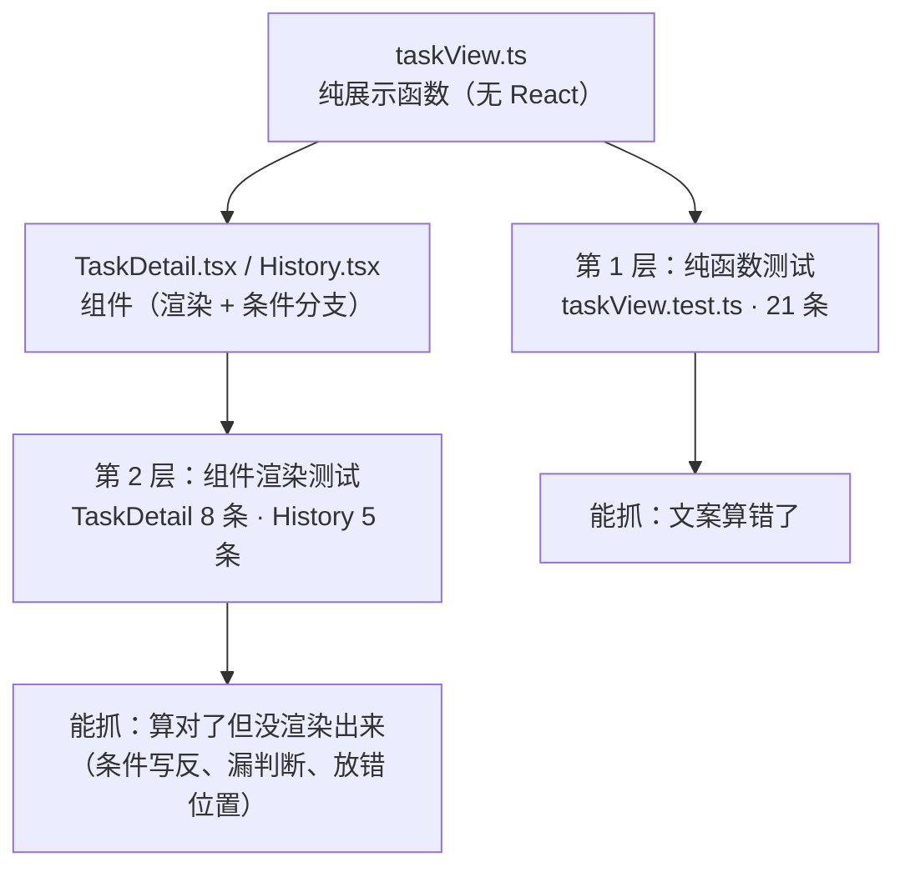

# 前端测试基建实施报告

## 版本记录

| 版本 | 日期 | 说明 |
| --- | --- | --- |
| V1.0.0 | 2026-09-18 | 首版。结掉计划书遗留项「前端测试基建」：引入 **Vitest 3.2.7** 作为正式测试运行器，把 `verify_taskview.mjs` 的 18 条断言迁移为正式用例并**新增组件渲染层测试**（合计 **34 条 / 3 个文件**）；新增 `scripts/check_frontend.py` 统一门禁（契约 → 类型 → 单测 → 构建，实测 **4/4**）；新增 `scripts/mutation_check_frontend.py`（**7 条变异，7/7 如期变红**），并在过程中抓出 1 处真实测试缺口与 2 处代码不一致。**未顺手处理** JS 未分包问题（仍为单包 931 kB，见 §6.2）。 |

> 本报告是**独立任务**的交付，不属于 D12。D12 阶段收尾时已明确不做此事（理由见 §1.1），本报告即把那笔账单独结清。

---

## 一、范围与背景

### 1.1 计划书原文（遗留项）

| 项 | 内容 |
| --- | --- |
| 来源 | 《D12性能优化与稳定性加固实施报告 V1.4.0》§7.2 第 4 项（开发计划书 V1.17.0 中作为独立任务登记） |
| 原文 | （可选，独立任务）前端测试基建：引入测试运行器，把 `verify_taskview.mjs` 这类断言纳入统一 CI；以及既有的 JS 未分包（当前单包 931 kB） |
| 本次范围 | **只做「测试基建」**：运行器、用例分层、统一门禁。JS 未分包**不在本次范围**，见 §6.2 |

### 1.2 为什么当时没做

D12 收尾时（实施报告 §3.4.4）的判断原话是：前端此前无任何单测框架，本版只需锁 3 个纯函数的语义，**引入测试运行器 + 配置 + CI 接线属于新的工程决策**，应由独立的「前端测试基建」任务来做，不该夹在 D12 收尾里顺手塞进去。所以当时退一步用 Vite 已装好的 esbuild 把 `.ts` 转 ESM 直接跑断言，零新增依赖。

那个临时方案**本身没有错**，但它有一个已知天花板：**只能测不依赖 React 的纯函数**。本次就是把天花板拆掉。

### 1.3 交付物清单

| 类别 | 文件 | 说明 |
| --- | --- | --- |
| 配置 | `frontend/vitest.config.ts` | 独立于 `vite.config.ts`（后者带 dev 代理，测试用不到） |
| 配置 | `frontend/src/test/setup.ts` | jsdom 缺失的 `matchMedia` / `ResizeObserver` 打桩 + 每例后 `cleanup` |
| 工具 | `frontend/src/test/factories.ts` | `TaskOut` 构造器：用例只声明关心的字段 |
| 工具 | `frontend/src/test/renderAt.tsx` | 统一渲染器（antd `App` + `MemoryRouter`） |
| 测试 | `frontend/src/lib/taskView.test.ts` | 纯函数层，**21 条** |
| 测试 | `frontend/src/pages/TaskDetail.test.tsx` | 组件层，**8 条** |
| 测试 | `frontend/src/pages/History.test.tsx` | 组件层，**5 条** |
| 门禁 | `scripts/check_frontend.py` | **统一入口**：契约 → 类型 → 单测 → 构建 |
| 门禁 | `scripts/mutation_check_frontend.py` | 变异测试台，**7 条** |
| 删除 | `frontend/scripts/verify_taskview.mjs` | 断言已迁移，保留两份即「同一事实两个来源」＝下一次漂移的种子 |

---

## 二、选型：为什么是 Vitest 3.2.7

### 2.1 版本兼容性（实测数据，不是猜的）

装包前先查了各版本对 `vite` 的 peer 依赖，结论直接改变了选型：

| vitest 版本 | 对 vite 的要求 | 与本项目 vite `^5.4.8` 是否兼容 |
| --- | --- | --- |
| 5.0.1（latest） | `^6.4.0 \|\| ^7.0.0 \|\| ^8.0.0` | ❌ 不兼容 |
| 4.1.11 | `^6.0.0 \|\| ^7.0.0 \|\| ^8.0.0` | ❌ 不兼容 |
| **3.2.7** | **`^5.0.0 \|\| ^6.0.0 \|\| ^7.0.0-0`** | ✅ **兼容** |

选 3.2.7 而不是最新版，是刻意的：**不为装测试而升级构建工具链**。把 vite 从 5 升到 6/7 会牵动 `@vitejs/plugin-react`、postcss、tailwind 的整条链，风险与「引入测试」这件事无关。**该付的风险在这里付，不该付的挪到独立任务**。

### 2.2 为什么不用 Node 自带的 `node:test`

Node 22 的 `node:test` 已稳定，且能做到零新增依赖 —— 对「省依赖」这个目标更优。但它缺的恰恰是本项目最需要的部分：

1. **跑不了 `.tsx`**：组件测试需要自己接一整套 transform，等于重造 Vitest 的一半；
2. **没有 DOM 环境管理**：jsdom 的注入、全局清理、断言扩展都要手写；
3. **没有 `expect` 的 DOM 断言**（`toBeInTheDocument` 这类），失败信息会退化成裸字符串对比。

结论：省下的依赖（vitest 是 `devDependency`，**不进产物**）换不来上面三项能力。选 Vitest。

### 2.3 依赖卫生：确认 vite 没有被装成两份

这是本次特意验的一点。若 vitest 自带一份 vite，就会出现「**测试用 vite A、构建用 vite B**」——表现是某些行为只在一个路径下复现，属于极难排查的一类问题。

实测结果：`frontend/node_modules` 下 vite **只有一份**，版本 `5.4.21`（vitest 3.2.7 的 `^5.0.0` 范围被去重到根依赖）。

| 新增 devDependency | 版本 |
| --- | --- |
| `vitest` | 3.2.7 |
| `jsdom` | 30.1.0 |
| `@testing-library/react` | 16.3.3 |
| `@testing-library/dom` | 10.4.2 |
| `@testing-library/jest-dom` | 7.0.1 |

---

## 三、测试分层：为什么不能只有纯函数测试

### 3.1 两层各自的职责



**第 1 层**守着「文案算得对不对」：`0` 是「正在跑」还是「前面还有 0 个」、`null` 是「还没算」还是「命中 0%」。

**第 2 层**守着「算对了之后有没有真的渲染出来」。这一层是本次新增的能力 —— 纯函数测试**在结构上就不可能**发现「条件写反导致该显示的不显示」。

### 3.2 纯函数层：21 条（迁移 18 + 新增 3）

18 条来自原 `verify_taskview.mjs`，逐条按原意迁移为 `describe / it / expect`，语义一字未改（包括 D12 实测值 `14/27 → 51.9%` 那条，让前端口径与实施报告 §5.3 的实机读数**继续用同一个数字**对表）。

新增的 3 条是变异测试 F6 逼出来的，见 §5.2 —— 这一点值得单独强调：**原有那几条 `showQueue` 断言其实是摆设**。

### 3.3 组件层：13 条

| 文件 | 条数 | 覆盖 |
| --- | --- | --- |
| `TaskDetail.test.tsx` | 8 | 排队 Alert 显示/隐藏 5 条；句级缓存行显示/隐藏 3 条 |
| `History.test.tsx` | 5 | 列表摘要排队文案 3 条；缓存文案 2 条 |

组件测试的写法上做了两件事，都是为了「用例不脆」：

1. **`makeTask()` 构造器**：每个用例只声明它真正关心的字段。手写字面量的话，后端每加一个字段就要改几十处测试 —— 那会直接导致「没人愿意加测试」。
2. **`renderAt()` 统一渲染器**：antd `App`（`App.useApp()` 的 message）与 `MemoryRouter`（`useNavigate` / `useParams`）是硬依赖，缺任何一个都在挂载阶段直接抛错。统一从一处进，避免每个用例各写一套 provider 而漏配。

---

## 四、统一门禁

### 4.1 一条命令

```bash
cd /d/podcast-ai
python scripts/check_frontend.py           # 契约 + 类型 + 单测（快）
python scripts/check_frontend.py --full    # 再加生产构建
```

| 步骤 | 内容 | 为什么在这一条链上 |
| --- | --- | --- |
| 1/4 | 前后端字段契约（`check_frontend_contract.py`） | 后端加字段、前端类型没跟，**不会报错**，只会界面少一行 |
| 2/4 | TypeScript 类型检查（`tsc --noEmit`） | 类型错误在运行前就该拦住 |
| 3/4 | 单元测试（`vitest run`） | 本次主体 |
| 4/4 | 生产构建（`vite build`，仅 `--full`） | 类型通过 ≠ 能打包；构建失败留给线上发现最贵 |

### 4.2 四处刻意的设计取舍

1. **降噪**：过滤沙箱 shell 的固定噪音（`shell-runtime-bash-env.sh` / `dirname: command not found` / `cd: null directory`）。这些行每步都会出现且**没有任何诊断价值**，留着会把真正的报错挤出视野。
2. **失败不截断**：通过的步骤只留尾部 10 行，**失败的步骤全量输出**。截断过的报错等于让人二次调试。
3. **首败即停，后续标 SKIP**：不继续跑，也不把后续步骤静默略过 —— 明确标 `[skip]`，否则「4 步只看到 1 步」会让人误以为全跑过了。
4. **`NO_COLOR=1`**：输出要能直接贴进报告与日志；ANSI 转义码一旦落盘就是乱码（本次前期日志确实出现过这个问题）。

**为什么直接调 node 而不走 `npm run`**：本环境 shell 没有 coreutils，且 `npm.cmd` 直接 spawn 会报 `EINVAL`；用 node 跑 `node_modules/` 下的入口文件少一层中介，也更可控。

---

## 五、验证证据

### 5.1 统一门禁 4/4

| 步骤 | 命令 | 结果 |
| --- | --- | --- |
| 前后端字段契约 | `python scripts/check_frontend_contract.py` | **6 组 schema 字段名全部一致** |
| TypeScript 类型检查 | `tsc --noEmit` | 通过（exit 0，无输出） |
| 单元测试 | `vitest run` | **3 个文件 / 34 条全部通过**（9.4 s） |
| 生产构建 | `vite build` | 成功（1486 modules，5.8 s） |

```text
 Test Files  3 passed (3)
      Tests  34 passed (34)
```

### 5.2 变异测试 7/7 —— 而且首轮就抓出真缺口

`scripts/mutation_check_frontend.py` 对源码注入 7 个**真实可能犯的错误**，逐条要求「注入 → 必须变红 → 立即还原（字节级校验）→ 全部还原后必须变绿」。

| 编号 | 注入的缺陷 | 变红的测试文件 | 能抓住它的层 |
| --- | --- | --- | --- |
| F1 | `0` 被当成「前面还有 0 个」 | `taskView.test.ts`, `History.test.tsx` | 两层（纯函数 + 组件） |
| F2 | `seg=0` 时不再隐藏读数 | `taskView.test.ts` | 纯函数 |
| F3 | 去掉全部条件：`pos=0` 也弹队列提示 | `TaskDetail.test.tsx` | **仅组件** |
| F4 | 列表页不再显示排队位次 | `History.test.tsx` | **仅组件** |
| F5 | 去掉阶段白名单：脚本阶段也显示缓存读数 | `TaskDetail.test.tsx` | **仅组件** |
| F6 | 去掉 `showQueue` 的状态白名单 | `taskView.test.ts`, `History.test.tsx`, `TaskDetail.test.tsx` | 两层 |
| F7 | 详情页退回「自己写一套判断」的旧写法 | `TaskDetail.test.tsx` | **仅组件** |

```text
结果：7 / 7 全部如期变红，且还原干净
```

**首轮结果不是 7/7，是 5/6 —— 而那正是本次最有价值的产出。** F6 注入后**仍然全绿**，说明这条缺陷没有任何测试覆盖。定位到根因：

> 原来那条「终态不显示队列」的断言传的是 `queue_position: null`。这种输入下 `queueLabel()` 本来就返回 `null`，**状态白名单根本没参与判定** —— 把白名单整个删掉，断言照样通过。

这就是**摆设测试**：它看起来在守白名单，实际只守住了「`null` 不显示」。修法是让「状态」成为**唯一变量**：位次给一个有值的、该状态却不该显示。补了 3 条（`DONE+2` / `SCRIPT_READY+1` / `FAILED+0`）之后 F6 才如期变红。

同一轮还暴露了变异台**自身**的一个可靠性问题：改完源码后，F3 的锚点字符串已不存在，脚本报「锚点命中 0 次」并拒绝执行该条 —— 这是刻意的设计（锚点必须唯一命中），它拦住了一次「锚点漂移 → 变异退化成空操作 → 假绿」的隐蔽失败。

### 5.3 过程中修掉的两处不一致

**① 详情页与列表页的「该不该显示」是两套判断**

`History.tsx` 用 `showQueue()`（带状态白名单），而 `TaskDetail.tsx` 自己写了一套等价判断、**漏了白名单**。实践中后端对终态任务返回 `null`，所以没暴露成线上问题；但两套判断就是下一次漂移的种子。已统一为共用 `showQueue()`，并补了「终态 + 位次残留」的用例（F7 守它）。

**② React Router 的 v7 future flag 只在 app 侧没有、测试侧也没有**

两边都没采纳，控制台持续告警。已在 `main.tsx` 的 `BrowserRouter` 与测试的 `MemoryRouter` **统一采纳同一组 flag**。理由不是「消警告」，而是：**测试与运行时的路由配置不一致，等于测试没验真实行为**。顺带把警告噪音清到 0。

**③ 清理**：删掉 Vite 配置热更新残留的 `vite.config.ts.timestamp-*.mjs`，并把该模式与 `coverage/` 写进 `.gitignore`。

---

## 六、结论与遗留

### 6.1 结论

1. **遗留项「引入测试运行器」已闭环**：Vitest 3.2.7 正式接入，原 18 条断言迁移为正式用例，并**新增了此前在结构上不可能有的组件渲染层**（34 条 / 3 文件）。
2. **能力边界发生了变化**：从「只能测纯函数」变成「能测真实渲染」。§5.2 的 F3/F4/F5/F7 四条变异**只有组件测试抓得到**，这是本次最直接的收益证明。
3. **门禁可一条命令重跑**，且四步各自对应一类「不会报错、只会悄悄坏掉」的漂移。
4. **测试自身可信**：34 条通过不是终点，7 条变异全红才是 —— 并且首轮抓出的那个缺口证明了「不加变异验证，摆设测试不会被发现」。
5. **未付不该付的成本**：没有为了装测试而升级 vite 主版本。

### 6.2 遗留

| 项 | 状态 | 说明 |
| --- | --- | --- |
| JS 未分包（单包 **931.03 kB**，gzip 295.12 kB） | **未处理** | 计划书遗留项，与测试基建无关。修法已明确（`build.rollupOptions.output.manualChunks` 或路由级 `import()`），但属于独立任务，且需要验证分包后首屏加载未退化 |
| 覆盖率采集 | **未接入** | 现只有「通过/失败」。`@vitest/coverage-v8` 可加，但**覆盖率数字本身不是目标** —— 在变异测试已能证明「缺陷会被抓住」的前提下，覆盖率优先级低于「补更多变异条目」 |
| 前端其余页面无测试 | 待排期 | 本次只覆盖 D12 触碰的两个页面（`TaskDetail` / `History`）。`Submit` / `Login` / `FeedConfig` 仍无测试 |

### 6.3 下一步

1. **D11**：MOS 评分包已产出，**回收评分需真人**（阻塞在人工，不在代码）。
2. **D13/D14**：文档阶段。
3. （可选，独立任务）JS 未分包。

---

## 附：如何复跑

### 附.1 统一门禁（推荐）

```bash
cd /d/podcast-ai
"D:/anaconda/envs/cosyvoice/python.exe" scripts/check_frontend.py --full
# → 4 步各自 PASS；退出码 0 = 全绿
```

### 附.2 单跑测试

```bash
cd /d/podcast-ai/frontend
"C:/Users/zzz/.workbuddy/binaries/node/versions/22.22.2-3/node.exe" \
  node_modules/vitest/vitest.mjs run        # 34 passed
"C:/Users/zzz/.workbuddy/binaries/node/versions/22.22.2-3/node.exe" \
  node_modules/vitest/vitest.mjs            # watch 模式
```

### 附.3 变异测试（证明测试真的会红）

```bash
cd /d/podcast-ai
"D:/anaconda/envs/cosyvoice/python.exe" scripts/mutation_check_frontend.py
# → 7/7 如期变红 + 还原复跑全绿；退出码 0
```

### 附.4 证据文件

| 文件 | 说明 |
| --- | --- |
| `outputs/frontend_gate_final.log` | 统一门禁 4/4 的完整输出（含最终构建体积 931.03 kB） |
| `outputs/vitest_run3.log` | 34 条用例的控制台记录 |
| `outputs/frontend_mutation.log` | 变异测试 7 条的逐条记录（含「变红文件」与还原判定） |
| `outputs/vite_build1.log` | 首次生产构建输出（含「超过 500 kB」告警原文） |

---

**文档结束** | 版本 V1.0.0 | 编制日期 2026-09-18
