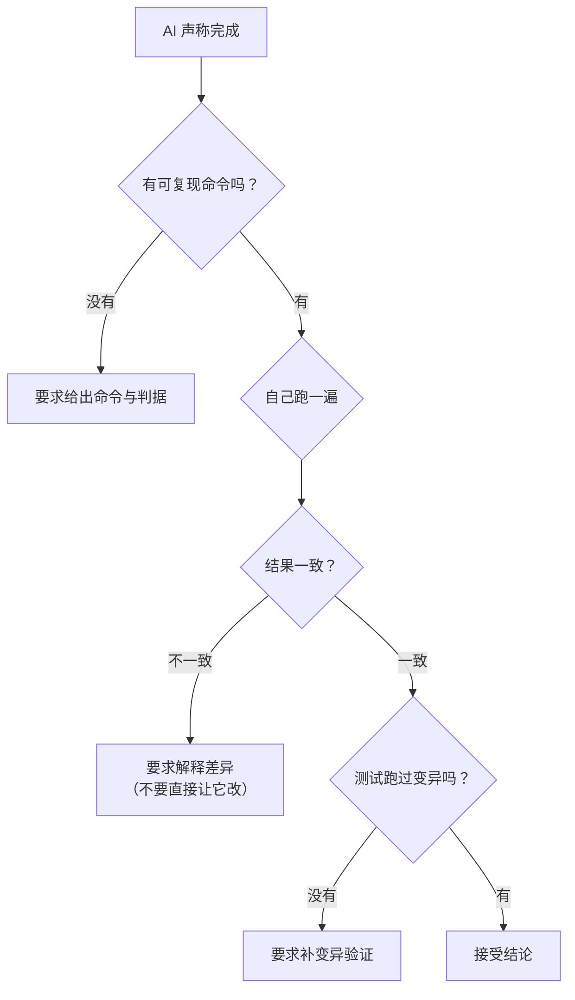

# 双人对话播客自动生成系统 · AI 协作教程

> 版本：V1.0.0　|　日期：2026-09-20　|　撰写依据：本项目 **D0 ~ D12 的真实开发过程**（含 13 份阶段实施报告、32 条变异、三次返工记录）
> 本文不是通用 AI 使用技巧，而是**从这个项目里长出来的具体做法**。每条做法都附了它对应的真实事故。

## 版本记录

| 版本 | 日期 | 变更摘要 |
| --- | --- | --- |
| V1.0.0 | 2026-09-20 | 首次发布（D13 文档齐备阶段九项之一）。七条核心纪律、阶段推进法、验收口径先行、假绿防御、文档版本化、环境坑登记、记忆与技能沉淀；附十类反模式清单与真实事故对照。 |

---

## 1. 这份教程要解决的问题

一个人 + 一个 AI，在**十几个阶段**里交付一个**能跑、能验、能交**的系统。它最容易崩在四个地方：

| 崩溃点 | 表现 | 本项目的应对 |
| --- | --- | --- |
| **方向漂移** | 做着做着发现和需求不是一回事 | 阶段制 + Done 定义先行（第 3、4 章） |
| **假绿** | 测试全绿、报告漂亮，但东西是坏的 | 变异测试 + 证据分级（第 5 章） |
| **上下文丢失** | 隔几天回来，忘了为什么这么写 | 文档版本化 + 记忆沉淀（第 6、7 章） |
| **重复踩坑** | 同一个环境问题反复浪费半天 | 环境坑登记（第 6.3 节） |

---

## 2. 七条核心纪律

| # | 纪律 | 一句话 |
| --- | --- | --- |
| 1 | **验收口径先行** | 没写清「什么算做完」之前，不开工 |
| 2 | **小步验证** | 每完成一个功能立即验证，不堆积未验证的代码 |
| 3 | **测试必须能被证明会失败** | 没跑过变异，不许声称规则被覆盖 |
| 4 | **口径先于数据** | 判据和数据「差一点点」时，先查口径，不调阈值 |
| 5 | **失败必须留痕，但不升级成任务失败** | 静默的失败比报错危险十倍 |
| 6 | **结论带证据类型** | 机器证据与人证分开记，不混用 |
| 7 | **改动前先归档** | 文档升版先做字节级复制 |

---

## 3. 阶段推进法

### 3.1 一个阶段的完整形状

| 步 | 关键动作 | 反例（本项目真实出现过） |
| --- | --- | --- |
| 1 | **定 Done**：把「完成」写成可判定的句子 | 早期写「D11 评测指标达标」，但没区分「一致率」与「MOS」两种证据类型，导致差点把「脚本就绪」写成「缺陷已修复」 |
| 2 | 拆成 3~8 个**可独立验证**的子项 | — |
| 3 | 每完成一项立即验证 | — |
| 4 | 补测试**并跑变异** | M6 一开始是绿的（摆设测试），见 5.2 |
| 5 | 全量回归**读 junit** | 只看点阵，漏掉 163 个 setup error |
| 6 | 报告**必须写降级项** | 「部分达标」比「全达标」诚实得多 |
| 7 | 升版 + 归档 | — |
| 8 | 写回记忆 | — |

### 3.2 任务粒度建议

| 粒度 | 判断 | 例 |
| --- | --- | --- |
| **太粗** | 无法在一次验证里判真假 | 「实现后期处理」 |
| **合适** | 有明确的验证命令与判据 | 「实现两遍 loudnorm 并用第一遍 input 回填 measured；验证：跑 test_postprocess 且响度容差 ≤1.0 LUFS」 |
| **太细** | 每个都单独记任务会淹没重点 | 「加一个 import」 |

---

## 4. 「Done」怎么写

### 4.1 三件必须写清的事

| 要素 | 问题 | 本项目示例 |
| --- | --- | --- |
| **判据** | 用什么命令/操作判定？ | `pytest --junitxml=...` 后 `tests=409 failures=0 errors=0` |
| **证据类型** | 是机器证据还是人证？ | 一致率 = 机器；MOS = **人证** |
| **边界** | 什么情况不算完成？ | 「手段就绪」≠「缺陷已修复」 |

### 4.2 一个反面教材（本项目真实出现）

**原写法**：`D11 评测指标达标`

**问题**：D11 的三条 Done 里，「一致率 100%」是机器可复现的，「MOS ≥ 3.5」需要真人，「bad case 修复」需要外部输入。**三种完全不同的证据类型被塞进同一个词**。结果是：一致率做到了、MOS 没做、bad case 没输入，但四舍五入会写成「完成了」。

**改后写法**：

| Done 要求 | 判据 | 证据类型 |
| --- | --- | --- |
| 逐句一致率 100% | `verify_consistency.py` 输出 1120/1120 | 机器 |
| bad case 三项手段就绪 | 三条生产链路均有链路级测试 | 机器 |
| MOS ≥ 3.5 | 真人评分表 ≥3 份 | **人证** |

改完之后，「部分达标」这个结论才写得出来。

> **通用规则**：**一条 Done 里出现两种证据类型，就拆成两条。**

---

## 5. 假绿防御

**假绿 = 看起来通过了，实际上什么都没检查。**

### 5.1 四种假绿形态

| 形态 | 长什么样 | 怎么抓 |
| --- | --- | --- |
| **摆设测试** | 断言里被守护的条件不参与判定 | 跑变异 |
| **走不到的分支** | 测试声称测分支 B，但数据在分支 A 就被拦下 | 加**前置断言**锁住「确实到了这里」 |
| **被抑制的汇总** | 输出不显示失败 | 用机读格式（junit / json）代替人读输出 |
| **口径混淆** | 判据与被判对象粒度不同 → 假失败 | 先查口径，不调阈值 |

### 5.2 真实事故 1：一个永远走不到分支的测试

| 阶段 | 内容 |
| --- | --- |
| 测试 | 「坏 wav 应返回 0 时长」，构造 36 字节文件 |
| 变异 | 把目标分支的返回值改错 → **测试仍然全绿** |
| 排查 | 解析器**更靠前**有一条 `len(raw) < 44` 的规则把它拦了，**根本走不到被测分支** |
| 修法 | ① 用 `LIST` 块把文件补齐到 ≥44 字节，让它真的走到目标分支；② **加前置断言** `assert p.stat().st_size >= 44` 防止将来再退化 |
| 结果 | 变异转红 |

> **代码覆盖率看不出这个问题** —— 行确实被执行了，只是走的是另一条路。

### 5.3 真实事故 2：被抑制的汇总

| 阶段 | 内容 |
| --- | --- |
| 现象 | 控制台「一排点全绿」，看起来 409 项通过 |
| 实际 | junit 报 **163 个 error**（fixture setup 阶段炸） |
| 根因 | **本机 pytest 的控制台汇总行被稳定抑制**（连 51 项的小样本也不打印汇总） |
| 教训 | **「点全绿」不是通过证据**。自检必须读机读格式的计数 |

### 5.4 真实事故 3：判据与数据粒度不同（**最有价值的一条**）

| 阶段 | 内容 |
| --- | --- |
| 判据 | `wav_dur_ms == duration_ms` |
| 结果 | **98.75%**，14 行不过 |
| 第一反应（错） | 「容差太小？」 |
| 正确动作（对） | **查口径** |
| 查出 | `duration_ms` 是**行级（Σ分段）**、`text_hash` 指向**首段** —— **两者粒度不同** |
| 是否缺陷 | **不是**。这是设计 |
| 修法 | **不调阈值**，换成仍然会变红的**物理不变量**（首段时长 ≤ 整行时长） |
| 重跑 | **100.00%** |

> **通用规则：判据和数据「差一点点」时，第一条动作是查口径，不是调阈值。**
> 调阈值会把真缺陷一起放过——因为阈值一放宽，「14 行不等」里的真问题也一起变绿了。

---

## 6. 上下文保全

### 6.1 文档版本化

| 规则 | 做法 |
| --- | --- |
| 升版 = 重命名 | `X_V1.0.0.md` → `X_V1.1.0.md` |
| **改前先字节级复制** | 复制到 `archive/`，核对字节数与 md5 |
| 版本记录行**冻结** | 历史版本的记录行不再改动 |
| **当前版引用要同步改** | 别的文档提到「依据《X V1.0.0》」时，升版后要一并更新 |
| 同类编辑**禁止并行** | 同一文件的多处编辑**串行**执行 |

**本项目的证据**：归档时以**字节数**为黄金值（如计划书 V1.17.0 = **213524 字节**、V1.18.0 = **219355 字节**），归档后逐个核对。

> ⚠️ **一条真实教训**：本项目曾**并行发出两个针对同一文档的编辑**，结果其中一处**静默丢失**（工具都报成功），直到后续校验才暴露。
> **结论：同一文件的多处编辑必须串行。** 这条后来被写进了项目记忆。

### 6.2 报告里必须有的三节

| 节 | 作用 |
| --- | --- |
| **结论与证据表** | 每条结论 → 判据 → 证据类型，一眼看清哪条是机器证据、哪条是人证 |
| **降级项 / 未做项** | 诚实列没做到的。**「按需扩展」不是降级项的写法**——降级项要说清「现在确实没有」 |
| **坑与修正过程** | 写清走错的路，避免下次重走 |

### 6.3 环境坑登记

**原则**：只要一个环境问题**花掉了超过 10 分钟**，就把它写进文档的固定小节，格式是「**症状 → 根因 → 处置**」。

本项目的《部署运维手册》第 8.6 节就是这么长出来的，其中最有价值的几条：

| 症状 | 根因 | 处置 |
| --- | --- | --- |
| 测试报了 11 个 FAILED / 163 个 error | 沙箱批量删除守卫抛 `SystemExit`，而 **`SystemExit` 不是 `Exception`**，`except Exception` 与 `rmtree(ignore_errors=True)` **都吞不掉它** | `--basetemp` 指向系统临时目录；清理用逐文件删除的脚本 |
| 「测试跑完了但没汇总」 | 控制台汇总被抑制 | 读 junit |
| 探活白等满超时 | 轮询只看 200，401 被静默跳过 | **先探「读得到吗」**，非 200 立即报错 |
| 打本机端口返回 404 | 环境代理导致请求走 absolute-form | HTTP 客户端 `trust_env=False` |
| 业务日志整体丢失 | `uvicorn` 的 `LOGGING_CONFIG` **不含 root logger** | `basicConfig` 必须在 `import api.main` **之前** |

> **为什么值得花时间记这些**：这些坑**每一个都会重复出现**，而它们的表现往往与根因**毫无相似之处**（「404」的根因是代理，「日志丢失」的根因是导入顺序）。不记下来，下次还得再花一遍时间。

### 6.4 记忆与技能沉淀

| 载体 | 放什么 | 不放什么 |
| --- | --- | --- |
| **项目长期记忆** | 铁律、口径、已作废的旧结论、进度 | 临时路径、偶发报错 |
| **每日日志** | 今天做了什么、踩了什么坑 | 大段代码 |
| **技能（skill）** | **可复用的工作流程** | 一次性的具体任务 |

**判断标准**：这件事**下次还会做，且做法有讲究**吗？是 → 存成技能；只是「今天发生了什么」→ 存成记忆。

**本项目沉淀出的技能**（举三例）：
- **前端测试基建**：给没有测试框架的前端项目落地正式测试运行器，并把一次性验证脚本转正
- **文档版本化归档**：升版、归档、以及「已原地编辑后重建归档副本」
- **长批次跑批的续跑纪律**：常驻后端、逐例落盘、增量续跑，禁止全量重跑

**特别提醒**：记忆里必须显式记下**已作废的结论**。本项目有 5 条已作废结论（如「减少段数省 170~210 s」「截短 prompt_text」），它们曾经被写在报告里。**不标记作废，下次还会被引用。**

---

## 7. 证据分级（本项目最重要的一条口径）

### 7.1 三级证据

| 级别 | 定义 | 能否被 AI 生成 | 本项目例子 |
| --- | --- | --- | --- |
| **机器证据** | 可复现的命令 + 机读输出 | ✅ | 409 项回归、变异 32/32、一致率 1120/1120 |
| **实机证据** | 真进程 / 真端口 / 真 GPU 上跑过 | ⚠️ 需人配合环境 | 杀进程续跑、断网、OOM |
| **人证** | 真人主观判断 | ❌ **绝对不可代填** | MOS 听测「都没问题」 |

### 7.2 一条铁律

> **AI 不得代拟任何主观评分。** 没有有效评分表时，脚本应当输出「未回收」并**退出码非 0**——**绝不能吐一个看起来像均分的数字**。

本项目的做法：

| 场景 | 错误做法 | 正确做法 |
| --- | --- | --- |
| 0 份评价表 | 输出「均分 4.0（估）」 | 输出 `NOT_RECYCLED`、退出码 2、明确写「未回收」 |
| 收到小数分（3.5） | 静默截断为 3 | **显式拒绝**：「应为整数档位」 |
| 人数不足（2 人） | 照常算均分 | 判 `NOT_RECYCLED` |
| 人证已达标的场景 | 把机器记录改成「已达标」 | 机器记录保持原样，**人证结论另写** |

**为什么这条这么重要**：一旦机器记录里混进了「看起来像数据」的猜测，**以后没人分得清哪条是被测出来的、哪条是被写出来的**。整份证据链的可信度就没了。

### 7.3 怎么在文档里表达「人证」

| 要说 | 不要说 |
| --- | --- |
| 「已由 **3 位真人听测确认达标**」 | 「MOS 均分 4.2」 |
| 「**人证**：用户裁定达标（无评分表、无均分）」 | 「MOS 达标（≥3.5）」 |
| 「要升级为机器证据：填 `mos_scoresheet_<姓名>.csv` → 跑脚本」 | 「MOS 后续补充」 |

---

## 8. 与 AI 协作的实操写法

### 8.1 提问方式

| 场景 | 好的问法 | 差的问法 |
| --- | --- | --- |
| 目标明确 | 「进入 D11」 | 「帮我优化一下」 |
| 需要判断 | 「这两种判据哪个更能抓住真缺陷？说明理由」 | 「你觉得呢」 |
| 明确边界 | 「只改 `api/`，不动前端；改完必须跑回归」 | （不设边界） |
| 发现异常 | 「这个数字与上次不一致，先查为什么，不要直接改」 | 「把它改成能过的」 |

**最关键的一条**：**当结果「差一点点」时，明确要求「先查口径」**。本项目 98.75% 那一次，如果当时说「调下容差让它过」，真结论就永远不会被发现了。

### 8.2 让 AI 产出可信结论的三个约束

| 约束 | 说法 |
| --- | --- |
| 证据落盘 | 「把结果写进文件，不要只在对话里说」 |
| 机读优先 | 「用 junit / json，不要依赖控制台输出」 |
| 降级明说 | 「有没做到的直接列出来，不要用『按需扩展』糊过去」 |

### 8.3 交付时的检查动作

> **「信任但要核实」**：AI 的总结描述的是它**打算**做什么，不一定是它**实际**做了什么。本项目就出现过「工具报编辑成功、内容却没变」的情况。

---

## 9. 十类反模式（本项目逐个踩过）

| # | 反模式 | 正确做法 |
| --- | --- | --- |
| 1 | 没定 Done 就开工 | 先把「什么算完成」写成可判定的句子 |
| 2 | 用 `except: pass` / `rmtree(ignore_errors=True)` 处理失败 | 失败必须留痕（日志 + 可读的原因），但**不升级成任务失败** |
| 3 | 声称某规则被覆盖但从没跑过变异 | 没跑过变异 = 没覆盖 |
| 4 | 判据不通过就调阈值 | 先查口径 |
| 5 | 只看控制台输出就判通过 | 读机读格式的计数 |
| 6 | 把「手段就绪」写成「缺陷已修复」 | 分开写 |
| 7 | AI 代拟主观评分 | 只报「未回收」 |
| 8 | 并行编辑同一文件 | 串行 |
| 9 | 报告只写成功项 | 降级项必须单列 |
| 10 | 改配置不核查键名 | 跑键名自查（本项目查出 **8 个不生效的键**） |

### 9.1 第 10 条的详细说明（配置漂移）

一次 `D13` 的文档撰写中顺手核查配置，发现 `.env` 里 **8 个键不生效**：

| 键 | 问题 |
| --- | --- |
| `COSYVOICE_MAX_CHARS_PER_SEG` | **键名写错**（正确是 `MAX_CHARS_PER_SEG`，无前缀）。因默认值恰好相同而长期未被发现 |
| `TTS_REPORT_MEMORY` 等 7 个 | **代码里根本没有对应字段**（计划书 P1「云端 TTS 兜底」未实现） |

**根因**：配置加载用的是 `extra="ignore"` —— **未知键不报错、不警告，直接丢弃**。

> **教训推广**：凡是「**配置/参数类**的输入」，都要有一条**显式的核查命令**。因为配置错的默认表现就是「什么都没发生」——**与「配置正确但恰好没触发」在现象上完全一样**。

---

## 10. 一页速查

| 场景 | 一句话 |
| --- | --- |
| 开始一个阶段 | 先写 Done，再拆任务 |
| 写完代码 | 立即验证，不留未验证的代码 |
| 写测试 | 写完必须跑变异，确认它会红 |
| 结果「差一点点」 | 查口径，不调阈值 |
| 判「通过」 | 读机读计数（junit / json） |
| 遇到环境怪现象 | 记进「症状 → 根因 → 处置」清单 |
| 写报告 | 结论 + 证据类型 + 降级项，三节齐 |
| 涉及主观判断 | 只记人证，不代拟分数 |
| 升版文档 | 先字节级复制归档，再改 |
| 同一个文件多处改 | 串行，别并行 |
| 改了配置 | 先跑键名自查 |
| 阶段结束 | 报告 + 升版 + 写回记忆 |

---

## 11. 与其他交付文档的关系

| 文档 | 关系 |
| --- | --- |
| 《开发计划书 V1.22.0》 | 阶段划分与 Done 定义的来源 |
| 《双人对话播客自动生成系统_测试报告_V1.1.0.md》 | 第 5 章「假绿防御」所对应的完整测试证据 |
| 《双人对话播客自动生成系统_部署运维手册_V1.2.0.md》 | 第 6.3 节环境坑清单的完整版 |
| 《双人对话播客自动生成系统_项目参数说明_V1.0.0.md》 | 第 9.1 节配置漂移事故的完整版 |
| 《D0 ~ D12 各阶段实施报告》 | 本教程所有「真实事故」的原始出处 |
