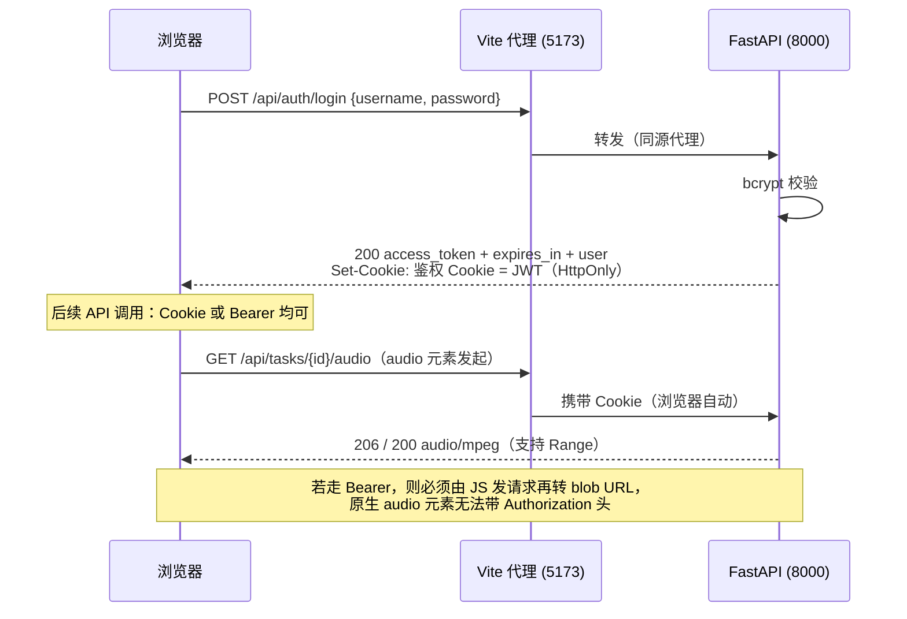
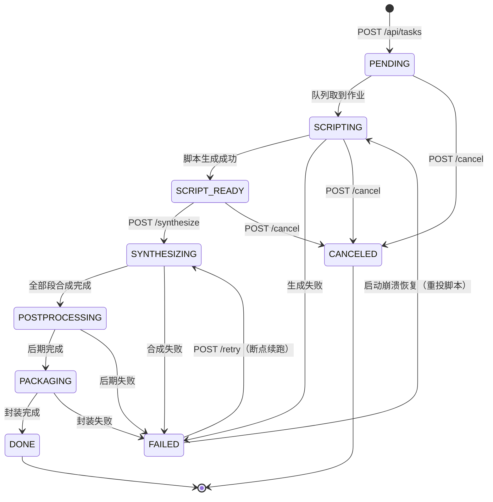

# 双人对话播客自动生成系统 · API 接口文档

> 版本：V1.0.0　|　日期：2026-09-20　|　对应《双人对话播客自动生成系统_开发计划书_V1.21.0.md》4.7~4.9
> 服务基址（开发）：`http://127.0.0.1:8000`　|　交互式文档：`/docs`（Swagger UI）、`/redoc`、`/openapi.json`

## 版本记录

| 版本 | 日期 | 变更摘要 |
| --- | --- | --- |
| V1.0.0 | 2026-09-20 | 首次发布（D13 文档齐备阶段九项之一）。覆盖 21 个业务端点 + 1 个探针端点的完整契约、状态机语义、错误码总表与端到端调用示例。素材逐条取自 `api/routers/*.py`、`api/schemas.py`、`api/main.py`。 |

> **本文档的口径**：字段名、类型、约束、状态码、错误文案全部**从代码读取**，不是设计稿转写。
> 文中标注 `⚠️ 实现细节` 的地方，是「代码实际行为与直觉/文案不完全一致」之处 —— 这类地方**照代码写，不照直觉写**。

---

## 1. 总览

### 1.1 通用约定

| 项 | 约定 |
| --- | --- |
| 协议 | HTTP/1.1（本地无 TLS；生产应置于反向代理之后） |
| 内容类型 | 请求与响应均为 `application/json; charset=utf-8`，媒体端点除外 |
| 时间格式 | ISO 8601 字符串（如 `2026-09-20T02:33:10.482913`）。**统一为 naive UTC**，不带时区偏移 |
| 字段命名 | `snake_case` |
| 未知字段 | 绝大部分入参为 `extra="forbid"`：**多传字段直接 422**。响应体的 LLM 中间结构为 `extra="ignore"` |
| 鉴权方式 | JWT（`Authorization: Bearer <token>` 或 HttpOnly Cookie 双通道） |
| 越权语义 | **返回 404（不是 403）** —— 避免泄露「该 id 存在」 |
| 状态冲突 | **返回 409**，`detail` 里给出「允许的迁移集合」 |

### 1.2 端点总览

| # | 方法 | 路径 | 鉴权 | 说明 |
| --- | --- | --- | --- | --- |
| 1 | POST | `/api/auth/register` | 无 | 注册并直接登录 |
| 2 | POST | `/api/auth/login` | 无 | 登录 |
| 3 | POST | `/api/auth/logout` | 无 | 清除会话 Cookie |
| 4 | GET | `/api/voices` | 需登录 | 预置音色列表 |
| 5 | POST | `/api/tasks` | 需登录 | 创建任务（自动投递脚本作业） |
| 6 | GET | `/api/tasks` | 需登录 | 历史任务分页 |
| 7 | GET | `/api/tasks/{task_id}` | 需登录 | 查询任务状态与进度 |
| 8 | GET | `/api/tasks/{task_id}/script` | 需登录 | 获取脚本 |
| 9 | PUT | `/api/tasks/{task_id}/script` | 需登录 | 保存人工编辑后的脚本 |
| 10 | POST | `/api/tasks/{task_id}/synthesize` | 需登录 | 确认脚本，触发合成 |
| 11 | POST | `/api/tasks/{task_id}/retry` | 需登录 | 失败任务断点续跑 |
| 12 | POST | `/api/tasks/{task_id}/cancel` | 需登录 | 取消任务 |
| 13 | DELETE | `/api/tasks/{task_id}` | 需登录 | 删除任务（级联） |
| 14 | GET | `/api/tasks/{task_id}/segments/{seq}/audio` | 需登录 | 逐句试听（支持 Range） |
| 15 | GET | `/api/tasks/{task_id}/audio` | 需登录 | 成片在线播放（支持 Range） |
| 16 | GET | `/api/tasks/{task_id}/download` | 需登录 | 成片下载 |
| 17 | GET | `/api/feeds/me` | 需登录 | 读取我的频道配置 |
| 18 | PUT | `/api/feeds/me` | 需登录 | 更新频道配置（可重置订阅 token） |
| 19 | GET | `/feed/{user_token}.xml` | **公开** | RSS 订阅源 |
| 20 | GET | `/feed/{user_token}/cover.jpg` | **公开** | 播客封面 |
| 21 | GET | `/feed/{user_token}/{guid}.mp3` | **公开** | RSS enclosure 音频 |
| — | GET | `/health` | 无 | 存活探针（`meta`） |

**「公开」的含义**：靠**不可猜测的随机 token / guid** 保护，而非登录态。这是 RSS 的固有约束——播客客户端不携带 Cookie。

---

## 2. 鉴权机制

### 2.1 双通道（为什么必须两条）

| 通道 | 携带方式 | 适用场景 |
| --- | --- | --- |
| **Bearer 头** | `Authorization: Bearer <jwt>` | 脚本、第三方客户端、调试 |
| **HttpOnly Cookie** | 登录时由服务端 `Set-Cookie` 下发 | **浏览器原生媒体元素** |

**关键约束**：浏览器的 `<audio src="...">` 与 `<a download>` **不会带 `Authorization` 头**。因此媒体端点（#14/#15/#16）在浏览器里只能用 Cookie 通道。这就是「登录同时写 Cookie」而不是「只回 token」的全部原因。

### 2.2 令牌

| 项 | 值 |
| --- | --- |
| 算法 | HS256（对称） |
| 密钥 | `JWT_SECRET`（`.env`）。**缺失时抛 `AuthConfigError` → 500** |
| 有效期 | `JWT_EXPIRE_MINUTES`（默认 1440 分钟 = 24 小时），响应里以秒回给调用方（`expires_in`） |
| Cookie 名 | `auth_cookie_name`（配置项） |
| Cookie 属性 | `HttpOnly=true`；`Secure`/`SameSite`/`Path` 由配置决定 |

### 2.3 鉴权失败的响应

| 情形 | 状态码 | 响应 |
| --- | --- | --- |
| 令牌缺失 / 无效 / 解析失败 | **401** | `{"detail": "登录态无效：<原因>"}`，附 `WWW-Authenticate: Bearer` |
| 密钥配置异常（如 `JWT_SECRET` 未设） | **500** | `{"detail": "<原因>"}` |
| 访问他人的资源 | **404** | `{"detail": "..."}`（**刻意不返回 403**） |

### 2.4 鉴权流程



---

## 3. 鉴权端点

### 3.1 POST `/api/auth/register`

注册并**直接登录**（签发 JWT + 写 Cookie）。

**入参** `RegisterIn`（`extra="forbid"`）

| 字段 | 类型 | 必填 | 约束 | 说明 |
| --- | --- | --- | --- | --- |
| `username` | string | 是 | 3~32 位，`^[A-Za-z0-9_.-]+$` | **限定 ASCII**：它要进 RSS 标题与日志，限定字符集可避免编码歧义 |
| `password` | string | 是 | 6~128 位 | 服务端 bcrypt 散列存储 |

**出参** `TokenOut`

| 字段 | 类型 | 说明 |
| --- | --- | --- |
| `access_token` | string | JWT |
| `token_type` | string | 固定 `"bearer"` |
| `expires_in` | int | 有效期（秒） |
| `user` | `UserOut` | `{id, username, created_at}` |

**状态码**

| 码 | 场景 |
| --- | --- |
| 200 | 成功 |
| 409 | `{"detail": "用户名已存在：<username>"}` |
| 422 | 用户名/口令不符合约束 |
| 500 | JWT 密钥配置异常 |

```bash
curl -X POST http://127.0.0.1:8000/api/auth/register \
  -H "Content-Type: application/json" \
  -d '{"username":"demo_user","password":"demo123456"}'
```

### 3.2 POST `/api/auth/login`

**入参** `LoginIn`（`extra="forbid"`）：`username` 1~32 位、`password` 1~128 位。
**出参**：同 3.1。

| 码 | 场景 |
| --- | --- |
| 200 | 成功（同时写 Cookie） |
| **401** | `{"detail": "用户名或口令错误"}`（用户不存在与口令错误**返回同一文案**，不区分） |
| 500 | JWT 密钥配置异常 |

### 3.3 POST `/api/auth/logout`

清除会话 Cookie。

| 项 | 值 |
| --- | --- |
| 入参 | 无 |
| 出参 | `{"detail": "已退出登录"}` |
| 状态码 | 200 |

> **注意**：logout 只清 Cookie，**不会把已签发的 JWT 拉黑**。若客户端自己保存了 token，在过期前仍然有效。本项目未实现令牌吊销列表。

---

## 4. 音色端点

### 4.1 GET `/api/voices`

读取 `backend/voices/` 下的音色档案（`VoiceRegistry.load()`）。

| 项 | 值 |
| --- | --- |
| 鉴权 | 需登录 |
| 入参 | 无 |
| 出参 | `VoiceOut[]` |

**`VoiceOut` 字段**

| 字段 | 类型 | 说明 |
| --- | --- | --- |
| `id` | string | 档案 id（如 `voice_a` / `voice_b`） |
| `name` | string | 显示名 |
| `gender` | string | 默认 `"unknown"` |
| `style` | string | 默认 `"neutral"` |
| `description` | string | 描述 |
| `prompt_text` | string | 参考音频对应的文本（**须与参考音频一致**） |
| `wav` | string | 参考音频路径 |
| `fingerprint` | string | 音色指纹（参与缓存键） |

> 音色是**共享资产**：所有用户看到同一份列表，不自建、不隔离。

---

## 5. 任务端点

### 5.1 任务状态机（读懂本节，其余端点都好懂）



**权威迁移表**在 `api/services/task_runner.TRANSITIONS`（`models.TaskStatus` 只定义词汇，不定义图——避免同一份状态机有两处会飘的定义）。

| 当前状态 | 允许迁移到 | 触发方式 |
| --- | --- | --- |
| `PENDING` | `SCRIPTING`、`CANCELED` | 队列调度 / `POST /cancel` |
| `SCRIPTING` | `SCRIPT_READY`、`FAILED`、`CANCELED` | 流水线 / `POST /cancel` |
| `SCRIPT_READY` | `SYNTHESIZING`、`CANCELED` | `POST /synthesize` / `POST /cancel` |
| `SYNTHESIZING` | `POSTPROCESSING`、`FAILED` | 流水线 |
| `POSTPROCESSING` | `PACKAGING`、`FAILED` | 流水线 |
| `PACKAGING` | `DONE`、`FAILED` | 流水线 |
| `FAILED` | `SYNTHESIZING`、`SCRIPTING` | `POST /retry` / 崩溃恢复 |
| `DONE`、`CANCELED` | —（终态） | 无 |

**非法迁移的响应**（由全局异常处理器统一转）：

```
HTTP/1.1 409 Conflict
{"detail": "非法状态迁移：SYNTHESIZING -> SCRIPT_READY（允许：['FAILED', 'POSTPROCESSING']）"}
```

> ⚠️ **实现细节**：`FAILED → SCRIPTING` 这条回边是 D12 崩溃恢复引入的。进程在脚本阶段被杀后任务停在 `SCRIPTING`，而 `_run_script` 的第一个动作就是迁移到 `SCRIPTING`——状态机不许自环，所以必须先落 `FAILED` 再回到 `SCRIPTING`。回放是幂等的（`_run_script` 会先删掉本任务全部 `script_lines` 再整份重建）。

### 5.2 POST `/api/tasks` — 创建任务

**入参** `TaskCreateIn`（`extra="forbid"`）

| 字段 | 类型 | 必填 | 约束 / 默认 | 说明 |
| --- | --- | --- | --- | --- |
| `topic` | string | 是 | 1~200 位 | 主题 |
| `target_duration_sec` | int | 否 | 默认 300；30~3600 | 目标时长（秒） |
| `duration_min` | float | 否 | 0.5~60.0 | **给定时覆盖 `target_duration_sec`**（`round(min*60)`） |
| `style` | string | 否 | ≤ 100 位，默认 `""` | 语言风格提示 |
| `voice_a` | string | 否 | ≤ 64 位 | 留空取 `SPEAKER_A_VOICE` |
| `voice_b` | string | 否 | ≤ 64 位 | 留空取 `SPEAKER_B_VOICE` |
| `speed` | float | 否 | 0.5~2.0，默认 1.0 | 语速（**参与缓存键**） |
| `tone` | string | 否 | ≤ 50 位，默认 `""` | 情绪指令，留空不用 |

**服务端派生**：`target_word_count = max(60, round(duration_sec / 60 × WORDS_PER_MINUTE))`（默认 `WORDS_PER_MINUTE=260`）。

**出参** `TaskOut`，状态码 **200**（⚠️ 不是 201）。

**副作用**：先落库提交，再向单并发队列投递脚本作业（PENDING → SCRIPTING）。

> **为什么要「先落库再投递」**：反过来会让队列的工作线程在请求事务提交前读到「任务不存在」而空跑，任务永久停在 `PENDING`。

```bash
curl -X POST http://127.0.0.1:8000/api/tasks \
  -H "Content-Type: application/json" \
  -H "Authorization: Bearer $TOKEN" \
  -d '{"topic":"AI 编程助手的这一年","duration_min":8,"style":"轻松对谈","speed":1.0}'
```

### 5.3 GET `/api/tasks` — 历史任务分页

| 参数 | 类型 | 默认 | 约束 |
| --- | --- | --- | --- |
| `page` | int | 1 | ≥ 1 |
| `page_size` | int | 20 | 1~100 |

**出参** `TaskPageOut`：`{total, page, page_size, pages, items: TaskOut[]}`；按 `created_at` **倒序**；**只返回当前用户的任务**。

### 5.4 GET `/api/tasks/{task_id}` — 查询状态与进度

**出参** `TaskOut`。这是前端轮询进度用的主端点。

**`TaskOut` 字段全表**

| 字段 | 类型 | 说明 |
| --- | --- | --- |
| `id` | string | 任务 id（uuid4） |
| `topic` | string | 主题 |
| `status` | string | 状态机当前状态（见 5.1） |
| `progress` | int | 0~100 |
| `stage` | string | 人类可读的阶段文案（如 `已创建`、`已取消`） |
| `error_msg` | string | 失败原因（仅 `FAILED` 非空） |
| `target_duration_sec` / `target_word_count` | int | 目标时长与派生字数 |
| `style` / `voice_a` / `voice_b` / `speed` / `tone` | — | 回显创建参数 |
| `content_flagged` | bool | 合规自检是否命中敏感词 |
| `script_title` / `script_summary` | string | 脚本标题与摘要（**在 `PACKAGING` 之前即可读**） |
| `line_count` | int | 脚本行数 |
| `created_at` / `updated_at` / `finished_at` | string \| null | naive UTC |
| `queue_position` | int \| null | **0 = 正在跑**、1 = 下一个、2 = …、`null` = 不在队列 |
| `cache_hit_count` / `cache_seg_count` | int | 合成阶段最近一次的句级缓存命中读数 |
| `cache_hit_rate` | float \| null | 派生值；`cache_seg_count=0` 时为 **`null`** |

> ⚠️ **`queue_position` 的语义容易搞反**：**0 表示「正在跑」，不是「前面还有 0 个」**。这样前端可以直接把 0 渲染成「进行中」、`>0` 渲染成「前面还有 N 个」，无需再判 `status`。取不到时**保持 `null`，不要用 0 兜底**——那是两个不同的意思。
>
> ⚠️ **`cache_hit_rate` 在 `seg=0` 时必须是 `null` 而不是 `0.0`**：段数为 0 意味着「没测过」，而 `0.0` 会被读成「完全未命中」。这两句话的判断力完全不同。
>
> ⚠️ **`cache_hit_count` 是「整体重算」不是「累加」**：续跑时绝大多数段命中缓存，这两个数字要体现的正是那一刻的真实读数。

### 5.5 GET `/api/tasks/{task_id}/script` — 获取脚本

**出参** `ScriptOut`：`{task_id, title, summary, status, line_count, lines: ScriptLineOut[]}`（按 `seq` 升序）。

**`ScriptLineOut` 字段**

| 字段 | 类型 | 说明 |
| --- | --- | --- |
| `seq` | int | 行序号，1 起连续 |
| `speaker` | string | `A` / `B` |
| `text` | string | 脚本文本**原文** |
| `read_text` | string | **规范化后的读文**（数字/英文已转写、多音字已改写） |
| `text_hash` | string \| null | 缓存键，指向 `audio_cache`。**脚本阶段为 `null`**（尚未合成） |
| `duration_ms` | int | 该行**全部**分段的音频总时长（**行级**：一行可能被切成多句 → 多段） |
| `seg_status` | string | `PENDING` / `DONE` |

> ⚠️ **`duration_ms` 是行级、`text_hash` 是段级（首段）**：`text_hash` 指向的是**该行首段**的缓存记录（「试听入口 = 首段」是设计如此，见媒体端点 6.1）。因此**不能**用「`duration_ms` 与首段 wav 时长相等」来判一致性——多段行必然不等。要判一致性请用**物理不变量**：*首段时长 ≤ 该行总时长*。
>
> ⚠️ **`read_text` 与 `text` 可能不同**：这是**设计行为**（多音字词典 + 文本规范化的结果），不是缺陷。但「合成文本与脚本逐句一致率」这一指标要求**全部行都有非空 `read_text` 且可定位到缓存**。

### 5.6 PUT `/api/tasks/{task_id}/script` — 保存人工编辑的脚本

**入参** `ScriptSaveIn`（`extra="forbid"`）

| 字段 | 类型 | 必填 | 约束 | 说明 |
| --- | --- | --- | --- | --- |
| `title` | string \| null | 否 | ≤ 200 位 | `null` = 不改 |
| `summary` | string \| null | 否 | ≤ 500 位 | `null` = 不改 |
| `lines` | `ScriptLineIn[]` | 是 | **至少 2 行** | **整份替换**；数组顺序即行序 |

`ScriptLineIn`：`{speaker: "A"|"B", text: string(1~300)}`。

> ⚠️ **接口层不接收 `seq`**：行序由服务端按列表顺序派生（`seq = index + 1`）。让客户端指定 `seq` 等于把「行序连续」这一不变量交给外部输入去保证。
>
> ⚠️ `text` 的 300 位上限只是**防御性硬顶**；真正生效的是 `SCRIPT_MAX_CHARS_PER_LINE`（默认 40），由路由校验。

**状态码**

| 码 | 场景 |
| --- | --- |
| 200 | 成功，返回新的 `ScriptOut` |
| 409 | `{"detail": "仅 SCRIPT_READY 阶段可编辑脚本（当前 <status>）"}` |

**副作用**（很重要）：

1. **整份替换**：先删除该任务全部 `script_lines`，再按新列表重建；
2. **所有行重置 `seg_status=PENDING`**；
3. `read_text` 清空、`text_hash` 置 `null`（合成阶段会重新规范化并按新文本哈希落库）；
4. `progress` 置 15。

> **为什么必须重置 `seg_status`**：合成阶段会按**新文本**重新计算哈希与落库，旧的 `DONE` 会误导「已合成」，让前端显示错误的可试听状态。

> ⚠️ **实现细节（代码与文案不一致）**：判断条件是 `status not in (SCRIPT_READY, FAILED)` —— 即 **`FAILED` 状态也允许保存脚本**（便于用户修完脚本再重试），但错误文案只写了「仅 SCRIPT_READY 阶段可编辑」。以代码为准。

### 5.7 POST `/api/tasks/{task_id}/synthesize` — 确认脚本并触发合成

| 项 | 值 |
| --- | --- |
| 入参 | 无 |
| 出参 | `TaskOut` |
| 状态码 | **202 Accepted**（已受理，异步执行） |
| 约束 | 仅 `SCRIPT_READY` 可触发 |
| 冲突 | 409 `仅 SCRIPT_READY 可触发合成（当前 <status>）` |

### 5.8 POST `/api/tasks/{task_id}/retry` — 断点续跑

| 项 | 值 |
| --- | --- |
| 入参 | 无 |
| 出参 | `TaskOut` |
| 状态码 | **202** |
| 约束 | 仅 `FAILED` 可重试 |
| 冲突 | 409 `仅 FAILED 可重试（当前 <status>）` |

> **「续跑」的准确含义**：**全部段从头遍历**，命中的直接取缓存 wav、**只对未命中的段真推理**。
> 验证续跑是否真的生效，要要求命中数**严格介于 0 与段数之间**：全 0 说明缓存没起作用；等于段数说明根本没跑。

### 5.9 POST `/api/tasks/{task_id}/cancel` — 取消

| 项 | 值 |
| --- | --- |
| 入参 | 无 |
| 出参 | `TaskOut` |
| 状态码 | 200 |
| 约束 | 仅 `PENDING` / `SCRIPT_READY` |
| 冲突 | 409 `仅 PENDING/SCRIPT_READY 可取消（当前 <status>）` |

> ⚠️ **实现细节**：**「合成中取消」不在状态机内**。`SYNTHESIZING` 等状态调用本端点会得到 409。取消动作本身通过 `request_cancel()` 设置标志位，并把任务**直接置终态 `CANCELED`**（不经过 `_transition` 的合法迁移校验）。

### 5.10 DELETE `/api/tasks/{task_id}` — 删除任务

| 项 | 值 |
| --- | --- |
| 出参 | `{"detail": "任务已删除：<task_id>"}` |
| 状态码 | 200 |

**副作用**：

| 对象 | 处置 |
| --- | --- |
| `data/work/<task_id>/` | **即时清理** |
| `data/audio/<task_id>/` | **即时清理** |
| `script_lines` / `episodes` | 外键级联删除 |
| **`data/cache/` 与 `audio_cache` 表** | **不清**（跨任务共享的句级缓存，删了会波及其他任务） |

> ⚠️ **注意**：这是**物理删除且不可恢复**。成片 mp3 会随之消失，但「已生成的 RSS 文件」不会自动重写——删除单集后 RSS 仍指向已不存在的 enclosure（表现为播客客户端播放失败）。要同步 RSS，请在删除后调用一次 `PUT /api/feeds/me`（任一次元数据更新都会触发 RSS 重写，见 7.2）。

---

## 6. 媒体端点

三个端点均通过 `FileResponse` 返回，由 Starlette **原生支持 HTTP Range**（可拖动进度条）。

### 6.1 GET `/api/tasks/{task_id}/segments/{seq}/audio` — 逐句试听

| 项 | 值 |
| --- | --- |
| 入参 | 路径参数 `seq`（int，默认 0） |
| 出参 | `audio/wav`，`filename="seg_{seq:04d}.wav"` |
| 命中缓存 | **直接返回缓存 wav**（不重新推理） |

| 码 | 场景 |
| --- | --- |
| 200 / 206 | 成功（206 = Range 部分内容） |
| 404 | `行不存在：<seq>`；或 `句级缓存缺失，无法试听` |
| 409 | `该行尚未合成完成（seg_status=<s>），无法试听` |

> **「试听入口 = 首段」**：本端点的 `seq` 是**行号**，返回的是**该行首段**的缓存 wav。因此 `script_lines.text_hash` 也指向首段——两者是同一口径。多段行听不到第二段是设计如此。

### 6.2 GET `/api/tasks/{task_id}/audio` — 成片播放

| 项 | 值 |
| --- | --- |
| 出参 | `audio/mpeg`，`filename="final.mp3"` |
| 文件 | `data/audio/<task_id>/final.mp3` |

| 码 | 场景 |
| --- | --- |
| 200 / 206 | 成功 |
| 409 | `成片尚未就绪（当前 <status>）` —— 仅 `DONE` 可播放 |
| 404 | `成片文件缺失` |

### 6.3 GET `/api/tasks/{task_id}/download` — 成片下载

同 6.2，额外设置 `Content-Disposition: attachment; filename="final.mp3"`。

---

## 7. 频道与 RSS 端点

### 7.1 GET `/api/feeds/me` — 读取我的频道配置

`ensure_feed()` 会在首次访问时**自动创建**频道（含随机 `user_token`）。

**出参** `FeedOut`

| 字段 | 类型 | 说明 |
| --- | --- | --- |
| `title` / `description` | string | 节目标题与描述 |
| `cover_url` | string | 封面地址 |
| `category` | string | 默认 `Technology` |
| `explicit` | bool | 内容分级标记 |
| `user_token` | string | 订阅寻址 token（**不可猜测**） |
| `feed_url` | string \| null | 拼好的订阅地址（`{PUBLIC_BASE_URL}/feed/{user_token}.xml`） |
| `updated_at` | string | naive UTC |

### 7.2 PUT `/api/feeds/me` — 更新频道配置

**入参** `FeedUpdateIn`（`extra="forbid"`，字段全部可选）

| 字段 | 类型 | 约束 | 语义 |
| --- | --- | --- | --- |
| `title` | string \| null | ≤ 200 | `null` = 不改；空串 = 清空 |
| `description` | string \| null | ≤ 1000 | 同上 |
| `cover_url` | string \| null | ≤ 500 | 同上 |
| `category` | string \| null | ≤ 64 | 同上 |
| `explicit` | bool \| null | — | 同上 |
| `reset_token` | bool | 默认 `false` | **置 true 重新生成订阅 token，旧 RSS 地址立即失效** |

**副作用**

| 情形 | 动作 |
| --- | --- |
| `reset_token=true` | 生成新 token → **删除旧 `{old_token}.xml` 文件** → 用新 token 重新落盘 RSS |
| 仅改元数据且 RSS 已落盘 | 刷新 RSS，避免公开源与库不一致 |
| RSS 尚未落盘 | 只改库，不生成文件 |

> ⚠️ **`reset_token` 的顺序陷阱**（`[FIX-FEED-RESET-01]`）：**必须先捕捉「旧」token，再改写 `feed.user_token`**。反过来写会删掉「还没生成的新文件」，导致旧 `{token0}.xml` 始终留在磁盘 → **旧地址仍可访问、新地址 404**。此缺陷由 D6 验证脚本暴露，现已修复。

### 7.3 GET `/feed/{user_token}.xml` — 公开 RSS

| 项 | 值 |
| --- | --- |
| 鉴权 | **无**（不可猜测 token） |
| 出参 | `application/rss+xml` |
| 404 | `订阅源不存在或尚未生成` |

RSS 四要素齐备：**节目标题、单集标题、时长、音频地址**。

### 7.4 GET `/feed/{user_token}/cover.jpg` — 公开封面

| 情形 | 返回 |
| --- | --- |
| `cover_url` 指向系统默认映射（以 `PUBLIC_BASE_URL` 开头） | `backend/assets/cover.jpg` |
| `cover_url` 是本地路径 | 该路径文件 |
| `cover_url` 为空 | 回退到默认封面 |
| token 不存在 / 文件不存在 | 404 |

### 7.5 GET `/feed/{user_token}/{guid}.mp3` — RSS enclosure

**三重校验**（任一不通过都返回 404，不区分原因）：

1. `user_token` 对应的频道存在；
2. `guid` 对应的 `episodes` 记录存在；
3. 该 episode 的 `task.user_id == feed.user_id` —— **防止「拿着别人的 guid 播放别人的节目」**。

> **`enclosure` 的 `length` 必须是字节数**，不是时长。这一点在 `episodes.file_size` 落库时已经处理。

---

## 8. 错误码总表

| 码 | 语义 | 典型触发 | `detail` 示例 |
| --- | --- | --- | --- |
| 200 | 成功 | 常规读写 | — |
| 202 | 已受理（异步） | `synthesize`、`retry` | — |
| 206 | 部分内容 | 媒体端点 Range 请求 | — |
| 401 | 登录态无效 | 令牌缺失/失效；登录口令错误 | `登录态无效：<原因>` / `用户名或口令错误` |
| 404 | 不存在**或越权** | 访问他人任务；媒体文件缺失 | `行不存在：3` / `成片文件缺失` |
| 409 | 状态冲突 | 非法状态迁移；阶段不匹配；用户名已存在 | `非法状态迁移：SYNTHESIZING -> SCRIPT_READY（允许：['FAILED', 'POSTPROCESSING']）` |
| 422 | 入参不合法 | 违反 Pydantic 约束；**多传字段** | FastAPI 标准校验错误体 |
| 500 | 服务端配置异常 | `JWT_SECRET` 缺失 | `<原因>` |

**统一错误体**

```json
{ "detail": "人类可读的原因" }
```

> **三条设计决定**，看到「反直觉」的返回时先回想这三条：
> 1. **越权返回 404 而不是 403** —— 403 会泄露「该 id 存在」。
> 2. **用户不存在与口令错误返回同一文案** —— 避免用户名枚举。
> 3. **非法状态迁移一律 409**，且把「允许的迁移集合」写进 `detail` —— 让调用方（以及未来的自己）不必翻代码。

---

## 9. 端到端调用示例

### 9.1 全流程（curl）

```bash
BASE=http://127.0.0.1:8000

# 1) 注册（或登录）
TOKEN=$(curl -s -X POST $BASE/api/auth/register \
  -H "Content-Type: application/json" \
  -d '{"username":"demo_user","password":"demo123456"}' | python -c "import sys,json;print(json.load(sys.stdin)['access_token'])")

# 2) 看看有哪些音色
curl -s $BASE/api/voices -H "Authorization: Bearer $TOKEN"

# 3) 建任务
TASK=$(curl -s -X POST $BASE/api/tasks -H "Authorization: Bearer $TOKEN" \
  -H "Content-Type: application/json" \
  -d '{"topic":"具身智能离我们还有多远","duration_min":5}' | python -c "import sys,json;print(json.load(sys.stdin)['id'])")

# 4) 轮询到 SCRIPT_READY（脚本生成完成，等用户确认）
while true; do
  S=$(curl -s $BASE/api/tasks/$TASK -H "Authorization: Bearer $TOKEN" | python -c "import sys,json;print(json.load(sys.stdin)['status'])")
  echo "status=$S"
  [ "$S" = "SCRIPT_READY" ] && break
  sleep 3
done

# 5) 看脚本（此时 read_text 为空、text_hash 为 null —— 尚未合成）
curl -s $BASE/api/tasks/$TASK/script -H "Authorization: Bearer $TOKEN"

# 6) 确认并触发合成（202）
curl -s -X POST $BASE/api/tasks/$TASK/synthesize -H "Authorization: Bearer $TOKEN"

# 7) 轮询到 DONE
while true; do
  S=$(curl -s $BASE/api/tasks/$TASK -H "Authorization: Bearer $TOKEN" | python -c "import sys,json;print(json.load(sys.stdin)['status'])")
  echo "status=$S"
  [ "$S" = "DONE" ] && break
  [ "$S" = "FAILED" ] && { echo "失败"; break; }
  sleep 10
done

# 8) 拿订阅地址
curl -s $BASE/api/feeds/me -H "Authorization: Bearer $TOKEN"
```

### 9.2 浏览器侧（前端已采用的模式）

```javascript
// 媒体元素无法带 Authorization 头 → 依赖登录时下发的 HttpOnly Cookie
// 因此前端所有请求都走同源相对路径，由 Vite 代理转发（见 frontend/vite.config.ts）
const res = await fetch('/api/tasks/' + id + '/audio', { credentials: 'include' });

// 前端认为「可试听」的判据（与后端 seg_status 一致）
const canPreview = (line) => line.seg_status === 'DONE' && !!line.text_hash;
```

---

## 10. 契约维护须知

| # | 事项 |
| --- | --- |
| 1 | **改字段必改三处**：`api/schemas.py`（契约）、`api/models.py`（落库）、本文档。前端 `frontend/src/api/types.ts` 是第四处——它有契约检查脚本兜底（`scripts/check_frontend_contract.py`）。 |
| 2 | **不要给接口层加 `seq`**：行序由服务端派生，见 5.6。 |
| 3 | **不要用 0 给 `queue_position` 兜底**，不要用 `0.0` 给 `cache_hit_rate` 兜底。`null` 在这两个字段上是有信息的。 |
| 4 | **媒体端点不要改成仅 Bearer 鉴权**：浏览器原生 `audio` 元素带不了 Authorization 头。 |
| 5 | **公开端点（19~21）不要加登录校验**：播客客户端不携带 Cookie。安全性由不可猜测 token / guid 提供。 |
| 6 | **状态码不要「顺手改好」**：`POST /api/tasks` 返回 200 而非 201、越权返回 404 而非 403，都是刻意的，前端与测试已按此断言。 |

---

## 11. 与其他交付文档的关系

| 文档 | 关系 |
| --- | --- |
| 《开发计划书 V1.19.0》 | 本文档是该计划书 4.7~4.9 的落地展开 |
| 《产品需求规格说明书 V1.2.0》 | 功能需求的来源 |
| 《双人对话播客自动生成系统_数据库设计文档_V1.0.0.md》 | 本文档字段的持久化形态与索引 |
| 《双人对话播客自动生成系统_部署运维手册_V1.1.0.md》 | 服务如何起、端口如何配、故障怎么查 |
| 《双人对话播客自动生成系统_测试报告_V1.1.0.md》 | 本文档所述契约的测试证据 |
