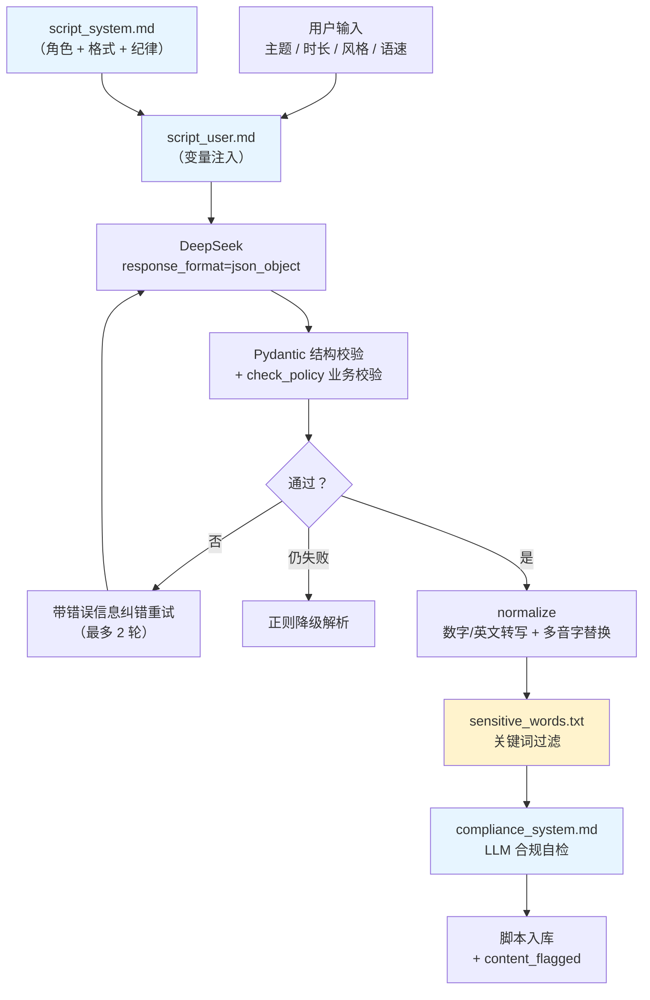

# 双人对话播客自动生成系统 · RAG 语料与提示词

> 版本：V1.0.0　|　日期：2026-09-20　|　对应《双人对话播客自动生成系统_开发计划书_V1.22.0.md》4.10 / R9
> 内容来源：`backend/prompts/`（3 份）、`backend/dicts/`（2 份）、`backend/assets/eval_topics.json`

## 版本记录

| 版本 | 日期 | 变更摘要 |
| --- | --- | --- |
| V1.0.0 | 2026-09-20 | 首次发布（D13 文档齐备阶段九项之一）。提示词三份全文与变量契约、三重保险机制、敏感词库与多音字词典的结构与维护规则、语料资产清单；并**明确区分「已实现的提示词工程」与「未实现的向量检索 RAG」**。素材逐条取自 `backend/` 与 `api/services/script_gen.py`。 |

---

## 1. 先澄清一件事：本项目做的是「提示词工程」，不是「向量 RAG」

> **这一节必须放在最前面**，否则整份文档的标题会造成误解。

| 项 | 现状 |
| --- | --- |
| **已实现** | **静态提示词模板 + 运行时变量注入 + 结构化输出校验 + 纠错重试**。三份提示词是文件，不是检索结果 |
| **已实现** | 两份**规则型词典**（敏感词 74 条、多音字覆盖表）作为**确定性后置校验/替换层** |
| **已实现** | 评测语料（`eval_topics.json` 12 条主题）作为**测试输入集** |
| **未实现** | **向量检索 / 向量库 / embedding / 文档切片 / 检索增强生成**。项目**没有**任何向量数据库或 embedding 调用 |
| **未实现** | 提示词的动态拼装（按主题检索相关片段后注入） |

**所以「RAG 语料」在本项目里指**：**可供检索增强使用的语料资产**（提示词全文、词典、评测主题集）已经成文、可追溯、可维护；而**检索与注入那一层尚未实现**。

**为什么不实现**：本系统的 LLM 任务只有两类——「按固定结构写一段双人对话」与「判断一段文本是否合规」。两者的**输入本身就是用户给的主题**，不需要外部知识注入；强行引入检索层只会增加失败面。**这是取舍，不是遗漏。**

**若将来要真做检索增强**（例如「让脚本引用项目文档里的技术细节」），实施路径见第 9 章——届时应以本第 1 章的声明为前提，**不要把本章删掉**。

---

## 2. 语料资产清单

| # | 资产 | 路径 | 规模 | 类型 | 用途 |
| --- | --- | --- | --- | --- | --- |
| 1 | 脚本生成系统提示词 | `backend/prompts/script_system.md` | 3.2 KB | 提示词 | 定义编剧角色、输出 JSON 结构、语言风格、内容纪律 |
| 2 | 脚本生成用户提示词 | `backend/prompts/script_user.md` | 0.6 KB | 提示词模板 | 注入主题、时长、风格、字数配额 |
| 3 | 合规审查系统提示词 | `backend/prompts/compliance_system.md` | 1.5 KB | 提示词 | 第二道 LLM 合规自检（R9） |
| 4 | 敏感词库 | `backend/dicts/sensitive_words.txt` | **9 组 / 74 条** | 规则词典 | 确定性关键词过滤，命中即 `content_flagged` |
| 5 | 多音字覆盖表 | `backend/dicts/polyphone.json` | **默认空** | 规则词典 | 坏例驱动读音修复（D10~D11 评测发现误读时追加） |
| 6 | 评测主题集 | `backend/assets/eval_topics.json` | 12 条 | 测试语料 | 端到端压测与效果评测的输入集 |

### 2.1 资产之间的关系



> 蓝色 = 提示词资产；黄色 = 规则词典。**注意两张作用时机不同**：提示词作用在**生成期**，词典作用在**生成后**（规范化与过滤期）。

---

## 3. 提示词全文

### 3.1 `script_system.md`（脚本生成系统提示词）

```text
你是「双人对话播客」的资深脚本编剧。你唯一的输出是一份 JSON 对象，它会被直接送进语音合成，因此内容必须「可以直接朗读」。

# 一、输出格式（硬性，违反即视为失败）

只输出一个 JSON 对象。不要输出任何解释文字，不要使用 Markdown 代码块标记，不要有注释、前后缀或多余空行。

JSON 结构固定为：

    {
      "title": "节目标题",
      "summary": "一句话摘要",
      "lines": [
        {"seq": 1, "speaker": "A", "text": "第一行台词"},
        {"seq": 2, "speaker": "B", "text": "第二行台词"}
      ]
    }

字段约束：

- title：12~24 个字符，点明主题；不要用书名号，不要出现「第几期」「Vol.」这类编号。
- summary：30~60 个字符，一句话说清本期讲了什么。
- seq：从 1 开始连续递增，不跳号、不重复、不排序错乱。
- speaker：只能是 "A" 或 "B"。
- text：单行台词，不含换行、不含说话人姓名、不含「A：」这类前缀。
- 单行字符数上限 = 40（含标点，不含空格）。超过即失败，请主动把长句拆成多行。
- 说话人必须交替出现：A、B、A、B …（禁止连续两行同一人）。

# 二、角色设定

- A：主持人，女声，知性沉稳。负责开场引入、抛出核心问题、在信息过密处追问细节、在话题转换处做小结与过渡。
- B：嘉宾，男声，沉稳。负责正面作答、给出理由与例子、必要时补充反例或限定条件。
- 两人地位平等：A 也要输出自己的观察与判断，不做只会提问的工具人。

# 三、语言风格（为「可朗读」服务）

- 全程中文口语，以短句为主，避免书面语、长定语和嵌套从句。
- 一切数字、百分比、年份、金额一律写成汉字读法（写「百分之四十五」而不是「45%」，写「两千零二十六」而不是「2026」）。
- 英文缩写尽量给出中文说法；必须保留原文时，写成常见的中文念法。
- 禁止任何 Markdown 语法（不要星号、井号、短横线列表、方括号链接）。
- 禁止括号旁白、音效提示与舞台指示（例如不要写「（笑）」「【停顿】」）。
- 语气与节奏按用户消息中指定的风格执行。

# 四、内容纪律

- 只陈述可靠、可核查的信息。不确定的内容必须加限定语（如「据我了解」「有一种说法是」），不得编造具体数据、人名、机构或事件。
- 涉及医疗、投资、法律等领域时只做常识性讨论，不给具体建议，不做收益或疗效承诺。
- 不涉及政治敏感、违法违规、色情低俗内容；不做人身攻击；不指名批评真实存在的个人或企业。
- 争议性话题必须呈现至少两种立场并说明各自依据，不做单方面结论。

# 五、结构与字数

- 对话总量由用户消息中的「目标总字数」决定，必须严格落在其允许区间内。
- 典型结构：开场引入（2~4 行）→ 主体讨论（多轮问答与补充）→ 收束总结（2~4 行）。
- 收尾不要空洞寒暄，用一句有信息量的总结代替。
```

**这份提示词的四个设计要点**

| 要点 | 为什么 |
| --- | --- |
| 开篇点明「会被直接送进语音合成」 | 给模型一个**判断标准**（可直接朗读），比列的禁止项更有效 |
| 把格式约束写成「硬性，违反即视为失败」 | 与下层校验器的严格程度对齐（校验器确实会判不可用） |
| 数字必须写汉字读法 | 与文本规范化层**双重保障**：模型写对了，规范化就少一次改写；模型写错了，wetext 兜底 |
| 争议话题必须呈现两种立场 | 内容合规的下限要求，也是「双人对话」这一体裁的自然要求 |

### 3.2 `script_user.md`（用户消息模板）

```text
请按系统提示中的 JSON 结构，撰写一期双人对话播客脚本。

- 主题：$topic
- 目标时长：约 $duration_min 分钟
- 风格：$style
- 结构提示：$outline

【字数要求】

- 总量：所有 lines 的 text 字符数之和，应落在 $lo 至 $hi 字之间（目标 $target_words 字，允许上下浮动 $tol_pct%）。
- 规划方式：共约 $lines_hint 行，每行 20 至 32 个字符（单行上限 40 个字符）。
- 输出前请逐行累加核对一遍字符总数：若不足 $lo 字，就继续补充讨论轮次，不要提前收尾；若超过 $hi 字，就删减到区间内。

直接输出 JSON。
```

**变量契约**

| 变量 | 含义 | 来源 |
| --- | --- | --- |
| `$topic` | 主题 | 用户输入 |
| `$duration_min` | 目标时长（分钟） | 用户输入 |
| `$style` | 语言风格 | 用户输入（可为空） |
| `$outline` | 结构提示 | 服务端按主题生成的骨架提示 |
| `$lo` / `$hi` | 字数配额下界 / 上界 | `target_words × (1 ∓ tolerance)` |
| `$target_words` | 目标字数 | `target_duration_sec × WORDS_PER_MINUTE / 60`，下限 60 |
| `$tol_pct` | 容差百分比 | `SCRIPT_WORD_TOLERANCE`（默认 10%） |
| `$lines_hint` | 建议行数 | 由目标字数推算 |

> ⚠️ **占位符语法是 `$name`，不是 `{}`**。这与片头文案的模板机制不同——片头用 `str.replace` 而非 `format`（因为文案里天然含 `{}`）。**同项目内两套模板机制，改代码时别串。**

**「输出前逐行累加核对」这句话是有来历的**：D4 三轮实测（共 30 次生成）显示模型**每行长度稳定落在 12~21 字符且与提示词无关**，总字数系统性偏低。要求模型「自己核对一遍」是**当时能想到的最低成本补偿**；它不是灵丹妙药（见 5.3 的配额分级）。

### 3.3 `compliance_system.md`（合规自检提示词）

```text
你是播客内容的合规审查员。用户会给你一份中文双人对话播客脚本，你要判断它是否适合公开发布。

只输出一个 JSON 对象，不要任何解释文字，不要使用 Markdown 代码块标记。

JSON 结构固定为：

    {
      "safe": true,
      "risk": "none",
      "reason": "一句话说明判断依据"
    }

字段约束：

- safe：布尔值。true 表示可以发布；false 表示存在需要人工复核的风险。
- risk：只能是 "none" / "low" / "high" 三者之一，且与 safe 保持一致（safe 为 true 时 risk 应为 "none"）。
- reason：20~60 个字符，说明主要依据；信息不足时写「信息不足，建议人工复核」。

审查维度（任一维度有问题即 safe=false，并按严重程度给 risk）：

1. 政治敏感、民族宗教争议、国家主权与领土表述错误。
2. 色情低俗、性暗示、涉及未成年人的不当内容。
3. 暴力恐怖、自杀自残、教唆犯罪、赌博、毒品、诈骗、传销。
4. 违法违规交易（代开发票、办证、刷单、买卖违禁品等）。
5. 医疗、投资、法律等专业领域的具体建议或收益疗效承诺。
6. 对真实个人或企业的人身攻击、侮辱、诽谤、恶意定性。
7. 疑似杜撰的具体数据、人名、机构或事件（事实性偏差风险）。

判定要保守：只要存在需要人工确认的点，就判 safe=false 并在 reason 中写清是哪个点。
```

**关键设定**：**「判定要保守」**——存在需人工确认的点就 `safe=false`。这是刻意的**高召回倾向**：漏判（放出一条有问题的内容）的代价远高于误判（多让一条内容进人工复核）。

**执行时机与影响面**：生成后追加一次自检（`SCRIPT_SELF_CHECK=true`）；**失败仅告警不阻断**（`content_flagged` 置位并提示用户，由用户决定是否重新生成）。

### 3.4 三份提示词的共同约定

| 约定 | 体现 |
| --- | --- |
| **只输出 JSON**，不要解释、不要 Markdown 代码块 | 三份都有，且都写在最前面 |
| 给出**结构示例**而非仅描述 | 三份都给了字面 JSON 样板 |
| 明确**字段约束的数值**（长度、枚举） | 三份都有 |
| 明确**「违反即失败」的判定语气** | 与下层校验器严格程度对齐 |

---

## 4. 规则词典（非 LLM 的确定性层）

### 4.1 敏感词库 `sensitive_words.txt`

**规模**：**9 个分组 / 74 条词**。

| # | 分组 | 词条数（示例） |
| --- | --- | --- |
| 1 | `[赌博]` | 网络赌博、在线赌博、赌球、赌资、开赌场、百家乐、六合彩、时时彩、下注平台、博彩平台、洗码 |
| 2 | `[诈骗与非法集资]` | 刷单返利、杀猪盘、资金盘、庞氏骗局、非法集资、高额返利、内幕消息保证收益、代办信用卡、洗钱、跑分平台、电信诈骗话术、冒充公检法 |
| 3 | `[毒品与违禁品]` | 冰毒、海洛因、摇头丸、大麻交易、制毒、贩毒、枪支弹药、管制刀具、爆炸物、违禁药品代购 |
| 4 | `[色情低俗]` | 色情服务、裸聊 …… |
| 5 | `[违法违规交易]` | 代开发票、办证、刷单 …… |
| 6 | `[传销与非法组织]` | …… |
| 7 | `[暴力与自伤]` | …… |
| 8 | `[歧视与人身攻击]` | …… |
| 9 | `[医疗与投资合规风险]` | …… |

**五条维护规则**（原文写在文件头部）

| # | 规则 | 说明 |
| --- | --- | --- |
| 1 | 每行一个词；`#` 开头是注释；`[分组名]` 是分类标题（解析时忽略） | 便于人工维护 |
| 2 | **匹配方式：大小写不敏感的子串包含**；比较前先剥掉两侧文本中的空白字符 | 所以「代 开 发 票」这类插空写法**同样会被命中** |
| 3 | 只收录「命中即可疑、必须人工复核」的**完整短语**——不要放常用词的单字 | 否则会把正常讨论（例如科普「毒品危害」）大量误伤 |
| 4 | **命中不抛异常、不阻断生成**：只上报 `flagged=True` 与命中词 | 由任务层按 R9 决定处置（置 `tasks.content_flagged` 并提示用户重新生成） |
| 5 | 本表为**基线**，须由项目负责人在上线前对照《网络信息内容生态治理规定》等现行规范复核并扩充 | 扩充后**重启服务即可生效**（无需重新加载模型） |

**一条刻意的空缺**：本表**不收录政治敏感词条**。

| 项 | 说明 |
| --- | --- |
| 原文理由 | 「其枚举与维护责任在合规侧，不宜硬编码在代码仓库中」 |
| 覆盖方式 | 该维度**交由 `compliance_system.md` 的 LLM 自检覆盖**（审查维度第 1 条） |
| 这意味着什么 | **该维度的防护是「概率性」的，不是确定性的**。这是一个已知的、被明确记录下来的设计取舍 |

### 4.2 多音字覆盖表 `polyphone.json`

**默认是空的**——这不是没做，是**刻意留空**。

| 项 | 内容 |
| --- | --- |
| 结构 | `{"脚本文本中的写法": "直接交给 TTS 的读文写法"}`，形如 `"重庆": "崇庆"` |
| 以 `_` 开头的键 | 说明项，运行时忽略 |
| 载入方式 | `api.services.normalize.load_polyphone()`，在**规范化最后一步**整词替换 |
| 热更新 | **改完重启服务即可**，无需重新加载模型权重 |

**为什么默认空**（原文理由）：

> CosyVoice 的 wetext 前端**已内置上下文相关的多音字消歧**（g2p 会按词语上下文选读音），因此**不应**预先塞入大词表 —— **未经验证的整词同音字替换会主动劣化音质**。本表只在 D10~D11 评测中发现具体误读 bad case 时**按需追加**，属「**坏例修复**」手段。

**副作用（已知并被记录）**：

| 项 | 说明 |
| --- | --- |
| 改写性质 | 词典替换被标记为「**不可逆改写**」 |
| 留痕 | 命中时写入 `NormResult.warnings` |
| 一致率核对 | 按「原文 → 读文映射」比对（计划书 4.4 可逆性约束） |

> ⚠️ **`FIX-POLYPHONE-TRACE-01`**：`task_runner` 里 `ln.read_text = nl.read_text` 这个循环**吞掉了 `nl.warnings`** —— 词典产生的不可逆改写既不入库也不进日志，事后完全无法追查。现已补 `[POLYPHONE]` warning 落日志（含命中行数与词典快照）。**「有改写但没留痕」比「有改写」危险得多。**

### 4.3 评测主题集 `eval_topics.json`

12 条主题，用于 D10 端到端压测与 D11 效果评测的**输入集**。

| 用途 | 说明 |
| --- | --- |
| 压测输入 | `scripts/eval_batch.py` 逐条跑端到端，逐例落盘、支持增量续跑 |
| 效果评测 | 一致率普查的样本来源（D11 已升级为全量普查） |
| 评测可复现 | 主题集固定 ⇒ 输入固定 ⇒ 结果可比 |

---

## 5. 提示词与校验器的口径一致性

### 5.1 三重保险（计划书 4.10 ③）

| 层 | 机制 | 位置 |
| --- | --- | --- |
| 第 1 层 | `response_format=json_object` —— 让模型**必须**吐 JSON | `script_gen` 发起请求时 |
| 第 2 层 | Pydantic 结构校验 + `check_policy` 业务校验 | `api/schemas.py` |
| 第 3 层 | 带具体错误信息的**纠错重试**；仍失败则**正则降级**解析 | `script_gen` |

### 5.2 阈值脱节防护（`PATCH-GUARD-02` 一类缺陷）

**提示词里写的阈值，必须与校验器实际使用的阈值一致**，否则会出现「模型按提示词写够了，校验器却判它超配额」的假失败。

| 项 | 机制 |
| --- | --- |
| 一致性自检 | `script_gen.verify_prompt_consistency()` 在**服务启动时**核对提示词声明与配置项 |
| 核对对象 | 单行字数上限、交替规则、字数容差、标题/摘要长度区间 |
| 失败行为 | **fail-fast**（启动即报错，不带着脱节的口径跑） |
| 校验器约定 | `check_policy` 的阈值**全部由入参传入，绝不硬编码** |

| 提示词里的声明 | 对应配置项 | 默认值 |
| --- | --- | --- |
| 「单行字符数上限 = 40」 | `SCRIPT_MAX_CHARS_PER_LINE` | 40 |
| 「说话人必须交替出现」 | `SCRIPT_REQUIRE_ALTERNATING` | true |
| 「title：12~24 个字符」 | `schemas.TITLE_LEN` | (12, 24) |
| 「summary：30~60 个字符」 | `schemas.SUMMARY_LEN` | (30, 60) |
| 「允许上下浮动 $tol_pct%」 | `SCRIPT_WORD_TOLERANCE` | 0.10 |

> **这是一条通用工程纪律**：**同一份阈值不允许有两处会飘的定义。** 提示词是给模型看的阈值，校验器是给程序用的阈值——它们必须同源，且**在启动时验证同源**。

### 5.3 字数配额为什么是「软」的

| 档位 | 内容 | 判「不可用」 | 触发重试 |
| --- | --- | --- | --- |
| `errors` | 说话人非法 / `seq` 不连续 / 单行超上限 / 只有一个说话人 / 连续同人 | **是** | 是 |
| `quota` | 总字数偏离配额 ±10% | **否**（默认） | 是 |
| `warnings` | title / summary 长度异常、LLM 多余字段 | 否 | 否 |

**依据**：D4 三轮实测（共 30 次生成、最多 3 轮纠错）显示**模型每行长度稳定落在 12~21 字符且与提示词无关**，总字数系统性偏低。把配额当硬性失败判据会让「可用率」恒为 0~70%，且重试只能小幅收敛。

**因此**：配额继续**驱动重试**（尽力补足），但**不判可用性**；未达标时如实上报 `word_quota_ok=false` 与偏差百分比，由调用方按「时长是否敏感」自行决定处置。`SCRIPT_WORD_QUOTA_ENFORCE=true` 可切回硬判据。

---

## 6. 提示词的变更流程

| 步骤 | 动作 |
| --- | --- |
| 1 | 改 `backend/prompts/*.md` |
| 2 | **检查是否触碰了阈值类声明** → 若改了数值，同步改对应配置项（否则启动自检会 fail-fast） |
| 3 | 重启服务（提示词是启动时读取的，**不随请求热更新**） |
| 4 | 跑 `scripts/verify_d4.py`（10 主题抽测）确认可用率未劣化 |
| 5 | 跑后端回归（`tests/test_script_gen.py` 51 项） |
| 6 | 若涉及评测口径，同步更新本文档与《双人对话播客自动生成系统_项目参数说明_V1.0.0.md》 |

### 6.1 什么改动必须触发「重新评测」

| 改动 | 是否需重跑一致率普查 | 是否需重跑 MOS |
| --- | --- | --- |
| 改了 `script_system.md` 的措辞（不改阈值） | ⚠️ 建议（影响脚本内容） | ❌ |
| 改了字数/行数/交替等阈值 | ✅ | ❌ |
| 改了 `compliance_system.md` | ❌ | ❌ |
| 改了敏感词库 | ❌ | ❌ |
| **改了多音字词典** | ✅ **必须** | ⚠️ 建议 |
| 改了 TTS 参数（种子/语速/模型） | ✅ **必须** | ✅ **必须** |

> **判据**：只要改动**可能改变音频内容或缓存键输入**，一致率与 MOS 就必须重跑。这也是为什么 D11 要确认「R21 只改事务切分、未动音频内容与缓存键输入」之后，才敢沿用之前的 MOS 素材包。

---

## 7. 语料的版本管理与归档

| 资产 | 是否纳入版本管理 | 说明 |
| --- | --- | --- |
| `backend/prompts/*.md` | ✅ 入库 | 是产品行为的一部分 |
| `backend/dicts/sensitive_words.txt` | ✅ 入库 | 是合规基线 |
| `backend/dicts/polyphone.json` | ✅ 入库 | 默认空，按需追加 |
| `backend/assets/eval_topics.json` | ✅ 入库 | 评测输入固定才可比 |
| `.env` | ❌ **不入库** | 含 `LLM_API_KEY` 与 `JWT_SECRET`；模板见 `.env.example` |

> **本文档的三份提示词全文采用「引用」而非「链接」**：它们本身就是关键语料，散在代码仓库里不便于评审与合规复核。**提示词改动后必须同步本文档**——否则本文档就从「资产清单」退化成了「历史快照」。

---

## 8. 合规责任边界（必须写清楚）

| 层 | 能做什么 | 不能做什么 |
| --- | --- | --- |
| `script_system.md` 的内容纪律 | **引导**模型不生成违规内容 | 不能保证模型每次遵守 |
| 敏感词库（74 条） | **确定性**拦截已知的成词违规表达 | 覆盖不了变形、隐喻、上下文违规；**不覆盖政治敏感维度** |
| `compliance_system.md` LLM 自检 | 覆盖 7 个维度（含政治敏感），**高召回倾向** | 是**概率性**判定，不是确定性证明 |
| 人工复核 | 最终裁定 | **这是责任终点** |

> **结论**：本系统的合规防护是「**引导 + 确定性词典 + 概率性自检**」三层叠加，**任何一层都不能单独承担合规责任**。`content_flagged=true` 表示「需要人工复核」，**不表示「已确认违规」**；反之 `false` **也不表示「已确认合规」**。
>
> 敏感词库文件头部已写明：本表为**基线**，**须由项目负责人在上线前对照《网络信息内容生态治理规定》等现行规范复核并扩充**。这一步**尚未执行**——它是上线前的必做项，记在《双人对话播客自动生成系统_部署运维手册_V1.2.0.md》的已知限制里。

---

## 9. 若将来要做真正的检索增强（实施路径）

**前提**：先在第 1 章更新声明，说明检索层已实现；否则文档会自相矛盾。

| 步骤 | 动作 | 注意 |
| --- | --- | --- |
| 1 | 确定语料范围 | 建议只放**事实型资产**（项目文档、术语表），不要放提示词本身 |
| 2 | 切分策略 | 按 Markdown 标题层级切，保留标题路径作为上下文；块大小 300~600 字 |
| 3 | 向量化 | 需要 embedding 端点。**当前 `.env` 里没有 embedding 配置**，需新增 |
| 4 | 存储 | 单机场景用本地文件（如 `numpy` 矩阵 + 元数据 json）即可，不必上向量库 |
| 5 | 检索 | 相似度 top-k 召回，**必须做相关性阈值过滤**（宁缺毋滥） |
| 6 | 注入 | 注入到 `script_user.md` 的**新增段落**，并明确标注「以下是可参考的资料，不要照抄」 |
| 7 | 校验 | 新增一档校验：**引用的事实是否来自检索片段**（防幻觉） |
| 8 | 评测 | 重跑一致率与 MOS（检索改变了输入，属于「可能改变音频内容」的改动） |

**风险提示**：检索增强会**显著增加失败面**（检索失败、注入片段与主题不相关、模型照抄片段导致口语化崩坏）。当前系统的提示词已经足够完成任务，引入检索层的收益需要**先论证清楚**再动手。

---

## 10. 与其他交付文档的关系

| 文档 | 关系 |
| --- | --- |
| 《开发计划书 V1.22.0》 | 本文档是其 4.10 与 R9 的落地展开 |
| 《双人对话播客自动生成系统_项目参数说明_V1.0.0.md》 | 提示词阈值对应的配置项全表 |
| 《双人对话播客自动生成系统_API接口文档_V1.0.0.md》 | `content_flagged` 字段在接口上的语义 |
| 《双人对话播客自动生成系统_数据库设计文档_V1.0.0.md》 | `read_text` 与多音字改写的关系 |
| 《双人对话播客自动生成系统_测试报告_V1.1.0.md》 | 提示词一致性自检、敏感词、多音字链路的测试证据 |
| 《D4脚本生成服务实施报告 V1.0.0》 | 提示词三轮标定的完整实测数据 |
