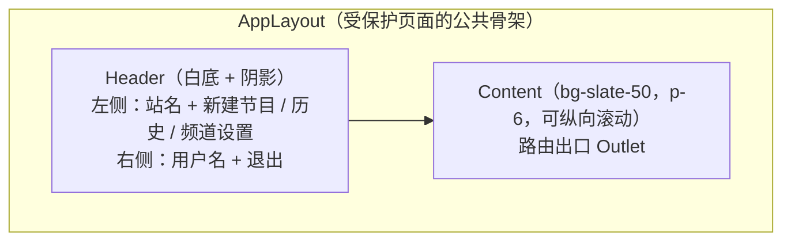
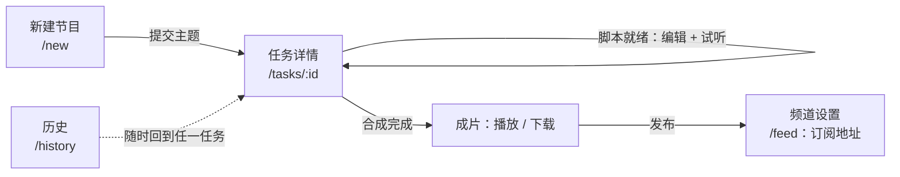
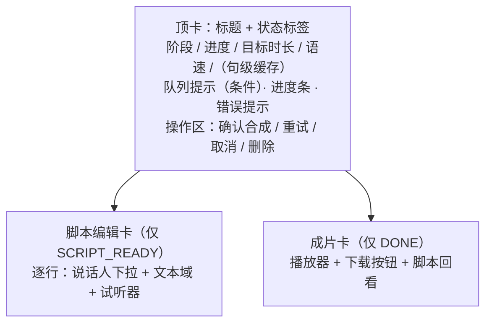
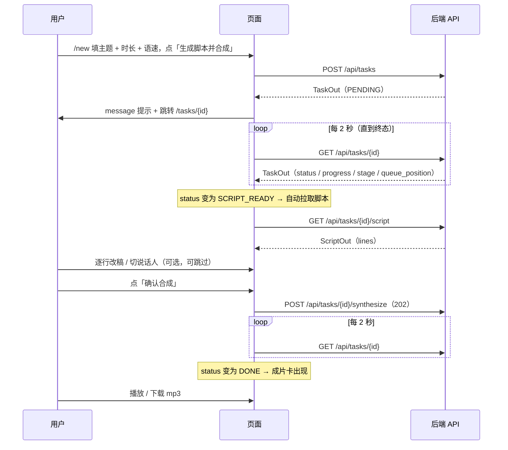

# 双人对话播客自动生成系统 · UI/UX 设计说明

> 版本：V1.0.0　|　日期：2026-09-20　|　对应《双人对话播客自动生成系统_开发计划书_V1.21.0.md》第 5 章
> 技术形态：**React 18 + Vite + TypeScript**　|　组件库：**Ant Design 5**　|　样式：**Tailwind CSS 3**（布局与工具类）

## 版本记录

| 版本 | 日期 | 变更摘要 |
| --- | --- | --- |
| V1.0.0 | 2026-09-20 | 首次发布（D13 文档齐备阶段九项之一）。信息架构与路由、6 个页面的交互与状态设计、状态呈现规范（队列位置 / 缓存读数）、反馈与异常处理、空态清单、可访问性与已知缺口。素材逐条取自 `frontend/src/`。 |

> **本文档的性质**：它**描述现状**，不是设计愿景。凡是「设计上没做」的地方，本文档如实列在「已知缺口」里，不粉饰成「按需扩展」。
> 界面文案、色值、组件选型全部从代码读取。

---

## 1. 设计目标与原则

### 1.1 谁在用、在什么场景用

| 角色 | 场景 | 频次 | 对界面的核心诉求 |
| --- | --- | --- | --- |
| 内容创作者（主要用户） | 想好一个主题 → 提交 → 拿到可播的成片与订阅地址 | 每期一次 | **少操作、状态明确**：提交后不用盯，回来能看到成片 |
| 同一位用户（二次进入） | 脚本阶段回来看一眼、必要时改两句 | 每期 0~1 次 | **改得动、改完知道会怎样** |
| 播客听众 | 用 RSS 客户端订阅 | 持续 | **不接触本界面**（本系统的听众侧出口是 RSS，不是 Web） |

**由此得出的第一条设计原则**：这不是一个「用得越久越好」的产品界面。**它的成功标准是用户尽快离开**——提交完就去做别的事，回头直接拿走成片。

### 1.2 四条设计原则

| # | 原则 | 在界面上的体现 |
| --- | --- | --- |
| 1 | **状态必须可判**，不能靠猜 | 每个任务都有状态标签（`PENDING`…`DONE`）+ 阶段文案 + 进度条；错误态直接把 `error_msg` 显示出来 |
| 2 | **长任务不阻塞人** | 提交后立即跳详情页，轮询展示进度；用户可随时离开、从历史列表回来 |
| 3 | **「没有信息」和「信息是 0」必须区分开** | 队列位置 `null` 不显示；缓存命中率 `null` 不显示（见第 5 章） |
| 4 | **破坏性操作必须二次确认** | 取消、删除走 `Popconfirm` |

### 1.3 界面风格取向

| 项 | 选择 | 理由 |
| --- | --- | --- |
| 组件库 | **Ant Design 5** | 任务书指定后台管理端用 AntD；表单/表格/反馈组件完备，开发效率优先 |
| 布局工具 | **Tailwind** | 只用于间距、栅格、背景色等工具类；组件外观交给 AntD，避免两套设计语言打架 |
| 整体调性 | 白底 + `slate-50` 内容区 + 克制的彩色标签 | 工具型界面：信息密度优先，不做视觉炫技 |
| 主色 | 沿用 AntD 默认主题（未做主题定制） | 现状即如此，未引入 `ConfigProvider` 主题覆盖 |

---

## 2. 信息架构与路由

### 2.1 路由表

| 路径 | 页面 | 鉴权 | 说明 |
| --- | --- | --- | --- |
| `/login` | 登录 | 公开 | 未登录访问受保护页会被重定向到此，并记住来源 |
| `/register` | 注册 | 公开 | 注册成功即登录 |
| `/` | — | 需登录 | **重定向到 `/new`** |
| `/new` | 新建节目（提交主题） | 需登录 | 主入口 |
| `/tasks/:id` | 任务详情 | 需登录 | 进度、脚本编辑、试听、成片播放与下载 |
| `/history` | 历史节目 | 需登录 | 分页列表 |
| `/feed` | 频道设置与 RSS | 需登录 | 频道元数据 + 订阅地址 |
| `*`（兜底） | — | — | **重定向到 `/`** |

### 2.2 页面骨架

受保护路由统一包在 `AppLayout` 里：



| 区域 | 内容 | 交互 |
| --- | --- | --- |
| 站名 | 「双人对话播客生成」 | 纯文本，不可点（**不是首页链接**） |
| 导航 1 | 「新建节目」→ `/new` | 普通链接 |
| 导航 2 | 「历史」→ `/history` | 普通链接 |
| 导航 3 | 「频道设置」→ `/feed` | 普通链接 |
| 右侧 | 当前用户名（只读）+ 「退出」按钮 | 退出后跳 `/login` |

> ⚠️ **现状提示**：导航**没有当前项高亮**（未使用 `NavLink` 的 active 态）。页面切换后，用户只能靠内容判断自己在哪一页。这属于已知缺口（见第 9 章）。

### 2.3 导航心智模型

三页对应任务生命周期的三段，而不是三个平行的功能区：



**用户不需要理解状态机**，但界面在每个节点都告诉他「现在能做什么、下一步是什么」。

---

## 3. 页面级设计

### 3.1 登录页 `/login`

| 项 | 内容 |
| --- | --- |
| 布局 | 全屏居中卡片（`w-96`），背景 `slate-50` |
| 标题 | 「登录 · 双人对话播客生成」 |
| 字段 | 用户名（自动聚焦）、密码（`Input.Password`） |
| 主操作 | 「登录」按钮，**块级占满**，带 loading |
| 次操作 | 「没有账号？去注册」文字链接 |
| 校验 | 两个字段均 `required`，空值前端拦截（提示文案在字段下方） |
| 失败反馈 | 顶部 `message.error`（后端返回的 `用户名或口令错误`） |

**登录后的跳转**：优先回**来源页**（`location.state.from.pathname`），没有则去 `/new`。

> **设计意图**：用户从 `/tasks/abc` 被踢到登录页时，登录后应回到那个任务，而不是回到首页重新找。

### 3.2 注册页 `/register`

| 项 | 内容 |
| --- | --- |
| 布局 | 同登录页（居中卡片） |
| 字段 | 用户名、密码（约束与后端一致：3~32 位 ASCII、口令 ≥6 位） |
| 主操作 | 「注册」（块级，带 loading） |
| 次操作 | 「已有账号？去登录」 |
| 成功 | 直接进入已登录状态并跳转（后端注册即签发令牌） |

### 3.3 新建节目页 `/new`

**这是全系统最高频的入口，设计目标是「填两个字段就能提交」。**

| 字段 | 控件 | 默认值 | 约束 | 说明 |
| --- | --- | --- | --- | --- |
| 主题 | 单行输入 | — | 必填，≤200 字 | 占位提示给了一个示例主题（降低「不知道填什么」的摩擦） |
| 目标时长（分钟） | 数字输入（步长 0.5） | **5** | 0.5~60 | 决定字数配额与订阅单集时长 |
| 语速 | 滑块（步长 0.05） | **1.0** | 0.5~2.0 | 实时显示当前值 |
| 语言风格（可选） | 单行输入 | 空 | — | 占位提示「轻松闲聊、知识科普」 |

| 交互 | 行为 |
| --- | --- |
| 提交按钮文案 | **「生成脚本并合成」**（如实描述会发生什么，不写「确定」） |
| 提交中 | 按钮 loading，防重复提交 |
| 成功 | `message.success('已创建任务，正在生成脚本…')` → **立即跳转** `/tasks/{id}` |
| 失败 | `message.error`（显示后端 `detail`） |

> **重要交互决定**：按钮文案是「生成脚本并合成」，但**实际流程会先停在脚本确认阶段**（`SCRIPT_READY`）等用户点「确认合成」。这是**刻意的两阶段设计**（给用户改稿机会），但文案与流程存在**语义落差**——用户可能以为点了就直接出成片。
> 缓解措施：提交后立即跳详情页，页面在 `SCRIPT_READY` 时自己拉取脚本并把编辑区展开，「确认合成」按钮就在眼前。

### 3.4 任务详情页 `/tasks/:id`（信息密度最高的一页）

#### 3.4.1 页面结构（按状态分块渲染）



#### 3.4.2 顶卡

| 元素 | 内容 | 条件 |
| --- | --- | --- |
| 标题 | 优先 `script_title`，为空则退回 `topic` | 恒显 |
| 状态标签 | `Tag`，颜色映射见 5.1 | 恒显 |
| 阶段 | `task.stage`（如「正在合成第 3/27 句」），空则显示 `-` | 恒显 |
| 进度 | `{progress}%` | 恒显 |
| 目标时长 | `round(target_duration_sec / 60)` 分钟 | 恒显 |
| 语速 | `{speed}x` | 恒显 |
| **句级缓存** | `句级缓存命中 14/27（51.9%）` | **仅当 `showCache()` 为真** |
| 队列提示 | `Alert type="info"`，如「前面还有 2 个任务」 | **仅当「在排队且不是自己正在跑」** |
| 进度条 | `Progress` | **非终态时** |
| 错误提示 | `Alert type="error"`，直接显示 `error_msg` | 有值时 |

#### 3.4.3 操作区（按状态显隐）

| 按钮 | 显示条件 | 行为 |
| --- | --- | --- |
| **确认合成**（primary） | `status === SCRIPT_READY` | 调 `synthesize`，成功后重置「脚本已拉取」标记 |
| **重试** | `status === FAILED` | 调 `retry`（断点续跑） |
| **取消**（danger + Popconfirm） | `PENDING` 或 `SCRIPT_READY` | 调 `cancel` |
| **删除**（danger + Popconfirm） | 恒显 | 调 `delete`，成功后跳 `/history` |

> **删除按钮恒显**（不限于终态）是刻意的：用户想中止一期节目时，不必先搞清「现在能不能删」。

#### 3.4.4 脚本编辑卡（仅 `SCRIPT_READY`）

进入该状态时**自动拉取一次脚本**（`useRef` 保证每任务只拉一次），然后每行渲染为一行：

| 列 | 控件 | 宽度 | 说明 |
| --- | --- | --- | --- |
| 说话人 | `Select`（A 说话人 / B 说话人） | 96 px | 行级切换说话人 |
| 台词 | `Input.TextArea`（自适应高度 1~4 行） | 弹性 | 直接改文本 |
| 试听 | `<audio controls>`，src = 该行首段缓存音频 | 176 px | **仅当该行 `seg_status === 'DONE'`** |
| （否则） | 灰字「尚未合成」 | 176 px | — |

**卡头右侧**：「保存脚本」按钮。
**卡脚提示**（原文）：*「保存后再点「确认合成」：未改动的句子命中句级缓存，不会重复推理。」*

> 这句提示是界面里**最重要的一句文案**——它把「改稿不会导致全部重算」这个非显然的事实告诉用户，直接消除了「不敢改」的心理成本。

#### 3.4.5 成片卡（仅 `DONE`）

| 元素 | 内容 |
| --- | --- |
| 播放器 | `<audio controls src=".../audio">`，占满宽度 |
| 下载 | 「下载 mp3」按钮（primary，`href` 指向 `/download`） |
| 脚本回看 | 若有脚本数据：逐行渲染 `Tag`（A=蓝 / B=橙）+ 文本 |

> ⚠️ **缺口**：成片卡里的「脚本回看」**依赖 `script` 状态是否已被加载**。而脚本只在 `SCRIPT_READY` 阶段被拉取过——如果用户这次会话是**直接打开一个已完成任务**（没有经过脚本阶段），`script` 为 `null`，脚本回看**不会出现**。见第 9 章。

### 3.5 历史节目页 `/history`

| 项 | 内容 |
| --- | --- |
| 布局 | 居中卡片（`max-w-3xl`） |
| 列表项标题 | 优先 `script_title`，为空则退回 `topic`；后接状态标签 |
| 列表项描述 | `{分钟} 分钟 · {行数} 句 · {进度}%`，**后接条件渲染的队列提示与缓存读数** |
| 行操作 | 「打开」文字按钮 → `/tasks/{id}` |
| 分页 | 底部「上一页 / 下一页」，**按页加载**（非无限滚动），页大小 20 |
| 分页按钮禁用逻辑 | 上一页：`page <= 1`；下一页：`page * 20 >= total` |
| 空态 | `Empty` + 文案「还没有节目，去新建一期吧」 |
| 加载态 | `List` 自带 loading 骨架 |

> **列表项里就显示队列位置与缓存读数**，是为了让用户**不点进去就知道**「我排在第几」「这期复用了多少缓存」。这是把可观测性下沉到列表层的刻意选择。

### 3.6 频道设置页 `/feed`

| 区块 | 内容 |
| --- | --- |
| 元数据表单 | 频道标题、频道描述（多行）、分类（iTunes，占位示例 `Technology / Society`）、「包含露骨内容」开关 |
| 保存 | 「保存」按钮 |
| 订阅源区 | **RSS 地址**（可一键复制）、**封面地址**（可一键复制） |
| 危险操作 | 「重置订阅地址（旧地址立即失效）」danger 按钮 |

**关键实现细节**：

| 项 | 现状 |
| --- | --- |
| RSS 地址展示 | 由前端用 `window.location.origin + /feed/{user_token}.xml` **自行拼接**（未使用后端返回的 `feed_url` 字段） |
| 封面地址 | 直接展示 `feed.cover_url`，未配置则显示「未配置」 |
| 重置后果提示 | 按钮文案自带后果说明；**重置前没有二次确认弹窗** |

> ⚠️ **两处需要注意**：
> 1. **重置没有 `Popconfirm`**（其余危险操作都有）。按钮文案已写明后果，但**一次点击即生效且不可逆**（旧订阅地址立即失效，已订阅的客户端会失联）。
> 2. 前端自行拼 URL 意味着：若后端 `PUBLIC_BASE_URL` 配置的域名与用户当前访问域名不同，**页面上给出的订阅地址与 RSS 里 enclosure 的地址可能不一致**。用户按页面地址订阅没问题，但要知道这一层差异。

---

## 4. 核心交互流程

### 4.1 从主题到成片



### 4.2 轮询策略

| 项 | 值 |
| --- | --- |
| 间隔 | **2000 ms** |
| 终止条件 | 状态进入 `DONE` / `FAILED` / `CANCELED` 时 `clearInterval` |
| 实现 | `setInterval` + `alive` 标志（组件卸载时停止，避免对已卸载组件 setState） |
| 失败处理 | 单次请求失败 `message.error`，**不中断轮询** |
| 切换任务 | 切换 `:id` 时重置任务与脚本状态（`useEffect` 依赖 `id`） |

> **为什么用轮询而不是 WebSocket/SSE**：单并发任务队列、单机部署、进度更新频率低（秒级）。轮询的实现与排障成本远低于长连接，且与「刷新页面即可恢复」的行为天然一致。代价是固定 2 秒一次的空转请求——在这个规模下可接受。

### 4.3 鉴权状态的维持

| 环节 | 机制 |
| --- | --- |
| 凭据存储 | **JWT 在 HttpOnly Cookie**（后端下发）；**用户名在 localStorage**（仅用于显示） |
| 为什么还要 localStorage | 后端**没有 `/me` 接口**，无法从 Cookie 反查当前用户是谁 |
| 启动校验 | 应用启动时打一次 `GET /api/tasks?page=1&page_size=1`；若返回 **401** 则清掉 localStorage 里的用户并视为未登录；网络错误则保留现状 |
| 路由守卫 | `ProtectedRoute` 包裹受保护页面，未登录重定向到 `/login` 并记录来源 |
| 退出 | 调 `/api/auth/logout` 清 Cookie + 清 localStorage |

> **现状的两个边界**：① 网络异常时**不会**把用户踢出登录（保留现状是更友好的选择）；② 没有刷新令牌机制，24 小时后需重新登录。

---

## 5. 状态呈现规范

### 5.1 任务状态的颜色与文案

| 状态 | 标签颜色 | 界面含义 |
| --- | --- | --- |
| `DONE` | 🟢 `green` | 完成，可播放下载 |
| `FAILED` | 🔴 `red` | 失败，可重试（显示 `error_msg`） |
| `CANCELED` | 🔴 `red` | 已取消 |
| 其余（`PENDING`/`SCRIPTING`/`SCRIPT_READY`/`SYNTHESIZING`/`POSTPROCESSING`/`PACKAGING`） | 🔵 `processing` | 进行中 |

标签上显示的是**原始状态英文常量**（如 `SCRIPT_READY`），不做中文映射。

> ⚠️ **这是有意的**：状态常量与后端、日志、文档完全一致，排障时用户报「卡在 `POSTPROCESSING`」能直接对上。**代价**是普通用户看不懂。
> 缓解：旁边还有 `stage` 字段的中文阶段文案（如「正在合成第 3/27 句」）承担「说人话」的职责。

### 5.2 队列位置的呈现（**最容易写错的一处**）

**后端口径**：`queue_position` 的 **`0` 表示「正在跑」**（不是「前面还有 0 个」），1 = 下一个，2 = …，`null` = 不在队列。

| `queue_position` | 显示文案 | 显示条件 |
| --- | --- | --- |
| `0` | 「正在合成」 | 但在**详情页**，`pos === 0` 时**刻意不显示**——「阶段 + 进度条」已说明一切 |
| `1`、`2`… | 「前面还有 N 个任务」 | 显示 |
| `null` 且 `status === PENDING` | 「已提交，排队中…」 | 显示（唯一例外，见下） |
| `null` 且其他状态 | **不显示** | — |

**`null` 为什么有一个 `PENDING` 例外**：后端返回的 `null` 无法区分「还没进队列」与「队列已丢」。而对 `PENDING` 状态，「已提交，排队中…」**必然为真**——说这句话不会错。

**闸门统一（防止两处漂移）**：

| 函数 | 位置 | 职责 |
| --- | --- | --- |
| `queueLabel(t)` | `src/lib/taskView.ts` | 逻辑 → 文案（含 `null` 的例外处理） |
| `showQueue(t)` | 同文件 | **该不该显示**（含状态白名单） |

> ⚠️ **详情页与列表页必须共用同一个 `showQueue` 闸门**。原注释写得很直白：两处各写一套判断，「就是下一次漂移的种子（列表页会白名单过滤，详情页不会，两边迟早对不上）」。详情页**唯一**外加的例外是 `pos === 0` 不显示。

### 5.3 缓存命中率的呈现

| 读数 | 显示文案 | 说明 |
| --- | --- | --- |
| `cache_hit_rate` 为有效数字且 `cache_seg_count > 0` | 「句级缓存命中 14/27（51.9%）」 | 百分比保留 1 位小数 |
| `cache_hit_rate === null`（等价于 `cache_seg_count === 0`） | **不显示** | **绝不能退化成「命中 0%」** |
| `cache_seg_count <= 0` 读数不自洽 | **不显示** | 防御性处理 |

**为什么「不显示」和「显示 0%」是两件事**：`seg = 0` 意味着**还没开始算**，而「0%」会被读成「一个都没命中」。前者是「没有信息」，后者是「信息是负面的」——对用户的心理影响完全相反。

### 5.4 显示时机白名单

| 可观测性字段 | 可见状态 |
| --- | --- |
| 队列位置 | `PENDING`、`SCRIPTING`、`SYNTHESIZING`、`POSTPROCESSING`、`PACKAGING` |
| 缓存读数 | `SYNTHESIZING`、`POSTPROCESSING`、`PACKAGING`、`DONE` |

> 缓存读数**包含 `DONE`**：成片出来后回看「这期复用了多少缓存」是有意义的运维信息。

---

## 6. 反馈与异常处理

### 6.1 反馈手段清单

| 手段 | 组件 | 用途 | 出现位置 |
| --- | --- | --- | --- |
| 轻提示 | `message.success/error` | 操作结果、接口错误 | 顶部浮层，自动消失 |
| 内联警告 | `Alert type="info"` | 队列排队提示 | 详情页顶卡内 |
| 内联错误 | `Alert type="error"` | 任务失败原因（`error_msg`） | 详情页顶卡内 |
| 二次确认 | `Popconfirm` | 取消 / 删除 | 按钮上方 |
| 加载中 | `Spin` / 按钮 `loading` | 首屏与提交中 | 内容区居中 / 按钮内 |
| 空态 | `Empty` | 无数据 | 历史列表 |
| 进度 | `Progress`（`status="active"`） | 任务进度 | 详情页顶卡 |

### 6.2 错误文案的来源

统一原则：**优先显示后端 `detail`，后端没给才用兜底文案**。

```typescript
message.error((e as Error).message || '创建失败')
```

| 场景 | 用户看到 |
| --- | --- |
| 创建任务失败 | 后端 `detail`（如「用户名已存在：xxx」） |
| 保存脚本失败 | 后端 `detail` 或「保存失败」 |
| 合成提交失败 | 后端 `detail` 或「合成提交失败」 |
| 轮询单次失败 | 后端 `detail`（不中断轮询） |
| 登录失败 | 后端 `detail`（`用户名或口令错误`） |

> **为什么不在前端做错误码映射**：后端已经返回了人类可读的中文 `detail`（见《API接口文档》第 8 章），前端再维护一层映射表就是**第二处会飘的定义**。

### 6.3 防御性交互

| 场景 | 处理 |
| --- | --- |
| 重复提交 | 提交按钮 `loading` |
| 切换任务 | 重置 `task` / `script` / `lines` 与「已拉取脚本」标记 |
| 组件卸载后轮询回调 | `alive` 标志拦截 |
| 脚本拉取 | `useRef` 保证**每任务只拉一次**（避免轮询触发重复请求） |
| `target_duration_sec` 显示 | `Math.round(sec / 60)` —— 分钟级展示，不显示秒 |

---

## 7. 空态、加载态与边界

| 位置 | 状态 | 呈现 |
| --- | --- | --- |
| 详情页首次进入 | 任务未加载 | 居中 `Spin`（高 64 单位） |
| 详情页 | 脚本拉取中 | 编辑卡内居中 `Spin`（高 32 单位） |
| 详情页 | 该行未合成 | 灰字「尚未合成」（代替试听器） |
| 历史页 | 无数据 | `Empty`「还没有节目，去新建一期吧」 |
| 历史页 | 加载中 | `List` 骨架 |
| 频道页 | 配置加载中 | RSS 地址显示「加载中…」 |
| 频道页 | 未配置封面 | 显示「未配置」 |
| 详情页 | `stage` 为空 | 显示 `-` |

---

## 8. 视觉规范

### 8.1 字体

```
-apple-system, BlinkMacSystemFont, 'Segoe UI', 'PingFang SC',
'Hiragino Sans GB', 'Microsoft YaHei', sans-serif
```

系统字体栈：**中文优先命中 `PingFang SC`（macOS）/ `Microsoft YaHei`（Windows）**，无 Web Font 下载，首屏无字体抖动。

### 8.2 色彩

| 用途 | 值 | 来源 |
| --- | --- | --- |
| 页面背景 | 白色（`Header` 白底 + `shadow-sm`） | Tailwind |
| 内容区背景 | `bg-slate-50` | Tailwind |
| 次要文字 | `text-slate-400` / `text-slate-500` | Tailwind |
| 状态标签 | AntD `Tag` 语义色（`green`/`red`/`processing`） | AntD |
| 说话人标签（成片回看） | `blue`（A）/ `orange`（B） | AntD |
| 危险操作 | AntD `danger` | AntD |
| 主色 | AntD 默认蓝（**未定制**） | — |

**未定义设计令牌文件**：Tailwind 配置里 `theme.extend` 为空，全部使用框架默认值。**这是有意的取舍**——工具型界面、单人开发、无设计系统诉求；代价是未来若要做视觉统一，需要回头补令牌层。

### 8.3 布局约定

| 约定 | 值 |
| --- | --- |
| 内容最大宽度 | 表单类页面 `max-w-2xl`（登录卡片 `w-96`） |
| 详情页 | `max-w-3xl` |
| 历史页 | `max-w-3xl` |
| 纵向间距 | `space-y-4`（详情页）、`space-y-2`（列表行） |
| 卡片内边距 | 交给 AntD `Card` 默认值 |
| 滚动 | `Content` 承担纵向滚动（`overflow-auto`），`html/body/#root` 高度 100% |

---

## 9. 已知缺口与后续

> 本节**如实记录未做的部分**。它们不是「设计上留给未来的扩展点」，而是**当前确实的欠缺**。

| # | 缺口 | 影响 | 现状 |
| --- | --- | --- | --- |
| 1 | **导航无当前项高亮** | 用户需靠内容判断所在页面 | 未使用 `NavLink` 的 active 态 |
| 2 | **成片页「脚本回看」依赖先访问过脚本阶段** | 直接打开已完成任务时看不到脚本 | `script` 为 `null` 时整块不渲染 |
| 3 | **重置订阅地址无二次确认** | 一次点击即不可逆（旧订阅者失联） | 仅按钮文案提示 |
| 4 | **页面无 `<title>` 与 favicon** | 多标签页时无法区分 | — |
| 5 | **无深色模式** | 夜间使用刺眼 | 未接入 AntD 主题切换 |
| 6 | **响应式未系统验证** | 窄屏下布局可能溢出（如脚本行三列并排） | 未做断点适配，未截图留档 |
| 7 | **可访问性未系统评估** | 屏幕阅读器体验未知 | 仅用了语义化标签，无 `aria-*` 补充、无键盘焦点顺序核查 |
| 8 | **JS 未分包** | 构建产物 931 kB，首屏加载偏慢 | 未配置 `manualChunks` |
| 9 | **状态标签显示英文常量** | 非技术用户理解成本高 | 有意为之（见 5.1），靠 `stage` 兜底 |
| 10 | **前端仅 2 个页面有测试** | `TaskDetail` / `History` 有；`Submit` / `Login` / `FeedConfig` 无 | 见第 10 章 |

### 9.1 缺口 #2 的更优解（若后续处理）

打开任务详情时，**无论状态如何**，只要 `status` 已进入 `SCRIPT_READY` 或之后，就拉一次脚本（把当前的「仅 `SCRIPT_READY` 时拉」放宽为「`SCRIPT_READY` 或 `line_count > 0` 时拉」）。这样成片页的脚本回看自然可用，也让「用户点进一个老任务想看脚本」这件事变得可能。

---

## 10. 前端测试覆盖

> **测试的口径**：本项目坚持「**没跑过变异的规则，不算被覆盖**」。下列测试全部经过变异验证（注入缺陷后必须由绿转红）。

### 10.1 覆盖清单

| 层 | 文件 | 用例数 | 覆盖内容 |
| --- | --- | --- | --- |
| 纯函数 | `src/lib/taskView.test.ts` | **21**（3 个 describe） | 队列文案、缓存文案、两个显示闸门 |
| 组件 | `src/pages/TaskDetail.test.tsx` | **8**（2 个 describe） | 详情页关键渲染与交互 |
| 组件 | `src/pages/History.test.tsx` | **5**（1 个 describe） | 列表渲染、空态、分页 |
| 合计 | 3 个文件 | **34 条**（纯函数 21 + 组件 13） | — |

**测试运行器**：**Vitest 3.2.7** + jsdom + Testing Library。

> ⚠️ **不要升级到 `vitest@latest`**：4.x / 5.x 要求 `vite ^6 || ^7`，而本项目锁 `vite ^5`。装 latest 会直接起不来。

### 10.2 门禁与变异

| 工具 | 命令 | 内容 |
| --- | --- | --- |
| 前端门禁 | `scripts/check_frontend.py` | 契约检查 → 类型检查 → 单测 → 构建 |
| 前端门禁（完整） | `scripts/check_frontend.py --full` | 追加完整构建检查 |
| 变异测试台 | `scripts/mutation_check_frontend.py` | **7 条变异，7/7 全红** |

**契约检查**（`scripts/check_frontend_contract.py`）的作用：核对 `frontend/src/api/types.ts` 与后端契约是否一致——前后端字段漂移在这一步就会被拦住。

### 10.3 纯函数测试为什么单独存在

`taskView.ts` 的三条语义（`queue_position === 0`、`=== null`、`cache_hit_rate === null`）**都很容易写错，而写错之后界面上只会「显示得有点怪」，不会有任何报错**。

抽成**不依赖 React 的纯函数**之后，可以用表驱动断言直接锁死，不必起浏览器。这是「可测试性驱动设计」在本项目的具体落点。

---

## 11. 与其他交付文档的关系

| 文档 | 关系 |
| --- | --- |
| 《开发计划书 V1.19.0》 | 本文档是其第 5 章的落地展开 |
| 《产品需求规格说明书 V1.2.0》 | 界面功能的来源 |
| 《双人对话播客自动生成系统_API接口文档_V1.0.0.md》 | 界面每个动作调用的端点、错误语义 |
| 《双人对话播客自动生成系统_数据库设计文档_V1.0.0.md》 | 界面字段的持久化来源 |
| 《双人对话播客自动生成系统_部署运维手册_V1.1.0.md》 | 如何起前端、端口与代理约定 |
| 《双人对话播客自动生成系统_测试报告_V1.1.0.md》 | 前端测试与变异的完整证据 |
