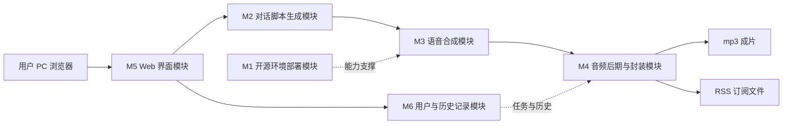
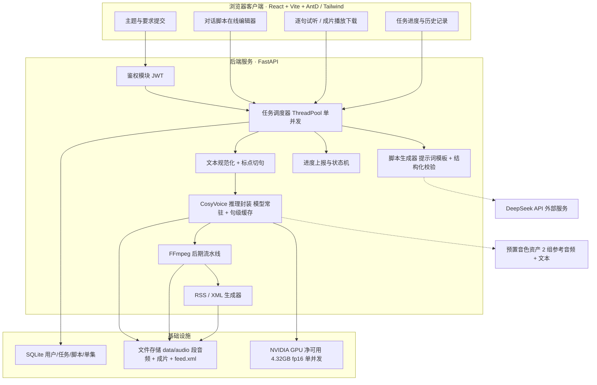
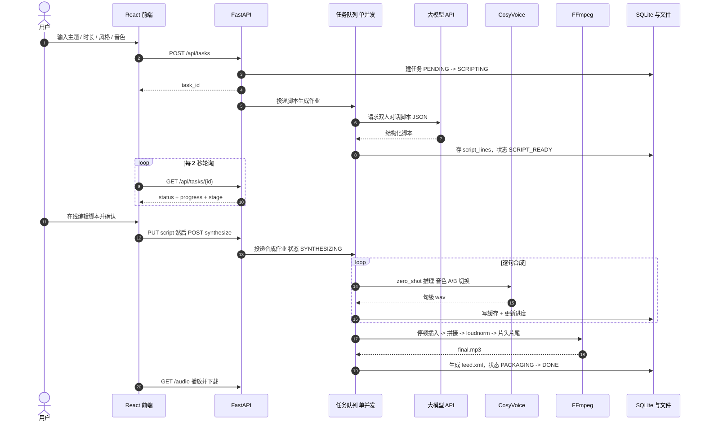
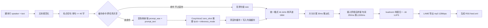
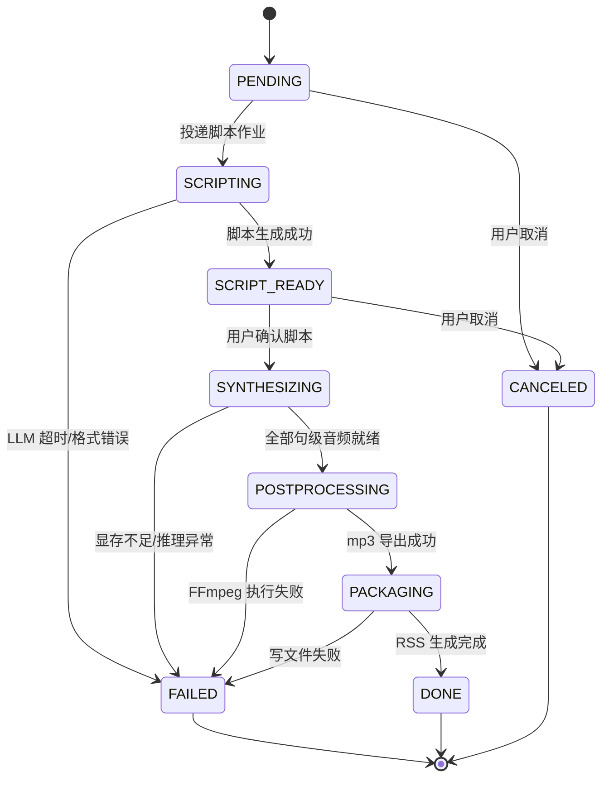
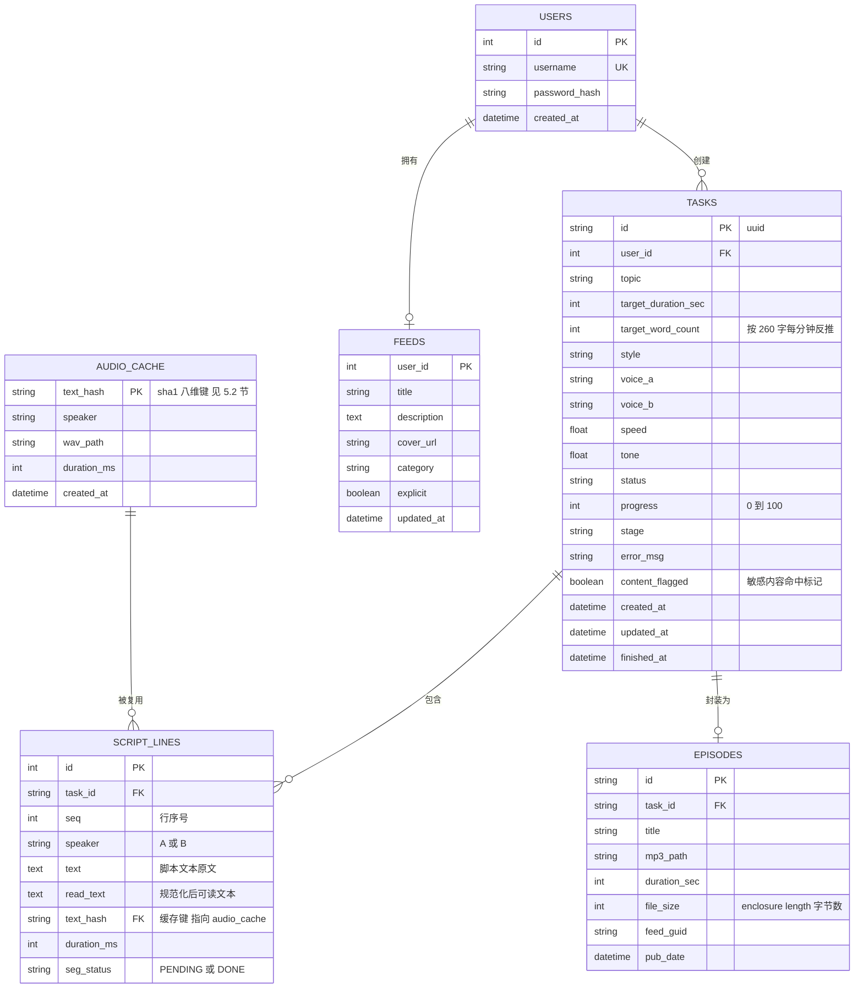

# 双人对话播客自动生成系统 · 产品需求规格说明书

| 项 | 内容 |
| --- | --- |
| 文档名称 | 双人对话播客自动生成系统 产品需求规格说明书（PRD） |
| 文档编号 | PRD-PODCAST-001 |
| 文档版本 | V1.3.0 |
| 编制日期 | 2026-09-14 |
| 最近修订 | 2026-09-20 |
| 依据文档 | 《双人对话播客自动生成系统项目任务书 V1.0.0》 |
| 关联文档 | 《双人对话播客自动生成系统_开发计划书_V1.22.0.md》；《双人对话播客自动生成系统_测试报告_V1.1.0.md》；《双人对话播客自动生成系统_API接口文档_V1.0.0.md》；《双人对话播客自动生成系统_数据库设计文档_V1.0.0.md》；《双人对话播客自动生成系统_UI-UX设计说明_V1.0.0.md》；《双人对话播客自动生成系统_部署运维手册_V1.2.0.md》；《双人对话播客自动生成系统_项目参数说明_V1.0.0.md》 |
| 细分技术方向 | 语音合成 + 内容生成 |
| 核心参考 | CosyVoice（FunAudioLLM）https://github.com/FunAudioLLM/CosyVoice |
| 大模型 | DeepSeek API（`deepseek-chat` 默认 / `deepseek-v4-pro` 备选，OpenAI 兼容协议）。⚠️ **模型名以响应体 `model` 字段为准**——实测网关会静默映射（`deepseek-reasoner` → `deepseek-flash`），详见计划书 4.10 节① |
| 算力约束 | NVIDIA RTX 4050 Laptop，总显存 6141 MiB；净可用随桌面负载浮动（D0 实测 4424 MiB / D1 实测 5072 MiB），设计口径取保守值 **4.32 GB**（硬约束，非推荐值） |
| 运行环境 | Windows 原生 + conda 独立环境（`cosyvoice`，Python 3.10.21）；项目根 `D:\podcast-ai` |
| 适用对象 | 项目负责人 / 开发 / 测试 / 评审 |

### 版本变更记录

| 版本 | 日期 | 修订说明 |
| --- | --- | --- |
| V1.0.0 | 2026-09-14 | 首版。依据任务书 V1.0.0 的六大功能模块与量化指标，结合开发计划书 V1.4.0 的 D0/D1 实测基线编制：形成需求范围与优先级（含「有意裁剪」声明）、六模块功能需求（含需求编号与验收标准）、技术架构设计（含四项关键架构决策）、接口设计（21 个端点 + 11 个业务错误码）、数据模型（6 张表）、非功能需求、验收清单与注意事项 |
| V1.1.0 | 2026-09-15 | **依 D2/D3 实测回填性能口径**（关联计划书同步升至 V1.5.0）。三处实质性更正：① **RTF 口径分列冷启动 / 稳态**——1.775 为冷启动值（受首次磁盘读 1.93 GB `llm.pt` 影响），稳态实测 **1.037**（D2 复测 1.049/1.037）、D3 端到端 25 句 **1.090**；禁止再用单一数值。② **端到端 1000 字耗时由「8.1~8.9 min、余量 1.1~1.9 min」更正为「约 5.4~6.2 min、余量 3.8~4.6 min」**（表 6.1 风险处置同步改为「有充分余量」，句级缓存由「指标保障项」降级为常规优化项）。③ **模型选型由「A/B 候选」转为「已定稿 CosyVoice2-0.5B」**——Fun-CosyVoice3-0.5B 实测峰值 4338 MB(allocated)/5306 MB(reserved) 双超门槛，降为 V2.0 候选并记入风险。另新增：显存门槛主/辅判据表述统一为 **allocated ≤ 3.6 GB（主）/ reserved ≤ 4.2 GB（辅）**，接受标准中显存实测值更新为 D3 的 3516.3/4000.0 MB |
| V1.2.0 | 2026-09-15 | **依 `D4前置检查报告_V1.2.0` 回填**（关联计划书同步升至 V1.6.0）。四处实质性更正：① **「音色区分度」由「本期部分达成（音色 B 素材未提供）」改为「已达成」**——`voice_b`（男声）已按用户第 2 版录音建档，映射不回退，输出 F0 235.3 / 110.3 Hz 相差 125.0 Hz；同步更新 M1 行、6.5 节音色素材依赖、验收清单第 8 项。② **`text_hash` 键公式更正**——原文 `sha1(speaker\|text\|speed\|tone\|model_ver)` 与实际实现均**已过期**，正确式为 8 维度 `sha1(voice_id\|voice_fp\|model_version\|seed_tag\|max_token_text_ratio\|read_text\|speed\|tone)`；补入「缓存键必须覆盖一切能改变音频的输入（含配置项）」原则与「改维度须清缓存」的运维约束。③ **显存峰值判据补注**——reserved ≤ 4.2 GB **仅对收敛样本成立**，单句隔离实测撞顶句（生成未收敛、解码到长度上限）达 **4212 MB 超限**，撞顶率约 8%；NFR-P-03 与验收清单同步加注。④ **新增「基线可复现性」要求**——固定随机种子后同文本合成波形逐位一致，并声明 V1.1.0 及之前的所有 RTF / 显存数字**不可逐位复现**（仅可作量级判断）。另：大模型行补入模型名映射纪律，备选模型 `deepseek-reasoner` → `deepseek-v4-pro`（该 id 被网关静默映射为 `deepseek-flash`） |

| V1.3.0 | 2026-09-20 | **D13 回填「需求实现对照」**（关联计划书升至 V1.20.0）：新增第九章，把本 PRD 的需求基线**与最终交付逐条对齐**——六模块功能需求、四类量化指标、接口清单、数据模型、非功能需求各给出「实现状态 + 证据出处 + 与基线的差异」，并把**基线之外新增的能力**（队列位次与缓存命中率读数、崩溃续跑、CUDA OOM 重试、工作区回收、前端测试基建）与**实际未实现/未验证的项**（云端 TTS 兜底从未落地、音色选择 UI 未暴露、跨域与在线 W3C 校验未验证等）显式列出。**本次未改动任何既有需求条目**，只补对照与状态。 |

---

## 目录

一、项目概述

二、功能需求

三、技术架构设计

四、接口设计

五、数据模型

六、非功能需求

七、验收标准与验证清单

八、注意事项

九、需求实现对照（D13 回填）

---

## 一、项目概述

### 1.1 产品背景

播客作为伴随式音频内容形态近年持续增长，知识科普、行业解读、观点对谈类节目广受欢迎。但一档双人对话播客的制作链条冗长：策划选题 → 撰写对话脚本 → 两位主播分别录制 → 后期剪辑拼接与响度处理，一期节目从选题到成片通常耗时数天，个人创作者与中小团队难以持续产出。

与此同时，两条技术条件已经成熟：

- **语音合成侧**：阿里 FunAudioLLM 团队开源的 **CosyVoice** 支持零样本音色合成，仅需数秒参考音频即可稳定复现音色，中文合成自然度达到较高水平，且可完全本地化部署。
- **内容生成侧**：大语言模型（本项目采用 **DeepSeek API**）具备按主题、目标时长与风格生成结构化双人对话脚本的能力。

二者结合，使「输入主题、输出成片」的自动化播客制作流程成为可能，制作成本大幅降低。再以 Web 应用形态交付，可让不具备录音棚与专业剪辑能力的用户低门槛完成播客制作。

### 1.2 产品定位与价值

**一句话定位**：面向个人创作者与教育机构的、以「输入主题 → 成片音频 + RSS 订阅」为闭环的双人对话播客自动生成 Web 应用。

| 价值维度 | 说明 |
| --- | --- |
| 业务价值 | 将播客制作从「写稿—录制—剪辑」的多环节人工流程，压缩为「输入主题—成片下载」的自动化流程，显著降低内容创作门槛，缩短单期节目制作周期 |
| 技术价值 | 实践开源语音合成模型的本地化部署与服务化封装，掌握「大模型内容生成 + 开源模型推理 + 音频后期处理 + Web 集成」的复合应用开发范式 |
| 社会价值 | 为视障人群、通勤群体提供可听的对话式知识内容，帮助个人创作者与教育机构低成本生产音频节目，促进知识的音频化传播 |

### 1.3 目标用户与典型场景

| 用户角色 | 特征 | 核心诉求 | 典型场景 |
| --- | --- | --- | --- |
| 个人内容创作者 | 无录音棚与专业剪辑能力，有稳定选题能力 | 快速把选题变成一期可发布的节目 | 选定「AI 与就业」题材，输入主题与 5 分钟时长，生成脚本后微调，下载成片 |
| 教育机构 / 教师 | 需批量生产教学音频 | 低成本、可复用的音频内容生产 | 把课程知识点生成为对话式音频，挂到播客客户端供学生订阅 |
| 视障 / 通勤用户 | 以听为主，阅读不便 | 获得可听的对话式知识内容 | 订阅 RSS，在播客客户端收听 |
| 项目评审 / 答辩 | 需要验证端到端闭环与性能指标 | 可复现的演示路径与量化证据 | 按本文档第七章逐项验证 |

> **本期边界**：仅面向 **PC 端浏览器**用户。移动端原生 App 与移动端专属布局明确不在范围内（见 1.5）。

### 1.4 术语与缩略语

| 术语 | 说明 |
| --- | --- |
| PRD | 产品需求规格说明书，即本文档 |
| MVP | 最小可行产品，只包含满足核心需求的功能集 |
| RTF | Real-Time Factor，实时率；RTF = 合成耗时 ÷ 音频时长。RTF < 1 表示合成快于播放 |
| MOS | Mean Opinion Score，平均主观意见分；自然度人工评分（1~5） |
| 零样本音色合成 | 仅用数秒参考音频即可复现目标音色的合成方式，无需微调训练 |
| 音色档案 | 由参考音频预先提取并注册的音色特征，避免逐句重复计算（`add_zero_shot_spk`） |
| 句级缓存 | 以文本与音色参数为键、可跨任务复用的句子级音频缓存 |
| 文本规范化 | 把原文转换为适合朗读的读文（数字、多音字、英文、符号处理） |
| loudnorm | FFmpeg 响度归一化滤镜，播客标准目标为 −16 LUFS |
| LUFS | 响度单位（Loudness Units Full Scale），用于描述节目整体响度 |
| 话轮 | 一次说话人切换；换人处停顿长于同一人连续两句之间的停顿 |
| enclosure | RSS 单集中指向音频文件的元素，其 `length` 必须为**字节数**而非时长 |

### 1.5 产品范围与优先级（MVP 边界）

单人 14 天工期约束下，采用 **P0 / P1 / P2 三级裁剪策略**，保证「最短可用闭环先跑通，再逐层加厚」。

| 优先级 | 范围 | 处理策略 |
| --- | --- | --- |
| **P0（必须交付）** | 双音色合成服务、文本规范化 + 切句、LLM 脚本生成、FFmpeg 拼接与 mp3 导出、任务异步调度与进度查询、主题提交页、成片播放下载 | 工期不足时优先保 P0，**任何情况下不得砍** |
| **P1（计划交付）** | 脚本在线编辑、逐句试听、响度归一、片头片尾、历史记录、RSS 生成、用户注册登录、云端 TTS 兜底通道（条件性，触发条件见 6.1） | 按排期推进；若超期则降级为「简化版」并记录 |
| **P2（明确不做）** | 音色上传 / 声音克隆自定义、语调细粒度参数面板、多风格音色库、SSE 流式推送、移动端适配、多用户 RSS 聚合 | 本期不实现，写入 2.0 迭代路线图 |

#### 1.5.1 明确不做（Out of Scope）

- 录音棚级后期（降噪、EQ、混响、母带处理）
- 播客托管平台的自动发布 / 审核对接
- 移动端原生 App 与移动端专属布局（仅保证 PC 端浏览器可用）
- 事实性核查（LLM 幻觉由人工审核兜底，系统仅做风险提示）

#### 1.5.2 对任务书指定项的「有意裁剪」声明

任务书为上游要求。凡本文档主动收紧或调整者，均在此显式声明，**属有意裁剪而非遗漏**：

| 项 | 任务书原要求 | 本文档口径 | 性质与理由 |
| --- | --- | --- | --- |
| 音色来源 | 「预置音色**或**使用者本人授权录制的音色」 | **收紧为仅预置音色**（2 组） | **有意收紧**：从设计上杜绝仿冒他人声音的合规风险，并省去授权声明与音色审核链路（约 1 天工期）。用户上传音色列入 2.0 路线图 |
| 开发语言版本 | Python 3.12+ | **Python 3.10.21** | **上游约束导致的向下偏离**：CosyVoice 上游硬要求 `python=3.10`，其依赖链（Matcha-TTS、conformer、x-transformers 等）在 3.12 上未经验证。3.12 兼容性验证列入 2.0 路线图 |
| UI 组件库 | TailwindCSS / Ant Design（双库） | **双库分工落地**：AntD 承载表单、表格、弹窗、消息提示等交互组件；Tailwind 承载布局、间距、响应式与展示样式 | **不裁剪**：两者共存，不相互替代 |
| 模型版本 | 未指定具体版本（要求「CosyVoice 零样本音色合成」） | 主选 **CosyVoice2-0.5B**，与 **Fun-CosyVoice3-0.5B** A/B 实测后定稿 | 任务书只要求框架不要求版本，**不构成未覆盖**。优先 2.0 的原因是净可用显存仅 4.32 GB（3.0 的 `flow.pt` 为 1329 MB，2.0 仅 450 MB） |
| 云端 TTS 兜底 | 未提及 | 列为 P1 条件性实现 | **增强项**：低显存档位下作为性能指标达成的保险 |

---

## 二、功能需求

### 2.1 功能架构总览



六大功能模块及其量化验收指标（指标取自任务书，作为**验收硬门槛**）：

| # | 模块 | 功能要求 | 量化验收指标 |
| --- | --- | --- | --- |
| M1 | 开源环境部署模块 | CosyVoice 框架与预训练模型本地部署；管理 2 种风格差异明显的预置音色 | 输出环境配置手册；记录显存占用与合成速度（RTF）基线；**峰值显存 ≤ 3.6 GB（allocated）/ 4.2 GB（reserved）** |
| M2 | 对话脚本生成模块 | 按主题 / 时长 / 风格生成双人对话脚本；内置角色人设与节奏字数控制模板；Web 端可人工编辑；含敏感内容过滤 | **脚本一次生成人工可用率 ≥ 80%** |
| M3 | 语音合成模块 | 文本规范化（多音字 / 数字 / 英文 / 专有名词）；逐句切分；双音色按说话人切换；语速语调可调 | **合成文本与脚本文本逐句一致率 = 100%**；**MOS 自然度 ≥ 3.5 / 5** |
| M4 | 音频后期与封装模块 | FFmpeg 句间停顿插入、双音色拼接、响度均衡归一、片头片尾混入，导出 mp3；生成符合 RSS 规范的订阅 XML | **1000 字脚本端到端耗时 ≤ 10 分钟**；**峰值显存 ≤ 3.6 GB（allocated）/ 4.2 GB（reserved）** |
| M5 | Web 界面模块 | 主题与要求输入、脚本在线编辑、逐句试听（按说话人区分音色）、成片播放与下载 | 全部功能在 PC 端浏览器可用，无阻塞性缺陷 |
| M6 | 用户与历史记录模块 | 用户注册登录、任务进度展示、历史成片与脚本的查询回放 | 任务状态可追踪；历史记录可回放且可重新下载 |

### 2.2 M1 开源环境部署模块

**模块目标**：把 CosyVoice 跑起来、跑稳，并留下可复现的基线数据，为 M3 提供能力前提。

| 需求编号 | 功能点 | 需求说明 | 优先级 |
| --- | --- | --- | --- |
| FR-ENV-01 | 框架与权重部署 | 在独立 conda 环境完成 CosyVoice 框架与预训练权重部署；子模块 Matcha-TTS 必须安装（`flow/decoder.py` 等三处硬依赖） | P0 |
| FR-ENV-02 | 模型常驻单例 | 模型以**进程内单例**加载，随服务生命周期常驻；禁止按请求重复加载 | P0 |
| FR-ENV-03 | 显存预算控制 | 强制 fp16 推理；onnx 组件（campplus / speech tokenizer）交由 **CPU 版 onnxruntime** 承载以移出显存；单并发队列 + 代码层显存互斥锁 | P0 |
| FR-ENV-04 | 预置音色管理 | 提供 2 组风格差异明显的预置音色，每组含 `prompt_wav`（5~10 s、16 kHz 单声道、无背景音乐）与 `prompt_text`；一男一女，沉稳 vs 活泼 | P0 |
| FR-ENV-05 | 基线记录与自检 | 输出环境配置手册，记录加载耗时、常驻显存、RTF、峰值显存；提供显存峰值自检与 onnx providers 自检 | P1 |

**关键业务规则**

1. **模型选择**：**已定稿 CosyVoice2-0.5B**（D2 A/B 实测：峰值 3513 MB(allocated)/4024 MB(reserved)，双门槛通过；稳态 RTF 1.037）。Fun-CosyVoice3-0.5B 实测峰值 4338 MB/5306 MB **双超门槛**，**降为 V2.0 候选，本期不启用**。
2. **浮点精度**：`--fp16` 强制开启，禁止 fp32 推理。
3. **并发上限**：`ThreadPoolExecutor(max_workers=1)`，并发数固定为 1，不可配置放宽。
4. **加载时机**：模型加载耗时（冷启动）不计入 RTF，但必须以「服务 lifespan 预热」摊薄，避免首个用户任务承担全部冷启动成本。
5. **RTF 口径纪律**：任何性能结论**必须标注「冷启动」或「稳态」**——两者相差约 40%，混用会得出相反结论（V1.4.0 的紧余量误判即源于用冷启动值衡量稳态容量）。

**验收标准**

| 验收项 | 判定口径 | 门槛 |
| --- | --- | --- |
| 框架可用 | 环境内可完整加载模型并完成一次三段式合成 | 通过 |
| 加载耗时 | 冷启动至模型就绪 | ≤ 30 s（实测 23.0 s） |
| 常驻显存 | 加载完成后 `max_memory_allocated` | 实测 2442 MB，记录留档 |
| RTF 基线 | 冷启动与稳态**分别留档**：`t2` 三句均值（冷启动）与 25 句端到端（稳态） | 冷启动 1.775（D1）／稳态 **1.037**（D2）／D3 端到端 **1.090** |
| 显存峰值 | 三段合成 + 音色注册后取最大值 | 主判据 allocated ≤ 3.6 GB、辅判据 reserved ≤ 4.2 GB（D1 实测 3512/3978 MB；D3 实测 **3516.3/4000.0 MB**，均通过） |
| 音色区分度 | 两组预置音色人耳可明显区分 | **已达成**：`voice_a` / `voice_b` 两组档案均已建档（`voice_b` 按用户第 2 版录音建档），生产路径实测 `A→voice_a` / `B→voice_b` **不回退**，输出 F0 中位数 235.3 Hz（女）/ 110.3 Hz（男），差 **125.0 Hz**（一男一女成立），显存双口径达标（详见《D4 前置检查报告 V1.2.0》第四章） |

### 2.3 M2 对话脚本生成模块

**模块目标**：把一句主题扩展为可直接进入合成流水线的结构化双人对话脚本。

| 需求编号 | 功能点 | 需求说明 | 优先级 |
| --- | --- | --- | --- |
| FR-SCR-01 | 主题与要求输入 | 接收主题、目标时长、风格、音色选择、语速、语调参数 | P0 |
| FR-SCR-02 | 对话脚本生成 | 调用 DeepSeek API，按主题 / 目标时长 / 风格生成双人对话脚本，JSON 模式结构化输出 | P0 |
| FR-SCR-03 | 提示词模板 | 内置角色人设、对话节奏、每轮字数与总字数控制、内容安全约束；系统提示词与用户变量**严格分离** | P0 |
| FR-SCR-04 | 字数配额控制 | 脚本总字数 = 目标时长（分钟）× 260 字/分钟，允许 ±10% 偏差 | P0 |
| FR-SCR-05 | 敏感内容过滤 | 对生成脚本实施敏感内容过滤，命中即标记 `content_flagged` 并向用户提示 | P0 |
| FR-SCR-06 | 脚本在线编辑 | Web 端对脚本逐行编辑；保存后重置受影响行的合成状态，重合成仅覆盖变更句 | P1 |

**关键业务规则**

1. **换算规则**：中文双人对谈语速取 **260 字/分钟**（区间 240~280），脚本总字数 = 目标时长（分钟）× 260，允许 ±10% 偏差；规则写入提示词模板，由模型按配额分配每轮发言字数。
2. **结构化输出三重保险**：
   - 请求侧开启 `response_format={"type": "json_object"}`，且提示词中必须出现 "json" 字样并附目标 Schema 示例；
   - 服务端用 Pydantic 二次校验：`speaker ∈ {A, B}`、每行 ≤ 40 字、总字数落在配额 ±10%、`seq` 连续；
   - 校验失败则携带**具体错误信息**纠错重试（最多 2 次），仍失败降级为「纯文本 + 正则解析 + 前端提示人工修正」。
3. **提示词缓存**：`SYSTEM_PROMPT` 中**不得插入任何用户变量**（主题、时长、风格、字数配额一律放在 user 消息），以保证逐字节稳定、命中服务端前缀缓存、降低成本。
4. **情绪与事实边界**：脚本允许观点对谈与情景演绎，但不得编造具体数据、结论性或医疗建议；系统须在成片页提示「发布前需人工审核内容」。

**验收标准**

| 验收项 | 判定口径 | 门槛 |
| --- | --- | --- |
| 一次生成可用率 | 12 条测试主题集，人工判定「微调即可用」的比例 | ≥ 80% |
| 字数合规 | 总字数落在配额 ±10% 区间 | 抽样 12 条全部合规 |
| 结构合规 | `speaker` 取值、每行 ≤ 40 字、`seq` 连续 | 100% 通过 Schema 校验 |
| 覆盖题材 | 测试主题集覆盖知识科普、行业解读、生活闲聊三类 | 三类均有样本 |
| 内容安全 | 诱导性/违规主题下不产出违规内容 | 命中即拦截并提示 |

### 2.4 M3 语音合成模块

**模块目标**：把脚本转成「与脚本逐句一致、可分辨说话人、参数可调」的双音色音频。

| 需求编号 | 功能点 | 需求说明 | 优先级 |
| --- | --- | --- | --- |
| FR-TTS-01 | 文本规范化 | 处理阿拉伯数字、英文/缩写、多音字与专有名词、标点与噪声；保留「原文 → 读文」显式映射 | P0 |
| FR-TTS-02 | 标点切句 | 按标点切句，单句长度上限 **40 字**；超长句按逗号/顿号二次切分 | P0 |
| FR-TTS-03 | 双音色切换 | 按 `speaker` 映射到音色 A / 音色 B，逐句切换推理 | P0 |
| FR-TTS-04 | 逐句合成 | 逐句调用零样本合成，fp16 + `inference_mode`，每句结束后清理显存缓存 | P0 |
| FR-TTS-05 | 语速与语调 | 开放语速、语调参数调节，并在前端可调 | P1 |
| FR-TTS-06 | 句级缓存 | 以 **8 维度** `sha1(voice_id \| voice_fingerprint \| model_version \| seed_tag \| max_token_text_ratio \| read_text \| speed \| tone)` 为键落盘并登记，跨任务复用（键式定义见 5.2）。**原则：缓存键必须覆盖一切能改变音频的输入（含配置项）** | P0 |
| FR-TTS-07 | 逐句试听 | 按句返回音频，命中缓存直接返回，支持 HTTP Range | P1 |

**文本规范化规则明细**

| 类型 | 处理方式 | 示例 |
| --- | --- | --- |
| 阿拉伯数字 | 按语义上下文转中文读法 | `2026年` → `二零二六年`；`3.5` → `三点五` |
| 英文单词 / 缩写 | 保留字母（支持中英混读），过长缩写加空格分隔 | `GPU` 保持；`RSS订阅` → `RSS 订阅` |
| 多音字 / 专有名词 | 自定义词典（JSON）+ `pypinyin` 兜底，词典条目可热更新 | `重庆`、`行长`、`重载` |
| 标点与噪声 | 统一全半角，去 Markdown 标记 / emoji / 括号旁白 | `**重点**` → `重点` |
| 超长句 | 逗号 / 顿号二次切分，每段 ≤ 40 字 | 保证逐句可对齐、可缓存 |

> **可逆性约束（逐句一致率 100% 的前提）**：规范化必须保留 `原文 → 读文` 的显式映射并落库到 `script_lines.read_text`；仅允许**可逆或语义等价**的替换，任何不可逆改写必须打标并在日志告警。

> **fail-fast 约束**：文本规范化依赖外部 FST 模型。该链路失败时上游会**静默降级**（把文本前端置空、`text_normalize` 原样返回且不报错），数字不转写而系统无感知。因此**服务启动期必须断言文本前端已就绪**，未就绪即拒绝启动，不得放任降级。

**验收标准**

| 验收项 | 判定口径 | 门槛 |
| --- | --- | --- |
| 逐句一致率 | 合成文本与脚本 `read_text` 逐句比对 | **100%** |
| 自然度 | MOS 人工评分（多人盲听取均值） | **≥ 3.5 / 5** |
| 切句合规 | 单句长度 | 全部 ≤ 40 字 |
| 音色区分 | 同一句中 A / B 听感可区分，无串音 | 通过 |
| 缓存有效性 | 同句跨任务复用，命中时不产生推理耗时 | 命中即 0 GPU 推理 |
| 规范化正确性 | 数字、百分比、时间单位转写正确 | 抽样全部正确 |

### 2.5 M4 音频后期与封装模块

**模块目标**：把一堆句级 wav 加工成一期可发布、可订阅的播客节目。

| 需求编号 | 功能点 | 需求说明 | 优先级 |
| --- | --- | --- | --- |
| FR-POST-01 | 音频格式统一 | 所有素材统一为 **44.1 kHz / 单声道 / 16-bit PCM**；任何拼接动作之前必须完成 | P0 |
| FR-POST-02 | 停顿插入 | 同一人连续两句之间插 **250 ms**；换人处插 **500 ms** | P0 |
| FR-POST-03 | 双音色拼接 | 按脚本顺序拼接句级音频与静音段 | P0 |
| FR-POST-04 | 片头片尾 | 混入片头片尾，拼接前完成 30 ms 微淡化（避免吃字） | P1 |
| FR-POST-05 | 响度归一 | 两遍 loudnorm，目标 **−16 LUFS**；第二遍动态回填第一遍实测的五个参数 | P1 |
| FR-POST-06 | 成片导出 | 导出 mp3（LAME 128 kbps），落盘 `data/audio/{task_id}/final.mp3` | P0 |
| FR-RSS-01 | 频道配置 | 维护频道标题、简介、封面、分类、explicit 标记 | P1 |
| FR-RSS-02 | 单集封装 | 按 RSS 2.0 + iTunes 命名空间生成单集条目 | P1 |
| FR-RSS-03 | 订阅源发布 | 提供公开可访问的 `feed.xml` 与 enclosure 音频地址 | P1 |

**播客 RSS 必填字段（仅写任务书列举的四项不足以被客户端收录）**

| 作用域 | 字段 | 说明 |
| --- | --- | --- |
| channel | `<title>` `<description>` `<link>` `<language>` | RSS 2.0 基础必填 |
| channel | `itunes:author` `itunes:owner` `itunes:category` `itunes:explicit` `itunes:image` | Apple Podcasts 收录必需 |
| channel | `<atom:link rel="self" ...>` | Feed 规范校验要求 |
| item | `<title>` `<description>` `<pubDate>` `<guid isPermaLink="false">` | 单集基础 |
| item | `<enclosure url length type="audio/mpeg">` | `length` 必须是**字节数**，不是时长 |
| item | `itunes:duration` `itunes:episode` `itunes:explicit` | 客户端展示必需 |

**验收标准**

| 验收项 | 判定口径 | 门槛 |
| --- | --- | --- |
| 端到端耗时 | 1000 字脚本从提交到成片可下载 | **≤ 10 分钟** |
| 格式一致 | 成片采样率 / 声道 / 位深 | 44.1 kHz / 单声道 / 16-bit |
| 响度 | loudnorm 后整体响度 | −16 LUFS ±1 |
| 停顿 | 句间 / 话轮停顿 | 250 ms / 500 ms |
| 显存峰值 | 合成阶段 `max_memory_allocated` / `max_memory_reserved` | ≤ 3.6 GB / ≤ 4.2 GB |
| RSS 合规 | W3C Feed Validator + Apple Podcasts 收录规则 | 错误项清零 |
| 客户端可播 | 任一播客客户端订阅后可播放单集 | 通过 |

### 2.6 M5 Web 界面模块

**模块目标**：让不具备技术背景的用户完成「提交 → 编辑 → 试听 → 下载」全流程。

| 需求编号 | 功能点 | 需求说明 | 优先级 |
| --- | --- | --- | --- |
| FR-UI-01 | 主题提交页 | 主题、目标时长、风格、音色 A/B、语速与语调的输入与校验 | P0 |
| FR-UI-02 | 任务进度展示 | 展示状态、阶段名与百分比；前端 **2 s 轮询**（不用 SSE / WebSocket） | P0 |
| FR-UI-03 | 脚本编辑器 | 逐行展示与编辑对话脚本，标注说话人；保存后提示受影响行的重合成范围 | P1 |
| FR-UI-04 | 逐句试听 | 按句播放，按说话人区分音色，支持进度条拖动 | P1 |
| FR-UI-05 | 成片播放与下载 | 在线播放与 mp3 下载，显示时长、文件大小、生成时间 | P0 |
| FR-UI-06 | 历史与频道设置 | 历史任务列表、搜索筛选、频道信息维护、RSS 地址复制 | P1 |

**页面清单**：登录 / 注册页、创作提交页、脚本编辑页、任务进度页、历史记录页、频道设置页、成片播放页。

**交互要求**

1. 长耗时任务必须给出**分阶段**进度（脚本生成 → 合成中（x/y 句）→ 后期处理 → 封装完成），不得只给一个转圈动画。
2. 失败任务必须展示可读的错误原因，并提供「重试」按钮（断点续跑）。
3. 成片页须固定展示合规提示：本期节目由 AI 合成，内容仅供参考，发布前需人工审核。

**验收标准**

| 验收项 | 判定口径 | 门槛 |
| --- | --- | --- |
| 全流程可用 | 新用户从注册到下载成片，无需命令行介入 | 通过 |
| 进度可视 | 合成阶段能看到「已完成句数 / 总句数」 | 通过 |
| 浏览器兼容 | Chrome / Firefox / Safari / Edge 各最新两个版本 | 均可正常完成流程 |
| 无阻塞缺陷 | 全流程无 JS 报错导致的功能中断 | 0 项 |

### 2.7 M6 用户与历史记录模块

**模块目标**：让每个用户拥有独立的创作空间与可回放的历史资产。

| 需求编号 | 功能点 | 需求说明 | 优先级 |
| --- | --- | --- | --- |
| FR-USR-01 | 注册 | 用户名 + 密码注册，密码以 bcrypt 哈希存储 | P1 |
| FR-USR-02 | 登录与会话 | 登录签发 JWT，同时写入 HttpOnly Cookie 供媒体接口使用 | P1 |
| FR-USR-03 | 历史列表 | 分页展示历史任务，支持按主题关键词搜索、按状态筛选 | P1 |
| FR-USR-04 | 记录回放 | 查看历史脚本、回放成片、重新下载 | P1 |
| FR-USR-05 | 记录管理 | 删除任务（级联清理脚本、成片与单集记录，**不清句级缓存**） | P1 |

**关键业务规则**

1. **数据隔离**：任何任务级接口都必须校验任务归属，禁止跨用户访问。
2. **缓存不随任务删除**：句级缓存是跨任务共享资产，删除任务不清缓存。
3. **账号注销 / Token 重置**：支持一键重置对外 token，使旧 RSS 地址立即失效。

**验收标准**

| 验收项 | 判定口径 | 门槛 |
| --- | --- | --- |
| 注册登录 | 新账号可注册并登录 | 通过 |
| 隔离性 | 用户 A 无法读取、操作、下载用户 B 的任何任务与音频 | 越权请求全部返回 403 |
| 历史可回放 | 历史任务可查看脚本、回放并重新下载成片 | 通过 |
| 状态可追踪 | 任一任务可查询到当前状态与进度 | 通过 |

---

## 三、技术架构设计

### 3.1 技术栈选型

| 层次 | 选型 | 版本建议 | 说明 |
| --- | --- | --- | --- |
| 开发语言 | Python | **3.10.21** | 因 CosyVoice 上游硬要求向下偏离任务书 3.12+，已声明（1.5.2） |
| 语音合成 | CosyVoice（零样本音色合成） | **CosyVoice2-0.5B（已定稿主模型）**；Fun-CosyVoice3-0.5B 降为 V2.0 候选（峰值 4338/5306 MB 双超门槛） | 双音色逐句合成；fp16 + `inference_mode`；onnx 组件走 CPU |
| 推理运行时 | PyTorch + torchaudio | 2.3.1+cu121 | 适配 RTX 4050（sm_89）；CUDA wheel 从官方 index 获取 |
| onnx 运行时 | onnxruntime | 1.18.0（**CPU 版**） | 承载 campplus 与 speech tokenizer，把约 1 GB onnx 缓冲移出显存；显式不装 `onnxruntime-gpu` |
| 文本归一化 | wetext | 0.0.4 | 纯 Python 直装；`pynini` / `WeTextProcessing` 已确认非必需 |
| TTS 子依赖 | Matcha-TTS | 随仓库 | `flow/decoder.py` 等三处 `import matcha`，必须安装 |
| 对话脚本生成 | **DeepSeek API**（OpenAI 兼容协议） | `deepseek-chat`（默认）/ `deepseek-v4-pro`（备选） | JSON 模式输出，详见 4.5。⚠️ 模型名以响应体 `model` 为准 |
| 大模型客户端 | openai SDK | 1.x | 指向 `https://api.deepseek.com`，不自研 HTTP 封装 |
| 网络请求 | httpx | 0.27+ | 异步调用 + 超时重试 |
| 音频后期 | FFmpeg / pydub | FFmpeg 6.x+ / pydub 0.25+ | 停顿插入、拼接、响度均衡 |
| 订阅封装 | feedgen（含 podcast 扩展） | 1.0+ | RSS 播客订阅文件 |
| 后端服务 | FastAPI + Uvicorn | FastAPI 0.11x | RESTful API + 异步任务 |
| 前端框架 | React + Vite | React 18 / Vite 5 | Web 界面开发 |
| UI 组件库 | **Ant Design + TailwindCSS** | AntD 5.x / Tailwind 3.x | AntD 承载交互组件；Tailwind 承载布局与响应式样式。二者共存 |
| 数据库 | SQLite + SQLAlchemy ORM | SQLAlchemy 2.x | 用户、任务、脚本、缓存与单集存储 |
| 鉴权 | JWT（python-jose）+ passlib[bcrypt] | — | 用户会话；媒体访问方案见 4.4 |
| 模型下载 | modelscope | 最新 | HuggingFace 实测不可达，统一走 ModelScope |
| 测试与质量 | pytest / pytest-asyncio / ruff | 最新 | 单测、异步测试、lint + format |

### 3.2 系统总体架构



**架构分层说明**

| 层 | 组成 | 职责 |
| --- | --- | --- |
| 客户端层 | React + Vite + AntD + Tailwind | 主题提交、脚本编辑、进度轮询、试听与下载 |
| 服务层 | FastAPI + 单并发任务调度器 | 鉴权、任务编排、状态机推进、进度上报 |
| 能力层 | 脚本生成器 / 规范化与切句 / CosyVoice 封装 / FFmpeg 后期 / RSS 生成器 | 各环节具体实现 |
| 基础设施层 | SQLite + 文件存储 + GPU | 状态持久化、音频资产、推理算力 |
| 外部服务 | DeepSeek API | 对话脚本生成（本地不加载任何 LLM 权重） |

### 3.3 端到端核心业务流程



### 3.4 语音合成与后期流水线



### 3.5 任务状态机



**状态定义**

| 状态 | 含义 | 可见进度 |
| --- | --- | --- |
| PENDING | 任务已创建，等待调度 | 0% |
| SCRIPTING | 正在生成对话脚本 | 5%~15% |
| SCRIPT_READY | 脚本就绪，等待用户确认 | 20% |
| SYNTHESIZING | 逐句合成中 | 20%~80%（按句数推进） |
| POSTPROCESSING | 停顿、拼接、响度归一、片头片尾 | 80%~92% |
| PACKAGING | 导出 mp3 并生成 RSS | 92%~100% |
| DONE / FAILED / CANCELED | 终态 | 100% 或保留失败前进度 |

> **断点续跑**：任务失败重试时，已进入句级缓存的 wav 不重复推理，直接从 `SYNTHESIZING` 的断点继续。实现方式为合成前按 `text_hash` 批量查缓存，仅对未命中的句子投推理。

### 3.6 关键架构决策

| # | 决策 | 理由 |
| --- | --- | --- |
| 1 | **不拆微服务，CosyVoice 以进程内单例加载** | 模型重复加载会带来 10~20 s 冷启动与显存翻倍；在净可用 4.32 GB 下「显存翻倍」不是性能损耗而是必然 OOM，单例是硬性要求 |
| 2 | **GPU 访问完全串行化** | 单并发队列 + 代码层显存互斥锁双保险，从根源规避显存争抢与 OOM |
| 3 | **大模型侧完全外置** | 脚本生成全部走 DeepSeek API，本地不加载任何 LLM 权重，显存全部留给 CosyVoice |
| 4 | **进度通过数据库落盘 + 前端轮询** | 状态与百分比写 SQLite，前端 2 s 轮询；不引入 SSE / WebSocket，节省工期 |
| 5 | **句级音频缓存跨任务共享** | 同时服务三个需求：改脚本时增量重合成、逐句试听零重复推理、低算力环境下摊薄总合成开销；缓存命中即完全不占 GPU |
| 6 | **规范化保留原文与读文双文本** | 逐句一致率 100% 的验收前提；不可逆改写必须打标告警 |

---

## 四、接口设计

### 4.1 通用约定

| 项 | 约定 |
| --- | --- |
| 基础路径 | `/api`（RSS 公开端点除外，见 4.6） |
| 传输 | HTTP/1.1，生产环境强制 HTTPS |
| 请求体 | `application/json`；文件上传除外 |
| 字段命名 | 请求与响应统一 `snake_case` |
| 时间格式 | ISO 8601，UTC，形如 `2026-09-14T09:30:00Z` |
| 鉴权 | `Authorization: Bearer <JWT>`；媒体类端点从 HttpOnly Cookie 取凭据（见 4.4） |
| 分页 | `?page=1&page_size=20`，响应含 `total` / `page` / `page_size` |
| 幂等 | 创建类接口支持 `Idempotency-Key` 可选头，避免重复提交产生多任务 |

**统一响应体**

```json
{
  "code": 0,
  "message": "ok",
  "data": {}
}
```

**业务错误码**

| code | HTTP | 含义 | 客户端处置 |
| --- | --- | --- | --- |
| 0 | 200 | 成功 | — |
| 40001 | 400 | 参数校验失败 | 高亮对应字段 |
| 40100 | 401 | 未登录或 Token 失效 | 跳转登录页 |
| 40300 | 403 | 无权限访问该资源 | 提示无权限 |
| 40400 | 404 | 资源不存在 | 提示并返回列表 |
| 40900 | 409 | 当前任务状态不允许该操作 | 刷新任务状态 |
| 42900 | 429 | 请求过于频繁或上游限流 | 退避后重试 |
| 50010 | 500 | 大模型调用失败 | 展示原因并提供重试 |
| 50020 | 500 | 语音合成失败（显存不足或推理异常） | 展示原因并提供断点续跑 |
| 50030 | 500 | 音频后期处理失败 | 展示原因并提供重试 |
| 50040 | 500 | RSS 生成失败 | 提示频道配置不完整 |
| 50300 | 503 | GPU 队列忙，暂不接受新任务 | 提示稍后重试 |

### 4.2 接口清单

| 方法 | 路径 | 说明 | 鉴权 |
| --- | --- | --- | --- |
| POST | `/api/auth/register` | 用户注册 | 否 |
| POST | `/api/auth/login` | 登录，签发 JWT（同时写入 HttpOnly Cookie） | 否 |
| POST | `/api/auth/logout` | 清除会话 Cookie | 是 |
| GET | `/api/voices` | 获取预置音色列表 | 是 |
| POST | `/api/tasks` | 创建任务（topic / duration / style / voices / speed / tone） | 是 |
| GET | `/api/tasks` | 历史任务分页列表 | 是 |
| GET | `/api/tasks/{id}` | 查询任务状态与进度 | 是 |
| GET | `/api/tasks/{id}/script` | 获取对话脚本（结构化行） | 是 |
| PUT | `/api/tasks/{id}/script` | 保存人工编辑后的脚本（重置受影响行的合成状态） | 是 |
| POST | `/api/tasks/{id}/synthesize` | 确认脚本，触发合成流水线 | 是 |
| POST | `/api/tasks/{id}/retry` | 失败任务断点续跑（跳过已命中缓存的句子） | 是 |
| POST | `/api/tasks/{id}/cancel` | 取消任务 | 是 |
| DELETE | `/api/tasks/{id}` | 删除任务（级联清理脚本、成片与单集记录；不清缓存） | 是 |
| GET | `/api/tasks/{id}/segments/{seq}/audio` | 逐句试听（命中缓存直返，支持 Range） | 是 |
| GET | `/api/tasks/{id}/audio` | 成片在线播放（支持 Range） | 是 |
| GET | `/api/tasks/{id}/download` | 成片下载 mp3 | 是 |
| GET | `/api/feeds/me` | 读取当前用户的播客频道配置 | 是 |
| PUT | `/api/feeds/me` | 更新频道配置（标题 / 简介 / 封面 / 分类 / explicit） | 是 |
| GET | `/feed/{user_token}/{guid}.mp3` | RSS enclosure 音频访问（不可猜测路径，无登录态） | 否 |
| GET | `/feed/{user_token}.xml` | RSS 播客订阅源 | 否 |

### 4.3 核心接口详述

#### 4.3.1 用户登录

`POST /api/auth/login`

```json
// 请求
{
  "username": "creator01",
  "password": "********"
}
```

```json
// 响应 200
{
  "code": 0,
  "message": "ok",
  "data": {
    "token": "eyJhbGciOiJIUzI1NiIsInR5cCI6IkpXVCJ9...",
    "expires_in": 86400,
    "user": { "id": 1, "username": "creator01" }
  }
}
```

> 响应同时下发 `Set-Cookie: access_token=...; HttpOnly; SameSite=Lax; Path=/`，供 `<audio>` 等媒体标签携带凭据（见 4.4）。

#### 4.3.2 创建生成任务

`POST /api/tasks`

```json
// 请求
{
  "topic": "AI 会让哪些岗位先发生变化",
  "target_duration_sec": 300,
  "style": "轻松科普",
  "voice_a": "male_steady",
  "voice_b": "female_lively",
  "speed": 1.0,
  "tone": 1.0
}
```

```json
// 响应 200
{
  "code": 0,
  "message": "ok",
  "data": {
    "task_id": "0f7c1e2a-9b3d-4c11-8a77-5d2b6f9e1c40",
    "status": "PENDING",
    "target_word_count": 1300,
    "created_at": "2026-09-14T09:30:00Z"
  }
}
```

| 字段 | 类型 | 必填 | 约束 |
| --- | --- | --- | --- |
| `topic` | string | 是 | 2~100 字 |
| `target_duration_sec` | int | 是 | 60~1800（1~30 分钟） |
| `style` | string | 否 | 默认「轻松科普」；可选值见 `/api/voices` 同级配置 |
| `voice_a` | string | 是 | 预置音色 ID |
| `voice_b` | string | 是 | 预置音色 ID，且不得与 `voice_a` 相同 |
| `speed` | float | 否 | 0.5~2.0，默认 1.0 |
| `tone` | float | 否 | 0.5~2.0，默认 1.0 |

#### 4.3.3 查询任务状态

`GET /api/tasks/{id}`

```json
// 响应 200
{
  "code": 0,
  "message": "ok",
  "data": {
    "task_id": "0f7c1e2a-9b3d-4c11-8a77-5d2b6f9e1c40",
    "status": "SYNTHESIZING",
    "progress": 46,
    "stage": "合成中 17/37 句",
    "content_flagged": false,
    "error_msg": null,
    "episode": null,
    "created_at": "2026-09-14T09:30:00Z",
    "updated_at": "2026-09-14T09:36:12Z"
  }
}
```

#### 4.3.4 获取与保存脚本

`GET /api/tasks/{id}/script`

```json
// 响应 200
{
  "code": 0,
  "message": "ok",
  "data": {
    "lines": [
      { "seq": 1, "speaker": "A", "text": "你有没有发现，最近聊 AI 的人越来越多了？", "seg_status": "DONE" },
      { "seq": 2, "speaker": "B", "text": "确实，但真正被改变的不是话题，而是岗位。", "seg_status": "DONE" }
    ],
    "total_word_count": 1286
  }
}
```

`PUT /api/tasks/{id}/script` 请求体格式与响应 `lines` 结构一致；保存后受影响行 `seg_status` 重置为 `PENDING`，接口在响应中返回受影响行号：

```json
{
  "code": 0,
  "message": "ok",
  "data": { "affected_seq": [2], "reset_segments": 1 }
}
```

#### 4.3.5 确认合成 / 断点续跑 / 取消

| 接口 | 请求体 | 响应 `data` | 说明 |
| --- | --- | --- | --- |
| `POST /api/tasks/{id}/synthesize` | 无 | `{ "status": "SYNTHESIZING" }` | 仅当状态为 `SCRIPT_READY` 时允许，否则 40900 |
| `POST /api/tasks/{id}/retry` | 无 | `{ "status": "SYNTHESIZING", "cache_hits": 24 }` | 仅当状态为 `FAILED` 时允许；`cache_hits` 为跳过推理的句数 |
| `POST /api/tasks/{id}/cancel` | 无 | `{ "status": "CANCELED" }` | 终态任务不可取消，返回 40900 |

### 4.4 媒体资源访问与鉴权

浏览器的 `<audio>` / `` / `<a download>` 标签**不会携带 `Authorization` 请求头**，因此「把媒体接口标记为需要鉴权」在实现时会直接失效——这是本类项目最常见的返工点。本产品统一采用以下方案：

| 场景 | 方案 | 理由 |
| --- | --- | --- |
| 逐句试听、成片播放/下载（站内） | 登录时同时签发 **HttpOnly Cookie** 存 JWT；媒体接口从 Cookie 取凭据，仍支持 HTTP Range | 实现最简，兼容 `<audio>` 原生拖动，无需签名服务 |
| RSS enclosure（站外播客客户端） | `/feed/{user_token}/{guid}.mp3`，路径含**不可猜测的随机 token**，公开访问 | 播客客户端无法携带任何凭据，只能靠路径保密 |
| 一次性分享（P2，不做） | 短时效签名 URL（`?token=xxx&exp=...`，5 分钟有效） | 需要额外签名服务，本期不实现 |

> **安全兜底**：`user_token` 可一键重置（使旧 RSS 地址立即失效）；音频文件真实路径不对外暴露，一律通过上述端点读取。

### 4.5 外部接口：DeepSeek API 接入规范

| 项 | 约定 |
| --- | --- |
| 协议 | OpenAI 兼容协议，使用官方 `openai` SDK，指向 `https://api.deepseek.com` |
| 默认模型 | `deepseek-chat`（非思考模式，长上下文、快、成本低） |
| 备选模型 | `deepseek-v4-pro`（仅当主题涉及复杂因果/多观点论证，且默认模型连续 2 次可用性不达标时手动切换）。⚠️ 实测该 Key 的 `/models` 仅返回 `deepseek-flash` / `deepseek-v4-pro`，`deepseek-chat` 与 `deepseek-reasoner` 均被网关**静默映射为 flash**，故**模型名一律以响应体 `model` 字段为准**（详见计划书 4.10 节①） |
| 输出模式 | `response_format={"type": "json_object"}`，提示词中必须出现 "json" 字样并附 Schema 示例 |
| 采样参数 | `temperature=0.8`（对话脚本需要表现力）、`max_tokens=4096` |
| 超时 | 常规 60 s；长脚本 120 s |
| 重试 | 指数退避 1s → 2s → 4s，最多 2 次；重试由 `tenacity` 控制，SDK 侧 `max_retries=0` 避免双层重试放大 |
| 429 / 额度不足 | 退避重试；连续 429 则任务置 FAILED 并提示「API 限流 / 额度不足」，**不静默挂起** |
| 5xx | 重试；重试耗尽标记 FAILED，错误信息落 `tasks.error_msg` |
| 并发 | **串行调用**，不对 DeepSeek 施加并发压力 |
| 成本量级 | 常规生成 < ¥0.05 / 次；全周期（含调试返工）< ¥50 |

```python
from openai import OpenAI

client = OpenAI(
    api_key=settings.LLM_API_KEY,
    base_url=settings.LLM_BASE_URL,   # https://api.deepseek.com
    timeout=settings.LLM_TIMEOUT,     # 常规 60s；长脚本用 LLM_TIMEOUT_LONG 覆盖为 120s
    max_retries=0,                    # 重试由 tenacity 控制
)
resp = client.chat.completions.create(
    model=settings.LLM_MODEL,          # deepseek-chat
    messages=[
        {"role": "system", "content": SYSTEM_PROMPT},   # 固定前缀，不含任何用户变量
        {"role": "user", "content": user_payload},      # 主题 / 时长 / 风格 / 字数配额
    ],
    response_format={"type": "json_object"},
    temperature=0.8,
    max_tokens=4096,
)
```

**密钥安全（强制）**

1. Key 仅存 `.env` 的 `LLM_API_KEY`；**禁止**写入代码、日志、前端与 Git 仓库（`.gitignore` 必须包含 `.env`）。
2. 日志中如出现 Key 或 `Authorization` 头，一律打码为 `sk-****`。
3. 调用一律在后端完成，**前端永不接触 Key**。
4. Key 泄露时立即在平台侧吊销重建，并轮换 `.env`。
5. 仓库只提交 `.env.example`，其中 `LLM_API_KEY=your_key_here`。

### 4.6 RSS 订阅文件规范

| 端点 | 说明 |
| --- | --- |
| `GET /feed/{user_token}.xml` | 公开订阅源，含频道信息与全部已发布单集 |
| `GET /feed/{user_token}/{guid}.mp3` | 单集音频，作为 `<enclosure url>` 目标，支持 Range |

实现上 `feedgen` 需显式加载扩展才能写入 `itunes:` 字段：

```python
from feedgen.feed import FeedGenerator

fg = FeedGenerator()
fg.load_extension('podcast')   # 提供 itunes: 命名空间
fg.load_extension('atom')      # 提供 atom:link rel=self
```

**字段要求**见 2.5 节的「播客 RSS 必填字段」表。**校验标准**：生成后通过 W3C Feed Validator 与 Apple Podcasts 收录规则各校验一次，错误项清零；再用任一播客客户端订阅一次验证单集可播放。

---

## 五、数据模型

### 5.1 实体关系



### 5.2 数据表说明

| 表 | 用途 | 关键约束 |
| --- | --- | --- |
| `users` | 用户账号 | `username` 唯一；密码仅存 bcrypt 哈希 |
| `tasks` | 生成任务主表 | `id` 为 uuid；`status` 取值受 3.5 状态机约束；`progress` 0~100 |
| `script_lines` | 脚本行 | `task_id + seq` 唯一；同时保存 `text`（原文）与 `read_text`（读文）以支撑逐句一致率验收 |
| `audio_cache` | 句级音频缓存（跨任务共享） | `text_hash` 全局唯一主键；**删除任务不清缓存** |
| `episodes` | 单集封装结果 | `file_size` 必须是**字节数**，直接供 `<enclosure length>` 使用 |
| `feeds` | 频道配置 | 与用户一对一 |

> **设计要点**：句级音频缓存是**跨任务共享**资源，因此单独建 `audio_cache` 表并以 `text_hash` 作为**全局唯一主键**，`script_lines.text_hash` 作为外键指向它。若把 `text_hash` 设为与 `task_id` 绑定的唯一键，会导致「任务 B 复用任务 A 已合成的句子」时插入冲突。
>
> `text_hash` 的取值口径为 **8 维度**：

```text
sha1( voice_id | voice_fingerprint | model_version | seed_tag
      | max_token_text_ratio | read_text | speed | tone )
```

> 其中 `voice_fingerprint` 来自音色档案（换参考音频即失效），`seed_tag` 来自 `TTS_RANDOM_SEED`（固定种子后同文本波形逐位一致），`max_token_text_ratio` 为生成上限参数。**原则：缓存键必须覆盖一切能改变音频的输入（含配置项）**——V1.1.0 及之前的五维公式已过期（既未含音色指纹，也未含种子与 ratio，会在换音色/换种子后静默复用旧音频）。
>
> ⚠️ **运维约束**：凡改动上述任一维度，必须**同步清空缓存目录与 `audio_cache` 表**，否则遗留的 `text_hash` 将成为**永不命中的孤儿行**。本项目已在 V1.2.0 按新键公式清空重建并留档（见《D4 前置检查报告 V1.2.0》第八章）。
>
> 同一句话在不同任务间直接复用，缓存命中即不产生任何 GPU 推理。

### 5.3 索引与生命周期

| 项 | 约定 |
| --- | --- |
| 核心索引 | `tasks(user_id, status)`、`script_lines(task_id, seq)`、`audio_cache(text_hash)` |
| 中间产物 | 全部写入 `data/work/{task_id}/`（`segments/`、`norm/`、`list.txt`、`merged.wav`、`normalized.wav`），每任务独立子目录避免并发或重试的路径冲突 |
| 成片 | `data/audio/{task_id}/final.mp3` |
| 缓存目录 | `data/cache/{xx}/{hash}.wav`（两级散列），**不在清理范围** |
| 清理策略 | 任务进入终态（DONE / FAILED / CANCELED）后删除 `data/work/{task_id}/`；音频文件按保留策略定期清理 |
| 字段级设计 | 含索引、约束、迁移方式的详细设计在《数据库设计文档》中细化 |

---

## 六、非功能需求

### 6.1 性能需求

| 编号 | 需求项 | 指标 / 门槛 | 说明与实测基线 |
| --- | --- | --- | --- |
| NFR-P-01 | 端到端耗时 | **1000 字脚本 ≤ 10 分钟** | 口径为「模型已预热 + LLM 生成 + 逐句合成 + 后期导出」；**D2/D3 稳态测算 约 5.4~6.2 min**，达标且余量 3.8~4.6 min |
| NFR-P-02 | RTF 过程监控 | **冷启动 1.775（D1）／稳态 1.037（D2）／D3 端到端 1.090** | 作为早期预警指标，告警阈值由 `TTS_E2E_WARN_MIN`（端到端分钟数）配置；**不作为唯一判据**，超时判据以 NFR-P-01 为准。**禁止只报单一 RTF 值**——冷启动与稳态相差约 40% |
| NFR-P-03 | 显存峰值 | 主判据 `max_memory_allocated` **≤ 3.6 GB**；辅助 `max_memory_reserved` **≤ 4.2 GB** | D1 实测 3512/3978 MB；D3 实测 **3516.3/4000.0 MB**（25 句漂移 0.0 MB），两项均达标；reserved 已占保守净可用（4424 MiB）的 90%，偏紧。⚠️ **reserved ≤ 4.2 GB 仅对收敛样本成立**：单句隔离实测「撞顶句」（生成未收敛、解码到长度上限 16.00 s）达 **4212 MB 超限**，撞顶率约 8%（12 句中 1 句）；该风险由 `[PATCH-GUARD-01]` 生成收敛守卫兜底（详见《D4 前置检查报告 V1.2.0》第六章） |
| NFR-P-04 | 模型加载 | 冷启动 ≤ 30 s，且必须由服务预热摊薄 | D1 实测 23.0 s |
| NFR-P-05 | 单句长度 | ≤ 40 字 | 净可用显存受限下的安全档，不可放宽 |
| NFR-P-06 | 并发 | 固定为 **1** | 不可配置放宽；超出即返回 50300 |
| NFR-P-07 | 前端响应 | 页面首次可交互 ≤ 2 s（本地环境） | — |
| NFR-P-08 | 句级缓存命中 | 相同文本 + 相同参数命中缓存时，不产生任何 GPU 推理 | D3 实测命中耗时 **1.0 ms**（vs 单句合成约 11 s）；因稳态余量充足（3.8~4.6 min），**由「指标保障项」调整为常规优化项**，仍保留实现（改动脚本时避免重复合成、提升交互体验） |
| NFR-P-09 | 基线可复现性（V1.2.0 新增） | 固定 `TTS_RANDOM_SEED` 后，同文本 + 同参数的合成波形应**逐位一致**，性能数字可复现 | 全链路此前**从未调用** CosyVoice 的 `set_all_random_seed`，同一句话在不同轮次可得到 4.80 s / 16.00 s 两种结果，故 **V1.1.0 及之前的所有 RTF / 显存数字不可逐位复现**，仅可作量级判断；固定种子后同文本合成波形逐位一致 |

> **性能风险与处置**（按端到端口径判定，取代早期的「RTF > 1.5 即启云端兜底」判据；表内分钟数为**稳态**口径）：
>
> | 实测端到端（1000 字） | 处置 |
> | --- | --- |
> | ≤ 7 min | 有充分余量，按计划推进（**当前实测落在此档：约 5.4~6.2 min**） |
> | 7 ~ 9 min | 不启用云端兜底，压测重点观察句级缓存命中与 loudnorm 两遍开销 |
> | 9 ~ 10 min | 复核 RTF 是否退化为冷启动口径，并检查 `wetext` 文本规范化是否生效（规范化失效会显著改变文本长度） |
> | > 10 min | 启用云端 TTS 兜底通道（P1），或压缩单句长度 / 关闭两遍 loudnorm |
>
> **显存降级顺序**（触发 NFR-P-03 告警时依序执行）：① 关闭桌面壁纸 / Overlay 等独显占用 → ② 单句长度 40 → 30 字 → ③ 关闭流式 / 批处理 → ④ 云端 TTS 兜底（P1） → ⑤ CPU 推理（**仅可用于功能演示，不可用于验收**）。

### 6.2 兼容性需求

| 编号 | 需求项 | 要求 |
| --- | --- | --- |
| NFR-C-01 | 浏览器 | Chrome / Firefox / Safari / Edge 各**最新两个版本**正常运行 |
| NFR-C-02 | 终端 | 仅保证 **PC 端**（响应式适配常见 1280~2560 宽度）；移动端不承诺 |
| NFR-C-03 | 操作系统 | 服务端 Windows 原生部署（不使用 WSL2）；开发环境 `D:\anaconda\envs\cosyvoice` |
| NFR-C-04 | 路径约束 | 项目根必须为纯英文短路径（`D:\podcast-ai`），避免长路径与中文路径引发的依赖解析失败 |
| NFR-C-05 | 音频格式 | 成片 44.1 kHz / 单声道 / mp3 128 kbps，主流浏览器均可原生播放 |

### 6.3 安全与隐私需求

| 编号 | 需求项 | 要求 |
| --- | --- | --- |
| NFR-S-01 | 传输安全 | 生产环境强制 HTTPS 加密传输 |
| NFR-S-02 | 口令安全 | 密码以 bcrypt 哈希存储，不可逆；登录失败不区分「用户不存在 / 密码错误」 |
| NFR-S-03 | 会话安全 | JWT 有效期 24 h；媒体凭据走 HttpOnly Cookie（`SameSite=Lax`），前端 JS 不可读取 |
| NFR-S-04 | 越权防护 | 所有任务级接口校验归属，跨用户访问一律 403 |
| NFR-S-05 | 密钥管理 | 大模型 Key 仅存 `.env`，日志打码，前端不可见，仓库不入库 |
| NFR-S-06 | 资产保护 | 音频真实路径不对外暴露；RSS 地址采用不可猜测 token 且可一键重置 |
| NFR-S-07 | 数据清理 | 中间产物在任务终态后删除；音频与脚本按保留策略定期清理 |
| NFR-S-08 | 数据用途 | 用户上传的参考音频、生成脚本与成片仅用于本次生成，不得用于其他用途 |

### 6.4 合规需求

| 编号 | 需求项 | 要求 |
| --- | --- | --- |
| NFR-L-01 | 声音克隆边界 | **仅允许使用预置音色或使用者本人授权录制的音色**；严禁克隆、模仿真实他人声音 |
| NFR-L-02 | AI 合成标识 | 生成的音频须添加 AI 合成内容标识，符合深度合成内容标识相关规定 |
| NFR-L-03 | 用途限制 | 系统不得用于仿冒他人身份、编造与传播虚假信息等用途；演示素材全部使用合成音色与原创脚本 |
| NFR-L-04 | 内容安全 | 脚本生成含敏感内容过滤；诱导性主题不产出违规内容 |
| NFR-L-05 | 人工审核提示 | 系统须明确提示「成片发布前需人工审核内容」，不承担事实性核查责任 |

### 6.5 可维护性与可观测性需求

| 编号 | 需求项 | 要求 |
| --- | --- | --- |
| NFR-M-01 | 结构化日志 | 关键阶段（脚本生成、逐句合成、后期、封装）输出结构化日志，含 `task_id`、阶段、耗时 |
| NFR-M-02 | 错误可查 | 失败原因写入 `tasks.error_msg` 并在前端展示可读文案，不得静默失败 |
| NFR-M-03 | 启动自检 | 服务启动期必须校验文本规范化链路与模型可用性，未就绪即拒绝启动（fail-fast），避免静默降级 |
| NFR-M-04 | 依赖固化 | 依赖版本钉死（含 ffmpeg、torch、onnxruntime、wetext、setuptools 等），并提供离线安装清单 |
| NFR-M-05 | 配置外置 | 超时、阈值、路径、模型 ID、密钥一律走 `.env`，禁止硬编码 |
| NFR-M-06 | 环境可复现 | 提供环境配置手册与一键校验脚本，新机器可按文档复现基线 |

### 6.6 模型与部署局限性声明

本节承接任务书「模型与部署局限性」要求，作为**产品能力的已知边界**对外声明，不视为缺陷：

| 项 | 局限性 | 产品处置 |
| --- | --- | --- |
| 算力依赖 | CosyVoice 推理**依赖 GPU**，纯 CPU 环境不可用 | 服务启动期校验 GPU 与净可用显存，不满足即拒绝启动；CPU 仅可用于功能演示，**不可用于指标验收** |
| 显存要求 | 官方建议显存 8 GB 以上；本机为 6 GB 档，故全部设计按**净可用 4.32 GB** 反向约束 | 以 6.1 的显存门槛为硬约束；超限告警并触发 6.1 的显存降级顺序 |
| 读音准确性 | 多音字、专有名词与生僻词读音**偶有错误** | 依赖文本规范化 + 自定义词典 + `pypinyin` 兜底；提供逐句试听与人工校对 |
| 耗时特性 | 长文本合成耗时**随字数线性增长** | 默认目标时长上限 30 分钟；前端明确提示预计耗时；句级缓存摊薄重复句开销 |
| 内容准确性 | 脚本由大模型生成，**可能存在事实性偏差** | 系统明确提示「成片发布前需人工审核内容」，自身不承担事实性核查责任 |
| 网络依赖 | 脚本生成依赖外部大模型 API，受网络与额度影响 | 超时/限流按 4.5 规范重试并显式失败，不静默挂起 |
| **音色素材依赖** | 零样本音色克隆**必须提供真人音频**（`wav` + 逐字转写），无素材则无法生成新音色；官方建议 5~10 s | 提供 `make_voice_profile.py` 建档工具（自动转 16 kHz 单声道并对 <5 s 告警）；**本期两组音色均已建档**：`voice_a`（女声·知性沉稳，16 kHz / 3.48 s，仍为 CosyVoice 官方示例占位素材，待换主播真人录音）、`voice_b`（男声·沉稳，按用户第 2 版录音 `录音机-20260915-1405(2).m4a` 建档，8.148 s → 裁尾静音后 6.70 s / F0 110.3 Hz，`prompt_text` 为**用户提供的准确原文**），生产路径映射不回退。⚠️ 遗留纪律：ASR（whisper base/small）在本项目中文素材上**可靠性不足**（实测漏转写尾段 1.9 s），故「自动生成 `prompt_text`」不作默认路径，保留但**要求人工校正**（详见《D4 前置检查报告 V1.2.0》3.3 节） |

---

## 七、验收标准与验证清单

### 7.1 验收清单

| # | 验证项 | 验证方法 | 预期结果 |
| --- | --- | --- | --- |
| 1 | 环境可用 | 加载模型并完成一次三句合成 | 成功产出 wav，无异常退出 |
| 2 | 文本规范化可用 | 输入含数字与百分比的测试句 | `2026年` 转为 `二零二六年`，`45%的人` 转为 `百分之四十五的人` |
| 3 | 加载与常驻显存 | 读取显存计数器 | 加载 ≈23 s；常驻 ≈2442 MB |
| 4 | 显存峰值 | 三段合成 + 音色注册后取最大值 | allocated ≤ 3.6 GB 且 reserved ≤ 4.2 GB（**收敛样本**；撞顶句 — 生成未收敛解码到长度上限 — 单句隔离实测 reserved 可达 4212 MB，须由收敛守卫兜底） |
| 5 | 脚本一次可用率 | 12 条主题集人工判定 | ≥ 80% |
| 6 | 逐句一致率 | 合成文本与读文逐句比对 | 100% |
| 7 | MOS 自然度 | 多人盲听评分取均值 | ≥ 3.5 / 5 |
| 8 | 音色区分 | 盲听判断说话人 | A / B 可明显区分，无串音（**已达成**：输出 F0 中位数 235.3 Hz / 110.3 Hz，差 125.0 Hz，生产路径映射不回退） |
| 9 | 端到端耗时 | 1000 字脚本从提交到可下载 | ≤ 10 分钟（**稳态测算 5.4~6.2 min**，须以连续多句稳态口径测量，不得用首句冷启动值） |
| 10 | 响度 | loudnorm 后测量整体响度 | −16 LUFS ±1 |
| 11 | 停顿 | 抽查句间与换人处波形 | 250 ms / 500 ms |
| 12 | RSS 合规 | W3C Feed Validator + Apple 收录规则 | 错误项清零 |
| 13 | 客户端可播 | 播客客户端订阅并播放单集 | 播放正常，时长与 enclosure 一致 |
| 14 | 断点续跑 | 构造中途失败任务后重试 | 已缓存句不重复推理，任务完成 |
| 15 | 越权防护 | 用户 A 访问用户 B 的资源 | 全部返回 403 |
| 16 | 浏览器兼容 | 四大浏览器最新两版走完全流程 | 均可正常完成 |
| 17 | 合规标识 | 检查成片与页面提示 | 含 AI 合成标识与人工审核提示 |

### 7.2 端到端验证步骤

以下步骤与 7.1 清单对应，可在评审现场复现。

#### 步骤 1：环境与性能基线自检

**操作**：在项目根目录激活 conda 环境 `cosyvoice`，执行冒烟脚本（加载 → 预热 → 逐句合成 → 输出 RTF 与显存峰值）。

**验证方法**：

```bash
# 确认环境内 onnx 组件确实运行在 CPU 上（应为 CPUExecutionProvider）
python -c "import onnxruntime as ort; print(ort.get_available_providers())"
```

**成功标志**：

- 脚本以退出码 0 结束，产出句级 wav；
- 打印的**稳态 RTF**（连续多句，非首句）明显小于预期上限，峰值 allocated / reserved 落入 3.6 GB / 4.2 GB 门槛内；
- providers 列表仅含 `CPUExecutionProvider`。

#### 步骤 2：脚本生成验证（对应 M2）

**操作**：在页面提交一条主题（如「AI 会让哪些岗位先发生变化」，时长 5 分钟，风格轻松科普），等待脚本生成完成。

**验证方法**：查看脚本编辑页的行数与字数统计；抽查每行 `speaker` 取值与每行字数。

**成功标志**：

- 脚本以 A / B 交替对话形式呈现，无第三人称旁白；
- 总字数落在 1300 × (1 ± 10%) 区间内；
- 每行长度不超过 40 字；
- 无违规内容；命中过滤时有明确提示。

#### 步骤 3：合成与成片验证（对应 M3 / M4）

**操作**：确认脚本后触发合成，观察进度推进至 100%，然后播放并下载成片。

**验证方法**：抽查逐句试听；用音频工具检查成片采样率、声道、时长与响度。

**成功标志**：

- 进度分阶段推进（合成中显示「已完成句数 / 总句数」）；
- 逐句试听音色与说话人一致；
- 成片为 44.1 kHz 单声道，响度约 −16 LUFS，句间与换人处停顿可辨；
- 修改脚本后重新合成时，未变更句不重复推理（可从日志确认缓存命中）。

#### 步骤 4：RSS 校验（对应 M4 的订阅部分）

**操作**：进入频道设置页完善标题、简介、封面与分类，复制 RSS 地址。

**验证方法**：将 RSS 地址提交 W3C Feed Validator 与 Apple Podcasts 收录规则校验；再用播客客户端订阅一次。

**成功标志**：

- 校验错误项清零；
- `enclosure` 的 `length` 与成片文件实际字节数一致；
- 客户端可拉取单集并正常播放。

### 7.3 合格判据

同时满足以下条件，视为 PRD 需求达成：

- 7.1 清单中标记为验收硬门槛的项（#2、#5、#6、#7、#9、#12）**全部通过**；
- 其余项无「未实现」状态；若有降级，须在项目文档中显式记录降级范围与原因；
- 第六章全部非功能需求均有对应的验证证据（脚本输出、日志或截图）。

---

## 八、注意事项

1. **算力口径**：显存预算一律以**净可用**为口径（设计取保守值 4.32 GB），不得用「总显存 6 GB」立论——桌面环境已实际占用约 1.5 GB，按总显存设计必然 OOM。同时注意净可用是**动态量**，实测告警应取实时值。

2. **禁止放宽的四项约束**：进程内单例、单并发、每句 `empty_cache()`、单句 ≤ 40 字。D1 实测 reserved 峰值已占保守净可用的 90%，这四项不是优化选项而是生存条件。

3. **合规红线**：仅使用预置音色，严禁克隆、模仿真实他人声音；成片必须带 AI 合成标识；系统不得用于仿冒身份或传播虚假信息。演示素材全部使用合成音色与原创脚本。

4. **数据与隐私**：参考音频、对话脚本与成片音频涉及个人信息，须 HTTPS 传输、口令哈希存储、定期清理；系统分析结果与脚本内容仅供参考，脚本由大模型生成可能存在事实性偏差，发布前须人工审核。

5. **失败必须可见**：文本规范化、模型加载、后期处理等环节的上游实现普遍采用 `except` 兜底，**失败时可能不报错**。凡涉及验收指标的环节，必须在启动期或任务期做**显式断言**，宁可拒绝执行，也不得静默降级。

6. **提示词与成本**：系统提示词中不得插入任何用户变量（主题、时长、风格、字数配额一律放用户消息），否则前缀缓存全部失效、成本上升；模型 ID 与密钥一律走 `.env`，禁止硬编码。

7. **RSS 易错点**：`enclosure` 的 `length` 必须是**字节数**而非时长；仅写节目标题、单集标题、时长与音频地址**不足以被播客客户端收录**，必须补齐 iTunes 命名空间字段。

8. **接口易错点**：`<audio>` / `` / `<a download>` 不会携带 `Authorization` 头，媒体接口若只按请求头鉴权会直接失效，必须按 4.4 的方案实现。

9. **文档与版本管理**：本 PRD 为需求基线，任何指标口径、范围边界或接口契约的变更，须同步更新本文档的版本变更记录与关联的开发计划书；评审时需按「文档内部自洽 + 逐条回比任务书」两层检查。

10. **有意裁剪须声明**：对任务书指定项的收紧或调整（音色来源收紧、Python 版本向下偏离）已在 1.5.2 显式声明，后续任何新增裁剪同样必须显式记录，不得默不作声。

11. **部署局限性须如实告知**：CosyVoice 推理**依赖 GPU，纯 CPU 环境不可用**（CPU 仅可作功能演示，不得用于指标验收）；多音字、专有名词与生僻词读音偶有错误，需依赖文本规范化与人工校对；长文本合成耗时随字数线性增长，长脚本需耐心等待；脚本由大模型生成可能存在事实性偏差，发布前必须人工审核。完整边界见 6.6。

12. **性能口径纪律（V1.1.0 新增）**：报 RTF 必须注明**冷启动**还是**稳态**，两者相差约 40%（1.775 vs 1.037），混用会得出相反的容量结论——V1.4.0「余量仅 1.1~1.9 min」的紧余量误判即源于用冷启动值衡量稳态容量。测稳态时取**连续多句均值**，且须确认 `wetext` 文本规范化已生效（规范化失效会改变实际文本长度，使 RTF 与耗时同时失真，而 CosyVoice 对此**静默兜底不报错**）。

---

## 九、需求实现对照（D13 回填）

> **本章是 V1.3.0 新增**，**不改动任何既有需求条目**，只回答一个问题：本 PRD 当初写的需求，**最终交付成了什么样**。
> 每一行都给「实现状态 + 证据出处」；与基线不一致处，明确标注是「**实现加强**」「**有意调整**」还是「**未实现**」。

### 9.1 功能模块（对应第二章）

| 模块 | 需求基线要点 | 实现状态 | 证据出处 |
| --- | --- | --- | --- |
| M1 开源环境部署 | 环境可用、双音色建档、模型 A/B 定稿、显存与 RTF 基线 | ✅ **已达成** | 《双人对话播客自动生成系统_部署运维手册_V1.2.0.md》第 3~4 章；计划书 6.2 的 D0~D2 行 |
| M2 对话脚本生成 | DeepSeek 接入、提示词模板、JSON 校验、敏感词过滤、失败重试 | ✅ **已达成**（**加强**：字数配额由硬判据降为「驱动重试」并配开关） | 《D4 脚本生成服务实施报告 V1.0.0》；《双人对话播客自动生成系统_RAG语料与提示词_V1.0.0.md》 |
| M3 语音合成 | 零样本克隆、40 字切句、句级缓存、单并发、显存不越预算 | ✅ **已达成**（**加强**：数字读法/百分号/可逆原文映射、生成未收敛守卫） | 《D2-D3 模型定稿与合成服务实施报告 V1.1.0》；计划书 11.6 补丁表 |
| M4 音频后期与封装 | 格式统一、停顿、拼接、两遍 loudnorm、片头尾、mp3 导出、RSS | ✅ **已达成**；**RSS 侧曾在 D13 查出并修掉一个真实缺陷**（订阅源恒久落后一期，`[FIX-FEED-LATEST-01]`） | 《D5 后期与导出实施报告 V1.1.1》；《双人对话播客自动生成系统_测试报告_V1.1.0.md》第 13 章 |
| M5 Web 界面 | 登录、提交、进度、脚本编辑与逐句试听、历史、订阅配置 | ✅ **功能面贯通**（M3 里程碑）；**部分项**：改一句重合成的「日志级命中」复核刻意未做（见 9.5） | 《D7-D9 前端实施报告 V1.0.0》；《双人对话播客自动生成系统_UI-UX设计说明_V1.0.0.md》 |
| M6 用户与历史 | JWT 鉴权、任务归属隔离、删除任务级联清成片 | ✅ **已达成**（**加强**：JWT + HttpOnly Cookie 双通道；越权统一返回 404 而非 403） | 《D6 后端 API 服务实施报告 V1.0.0》；《双人对话播客自动生成系统_API接口文档_V1.0.0.md》 |

### 9.2 量化指标（对应 6.1 与 7.3）

| 指标 | 目标 | 最终实测 | 证据级别 |
| --- | --- | --- | --- |
| 脚本可用率 | ≥ 80% | **10/10**（Done 条件 ≥ 8/10） | 机器证据（`scripts/verify_d4.py`） |
| 逐句一致率 | 100% | **1120/1120 = 100.00%**（36 期**全量离线普查**，非抽样） | 机器证据（`scripts/verify_consistency.py`） |
| MOS 自然度 | ≥ 3.5 / 5 | **3 位真人听测确认「都没问题」，用户裁定达标** | ⚠️ **人证**：**无评分表、无均分**，书面记录仍为 `NOT_RECYCLED`——**不得引用任何 MOS 均分** |
| 1000 字端到端 | ≤ 10 min | **达标**（稳态 RTF 1.037；1000 字 ≈ 6.2 min 量级） | 机器证据（D10 压测 + D12 优化后复测） |
| 显存峰值 | allocated ≤ 3.6 GB / reserved ≤ 4.2 GB | **双口径达标**（端到端 3548.5 / 4156.0 MB） | 机器证据（D5/D10 实测） |

> 指标口径的两条纪律（详见 7.3 与《测试报告 V1.1.0》第 1 章）：**①** 「端到端 RTF」与「合成 RTF」不是同一个量；**②** 「机器证据」与「人证」必须与结论一起引用。

### 9.3 接口与数据模型（对应第四、五章）

| 项 | 基线 | 交付 |
| --- | --- | --- |
| 接口清单 | 第 4.2 节列出业务端点 | ✅ **21 个业务端点 + `/health`**，鉴权、媒体 Range、公开 RSS 与 enclosure 均已实现 |
| 鉴权 | JWT，媒体接口须支持无请求头访问 | ✅ 双通道：`Authorization: Bearer` + HttpOnly Cookie；媒体接口按 Cookie 鉴权，越权返回 404 |
| 数据模型 | 5.2 节实体关系 | ✅ **6 张表**（users / feeds / tasks / script_lines / audio_cache / episodes）；3 处实现偏差已在《双人对话播客自动生成系统_数据库设计文档_V1.0.0.md》显式声明为 `DEV-SCHEMA-01a/b/c` |
| `.env` 参数 | 各章分散提及 | ✅ **92 个配置项 / 15 组**，另有 **6 项硬约束参数**与 **7 个死键**登记，见《双人对话播客自动生成系统_项目参数说明_V1.0.0.md》 |

### 9.4 基线之外新增的能力（本 PRD 未提出，但已交付）

| 能力 | 为什么加 | 出处 |
| --- | --- | --- |
| 队列位次 `queue_position` 与句级缓存命中率 `cache_hit_rate` 读数 | 单并发队列下「等多久」与「续跑省了多少」对用户完全不可见 | D12 / 前端接入（V1.1.0 闭环） |
| 崩溃续跑（启动扫描 + 自动续跑）与 `FAILED → SCRIPTING` 回边 | 进程被杀后任务资产（脚本、已合成段）本可复用，重头再来是浪费 | 《D12性能优化与稳定性加固实施报告 V1.4.0》 |
| CUDA OOM 识别与单次重试（**不换种子**） | 偶发显存碎片不该废掉整期任务；换种子会让输出无谓地改变 | 同上 |
| `data/work` 回收与可无人值守的每日自动化 | 曾静默累积到 3.47 GB，且删失败不留痕 | 同上；《部署运维手册 V1.1.0》第 7.3 节 |
| 前端测试基建（vitest + 门禁 + 变异台） | 前端原本只有类型检查与人工联调，无法发现「条件写反」 | 《前端测试基建实施报告 V1.0.0》 |
| 订阅源跨产物核对 `scripts/verify_feed.py` | 原有校验只查「字段在不在」，查不出「最新一期没进 feed」 | 《测试报告 V1.1.0》第 13 章 |

### 9.5 未实现 / 未验证项（如实列出，不掩饰）

| 项 | 状态 | 说明 |
| --- | --- | --- |
| **云端 TTS 兜底通道** | ❌ **未实现** | 计划书 V1.2.0 曾把它从 P2 提为 **P1**，但代码从未落地：`.env` 里 6 个 `TTS_FALLBACK_*` 与 `TTS_REPORT_MEMORY` 共 **7 个键无对应配置字段**（被 `extra="ignore"` 静默丢弃），D13 已给这些键加上显式告警注释、保留为「已登记待实现」标记 |
| 音色选择 UI | ❌ 未暴露 | 表单不暴露 `voice_a` / `voice_b` / `tone`，走后端默认；与「仅使用预置音色」的产品收紧一致，**非缺陷但确为缺口** |
| 跨域部署 | ⏳ 未验证 | 当前依赖同域（dev 代理 / 生产同域）；跨域时的配置清单见《部署运维手册 V1.1.0》第 8.5 节 |
| **在线 W3C 校验 + 真实播客客户端收录** | ⏳ **未做** | 在线校验器需要公网可访问的 feed URL，本机做不到；已用「离线跨产物核对 + 独立第三方解析器复核」替代，**但两者都不等于 W3C 校验通过**，须在公网部署后补做 |
| 浏览器兼容性留档 | ⏳ 未做 | 计划书要求 Chrome / Firefox / Safari / Edge 各两版截图留档，待 D14 |
| 「改一句只重合成该句」的日志级复核 | ⏳ 未做 | 缓存机制本身已在 D3 实测命中 1.0 ms，但未做「改一句看日志命中」的端到端专项复核 |
| 男声参考录音底噪（R20） | ⏳ 遗留 | 根因在素材侧（噪声被零样本克隆复制），**事后降噪实测一律更差**；唯一解法是重录参考音频。用户已裁决「先用当前素材」 |
| LLM 退避窗口（R19） | ⏳ 保留为现场旋钮 | 本机代理存在间歇 502 窗口，**未擅自放宽** `LLM_MAX_RETRY`（据此改生产默认值即过拟合） |
| 长主题容量上限 | ⏳ 遗留 | 单次生成上限约 **2677 字 ≈ 10.3 min**；**8 分钟以上主题须先实现分段生成** |
| 前端 JS 未分包 | ⏳ 遗留 | 单包约 931 kB（AntD 全量引入），不阻塞演示 |
| 前端页面测试覆盖 | ⏳ 部分 | 仅 `TaskDetail` / `History` 有组件测试；`Submit` / `Login` / `FeedConfig` 三个页面无测试 |
