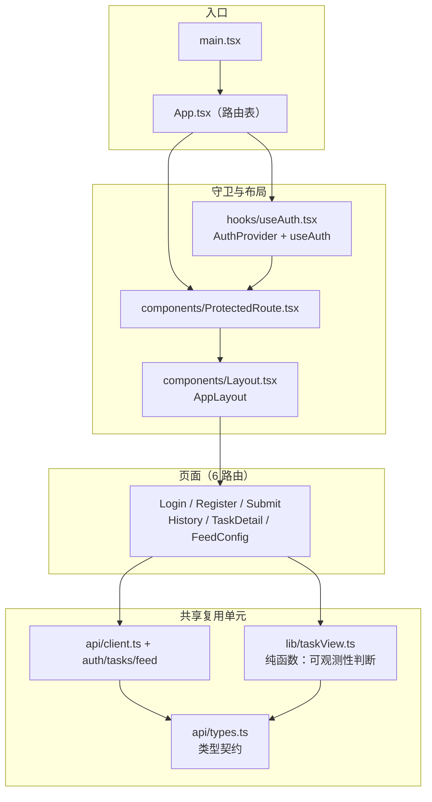

# 双人对话播客自动生成系统 · 前端组件库清单

> **本文件的交付物身份**：项目任务书「四、项目任务分解」第 7 项（前端 Web 界面开发）要求的两件交付物之一是 **「组件库」**。代码本体在仓库里，但**组件清单没有成件**；本文件是它在交付包中的落点。
>
> **「组件库」在本项目有两层含义，两层都要交代**：① 任务书「3.2 核心技术」指定的**第三方 UI 组件库**（TailwindCSS / Ant Design）——它决定「长什么样」；② 项目**自建的可复用组件与复用单元**——它决定「怎么组织」。只看代码看不到第一层的分工约定，只看依赖表看不到第二层的复用边界。

| 项 | 值 |
| --- | --- |
| 文档版本 | **V1.0.0** |
| 编制日期 | 2026-09-20 |
| 对应阶段 | D7 ~ D9（前端实现）→ D13（前端测试基建）→ **D14 成件** |
| 代码位置 | `frontend/src/`（**26 个文件**） |
| 关联文档 | 《双人对话播客自动生成系统_系统架构设计文档_V1.0.0.md》§6.2、《双人对话播客自动生成系统_UI-UX设计说明_V1.0.0.md》、《前端测试基建实施报告_V1.0.0.md》 |

## 版本记录

| 版本 | 日期 | 变更 |
| --- | --- | --- |
| **V1.0.0** | 2026-09-20 | 首次成件。登记第三方 UI 库的双库分工、项目自建组件与复用单元的完整清单、类型契约层、测试覆盖与复用边界纪律。 |

---

## 一、组件分层依赖图

---

## 二、第三方 UI 组件库：**双库分工**（任务书指定，两者均落地）

任务书「3.2 核心技术」写明 UI 组件库为 **TailwindCSS / Ant Design**。项目按**分工共存**落地，不是二选一：

| 库 | 版本 | 承载什么 | 不承载什么 |
| --- | --- | --- | --- |
| **Ant Design** | `antd ^5.21.0`（+ `@ant-design/icons ^5.5.1`） | **交互组件**：表单、表格、弹窗、消息提示、上传、分页、进度条等 | 页面级布局与响应式（交给 Tailwind） |
| **TailwindCSS** | `tailwindcss ^3.4.13`（+ `postcss` / `autoprefixer`） | **布局、间距、响应式、展示页样式** | 有状态交互组件（交给 AntD） |

> ⚠️ **这条分工是刻意的，不能简化成「只用 AntD」**。开发计划书 V1.2.1 曾把「只用 AntD、砍掉 Tailwind」写成既定事实且未声明，属**任务书技术栈未覆盖**，已被修复并恢复为双库分工。改前端技术栈时**必须先核任务书**。

---

## 三、项目自建的可复用单元

### 3.1 组件（`src/components/`）

| 文件 | 导出 | 职责 | 被谁复用 |
| --- | --- | --- | --- |
| `Layout.tsx` | `AppLayout` | 应用外壳：导航、内容区、登录态区 | 全部受保护页面 |
| `ProtectedRoute.tsx` | `ProtectedRoute` | **路由守卫**：未登录跳登录页 | 全部受保护路由 |

### 3.2 Hook（`src/hooks/`）

| 文件 | 导出 | 职责 |
| --- | --- | --- |
| `useAuth.tsx` | `AuthProvider`、`useAuth` | 鉴权状态管理。**登录态落地在 `localStorage['pc_user']`**（不只是 Cookie）——`ProtectedRoute` 读的就是它 |

> ⚠️ **登录态不止在 Cookie 里**：这是 D14 无头截图取证时踩到的坑——只写 Cookie 不写 `localStorage` 会让受保护页面全部弹回登录页。任何自动化脚本模拟登录时**必须同步写 `localStorage['pc_user']`**。

### 3.3 纯函数库（`src/lib/`）——**复用纪律的落点**

| 文件 | 导出 | 职责 |
| --- | --- | --- |
| `taskView.ts` | `queueLabel`、`cacheLabel`、`showQueue`、`showCache` | 任务可观测性判断（队列状态文案、缓存命中读数显隐等） |

> ⚠️ **`showQueue` 由两个页面共用，不许各写一套**。历史上 `Submit` 与 `TaskDetail` 各自判断过一次队列可见性，口径不一致；收口到本文件后，改判定只需动一处。
> 本层是**纯函数**，因此可以被单测完整覆盖（见第六章）——这正是把它抽出来的另一个理由。

### 3.4 API 层（`src/api/`）

| 文件 | 导出 | 职责 |
| --- | --- | --- |
| `client.ts` | `api`、`ApiError`、`API_BASE` | 统一请求封装、错误类型、基址 |
| `auth.ts` | `authApi` | 注册 / 登录 / 当前用户 |
| `tasks.ts` | `tasksApi` | 任务提交、进度、脚本读写、试听、下载 |
| `feed.ts` | `feedApi` | 频道配置与订阅源 |
| `types.ts` | **12 个类型**（见第四章） | 与后端契约的类型映射 |

---

## 四、类型契约层

`src/api/types.ts` 导出（**前后端契约的前端侧镜像**）：

| 分类 | 类型 |
| --- | --- |
| 状态 | `TaskStatus` |
| 用户 | `UserOut`、`TokenOut` |
| 任务 | `TaskOut`、`TaskPageOut`、`TaskCreateIn` |
| 脚本 | `ScriptLineOut`、`ScriptOut`、`ScriptLineIn`、`ScriptSaveIn` |
| 订阅源 | `FeedOut`、`FeedUpdateIn` |

> 类型契约的**机械核对**由 `scripts/check_frontend_contract.py` 负责（门禁第一步），保证前端类型与后端接口文档/`schemas.py` 不漂移。

---

## 五、页面组件（6 个路由）

| 文件 | 导出 | 路由 | 职责 |
| --- | --- | --- | --- |
| `pages/Login.tsx` | `Login` | `/login` | 登录 |
| `pages/Register.tsx` | `Register` | `/register` | 注册 |
| `pages/Submit.tsx` | `Submit` | `/`（提交页） | 主题与要求提交、队列可观测性 |
| `pages/History.tsx` | `History` | `/history` | 历史任务列表 |
| `pages/TaskDetail.tsx` | `TaskDetail` | `/tasks/:id` | 脚本编辑 / 逐句试听 / 成片播放下载 / 进度 |
| `pages/FeedConfig.tsx` | `FeedConfig` | `/feed` | 播客频道配置 |

> ⚠️ **`/feed` 这条路由踩过一个真坑**：Vite 代理键 `'/feed'` 是**前缀匹配**，会把前端**页面路由** `/feed` 自己吞掉，直开或 F5 得到后端 `{"detail":"Not Found"}`（点导航链接却正常，所以没被任何用例覆盖）。已改为正则 `'^/feed/.+$'`——只代理 `/feed/<token>.xml`，放行页面路由。

---

## 六、测试覆盖

测试运行器 **vitest 3.2.7**（⚠️ **不要装 `latest`**：4/5 版要求 `vite ^6/^7`，而本项目锁 `vite ^5`）。

| 文件 | 覆盖对象 |
| --- | --- |
| `lib/taskView.test.ts` | 纯函数库（`taskView.ts`） |
| `pages/History.test.tsx` | 历史列表组件 |
| `pages/TaskDetail.test.tsx` | 任务详情组件 |

**规模**：**34 条 / 3 个文件**（**纯函数 21 条 + 组件 13 条**）。

**测试基建**（`src/test/`）：

| 文件 | 导出 | 职责 |
| --- | --- | --- |
| `setup.ts` | — | vitest setup（jest-dom 等） |
| `factories.ts` | `makeTask` | 测试数据工厂（**统一构造任务对象**，避免各用例手搓导致字段漂移） |
| `renderAt.tsx` | `renderAt` | 带路由上下文的渲染辅助 |

**门禁**：`scripts/check_frontend.py [--full]` —— 契约 → 类型 → 单测 → 构建 四步。
**变异台**：`scripts/mutation_check_frontend.py` —— **7 / 7**（每条注入必红）。

> **未覆盖项（如实登记）**：`Submit` / `Login` / `FeedConfig` **三个页面没有组件测试**。它们的逻辑相对薄（表单与跳转），但仍属覆盖缺口，不因「已过门禁」而消失。

---

## 七、复用边界纪律（**本清单存在的真正目的**）

| # | 纪律 | 反例（已发生） |
| --- | --- | --- |
| R1 | **可观测性判断只写在 `lib/taskView.ts`**，页面不得各写一套 | `Submit` 与 `TaskDetail` 曾各判一次队列可见性，口径不一 |
| R2 | **UI 组件库按分工用**，交互组件走 AntD、布局走 Tailwind | 曾试图「只用 AntD」并砍掉 Tailwind，与任务书不符 |
| R3 | **类型只在 `api/types.ts` 定义**，不散落各页面 | — |
| R4 | **测试数据只用 `factories.ts`** 构造 | — |
| R5 | **前端命令一律 `node node_modules/<pkg>/<entry>.js`**，不用 `npm.cmd` | 本机 `npm.cmd` 被 `spawn` 会抛 `EINVAL` |
| R6 | **登录态同时写 Cookie 与 `localStorage['pc_user']`** | 只写 Cookie → 受保护页面全弹回登录页 |

---

**文档结束** | 版本 V1.0.0 | 编制日期 2026-09-20
