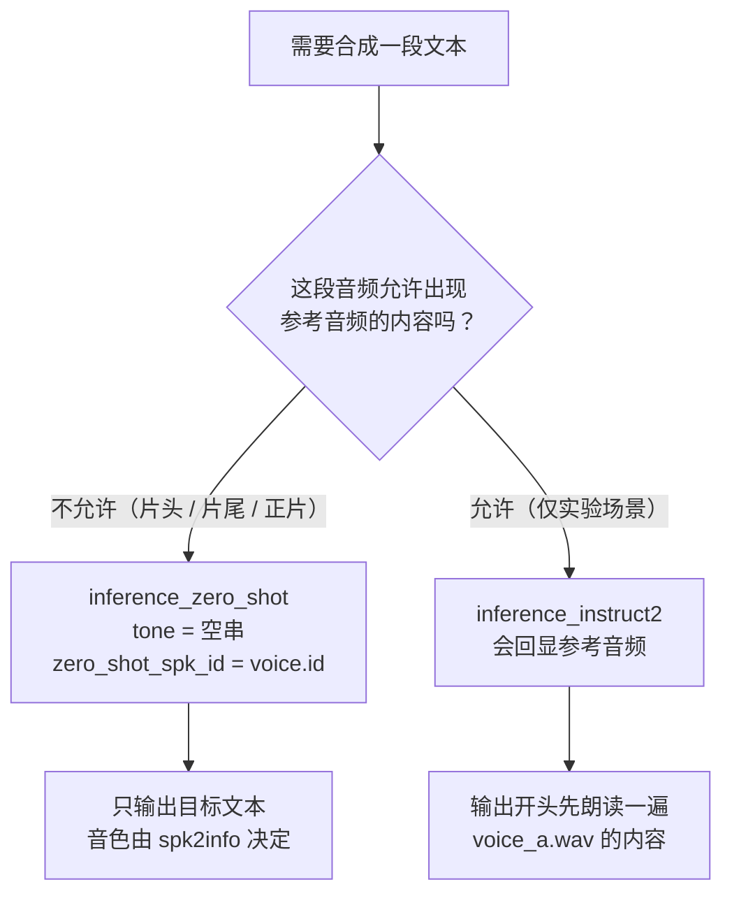

# 双人对话播客自动生成系统 · 合成基线报告

> **本文件的交付物身份**：项目任务书「四、项目任务分解」第 4 项（语音合成服务封装）要求的两件交付物之一是 **「合成基线报告」**（计划书口径：D3 出首版、D11 出正式版）。此前该内容散在《D2-D3 报告》§3~§5 与《D11 报告》，**没有独立成件**；本文件是它在交付包中的落点。
>
> **同族文档分工**：本文件 = **合成质量基线（音色档案 / 语气通道 / 片头尾 / 响度 / 成片样本）**；《双人对话播客自动生成系统_部署基线报告_V1.0.0.md》= **部署基线（显存 / RTF / 模型定稿）**；《双人对话播客自动生成系统_MOS评测报告_V1.0.0.md》与《双人对话播客自动生成系统_一致率比对报告_V1.0.0.md》= 两个**质量指标专件**（本文件只给结论与指针，不重复其证据）。

| 项 | 值 |
| --- | --- |
| 文档版本 | **V1.0.0** |
| 编制日期 | 2026-09-20 |
| 采集阶段 | D2（音色建档）→ D3（合成服务封装）→ D4 前置（音色换档与种子固定）→ D5（响度与片头尾）→ **D11（正式版收口）** |
| 关联文档 | 《D2-D3模型定稿与合成服务实施报告_V1.1.0.md》《D4前置检查报告_V1.3.0.md》《D5后期与导出实施报告_V1.1.1.md》《D11评测指标达标实施报告_V1.2.0.md》《backend/assets/README.md》 |

## 版本记录

| 版本 | 日期 | 变更 |
| --- | --- | --- |
| **V1.0.0** | 2026-09-20 | 首次成件。汇总两代音色档案、语气通道实测、片头尾素材基线、响度口径与演示成片样本；**F0 一律标注「源录音 / 合成输出」口径**。 |

---

## 一、基线的口径声明

引用本报告任何数字前，先确认三件事：

| # | 口径 | 说明 |
| --- | --- | --- |
| O1 | **F0 是「源录音」还是「合成输出」** | 两者可差上百赫兹。详见 §二 |
| O2 | **片头尾素材属哪一代** | 2026-09-17 起片头尾改走**纯克隆**（`tone=""`），与 09-16 的 **instruct2 版不是同一代**；历史章节的数字**不能用来描述当前素材** |
| O3 | **是否固定随机种子** | `PATCH-SEED-01`（`TTS_RANDOM_SEED=42`）起，「同输入 → 同输出」成立 |

---

## 二、音色档案基线

### 2.1 两代档案的演进

| 阶段 | `voice_a`（女声） | `voice_b`（男声） |
| --- | --- | --- |
| D2 初版 | CosyVoice **官方 3.48 s 示例占位**（低于 5~10 s 建议区间） | **缺失** → 走 `SPEAKER_FALLBACK_ENABLED=true` 回退到 A，双人对话暂时同音 |
| D4 前置 | — | **用户第 2 版录音建档**：原始 8.148 s → **裁尾静音后 6.70 s**（16 kHz 单声道），落在建议区间 |
| D5（音质专项） | **换档为用户真人录音** `life.m4a`（原始 5.525 s / 48 kHz 单声道 / 峰值 −15.65 dBFS），替代官方示例占位 | 不变 |

**当前状态**：两组**均为自有录制**（授权与合规见开发计划书 §10.1）。`voice_a` 早期占位素材已不参与生产。

### 2.2 双音色区分度（**两个口径并列，不得混用**）

| 口径 | `voice_a`（女） | `voice_b`（男） | 差值 | 出处 |
| --- | --- | --- | --- | --- |
| **源录音** F0 中位数（V1.9.0 起统一口径：自相关法、帧级中位数、清音帧按相关系数 0.3 剔除） | **175.8 Hz** | **111.9 Hz** | **63.9 Hz** | 开发计划书 §2.3 / §4.5 |
| **合成输出** F0 中位数（V1.6.0 及之前的登记值） | **235.3 Hz** | **110.3 Hz** | **125.0 Hz** | D4 前置报告 §3.1 |

> ⚠️ **同一份档案为什么有两个 F0**：这是**度量对象不同**（源录音 vs 克隆输出），不是数据打架。开发计划书 V1.9.0 立了「F0 口径纪律」，此后登记一律用**源录音**口径；历史文档里的 235.3 / 110.3 是**合成输出**口径，两者都成立但不可混算。
> ⚠️ **`voice_b` 的源录音在两次取证中登记为 110.3 Hz 与 111.9 Hz（差 1.6 Hz）**，属不同取证轮次的正常离散，**不影响任何结论**；引用时须与取证轮次一致。
> ✅ **男声侧的强旁证**：`voice_b` 的**输出** F0 与其**源录音**完全一致（**110.3 Hz，偏差 0.0 Hz**）——这是「零样本克隆确实生效、且没有串档」的客观证据。

### 2.3 说话人映射

| 脚本 `speaker` | 音色档案 | 说明 |
| --- | --- | --- |
| `A` | `voice_a` | 女声·知性沉稳 |
| `B` | `voice_b` | 男声·沉稳 |

**生产路径实测不回退**。`SPEAKER_FALLBACK_ENABLED=true` **保留在代码中**：音色缺失时按 A 回退并**显式告警**，不静默串音。这是一道保险（`voice_b` 就位后不再触发）。

> 该机制的来由值得记一笔：脚本行的 `speaker` 是 `A`/`B`，而档案 id 是 `voice_a`/`voice_b`，服务层原本缺少这层映射，直接导致首次 D3 验收以 `VoiceNotFound: 音色不存在：A` 中断。

---

## 三、参考音频与提示词一致性（**硬规矩**）

**规则**：`prompt_text` 必须与参考音频**逐字一致**，不得截短。

- 依据：D2 阶段对照实验确认，截短 `prompt_text` 会造成音色漂移。**早期「截短 prompt_text」的做法已作废**，不得再引用。
- 反面案例：首版 `voice_b` 的 `prompt_text` 由 whisper 自动转写，**尾段 1.9 s 人声漏转写**，造成文本与音频不匹配。当时误判其与「长尾输出」有关；**该因果已在 D4 前置报告撤回更正**（真正根因是生成未收敛时解码到长度上限）。

**档案规格**：任意输入统一为 **16 kHz 单声道**；`make_voice_profile.py` 对不在 **5~10 s** 建议区间的素材告警。

---

## 四、语气通道基线（**本项目踩过最深的一个坑**）

### 4.0 通道选择的决策路径（当前已定稿的走法）



**结论：本项目所有生产场景都走上面那条路。** `instruct2` 通道只保留在历史实验记录里，不在任何交付链路上。

### 4.1 实测结论

| 配置（同文案 / 语速 1.0） | 时长 | F0 | SHA1 |
| --- | --- | --- | --- |
| `--tone ""`（纯克隆 `zero_shot`） | 6.88 s | 197.5 Hz | 不同 |
| `--tone "…自然放松…但不夸张"` | 12.76 s | 179.8 Hz | `42a575dd…` |
| `--tone "…开心地聊天…带着笑意"` | 12.76 s | 179.8 Hz | `42a575dd…` ← **与上一条字节完全相同** |

**两条语义不同的指令产出逐字节相同的音频 ⇒ 指令文本未被模型使用。** `--tone` 的文本内容**不影响合成结果**，它只决定「走不走 instruct2 通道」。

### 4.2 根因与致命副作用

根因在 `CosyVoice/cosyvoice/cli/frontend.py` 的 `frontend_zero_shot`：

```python
if zero_shot_spk_id == '':
    prompt_text_token = self._extract_text_token(prompt_text)  # ← 才会用 instruct
else:
    model_input = {**self.spk2info[zero_shot_spk_id]}          # ← 忽略 prompt_text
```

调用方传的 `zero_shot_spk_id=voice.id` **非空** ⇒ 永远走 `else`，instruct 被丢弃。

**更致命的副作用**：`inference_instruct2` 在 `zero_shot_spk_id` 非空时，会把 `prompt_wav`（`voice_a.wav`，内容为「生活就像海洋…」）当作声学前缀**回显到输出开头** —— 素材开头会先朗读一遍参考音频旧句。

### 4.3 已实施的修复（2026-09-17）

**片头 / 片尾一律改走 `inference_zero_shot`（即 `tone=""`），并保留 `zero_shot_spk_id=voice.id`**（换用预计算 `spk2info`，只输出目标文本、不回显）。

| 落点 | 做法 |
| --- | --- |
| `api/services/task_runner.py` 的 `_stage_postprocess` 片头合成处 | **强制传 `tone=""`**；`INTRO_TONE` 在此被**有意忽略**，防止再次误引入该 bug |
| `scripts/make_intro_outro.py` | `DEFAULT_TONE = ""`（脚本侧同样强制），`--tone` 降级为**哑参数**（只改控制台回显） |

> ⚠️ **早期文档曾把修复方向写成「把 `zero_shot_spk_id` 改为空串、让前端 tokenize instruct」——那是错的，未采用**：会重新启用 instruct2 通道，等于把回显 bug 请回来。**根因在 `instruct2` 这条通道，不在 `zero_shot_spk_id` 非空。**
> **代价**：放弃 instruct2 的语气指令能力，语气只能靠 `speed` 与文案调。

### 4.4 语速（当前唯一生效的语气旋钮）

`speed` 在 `CosyVoice/cosyvoice/cli/model.py` 的 `token2wav()` 中实现为 mel 域时间缩放（`F.interpolate(tts_mel, size=int(mel_len / speed))`），因此**只改语速、不改音高**：

- 实测提速 1.05 → 1.41（时长 14.54 → 10.82 s）后，**F0 仅从 197.5 掉到 196.3 Hz**；
- 语速可精确预测：`时长 ≈ 基准时长 / speed`。

**当前档位**：片头 / 片尾均 **1.05**。

---

## 五、片头 / 片尾素材基线

| 文件 | 时长 | 规格 | 通道 | 语速 |
| --- | --- | --- | --- | --- |
| `intro.mp3`（**回退素材**） | **6.54 s** | 44.1 kHz / 单声道 / 128 kbps | 纯克隆 `tone=""` | 1.05 |
| `outro.mp3` | **7.46 s** | 44.1 kHz / 单声道 / 128 kbps | 纯克隆 `tone=""` | 1.05 |

> 时长为 **ffprobe 实测**（2026-09-20 复测）。

**片头是动态生成的**：文案含占位符「大家好，今天是（日期），今天的主题是（主题）。」 ⇒ 必须按当期信息**现合成**。主链路先调 `_build_dynamic_intro()`（渲染模板 → 女声合成 → 归一 → 传后期）；**仅当模板为空或不含占位符时**才回退到固定 `intro.mp3`。

- 占位符三种写法都认：`（日期）` / `(日期)` / `{date}`，`（主题）` / `(主题)` / `{topic}`；
- **渲染用 `str.replace` 而非 `str.format`**（文案是用户自由文本，可能含 `{}`，format 会抛 `KeyError`）；
- 渲染逻辑集中在 `api/services/intro_outro.py`，主链路与脚本共用，避免两处漂移。

> ⚠️ **改 `backend/assets/intro.mp3` 不会影响成片**——默认流水线下片头每期现合成，该文件只是回退素材。

---

## 六、响度基线

**关键机制**：`postprocess.py` 对片头 / 片尾**只做 `unify()` + `apply_fade()`，不做 `loudnorm`**。因此**素材自身响度就是成片响度**——素材必须自归一到目标档，否则片头会明显比正片偏轻或偏响。

`make_intro_outro.py` 因此在导出前调用 `normalize_loudness()`，把片头尾对齐 `settings.audio_loudness_i`（≈ −16 LUFS）。

| 对象 | 响度 | 真峰 | 出处 |
| --- | --- | --- | --- |
| **当前片头 / 片尾素材** | **−16.5 / −16.5 LUFS** | **−1.9 dBFS** | `ffmpeg ebur128`，2026-09-20 复测 |
| 正片（成片） | −16.15 ~ −16.46 LUFS | 真峰 −1.90 dBTP | D5 报告 / 计划书 M2 行 |

**口径：声明的「loudnorm 达标」指的是「与正片同档」，不是「精确等于 −16.0」。**

> 后期链路的响度做法是**两遍 `loudnorm` 测量回填**（第二遍必须把第一遍的 `input_*` 回填到 `measured_*`），这也是 FFmpeg 要求 ≥ 9.0 的原因。

---

## 七、合成质量指标（结论 + 指针）

本报告只给结论，证据在专件中：

| 指标 | 结论 | 证据级别 | 专件 |
| --- | --- | --- | --- |
| **逐句一致率** | **1120 / 1120 = 100.00%**（36 期全量离线普查） | 机器证据 | 《一致率比对报告 V1.0.0》 |
| **MOS 自然度** | **3 位真人听测确认「都没问题」，用户裁定达标** | **人证**（无评分表、无均分） | 《MOS评测报告 V1.0.0》 |

> ⚠️ **MOS 该项不得写成「均分 X」**——没有这个数。详见 MOS 专件的口径纪律。

---

## 八、成片样本（D14 演示集）

| # | 任务 id | 选题类别 | 时长 | 体积 | 码率 |
| --- | --- | --- | --- | --- | --- |
| 1 | `ep_20260920_110641` | 科技与职业 | **301.68 s** | 4 827 889 B | 128 kbps |
| 2 | `ep_20260920_111344` | 生活与健康 | **257.06 s** | 4 114 015 B | 128 kbps |
| 3 | `ep_20260920_112014` | 社会与经济 | **279.36 s** | 4 470 952 B | 128 kbps |
| — | **合计** | 900 字档 × 3 | **838.10 s** | 13.41 MB | — |

时长为 **ffprobe 实测**。台账 `data/demo_pack.json`，核验脚本 `scripts/verify_demo_pack.py`（`--self-test` 12/12 必红）。

> **演示集入门槛**：全部 3 期均生成于 `intro_fix_cutoff = 2026-09-20T00:00:00+08:00` **之后**，以规避「片头可能回显参考音频」的历史成片。该截止时间的取证依据与局限写在台账的 `intro_fix_cutoff_依据` 字段里。

---

## 九、结论与偏差声明

**已达成**

| 项 | 基线 |
| --- | --- |
| 双音色区分度 | 两组档案均可加载，映射不回退；源录音 F0 差 63.9 Hz、输出 F0 差 125.0 Hz |
| 参考音频与提示词一致性 | 两组档案均逐字一致 |
| 片头尾无参考音频回显 | 通道已改为 `zero_shot`，并有 AST 级判据（`E-INTRO-TONE`）守通道 |
| 响度同档 | 片头尾 −16.5 LUFS / 真峰 −1.9 dBFS，与正片 −16.15~−16.46 LUFS 同档 |
| 逐句一致率 | 100.00%（全量普查） |

**偏差与例外（必须随结论引用）**

1. **`voice_a` 的两代素材差异**：D2 的官方示例占位（3.48 s，低于建议区间）已被 D5 的真人录音替代；但 **`voice_a.wav` 在本仓库中仍为可公开下载的声纹素材**（见交付说明）。
2. **语气指令能力缺失**：`tone` 通道因回显缺陷被放弃，语气只能靠 `speed` 与文案调。这是**主动的取舍**，不是未完成项。
3. **MOS 为人证口径**，无评分表、无均分。
4. **「片头听感是否正确」机器判不了**：机器判据只能守「通道 + 时间线」，守不住「听起来对不对」——演示前**必须用耳朵听一遍**（台账已列为人工作业）。

---

**文档结束** | 版本 V1.0.0 | 编制日期 2026-09-20
