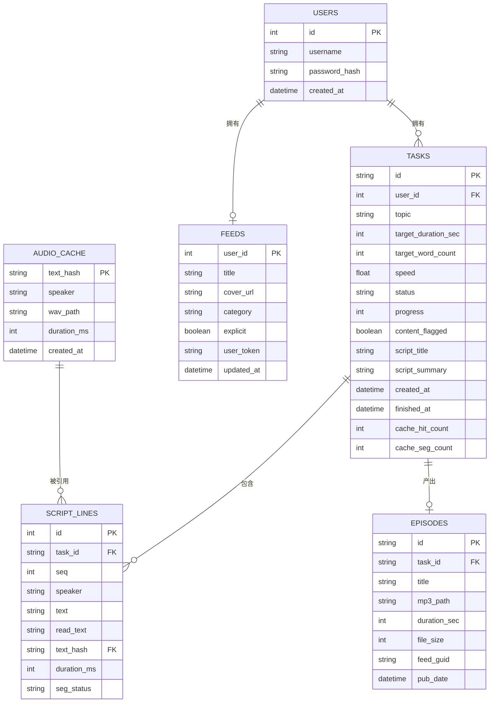
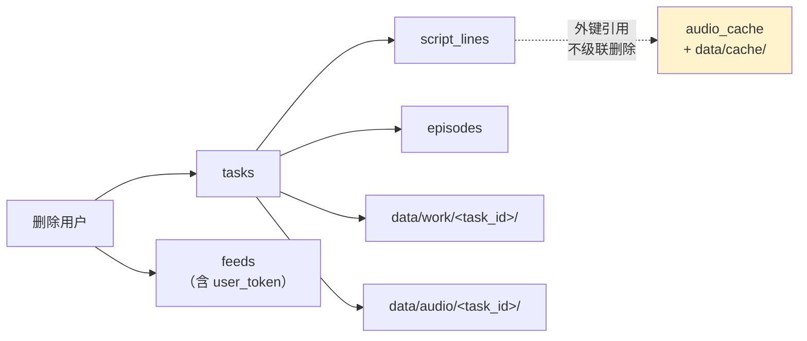

# 双人对话播客自动生成系统 · 数据库设计文档

> 版本：V1.0.0　|　日期：2026-09-20　|　对应《双人对话播客自动生成系统_开发计划书_V1.22.0.md》4.6 / 4.8 / 10.2
> 存储引擎：**SQLite 3（单文件）**　|　ORM：**SQLAlchemy 2.0**（`DeclarativeBase` 声明式）　|　库文件：`data/podcast.db`

## 版本记录

| 版本 | 日期 | 变更摘要 |
| --- | --- | --- |
| V1.0.0 | 2026-09-20 | 首次发布（D13 文档齐备阶段九项之一）。6 张表的字段级设计、索引与约束、ER 图、PRAGMA 设定、迁移方式与清理策略；并集中登记与计划书 ER 图的**三处偏差**（`DEV-SCHEMA-01a/b/c`）及其理由。素材逐条取自 `api/models.py` 与 `api/db.py`。 |

> **本文档的权威性**：字段名、类型、长度、默认值、索引**全部从 `api/models.py` 读取**，不是设计稿转写。
> 若本文档与代码不一致，**以代码为准**，并应立刻修正本文档——数据库文档一旦与实现脱节，比没有更危险。

---

## 1. 设计总览

### 1.1 为什么是 SQLite

| 理由 | 说明 |
| --- | --- |
| 零运维 | 任务书指定 `sqlite3`；单机部署下无需额外数据库服务进程 |
| 事务足够 | 业务是「单并发任务队列 + 少量轮询读」，写压力极低 |
| 单文件可备份 | 整个库就是一个文件，备份 = 复制文件 |
| 代价 | **写并发弱**：因此必须开 WAL、必须控制事务长度（见 7.4） |

### 1.2 实体关系



**五种关系一句话读完**：

1. 一个用户多个任务（`USERS ||--o{ TASKS`）；
2. 一个用户最多一个频道（`USERS ||--o| FEEDS`，`feeds.user_id` 既是主键又是外键）；
3. 一个任务多行脚本（`TASKS ||--o{ SCRIPT_LINES`，按 `seq` 排序）；
4. 一个任务最多一条单集记录（`TASKS ||--o| EPISODES`，`task_id` unique）；
5. **一行脚本引用一条句级缓存**（`AUDIO_CACHE ||--o{ SCRIPT_LINES`）——注意方向：**一条缓存可被多个任务的多行引用**，这是「跨任务复用」的实现方式。

### 1.3 表清单

| # | 表名 | 实体 | 行数量级 | 生命周期 |
| --- | --- | --- | --- | --- |
| 1 | `users` | 用户 | 个位~百 | 长期 |
| 2 | `feeds` | 播客频道配置 | 与 users 1:1 | 长期 |
| 3 | `tasks` | 生成任务 | 每期一条 | 长期（历史列表） |
| 4 | `script_lines` | 脚本行 | 每期数十~数百行 | 随任务级联删除 |
| 5 | `audio_cache` | 句级音频缓存 | **持续增长，跨任务共享** | **不受保留期约束** |
| 6 | `episodes` | 单集（成片） | 每期一条 | 长期（RSS 依赖） |

### 1.4 通用约定

| 项 | 约定 |
| --- | --- |
| 主键风格 | 业务实体用 **uuid4 字符串**（`tasks` / `episodes`）以便对外暴露；内部实体用自增 `Integer`（`users` / `script_lines`）；`feeds` 用「用户 id 即主键」；`audio_cache` 用内容哈希 |
| 时间 | **一律 naive UTC**（`models.utcnow()`）。SQLite 不保存时区，混存 aware/naive 会直接抛 `TypeError`（见 7.3） |
| 命名 | 表名复数小写下划线；ORM 类名驼峰单数 |
| 枚举取值 | 存**字符串常量**而非整数（可读性优先，且便于人工查库排障） |
| 外键 | 全部显式声明 `ondelete="CASCADE"`，且**必须靠 PRAGMA 打开才有约束力**（见 7.1） |
| 布尔 | SQLite 无原生布尔，用 `Boolean`（落库为 0/1） |
| 文本长度 | 短字段给显式长度（如 `String(64)`），长文本用 `Text`（无长度上限） |

---

## 2. 表 `users` — 用户

**ORM**：`api.models.User`　|　**用途**：账号与鉴权

| 列 | 类型 | 约束 | 默认 | 说明 |
| --- | --- | --- | --- | --- |
| `id` | INTEGER | **PK** | 自增 | 主键 |
| `username` | VARCHAR(64) | **UNIQUE**、**INDEX**、NOT NULL | — | 登录名。接口层限定 ASCII（3~32 位，`^[A-Za-z0-9_.-]+$`） |
| `password_hash` | VARCHAR(255) | NOT NULL | — | bcrypt 散列值。**明文口令从不落库、从不入日志** |
| `created_at` | DATETIME | NOT NULL | `utcnow()` | naive UTC |

**索引**

| 名称 | 列 | 唯一 | 用途 |
| --- | --- | --- | --- |
| （隐式） | `username` | ✅ | 登录查询 `WHERE username = ?`；同时保证用户名不重复 |

**关系**

| 关系 | 目标 | 级联 | 说明 |
| --- | --- | --- | --- |
| `tasks` | `Task` | `all, delete-orphan` + `passive_deletes` | 删用户 → 删其全部任务（进而级联删脚本与单集） |
| `feed` | `Feed` | 同上，`uselist=False` | 一用户一频道 |

> `passive_deletes=True` 的含义：**交给数据库的 `ON DELETE CASCADE` 去删**，ORM 不逐条加载再删。这是性能与正确性的双重选择——但前提是 `PRAGMA foreign_keys=ON` 必须生效（见 7.1）。

---

## 3. 表 `feeds` — 播客频道配置

**ORM**：`api.models.Feed`　|　**用途**：RSS 订阅源的元数据与寻址

| 列 | 类型 | 约束 | 默认 | 说明 |
| --- | --- | --- | --- | --- |
| `user_id` | INTEGER | **PK**、FK → `users.id` `ON DELETE CASCADE` | — | 一用户一频道 |
| `title` | VARCHAR(200) | NOT NULL | `""` | 节目标题 |
| `description` | TEXT | NOT NULL | `""` | 节目描述 |
| `cover_url` | VARCHAR(500) | NOT NULL | `""` | 封面地址 |
| `category` | VARCHAR(64) | NOT NULL | `"Technology"` | iTunes 分类 |
| `explicit` | BOOLEAN | NOT NULL | `False` | 内容分级标记 |
| `updated_at` | DATETIME | NOT NULL | `utcnow()`，`onupdate=utcnow()` | 任何更新自动刷新 |
| `user_token` | VARCHAR(64) | **UNIQUE**、**INDEX**、NOT NULL | — | **[DEV-SCHEMA-01c]** 订阅寻址 token（不可猜测、可一键重置） |

**索引**

| 名称 | 列 | 唯一 | 用途 |
| --- | --- | --- | --- |
| （隐式） | `user_token` | ✅ | 公开 RSS 端点 `/feed/{user_token}.xml` 的查询键 |

**`user_token` 的设计说明**（`[DEV-SCHEMA-01c]`）

| 项 | 内容 |
| --- | --- |
| 计划书 ER 图 | **未列此列** |
| 为什么要加 | 计划书 4.7.1 要求 enclosure 路径含「不可猜测的随机 token」且「可一键重置」 |
| 为什么挂在 `feeds` 而非 `users` | 它的**唯一用途**就是该用户的订阅源寻址，随频道重置最自然 |
| 重置语义 | `PUT /api/feeds/me` 带 `reset_token=true` → 生成新 token、**删除旧 `{old_token}.xml` 文件**、用新 token 重新落盘 |

> ⚠️ **重置顺序（`[FIX-FEED-RESET-01]`）**：**必须先捕捉「旧」token，再改写 `feed.user_token`**。反过来会删掉「还没生成的新文件」，导致旧 XML 始终留在磁盘 → 旧地址仍可访问、新地址 404。此缺陷由 D6 验证脚本暴露，已修复。

---

## 4. 表 `tasks` — 生成任务

**ORM**：`api.models.Task`　|　**用途**：一次「主题 → 成片」的全生命周期记录

| 列 | 类型 | 约束 | 默认 | 说明 |
| --- | --- | --- | --- | --- |
| `id` | VARCHAR(36) | **PK** | uuid4 | 对外暴露的任务 id |
| `user_id` | INTEGER | FK → `users.id` CASCADE、**INDEX** | — | 归属用户 |
| `topic` | VARCHAR(300) | NOT NULL | — | 主题 |
| `target_duration_sec` | INTEGER | NOT NULL | `300` | 目标时长（秒） |
| `target_word_count` | INTEGER | NOT NULL | `0` | 由时长按 `WORDS_PER_MINUTE` 反推的字数配额 |
| `style` | VARCHAR(200) | NOT NULL | `""` | 语言风格提示 |
| `voice_a` | VARCHAR(64) | NOT NULL | `""` | 说话人 A 的音色档案 id |
| `voice_b` | VARCHAR(64) | NOT NULL | `""` | 说话人 B 的音色档案 id |
| `speed` | FLOAT | NOT NULL | `1.0` | 语速（**参与缓存键**） |
| `tone` | VARCHAR(100) | NOT NULL | `""` | 情绪指令 |
| `status` | VARCHAR(24) | **INDEX**、NOT NULL | `PENDING` | 状态机当前状态（见 4.1） |
| `progress` | INTEGER | NOT NULL | `0` | 0~100 |
| `stage` | VARCHAR(48) | NOT NULL | `""` | 人类可读阶段文案 |
| `error_msg` | TEXT | NOT NULL | `""` | 失败原因 |
| `content_flagged` | BOOLEAN | NOT NULL | `False` | 合规自检是否命中敏感词 |
| `script_title` | VARCHAR(300) | NOT NULL | `""` | **[DEV-SCHEMA-01a]** 脚本标题 |
| `script_summary` | TEXT | NOT NULL | `""` | **[DEV-SCHEMA-01b]** 脚本摘要 |
| `created_at` | DATETIME | NOT NULL | `utcnow()` | — |
| `updated_at` | DATETIME | NOT NULL | `utcnow()`，`onupdate=utcnow()` | — |
| `finished_at` | DATETIME | **NULLABLE** | `NULL` | 进入终态时写入（负责触发清理） |
| `cache_hit_count` | INTEGER | NOT NULL | `0` | **[D12]** 合成阶段最近一次缓存命中数 |
| `cache_seg_count` | INTEGER | NOT NULL | `0` | **[D12]** 该次的分段总数 |

**索引**

| 名称 | 列 | 唯一 | 用途 |
| --- | --- | --- | --- |
| `ix_tasks_user_status` | (`user_id`, `status`) | ❌（复合） | **计划书 4.6 指定的核心索引**：历史任务列表按用户与状态过滤 |
| （隐式） | `user_id` | ❌ | 外键查询 |
| （隐式） | `status` | ❌ | 启动时扫非终态任务 |

### 4.1 `status` 的取值

| 值 | 终态 | 说明 |
| --- | --- | --- |
| `PENDING` | ❌ | 已创建，等待队列 |
| `SCRIPTING` | ❌ | 脚本生成中 |
| `SCRIPT_READY` | ❌ | 脚本就绪，**等用户确认** |
| `SYNTHESIZING` | ❌ | 语音合成中 |
| `POSTPROCESSING` | ❌ | 后期处理中 |
| `PACKAGING` | ❌ | 封装成片与 RSS |
| `DONE` | ✅ | 成功 |
| `FAILED` | ✅ | 失败（`error_msg` 有值） |
| `CANCELED` | ✅ | 已取消 |

> **状态机迁移表不在本表定义**，它在 `api/services/task_runner.TRANSITIONS`。`models.TaskStatus` 只存词汇，**不定义图**——避免同一份状态机有两处会飘的定义。

### 4.2 三处超出 ER 的列（`DEV-SCHEMA-01a/b/c`）

| 编号 | 列 | 计划书 ER 图 | 加上它的理由 |
| --- | --- | --- | --- |
| `DEV-SCHEMA-01a` | `tasks.script_title` | 未列 | 脚本标题**必须在 `PACKAGING` 之前可达**：`episodes.title` 与 RSS item 描述都取自它，而 `episodes` 行是 `PACKAGING` 阶段才建的。不存这列就得把标题塞进 `script_lines`（污染表语义）或写进 `work` 目录（终态即删，不可靠） |
| `DEV-SCHEMA-01b` | `tasks.script_summary` | 未列 | 同上 |
| `DEV-SCHEMA-01c` | `feeds.user_token` | 未列 | 计划书 4.7.1 要求「不可猜测 + 可重置」的订阅寻址（见 3） |

### 4.3 `cache_hit_count` / `cache_seg_count` 的口径

| 项 | 约定 |
| --- | --- |
| 何时写 | 只有**实际跑过合成**的任务才非空（`SCRIPTING` 之前保持 0） |
| 累加还是重算 | **整体重算，不是累加**。续跑时绝大多数段命中缓存，这两个数字要体现的正是那一刻的真实读数 |
| 是否参与查询 | **否**。不加表关联、不加索引——它只用于展示与验证 |
| 派生字段 | `cache_hit_rate` **不落库**，由 `Task.to_dict()` 派生；`cache_seg_count=0` 时返回 **`null`** 而不是 `0.0` |

> ⚠️ **`null` 与 `0.0` 在这里是两回事**：段数为 0 意味着「没测过」，`0.0` 会被读成「完全未命中」。前端与文档都必须按 `null` 处理。

---

## 5. 表 `script_lines` — 脚本行

**ORM**：`api.models.ScriptLine`　|　**用途**：逐行台词及其合成状态

| 列 | 类型 | 约束 | 默认 | 说明 |
| --- | --- | --- | --- | --- |
| `id` | INTEGER | **PK** | 自增 | 主键 |
| `task_id` | VARCHAR(36) | FK → `tasks.id` CASCADE、**INDEX** | — | 所属任务 |
| `seq` | INTEGER | NOT NULL | — | 行序号，**1 起连续** |
| `speaker` | VARCHAR(8) | NOT NULL | — | `A` / `B` |
| `text` | TEXT | NOT NULL | — | 脚本文本**原文** |
| `read_text` | TEXT | NOT NULL | `""` | **规范化后的读文**（数字/英文转写、多音字改写） |
| `text_hash` | VARCHAR(40) | FK → `audio_cache.text_hash`、**NULLABLE** | `NULL` | 缓存键。**指向该行首段**的缓存记录 |
| `duration_ms` | INTEGER | NOT NULL | `0` | 该行**全部**分段的音频总时长（**行级**） |
| `seg_status` | VARCHAR(16) | NOT NULL | `PENDING` | `PENDING` / `DONE` |

**索引**

| 名称 | 列 | 唯一 | 用途 |
| --- | --- | --- | --- |
| `ix_script_lines_task_seq` | (`task_id`, `seq`) | ✅ **UNIQUE** | 计划书 4.6 核心索引；**同时强制「同一任务内 `seq` 唯一」** |

### 5.1 三条关键设计决定（都是踩过坑的地方）

| # | 决定 | 理由 |
| --- | --- | --- |
| 1 | `audio_cache.text_hash` 是**全局唯一主键**（跨任务共享的句级缓存），`script_lines.text_hash` 是**外键**指向它 | 若把 `text_hash` 设成 `script_lines` 的唯一键，「任务 B 复用任务 A 已合成的句子」会**插入冲突** |
| 2 | `script_lines.text_hash` **必须可空** | 脚本在 `SCRIPT_READY` 阶段落库时**尚未合成**；强制非空会让「先存脚本、后合成」这条主流程直接插不进去 |
| 3 | `duration_ms` 是**行级**（Σ 分段），而 `text_hash` 指向**首段** | 一行可能被切成多句 → 多段。**两者粒度不同**（见 5.2） |

### 5.2 ⚠️ 粒度陷阱：`duration_ms` 与 `text_hash` 不同粒度

这是本项目**最容易误判**的一处口径，务必读完。

| 字段 | 粒度 | 含义 |
| --- | --- | --- |
| `duration_ms` | **行级** | 该行**所有分段**的音频总时长（Σ） |
| `text_hash` | **段级** | 指向该行**首段**的缓存记录 |

**为什么会这样**：媒体端点「逐句试听」返回的是**该行首段**（「试听入口 = 首段」是设计如此），所以 `text_hash` 指向首段是合理的；而 `duration_ms` 要给用户看「这行一共多长」，必须是行级总和。

**因此不能这样判一致性**（曾造成 98.75% 的**假失败**）：

```
❌ 错误判据：wav_duration_ms(text_hash 指向的首段) == duration_ms
```

多段行必然不等（首段比整行短），实测 1120 行里有 14 行不等，最大差 5760 ms。**正确判据是物理不变量**：

```
✅ 正确判据：首段时长 <= 该行总时长 + 容差
```

> **教训**：判据和数据「差一点点」时，**第一条动作是查口径，不是调阈值**。调阈值只会把真缺陷一起放过。

### 5.3 `seg_status` 的重置规则

`PUT /api/tasks/{id}/script`（人工编辑保存）时：**整份替换** `script_lines`，且新行一律 `seg_status=PENDING`、`read_text=""`、`text_hash=NULL`。

**为什么必须重置**：合成阶段会按**新文本**重新计算哈希并落库，旧的 `DONE` 会误导「已合成」，让前端显示错误的可试听状态。

---

## 6. 表 `audio_cache` — 句级音频缓存

**ORM**：`api.models.AudioCache`　|　**用途**：**跨任务共享**的句子级合成结果

| 列 | 类型 | 约束 | 默认 | 说明 |
| --- | --- | --- | --- | --- |
| `text_hash` | VARCHAR(40) | **PK** | — | sha1 缓存键（构造见 6.1） |
| `speaker` | VARCHAR(64) | NOT NULL | `""` | 音色标识（档案 id 或 speaker） |
| `wav_path` | VARCHAR(500) | NOT NULL | — | wav 文件路径（**指向 `data/cache/`**） |
| `duration_ms` | INTEGER | NOT NULL | `0` | 该段音频时长 |
| `created_at` | DATETIME | NOT NULL | `utcnow()` | — |

### 6.1 缓存键的构造

```
text_hash = sha1( voice_id | voice_fp | model_version | seed_tag
                | max_token_text_ratio | read_text | speed | tone )
```

| 组成项 | 为什么要进键 |
| --- | --- |
| `voice_id` / `voice_fp` | 换音色或换参考音频必须重合成（`voice_fp` 是音色指纹） |
| `model_version` | 换模型（v2 ↔ v3）结果不同 |
| `seed_tag` | **随机种子固定（`TTS_RANDOM_SEED`）后必须进键**，否则「同种子不同文本」会串味 |
| `max_token_text_ratio` | 影响生成长度上限 |
| `read_text` | **用规范化后的读文**而非原文——原文相同但读文不同（多音字）就该是两条缓存 |
| `speed` / `tone` | 语速与语气都改变波形 |

### 6.2 缓存的语义边界

| 项 | 约定 |
| --- | --- |
| 共享范围 | **全局**，不按用户、不按任务隔离 |
| 保留期 | **不受 `AUDIO_RETENTION_DAYS` 约束**（跨任务复用，删了会让缓存表整片失效） |
| 删除任务时 | **不清理**（`DELETE /api/tasks/{id}` 只删 `script_lines` 与 `episodes`） |
| 文件位置 | `data/cache/<hash>.wav`，**float32 格式**（见 6.3） |
| 命中率指标 | 由 `tasks.cache_hit_count` / `cache_seg_count` 体现（见 4.3） |

### 6.3 ⚠️ 缓存 wav 是 **float32**（fmt tag=3）

| 项 | 内容 |
| --- | --- |
| 事实 | 缓存 wav 使用 IEEE float32（`wFormatTag = 3`），部分文件是 `WAVE_FORMAT_EXTENSIBLE`（`0xFFFE`，真实格式在 SubFormat GUID 里） |
| 后果 | Python 标准库 **`wave` 模块读不了**（会报 `unknown format: 3`） |
| 正解 | **自解析 RIFF/WAVE 头**：识别 fmt tag 为 `1`（PCM16）/`3`（float32）/`0xFFFE`（EXTENSIBLE，读 SubFormat），并按声道数换算帧数 |
| 已在何处实现 | `scripts/verify_consistency.py::wav_duration_ms`（含单测覆盖 float32 / PCM16 / EXTENSIBLE / 立体声 / 4 组坏输入） |

---

## 7. 表 `episodes` — 单集（成片）

**ORM**：`api.models.Episode`　|　**用途**：一次成功任务的成片记录，RSS 的数据源

| 列 | 类型 | 约束 | 默认 | 说明 |
| --- | --- | --- | --- | --- |
| `id` | VARCHAR(36) | **PK** | uuid4 | 单集 id |
| `task_id` | VARCHAR(36) | FK → `tasks.id` CASCADE、**UNIQUE**、**INDEX** | — | 一任务一单集 |
| `title` | VARCHAR(300) | NOT NULL | `""` | 单集标题（来自 `tasks.script_title`） |
| `mp3_path` | VARCHAR(500) | NOT NULL | `""` | 成片路径（`data/audio/<task_id>/final.mp3`） |
| `duration_sec` | INTEGER | NOT NULL | `0` | 时长（秒） |
| `file_size` | INTEGER | NOT NULL | `0` | **字节数**（RSS `enclosure length` 用） |
| `feed_guid` | VARCHAR(64) | NOT NULL | `""` | RSS item 的 guid，也是公开音频路径的一段 |
| `pub_date` | DATETIME | NOT NULL | `utcnow()` | 发布时间（naive UTC） |

**索引**

| 名称 | 列 | 唯一 | 用途 |
| --- | --- | --- | --- |
| （隐式） | `task_id` | ✅ | 一任务一单集；同时是外键查询键 |
| （隐式，由查询行为驱动） | `feed_guid` | ❌ | 公开音频端点按 `feed_guid` 反查 |

> ⚠️ **`task_id` 的 UNIQUE 约束与续跑**：因为一任务只允许一条 episode 记录，**续跑（retry）时必须走 upsert 而不是 insert**，否则第二次产出会撞唯一约束。
>
> ⚠️ **`enclosure length` 必须是字节数，不是时长**（计划书 4.9）。这是播客客户端的硬要求，填错会导致订阅端无法正确缓冲。
>
> ⚠️ **升级注意**：若从「`task_id` 非唯一」的更早版本升级，`create_all` **不会修改既有表**、索引也不会自动重建——升级前须确认库里没有同一 `task_id` 的多条 episodes。

---

## 8. 索引与约束汇总

| 表 | 索引 / 约束 | 列 | 唯一 | 归属 |
| --- | --- | --- | --- | --- |
| `users` | 主键 | `id` | ✅ | — |
| `users` | 唯一索引 | `username` | ✅ | 登录 |
| `feeds` | 主键 = 外键 | `user_id` | ✅ | 一用户一频道 |
| `feeds` | 唯一索引 | `user_token` | ✅ | 公开 RSS 寻址 |
| `tasks` | 主键 | `id` | ✅ | — |
| `tasks` | 复合索引 | `user_id, status` | ❌ | **计划书 4.6 核心索引** |
| `tasks` | 外键 | `user_id` → `users.id` CASCADE | — | 级联删除 |
| `script_lines` | 主键 | `id` | ✅ | — |
| `script_lines` | 复合唯一索引 | `task_id, seq` | ✅ | **计划书 4.6 核心索引**；同时强制任务内行序唯一 |
| `script_lines` | 外键 | `task_id` → `tasks.id` CASCADE | — | 级联删除 |
| `script_lines` | 外键（可空） | `text_hash` → `audio_cache.text_hash` | — | 缓存引用 |
| `audio_cache` | 主键 | `text_hash` | ✅ | 内容寻址 |
| `episodes` | 主键 | `id` | ✅ | — |
| `episodes` | 唯一索引 + 外键 | `task_id` → `tasks.id` CASCADE | ✅ | 一任务一单集 |
| `episodes` | 查询键 | `feed_guid` | ❌ | 公开音频端点 |

**三条核心索引**（计划书 4.6 指定）：`tasks(user_id, status)`、`script_lines(task_id, seq)`、`audio_cache(text_hash)`。

---

## 9. 连接层设计（`api/db.py`）

### 9.1 四个 PRAGMA（**每次建连都执行**）

| PRAGMA | 值 | 作用 | 不设会怎样 |
| --- | --- | --- | --- |
| `journal_mode` | `WAL` | 读写互不阻塞 | 默认 rollback journal 下，队列线程写库会阻塞 HTTP 轮询读 → `database is locked` |
| `foreign_keys` | `ON` | 打开外键约束 | **SQLite 默认关外键**：所有 `ForeignKey(...)` 退化成「注释」，靠应用层自觉 |
| `busy_timeout` | `5000` ms | 写冲突时等待 | 写冲突立即抛 `database is locked` |
| `synchronous` | `NORMAL` | WAL 下的性能/安全折中 | `FULL` 更安全但更慢 |

### 9.2 引擎与会话

| 项 | 设定 | 理由 |
| --- | --- | --- |
| `connect_args` | `check_same_thread=False`、`timeout=15` | 请求线程与队列工作线程**共用同一 engine**；SQLite 默认禁止连接跨线程复用，而我们要的恰恰是「连接可在任意线程取用，但每线程各自持有自己的连接」 |
| `expire_on_commit` | `False` | 提交后不失效对象，避免提交后读属性触发额外查询 |
| engine 单例 | `get_engine()` 缓存 | **SQLite 单文件库开多个 engine 会各自持有连接池**，在 WAL 之外再引入一层锁竞争 |
| `reset_engine()` | 显式丢弃缓存 | **换库路径（测试夹具、迁移）时必须调用**，否则新 Settings 会被旧单例静默吃掉，表现为「明明换了 `DB_PATH`，数据却还落在旧库里」 |
| 短事务 | `session_scope()` | 「正常提交、异常回滚、始终关闭」。**HTTP 请求线程走 `get_db`（每请求一个 Session）** |

### 9.3 建表与补列（`init_db`）

```
init_db(s) = Base.metadata.create_all(engine)   # 幂等：只建缺失的表
           + _ensure_columns(engine)            # 幂等：只补缺失的列
```

**为什么必须有 `_ensure_columns`**：`Base.metadata.create_all` 对**已存在**的表**完全不动**，于是「给老库加一列」会静默不生效 —— 表现为新库一切正常，**只有老库炸**：

```
sqlite3.OperationalError: no such column: tasks.cache_hit_count
```

### 9.4 迁移清单 `_ADDED_COLUMNS`

D13 之前**不引入 Alembic**，用这份显式清单兜住增量列变更。新增列**必须登记在此**。

| 表 | 列 | DDL | 引入版本 |
| --- | --- | --- | --- |
| `tasks` | `cache_hit_count` | `INTEGER NOT NULL DEFAULT 0` | D12 |
| `tasks` | `cache_seg_count` | `INTEGER NOT NULL DEFAULT 0` | D12 |

**执行逻辑**：逐条 `PRAGMA table_info(<表>)` 检查列是否存在；表不存在则跳过（首次建库时 `create_all` 已带该列）；列不存在则执行 `ALTER TABLE ... ADD COLUMN`。**可重复执行**。

> **D13 之后的迁移路线**：若本阶段之后还有字段变更，应改用 Alembic；上述清单可直接搬进 Alembic 的初始迁移（代码注释中已写明这一路线）。

---

## 10. 数据生命周期

### 10.1 什么时候删什么

| 触发 | 删除对象 | 不删 |
| --- | --- | --- |
| 任务进入终态 | `data/work/<task_id>/`（中间产物） | 成片、脚本、缓存 |
| `DELETE /api/tasks/{id}` | `data/work/<task_id>/`、`data/audio/<task_id>/`；`script_lines` + `episodes`（级联） | **`audio_cache` 与 `data/cache/`** |
| 删除用户 | `tasks` → `script_lines`/`episodes`；`feeds`（全部级联） | 同上 |
| 保留期到期（`AUDIO_RETENTION_DAYS`，默认 30 天） | 成片音频 | **`data/cache`（句级缓存）**、数据库记录 |

### 10.2 级联链路图



> **黄色那个框是刻意的**：`audio_cache` 是**跨任务共享资产**，删任务**绝不能**连带删缓存——一条缓存可能正被另外几个任务引用着。

### 10.3 三个「删不掉」的历史教训

| 教训 | 内容 |
| --- | --- |
| `rmtree(ignore_errors=True)` 会掩盖系统性缺陷 | `task_runner._cleanup_work` 曾用它删 `data/work`，删失败**不留任何痕迹**，结果静默累积 **3.47 GB**。现已改为删后回查、残留即 `log.warning`（`[FIX-WORK-CLEANUP-OBS-01]`） |
| `except: pass` 同族缺陷 | R21 的写锁问题曾被 `except: pass` 掩盖成「没问题」 |
| 失败必须留痕，但**别升级成任务失败** | 清理失败不该让整期任务 FAILED——记日志、给回收命令即可 |

---

## 11. 数据库运维

| 操作 | 命令 | 说明 |
| --- | --- | --- |
| 查看表清单 | `sqlite3 data/podcast.db ".tables"` | 期望 6 张表 |
| 查看表结构 | `sqlite3 data/podcast.db ".schema tasks"` | 与本文档第 4 节比对 |
| 完整性检查 | `sqlite3 data/podcast.db "PRAGMA integrity_check;"` | 期望输出 `ok` |
| 确认 WAL 生效 | `sqlite3 data/podcast.db "PRAGMA journal_mode;"` | 期望 `wal` |
| 确认外键生效 | `sqlite3 data/podcast.db "PRAGMA foreign_keys;"` | ⚠️ **命令行默认是 `0`**，这是新连接的默认值；应用侧每次建连都显式打开 |
| 收缩空间 | `sqlite3 data/podcast.db "VACUUM;"` | **须先停服务** |
| 检查点 WAL | `sqlite3 data/podcast.db "PRAGMA wal_checkpoint(TRUNCATE);"` | 缩小 `-wal` 文件 |

### 11.1 备份

| 步骤 | 动作 |
| --- | --- |
| 1 | **停服务**（`stop_dev.bat`） |
| 2 | 复制 `data/podcast.db`；若 `-wal` / `-shm` 存在，**一并复制**（或先做 checkpoint 再复制主文件） |
| 3 | 校验备份可打开：`sqlite3 <备份文件> "PRAGMA integrity_check;"` → `ok` |

> ⚠️ **运行中直接复制主文件可能拿到不一致的快照**（已提交的数据可能还在 `-wal` 里）。要么停服务，要么用 SQLite 的在线备份接口。

### 11.2 常用排障查询

| 目的 | SQL |
| --- | --- |
| 非终态任务（该被崩溃恢复处理的） | `SELECT id, status, stage FROM tasks WHERE status NOT IN ('DONE','FAILED','CANCELED');` |
| 失败原因分布 | `SELECT error_msg, COUNT(*) FROM tasks WHERE status='FAILED' GROUP BY error_msg ORDER BY 2 DESC;` |
| 尚未合成的行 | `SELECT task_id, COUNT(*) FROM script_lines WHERE seg_status <> 'DONE' GROUP BY task_id;` |
| 脚本行缺读文（一致率排查） | `SELECT task_id, seq FROM script_lines WHERE read_text IS NULL OR read_text = '';` |
| 成片记录与实际文件对账 | 按 `episodes.mp3_path` 逐个 `os.path.isfile`（`cleanup_workspace.py` 内置了这一步） |
| 缓存表与磁盘对账 | 按 `audio_cache.wav_path` 逐个检查存在性 |
| 缓存复用热度 | `SELECT text_hash, COUNT(*) c FROM script_lines WHERE text_hash IS NOT NULL GROUP BY 1 ORDER BY c DESC LIMIT 20;` |

---

## 12. 数据字典速查（字段名 → 中文含义）

| 字段 | 含义 | 易错点 |
| --- | --- | --- |
| `tasks.status` | 状态机状态 | 迁移表在 `task_runner.TRANSITIONS`，不在此定义 |
| `tasks.target_word_count` | 派生的字数配额 | 由 `target_duration_sec × WORDS_PER_MINUTE / 60` 得来，**下限 60** |
| `tasks.cache_hit_rate` | 缓存命中率 | **不落库**，派生字段；`seg=0` 时为 `null` 而非 `0.0` |
| `tasks.cache_hit_count` | 命中数 | **整体重算非累加** |
| `script_lines.seq` | 行序号 | 1 起连续；`(task_id, seq)` 唯一 |
| `script_lines.text` | 脚本原文 | 与 `read_text` 可能不同，**这是设计行为** |
| `script_lines.read_text` | 规范化读文 | 参与缓存键；为空说明尚未规范化 |
| `script_lines.text_hash` | 缓存键（首段） | **可空**；粒度与 `duration_ms` 不同 |
| `script_lines.duration_ms` | 该行总时长 | **行级（Σ 分段）**，不要拿首段 wav 去比 |
| `script_lines.seg_status` | 句级状态 | 保存脚本后一律重置为 `PENDING` |
| `audio_cache.text_hash` | sha1 缓存键 | 组合项见 6.1；换音色/种子/语速/语气都会变 |
| `audio_cache.wav_path` | wav 路径 | 文件是 **float32**，`wave` 模块读不了 |
| `episodes.file_size` | 成片字节数 | RSS `enclosure length` 必须是**字节数** |
| `episodes.feed_guid` | RSS guid | 也是公开音频路径的一段；`task_id` unique → 续跑须 upsert |
| `feeds.user_token` | 订阅寻址 token | 重置顺序陷阱见 3（`FIX-FEED-RESET-01`） |

---

## 13. 与其他交付文档的关系

| 文档 | 关系 |
| --- | --- |
| 《开发计划书 V1.22.0》 | 本文档是该计划书 4.6 / 4.8 / 10.2 的落地展开；三处偏差已在其 4.6 处标注 `DEV-SCHEMA-01` |
| 《双人对话播客自动生成系统_API接口文档_V1.0.0.md》 | 表字段与接口字段的映射；接口不接收 `seq`、`queue_position` 不落库等约定在那里 |
| 《双人对话播客自动生成系统_部署运维手册_V1.2.0.md》 | 备份恢复、PRAGMA 排障、工作区回收 |
| 《双人对话播客自动生成系统_测试报告_V1.1.0.md》 | 本设计所述不变量（唯一约束、级联、粒度）的测试证据 |
