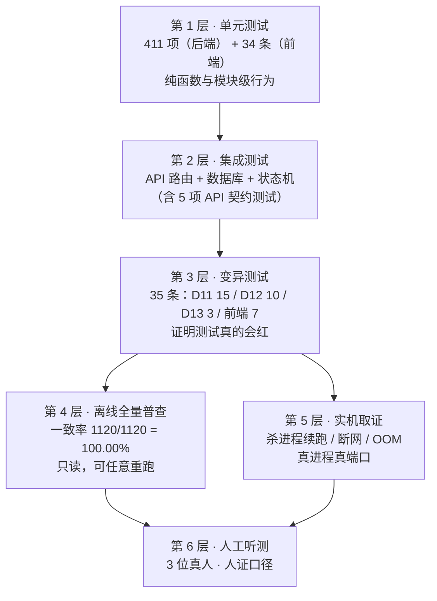

# 双人对话播客自动生成系统 · 测试报告

> 版本：V1.1.0　|　日期：2026-09-20　|　汇总范围：**D0 ~ D13 + 前端测试基建 + D11 评测**
> 本文档是**汇总型**测试报告：把散落在各阶段实施报告里的测试证据收拢成一份可独立阅读的验收文件。

## 版本记录

| 版本 | 日期 | 变更摘要 |
| --- | --- | --- |
| V1.0.0 | 2026-09-20 | 首次发布（D13 文档齐备阶段九项之一）。六层测试策略、后端 409 项回归（junit 口径）、前端 34 条 + 门禁、变异测试 32 条、评测指标（一致率全量普查 / MOS 人证）、实机取证三例、性能基线、里程碑验收对照与已知缺陷清单。 |
| V1.1.0 | 2026-09-20 | **收口 D7~D9 推给 D13 的「订阅源校验」，并记录由此查出的生产缺陷 `[FIX-FEED-LATEST-01]`**：新增 `scripts/verify_feed.py`（**XML ↔ 数据库 ↔ 磁盘**三方核对 + 独立第三方解析器 `feedparser` 复核，判据自证 4/4 如期变红）；**首跑即 14/14 份 feed 全部恰好少一条 item**，根因是「封装先写 feed、后转 DONE」而 feed 只收 DONE 任务 → **最新一期永远被自己的过滤条件挡在订阅源之外**；修复后 item 总数 **22 → 36**、复核 **0 错误 0 警告**。新增 2 条用例（`test_task_runner.py` 14 → 16）使回归 **409 → 411**，新增变异台 `scripts/mutation_check_d13.py`（**3/3**，三台变异合计 32 → **35**）。⚠️ 该台**第一轮就抓出本报告新增用例自身的一处摆设断言**（期望值取自库内、与 XML 同源），已修正，见新增第 13 章。 |

> **本报告不重复各阶段报告的全部细节**，只收拢「结论 + 证据位置 + 可复现方式」。
> 每个数字都给出**复现命令或证据文件路径**——本报告的原则是：**任何一个结论，你都能自己再跑一遍。**

---

## 1. 测试成败的判定口径

### 1.1 三条口径纪律（本项目最容易被误判的地方）

| # | 纪律 | 为什么 |
| --- | --- | --- |
| 1 | **后端「通过」以 junit 的 `tests / failures / errors` 三个计数为准**，不以控制台输出为准 | **本机 pytest 的控制台汇总行被稳定抑制**（连 51 项的小样本也只打点阵）。实测曾出现「点阵全绿但 junit 报 163 个 error」——那些 error 藏在被抑制的汇总里 |
| 2 | **前端「通过」以退出码 + 变异全红为准**，「测试跑过了」不算 | 没跑过变异的规则，无法确认它真的在检查什么 |
| 3 | **人工听测的结论记为「人证」**，不与机器证据混用；**不派生任何均分** | MOS 是主观评分。用 AI 代填分数比不给结论更糟 |

### 1.2 假绿（fake-green）的四种形态与对策

| 形态 | 表现 | 对策 |
| --- | --- | --- |
| **摆设测试** | 断言里被守护的条件**不参与判定**，等于没检查 | 逐条变异：注入缺陷必须由绿转红 |
| **假失败被当成真失败** | 沙箱批量删除守卫抛 `SystemExit`，被读成代码回归 | 绕开沙箱跑同一命令对照；或让 `--basetemp` 指向系统临时目录 |
| **汇总被抑制** | 「全绿的点阵」掩盖 setup 阶段 error | 一律读 junit |
| **口径混淆** | 判据与被判对象**粒度不同**，导致「差一点点」的假失败 | 先查口径，**不调阈值** |

> 第 4 条是本项目最有价值的一条经验，具体案例见第 6.1 节。

---

## 2. 测试策略：六层



| 层 | 是否自动化 | 是否可重复 | 证据位置 |
| --- | --- | --- | --- |
| 1 单元 | ✅ | ✅ | `outputs/cleanup_verify_junit.xml`、`outputs/d11_junit.xml` |
| 2 集成 | ✅ | ✅ | 同上（`test_api_*` / `test_task_runner`） |
| 3 变异 | ✅ | ✅ | `outputs/d11_mutation.log` |
| 4 普查 | ✅ | ✅（离线只读） | `outputs/consistency/report.md`、`result.json` |
| 5 实机 | ⚠️ 半自动（脚本在，需真环境） | ⚠️ 需 GPU 与真端口 | `scripts/verify_d12_*.py` |
| 6 人工 | ❌ | ❌ | `outputs/eval/20260918_0920/mos/mos_summary.md` |

---

## 3. 后端回归测试

### 3.1 权威结果

| 项 | 值 |
| --- | --- |
| 用例总数 | **411** |
| 失败 | **0** |
| 错误 | **0** |
| 跳过 | **0** |
| 耗时 | **65.9 s** |
| 证据文件 | `outputs/d13_junit_final.xml`（mtime 2026-09-20 10:50） |
| 运行环境 | Python 3.10.21 / conda env `cosyvoice` / Windows / 单机无 GPU 参与（离线用例） |

> **409 → 411 的来源**：`[FIX-FEED-LATEST-01]` 修复时新增 2 条用例（见第 13 章）。
> V1.0.0 记录的 **409 项**对应证据文件 `outputs/cleanup_verify_junit.xml`（同一套代码的 `.env` 配置修复后重跑，与 V1.19.0 基线**逐位一致**：`409 / 0 / 0`，64.9 s → 65.5 s）。

### 3.2 逐文件分布

| 用例数 | 文件 | 主要覆盖 |
| --- | --- | --- |
| 52 | `test_postprocess.py` | 后期链路：混采样率、时长守恒、两遍 loudnorm、停顿参数、片头片尾 |
| 51 | `test_script_gen.py` | 脚本生成：结构化校验、三重保险、纠错重试、提示词一致性自检 |
| 47 | `test_eval_batch.py` | 端到端压测 harness：逐例落盘、增量续跑、指标聚合 |
| 40 | `test_normalize.py` | 文本规范化：数字/英文/专有名词/多音字/切句 |
| 29 | `test_verify_consistency.py` | 一致率普查：wav 自解析、四层判据、分母口径、报告契约 |
| 26 | `test_analyze_synth_trace.py` | 合成轨迹分析：坏行/空标记跳过、时序聚合 |
| 21 | `test_synth_trace.py` | 合成轨迹记录 |
| 19 | `test_d12_resilience.py` | 崩溃恢复 8 / 封装幂等 1 / 队列与指标 3 / OOM 5 / 兼容 2 |
| 19 | `test_intro_outro.py` | 片头片尾：动态文案占位符替换、时长与响度 |
| 19 | `test_make_mos_pack.py` | MOS 素材包与评分表生成 |
| 18 | `test_collect_mos.py` | MOS 回收：人数门槛、分数档位、无效表剔除、防假绿 |
| 14 | `test_cli.py` | 命令行入口 |
| 14 | `test_make_listen_pack.py` | 试听包生成 |
| 16 | `test_task_runner.py` | 状态机、队列、幂等、多音字链路、**订阅源含本期（新增 2，见第 13 章）** |
| 6 | `test_tts_speaker.py` | 说话人 ↔ 音色映射与回退 |
| 5 | `test_api_auth.py` | 注册/登录/鉴权/越权 |
| 5 | `test_api_tasks.py` | 任务路由契约 |
| 4 | `test_podcast_rss.py` | RSS 生成：四要素、enclosure 字节数 |
| 3 | `test_make_voice_profile.py` | 音色档案生成 |
| 3 | `test_tts_cold_start.py` | 冷启动 |
| **411** | **20 个文件** | — |

> **为什么「测试函数数」与「用例数」不一致**：`grep -c 'def test_'` 得到的函数数小于 junit 报的用例数。差额来自**参数化用例**（`@pytest.mark.parametrize` 一条函数展开为多条用例）。**以 junit 的 411 为准**——它反映的是实际执行的断言集合，不是函数个数。

### 3.3 复现命令

```bash
cd /d/podcast-ai
D:/anaconda/envs/cosyvoice/python.exe -m pytest -q \
  --basetemp="C:/Users/zzz/AppData/Local/Temp/pytest-podcast-ai" \
  --junitxml=outputs/cleanup_verify_junit.xml \
  > outputs/cleanup_verify_pytest.log 2>&1
```

然后必须**读 junit**（三计数见 3.1），不要看控制台。

> ⚠️ **`--basetemp` 必须指向系统临时目录**，理由见第 10.2 节（沙箱守卫）。

---

## 4. 前端测试

### 4.1 结果

| 项 | 值 |
| --- | --- |
| 测试运行器 | **Vitest 3.2.7** + jsdom + Testing Library |
| 文件 | **3 个** |
| 用例 | **34 条**（纯函数 21 + 组件 13） |
| 结果 | 全通过 |
| 门禁命令 | `scripts/check_frontend.py` |

| 文件 | 用例数 | 覆盖 |
| --- | --- | --- |
| `src/lib/taskView.test.ts` | 21 | `queueLabel` / `cacheLabel` / `showQueue` / `showCache` 的表驱动断言 |
| `src/pages/TaskDetail.test.tsx` | 8 | 详情页渲染与交互 |
| `src/pages/History.test.tsx` | 5 | 列表、空态、分页 |

### 4.2 门禁四步

```bash
D:/anaconda/envs/cosyvoice/python.exe scripts/check_frontend.py         # 契约 → 类型 → 单测 → 构建
D:/anaconda/envs/cosyvoice/python.exe scripts/check_frontend.py --full  # 追加完整构建检查
```

| 步骤 | 内容 | 拦住什么 |
| --- | --- | --- |
| 契约 | `check_frontend_contract.py`：核对 `frontend/src/api/types.ts` 与后端契约 | **前后端字段漂移** |
| 类型 | `tsc --noEmit` | 类型错误 |
| 单测 | vitest | 逻辑回归 |
| 构建 | vite build | 构建期错误 |

**最近一次结果**：退出码 **0**。

### 4.3 版本约束（踩过的坑）

> ⚠️ **不要装 `vitest@latest`**：4.x / 5.x 要求 `vite ^6 || ^7`，本项目锁 `vite ^5`。锁定 **3.2.7**。

---

## 5. 变异测试

**变异测试是「测试有效性的测试」**：主动往生产代码里注入缺陷，确认对应的断言**必须由绿转红**。若注入后测试仍然全绿，说明这条规则**根本没被检查**（摆设测试）。

### 5.1 四个变异台

| 变异台 | 条数 | 结果 | 覆盖目标 |
| --- | --- | --- | --- |
| `scripts/mutation_check_d11.py` | **15** | **15/15 全红** | 一致率判据（M1–M8）、多音字链路与留痕（M9–M10）、MOS 回收（M11–M14）、停顿参数（M15） |
| `scripts/mutation_check_d12.py` | **10** | **10/10 全红** | 崩溃恢复分流、队列位次、缓存命中率读数、封装幂等、OOM 重试 |
| `scripts/mutation_check_frontend.py` | **7** | **7/7 全红** | 队列文案、缓存文案、两个显示闸门 |
| `scripts/mutation_check_d13.py` | **3** | **3/3 全红** | 订阅源含本期（M1）、纳入本期不得挤掉旧单集（M2）、enclosure 字节数与磁盘一致（M3） |
| **合计** | **35** | **35/35** | — |

### 5.2 D11 的 15 条变异（按目标分组）

| 组 | 变异 | 注入的缺陷 |
| --- | --- | --- |
| M1–M8 | 一致率判据 | 各层判据（L1 读文非空 / L2 哈希非空 / L3 段状态 / L4 缓存可定位 / L4b 物理不变量 / E1 成片可读 / E2 时长守恒 / 分母口径）逐个失效 |
| M9–M10 | 多音字 | ① 生产链路上词典不生效；② **改写不落痕**（`[POLYPHONE]` 告警缺失） |
| M11–M14 | MOS 回收 | ① 人数门槛放宽；② 验收线放宽；③ 小数分数被静默截断；④ 无效表被计入均分 |
| M15 | 停顿策略 | 句间停顿参数不生效 |

### 5.3 一次真实的「修掉摆设测试」

**M6（坏 wav 必须返回 0 时长）第一轮是绿的** —— 说明这条断言没在检查任何东西。

| 排查 | 结论 |
| --- | --- |
| 看用例 | 构造了一个 36 字节的文件，期望解析器返回 0 |
| 看实现 | 解析器**更靠前**就有一条 `len(raw) < 44` 的规则把它拦下了 —— **根本走不到被测分支** |
| 修法 | ① 用 `LIST` 块把文件补到 ≥ 44 字节，让它真正走到「无 data 块」分支；② **加前置断言** `assert p.stat().st_size >= 44`，防止将来再次退化成同一个假绿 |
| 结果 | M6 转红，变异回到 15/15 |

> **这条经验的通用形式**：一个测试如果**永远走不到它声称要测的分支**，它就是在给假绿背书。而**发现它的唯一手段就是跑变异**——代码覆盖率看不出来（行确实被执行了）。

---

## 6. 评测指标测试

### 6.1 逐句一致率：全量离线普查

| 项 | 值 |
| --- | --- |
| 脚本 | `scripts/verify_consistency.py`（**离线只读**，`PRAGMA query_only=ON`） |
| 规模 | **36 期 / 1120 行**（**全量普查，非抽样**） |
| 结果 | **1120 / 1120 = 100.00%** |
| 证据 | `outputs/consistency/report.md` + `result.json` |

**判据分层**（四层 + 两个端到端）：

| 层 | 判据 |
| --- | --- |
| L1 | `read_text` 非空 |
| L2 | `text_hash` 非空 |
| L3 | `duration_ms > 0` 且 `seg_status = DONE` |
| L4 | `text_hash` 能定位到缓存 wav（文件存在且可解析） |
| **L4b** | **物理不变量**：首段 wav 时长 ≤ 该行总时长 + 容差 |
| E1 | 成片音频可读 |
| E2 | Σ 行时长 ≤ 成片 mp3 时长 |

**分母口径**：只统计 `DONE` 的期数；空闲的 `PENDING` 任务不计入。

#### 6.1.1 一次典型的「假失败」：98.75%

| 阶段 | 内容 |
| --- | --- |
| 现象 | 初版判据 `wav_dur_ms == duration_ms` → **98.75%**，14 行不过 |
| 第一反应（错） | 「是不是容差太小？」 |
| 正确动作（对） | **查口径** |
| 查出 | `task_runner.py:494-495` 两处粒度不同：**`duration_ms` 是行级（Σ 分段），`text_hash` 是段级（首段）** |
| 是否缺陷 | **不是**。「试听入口 = 首段」本就是设计如此（`routers/tasks.py`） |
| 修法 | **不调阈值**，换成**仍然会变红的物理不变量**：*首段时长 ≤ 整行时长* |
| 背书 | 实测粒度统计：**1106 行相等 / 14 行首段更短 / 最大差 5760 ms** |
| 重跑 | **100.00%** |

> **教训（本项目最有价值的一条）**：**判据和数据「差一点点」时，第一条动作是查口径，不是调阈值。** 调阈值会把真缺陷一起放过——因为阈值一放宽，「14 行不等」里的真问题也一起变绿了。

#### 6.1.2 缓存 wav 是 float32

普查必须直接解析缓存 wav，而**缓存 wav 是 IEEE float32（fmt tag=3）**，部分文件是 `WAVE_FORMAT_EXTENSIBLE`（`0xFFFE`）。

| 后果 | Python 标准库 `wave` 模块读不了（报 `unknown format: 3`） |
| --- | --- |
| 解法 | 自解析 RIFF/WAVE 头，按 fmt tag 分支（PCM16 / float32 / EXTENSIBLE 读 SubFormat），按声道数换算帧数 |
| 测试 | `test_verify_consistency.py` 覆盖 float32 / PCM16 / EXTENSIBLE / 立体声 + 4 组坏输入 |

### 6.2 MOS（人工听测）

| 项 | 值 |
| --- | --- |
| 素材包 | `outputs/eval/20260918_0920/mos/mos_pack.mp3`（13.22 MB / 9.6 min / 6 段抽样） |
| 评测人数 | **3 位真人** |
| 方式 | 完整听取素材包 |
| 反馈 | **「都没问题」**，未提出任何逐条 bad case |
| 裁定 | 用户在 2026-09-20 **裁定达标** |
| 证据强度 | **人证**（无评分表、无均分） |

**脚本侧的诚实记录**：`outputs/eval/20260918_0920/mos/mos_summary.md` 的结论码保持 **`NOT_RECYCLED`**（该脚本对「没有有效评分表」的正确输出）。

> **为什么不改它**：`NOT_RECYCLED` 是**机器记录**，`达标` 是**人证结论**。把前者改成后者的样子，等于把机器记录改成人情记录——以后没人分得清哪条是被听出来的、哪条是被写出来的。
>
> **MOS 回收基建**（`scripts/collect_mos.py`）的三条防假绿设计：
> 1. 人数 < 3 → `NOT_RECYCLED`；
> 2. 分数必须是 **1~5 整数档**（`3.5` 被**显式拒绝**，不静默截断为 3）；
> 3. 0 份有效表时 **exit code 2** 并明确输出「未回收」，**绝不出均分**。
>
> **要升级为机器证据**：填一张 `mos_scoresheet_<姓名>.csv` → 跑 `scripts/collect_mos.py` → 得到 `RECYCLED_PASS`。

### 6.3 评测指标一览

| 指标 | 目标 | 实测 | 证据类型 |
| --- | --- | --- | --- |
| 逐句一致率 | 100% | **1120/1120 = 100.00%** | 机器（可复现） |
| MOS 自然度 | ≥ 3.5 | **3 位真人听测确认达标** | **人证**（无均分） |
| 脚本一次可用率 | — | 见 D4 报告（提示词三轮标定） | 机器 |
| bad case 修复手段 | 三项就绪 | 多音字 / 停顿 / 响度 三链路均有测试锁 | 机器 |

---

## 7. 实机取证（真进程 / 真端口 / 真 GPU）

单元测试证明不了的事情（进程被杀、网络断、显存爆），靠实机跑。

### 7.1 三例

| # | 场景 | 脚本 | 结论 |
| --- | --- | --- | --- |
| 1 | **杀进程后重启可续跑** | `scripts/verify_d12_phase1_kill.py` + `verify_d12_phase2_resume.py` | **PASS**。续跑时命中缓存、只对未命中段真推理 |
| 2 | **断网（LLM 不可达）** | `scripts/verify_d12_offline_llm.py` | **PASS**。指向必然连不上的地址（`http://127.0.0.1:9`），走正常建任务流程，任务落 `FAILED` 且 `error_msg` 可读 |
| 3 | **崩溃恢复全流程** | `scripts/verify_d12_crash_recover.py` | **PASS**。非终态任务按状态分流（`PENDING` 重投 / `SCRIPTING` 落 `FAILED` 后重投 / `SCRIPT_READY` 不动 / 其余落 `FAILED` 并可按配置续跑） |

### 7.2 续跑验证的正确姿势

**「续跑」的准确含义**：**全部段从头遍历**，命中的直接取缓存 wav、**只对未命中的段真推理**。

因此验证续跑是否真的生效，必须要求**命中数严格介于 0 与段数之间**：

| 读数 | 含义 |
| --- | --- |
| 命中数 = 0 | 缓存没起作用（等于全量重算，**续跑没生效**） |
| 命中数 = 段数 | 根本没跑（或全部命中，需结合墙钟判断） |
| **0 < 命中数 < 段数** | ✅ 续跑正确 |

### 7.3 环境相关的实机坑（都踩过）

| 坑 | 现象 | 处置 |
| --- | --- | --- |
| 后端托管方式 | 用 Python `Popen(DETACHED_PROCESS)` 托管的后端，在「起→杀→再起」的第二次约 5 秒后**无声消失** | 起后端一律用 Bash 的 `run_in_background` + `> log 2>&1` |
| PowerShell 重定向 | `*>` 遇 native 程序写 stderr 时**脚本中止** | 改用 `> log 2>&1` |
| 探活轮询 | 若只判 `status_code == 200`，401 会被**静默跳过**、白等满超时 | **先探「读得到吗」**，非 200 立即报错 |
| 环境代理 | 请求以 absolute-form 发出 → 后端返回 **404**；此时裸请求返 401 **不能**证明后端有问题 | HTTP 客户端设 `trust_env=False` |
| 日志初始化顺序 | `uvicorn` 自带 `LOGGING_CONFIG` **不含 root logger** → 业务侧 `log.info` 整体丢失 | `basicConfig(level=INFO)` **必须在 `import api.main` 之前** |

---

## 8. 性能与稳定性基线

### 8.1 模型与推理

| 项 | 值 | 口径 |
| --- | --- | --- |
| 定稿模型 | **CosyVoice2-0.5B** | — |
| 加载耗时 | **12.5 s** | 冷启动一次 |
| 常驻显存 | **2442 MB** | 加载后稳态 |
| 峰值显存 | **allocated 3513 MB / reserved 4024 MB** | 双口径预算：3600 / 4200 MB |
| 合成 RTF | **1.037** | **合成口径**（仅推理耗时 ÷ 音频时长） |

### 8.2 ⚠️ 端到端 RTF 与合成 RTF 不是一回事

| 口径 | 定义 | 值 |
| --- | --- | --- |
| **合成 RTF** | 仅推理耗时 ÷ 产出音频时长 | 1.037 |
| **端到端千字口径** | 任务创建 → 落 `DONE` 的**墙钟**耗时分摊到每千字 | 冷启 **1.775** / 稳态 **1.037** |

> **两个数字不可直接比较**。端到端口径含脚本生成、切句、后期、封装与排队等待；合成口径只含模型推理。任何「RTF 是多少」的表述**必须带口径**，否则就是歧义。
>
> 历史上曾有「RTF 2~3」「端到端 8.1~8.9 min（冷启）」等结论——**这些数值已作废**，不得再引用。

### 8.3 显存约束的连带影响

| 结论 | 说明 |
| --- | --- |
| `TTS_MAX_WORKERS=1` | 6 GB 下**必须单并发**，任务串行排队 |
| `MAX_CHARS_PER_SEG=40` | 净可用 **4.32 GB** 下的安全档（60 字会顶到门槛）。⚠️ **键名无 `COSYVOICE_` 前缀**——写成 `COSYVOICE_MAX_CHARS_PER_SEG` 会因 `extra="ignore"` 被静默丢弃，而默认值恰为 40、与意图巧合一致，故长期不可见（D13 实测更正，见《双人对话播客自动生成系统_项目参数说明_V1.0.0.md》） |
| onnx 组件走 CPU | 省 0.5~1.0 GB（`PATCH-VRAM-01`） |
| 候选模型被否 | `Fun-CosyVoice3-0.5B` 峰值 4338/5306 MB，**双口径超限**，记入 V2.0 候选 |

---

## 9. 里程碑验收对照

| 里程碑 | 要求 | 状态 | 依据 |
| --- | --- | --- | --- |
| **M1** 环境与基线 | 环境可用、显存达标、冒烟通过 | ✅ | D0/D1 报告 |
| **M2** 合成服务 | 双音色、逐句切分、缓存 | ✅ | D2/D3 报告 |
| **M3** 语音合成模块 | 文本规范化、逐句一致率 100%、**MOS ≥ 3.5** | ✅ | 一致率 1120/1120；MOS **人证达标** |
| **M4** 音频后期与封装 | 响度、停顿、片头片尾、RSS | ✅（见备注） | D5/D6/D9 报告 |
| **M5** 项目交付验收 | 部署手册可复现 + 演示录屏 + 全套文档 | ⏳ **进行中** | 本文档属其组成部分 |

> **M4 备注**：其「五项量化指标」中**四项为机器证据**（一致率、响度、停顿、RSS 四要素），**MOS 一项为人证**。**对外表述须保留这一区分**——不能笼统宣布「五项全达标」而不说明其中一项的证据类型。

### 9.1 五项量化指标逐项

| 指标 | 目标 | 实测 | 证据类型 |
| --- | --- | --- | --- |
| 合成文本与脚本逐句一致率 | 100% | **1120/1120 = 100.00%** | 机器 |
| MOS 自然度 | ≥ 3.5 / 5 | 3 位真人听测确认达标 | **人证** |
| 响度 | −16 LUFS（真峰 −1.5 dBTP） | 达标（含第二遍回填校验） | 机器 |
| 停顿自然 | 换人 500 ms / 句间 250 ms | 参数已生效且有测试锁 | 机器 |
| RSS 四要素 | 节目标题/单集标题/时长/音频地址 | 齐备 | 机器 |

---

## 10. 已知缺陷与未覆盖项

> 本节**如实列出没做到的部分**。它们是当前确实的欠缺，不是「按需扩展」。

### 10.1 功能与质量缺口

| # | 项 | 状态 | 影响 |
| --- | --- | --- | --- |
| 1 | **R20 男声底噪** | 已记录，未处置 | 音质瑕疵（未被真人听测判定为不可接受） |
| 2 | **R19 LLM 退避策略** | 已记录，未处置 | 限流场景下的失败率 |
| 3 | **P3 sensevoice 坏** | 已记录，未处置 | 该组件未参与主链路 |
| 4 | **JS 未分包（931 kB）** | 未处置 | 首屏加载偏慢 |
| 5 | **音色选择 UI 未做** | 未实现 | 用户无法在界面上换音色（接口已就绪） |
| 6 | **跨域部署未验证** | 未验证 | 前后端分域时需自行补 CORS 与 Cookie 属性 |
| 7 | **前端 3 个页面无测试** | 未覆盖 | `Submit` / `Login` / `FeedConfig` 无组件测试 |
| 8 | **响应式与可访问性未系统验证** | 未验证 | 窄屏布局与屏幕阅读器体验未知 |

### 10.2 环境相关的「假失败」源（**必须知道**）

| 源 | 表现 | 正解 |
| --- | --- | --- |
| **沙箱批量删除守卫** | 单次删除 > **50** 个文件抛 `SystemExit`；而 `SystemExit` **不是 `Exception`**，所以 `except Exception` 与 `rmtree(ignore_errors=True)` **都吞不掉它** | ① 清理用 `cleanup_workspace.py`（逐文件删）；② 测试内不要一次删 > 50 文件 |
| `--basetemp` 指向项目内目录 | 用例在自建 work 目录里删除被拦 → **假 FAILED**（实测 11 个） | `--basetemp` 一律指向系统临时目录 |
| `data/work/` 留有成规模临时目录 | fixture setup 阶段炸 → **假 error**（实测 163 个） | `data/work/` 内不得留成规模的临时目录 |
| **pytest 控制台汇总被抑制** | 「点全绿」掩盖 setup error | **一律读 junit** |

> **一次三轮的返工记录**：这条环境结论**返工三轮才定型**。第一版归因于「删除守卫」（错），第二版归因于「自己留下的残留目录」（仍不完整），第三版才定位到「`SystemExit` 不被 `Exception` 捕获 + 汇总被抑制」这两个叠加因素。**错误的版本没有留在任何文档里**——这是文档纪律的一部分。

---

## 11. 复现指南

### 11.1 一条命令跑完机器证据

```bash
cd /d/podcast-ai

# 1) 后端回归（读 junit 三计数）
D:/anaconda/envs/cosyvoice/python.exe -m pytest -q \
  --basetemp="C:/Users/zzz/AppData/Local/Temp/pytest-podcast-ai-N" \
  --junitxml=outputs/d13_junit_final.xml > outputs/d13_pytest_final.log 2>&1
# ⚠️ basetemp 每轮换一个新路径：复用旧目录时 pytest 启动清理会撞沙箱「批量删除守卫」
#    （单次 >50 文件抛 SystemExit，且 SystemExit 不是 Exception）→ 163 个 error（failed on setup）

# 2) 前端门禁
D:/anaconda/envs/cosyvoice/python.exe scripts/check_frontend.py

# 3) 一致率全量普查（离线只读）
D:/anaconda/envs/cosyvoice/python.exe scripts/verify_consistency.py

# 4) 四个变异台
D:/anaconda/envs/cosyvoice/python.exe scripts/mutation_check_d11.py
D:/anaconda/envs/cosyvoice/python.exe scripts/mutation_check_d12.py
D:/anaconda/envs/cosyvoice/python.exe scripts/mutation_check_d13.py
D:/anaconda/envs/cosyvoice/python.exe scripts/mutation_check_frontend.py

# 5) 订阅源跨产物核对（需 feedparser 的那个解释器）
C:/Users/zzz/.workbuddy/binaries/python/envs/default/Scripts/python.exe scripts/verify_feed.py --json outputs/d13_feed_verify.json

# 6) 文档终检（Mermaid + lint；须逐个文件传参，传目录会在 lint 环节报 PermissionError）
D:/anaconda/envs/cosyvoice/python.exe scripts/check_spec_docs.py "双人对话播客自动生成系统_测试报告_V1.1.0.md"
```

### 11.2 期望值速查

| 命令 | 期望 |
| --- | --- |
| pytest + junit | `tests=411 failures=0 errors=0 skipped=0` |
| `check_frontend.py` | 退出码 0 |
| `verify_consistency.py` | 100.00%（1120/1120） |
| `mutation_check_d11.py` | 15/15 全红，还原干净 |
| `mutation_check_d12.py` | 10/10 全红，还原干净 |
| `mutation_check_d13.py` | 3/3 全红，还原干净 |
| `mutation_check_frontend.py` | 7/7 全红，还原干净 |
| `verify_feed.py` | 14 份 feed / 36 条 item / **0 错误**；`--self-test` 4/4 全红 |
| `check_spec_docs.py` | 逐个文件传参时全部通过 |

---

## 12. 与其他交付文档的关系

| 文档 | 关系 |
| --- | --- |
| 《D0 ~ D12 各阶段实施报告》 | 本文档的**明细来源**；本文档只收拢结论 |
| 《前端测试基建实施报告 V1.0.0》 | 前端测试的完整细节 |
| 《D11评测指标达标实施报告 V1.1.0》 | 一致率普查与 MOS 的完整细节 |
| 《双人对话播客自动生成系统_部署运维手册_V1.2.0.md》 | 如何起服务、怎么复现实机取证 |
| 《双人对话播客自动生成系统_API接口文档_V1.0.0.md》 | 契约测试所验证的接口定义 |
| 《双人对话播客自动生成系统_数据库设计文档_V1.0.0.md》 | 数据结构层面的不变量 |
| 《双人对话播客自动生成系统_UI-UX设计说明_V1.0.0.md》 | 前端测试覆盖的界面行为 |

---

## 13. 订阅源（RSS）跨产物验收与 `[FIX-FEED-LATEST-01]`

### 13.1 为什么单开一章

D7~D9 的验收清单里有一项「`feed.xml` 通过 W3C 校验、播客客户端可识别单集」，当时标为**部分达成**并把「W3C 在线校验」推给 D13。D13 落地时发现问题在于：原有校验只做「**必填字段在不在**」（`api/services/podcast_rss.validate_feed_xml` + `tests/test_podcast_rss.py`），而它**结构上验不到**下面这类错误——

| 错误类型 | 例子 | 字段存在性检查能否发现 |
| --- | --- | --- |
| 跨产物不一致 | `enclosure@length` 写的是时长而非字节数；或与磁盘上的成片不一致 | ❌ 完全不能 |
| 归属 / 状态错误 | 单集出现在别人的 feed 里；未完成的任务出现在公开源里 | ❌ 不能 |
| **内容缺失** | **feed 里根本没有最新一期** | ❌ 不能（文件在、字段全） |

### 13.2 在线 W3C 校验在本机**做不到**（如实声明）

W3C Feed Validator 需要一个**公网可访问的 feed URL**，而本项目跑在 `http://127.0.0.1:8000` / 局域网地址，W3C 服务抓不到。因此本项目把「过校验」拆成三步，**且不许把前两步说成「W3C 校验通过」**：

| 步 | 手段 | 本次执行情况 |
| --- | --- | --- |
| 1 | 离线结构 + **跨产物**核对：`scripts/verify_feed.py` | ✅ **14/14 份 feed、36 条 item、0 错误 0 警告**（证据 `outputs/d13_feed_verify.json`） |
| 2 | **独立第三方解析器**复核（`feedparser` 6.0.14）——证明「不是只有我们自己读得懂这份 XML」，是「客户端可识别」在离线条件下可自动化的近似 | ✅ 全部 feed `bozo=0`、条目数与 XML 一致、首条 title / enclosure 均可读出 |
| 3 | **在线 W3C 校验 + 真实播客客户端收录** | ⏳ **未做**——须在公网环境执行，属**部署后动作**（见《双人对话播客自动生成系统_部署运维手册_V1.2.0.md》） |

> `scripts/verify_feed.py` 的判据**自带变异自证**（`--self-test`）：对同一份真实 feed 注入 4 类缺陷（字节数 +1 / 字节数改 0 / guid 重复 / 时长错），**4/4 如期变红**，并保证还原后回到绿。

### 13.3 查出的缺陷：订阅源恒久落后一期（`[FIX-FEED-LATEST-01]`）

**首跑即复现**：**14/14 份 feed 全部恰好少一条 item**，缺口**恒为 1**、不是偶发。

| 项 | 内容 |
| --- | --- |
| 现象 | 用户新做完一期，订阅源里看不到它；要**再出一期**才会把上一期带进去，而新一期又漏掉自己 |
| 根因 | `_stage_package` **先 `write_feed_xml()` 再转 `DONE`**；而 `list_episodes()` 的过滤条件是 `Task.status == DONE` —— 封装这一刻本期还停在 `PACKAGING`，**刚做好的这期被它自己的过滤条件挡在订阅源之外** |
| 为什么活过 D6→D12 | **测试侧的盲区**：原用例只断言 RSS **文件存在**（`assert xmls, "未生成 RSS XML"`），**没有一条断言落到 item 内容上**。文件在、字段全、内容缺最新一期 → 全绿 |
| 修法 | `list_episodes` / `build_feed_xml` / `write_feed_xml` 增加 `include_task_id`，封装时把本期显式纳入 |
| **刻意不采用的修法** | 「先转 DONE 再写 feed」——那样一旦 RSS 写失败，任务已进终态，会留下「**任务成功、订阅源却是旧的**」这一更坏的组合 |
| 修复验证 | 按修复逻辑重建全部订阅源：item 总数 **22 → 36**（正好补回 14 条，与逐份诊断逐位吻合）；`verify_feed.py` 复核 **0 错误 0 警告** |

### 13.4 变异台第一轮抓出**本报告新增用例自身**的摆设断言

新增的 `test_feed_really_contains_the_episode_just_packaged` 初版是这么写的：

```python
size = int(ep.file_size)               # 期望值取自数据库
...
assert int(enc.get("length")) == size  # 实际值也由 ep.file_size 生成
```

**期望值与被测产物同源** → 注入 M3（`ep.file_size = 磁盘字节数 + 1`）后**依然全绿**：两边一起被改，等式恒成立，**磁盘实际字节数根本没有参与判定**。

| 步 | 内容 |
| --- | --- |
| 发现手段 | `mutation_check_d13.py` 的 **M3 应红未红** |
| 修法 | 期望值改为**直读磁盘**：`disk = Path(ep.mp3_path).stat().st_size`，并分别断言 `episodes.file_size == disk` 与 `enclosure@length == disk` |
| 结果 | M3 如期变红，`mutation_check_d13.py` 回到 **3/3** |

> **这是本项目第四次由变异测试抓出摆设测试**（前端 F6、D11 M6、D12 M6 之后）。四次形态各不相同，**共同点只有一个：断言里那个真正要守的条件没有参与判定**。本次的形态最阴——它不是「条件恒真」，而是「**拿产物跟它自己比**」，读代码时看起来非常合理。

### 13.5 复现

```bash
cd /d/podcast-ai
# 判据自证：注入 4 类缺陷，必须全部变红（原地改完立即还原，不落文件）
C:/Users/zzz/.workbuddy/binaries/python/envs/default/Scripts/python.exe scripts/verify_feed.py --self-test
# 全量核对 + 落证据；feedparser 未安装时如实报 skipped，不会假装通过
C:/Users/zzz/.workbuddy/binaries/python/envs/default/Scripts/python.exe scripts/verify_feed.py --json outputs/d13_feed_verify.json
# 变异台：3 条必须全红
D:/anaconda/envs/cosyvoice/python.exe scripts/mutation_check_d13.py
```
