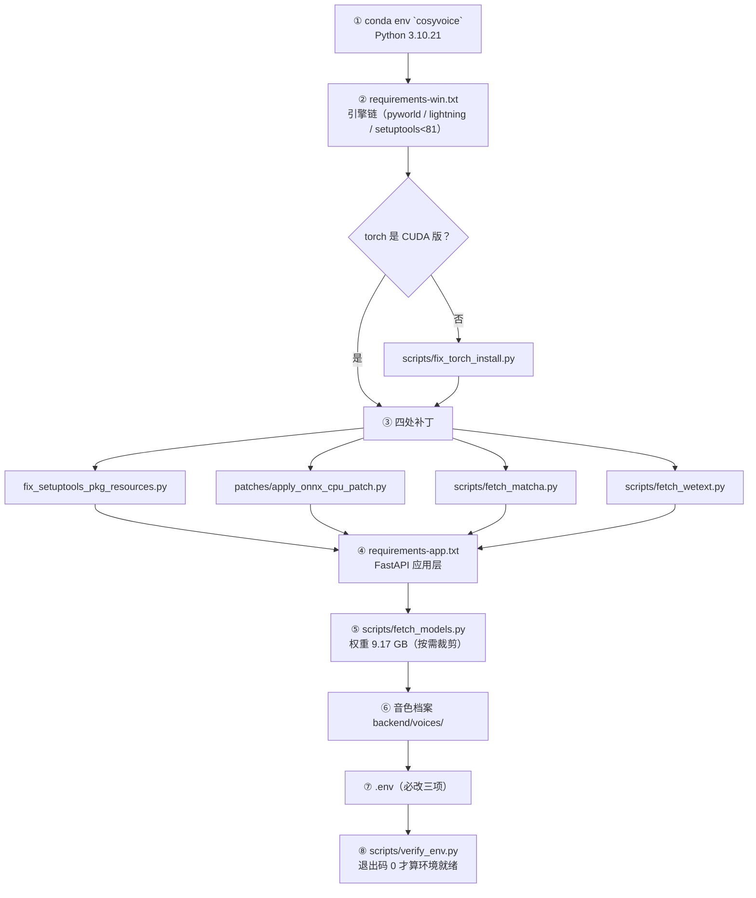

# 双人对话播客自动生成系统 · 环境配置手册

> **本文件的交付物身份**：项目任务书「四、项目任务分解」第 2 项（开源环境部署与模型验证）要求的两件交付物之一是 **「环境配置手册」**。此前该内容散在《部署运维手册》第 3~4 章与《开发计划书》§11.1，**没有独立成件**；本文件是它在交付包中的落点。
>
> **三份文档的边界（不要互相替代）**：
>
> | 文档 | 回答什么 |
> | --- | --- |
> | **本手册** | **「环境应该长什么样、怎么核对、哪里会咬人」** —— 硬件/版本/依赖/补丁/权重/环境变量/自检/坑 |
> | 《部署运维手册 V1.2.0》 | 「**从零到能跑，按什么顺序做一步验一步**」 + 日常运维、故障排查 |
> | 《项目参数说明 V1.0.0》 | 「`.env` 与代码里**每一个参数**的取值、默认值、影响面」 |

| 项 | 值 |
| --- | --- |
| 文档版本 | **V1.0.0** |
| 编制日期 | 2026-09-20 |
| 对应阶段 | D0 环境验证 → D1 环境基线 → **D14 成件** |
| 关联文档 | 《D0环境验证报告_V1.1.1.md》《D1环境基线与冒烟测试报告_V1.0.1.md》《双人对话播客自动生成系统_部署运维手册_V1.2.0.md》《双人对话播客自动生成系统_项目参数说明_V1.0.0.md》 |

## 版本记录

| 版本 | 日期 | 变更 |
| --- | --- | --- |
| **V1.0.0** | 2026-09-20 | 首次成件。汇总 D0~D2 的环境实测结论、版本矩阵、四处补丁、权重裁剪依据、环境变量必改项与环境特有坑清单。 |

---

## 一、硬件要求

| 项 | 要求 | 本机实测 | 说明 |
| --- | --- | --- | --- |
| GPU | NVIDIA，CUDA 可用 | **RTX 4050 Laptop（标称 6 GB）** | 纯 CPU 环境**不可用**，架构无 CPU 兜底路径 |
| **净可用显存** | **≥ 4.32 GB** | **4.32 GB** | ⚠️ **全系统最硬的约束——按它设计，不要按标称 6 GB 设计** |
| CPU | 现代 x86_64，≥ 4 核 | 满足 | onnx 组件走 CPU，需要少量 CPU 算力 |
| 内存 | ≥ 16 GB | 满足 | 模型加载与 FFmpeg 两遍 `loudnorm` 都要吃内存 |
| 磁盘 | ≥ 30 GB 可用 | 满足 | 权重 9.17 GB + 依赖轮子 2.3 GB + 数据 1 GB 起 |

### 1.1 「净可用 4.32 GB」是怎么来的

标称 6 GB 的卡，被系统、桌面合成、浏览器等占用后只剩 **4.32 GB** 可供推理。显存预算因此按**双口径**记账，只写一个数字会造成口径歧义：

| 口径 | 预算 | 含义 |
| --- | --- | --- |
| `allocated`（主口径） | **≤ 3600 MB** | 张量真正占用的量 |
| `reserved`（辅口径） | **≤ 4200 MB** | PyTorch 缓存分配器向驱动申请的量，**比 allocated 高 400~500 MB** |

> 这两个数字是**验收门槛**，实测值见《双人对话播客自动生成系统_部署基线报告_V1.0.0.md》。

---

## 二、软件版本矩阵

| 组件 | 版本 | 位置 / 取得方式 | 关键约束 |
| --- | --- | --- | --- |
| Python | **3.10.21** | `D:\anaconda\envs\cosyvoice\python.exe`（conda env `cosyvoice`） | ⚠️ **必须是 3.10**：依赖链（pyworld / pynini / Matcha-TTS）在 3.11+ 无可用轮子。与任务书「3.12+」的偏离已声明 |
| conda | Anaconda（`D:\anaconda`） | 提供上述 env | ❌ **不要往 base 环境装东西**，勿污染 |
| PyTorch / torchaudio | **2.3.1+cu121** | CUDA 轮子从官方 index 取 | 适配 RTX 4050（Ada sm_89）；**不能用 PyPI 默认 CPU 版** |
| onnxruntime | **1.18.0（CPU 版）** | `requirements-win.txt` | 承载 campplus 与 speech tokenizer，把约 1 GB onnx 缓冲**移出显存**；显式不装 `onnxruntime-gpu` |
| wetext | **0.0.4** | pip 直装 | `pynini` / `WeTextProcessing` 已确认**非必需** |
| Matcha-TTS | 随仓库 | `scripts/fetch_matcha.py` | `flow/decoder.py` 等三处 `import matcha`，必须安装 |
| Node.js | **v22.22.2** | `C:\Users\zzz\.workbuddy\binaries\node\versions\22.22.2-3\node.exe` | 前端构建与测试运行器依赖 |
| FFmpeg / ffprobe | **9.0.1**（full build，gyan.dev） | `C:\Users\zzz\AppData\Local\Microsoft\WinGet\Packages\Gyan.FFmpeg_*\ffmpeg-9.0.1-full_build\bin\` | ⚠️ **≥ 9.0**，且必须含 `loudnorm` 与 `libmp3lame` |
| SQLite | 随 Python 标准库 | — | WAL 模式，单文件库 |
| CUDA | 随 torch 轮子 | 见 §四 | 与驱动版本匹配 |

> **FFmpeg 为什么写 ≥ 9.0**：后期链路用了 `loudnorm` 的**两遍测量回填**（第二遍必须把第一遍的 `input_*` 回填到 `measured_*`）。旧版本在 `-pass` 语义与真峰统计上有差异，会表现为「响度达标但真峰超限」。
> **`FFMPEG_BIN` / `FFPROBE_BIN` 留空时会自动发现**：顺序是 `PATH` → winget 包目录 → 常见安装路径。装在别处请显式填绝对路径。

---

## 三、Python 环境

```bash
# 核对现成环境
D:/anaconda/envs/cosyvoice/python.exe -c "import sys;print(sys.version)"
# 期望输出以 3.10. 开头
```

**规则**：

1. **所有命令一律用该 env 的 python 绝对路径**，不依赖 `activate`、不依赖任何全局 site-packages。
2. 该目录名（`cosyvoice`）与包名（CosyVoice）同名属巧合；**不要**把 CosyVoice 源码目录加进 `PYTHONPATH`——它会遮蔽上游包。
3. **中文参数不经 shell 转发**：项目本体在 `D:\podcast-ai`（纯 ASCII），但交付文档在含中文的路径下；所有校验脚本一律用 `subprocess` 传 argv 列表。

---

## 四、依赖安装（顺序不能反）

```bash
# ① 引擎链（CosyVoice 推理依赖，针对 Windows 定制）
D:/anaconda/envs/cosyvoice/python.exe -m pip install -r requirements-win.txt

# ② 若 torch 装成了 CPU 版，用专用脚本纠正
D:/anaconda/envs/cosyvoice/python.exe scripts/fix_torch_install.py

# ③ 应用层（FastAPI 等）
D:/anaconda/envs/cosyvoice/python.exe -m pip install -r requirements-app.txt
```

`requirements-win.txt` 里**钉死**的版本及原因：

| 包 | 版本 | 为什么钉死 |
| --- | --- | --- |
| `pyworld` | 0.3.5 | 更高版本在本机无可用轮子 |
| `lightning` | 2.2.4 | `pyworld` 侧的兼容上限 |
| `setuptools` | `<81` | 81 起移除 `pkg_resources`，导入链会直接断 |

> 安装顺序**先 win 再 app**：`requirements-app.txt` 含 `fastapi==0.115.6`，须与上游 gradio 所需的 fastapi 版本共存。

### 4.1 依赖安装顺序（顺序错会以别处的怪现象爆出）



> **补丁必须夹在两次 `pip install` 之间**：`fix_setuptools_pkg_resources.py` 依赖 `setuptools<81` 已装好；`fetch_matcha` / `fetch_wetext` 依赖引擎链已就位。顺序颠倒会在应用层启动时以 import 错误形态爆出。


---

## 五、四处补丁（**必做**，跳过会在运行期以怪现象爆出）

```bash
D:/anaconda/envs/cosyvoice/python.exe scripts/fix_setuptools_pkg_resources.py
D:/anaconda/envs/cosyvoice/python.exe patches/apply_onnx_cpu_patch.py
D:/anaconda/envs/cosyvoice/python.exe scripts/fetch_matcha.py
D:/anaconda/envs/cosyvoice/python.exe scripts/fetch_wetext.py
```

| 补丁 | 不做会怎样 |
| --- | --- |
| setuptools / pkg_resources | 导入链在 `pkg_resources` 处 `ModuleNotFoundError` |
| onnx → CPU（`PATCH-VRAM-01`） | 显存峰值抬高 0.5~1.0 GB，可能直接顶穿 4200 MB 预算 → CUDA OOM |
| Matcha-TTS 子模块 | CosyVoice 无法 import，**服务起不来** |
| wetext FST 模型 | **不阻塞启动**，但数字/英文不会被转写成中文读法 → **「逐句一致率 100%」失去保障** |

> `fetch_wetext.py` 的背景值得记一笔：匿名请求 ModelScope `/revisions` 会被限流（`403 Code=10013201001 操作过于频繁`），而仓库本身是公开的——这是**限流不是权限**。脚本已带 8 次退避重试。失败不阻塞主链路，但**上线前必须解决**。

---

## 六、音色档案

音色档案 = 参考音频 + 元数据 json，放 `backend/voices/`：

| 档案 | 说话人 | 素材来源 | prompt_text |
| --- | --- | --- | --- |
| `voice_a`（女声） | A | 用户真人录音（`life.m4a`，2026-09-16 换档） | 与参考音频一一对应 |
| `voice_b`（男声） | B | 用户自录音第 2 版 | 「你好，生活就像海洋，只有意志坚强的人才能到达彼岸。」 |

**两条硬规矩**（都以对照实验确认过，不是经验之谈）：

1. **参考音频与 `prompt_text` 必须严格一致**。截短 `prompt_text` 会造成音色漂移——早期「截短 prompt_text」的做法**已作废**，不得再引用。
2. **片头 / 片尾等「不能回显参考音频」的场景必须走 `zero_shot`（`tone=""`）**。`instruct2` 在 `zero_shot_spk_id` 非空时会把**参考音频内容读出来**（回显），这是致命缺陷，不是风格问题。

**重建档案**（异地部署或换主播）：

```bash
D:/anaconda/envs/cosyvoice/python.exe scripts/make_voice_profile.py --check --wav D:/my_voice.wav
D:/anaconda/envs/cosyvoice/python.exe scripts/make_voice_profile.py --id voice_a --name "女声·知性沉稳" --wav D:/my_voice.wav --text "与录音一致的转写文本" --gender female
```

工具会把任意输入统一为 **16 kHz 单声道**，并对不在 **5~10 s** 建议区间的素材告警。

> **合规红线**：本项目只允许使用**预置音色**或**使用者本人授权录制**的音色，严禁克隆、模仿真实他人声音。

---

## 七、模型权重（9.17 GB）

```bash
D:/anaconda/envs/cosyvoice/python.exe scripts/fetch_models.py
```

脚本**按需下载**：逐行核对过 `cosyvoice/cli/cosyvoice.py` 的加载逻辑，只取推理必需文件。

**推理必需（5 个）**：`campplus.onnx`、`llm.pt`、`flow.pt`、`hift.pt`、`configuration.json`

**刻意跳过（省下约 4.6 GB）**：

| 跳过文件 | 体积 | 跳过依据 |
| --- | --- | --- |
| `llm.rl.pt`（v3） | 2.02 GB | 代码只加载 `llm.pt` |
| `flow.decoder.estimator.fp32.onnx`（v3） | 1.33 GB | 仅 `load_trt=True` 时加载 |
| `speech_tokenizer_v3.batch.onnx` | 0.97 GB | 代码只加载非 batch 版 |
| `flow.decoder.estimator.fp32.onnx`（v2） | 286 MB | 仅 `load_trt` 时用 |

```bash
# 验证
ls pretrained_models/CosyVoice2-0.5B/     # 上述 5 个文件全部存在
```

> **权重不入版本库**。仓库只含代码与文档，`pretrained_models/` 已列入 `.gitignore`（目录本身 10.56 GB，入库口径 627 文件 / 31.51 MB）。
> **模型选择**：默认定稿 `TTS_MODEL=cosyvoice2`。`Fun-CosyVoice3-0.5B` 权重保留在目录中但**不启用**——实测峰值 4338 / 5306 MB **双口径超限**，记入 V2.0 候选（需 8 GB+ 显存设备）。

---

## 八、外部工具：FFmpeg

```bash
ffmpeg -version                                    # 期望 9.0.1 或更高
ffmpeg -hide_banner -filters   | findstr loudnorm
ffmpeg -hide_banner -encoders  | findstr libmp3lame
```

| 验证 | 通过判据 |
| --- | --- |
| 版本 | `ffmpeg version 9.x` 起 |
| 滤镜 | `loudnorm` 可用 |
| 编码器 | `libmp3lame` 可用 |

---

## 九、环境变量（`.env`）

```bash
cp .env.example .env
```

**必须改的只有三项**，其余保持默认：

| 键 | 为什么必改 |
| --- | --- |
| `LLM_API_KEY` | 换成真实的 DeepSeek Key。**只存于此文件**，禁止入库 / 入日志 / 入前端 |
| `JWT_SECRET` | 默认是 `change_me_in_production`，生产必须换随机值 |
| `PUBLIC_BASE_URL` | RSS `enclosure` 与封面的对外绝对地址。填客户端**访问得到**的地址（局域网 IP 或公网域名） |

**建议改**：

| 键 | 建议 | 理由 |
| --- | --- | --- |
| `FFMPEG_BIN` / `FFPROBE_BIN` | 留空（自动发现）；装在非标准路径才填 | 自动发现顺序：`PATH` → winget → 常见路径 |
| `DATA_DIR` | 保持 `./data` | 换路径后旧库**不会被自动迁移** |

> ⚠️ **`.env` 写错键名不会报错**：`config.py` 的 pydantic-settings 配了 `extra="ignore"`，**未知键会被静默丢弃**。若被丢弃的键的默认值恰好等于你想要的取值，这个缺陷**永远不可见**。本项目已登记 **7 个死键**（写进 `.env` 但从未生效）。**写参数前必须与 `api/config.py` 的字段清单双向对一遍**——跑测试发现不了这类问题。
> **`PUBLIC_BASE_URL` 与前端代理 `target` 是两回事**：前者写给外部播客客户端，必须客户端访问得到；后者只是本机开发时的转发目标。把 `PUBLIC_BASE_URL` 填成 `127.0.0.1` 会导致**订阅源在别人手机上拉不到音频**。
> **全量参数说明**见《双人对话播客自动生成系统_项目参数说明_V1.0.0.md》。

---

## 十、环境自检（一键）

```bash
cd /d/podcast-ai
D:/anaconda/envs/cosyvoice/python.exe scripts/verify_env.py
```

该脚本核对开发计划书 P-1 ~ P-9 全部前置资源：模型权重、必需文件、推理模块可导入、FFmpeg、音色档案等。

| 退出码 | 含义 |
| --- | --- |
| `0` | 全部通过 |
| `1` | 存在 FAIL 项（逐条打印） |

### 10.1 环境不变量清单（可机械核对）

| # | 不变量 | 核对方式 |
| --- | --- | --- |
| I1 | 解释器为 3.10.x | `python.exe -c "import sys;print(sys.version)"` |
| I2 | `torch.cuda.is_available()` 为 `True` | 同上脚本 |
| I3 | onnx 组件仅 `CPUExecutionProvider` | 启动日志中 providers 列表 |
| I4 | 权重 5 个必需文件齐 | `ls pretrained_models/CosyVoice2-0.5B/` |
| I5 | 音色档案 2 组可加载 | `verify_env.py` |
| I6 | FFmpeg ≥ 9.0 且含 `loudnorm` / `libmp3lame` | §八 三条命令 |
| I7 | `wetext` 生效（数字/英文转中文读法） | 规范化单测 |
| I8 | `.env` 无死键 | 与 `api/config.py` 字段清单双向比对 |

---

## 十一、环境特有坑（**本节是本手册最有价值的部分**）

| 坑 | 表现 | 正解 |
| --- | --- | --- |
| **沙箱批量删除守卫** | 单次删除 > **50** 个文件抛 `SystemExit`；而 `SystemExit` **不是 `Exception`**，`except Exception` 与 `rmtree(ignore_errors=True)` **都吞不掉它** | ① 清理用 `scripts/cleanup_workspace.py`（逐文件）；② `--basetemp` 指向系统临时目录；③ 用例内不要一次删 > 50 个文件 |
| `--basetemp` 指向项目内目录 | 用例在自建 work 目录里删除被拦 → **假 FAILED** | `--basetemp` 一律指到 `%TEMP%` 下 |
| `--basetemp` 目录**跨轮次残留** | 残留 476 个文件时，下一轮 pytest 启动清理该目录即撞守卫 → **163 个 error（`failed on setup`）**；**绕开沙箱也照样发生** | 每轮跑批**换一个新路径**（`.../pytest-podcast-ai-a`、`-b`），不要复用 |
| `data/work/` 留有成规模临时目录 | fixture setup 阶段炸 → **假 error** | `data/work/` 内不得留任何成规模的临时目录 |
| **pytest 控制台汇总被抑制** | 「点全绿」看起来没问题，实际有 163 个 setup error | **一律读 junit 的 `tests` / `failures` / `errors` 三个计数** |
| 环境代理干扰本机请求 | 请求走 absolute-form → 后端返回 **404** | HTTP 客户端设 `trust_env=False`；**裸请求 401 不能证明后端有问题** |
| PowerShell `*>` 重定向 | 遇 native stderr 直接中止脚本 | 用 Bash `> log 2>&1` |
| Python `Popen(DETACHED_PROCESS)` | 托管的后端进程被环境清理 | 用 Bash `run_in_background` |
| `schtasks.exe` / `curl` 等 | 被列入程序黑名单，**不可批准也不可绕过** | 不走 Windows 计划任务命令行；定期回收改用环境原生「每日自动化」承载 |
| 沙箱写入只落 overlay | 一条命令建的文件，下一条就没了 | **造 → 验 → 删放同一条命令**；真删须在非沙箱下执行 |
| shell 无 coreutils | `grep -c`、`wc` 等行为异常 | 用 `python.exe -c` 完成统计；中文参数不经 shell 转发 |
| 改启动入口后日志全丢 | 业务侧 `log.info` 消失 | `uvicorn` 自带的 `LOGGING_CONFIG` **不含 root logger**；`basicConfig(level=INFO)` **必须在 `import api.main` 之前** |

---

**文档结束** | 版本 V1.0.0 | 编制日期 2026-09-20
