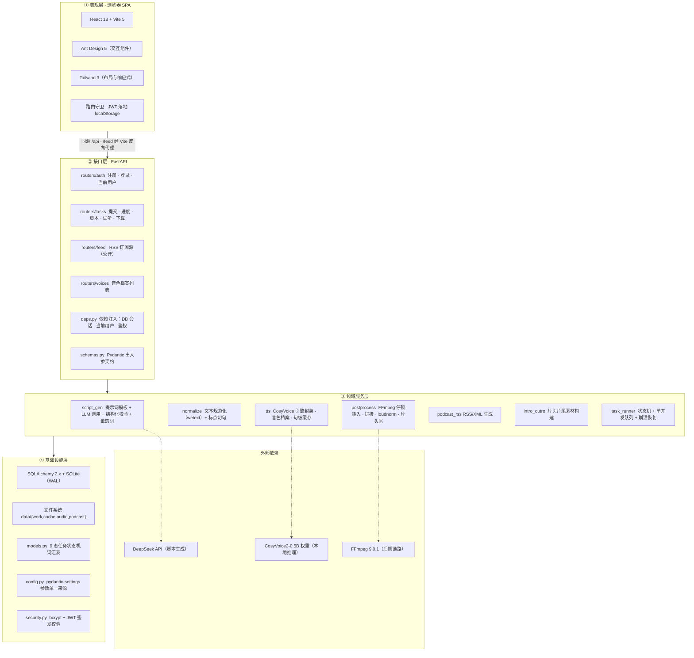
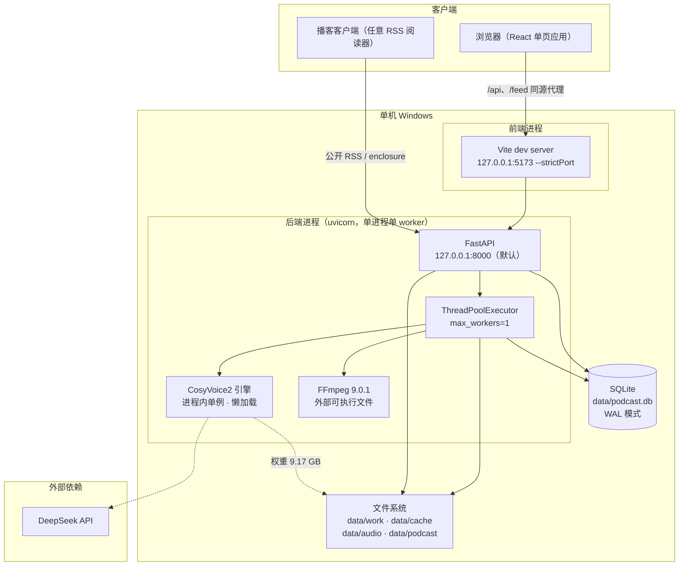
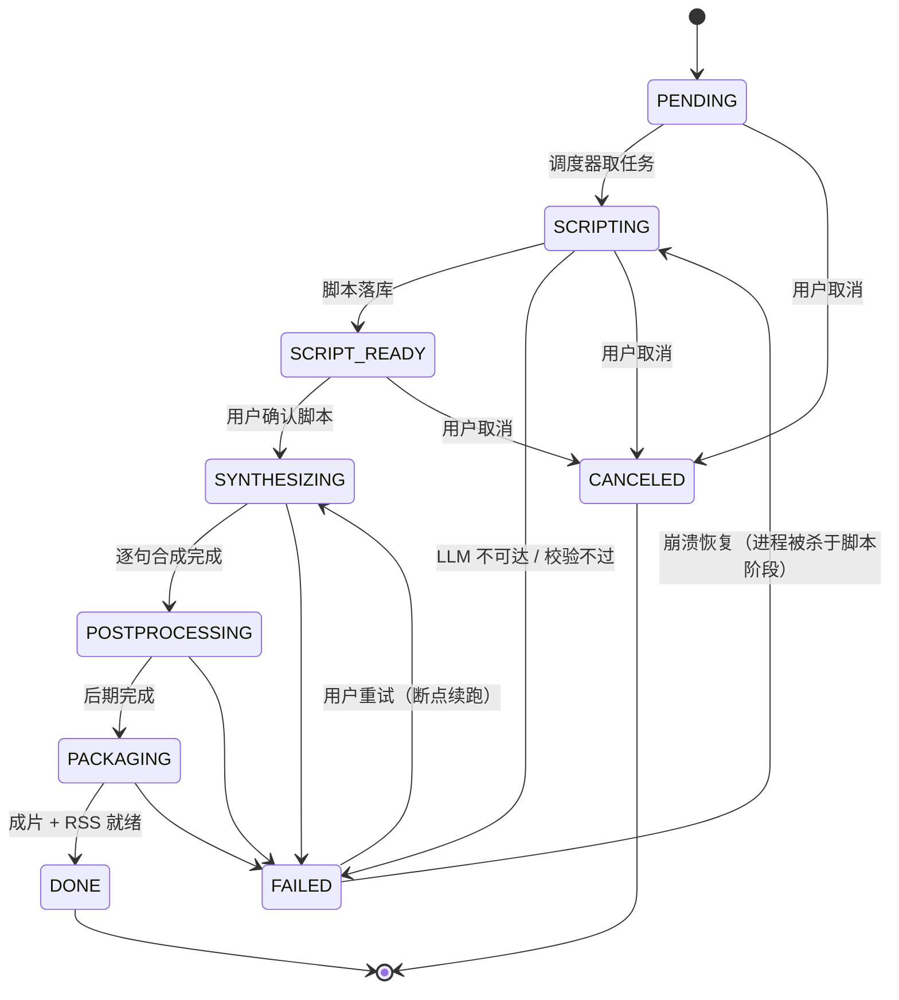
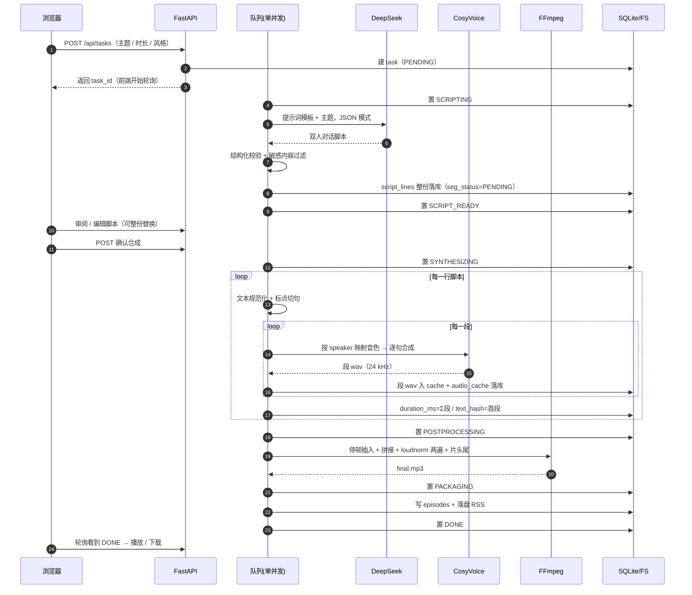
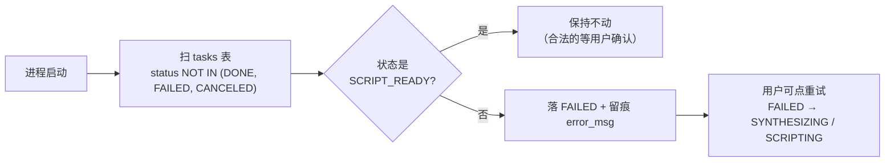
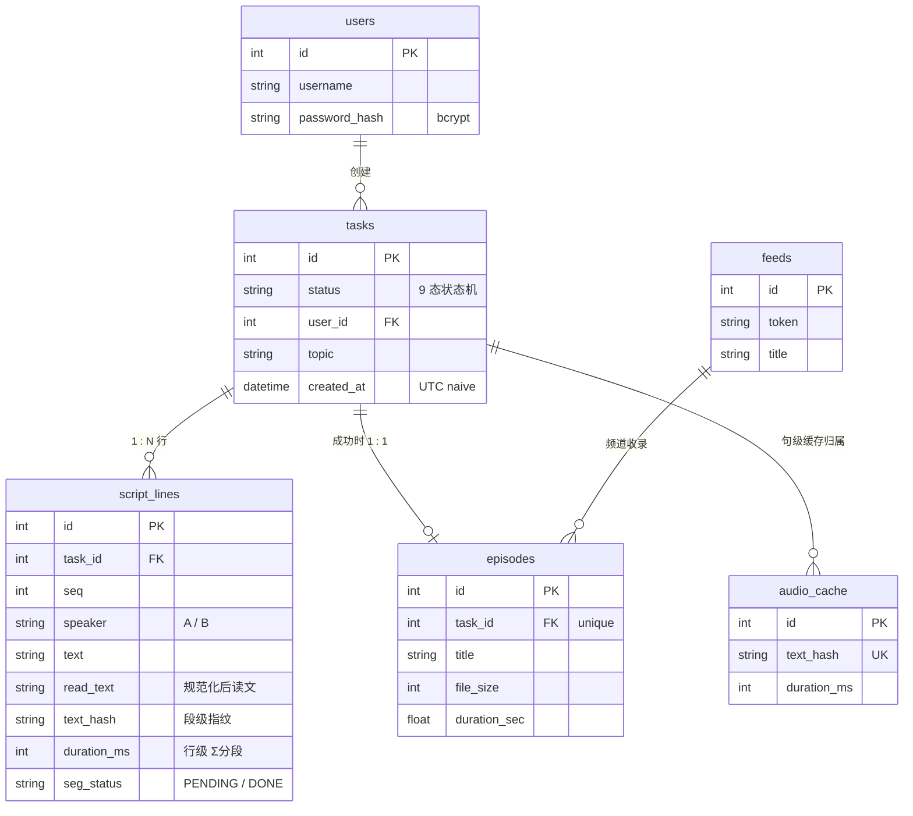

# 双人对话播客自动生成系统 · 系统架构设计文档

> **本文件的交付物身份**：项目任务书「四、项目任务分解」第 1 项（需求分析与系统设计）要求的三件交付物之一是 **「架构设计图」**。此前该图**散布**在 PRD §3.2、开发计划书 §4.2、部署运维手册 §2.1 三处，**没有独立成件**；本文件是它在交付包中的落点。
>
> **视图分工（避免与 PRD 重复造成两处漂移）**：
>
> | 视图 | 承载文件 | 内容 |
> | --- | --- | --- |
> | **模块组件视图** | PRD §3.2「系统总体架构」 | 客户端 / 服务端 / 基础设施三层方块图与模块间依赖 |
> | **分层视图 · 部署拓扑 · 运行时视图 · 数据模型 · 架构决策** | **本文件** | 本文档不复制 PRD 的组件图，只补它未覆盖的视图 |
>
> 若二者冲突，**以本文件为准**（本文件更晚定稿），并须同步回 PRD。

| 项 | 值 |
| --- | --- |
| 文档版本 | **V1.0.0** |
| 编制日期 | 2026-09-20 |
| 对应阶段 | D0 架构初稿 → **D14 成件** |
| 关联文档 | 《双人对话播客自动生成系统_产品需求规格说明书_V1.3.0.md》§3、《双人对话播客自动生成系统_开发计划书_V1.22.0.md》§4、《双人对话播客自动生成系统_数据库设计文档_V1.0.0.md》、《双人对话播客自动生成系统_部署运维手册_V1.2.0.md》、《双人对话播客自动生成系统_API接口文档_V1.0.0.md》 |
| 图源形态 | 全部 Mermaid，受 `scripts/check_spec_docs.py`（Mermaid 语法 + 机械 lint）门禁约束 |

## 版本记录

| 版本 | 日期 | 变更 |
| --- | --- | --- |
| **V1.0.0** | 2026-09-20 | 首次成件。整合 PRD §3.2 / 计划书 §4.2 / 部署手册 §2.1 的架构内容，补齐分层视图、部署拓扑、任务状态机、全链路时序、ER 图、模块清单与架构决策表，并集中登记与任务书技术方案的偏离。 |

---

## 一、架构目标与硬约束

架构不是自由设计，它被下面这几条**实测出来的**约束钉死。任何「优雅但违反约束」的方案都不成立。

| # | 约束 | 实测值 | 对架构的强制影响 |
| --- | --- | --- | --- |
| C1 | **净可用显存** | **4.32 GB**（RTX 4050 Laptop，标称 6 GB，被系统与桌面占用后只剩这么多） | 决定「**单并发 + 模型常驻 + 句级缓存 + onnx 走 CPU**」这条主干；排除一切并发多路推理 |
| C2 | 显存记账必须**双口径** | `allocated` 预算 3600 MB / `reserved` 预算 4200 MB | 任何需要换缓冲区的设计都要按 reserved 记账 |
| C3 | 运行环境 | Windows 10/11 x64 单机 | 进程模型与运维脚本按单机设计（无容器编排） |
| C4 | 上游依赖硬要求 Python **3.10** | CosyVoice 依赖链（pyworld / pynini / Matcha-TTS）在 3.11+ 无可用轮子 | 与任务书「Python 3.12+」冲突，已声明偏离（见第九章） |
| C5 | 模型权重 **9.17 GB** | 随仓库外置，不入代码库 | 部署链路必须自带「权重获取与校验」环节 |
| C6 | LLM 需外网 | DeepSeek API（OpenAI 兼容） | 架构上必须允许「LLM 不可达时任务失败可续跑」，不能把脚本生成与合成耦合进一个事务 |

---

## 二、分层架构

系统按**四层 + 外部依赖**组织。分层的判据是「**能否独立替换或独立测试**」，不是目录好看。

**分层不可跨越的三条**（都在代码里有对应约束，不是口号）：

1. **接口层不碰推理**。`routers/*` 只做入参校验、鉴权、投递任务与读状态；一切耗时推理都在 `services/*`，且只由 `task_runner` 的队列线程驱动。
2. **领域层不直接读环境变量**。参数一律经 `config.py`（pydantic-settings）下发——这一层也是「配置键写错不报错」这类缺陷的唯一防线（未知键会被静默丢弃）。
3. **表现层不猜后端状态**。可观测性判断收敛在纯函数 `frontend/src/lib/taskView.ts`（两个页面共用），不各写一套。

---

## 三、部署拓扑

### 3.1 进程与端口

| 进程 | 默认监听 | 端口 | 启动者 | 日志去向 |
| --- | --- | --- | --- | --- |
| 后端 uvicorn | **`127.0.0.1`** | **8000** | `start_dev.bat` 第 1 步 | 命令窗口 stdout（重定向则落文件） |
| 前端 Vite dev | `127.0.0.1` | **5173**（`--strictPort`） | `start_dev.bat` 第 2 步 | 命令窗口 stdout |

> **后端为什么默认只绑 `127.0.0.1`**：① 不把服务暴露到局域网；② 避免首次启动弹 Windows 防火墙授权框（D14 复核改动，见《部署运维手册 V1.2.0》§2.2）。需要局域网访问时把 `BACKEND_HOST` 改为 `0.0.0.0`，并同步把 `.env` 的 `PUBLIC_BASE_URL` 改成该机局域网地址——**两处必须同改**，否则 RSS 的 enclosure 指向客户端拉不到的地址。
>
> **`--strictPort` 是刻意的**：5173 被占用时 Vite 直接退出而不是顺延到 5174。顺延会让 Cookie 的 `SameSite` 判定与代理目标错位，表现为「登录成功但刷新就掉线」。

### 3.2 数据落盘

| 路径 | 内容 | 生命周期 | 可删吗 |
| --- | --- | --- | --- |
| `data/podcast.db`（+ `-wal` / `-shm`） | 全部业务数据 | 长期 | ❌ 删库即全丢 |
| `data/audio/<task_id>/final.mp3` | 成片 | 保留期（默认 30 天） | ⚠️ 到期由清理逻辑回收 |
| `data/cache/<hash>.wav` | 句级音频缓存 | **不受保留期约束**（跨任务复用） | ❌ 删了 `audio_cache` 表整片失效 |
| `data/work/<task_id>/` | 任务中间产物 | 任务终态后即时清理 | ✅ 可回收 |
| `data/podcast/<token>.xml` | 落盘 RSS | 随频道配置更新 | ⚠️ 删除后 `/feed/{token}.xml` 404 |
| `pretrained_models/CosyVoice2-0.5B/` | 权重 9.17 GB | 长期 | ❌ 删了要重新获取 |

---

## 四、运行时架构

### 4.1 任务状态机

9 个状态、7 条主干边、**2 条回边**。状态机**只有一处定义**：`api/services/task_runner.TRANSITIONS`；`models.TaskStatus` 只存词汇、不定义图——避免同一份状态机有两处会飘的定义。

**两条回边必须解释清楚，否则会被当成环**：

| 回边 | 触发者 | 为什么必须存在 |
| --- | --- | --- |
| `FAILED → SYNTHESIZING` | 用户点「重试」 | 合成阶段已有句级缓存，重试时**全部段从头遍历、命中取缓存 wav、只对未命中段真推理**——不是重算 |
| `FAILED → SCRIPTING` | **D12 崩溃恢复**（进程在脚本阶段被杀） | `_run_script` 第一个动作就是 `_transition(..., SCRIPTING)`，而状态机不许自环，所以必须先落 `FAILED` 再回到 `SCRIPTING`。回放是幂等的：会先删掉该任务全部 `script_lines` 再按新脚本整份重建 |

启动时会**扫非终态任务做分流**：除 `SCRIPT_READY`（合法的「等用户确认」停驻态）外，其余非终态一律落 `FAILED`；恢复所需的运行参数**必须已持久化**，否则只能报失败。

### 4.2 全链路时序（一次成功任务）

> **落库口径的两处不一致是刻意的，且必须知道**：`duration_ms` 是**行级**（该行所有段之和），`text_hash` 是**段级**（只有首段）。用等号判「缓存 wav 时长 == duration_ms」会得到 98.75% 的假失败——一致率判据因此改用物理不变量（首段时长 ≤ 整行时长），详见《一致率比对报告 V1.0.0》。

### 4.3 崩溃恢复

后端只有**一个进程**，队列是进程内的 `ThreadPoolExecutor(max_workers=1)`，**不是**独立 worker。因此「重启后端」等于「重启队列」，队列里正在跑的任务必须靠**启动扫描**兜。

---

## 五、数据架构

### 5.1 实体关系（6 张表）

**三处超出 ER 的列**（`DEV-SCHEMA-01a/b/c`）与「`script_lines.text_hash` 必须可空」等设计理由，见《数据库设计文档 V1.0.0》§4.2 / §6——本文件不重复，只登记「有这些偏差」。

### 5.2 一致性要点

| 要点 | 规则 |
| --- | --- |
| `tasks.episodes` 唯一性 | `episodes.task_id` 为 **unique** ⇒ 续跑必须 **upsert**，不能直插 |
| 脚本替换的失效面 | 保存脚本时**整份替换** `script_lines`，新行一律 `seg_status=PENDING`、`read_text=""`、`text_hash=NULL`，避免旧的 `DONE` 误导前端「可试听」 |
| 时间字段 | `tasks.created_at` 落库为 **UTC naive**；任何按时间比较的判据必须显式做时区归一（本地 11:06 → 库内 03:06） |
| 写事务边界 | 合成循环里**不持有长写事务**——否则撞 SQLite 写锁。已拆为四段短事务 |

---

## 六、模块清单

### 6.1 后端（`api/`，19 个模块）

| 层 | 模块 | 行数 | 职责 |
| --- | --- | --- | --- |
| 入口 | `main.py` | 110 | 应用装配、启动崩溃恢复扫描、日志顺序（`basicConfig` 必须在 `import api.main` 之前） |
| 接口 | `routers/auth.py` | 96 | 注册 / 登录 / 当前用户 |
| 接口 | `routers/tasks.py` | 290 | 提交、进度、脚本读写、逐句试听、成片下载 |
| 接口 | `routers/feed.py` | 139 | RSS 订阅源（公开） |
| 接口 | `routers/voices.py` | 32 | 音色档案列表 |
| 接口 | `deps.py` / `schemas.py` | 113 / 416 | 依赖注入（DB、当前用户、鉴权）与出入参契约 |
| 服务 | `task_runner.py` | 758 | **状态机 + 单并发队列 + 崩溃恢复 + 阶段编排** |
| 服务 | `script_gen.py` | 896 | 提示词模板、LLM 调用、结构化校验、敏感词 |
| 服务 | `normalize.py` | 514 | 文本规范化与标点切句 |
| 服务 | `tts.py` | 793 | CosyVoice 引擎封装、音色档案、句级缓存、收敛守卫 |
| 服务 | `postprocess.py` | 695 | FFmpeg 停顿、拼接、loudnorm、片头尾混入 |
| 服务 | `podcast_rss.py` | 346 | RSS/XML 生成 |
| 服务 | `intro_outro.py` | 94 | 片头片尾素材构建（**必须 zero_shot，禁用 instruct2**） |
| 服务 | `synth_trace.py` | 226 | 合成过程留痕 |
| 基础 | `models.py` | 288 | ORM + `TaskStatus` 词汇表 |
| 基础 | `db.py` | 156 | 引擎、会话、`init_db` 建表与补列 |
| 基础 | `config.py` | 367 | **参数单一来源**（pydantic-settings，`extra="ignore"`） |
| 基础 | `security.py` | 119 | bcrypt 口令 + JWT |

### 6.2 前端（`frontend/src/`，26 个文件）

| 分类 | 文件 | 说明 |
| --- | --- | --- |
| 页面 | `pages/Submit` `TaskDetail` `History` `Login` `Register` `FeedConfig` | 6 个路由页 |
| 组件 | `components/Layout.tsx` `components/ProtectedRoute.tsx` | 布局壳 + 路由守卫 |
| Hook | `hooks/useAuth.tsx` | 鉴权状态（落地 `localStorage['pc_user']`） |
| 纯函数库 | `lib/taskView.ts` | 可观测性判断（**两页共用**，单测覆盖） |
| API 层 | `api/client.ts` `auth.ts` `tasks.ts` `feed.ts` `types.ts` | 统一请求封装与类型 |
| 测试基建 | `test/setup.ts` `test/factories.ts` `test/renderAt.tsx` + 3 个 `*.test.tsx` | vitest 3.2.7，纯函数 21 + 组件 13 |

> 详细的组件库清单（含选型、自建组件、复用边界与测试覆盖）见《双人对话播客自动生成系统_前端组件库清单_V1.0.0.md》。

---

## 七、关键架构决策（ADR）

| # | 决策 | 被什么约束逼出来的 | 代价 / 未采纳的替代方案 |
| --- | --- | --- | --- |
| ADR-01 | **进程内 `ThreadPoolExecutor(max_workers=1)`**，不引入 Celery/RQ | C1：GPU 只能跑一路推理，独立 worker 只会增加调度复杂度 | 代价：队列随进程重启而丢，必须做崩溃恢复扫描。未采纳：Celery + Redis（本机无常驻中间件，收益不抵） |
| ADR-02 | **模型进程内常驻 + 懒加载单例** | C1/C2：反复加载会反复吃 reserved 峰值 | 代价：「服务起来了」≠「显存已占用」，探活不能只看端口。未采纳：每任务加载一次 |
| ADR-03 | **句级音频缓存 + 内容指纹** | 重试 / 续跑时省掉已合成的句子 | 代价：`data/cache` 不受保留期约束，须单独治理 |
| ADR-04 | **onnx 组件走 CPU** | C1：可把约 1 GB onnx 缓冲移出显存 | 代价：CPU 侧算力占用；实测端到端 RTF 未退化 |
| ADR-05 | **片头/片尾与「不回显参考音频」场景一律 `zero_shot`** | `instruct2` 在 `zero_shot_spk_id` 非空时会把参考音频**回显到输出开头** | 代价：语气指令文本对片头尾失效（这是刻意的） |
| ADR-06 | **前后端同源（Vite 反向代理 `/api`、`^/feed/.+$`）** | JWT HttpOnly Cookie 要能随 `<audio>` / `<a download>` 自动带上 | 代价：跨域部署路径**本项目未验证**，必须改后端直连 + CORS + `Secure`/`SameSite` |
| ADR-07 | **SQLite（WAL）单库** | 单机、单写者、数据量小 | 代价：写事务必须短；`task_id` 唯一性靠 upsert 维护 |
| ADR-08 | **状态机只定义一处**（`TRANSITIONS`） | 避免「同一份图两处会飘」 | 代价：新增状态必须改代码而非配置 |
| ADR-09 | **可观测性纯函数收口到 `lib/taskView.ts`** | 两个页面曾各写一套队列判断，口径不一 | 代价：改判定要动共用文件（这是优点） |
| ADR-10 | **资源全部外置**：权重 9.17 GB、`data/` 不入版本库 | 仓库可交付性 | 代价：部署链路必须自带获取与校验环节 |

---

## 八、与任务书技术方案的偏离声明

任务书「3.2 核心技术」指定了技术栈。下表逐条对照**实际落地**，偏离项**逐条给理由**——不声明偏离等于默认一致。

| 任务书指定 | 实际落地 | 判定 |
| --- | --- | --- |
| 开发语言 **Python 3.12+** | **Python 3.10.21** | ⚠️ **偏离（已声明）**。CosyVoice 依赖链（pyworld / pynini / Matcha-TTS）在 3.11+ 无可用轮子，属上游硬约束 |
| 语音合成 CosyVoice（零样本音色合成） | **CosyVoice2-0.5B**（定稿主模型）；Fun-CosyVoice3-0.5B 降为 V2.0 候选 | ✅ 一致（任务书不指定版本） |
| 对话脚本生成 大模型 API | **DeepSeek API**（OpenAI 兼容） | ✅ 一致 |
| 音频后期 FFmpeg / pydub | **FFmpeg 9.0.1** 为主链路 | ✅ 一致 |
| 订阅封装 feedgen / XML 模板 | RSS/XML 生成（`podcast_rss.py`） | ✅ 一致 |
| 后端服务 FastAPI | **FastAPI + Uvicorn（单 worker）** | ✅ 一致 |
| 前端框架 React | **React 18 + Vite 5** | ✅ 一致 |
| UI 组件库 **TailwindCSS / Ant Design** | **双库共存**：AntD 承载交互组件，Tailwind 承载布局与响应式 | ✅ 一致（二者均落地） |
| 数据库 sqlite3 | **SQLite + SQLAlchemy 2.x** | ✅ 一致（ORM 为增强，非替代） |

> 偏离项的完整理由链与「不构成未覆盖」的论证，见《开发计划书 V1.22.0》§2.4 与 §4.1。

---

## 九、已知限制与未验证边界

以下四条**不是待办**，而是架构层面的既有边界，验收时不得当作已达成：

1. **跨域部署未验证**。当前依赖前后端同源。前后端分域需要改后端直连 + CORS + `Secure`/`SameSite` Cookie，本项目**没有走过这条路**。
2. **纯 CPU 环境不可用**。C1 是硬约束，架构上没有 CPU 推理兜底路径。
3. **并发能力为 1**。`max_workers=1` 意味着第二个任务只能排队。这是设计选择，不是性能缺陷——但要如实写进容量说明。
4. **单点存储**。SQLite 单文件 + 本地文件系统，不支持多实例水平扩展。

---

**文档结束** | 版本 V1.0.0 | 编制日期 2026-09-20
