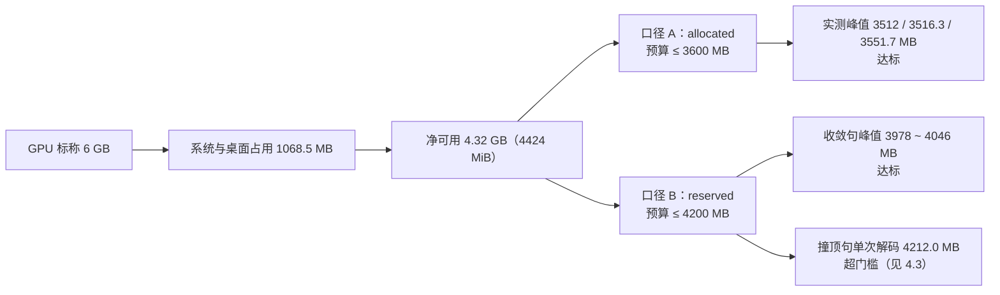

# 双人对话播客自动生成系统 · 部署基线报告

> **本文件的交付物身份**：项目任务书「四、项目任务分解」第 2 项（开源环境部署与模型验证）要求的两件交付物之一是 **「部署基线报告（显存/RTF）」**。此前该内容散在《D1环境基线与冒烟测试报告》与《D2-D3模型定稿与合成服务实施报告》两处，**没有独立成件**；本文件是它在交付包中的落点，**只汇总与基线有关的数字**，过程性叙事留在原报告。
>
> **同族文档分工**：本文件 = **部署基线（显存 / RTF / 模型定稿）**；《双人对话播客自动生成系统_合成基线报告_V1.0.0.md》= **合成质量基线（音色档案 / 逐句一致 / 听测）**。

| 项 | 值 |
| --- | --- |
| 文档版本 | **V1.0.0** |
| 编制日期 | 2026-09-20 |
| 采集阶段 | D1（首次基线）→ D2（模型 A/B 定稿）→ D4 前置（**固定种子可复现基线**） |
| 关联文档 | 《D1环境基线与冒烟测试报告_V1.0.1.md》《D2-D3模型定稿与合成服务实施报告_V1.1.0.md》《D4前置检查报告_V1.3.0.md》《双人对话播客自动生成系统_环境配置手册_V1.0.0.md》 |
| 复现证据 | `outputs/smoke_result.json`、`logs/ab_model3.log`、`outputs/d3_verify_result.json`、`outputs/d4_voice_check/d4_seed_baseline.json` |

## 版本记录

| 版本 | 日期 | 变更 |
| --- | --- | --- |
| **V1.0.0** | 2026-09-20 | 首次成件。汇总三个阶段的实测基线，**并首次把三种 RTF 口径并列在一张表里**（此前分散在两份报告中，极易被混用）。 |

---

## 一、口径纪律（**引用本报告任何数字前必读**）

本系统有三条互不相通的 RTF，历史上因为不加限定词引用而反复出错。**本报告起，凡出现 RTF 一律带口径标注。**

| 口径 | 定义 | 用途 | 可跨口径比较吗 |
| --- | --- | --- | --- |
| **合成 RTF** | Σ逐段合成耗时 ÷ Σ段音频时长 | 衡量推理引擎本身 | ❌ |
| **端到端 RTF** | 任务从提交到 `DONE` 的**墙钟** ÷ 目标字数 × 1000 | 衡量用户体验（含 LLM、后期、排队） | ❌ |
| **纯合成推算（1000 字）** | 按合成 RTF × 目标音频时长 | 规划用，**是推算不是实测** | ❌ |

另外两条**必须随数字一起说**的限定词：

- **冷启 / 温启**：冷启含首次内核编译与缓存预热，数值显著偏高。D1 的 1.775 是**冷启小样本**，D2 的 1.037 是**温启**——**两者不是同一个东西**。
- **是否固定随机种子**：D4 前置起 `PATCH-SEED-01` 固定 `TTS_RANDOM_SEED=42`，此后「同输入 → 同输出」成立。**固定种子之前的数据不可逐位复现，只能作量级判断**。

---

## 二、模型定稿（D2 · A/B 实测）

同文本、同音色、同环境，两候选模型实测（依据 `logs/ab_model3.log`）：

| 候选模型 | 加载耗时 | 常驻显存 | 合成 RTF（温启） | 峰值 allocated / reserved | 判定 |
| --- | --- | --- | --- | --- | --- |
| **CosyVoice2-0.5B（定稿）** | **12.5 s** | **2442 MB** | **1.037** | **3513 / 4024 MB** | ✅ 双口径达标 |
| Fun-CosyVoice3-0.5B | 14.9 s | 3310 MB | 1.057 | 4338 / 5306 MB | ❌ 双口径超限 |

**定稿结论**：默认 `TTS_MODEL=cosyvoice2`。`Fun-CosyVoice3-0.5B` 权重保留在目录中但**不启用**，记入 V2.0 候选（需 8 GB+ 显存设备）。

> **为什么不是「3.0 更新就选 3.0」**：净可用显存只有 4.32 GB。3.0 的 `flow.pt` 为 1329 MB 而 2.0 为 649 MB，单这一项就把峰值推过门槛。**选型依据是实测账面，不是版本号**。

---

## 三、加载与常驻（D1）

| 指标 | 实测值 |
| --- | --- |
| 环境初始可用显存 | 总 **6140.5 MB** / 空闲 **5072.0 MB** / 已占 **1068.5 MB** |
| 模型加载耗时（**冷启动**） | **23.0 s** |
| 模型加载耗时（温启动） | **12.5 ~ 12.9 s** |
| 加载后常驻显存 | allocated **2442.2 MB** / reserved **2642.0 MB** |
| 加载阶段 allocated 峰值 | **2530.5 MB** |
| 输出采样率 | **24 000 Hz**（CosyVoice2） |

> **常驻 ≠ 启动即占**：TTS 引擎是**懒加载单例**——「服务起来了」不等于「显存已占用」。探活只看端口会得到错误结论。

---

## 四、显存基线（双口径）

### 4.1 峰值与门槛

| 采样点 | allocated | reserved | 门槛 | 判定 |
| --- | --- | --- | --- | --- |
| 模型加载完成（常驻，D1） | 2442 MB | 2642 MB | — | — |
| 3 句合成全程峰值（D1） | **3512 MB** | **3978 MB** | ≤3600 / ≤4200 | ✅ |
| D3 验收 25 句峰值 | **3516.3 MB** | **4000.0 MB** | ≤3600 / ≤4200 | ✅ |
| D4 前置固定种子 12 句 | **3551.7 MB** | 3946 ~ 4046 MB（收敛句） | ≤3600 / ≤4200 | ✅ |

### 4.2 占净可用显存的比例（D1 口径）

**口径与实测落点一览**：



> **两条口径都要报**：只报 allocated 会显得「余量充足」（3551.7 / 4424 ≈ 80%），只报 reserved 又会显得「随时 OOM」（4212 > 4200）。**基线必须两条一起给**——门槛写成一对数字，就是为了强制这件事。


| 采样点 | 占**保守**净可用（4424 MiB） | 占本次实测净可用（5072 MiB） |
| --- | --- | --- |
| allocated 峰值 | 79.4% | 69.3% |
| reserved 峰值 | **89.9%（余 446 MiB，偏紧）** | 78.4%（余 1094 MiB） |

### 4.3 ⚠️ 一条必须写进基线的例外：**撞顶句**

`reserved` 存在**另一条独立的峰值通路**，且它与「有没有显存泄漏」无关：

- **机制**：生成未收敛时解码会跑到**长度上限**，序列被推高，进而抬升峰值 reserved。
- **实测**：D4 前置单句隔离实验中，20 字句首次尝试输出 **16.00 s**（= 上游长度上限 `20 × 20 ÷ 25 Hz = 400 token`，即**截断残句**），该次解码把 reserved 顶到 **4212.0 MB —— 超 4200 MB 门槛 ❌**。
- **收敛守卫能救什么**：守卫在偏移种子后第 1 次重试即收敛到 6.08 s，**音频侧已闭环**。
- **收敛守卫救不了什么**：**峰值由撞顶那一次解码设定，事后无法挽回** —— **显存侧未闭环**。

> **因此本基线的正确表述是**：「**收敛样本**的双口径均达标（allocated 3551.7 / reserved 4046 MB 以内）；**撞顶句的单次解码峰值 reserved 可达 4212 MB，超出预留门槛**」。**不得**把它简化成「显存双口径恒达标」。

### 4.4 显存轨迹：无泄漏

D3 的 25 句采样中，`allocated` **全程恒定 2506.6 MB，波动 0.0 MB**：

| 采样点 | allocated | reserved | peak_alloc |
| --- | --- | --- | --- |
| 第 1 句 | 2506.6 | 2700.0 | 3507.3 |
| 第 2 句 | 2506.6 | 2700.0 | 3507.6 |
| …（中间 22 句完全相同） | 2506.6 | 2700.0 | 3507.6 |
| 末句（第 26 次记录） | 2506.6 | 2700.0 | 3516.3 |

> 末行是额外的 `instruct2` 情绪指令调用，**不属于 25 句主循环**。
> **这条「无泄漏」结论仅对收敛样本成立**（见 4.3）。它证明的是没有泄漏——这仍然是有效且重要的结论。

---

## 五、合成速度（RTF）—— 三口径并列

| # | 口径 | 样本 | 加载状态 | 种子 | 实测 RTF | 出处 |
| --- | --- | --- | --- | --- | --- | --- |
| 1 | 合成 RTF（朴素路径） | 3 句 / 19.40 s | **冷启** | 未固定 | **1.773**（34.40 s） | D1 §2.2 |
| 2 | 合成 RTF（音色档案路径） | 3 句 / 18.52 s | **冷启** | 未固定 | **1.775**（32.87 s） | D1 §2.2 |
| 3 | 合成 RTF | 25 句 / 119.9 s | 温启 | 未固定 | **1.090**（130.7 s） | D2-D3 §5.2 |
| 4 | **合成 RTF（可复现基准）** | 12 句 / 真实对谈文本 | 温启 | **固定 42** | **1.005 ~ 1.165，均值 1.09** | D4 §5.5 |
| 5 | 预热单次（不计入基线） | 「你好。」0.84 s | 冷启 | — | 5.79（含首次内核编译） | D1 §2.2 |

**三条可下的结论**：

1. **口径 3 与口径 4 互为独立佐证**（1.090 vs 均值 1.09），且分别来自「未固定种子」与「固定种子」两条流程 —— 交叉确认 RTF 量级稳定。
2. **口径 1/2 的 1.77 不能拿来当稳态值**：它是 3 句小样本 + 冷启，随句数增加会被摊薄。**稳态看 1.09。**
3. 单句均值：**10.96 s（22~28 字，冷启 3 句）** vs **5.23 s（平均 21 字，温启 25 句）**——同样是冷/温启差异，不可混用。

**可复现性**：固定种子后**同文本重复合成，波形字节完全相同**（方差恒为 0）。而「跨不同文本」的时长离散（12 句 std 0.687 s）反映的是**内容差异**（字数、语义停顿），**不是随机性**。二者口径不同，不可混用。

---

## 六、1000 字端到端推算

| 环节 | 耗时 | 实测/推算 |
| --- | --- | --- |
| DeepSeek 脚本生成 | 60 ~ 90 s | **未实测**（计划书 §4.10 口径） |
| 逐句合成（按 D1 冷启 RTF 1.775 × 230 s 音频） | **405 s** | 推算 |
| 后期（格式统一 + 拼接 + loudnorm 两遍 + 导出） | 20 ~ 40 s | **未实测** |
| **合计** | **约 8.1 ~ 8.9 min** | 达标，**余量仅 1.1 ~ 1.9 min** ⚠️ |

**另一条口径（纯合成，温启）**：按 D2-D3 的 1.090 推算，1000 字**纯合成**约 **4.19 min**（不含 LLM 与后期）。

> **两个数不要混**：前者是**端到端**推算（含 LLM + 后期，且用了冷启 RTF），后者是**纯合成**推算（温启）。M4 里程碑的「1000 字 ≤ 10 min」验收对象是**端到端**，见《开发计划书 V1.22.0》§7.1 M4 行。

---

## 七、可复现命令与证据文件

| 证据 | 文件 | 内容 |
| --- | --- | --- |
| D1 冒烟 | `outputs/smoke_result.json`、`logs/smoke_cosyvoice2.log`、`outputs/smoke/*.wav` | 7 段 wav（24 kHz 单声道，0.84~7.44 s） |
| D2 A/B | `logs/ab_model3.log` | 两候选模型的 RTF / 显存原始记录 |
| D3 验收 | `outputs/d3_verify_result.json` | 25 句逐句耗时与显存轨迹 |
| **D4 固定种子基准** | `outputs/d4_voice_check/d4_seed_baseline.json` | 12 句可逐位复算的 RTF 与峰值 |

```bash
cd /d/podcast-ai
# 冒烟（约 2 分钟）
D:/anaconda/envs/cosyvoice/python.exe scripts/smoke_tts.py
# 环境自检（权重 / 模块可导入 / FFmpeg / 音色档案）
D:/anaconda/envs/cosyvoice/python.exe scripts/verify_env.py
```

---

## 八、基线结论与偏差声明

**达标项**

| 指标 | 门槛 | 实测 | 判定 |
| --- | --- | --- | --- |
| 峰值 allocated | ≤ 3600 MB | 3512 / 3516.3 / 3551.7 MB | ✅ |
| 峰值 reserved（收敛句） | ≤ 4200 MB | 3978 / 4000.0 / 4046 MB | ✅ |
| 1000 字端到端 | ≤ 10 min | 约 8.1~8.9 min（推算） | ✅ 余量 1.1~1.9 min |

**偏差与例外（必须随结论引用）**

1. **撞顶句超出 reserved 门槛**：单次解码峰值 reserved 达 **4212 MB**（> 4200），**显存侧未闭环**，见 §4.3。
2. **两个环节属推算而非实测**：LLM 生成耗时与后期耗时均未实测，§六 的 8.1~8.9 min 含推算成分。
3. **D1 的 1.775 是冷启小样本**，不得作为稳态基线引用。
4. **未固定种子的数据不可逐位复现**（RTF 与峰值同理），只作量级判断。

---

**文档结束** | 版本 V1.0.0 | 编制日期 2026-09-20
