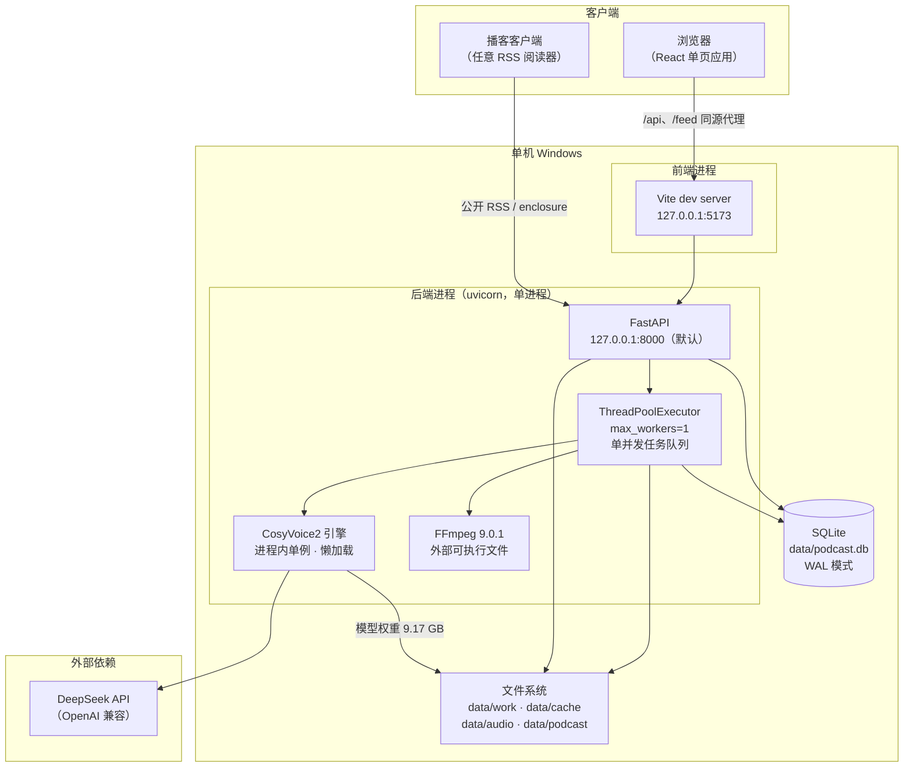

# 双人对话播客自动生成系统 · 部署运维手册

> 版本：V1.2.0　|　日期：2026-09-20　|　对应《双人对话播客自动生成系统_开发计划书_V1.22.0.md》第 11 章
> 适用形态：**单机 Windows 部署**（前后端同机，无容器化、无外部数据库服务）

## 版本记录

| 版本 | 日期 | 变更摘要 |
| --- | --- | --- |
| V1.0.0 | 2026-09-20 | 首次发布（D13 文档齐备阶段九项之一）。覆盖环境要求、首次部署九步、启停与验收、日常运维、故障排查手册、升级回滚与脚本速查。 |
| V1.1.0 | 2026-09-20 | **新增订阅源的运维与故障排查**（第 8.7 节）：订阅源是**对外公开**的产物，出问题只能靠客户端报障，因此这里给出「怎么核对、怎么重建、W3C 校验为什么在本机做不了」的完整口径。背景是 `[FIX-FEED-LATEST-01]`——封装先写 feed、后转 DONE，导致**最新一期永远进不了订阅源**（14/14 份 feed 各少一条）；修复后已按新逻辑重建全部订阅源。另补 `--basetemp` 每轮换新路径的纪律、脚本速查 2 项（`verify_feed.py` / `mutation_check_d13.py`），并把测试项数、关联文档版本同步到当前版。 |
| V1.2.0 | 2026-09-20 | **同步启停脚本的实际行为（D14 复核改动）**。`start_dev.bat` / `stop_dev.bat` 已重写：① **后端默认绑定改为 `127.0.0.1`**（此前 `0.0.0.0`，会暴露到局域网并可能弹防火墙授权框）——本次同步了 §2.1 拓扑图、§2.2 进程表、§5.1 常量表与 §5.2 示例；② `stop_dev.bat` 的端口定位由 `findstr ":8000"` 收紧为 `":8000 "`（**带尾随空格**，只认本地地址列），并在杀进程后按窗口标题关掉 `cmd /k` 宿主窗口、**复核端口是否真的释放**；③ `start_dev.bat` 新增**依赖预检**与**端口预检**，并把 `NODE_EXE` 改为**优先解析 `versions\current`** 而非钉死版本目录。 |

> **本手册的证据口径**：所有命令、路径、版本号、阈值均取自**本项目代码与实测记录**（`.env.example`、`scripts/`、`requirements-*.txt`、D0~D12 各阶段报告），不是通用模板。
> 凡**未在本机实测过**的条目，均在正文中显式标注（如「异地部署未验证」）。
> **D14 验收项「全新环境按本手册 30 分钟内起服务」尚未在裸机上执行过** —— 它属于交付阶段动作，本手册只承诺「步骤可复现、自检可判真伪」。

---

## 1. 适用范围与读者

| 项 | 说明 |
| --- | --- |
| 适用对象 | 需在 Windows 单机上把本系统跑起来、并长期维护它的工程人员 |
| 前置知识 | 会用 Git-Bash 或 CMD；能看懂 `.env`；了解 Python 虚拟环境概念 |
| 覆盖范围 | 首次部署、日常启停、健康检查、工作区回收、备份恢复、故障排查、升级回滚 |
| 不覆盖 | 集群 / 容器化 / 多机横向扩展；CDN 与对象存储接入；公网域名与 HTTPS 证书签发（仅给出注意事项） |

---

## 2. 系统运行形态

### 2.1 组件拓扑



**看图三个要点**：

1. **后端只有一个进程**，`uvicorn` 单 worker。任务队列是进程内的 `ThreadPoolExecutor(max_workers=1)`，**不是** Celery/RQ 之类的独立 worker。因此「重启后端」等于「重启队列」——这也是必须做崩溃恢复扫描（见 7.4）的原因。
2. **TTS 引擎不是启动时加载的**，它懒加载到第一条合成流水线才实例化，且是进程内单例。这意味着「服务起来了」不等于「显存已占用」。
3. **前端的 `/api` 与 `/feed` 走 Vite 反向代理**，前后端同源，JWT 的 HttpOnly Cookie 才能随 `<audio>` / `<a download>` 自动带上。生产部署若前后端分域，必须改为后端直连 + CORS + `Secure`/`SameSite` Cookie，**此路径本项目未验证**。

### 2.2 进程与端口

| 进程 | 监听地址 | 端口 | 启动者 | 日志去向 |
| --- | --- | --- | --- | --- |
| 后端 uvicorn | **`127.0.0.1`**（默认，见下） | **8000** | `start_dev.bat` 第 1 步 | 该命令窗口 stdout（重定向则落文件） |
| 前端 Vite dev | `127.0.0.1` | **5173**（`--strictPort`） | `start_dev.bat` 第 2 步 | 该命令窗口 stdout |

> **后端默认只绑 `127.0.0.1`（V1.2.0 起）**：既不把服务暴露到局域网，也不会在首次启动时弹 Windows 防火墙授权框。**要让同局域网设备访问**，把 `start_dev.bat` 的 `BACKEND_HOST` 改成 `0.0.0.0`，**并同步**把 `.env` 的 `PUBLIC_BASE_URL` 改成该机的局域网地址——**两处必须同改**，否则 RSS 的 `enclosure` 会指向客户端拉不到的地址。

> `--strictPort` 的含义：**5173 被占用时 Vite 直接报错退出，不会顺延到 5174**。这是刻意的——顺延端口会让 Cookie 的 `SameSite` 判定与代理目标错位，表现为「登录成功但刷新就掉线」。端口被占请先 `stop_dev.bat`。

### 2.3 数据落盘位置

| 路径 | 内容 | 生命周期 | 可删吗 |
| --- | --- | --- | --- |
| `data/podcast.db`（+ `-wal` / `-shm`） | 全部业务数据 | 长期 | ❌ 删库即全丢 |
| `data/audio/<task_id>/final.mp3` | 成片 | `AUDIO_RETENTION_DAYS`（默认 30 天） | ⚠️ 到期由清理逻辑回收 |
| `data/cache/<hash>.wav` | 句级音频缓存 | **不受保留期约束**（跨任务复用） | ❌ 删了 `audio_cache` 表整片失效 |
| `data/work/<task_id>/` | 任务中间产物 | 任务终态后即时清理 | ✅ 可回收（见 7.3） |
| `data/podcast/<token>.xml` | 落盘的 RSS 文件 | 随频道配置更新 | ⚠️ 删除后 `/feed/{token}.xml` 404 |
| `pretrained_models/CosyVoice2-0.5B/` | 模型权重 9.17 GB | 长期 | ❌ 删了要重新走 4.7 |
| `backend/voices/` | 音色档案（参考音频 + json） | 长期 | ❌ 删了无法合成 |
| `backend/assets/` | 片头 `intro.mp3` / 片尾 `outro.mp3` / 默认封面 | 长期 | ❌ 删了片头片尾缺失（默认仅告警跳过） |
| `logs/`、`outputs/` | 运行日志、评测与验收证据 | 长期 | ⚠️ **本项目把日志当证据**，不得按扩展名批量清理 |

---

## 3. 环境要求

### 3.1 硬件

| 项 | 实测基线 | 说明 |
| --- | --- | --- |
| GPU | **NVIDIA RTX 4050 Laptop（6 GB 标称）** | CUDA 可用 |
| **净可用显存** | **4.32 GB** | ⚠️ **这是全系统最硬的约束**，不是「6 GB」 |
| CPU | 现代 x86_64，≥ 4 核 | onnx 组件走 CPU（见 4.4） |
| 内存 | ≥ 16 GB 建议 | 模型加载与 FFmpeg 两遍 loudnorm 都要吃内存 |
| 磁盘 | ≥ 30 GB 可用 | 模型权重 9.17 GB + 依赖轮子 2.3 GB + 数据 1 GB 起 |

**「净可用 4.32 GB」是怎么来的、为什么必须按它设计**：显存预算按**双口径**记账——`allocated`（主口径，预算 3600 MB）与 `reserved`（辅口径，预算 4200 MB）。两个口径相差 400~500 MB，只写一个数字会造成口径歧义。模型定稿依据（D2 实测，同文本同音色）：

| 候选模型 | 加载耗时 | 常驻显存 | RTF | 峰值 allocated / reserved | 判定 |
| --- | --- | --- | --- | --- | --- |
| **CosyVoice2-0.5B**（定稿） | 12.5 s | 2442 MB | **1.037** | 3513 / 4024 MB | ✅ 双口径达标 |
| Fun-CosyVoice3-0.5B | 14.9 s | 3310 MB | 1.057 | 4338 / 5306 MB | ❌ 双口径超限 |

因此**默认定稿 `TTS_MODEL=cosyvoice2`**；`Fun-CosyVoice3-0.5B` 在权重目录中保留，记入 V2.0 候选（需 8 GB+ 显存设备）。

### 3.2 操作系统

| 项 | 要求 | 实测 |
| --- | --- | --- |
| OS | Windows 10 / 11 x64 | Windows（本机） |
| Shell | Git-Bash（推荐）或 CMD | 两者均可用，但**启停脚本是 .bat**，须用 `cmd //c` 或双击 |
| 路径 | **项目路径含中文需谨慎**：项目本体在 `D:\podcast-ai`（纯 ASCII） | ✅ 交付文档在含中文的路径下，故所有校验脚本均以 `subprocess` 传 argv，不经 shell 转发 |

### 3.3 软件版本矩阵

| 组件 | 版本 | 位置 / 取得方式 | 关键约束 |
| --- | --- | --- | --- |
| Python | **3.10.21** | `D:\anaconda\envs\cosyvoice\python.exe`（conda env `cosyvoice`） | ⚠️ **必须是 3.10**；CosyVoice 依赖链（pyworld / pynini / Matcha-TTS）在 3.11+ 无可用轮子 |
| conda | Anaconda（`D:\anaconda`） | 提供上述 env | ❌ **不要往 base 环境装东西**，勿污染 |
| Node.js | **v22.22.2** | `C:\Users\zzz\.workbuddy\binaries\node\versions\22.22.2-3\node.exe` | 前端构建与测试运行器依赖它 |
| FFmpeg / ffprobe | **9.0.1**（full build，gyan.dev） | `C:\Users\zzz\AppData\Local\Microsoft\WinGet\Packages\Gyan.FFmpeg_*\ffmpeg-9.0.1-full_build\bin\` | ⚠️ **≥ 9.0**，且必须含 `loudnorm` 与 `libmp3lame` |
| CUDA | 随 torch 轮子 | 见 4.3 | 与驱动版本匹配 |

> **FFmpeg 为什么写 ≥ 9.0**：本项目后期链路用了 `loudnorm` 的两遍测量回填（第二遍必须把第一遍的 `input_*` 回填到 `measured_*`），旧版本在 `-pass` 语义与真峰统计上有差异，会表现为「响度达标但真峰超限」。低于 9.0 不建议部署。
> **`FFMPEG_BIN` / `FFPROBE_BIN` 留空时会自动发现**：顺序是 `PATH` → winget 包目录 → 常见安装路径。装在别处请显式填写绝对路径。

---

## 4. 首次部署（九步）

> 目标：从一台只有 Windows + 显卡驱动的机器，走到「`/health` 返回 `{"status":"ok"}` 且能合成出声」。
> 每步末尾都给了**验证命令**与**通过判据**。**上一步验证不过就不要往下走** —— 这一步的故障在下一步会以完全不同的面貌出现。

### 4.1 第一步：取得代码与建目录

```bash
# 代码目录（本机实测路径）
cd /d/podcast-ai

# 需要存在的目录（幂等，重复执行无副作用）
mkdir -p data/work data/cache data/audio data/podcast logs outputs
```

| 验证 | 命令 | 通过判据 |
| --- | --- | --- |
| 目录就绪 | `ls -d data/* logs outputs` | 7 个目录全部列出，无 "No such file" |

> `data/podcast.db` 不需要手工建，`api/db.py` 在启动时 `create_all` 自动建表并补列。

### 4.2 第二步：Python 环境

```bash
# 确认现成环境可用（本机已有，不新建）
D:/anaconda/envs/cosyvoice/python.exe -c "import sys;print(sys.version)"
```

| 验证 | 通过判据 |
| --- | --- |
| 解释器 | 输出以 `3.10.` 开头（实测 `3.10.21`） |

**若要新建该环境**（异地部署）：创建 conda env 并指定 Python 3.10，随后**所有命令一律用该 env 的 python 绝对路径**。本项目**不依赖任何全局 site-packages**。

### 4.3 第三步：引擎依赖（`requirements-win.txt`）

这是 CosyVoice 推理链的依赖，跟随上游但针对 Windows 做了定制（`pyworld==0.3.5`、`lightning==2.2.4`、`setuptools<81` 等钉死版本）。

```bash
D:/anaconda/envs/cosyvoice/python.exe -m pip install -r requirements-win.txt
```

**torch 必须装 CUDA 轮子**，不能用默认 PyPI 的 CPU 版。若装错，用专用脚本纠正：

```bash
D:/anaconda/envs/cosyvoice/python.exe scripts/fix_torch_install.py
```

| 验证 | 命令 | 通过判据 |
| --- | --- | --- |
| torch 可见 CUDA | `python.exe -c "import torch;print(torch.__version__, torch.cuda.is_available())"` | `True` |
| 关键包版本 | `python.exe -c "import pyworld,lightning;print(pyworld.__version__)"` | 不报 ImportError |

### 4.4 第四步：三处补丁（**必做，跳过会在运行期以怪现象爆出**）

```bash
# ① setuptools / pkg_resources 修复（setuptools>=81 移除了 pkg_resources）
D:/anaconda/envs/cosyvoice/python.exe scripts/fix_setuptools_pkg_resources.py

# ② onnx 组件走 CPU（省 0.5~1.0 GB 显存；PATCH-VRAM-01）
D:/anaconda/envs/cosyvoice/python.exe patches/apply_onnx_cpu_patch.py

# ③ Matcha-TTS 子模块（GitHub 直连不稳，脚本走多镜像 + 断点续传 + zip 校验）
D:/anaconda/envs/cosyvoice/python.exe scripts/fetch_matcha.py

# ④ wetext 的 FST 模型（文本规范化必需；ModelScope 会匿名限流，脚本内建退避重试）
D:/anaconda/envs/cosyvoice/python.exe scripts/fetch_wetext.py
```

| 补丁 | 不做会怎样 |
| --- | --- |
| setuptools/pkg_resources | 导入链在 `pkg_resources` 处 `ModuleNotFoundError` |
| onnx → CPU | 显存峰值抬高 0.5~1.0 GB，可能直接顶穿 4200 MB 预算 → CUDA OOM |
| Matcha-TTS | CosyVoice 无法 import，服务起不来 |
| wetext FST | **不阻塞启动**，但数字/英文不会被转写成中文读法 → **「逐句一致率 100%」失去保障** |

> `fetch_wetext.py` 的背景值得记一笔：匿名请求 ModelScope `/revisions` 会被限流（`403 Code=10013201001 操作过于频繁`），而仓库本身是公开的。这是**限流不是权限**，脚本已带 8 次退避重试。失败不阻塞主链路——但**上线前必须解决**。

### 4.5 第五步：音色档案

音色档案 = 参考音频 + 元数据 json，放 `backend/voices/`：

| 文件 | 说明 |
| --- | --- |
| `voice_a.wav` + `voice_a.json` | 说话人 A（女声，F0 175.8 Hz） |
| `voice_b.wav` + `voice_b.json` | 说话人 B（男声，F0 111.9 Hz） |

**重建音色档案**用 `scripts/make_voice_profile.py`（从一段录音生成档案）。两条硬规矩：

1. **参考音频与 `prompt_text` 必须一致**。截短 `prompt_text` 会造成音色漂移——此结论已在 D2 阶段以对照实验确认（早期「截短 prompt_text」的做法**已作废**，不得再引用）。
2. **片头 / 片尾等「不能回显参考音频」的场景必须走 `zero_shot`（`tone=""`）**。`instruct2` 模式会**回显参考音频**（把参考音频内容读出来），这是致命缺陷，不是风格问题。

| 验证 | 命令 | 通过判据 |
| --- | --- | --- |
| 档案可被加载 | 见 4.10 自检 | `VoiceRegistry.load()` 返回 2 个 profile |

### 4.6 第六步：应用层依赖（`requirements-app.txt`）

```bash
D:/anaconda/envs/cosyvoice/python.exe -m pip install -r requirements-app.txt
```

安装顺序是**先 `requirements-win.txt` 再 `requirements-app.txt`**（后者含 `fastapi==0.115.6`，须与上游 gradio 所需的 fastapi 版本共存）。

### 4.7 第七步：模型权重（9.17 GB）

```bash
D:/anaconda/envs/cosyvoice/python.exe scripts/fetch_models.py
```

脚本**按需下载**：逐行核对过 `cosyvoice/cli/cosyvoice.py` 的加载逻辑，只下推理必需文件。跳过的项与省下的体积：

| 跳过文件 | 体积 | 跳过依据 |
| --- | --- | --- |
| `llm.rl.pt`（v3） | 2.02 GB | 代码只加载 `llm.pt` |
| `flow.decoder.estimator.fp32.onnx`（v3） | 1.33 GB | 仅 `load_trt=True` 时加载 |
| `speech_tokenizer_v3.batch.onnx` | 0.97 GB | 代码只加载非 batch 版 |
| `flow.decoder.estimator.fp32.onnx`（v2） | 286 MB | 仅 `load_trt` 时用 |

推理必需文件（已按加载逻辑裁剪）：`campplus.onnx`、`llm.pt`、`flow.pt`、`hift.pt`、`configuration.json`。

| 验证 | 命令 | 通过判据 |
| --- | --- | --- |
| 文件齐 | `ls pretrained_models/CosyVoice2-0.5B/` | 上述 5 个文件全部存在 |

### 4.8 第八步：FFmpeg

```bash
ffmpeg -version   # 期望 9.0.1 或更高
ffmpeg -hide_banner -filters | findstr loudnorm
ffmpeg -hide_banner -encoders | findstr libmp3lame
```

| 验证 | 通过判据 |
| --- | --- |
| 版本 | `ffmpeg version 9.x` 起 |
| 滤镜 | `loudnorm` 可用 |
| 编码器 | `libmp3lame` 可用 |

### 4.9 第九步：`.env` 配置

```bash
cp .env.example .env
# 然后按下面「必改三项」编辑
```

**必须改的只有三项**，其余保持默认：

| 键 | 为什么必改 |
| --- | --- |
| `LLM_API_KEY` | 换成真实的 DeepSeek Key。**只存于此文件**，禁止入库/入日志/入前端 |
| `JWT_SECRET` | 默认是 `change_me_in_production`。生产必须换随机值 |
| `PUBLIC_BASE_URL` | RSS enclosure 与封面的对外绝对地址。填客户端**访问得到**的地址（局域网 IP 或公网域名） |

**建议改**：

| 键 | 建议 | 理由 |
| --- | --- | --- |
| `FFMPEG_BIN` / `FFPROBE_BIN` | 留空（自动发现）；装在非标准路径才填 | 自动发现顺序：PATH → winget → 常见路径 |
| `DATA_DIR` | 保持 `./data` | 换路径后旧库不会被自动迁移 |

> `PUBLIC_BASE_URL` 与前端代理 `target` 是**两回事**（见 `frontend/vite.config.ts` 注释）：前者写给外部播客客户端，必须是客户端访问得到的真实地址；后者只是本机开发时的转发目标。把 `PUBLIC_BASE_URL` 也填 `127.0.0.1` 会导致**订阅源在别人手机上拉不到音频**。
> 全量参数说明见《双人对话播客自动生成系统_项目参数说明_V1.0.0.md》。

### 4.10 部署自检（一键）

```bash
D:/anaconda/envs/cosyvoice/python.exe scripts/verify_env.py
```

该脚本核对计划书 1.4 的 P-1~P-9 全部前置资源：模型权重、必需文件、推理模块可导入、FFmpeg、音色档案等。

| 退出码 | 含义 |
| --- | --- |
| `0` | 全部通过 |
| `1` | 存在 FAIL 项（逐条打印） |

---

## 5. 启动与停止

### 5.1 一键启动（推荐）

```bash
# Git-Bash 中：
cmd //c start_dev.bat
# 或直接双击 D:\新建文件夹\blogs\start_dev.bat
```

脚本会开两个独立窗口：后端 uvicorn（8000）+ 前端 Vite（5173）。脚本内的路径与端口常量：

| 常量 | 值 | 说明 |
| --- | --- | --- |
| `BACKEND_DIR` | `D:\podcast-ai` | |
| `FRONTEND_DIR` | `D:\podcast-ai\frontend` | |
| `PYTHON_EXE` | `D:\anaconda\envs\cosyvoice\python.exe` | |
| `NODE_EXE` | **优先 `...\node\versions\current\node.exe`**，回退到具体版本目录 | V1.2.0 起**不再钉死版本号**——WorkBuddy 升级 node 后旧版本目录会消失，钉死会导致前端起不来 |
| `VITE_JS` | `D:\podcast-ai\frontend\node_modules\vite\bin\vite.js` | |
| `BACKEND_HOST` | **`127.0.0.1`** | 要局域网访问改成 `0.0.0.0`（须同步改 `PUBLIC_BASE_URL`） |
| `BACKEND_PORT` / `FRONTEND_PORT` | `8000` / `5173` | |

脚本执行**三段式**（V1.2.0 起），任一段失败即 `pause` 并以退出码 1 结束，**不会带着问题往下走**：

| 段 | 做什么 | 失败表现 |
| --- | --- | --- |
| `[1/3]` 依赖预检 | 检查后端入口 / python / vite / node.exe 是否就位 | 逐条打印**缺哪一个** |
| `[2/3]` 端口预检 | 检查 8000 / 5173 是否被占 | 打印占用方的 `PID` |
| `[3/3]` 启动 | 两个 `start "标题" cmd /k ...` 各开一个窗口 | — |

> ⚠️ **前端命令必须直接调 `vite.js`，不能调 `npm.cmd`**。本机 `npm.cmd` 被 `spawn` 会抛 `EINVAL`。同理，任何前端脚本（构建、测试）都走 `node node_modules/<pkg>/<entry>.js`。


### 5.2 仅启后端（无人值守 / 服务端形态）

```bash
cd /d/podcast-ai
# 本机自用：绑 127.0.0.1（与 start_dev.bat 默认一致）
D:/anaconda/envs/cosyvoice/python.exe -m uvicorn api.main:app \
  --host 127.0.0.1 --port 8000 --log-level info > logs/uvicorn_run.log 2>&1 &
# 需要局域网/服务端形态访问：把 --host 改为 0.0.0.0，并同步改 .env 的 PUBLIC_BASE_URL
```

**两条硬性注意事项**（本机反复踩过）：

1. **必须用 Bash 的 `run_in_background` + `> 文件 2>&1` 重定向**。
   ❌ 不要用 PowerShell 的 `*>`：遇到 native 程序写 stderr 时脚本会中止。
   ❌ 不要用 Python `Popen(DETACHED_PROCESS)` 托管：进程会被环境清理掉。
2. **日志级别 INFO 必须在 `import api.main` 之前配好**。`uvicorn` 自带的 `LOGGING_CONFIG` 不含 root logger 配置；若在模块导入后才 `basicConfig`，业务侧 `log.info` 会整体丢失。项目已在 `api/main.py` 顶部处理了这一点——**自行改写启动入口时要保留这个顺序**。
3. **起完必须探活**（见 5.4），不要假设「命令返回了就是起好了」。

### 5.3 停止

```bash
cmd //c stop_dev.bat
```

`stop_dev.bat` 按监听端口定位进程：`netstat -aon` 输出经 `findstr ":8000 "` / `findstr ":5173 "`（⚠️ **带尾随空格**）筛出 `LISTENING` 行，取 PID 后 `taskkill /F`。V1.2.0 起还会**按窗口标题关掉 `cmd /k` 宿主窗口**，并**复核端口是否真的释放**（未释放则告警、退出码 2）。

> **尾随空格为什么重要**：不带空格的 `findstr ":8000"` 会误命中 `:80000`、`:8000` 出现在**外部地址列**的行等。带尾随空格把它收紧到「本地地址列 + 端口号结束」。V1.1.0 及更早的手册写的是宽匹配写法，**那是旧脚本的行为，已更正**。


| 场景 | 处置 |
| --- | --- |
| 只想停一个 | 手动 `taskkill /PID <pid> /F`；PID 用 `netstat -ano` 输出中筛 `LISTENING` 行取得 |
| 端口被占但进程没在 | 通常是上一次 `uvicorn --reload` 的子进程，按 PID 逐个清 |

### 5.4 启动后探活（必做）

| 检查 | 命令 | 通过判据 |
| --- | --- | --- |
| 后端存活 | `curl` 或浏览器访问 `http://127.0.0.1:8000/health` | `{"status":"ok"}` |
| 接口文档 | 浏览器 `http://127.0.0.1:8000/docs` | Swagger UI 正常渲染 |
| 前端 | 浏览器 `http://127.0.0.1:5173` | 登录页可见 |
| 崩溃恢复 | 看启动日志 | 出现「API 启动：数据库=…，数据目录=…」；若上次非正常退出，会出现「启动崩溃恢复失败」或分流日志 |

> ⚠️ **「拿不到」不等于「还没好」**。轮询探活时若只看「是不是 200」，遇到 401 会被静默跳过、白等满超时。正确做法是**先探「这个地址读得到吗」**，非 200 立即报错而不是继续等。
> ⚠️ **打本机端口必须关掉环境代理**（HTTP 客户端设置 `trust_env=False`）。本机开着代理时，请求会以 absolute-form 发出，FastAPI 直接返回 404；此时看到一个裸请求 401 **不能**证明后端有问题。

---

## 6. 部署验收清单

全新环境部署完成后，按下表逐项打勾。**这是 D14「30 分钟起服务」的判定表**。

| # | 检查项 | 命令 / 操作 | 判据 |
| --- | --- | --- | --- |
| 1 | 解释器正确 | `python.exe -c "import sys;print(sys.version)"` | `3.10.x` |
| 2 | CUDA 可用 | `python.exe -c "import torch;print(torch.cuda.is_available())"` | `True` |
| 3 | 前置资源 | `python.exe scripts/verify_env.py` | 退出码 `0` |
| 4 | 模型权重 | `ls pretrained_models/CosyVoice2-0.5B/` | 5 个必需文件齐 |
| 5 | FFmpeg | `ffmpeg -version` | `9.x` 起，含 `loudnorm`/`libmp3lame` |
| 6 | 后端存活 | `GET /health` | `{"status":"ok"}` |
| 7 | 前端可达 | 打开 `http://127.0.0.1:5173` | 登录页 |
| 8 | 注册登录 | 注册 → 登录 | 拿到 JWT + Cookie |
| 9 | 端到端 | 提交一个主题 → 等到 `DONE` | 详情页可播放成片 |
| 10 | RSS | 打开 `/feed/{token}.xml` | 合法 RSS，含节目标题/单集标题/时长/音频地址 |
| 11 | 回归测试 | 见 6.1 | `tests=411 failures=0 errors=0` |

### 6.1 回归测试的正确跑法

```bash
cd /d/podcast-ai
D:/anaconda/envs/cosyvoice/python.exe -m pytest -q \
  --basetemp="C:/Users/zzz/AppData/Local/Temp/pytest-podcast-ai-a" \
  --junitxml=outputs/d13_junit_final.xml > outputs/d13_pytest_final.log 2>&1
```

然后**读 junit 的三个计数**，不要看控制台：

```bash
python.exe -c "
import xml.etree.ElementTree as ET
r=ET.parse('outputs/d13_junit_final.xml').getroot()
s=r if r.tag=='testsuite' else r[0]
print('tests=%s failures=%s errors=%s skipped=%s'%(s.get('tests'),s.get('failures'),s.get('errors'),s.get('skipped')))
"
```

| 判据 | 值 |
| --- | --- |
| `tests` | 411 |
| `failures` | 0 |
| `errors` | 0 |

> ⚠️⚠️ **本机 pytest 的控制台汇总行被稳定抑制**（连 51 项的小样本也只打点阵、不打汇总）。所以「一排点全是绿的」**不能当作通过证据** —— 曾经有 163 个 `setup` 阶段的 error 就藏在这条被抑制的汇总里。**后端自检一律以 junit 的三个计数为准。**
>
> ⚠️ **`--basetemp` 必须指向系统临时目录，且每轮换一个新路径**（见 8.6）：目录会跨轮次残留（实测 476 个文件），下一轮 pytest 启动清理它时会撞批量删除守卫，**即便绕开沙箱也一样**。

### 6.2 前端门禁

```bash
D:/anaconda/envs/cosyvoice/python.exe scripts/check_frontend.py         # 契约 → 类型 → 单测 → 构建
D:/anaconda/envs/cosyvoice/python.exe scripts/check_frontend.py --full  # 追加完整构建检查
```

退出码 `0` 为通过。

---

## 7. 日常运维

### 7.1 日志

| 来源 | 位置 | 关注点 |
| --- | --- | --- |
| 后端运行日志 | `logs/uvicorn_run.log`（若按 5.2 重定向） | 启动阶段标记、崩溃恢复分流、`[POLYPHONE]` 改写告警、OOM 重试 |
| 前端 dev server | 启动窗口 stdout | 代理错误、HMR 报错 |
| 拉取类脚本 | `logs/fetch_wetext.log` 等 | 限流重试轨迹 |

> **日志在本项目算证据，不算垃圾**。`logs/uvicorn_run.log` 是若干阶段结论的唯一来源；`outputs/d11_pytest.log`、`outputs/d11_mutation.log` 同理。清理工作区时**不得按扩展名批量删 `.log`**。

### 7.2 数据库维护

| 操作 | 命令 |
| --- | --- |
| 查看表结构 | `python.exe -c "import sqlite3;print(sqlite3.connect('data/podcast.db').execute(\"select name from sqlite_master where type='table'\").fetchall())"` |
| 收缩空间 | `sqlite3 data/podcast.db "VACUUM;"`（需先停服务） |
| 完整性检查 | `sqlite3 data/podcast.db "PRAGMA integrity_check;"` → 期望 `ok` |
| 检查 WAL | 确认 `data/podcast.db-wal` 存在且可被 checkpoint |

**三个 PRAGMA 是硬要求**（`api/db.py` 在每次建连时执行，修改代码时不得删除）：

| PRAGMA | 值 | 作用 |
| --- | --- | --- |
| `journal_mode` | `WAL` | 写库（队列线程）与轮询进度（HTTP 线程）互不阻塞 |
| `foreign_keys` | `ON` | SQLite **默认关外键**，不开则 `ForeignKey(...)` 只是注释 |
| `busy_timeout` | `5000` ms | 写冲突时等待而非立刻 `database is locked` |
| `synchronous` | `NORMAL` | WAL 下的性能/安全折中 |

### 7.3 工作区回收（`data/work`）

```bash
# 干跑：只报告将删什么
D:/anaconda/envs/cosyvoice/python.exe scripts/cleanup_workspace.py

# 真删
D:/anaconda/envs/cosyvoice/python.exe scripts/cleanup_workspace.py --apply

# 定期回收（供计划任务，只清 work、只打一行汇总）
D:/anaconda/envs/cosyvoice/python.exe scripts/cleanup_workspace.py --apply --work-only --quiet
```

**安全边界写死在代码里**（不靠调用方自觉）：

| 边界 | 内容 |
| --- | --- |
| 绝不碰 | `data/cache/`、`data/audio/`、`data/podcast.db*`、`outputs/` |
| 删 work 前先校验 | `episodes.mp3_path` **全部存在**；有一条缺失就整体放弃 |
| 跳过 | 库内处于**非终态**的 `task_id`（不能删正在合成的任务） |
| 跳过 | 最近 `--grace-min`（默认 30）分钟内被写过的目录 |

> **为什么需要这个脚本**：`data/work/<task_id>/` 每期成片收尾都该被删，但在本机 `shutil.rmtree` 会被沙箱的**批量删除守卫**拦下（阈值：单次 > 50 个文件），于是目录原地留下，跑十几期就攒到 GB 级（历史峰值 **3.47 GB**）。本脚本改为**逐个文件 `os.remove`**，每次删除数为 1，不触发守卫。
>
> 根因修复记在 `[FIX-WORK-CLEANUP-OBS-01]`：`task_runner._cleanup_work` 原先用 `rmtree(..., ignore_errors=True)`，**删失败不留任何痕迹**；现已改为删后回查、残留即 `log.warning`（附残留体积与回收命令）。

### 7.4 崩溃恢复（进程被杀之后）

后端**启动时会自动扫描**非终态任务并按状态分流（`recover_interrupted()`）：

| 残留状态 | 处置 | 理由 |
| --- | --- | --- |
| `PENDING` | 重新投递**脚本**作业 | 作业还没跑过（`PENDING → SCRIPTING` 合法） |
| `SCRIPTING` | → `FAILED` → 重新投递脚本作业 | 脚本可能只写了一半；`_run_script` 整份替换 `script_lines`，回放幂等 |
| `SCRIPT_READY` | **不动** | 它在等用户确认，本来就不是「被中断」的状态 |
| `SYNTHESIZING` / `POSTPROCESSING` / `PACKAGING` | → `FAILED`（附可读原因）；`auto_resume` 为真时立即续跑合成 | 合成按 `text_hash` 命中 `audio_cache`，重放只补未命中的段 |

**运维要点**：

- 恢复失败**绝不能让服务起不来**——代码里已 try/except 包住并留完整堆栈。此时残留任务会继续以非终态躺着，用户可在页面上手动点「重试」。
- **「续跑」的准确含义**：全部段从头遍历，命中的直接取缓存 wav，**只对未命中的段真推理**。验证续跑是否真的生效，要要求命中数**严格介于 0 与段数之间**（全 0 = 缓存没起作用，等于段数 = 根本没续跑）。
- CUDA OOM 重试**不换随机种子**（换了会破坏缓存键语义）；收敛守卫的重试**会偏移种子**（不偏移则固定种子下必然复现同一残句）。

### 7.5 音频保留期

`AUDIO_RETENTION_DAYS=30`：成片音频按保留期回收。**`data/cache` 不受保留期约束**（跨任务复用）。到期清理会做时间比较，因此**时间字段统一存 naive UTC**——混存 aware/naive 会让两个时间相减直接抛 `TypeError`。

### 7.6 备份与恢复

| 对象 | 备份方式 | 频率建议 | 恢复 |
| --- | --- | --- | --- |
| 数据库 | **先停服务**，再复制 `data/podcast.db`（三件套 `-wal`/`-shm` 一并复制或先 checkpoint） | 每日 | 覆盖回去，重启 |
| 音色档案 | 复制整个 `backend/voices/` | 变更后 | 覆盖回去 |
| 片头片尾与封面 | 复制 `backend/assets/` | 变更后 | 覆盖回去 |
| 成片 | 复制 `data/audio/`（体积大，可只备份 `episodes.mp3_path` 指向的文件） | 按需 | 覆盖回去 |
| 句级缓存 | **不必备份**（可再生，重合成即重建） | — | — |
| 模型权重 | 不必备份（可重下，见 4.7） | — | — |

**恢复顺序**：建目录 → 放数据库 → 放 `backend/voices` 与 `backend/assets` → 放 `data/audio` → 启后端（自动建表/补列/崩溃恢复）→ 探活。

---

## 8. 故障排查手册

> 组织方式：**症状 → 根因 → 处置**。本节所有条目都是本项目**真实踩过的坑**，不是通用清单。

### 8.1 合成相关

| 症状 | 根因 | 处置 |
| --- | --- | --- |
| `CUDA out of memory` | 显存顶穿预算 | 确认 `MAX_CHARS_PER_SEG=40`（60 字会顶到门槛；⚠️ **键名无 `COSYVOICE_` 前缀**，写错会被静默丢弃）、`TTS_MAX_WORKERS=1`、onnx 走 CPU 补丁已打 |
| 某句反复失败、重试也是同一句坏 | 固定种子下必然复现 | 收敛守卫会自动偏移种子重试；① 确认 `TTS_CONVERGENCE_GUARD=true`、`TTS_GUARD_RETRY≥1`；② 确认 OOM 重试路径**没有**偏移种子（那是另一条路径，偏移会破坏缓存键） |
| 音色不像 / 串音 | 参考音频与 `prompt_text` 不一致 | 重建音色档案，**不得截短 `prompt_text`** |
| 片头把参考音频内容读出来了 | 用了 `instruct2` | 片头/片尾等「不能回显参考音频」的场景**必须 zero_shot（`tone=""`）** |
| 某行读文与脚本文本不一致 | 多音字词典改写 | 查日志 `[POLYPHONE]` 告警（`FIX-POLYPHONE-TRACE-01` 后不会再静默） |
| 数字/英文没被读成中文 | wetext FST 缺失 | 重跑 `scripts/fetch_wetext.py`（见 4.4） |

### 8.2 后期与输出

| 症状 | 根因 | 处置 |
| --- | --- | --- |
| 真峰超限（削波） | loudnorm 第二遍没回填 `measured_*` | 第二遍必须用第一遍的 `input_*` 回填 `measured_*`；检查 `AUDIO_TRUE_PEAK=-1.5` |
| 响度不达标 | 目标值/容差配置 | 查 `AUDIO_LOUDNESS_I=-16`、`AUDIO_LOUDNESS_TOLERANCE=1.0`；超差会有告警 |
| 片头/片尾响度异常 | postprocess **对 intro/outro 不做 loudnorm** | 素材须**自归一 ≈ −16 LUFS**；片尾实测 9.90 s / −17.25 LUFS |
| 换人处有明显「粘连」 | 语音**禁用** `acrossfade` | 话轮停顿用 `AUDIO_PAUSE_TURN_MS`（默认 500 ms），句间用 `AUDIO_PAUSE_SENTENCE_MS`（默认 250 ms） |
| FFmpeg 找不到 | 未安装或路径不在自动发现范围 | 填 `FFMPEG_BIN` / `FFPROBE_BIN` 绝对路径 |

### 8.3 服务与鉴权

| 症状 | 根因 | 处置 |
| --- | --- | --- |
| 登录成功但刷新掉线 | Cookie 未随请求携带 / 端口顺延 | 确认走 Vite 代理（同源）；`5173` 必须严格占位（`--strictPort`） |
| 媒体播放/下载 401 | 浏览器 `<audio>` 不带 `Authorization` 头 | 媒体端点走 **Cookie 鉴权通道**（`api/deps.py` 双通道），确认 Cookie 已写入、`path` 设置正确 |
| 越权访问返回 404 而非 403 | **设计如此** | 越权任务返回 404，避免泄露「该 id 存在」 |
| 状态冲突返回 409 | 状态机拒绝非法迁移 | 读 `detail` 里的「允许：{...}」；权威迁移表在 `task_runner.TRANSITIONS` |
| 队列位置显示不对 | 语义：**0 = 正在跑**（不是「前面还有 0 个」）、1 = 下一个、`null` = 不在队列 | 前端按此渲染；取不到时保持 `null`，**不要用 0 兜底** |
| 缓存命中率显示 `null` | 段数为 0（没测过） | 设计如此：`seg=0` 时 `cache_hit_rate` 为 `null` 而非 `0.0` |

### 8.4 数据库

| 症状 | 根因 | 处置 |
| --- | --- | --- |
| `database is locked` | 长事务里做事 / 未用 WAL | 确认 PRAGMA 生效；业务侧**长事务里不做事**（R21：写事务曾带进合成循环，已拆四段短事务） |
| `no such column: tasks.cache_hit_count` | 老库未补列 | `create_all` **不会给既有表加列**；确认 `api/db.py` 的 `_ADDED_COLUMNS` 已覆盖该列，重启即自动补 |
| 明明是同一任务却插入冲突 | `episodes.task_id` 是 unique | 续跑必须走 **upsert**，不是 insert |
| `can't subtract offset-naive and offset-aware datetimes` | 时间字段混存 | 统一 naive UTC（`models.utcnow()`） |

### 8.5 前端

| 症状 | 根因 | 处置 |
| --- | --- | --- |
| 前端命令 `EINVAL` | `npm.cmd` 被 `spawn` | 改走 `node node_modules/<pkg>/<entry>.js` |
| 构建产物 931 kB 告警 | JS 未分包 | **已知遗留项**（见 9.3），不影响功能 |
| 单测报错但代码没改 | 依赖版本 | 锁 **vitest 3.2.7**；装 `latest`（4/5）会要求 `vite ^6/^7`，而本项目锁 `vite ^5` |

### 8.6 环境特有坑（**本节最重要**）

| 坑 | 表现 | 正解 |
| --- | --- | --- |
| **沙箱批量删除守卫** | 单次删除 > **50** 个文件抛 `SystemExit`；而 `SystemExit` **不是 `Exception`**，`except Exception` 与 `rmtree(ignore_errors=True)` **都吞不掉它** | ① 清理用 `scripts/cleanup_workspace.py`（逐文件）；② pytest 的 `--basetemp` **指向系统临时目录**；③ 用例内不要一次删 > 50 个文件 |
| `--basetemp` 指向项目内目录 | 用例在自建 work 目录里删除被拦 → **假 FAILED**（实测 11 个） | `--basetemp` 一律指到 `%TEMP%` 下 |
| `--basetemp` 目录**跨轮次残留** | 残留 476 个文件时，下一轮 pytest 启动清理该目录即撞守卫 → **163 个 error（`failed on setup`）**；**绕开沙箱也照样发生** | 每轮跑批**换一个新路径**（如 `.../pytest-podcast-ai-a`、`-b`），不要复用 |
| `data/work/` 留有成规模临时目录 | fixture setup 阶段炸 → **假 error**（实测 163 个） | `data/work/` 内不得留任何成规模的临时目录 |
| **pytest 控制台汇总被抑制** | 「点全绿」看起来没问题，实际有 163 个 setup error | **一律读 junit 的 `tests/failures/errors`** |
| 环境代理干扰本机请求 | 请求走 absolute-form → 后端返回 **404** | HTTP 客户端设 `trust_env=False`；裸请求 401 **不能**证明后端有问题 |
| PowerShell `*>` 重定向 | 遇 native stderr 直接中止脚本 | 用 Bash `> log 2>&1` |
| Python `Popen(DETACHED_PROCESS)` | 托管的后端进程被环境清理 | 用 Bash `run_in_background` |
| `schtasks.exe` / `curl` 等 | 被列入程序黑名单，**不可批准也不可绕过** | 不走 Windows 计划任务命令行；定期回收改用环境原生「每日自动化」承载 |
| 沙箱写入只落 overlay | 一条命令建的文件，下一条就没了 | **造 → 验 → 删放同一条命令**；真删须在非沙箱下执行 |
| shell 无 coreutils | `grep -c`、`wc` 等行为异常 | 用 `python.exe -c` 完成统计；**中文参数不经 shell 转发** |

### 8.7 订阅源（RSS）

订阅源是**对外公开**的产物：它出问题不会抛异常、不会有错误日志，只会表现为「客户端里看不到最新一期」。所以这一节给的是**可自查、可重建**的完整口径。

| 症状 | 根因 | 处置 |
| --- | --- | --- |
| **客户端看不到最新一期**（feed 恒少一条） | `[FIX-FEED-LATEST-01]`：封装阶段先写 feed、后转 `DONE`，而 feed 只收 `DONE` 任务 → **本期被自己的过滤条件挡掉**（实测 14/14 份各少一条） | 升到含该修复的版本后，按下方命令**重建订阅源**一次，把历史 feed 补齐 |
| `enclosure` 显示异常大小、播放器进度错乱 | `enclosure@length` 必须是**字节数**（不是时长、不是 0，计划书 4.9 点名） | 跑 `verify_feed.py`，`E-LEN-3WAY` 会做 XML ↔ 库 ↔ 磁盘三方核对 |
| 客户端报「无法解析该订阅源」 | XML 结构或必填字段问题 | 跑 `verify_feed.py`（`E-WELLFORMED` / `E-FP-BOZO` / `E-COUNT`） |
| 旧订阅地址失效、新地址 404 | 重置 token 的既有缺陷（`[FIX-FEED-RESET-01]`，D6 已修） | 确认版本含该修复；重置后立即用新地址访问一次 |
| feed 里的域名与实际访问域名不一致 | 换过 `PUBLIC_BASE_URL`，而旧 feed 是**落盘**的静态文件 | 重建订阅源（见下）；`verify_feed.py` 会以 `W-STALE-BASE` 提示 |

**核对（离线、只读、不占 GPU、不动数据）**

```bash
cd /d/podcast-ai
# 需带 feedparser 的解释器；未安装时该项会如实报 skipped，不会假装通过
C:/Users/zzz/.workbuddy/binaries/python/envs/default/Scripts/python.exe scripts/verify_feed.py --json outputs/d13_feed_verify.json
# 判据自证：注入 4 类缺陷，必须全部变红
C:/Users/zzz/.workbuddy/binaries/python/envs/default/Scripts/python.exe scripts/verify_feed.py --self-test
```

期望值：**14 份 feed / 36 条 item / 0 错误 0 警告**；`--self-test` **4/4 全红**。
错误码前缀 `E-` 为失败、`W-` 为警告（只有 `W-STALE-BASE` 一种）。

**重建（修复版本上线后补历史 feed，或换过 `PUBLIC_BASE_URL` 后执行）**

```bash
cd /d/podcast-ai
D:/anaconda/envs/cosyvoice/python.exe -c "
import glob, os, sys
sys.path.insert(0, 'D:/podcast-ai')
from sqlalchemy import select
from api.config import get_settings
from api.db import init_db, reset_engine, session_scope
from api.models import Feed, User
from api.services.podcast_rss import write_feed_xml
s = get_settings(); s.ensure_dirs(); reset_engine(); init_db(s)
toks = sorted(os.path.splitext(os.path.basename(p))[0]
              for p in glob.glob(str(s.podcast_path / '*.xml')))
with session_scope(s) as db:
    for t in toks:
        f = db.scalar(select(Feed).where(Feed.user_token == t))
        if f is not None:
            write_feed_xml(db, user=db.get(User, f.user_id), settings=s)
            print('rebuilt', t)
"
```

> 只重建**已存在 xml 的 token**，不会创建新的订阅源；命令结束后用上面的「核对」再跑一次确认归零。

**W3C 校验为什么不在本机做（须知，别含糊）**

W3C Feed Validator 需要一个**公网可访问的 feed URL**；本机是 `http://127.0.0.1:8000` 或局域网地址，校验服务抓不到。故本项目的口径是三步，**前两步都不许说成「W3C 校验通过」**：

| 步 | 内容 | 何时做 |
| --- | --- | --- |
| 1 | 离线跨产物核对（`verify_feed.py`） | 每次改 RSS 相关代码后 |
| 2 | 独立第三方解析器复核（`feedparser`），近似「客户端可识别」 | 同上 |
| 3 | **在线 W3C 校验 + 真实播客客户端收录** | **公网部署后**，把 `{public_base_url}/feed/{user_token}.xml` 提交到 `https://validator.w3.org/feed/` |

---

## 9. 升级与回滚

### 9.1 代码升级

| 步骤 | 动作 |
| --- | --- |
| 1 | 停服务（`stop_dev.bat`） |
| 2 | 备份数据库（见 7.6） |
| 3 | 拉新代码 |
| 4 | 若 `requirements-app.txt` 有变更 → 重装应用层依赖 |
| 5 | 若 `api/db.py` 的 `_ADDED_COLUMNS` 有新增 → **无需手工迁移**，启动时自动补列 |
| 6 | 起服务，看日志里是否打印「数据库列迁移：N 条已执行」 |
| 7 | 跑回归（见 6.1）与探活（见 5.4） |

### 9.2 回滚

| 场景 | 动作 |
| --- | --- |
| 代码回滚 | 停服务 → 切回旧版本 → 起服务（新列会被旧代码忽略，**不会报错**） |
| 数据库回滚 | 停服务 → 用备份覆盖 `data/podcast.db`（连同 `-wal`/`-shm` 一起还原或先删）→ 起服务 |
| 模型回滚 | 改 `COSYVOICE_MODEL_DIR` 指向另一份权重目录 |

> **回滚的边界**：本次 D12 曾把 `episodes.task_id` 设为 unique。若从更早版本（该项目列为非唯一）升级，**升级前务必确认库里没有同一 `task_id` 的多条 episodes**，否则 `create_all` 不会改既有表、索引也不会自动重建。

### 9.3 已知限制（部署前须知）

| # | 限制 | 影响 |
| --- | --- | --- |
| 1 | **同机单并发**：`TTS_MAX_WORKERS=1` | 并发任务串行排队，属 6 GB 显存下的必然选择 |
| 2 | **JS 未分包**：构建产物 931 kB | 首屏加载偏慢，未做 `manualChunks` |
| 3 | 前端仅 2 个页面有测试（`TaskDetail`/`History`） | `Submit`/`Login`/`FeedConfig` 无组件测试 |
| 4 | 跨域部署未验证 | 当前依赖同源代理，分域部署需自行补 CORS 与 Cookie 属性 |
| 5 | 男声底噪（R20）、LLM 退避（R19） | 已记录，未处置 |

---

## 10. 附录

### 10.1 脚本速查

| 脚本 | 用途 | 典型调用 |
| --- | --- | --- |
| `verify_env.py` | 环境自检（P-1~P-9） | `python.exe scripts\verify_env.py` |
| `fetch_models.py` | 下载模型权重（按需裁剪） | `python.exe scripts/fetch_models.py` |
| `fetch_matcha.py` | 拉 Matcha-TTS 子模块（多镜像） | `python.exe scripts/fetch_matcha.py` |
| `fetch_wetext.py` | 拉 wetext FST（带退避） | `python.exe scripts/fetch_wetext.py` |
| `fix_torch_install.py` | 换装 CUDA 版 torch | `python.exe scripts/fix_torch_install.py` |
| `fix_setuptools_pkg_resources.py` | 修 `pkg_resources` | `python.exe scripts/fix_setuptools_pkg_resources.py` |
| `make_voice_profile.py` | 重建音色档案 | `python.exe scripts/make_voice_profile.py` |
| `make_episode.py` | 命令行做一期 | `python.exe scripts/make_episode.py --topic "X" --words 800` |
| `cli.py` | 端到端命令行入口 | `python.exe scripts/cli.py ...` |
| `cleanup_workspace.py` | 工作区回收 | `python.exe scripts/cleanup_workspace.py --apply --work-only --quiet` |
| `verify_consistency.py` | 逐句一致率全量普查（只读） | `python.exe scripts/verify_consistency.py` |
| `collect_mos.py` | MOS 评分回收汇总 | `python.exe scripts/collect_mos.py` |
| `check_frontend.py` | 前端门禁（契约→类型→单测→构建） | `python.exe scripts/check_frontend.py` |
| `check_spec_docs.py` | 交付文档终检（Mermaid + lint） | `python.exe scripts/check_spec_docs.py` |
| `mutation_check_d11.py` / `d12` / `d13` / `frontend.py` | 变异测试台（注入缺陷，判据必须变红） | `python.exe scripts/mutation_check_d11.py` |
| `verify_feed.py` | 订阅源跨产物核对（XML ↔ 库 ↔ 磁盘）+ 判据自证 | `python.exe scripts/verify_feed.py --self-test` |

### 10.2 目录速查

| 路径 | 内容 |
| --- | --- |
| `api/` | FastAPI 应用（`main.py` 装配、`config.py` 配置、`db.py` 引擎、`models.py` ORM、`schemas.py` 契约、`deps.py` 依赖注入、`security.py` JWT、`routers/` 四路由、`services/` 业务） |
| `frontend/` | React + Vite 单页应用（`src/pages`、`src/components`、`src/api`、`src/lib`） |
| `backend/` | 静态资产：`voices/` 音色档案、`assets/` 片头片尾与封面、`dicts/` 多音字与敏感词、`prompts/` 提示词 |
| `scripts/` | 运维与验证脚本 |
| `tests/` | pytest 用例（411 项） |
| `patches/` | 源码补丁（onnx → CPU） |
| `patches/apply_onnx_cpu_patch.py` | 补丁应用器 |
| `CosyVoice/` | 上游引擎源码（含 `third_party/Matcha-TTS`） |
| `pretrained_models/` | 模型权重（9.17 GB） |
| `data/` | 运行时数据（db / audio / cache / work / podcast） |
| `outputs/`（含 `_archive/`） | 评测与验收产物；历史实验产物归入 `_archive/`，映射见其 `归档说明.md` |
| `logs/` | 脚本与服务的运行日志 |

### 10.3 运维检查节奏

| 频率 | 动作 |
| --- | --- |
| 每日 | 回收 `data/work`（已挂环境原生「每日自动化」，03:30，`cleanup_workspace.py --apply --work-only --quiet`）；看 `logs/uvicorn_run.log` 有无异常栈 |
| 每周 | 备份数据库与 `backend/`；`PRAGMA integrity_check`；清 `data/audio` 中超出保留期的成片 |
| 每次上线前 | 回归（junit 三计数）+ 前端门禁 + 文档终检（`check_spec_docs.py`） |
| 每月 | 复核 `.env` 与其说明文档的一致性；复核 `_ADDED_COLUMNS` 与模型表是否同步 |

### 10.4 与其他交付文档的关系

| 文档 | 与本手册的关系 |
| --- | --- |
| 《产品需求规格说明书 V1.3.0》 | 「要做什么」 |
| 《开发计划书 V1.22.0》 | 「怎么做、排期与验收口径」；本手册是其第 11 章的落地展开 |
| 《双人对话播客自动生成系统_系统架构设计文档_V1.0.0.md》 | 分层架构、部署拓扑、状态机、时序与架构决策（本手册 §2 的架构视图来源） |
| 《双人对话播客自动生成系统_环境配置手册_V1.0.0.md》 | **环境维度专册**（硬件/版本/依赖/补丁/权重/环境变量/自检/环境坑）；本手册负责「按顺序做」，手册负责「环境该长什么样」 |
| 《双人对话播客自动生成系统_部署基线报告_V1.0.0.md》 | 显存与 RTF 基线的实测数值（本手册 §3.1 的门槛来源） |
| 《双人对话播客自动生成系统_数据库设计文档_V1.0.0.md》 | 表结构、索引、迁移细节 |
| 《双人对话播客自动生成系统_API接口文档_V1.0.0.md》 | 端点契约与错误语义 |
| 《双人对话播客自动生成系统_项目参数说明_V1.0.0.md》 | `.env` 全量参数 |
| 《双人对话播客自动生成系统_测试报告_V1.1.0.md》 | 回归、变异、订阅源核对、性能稳定性的完整证据 |
