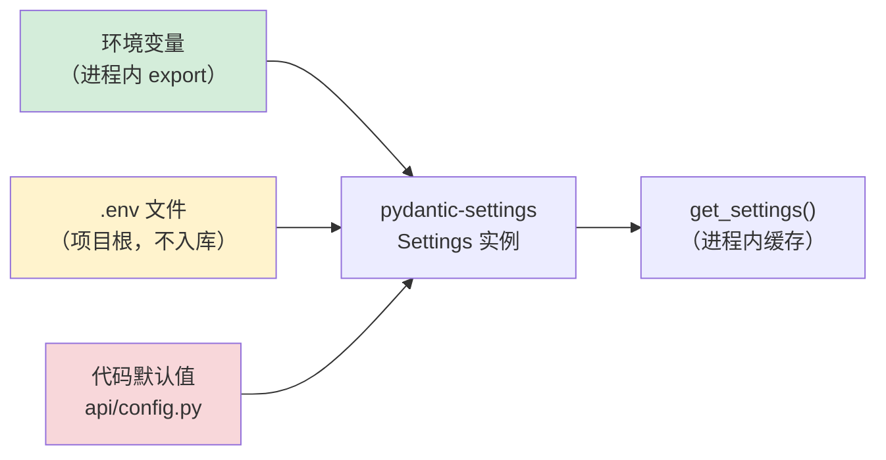
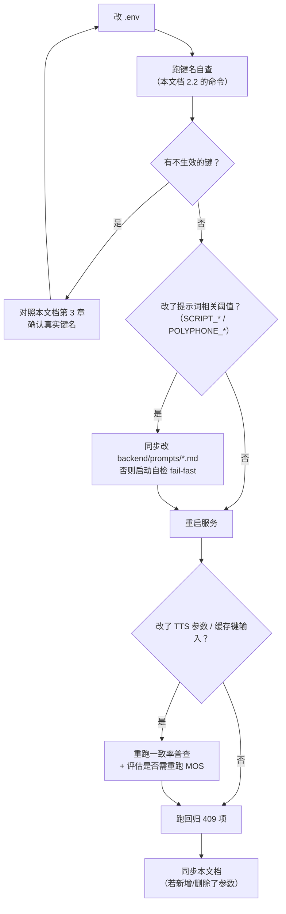

# 双人对话播客自动生成系统 · 项目参数说明（配置文档）

> 版本：V1.0.0　|　日期：2026-09-20　|　对应《双人对话播客自动生成系统_开发计划书_V1.21.0.md》11.3
> 参数来源：`api/config.py` 的 `Settings`（pydantic-settings）　|　字段总数：**92**
> 模板文件：`.env.example`（含 75 个键）　|　实际配置：`.env`（**不入库**）

## 版本记录

| 版本 | 日期 | 变更摘要 |
| --- | --- | --- |
| V1.0.0 | 2026-09-20 | 首次发布（D13 文档齐备阶段九项之一）。92 个配置字段按 15 组逐项说明（键名 / 默认值 / 单位 / 影响面 / 调参风险），标出 6 项**硬约束参数**；并记录本次核查发现的 **7 个静默失效键**（含 1 个拼写错误的键名，已修复）与 **25 个模板缺口**。 |

> ⚠️ **本文档最重要的不是参数表，是第 2 章**。
> 本项目配置层存在一个**会静默吞掉错误的机制**（`extra="ignore"`）：**键名写错不会报错，只会不生效**。
> 本次核查就在 `.env` 与 `.env.example` 里查出 **8 个不生效的键**，其中一个已经错了很久却没人发现——**因为它的默认值恰好与设定值相同**。

---

## 1. 配置机制

### 1.1 三层来源与优先级



| 优先级 | 来源 | 说明 |
| --- | --- | --- |
| **最高** | 环境变量 | 进程启动时已存在的变量 |
| 中 | `.env` 文件 | `env_file`，UTF-8 |
| **最低** | 代码默认值 | `api/config.py` 中各字段的默认值 |

**键名映射规则**：字段名 `.upper()` 即为环境变量名。`case_sensitive=False`，所以 `tts_max_workers` ↔ `TTS_MAX_WORKERS`。

> ⚠️ **没有 `env_prefix`**。这意味着键名**必须逐个与字段名对上**——`COSYVOICE_` 这类前缀只出现在确实以 `cosyvoice_` 开头的字段上（见 2.1 的实例）。

### 1.2 加载时机与热更新

| 项 | 结论 |
| --- | --- |
| 读取时机 | **服务启动时**读一次，`get_settings()` 带进程内缓存 |
| 改 `.env` 后 | **必须重启服务**才生效。**不存在热重载** |
| 例外 | 多音字词典、敏感词库、提示词都是**启动时读取**；`polyphone.json` 的注释虽写「改完重启服务即可」——**仍要重启，只是无需重新加载模型权重** |
| 数据集切换 | 改 `DB_PATH` 等路径后**必须调用 `reset_engine()`**（代码层约定），否则旧 engine 单例会把新配置静默吃掉 |

### 1.3 本机实测配置装载自检

```bash
cd /d/podcast-ai
D:/anaconda/envs/cosyvoice/python.exe -c "
from api.config import get_settings
s = get_settings()
print('app_port            =', s.app_port)
print('max_chars_per_seg   =', s.max_chars_per_seg)
print('tts_max_workers     =', s.tts_max_workers)
print('LLM key 已配置      =', bool(s.llm_api_key))
print('JWT secret 已配置   =', bool(s.jwt_secret))
"
```

期望输出（本机实测）：`app_port = 8000`、`max_chars_per_seg = 40`、`tts_max_workers = 1`、两个布尔均为 `True`。

---

## 2. ⚠️ 键名核查：如何确认你的配置真的生效

### 2.1 一个真实案例（本次核查发现）

```bash
# 实测三组对照（都是同一台机器、同一份代码）
$ MAX_CHARS_PER_SEG=88 python -c "from api.config import get_settings as g; print(g().max_chars_per_seg)"
88                       # ✅ 生效

$ COSYVOICE_MAX_CHARS_PER_SEG=77 python -c "from api.config import get_settings as g; print(g().max_chars_per_seg)"
40                       # ❌ 静默忽略（仍是默认值）
```

**结论**：`.env` 与 `.env.example` 里原本写的 `COSYVOICE_MAX_CHARS_PER_SEG=40` **从来没有生效过**。

| 为什么这么久没被发现 | `Settings` 的默认值**恰好也是 40** —— 键名错了，值却「看起来对了」 |
| --- | --- |
| 根因 | `SettingsConfigDict(extra="ignore")`：**未知键不报错、不警告，直接丢弃** |
| 处置 | 已把 `.env` 与 `.env.example` 的键名改为 **`MAX_CHARS_PER_SEG`**（值不变，行为零变化） |

> ⚠️ **`extra="ignore"` 是这把双刃剑的刀口**：它让「加了很多键但代码还没读」不致于炸服务，代价是**任何拼写错误都会变成静默失效**。这类缺陷与项目里其他「静默失败」同族（`except: pass`、`rmtree(ignore_errors=True)`）——**假绿比报错危险。**

### 2.2 自查命令（改完配置务必跑一次）

```bash
cd /d/podcast-ai
D:/anaconda/envs/cosyvoice/python.exe -c "
from api.config import Settings
fields = {f.upper() for f in Settings.model_fields}
for fn in ['.env', '.env.example']:
    keys = []
    for l in open(fn, encoding='utf-8'):
        s = l.strip()
        if not s or s.startswith('#') or '=' not in s:
            continue
        keys.append(s.split('=')[0].strip())
    bad = [k for k in keys if k.upper() not in fields]
    print(f'{fn}: {len(keys)} 键，不生效 {len(bad)} 个 -> {bad}')
"
```

**本机当前输出**（已修复后）：

```
.env: 76 键，不生效 7 个 -> ['TTS_REPORT_MEMORY', 'TTS_FALLBACK_ENABLED', 'TTS_FALLBACK_BASE_URL',
                             'TTS_FALLBACK_API_KEY', 'TTS_FALLBACK_VOICE_A', 'TTS_FALLBACK_VOICE_B',
                             'TTS_E2E_WARN_MIN']
.env.example: 75 键，不生效 7 个 -> （同上）
```

这 7 个键的定义见 5.1 节——它们**不是拼错**，而是**代码里根本没有对应字段**。两个文件均已在键名上方加了醒目的失效注释。

### 2.3 建议（尚未实施）

在服务启动时**主动校验 `.env` 的键集合是否都被 `Settings` 认领**，不匹配即 `log.warning`（而非 fail-fast）。这样配置漂移会在**启动日志**里暴露，而不是等到某天发现「怎么设了没反应」。

---

## 3. 参数总表（15 组 / 92 项）

> **阅读约定**：
> - 「键名」= 环境变量名 = 字段名的大写。
> - 「⭐」标记 = **硬约束参数**（见第 4 章，改动前必须读那章）。
> - 「风险」列只写**这一项改错了会怎样**。

### 3.1 服务与寻址（4 项）

| 键名 | 默认值 | 说明 | 风险 |
| --- | --- | --- | --- |
| `APP_HOST` | `0.0.0.0` | 监听地址 | 改 `127.0.0.1` 后局域网设备无法访问 |
| `APP_PORT` | `8000` | 监听端口 | 改端口要同步改前端代理 `vite.config.ts` |
| ⭐ `PUBLIC_BASE_URL` | `http://127.0.0.1:8000` | **RSS enclosure 与封面的对外基址** | 填错 ⇒ 播客客户端**拉不到音频**。必须填客户端访问得到的真实地址；生产应为公网域名 |
| `COVER_URL` | `""` | 频道默认封面地址 | 留空时回退到 `backend/assets/cover.jpg` |

### 3.2 存储与路径（8 项）

| 键名 | 默认值 | 说明 | 风险 |
| --- | --- | --- | --- |
| `DATA_DIR` | `./data` | 数据根目录 | 换路径**不会迁移旧数据** |
| `WORK_DIR` | `./data/work` | 任务中间产物；终态后清理 | — |
| `CACHE_DIR` | `./data/cache` | 句级缓存；**不受保留期约束** | 删了会让 `audio_cache` 整片失效 |
| `DB_PATH` | `./data/podcast.db` | SQLite 库文件 | 改后必须 `reset_engine()` |
| `AUDIO_DIR` | `./data/audio` | 成片目录 | 删了成片丢失（不可再生，除非重跑） |
| `PODCAST_DIR` | `./data/podcast` | 落盘的 RSS 文件 | 删了 `/feed/{token}.xml` 会 404（可用 `PUT /api/feeds/me` 重新落盘） |
| `AUDIO_RETENTION_DAYS` | `30` | 成片保留天数 | 0 或负值行为未定义，别这么设 |
| `WORK_CLEANUP_ON_TERMINAL` | `True` | 终态即时清理 work 目录 | 置 `false` 会累积（历史峰值 **3.47 GB**） |

### 3.3 鉴权与安全（7 项）

| 键名 | 默认值 | 说明 | 风险 |
| --- | --- | --- | --- |
| ⭐ `JWT_SECRET` | `""` | JWT 签名密钥 | **默认空 ⇒ 鉴权接口返回 500**。生产必须换随机值 |
| `JWT_ALGORITHM` | `HS256` | 签名算法 | 非对称算法未支持 |
| `JWT_EXPIRE_MINUTES` | `1440` | 令牌有效期（分钟） | 太长 = 泄露窗口大 |
| `AUTH_COOKIE_NAME` | `podcast_token` | 会话 Cookie 名 | 改名会让已登录用户掉线 |
| `AUTH_COOKIE_PATH` | `/` | Cookie 作用路径 | — |
| `AUTH_COOKIE_SECURE` | `False` | 仅 HTTPS 传输 | 生产（HTTPS）**应置 true**；本地 HTTP 置 true 会**导致 Cookie 不下发** |
| `AUTH_COOKIE_SAMESITE` | `lax` | SameSite 策略 | 前后端分域时需配合调整（未验证） |

### 3.4 RSS 与频道（4 项）

| 键名 | 默认值 | 说明 | 风险 |
| --- | --- | --- | --- |
| `FEED_TOKEN_BYTES` | `16` | 订阅 token 随机字节数 | 调小会削弱「不可猜测」强度 |
| `FEED_DEFAULT_LANGUAGE` | `zh-cn` | RSS 语言 | — |
| `FEED_DEFAULT_CATEGORY` | `Technology` | 默认 iTunes 分类 | 需为合法分类名 |
| `FEED_EPISODE_LIMIT` | `100` | RSS 最多包含单集数 | 调大 RSS 体积增大 |

### 3.5 大模型（9 项）

| 键名 | 默认值 | 说明 | 风险 |
| --- | --- | --- | --- |
| `LLM_BASE_URL` | `https://api.deepseek.com` | OpenAI 兼容端点 | 填错 ⇒ 任务全部 `FAILED` |
| ⭐ `LLM_API_KEY` | `""` | API Key | **只存 `.env`，禁止入库/入日志/入前端** |
| `LLM_MODEL` | `deepseek-chat` | 默认模型 | — |
| `LLM_REASONER_MODEL` | `deepseek-v4-pro` | 备选模型 | ⚠️ 部分 Key 的网关会把 `deepseek-reasoner` **静默映射为 flash**（实测），故改用 `/models` 明确列出的模型。**凡是「用了哪个模型」的结论，一律读响应体 `model` 字段，不以请求参数为准** |
| `LLM_TIMEOUT` | `60` | 常规主题超时（秒） | 太小 ⇒ 长脚本频繁超时 |
| `LLM_TIMEOUT_LONG` | `120` | 长脚本（≥2000 字）超时 | — |
| `LLM_MAX_RETRY` | `2` | 重试次数（tenacity） | SDK 层须设 `max_retries=0`，否则重试次数相乘 |
| `LLM_TEMPERATURE` | `0.8` | 采样温度 | 调低更稳但更呆板 |
| `LLM_MAX_TOKENS` | `4096` | 输出上限 | 太小会截断长脚本 |

### 3.6 内容与提示词（10 项）

| 键名 | 默认值 | 说明 | 风险 |
| --- | --- | --- | --- |
| `PROMPTS_DIR` | `backend/prompts` | 提示词目录 | — |
| `SENSITIVE_DICT` | `backend/dicts/sensitive_words.txt` | 敏感词库（9 组 / 74 条） | 删了 = 失去确定性过滤层 |
| `WORDS_PER_MINUTE` | `260` | 中文对谈语速（用于目标时长反推字数） | 改大 ⇒ 配额偏大、成片偏长 |
| ⭐ `SCRIPT_MAX_CHARS_PER_LINE` | `40` | 单行字数上限 | **与提示词声明、TTS 单句上限三重绑定**：改这里必须同步改 `script_system.md`，否则**启动自检 fail-fast** |
| `SCRIPT_WORD_TOLERANCE` | `0.10` | 字数配额容差 | 配合 `$tol_pct` 注入提示词 |
| `SCRIPT_WORD_QUOTA_ENFORCE` | `False` | 字数配额是否判硬性失败 | 置 `true` 会让可用率**恒为 0~70%**（D4 实测：模型每行稳定 12~21 字符且不随提示词变化）。**除非按字数卡验收，否则别开** |
| `SCRIPT_REQUIRE_ALTERNATING` | `True` | 强制 A/B 交替 | **与提示词声明绑定** |
| `SCRIPT_CORRECTION_RETRY` | `2` | 结构校验失败后纠错重试次数 | 调大增加 LLM 成本 |
| `SCRIPT_SELF_CHECK` | `True` | 生成后追加一次 LLM 合规自检（R9） | 失败仅告警不阻断 |
| `POLYPHONE_DICT` | `backend/dicts/polyphone.json` | 多音字覆盖表（**默认空**） | 见《…_RAG语料与提示词_V1.0.0.md》4.2：**未经验证的整词替换会主动劣化音质** |

### 3.7 CosyVoice 引擎与显存（13 项）

| 键名 | 默认值 | 说明 | 风险 |
| --- | --- | --- | --- |
| `TTS_MODEL` | `cosyvoice2` | 模型定稿标识 | — |
| `COSYVOICE_ROOT` | `CosyVoice` | 引擎源码目录 | — |
| `COSYVOICE_MODEL_DIR` | `pretrained_models/CosyVoice2-0.5B` | 权重目录 | 指向不存在的目录 ⇒ 启动后首次合成失败 |
| ⭐ `COSYVOICE_FP16` | `True` | 强制 fp16 | **置 false（fp32）会直接顶穿显存预算** |
| ⭐ `COSYVOICE_ONNX_DEVICE` | `cpu` | onnx 组件设备 | 改 `cuda` 会多占 **0.5~1.0 GB**（`PATCH-VRAM-01` 就是为省这块） |
| ⭐ `MAX_CHARS_PER_SEG` | `40` | 单段字数上限 | 净可用 **4.32 GB** 下的安全档；**60 字会顶到门槛**。⚠️ **键名无 `COSYVOICE_` 前缀**（见 2.1） |
| `TTS_DEVICE` | `cuda:0` | 推理设备 | 改 `cpu` 会慢到不可用 |
| `TTS_WARMUP` | `True` | 启动时预热一次 | 关了首句耗时异常（偶发长尾） |
| `TTS_EMPTY_CACHE_EACH_SEG` | `True` | 每句推理后清显存缓存 | 实测关闭**无收益**（早期「关掉能提速」的结论已作废） |
| ⭐ `TTS_MAX_WORKERS` | `1` | 并发数 | **6 GB 下必须单并发**；调大直接 OOM |
| `TTS_VRAM_BUDGET_ALLOC_MB` | `3600` | 显存预算（allocated，主口径） | 双口径不可只写一个：reserved 天然比 allocated 高 400~500 MB |
| `TTS_VRAM_BUDGET_RESERVED_MB` | `4200` | 显存预算（reserved，辅口径） | 同上 |
| `TTS_OOM_RETRY` | `1` | 单句 OOM 后重试次数 | **重试不偏移随机种子**（OOM 是资源问题，换种子无意义还会改变输出——与收敛守卫**刻意相反**） |

### 3.8 生成收敛守卫（5 项）

> **它解决的什么问题**：上游 `Qwen2LM.inference_wrapper` 是 `for i in range(max_len)`，**只在产出 stop token 时才 break**；未收敛时会吐满 `max_len` 个 token，输出是被截断的残句，且峰值显存随序列长度抬升。

| 键名 | 默认值 | 说明 | 风险 |
| --- | --- | --- | --- |
| `TTS_CONVERGENCE_GUARD` | `True` | 收敛守卫总开关 | 关了会产出残句 |
| `TTS_TOKEN_FRAME_RATE` | `25` | CosyVoice2 语音 token 帧率（Hz） | 决定「秒/token」换算；改错会让上限判据整体偏移 |
| `TTS_MAX_TOKEN_TEXT_RATIO` | `20` | token 上限 = `text_len × 本值` | **与上游默认一致，勿单独下调** |
| `TTS_GUARD_THRESHOLD` | `0.97` | 判为未收敛的时长系数 | 输出时长 ≥ 上限 × 本值即判未收敛 |
| `TTS_GUARD_RETRY` | `2` | 未收敛重试次数 | **重试会偏移随机种子**（固定种子下不偏移必然复现同一残句） |

**时长上限公式**：`上限 = text_len × TTS_MAX_TOKEN_TEXT_RATIO ÷ TTS_TOKEN_FRAME_RATE`。
例：20 字中文句 `text_len=20` → 400 token → `400/25 = 16.00 s`（与实测吻合）。

### 3.9 随机种子（2 项）

| 键名 | 默认值 | 说明 | 风险 |
| --- | --- | --- | --- |
| `TTS_RANDOM_SEED` | `42` | 随机种子 | 固定后「同（文本,音色,语速,语气）→ 同音频」，句级缓存语义才自洽；**种子已纳入缓存键**。填负数 = 关闭固定（不建议：缓存与基线都会失去可比性） |
| `TTS_SEED_RETRY_STRIDE` | `1` | 守卫重试的种子偏移步长 | 步长 0 会原地重试、复现同一残句 |

> 推理链路**三处随机源**都走 torch 全局 RNG：LLM 多项式采样、flow 先验噪声、HiFi-GAN 声码器噪声。固定种子因此能覆盖全部三处。

### 3.10 音色与说话人映射（4 项）

| 键名 | 默认值 | 说明 | 风险 |
| --- | --- | --- | --- |
| `VOICES_DIR` | `backend/voices` | 音色档案目录 | — |
| `SPEAKER_A_VOICE` | `voice_a` | 说话人 A 的音色档案 id（女声，F0 175.8 Hz） | 指向不存在的档案 ⇒ 回退或失败 |
| `SPEAKER_B_VOICE` | `voice_b` | 说话人 B 的音色档案 id（男声，F0 111.9 Hz） | 同上 |
| `SPEAKER_FALLBACK_ENABLED` | `True` | `voice_b` 缺失时回退到 A | 回退会**启动日志告警，不静默**；关了则缺失即失败 |

> **脚本里的 speaker 是 `A`/`B`，音色档案 id 是 `voice_a`/`voice_b`**，两者必须显式映射——不要指望同名。

### 3.11 音频后期（11 项）

| 键名 | 默认值 | 说明 | 风险 |
| --- | --- | --- | --- |
| `AUDIO_SAMPLE_RATE` | `44100` | 后期统一采样率（Hz） | 合成阶段保持模型原生 16k/24k，后期统一——混采样率是 D5 的必修项 |
| `AUDIO_CHANNELS` | `1` | 声道数 | 播客口语单声道即可 |
| `AUDIO_LOUDNESS_I` | `-16.0` | 目标响度（LUFS） | 播客标准 −16 LUFS |
| `AUDIO_TRUE_PEAK` | `-1.5` | 真峰上限（dBTP） | 留余量防 LAME 转码削波；调高易削波 |
| `AUDIO_LRA` | `11.0` | 响度范围 | — |
| `AUDIO_PAUSE_TURN_MS` | `500` | **话轮停顿**（换人，ms） | 太短听着「抢话」 |
| `AUDIO_PAUSE_SENTENCE_MS` | `250` | **句间停顿**（同一人，ms） | 太长听着「断气」。两个停顿时长均有测试锁 |
| `AUDIO_FADE_MS` | `30` | 片头/片尾微淡化（ms） | 防爆音 |
| `AUDIO_MP3_BITRATE` | `128k` | 输出码率 | — |
| `AUDIO_NORMALIZE` | `True` | 是否做两遍 loudnorm | 置 `false` 省一次全片扫描（见 R13），但响度不达标 |
| `AUDIO_LOUDNESS_TOLERANCE` | `1.0` | 第二遍后实测响度与目标的允差（LUFS） | 超出会告警；**第二遍必须用第一遍的 `input_*` 回填 `measured_*`**，否则测量无效 |

### 3.12 片头片尾（7 项）

| 键名 | 默认值 | 说明 | 风险 |
| --- | --- | --- | --- |
| `INTRO_PATH` | `backend/assets/intro.mp3` | 片头素材 | 素材须**自归一 ≈ −16 LUFS**（postprocess **对 intro/outro 不做 loudnorm**） |
| `OUTRO_PATH` | `backend/assets/outro.mp3` | 片尾素材 | 实测片尾 9.90 s / −17.25 LUFS |
| `AUDIO_REQUIRE_INTRO` | `False` | 片头缺失是否报错 | 默认跳过并告警；要严格卡就置 `true` |
| `INTRO_TEMPLATE` | `大家好，今天是（日期），今天的主题是（主题）。` | 片头动态文案模板 | ⚠️ **占位符用 `str.replace` 而非 `format`**（文案天然含括号）；改文案别引入 `{}` |
| `INTRO_SPEAKER` | `voice_a` | 片头音色 | — |
| `INTRO_TONE` | `用自然放松、亲切温和的语气说这句话，像和朋友聊天一样，语调轻快上扬但不夸张` | 片头语气指令 | ⚠️ **片头/片尾等「不能回显参考音频」的场景必须走 `zero_shot`（`tone=""`）**：`instruct2` 会**回显参考音频**（把参考内容读出来），这是致命缺陷不是风格问题 |
| `INTRO_SPEED` | `1.05` | 片头语速 | — |

### 3.13 FFmpeg（3 项）

| 键名 | 默认值 | 说明 | 风险 |
| --- | --- | --- | --- |
| `FFMPEG_BIN` | `""` | ffmpeg 路径 | 留空自动发现：`PATH` → winget 目录 → 常见路径 |
| `FFPROBE_BIN` | `""` | ffprobe 路径 | 同上 |
| `FFMPEG_TIMEOUT` | `600` | 单次调用超时（秒） | 长节目扫描慢，调太小会中断后期 |

**要求**：FFmpeg **≥ 9.0**，且含 `loudnorm` 与 `libmp3lame`（本机实测 **9.0.1 full build**）。

### 3.14 任务队列与恢复（3 项）

| 键名 | 默认值 | 说明 | 风险 |
| --- | --- | --- | --- |
| `TASK_QUEUE_POLL_S` | `0.5` | 队列轮询间隔（秒） | — |
| `STARTUP_RECOVER` | `True` | 启动时扫非终态任务并按状态分流 | **关了会让被杀进程留下的任务永久卡住**（前端进度条永远不动） |
| `STARTUP_AUTO_RESUME` | `True` | 恢复时是否自动续跑合成 | 关了则只落 `FAILED`、等用户手动点重试 |

### 3.15 运行时可观测性（2 项）

| 键名 | 默认值 | 说明 | 风险 |
| --- | --- | --- | --- |
| `SYNTH_TRACE` | `False` | 是否记录合成轨迹 | 开启会写 jsonl，长跑会占磁盘 |
| `SYNTH_TRACE_PATH` | `outputs/synth_trace/synth_trace.jsonl` | 轨迹文件路径 | — |

---

## 4. 硬约束参数（6 项，改前必读）

这几项的默认值是**在实测约束下推出来的**，不是保守估计。改动前请读完「为什么」。

| # | 参数 | 值 | 为什么是硬约束 |
| --- | --- | --- | --- |
| 1 | `TTS_MAX_WORKERS` | `1` | 6 GB 卡、净可用 **4.32 GB**。峰值 allocated 3513 / reserved 4024 MB，双并发直接超 4200 预算 |
| 2 | `COSYVOICE_FP16` | `True` | fp32 显存翻倍级增长，必超预算 |
| 3 | `COSYVOICE_ONNX_DEVICE` | `cpu` | 走 cuda 多占 0.5~1.0 GB（`PATCH-VRAM-01` 就是为省这块） |
| 4 | `MAX_CHARS_PER_SEG` | `40` | 60 字会顶到显存门槛；超了会被切句，破坏「一行=一口气」的节奏设计 |
| 5 | `PUBLIC_BASE_URL` | 视环境 | 填错 ⇒ 订阅端拿不到音频。**它不是「内部地址」，是对外地址** |
| 6 | `LLM_API_KEY` / `JWT_SECRET` | 视环境 | 空值分别导致任务必失败 / 鉴权接口 500。**且都不得入库** |

### 4.1 「调参不能提升的部分」——省下摸索时间

| 想做的事 | 结论 |
| --- | --- |
| 「减少段数省时间」 | ❌ **已作废的结论**。段数由 `MAX_CHARS_PER_SEG` 与文本长度决定，调它换不来 170~210 s |
| 「关闭 `empty_cache` 提速」 | ❌ 实测**无收益** |
| 「优化后期阶段提速」 | ❌ 后期**不是瓶颈**（端到端口径下占比小） |
| 「Windows 上开 `expandable_segments`」 | ❌ **在 Windows 无效**，已在代码中剔除 |
| 「截短 `prompt_text` 省事」 | ❌ **有害**：必须与参考音频一致，截短会造成音色漂移 |

---

## 5. 配置层的既有缺陷（本次核查结果）

### 5.1 失效键清单（7 项，均在 `.env` 与 `.env.example` 中）

| 键名 | 状态 | 处置 |
| --- | --- | --- |
| `TTS_REPORT_MEMORY` | `Settings` 中**无** `tts_report_memory` 字段 | 已加失效注释，保留备查 |
| `TTS_FALLBACK_ENABLED` | 无 `tts_fallback_enabled` 字段 | 同上 |
| `TTS_FALLBACK_BASE_URL` | 无对应字段 | 同上 |
| `TTS_FALLBACK_API_KEY` | 无对应字段 | 同上 |
| `TTS_FALLBACK_VOICE_A` | 无对应字段 | 同上 |
| `TTS_FALLBACK_VOICE_B` | 无对应字段 | 同上 |
| `TTS_E2E_WARN_MIN` | 无对应字段 | 同上 |

**这意味着什么**：

| 项 | 结论 |
| --- | --- |
| 计划书 P1「云端 TTS 兜底」 | **未实现**。`.env` 里那一整组配置是**空的** |
| 兜底决策 | 改为按端到端口径**人工评估**（1000 字：≤9 min 推进 / 9~10 min 提高缓存命中 / >10 min 才评估兜底） |
| 是否要补实现 | 属 **P1（条件性实现）**，当前判定为不需要——因为没有出现「端到端 >10 min」的场景 |

> **为什么不直接删掉这些键**：删了会丢失「计划书曾要求过这个能力、且曾配置过」的信息。加**醒目的失效注释**既避免误导，也保留了历史线索。

### 5.2 模板缺口（25 项：`config.py` 有、`.env.example` 未列）

这些字段用**代码默认值**运行，模板里没有出现。其中**有调参价值的**建议补进模板（下表已标注）。

| 字段 | 默认值 | 是否建议补进模板 |
| --- | --- | --- |
| `STARTUP_RECOVER` | `True` | ✅ 建议（影响崩溃恢复） |
| `STARTUP_AUTO_RESUME` | `True` | ✅ 建议 |
| `TTS_OOM_RETRY` | `1` | ✅ 建议 |
| `WORK_CLEANUP_ON_TERMINAL` | `True` | ✅ 建议 |
| `INTRO_TEMPLATE` / `INTRO_SPEAKER` / `INTRO_TONE` / `INTRO_SPEED` | 见 3.12 | ✅ 建议（片头可定制） |
| `FEED_EPISODE_LIMIT` | `100` | ✅ 建议 |
| `AUTH_COOKIE_SECURE` / `AUTH_COOKIE_SAMESITE` | `False` / `lax` | ✅ 建议（生产部署需改） |
| `SYNTH_TRACE` / `SYNTH_TRACE_PATH` | `False` / 默认路径 | ⚠️ 可选（调试用） |
| `MAX_CHARS_PER_SEG` | `40` | ✅ **已补**（本次修复） |
| `DB_PATH` / `AUDIO_DIR` / `PODCAST_DIR` / `WORK_DIR` / `CACHE_DIR` / `DATA_DIR` | 见 3.2 | ⚠️ 可选（默认即可） |
| `FEED_TOKEN_BYTES` / `FEED_DEFAULT_LANGUAGE` / `FEED_DEFAULT_CATEGORY` | 见 3.4 | ⚠️ 可选 |
| `JWT_ALGORITHM` | `HS256` | ⚠️ 可选 |
| `AUTH_COOKIE_NAME` / `AUTH_COOKIE_PATH` | 见 3.3 | ⚠️ 可选 |
| `COVER_URL` | `""` | ⚠️ 可选 |
| `TASK_QUEUE_POLL_S` | `0.5` | ⚠️ 可选 |

**本次已实际补进模板的只有 1 项**（`MAX_CHARS_PER_SEG`，因为它原本写错了键名）。其余标注为**建议**——是否补属产品决策，**不擅自改模板**。

---

## 6. 场景配方（可直接照抄的组合）

### 6.1 本地开发（默认）

```dotenv
APP_HOST=0.0.0.0
APP_PORT=8000
PUBLIC_BASE_URL=http://127.0.0.1:8000
AUDIO_RETENTION_DAYS=30
JWT_EXPIRE_MINUTES=1440
```

### 6.2 局域网给同事试听

```dotenv
PUBLIC_BASE_URL=http://192.168.1.100:8000   # 必须是同事手机能访问到的地址
AUTH_COOKIE_SECURE=false                    # 仍是 http，置 true 会导致 Cookie 不下发
```

前端代理 `target` 也要改成同一地址（`frontend/vite.config.ts`）。

### 6.3 生产（HTTPS 域名）

```dotenv
PUBLIC_BASE_URL=https://podcast.example.com
AUTH_COOKIE_SECURE=true                     # 生产必须开
AUTH_COOKIE_SAMESITE=lax                    # 前后端同域保持 lax
JWT_SECRET=<随机 64 字节>
LLM_API_KEY=<真实 Key>
STARTUP_RECOVER=true
STARTUP_AUTO_RESUME=true
```

> ⚠️ **前后端分域部署本项目未验证**：需要另行配置后端 CORS 与 Cookie 属性。当前架构依赖同源代理。

### 6.4 显存吃紧（更保守）

```dotenv
MAX_CHARS_PER_SEG=32        # 段更短、峰值更低，代价是段数变多
TTS_OOM_RETRY=2
```

> 注意：**不要用调低 `TTS_MAX_WORKERS` 之外的手段试图并发**——单并发是硬约束，不是保守选择。

### 6.5 调试合成问题

```dotenv
SYNTH_TRACE=true            # 落 jsonl 轨迹，用 scripts/analyze_synth_trace.py 分析
```

---

## 7. 配置变更流程



| 步骤 | 命令 / 动作 |
| --- | --- |
| 1 | 改 `.env` |
| 2 | 跑键名自查（2.2） |
| 3 | 若改了 `SCRIPT_*` / `POLYPHONE_*` 相关项 → **同步改提示词**（否则启动 fail-fast） |
| 4 | **重启服务**（无热重载） |
| 5 | 若改了 TTS 参数或缓存键输入 → 重跑 `scripts/verify_consistency.py` |
| 6 | 跑回归：`pytest --junitxml=...`，读三计数（应为 409/0/0） |
| 7 | 更新本文档 |

### 7.1 哪些参数改动会影响一致性/MOS

| 改动 | 影响音频内容 | 影响缓存键 | 需重跑 |
| --- | --- | --- | --- |
| `TTS_RANDOM_SEED`、`TTS_SEED_RETRY_STRIDE` | ✅ | ✅（种子在键里） | 一致率 + MOS |
| `TTS_MODEL`、`COSYVOICE_MODEL_DIR` | ✅ | ✅（模型版本在键里） | 一致率 + MOS |
| `SPEAKER_*_VOICE`、音色档案 | ✅ | ✅（音色指纹在键里） | 一致率 + MOS |
| `MAX_CHARS_PER_SEG`、`TTS_MAX_TOKEN_TEXT_RATIO` | ✅ | ✅ | 一致率 + MOS |
| 语速 `speed` / 语气 `tone`（单次请求参数） | ✅ | ✅ | 该次任务 |
| `AUDIO_*`（后期） | ✅（成片） | ❌ | 一致率（E1/E2 层）+ 抽听 |
| `WORDS_PER_MINUTE` | ⚠️（脚本长度） | ❌ | 建议重跑一致率 |
| `LLM_*` | ⚠️ | ❌ | 建议 |
| `JWT_*`、`AUTH_COOKIE_*`、`APP_*` | ❌ | ❌ | 回归即可 |

---

## 8. 与其他交付文档的关系

| 文档 | 关系 |
| --- | --- |
| 《开发计划书 V1.19.0》 | 本文档是该计划书 11.3 的落地展开 |
| 《双人对话播客自动生成系统_部署运维手册_V1.1.0.md》 | 参数在部署语境下的取值建议与故障排查 |
| 《双人对话播客自动生成系统_RAG语料与提示词_V1.0.0.md》 | `SCRIPT_*` 阈值与提示词声明的绑定关系 |
| 《双人对话播客自动生成系统_API接口文档_V1.0.0.md》 | 单次请求级参数（`speed` / `tone`）不在本表 |
| 《双人对话播客自动生成系统_测试报告_V1.1.0.md》 | 参数默认值的实测依据（显存、RTF、可用率） |
